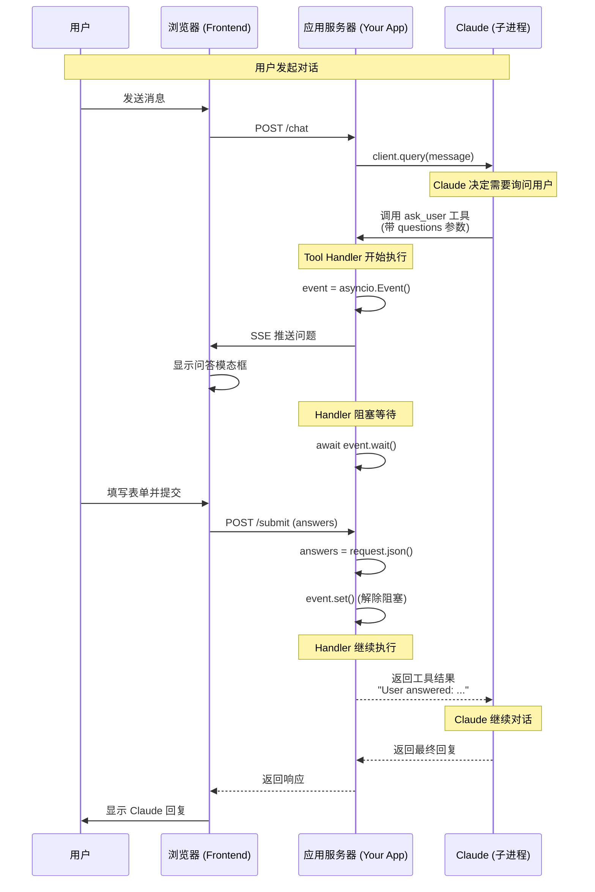
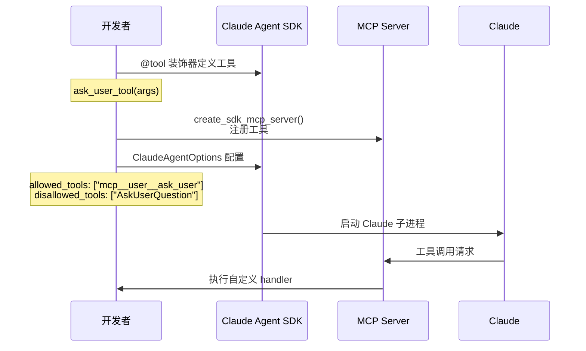
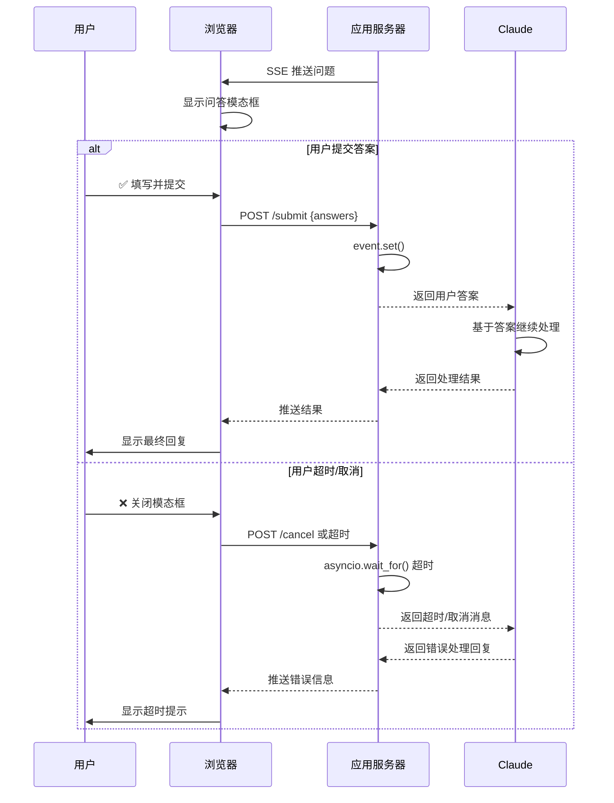

> 来源: When Claude Can't Ask: Building Interactive Tools for the Agent SDK
> 

## 核心交互模式

当 Claude 调用自定义 MCP 工具时，整个流程如下：



## 工具定义与注册



## 用户批准/拒绝决策分支



## 关键代码模式

### Tool Handler 阻塞模式

```python
# 在工具 handler 中:
event = asyncio.Event()
await send_questions_to_browser(questions)  # SSE 推送
await event.wait()  # 阻塞等待用户响应
return answers

# 在 /submit endpoint 中:
answers = request.json()
event.set()  # 解除阻塞

```

### 超时处理

```python
# 添加超时保护，防止 handler 永久阻塞
await asyncio.wait_for(event.wait(), timeout=300)  # 5分钟超时

```

## 应用场景

此模式可扩展到多种交互场景：

| 场景 | 描述 |
| --- | --- |
| 审批工作流 | 显示 diff，等待批准/拒绝 |
| 文件选择器 | 让用户基于提示浏览和选择文件 |
| 配置向导 | 带验证的多步骤表单 |
| 人工介入 | 在执行破坏性操作前暂停审核 |
| 富输入 | 图片标注、拖放等前端支持的任何交互 |