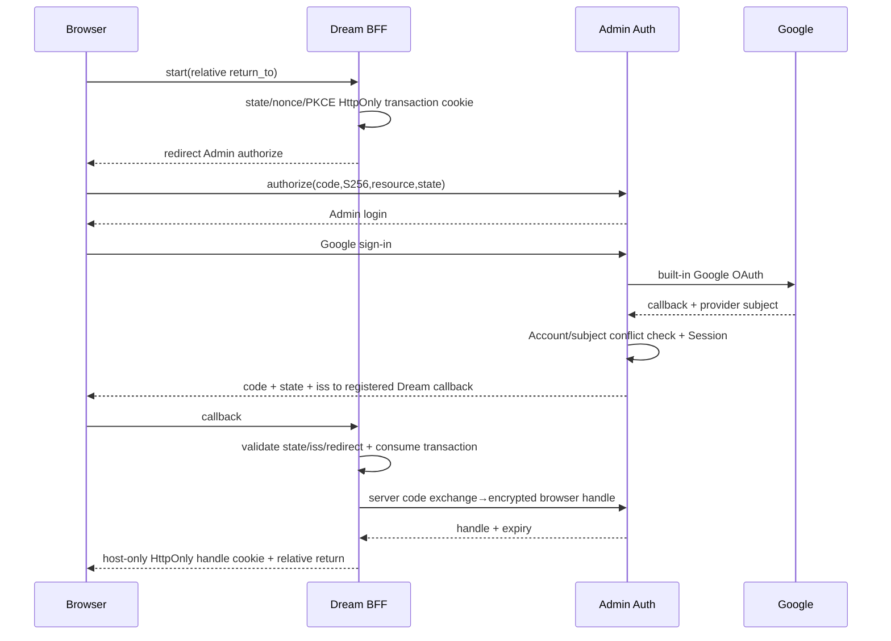
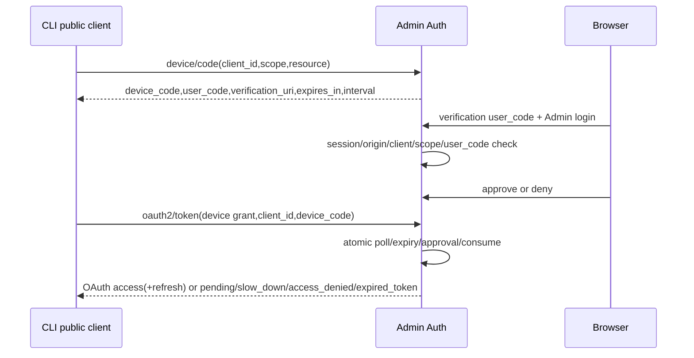
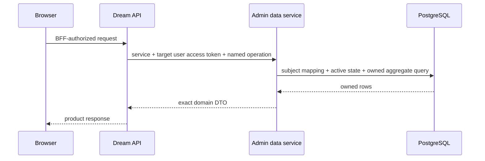

<!-- [Input] Admin/Dream published baselines, PostgreSQL FK/transaction catalog, Better Auth 1.7.4 official protocol. -->
<!-- [Output] Shared authentication, delegation, domain persistence and recovery contract. -->
<!-- [Pos] Canonical cross-project contract owned by the Admin implementation task. -->
<!-- [Sync] 2026-09-15: establish Better Auth and the Registry83 Admin-owned Dream data foundation. -->

# Admin / Dream 认证与领域数据契约

版本 `0.1`。状态：实现中；[实际83操作契约](admin-dream-operation-contracts.json)由真实 Zod 输入/输出与注册表生成。旧83全部 descriptor canonical hash保持，独立Preflight回执/委托artifact字节保持。resource/Thread、Editor/Session、Deck19、refs6、Workflow context/确认保护、Run5、Preferences2、Social9已有隔离技术回执；Preflight独立剩余读取/恢复/阶段故障/中断补验通过，首完整失败保留。Run create/retry六原accepted事实保持，剩余22拒绝/10GET通过230断言，九故障/实际COMMIT响应丢失业务68断言通过但命令exit1为cleanup helper作用域错误，独立只读cleanup exit0/3。Launch source/claim/finish与Failure77隔离组件已通过各自续验、故障和保留门禁。默认Workspace注册76及20入口/恢复门禁通过，隔离公开347/独立故障90/保留159通过。SystemConfig 与 Reflections section-config 已注册；Dream consumer 与正常业务验收仍 pending。其余领域仍按[全域映射](admin-dream-domain-implementation-map.md)关闭，本稿不是完整部署或真实业务回执。

### 创建与重试合同（注册72，独立隔离验证）

`workflow-run.create` 只接收 workspace_id、workflow_preflight_id、preflight_token、idempotency_key 与全NULL或完整 source_voice_thread_id/source_message_id/source_message_time。`workflow-run.retry` 只接收 workspace_id、workflow_run_id、workflow_preflight_id、preflight_token、idempotency_key，原来源不能替换。二者输出完整 `{run: WorkflowRun}`，OAuth dream:write 与 exact identity/unified0033 capabilities 必需；entity bearer不能创建或重试。Run key按原255 Unicode码点计数，stored display保留原Pydantic control/BOM接受规则，request另有原Python blank拒绝；旧70schema/hash不变。

Fresh创建在一事务内保存初始preflight1 Run、token map/PF consumed CAS、初始Transition1、queued2/Transition2和result/audit；fresh semantic只消费新PF并映射旧Run，consumed原token仅完整scope/key/fingerprint匹配时恢复旧Run。Retry保留原只读rollback后clean write，并重复terminal/source/current owner。原回执GET仅operation/request ID与OAuth，从结果推导owned workspace/Run/Thread、重验current immutable/frozen/source facts，返回原bounded DTO且不签发token；absent不推断rollback。新SHA create `531d41a45a7a745b120a83c57a88bdb0cf40ffcdc52d245d56bc0d372342eb08`，retry `01c72910ed713ce10c86e03c426f98549c81d1991cbaf05415b6bbcdbb8e9bd7`。代码注册与deterministic/source门禁不等于公开、真实模型或全领域验收。

### Launch 三个组件合同（注册75，独立隔离续验通过）

三个v1 write操作均要求OAuth `dream:write`及精确identity.better-auth.v1和unified0033；不接受entity grant，不新增DDL。`dream-launch-source.ensure`只接workspace、Deck、可空Agent、goal和业务key，由current actor派生UUIDv5 Thread/message、fingerprint、隐藏metadata与PG微秒时间；原application在Agent为NULL时省略fingerprint payload中的agent_id，隐藏metadata仍保存agentId:null。原source事务与receipt/audit同提交，replay保留parts/dispatch metadata/Thread ordering。

`dream-launch-dispatch.claim`只接owned workspace/Run与Dream原纯函数生成的instruction_text；current owned Run/binding/Thread/message完整事实派生Context10和issued claim，raw canonical overlay保持bigint/1.0/-0.0。claim提交后由Dream读取Voice并执行Runtime，`dream-launch-dispatch.finish`独立接issued claim与accepted布尔，将matching claim固定映射pending/dispatched，stale claim no-op。原source/finish GET恢复当前owner有效的历史bounded事实；claimed=true GET只在stored matching lease仍fresh且parts/context/Runtime metadata一致时恢复，finish后或过期409 DREAM_LAUNCH_CLAIM_STALE，不重新授权Runtime。

SHA source `cb498be127a6aca92c9e6e0cde099c9c80cf78ca2486186e9d043457c2263503`，claim `958549a9bfe4b02d8b31e1e538c81ffad020bb4525a328f542f865b377e8ec43`，finish `5aa3b738bef5319ee705f5851d83588e1d18dcaf37bdc5789267494fec480f2e`。Actual application-source修正2及受影响GET24、公开POST3/GET7和whole type/lint通过；新public harness static type/lint通过；首full公开query断言exit1保留，严格continuation只读核对唯一accepted Source后，余37POST/21GET/974断言与17表保护通过。Primary11故障/3实际COMMIT-loss补验exit0/308，自有22fault对象cleanup及独立SELECT-only preservation19通过，不声明单次38PASS。完整Agent/model/binding准备、failure recorder、Runtime和真实Launch22仍未完成；可空Agent的底层组件测试不代表完整application允许缺Agent启动。

### 默认 Workspace 合同（注册76，独立公开/故障/保留隔离合同通过）

`workspace-default.ensure` 严格接 `{}` 并输出 `{workspace_id:string}`，旧text ID不改为UUID。服务绑定OAuth dream:write、exact identity1/unified0033必需，不接受entity grant或actor/settings/default selectors。当前actor初始化锁先于original receipt锁；已有owned最早created_at/id记录按原顺序返回（不新增status filter），否则原default label/empty settings与server UUID在同UOW保存，result/audit同提交。原GET只 operation/request，重验empty inputSHA/allnullscope/current canonical owner；不存在明确absent，已转移资源403。

SHA `5fb0f70b1790979687090e6c04dd837f24ff0a4c0598d95d5085117e65aa2b95`；实际76生成与全部旧75 FULL descriptor/独立PFreceipt/delegation byte parity通过，新入口11/原GET领域9和whole type/lint通过。Root candidate21 source/unit是独立证据。Primary具名隔离target上的实际 public wrapper及 `node --import tsx tests/integration/adminWorkspaceDefault.contract.ts` exit0：14case、22原GET、347断言、17fullstate，首次3同original及2不同original共同启动，whole original helper与完整row/参数、legacy/tie/archived/currentowner及digest/scope拒绝通过。三事务fault/实际final-COMMIT-loss90及独立preservation159补验通过；正常业务/Runtime未执行，不据注册数声称全生产SQL关闭。

默认Workspace独立closing实际 `workspace76-atomic-recovery.mts` exit0/90：三Workspace/receipt/audit INSERTfault均503及protected17完整回滚，实际final COMMIT单次response loss后originalGET/replay200、Workspace/receipt/audit各一条；自有六fault对象cleanup PASS/none/history保留。SELECT-only `run-verify-workspace76-preservation.py` exit0/159保留旧125/首准备17表fullrows与五个positive originals。首fixture准备exit1及续准备exit0/16setup/17exact记录分别保留。Primary释放76冻结；这些独立技术范围不代替正常Google/业务/模型验收。

### 失败元数据合同（注册77，独立公开/故障/保留隔离合同通过）

注册77阶段全部已释放76完整描述/requirements/capability与独立PFreceipt/delegation字节保持。新增 `dream-launch-failure.envelope` strict `{workspace_id,workflow_run_id,error_code}` 输出完整 `{updated,workflow_run_id,thread_id,message_id,error_code}`，SHA `5967ae40f60858553f27f43dd83f021f93928e7c25c582d2e711d68df4d4e042`、schema1/write/dream:write/backgroundnull/exactidentity1/unified0033，无DDL。POST fixed server codec，原Run.fail已提交失败lifecycle后此metadata独立UOW保存fixedfailed/error/removeclaim及receipt/audit；OAuth或原Run/Thread persistence grant重复当前owner/source/µs验证。原GETOAuthwrite onlyoperation/request，通过原outputerror重建inputSHA/currentworkspace/source/scopes，历史completion不授予Runtime。实际continuation恢复6原结果、拒绝16 POST、完成27 GET、0正向POST、556断言；三事务fault与实际final-COMMIT loss通过126，SELECT-only preservation通过293并清理全部自有fault对象。该范围仅关闭已FAILED Run后的metadata组件，不代表新FAILED转换、完整启动或全域真实验收。

### SystemConfig 合同（注册80，公开与消费验收 pending）

`user-system-config.get` strict `{}`→`{config_json}`，`user-system-config.patch` strict十字段normalized patch→`{success:true}`；两者仅允许service-bound live OAuth，分别要求dream:read/dream:write和all-null Thread/Run/Editor scope。PATCH在同一identity/unified UOW内锁定当前`user_preferences`行，只更新`system_config_json`与时间，并将result/receipt/audit一起提交。Original GET仅接operation/request，要求OAuth write、合法小写SHA与null实体scope，只返回stored success，不读取或重放后来配置。

`thread-system-config.get` strict `{thread_id}`→raw `{config_json}`，重复当前owner SELECT。OAuth使用null实体scope；delegation必须是同Thread的`server-persistence`、Editor为null，nonnull Run必须等于`authoritativeWorkflowContext`当前Run。固定`userSystemConfigCodec.py`只接受server选择的read/merge action，保留bigint/1.0/-0.0/Unicode和未知stored keys；请求不能选path/executable/SQL/table/actor/Run。三SHA依次为get `6e9b75cccbc6e843a9c25a0cbec041fef4c6dff3919af8449eff03c23e779dd5`、patch `4f596ea05fe6adc5d881f5484b41ce40ae3a08358a7332f1b3b964112bd38b72`、Thread get `50ca46f131005c0e9831797fc9f2590984da8c8878fec92db61656ec9eefec8b`；artifact SHA `661823a292301a67b70ccff8068492a035cc6a3b90fe7abe4eb623f4bc161879`。Prior77 full descriptor、Preflight receipt、delegation artifact和Failure77 harness保持；当前只有静态合同门禁，公开PG/并发/故障/保留、Dream consumer和正常模型验收仍pending。

### Reflections Section Config 合同（注册83，公开与消费验收 pending）

`reflections-section-config.get` 只接 `{section}` 并输出原始 `{prompt_files_json:string|null}`；缺行返回null，空存储文本保持原业务的空对象结果，合法legacy object文本保持bigint、`1.0`、`-0.0`、Unicode和未知key字节。`save`只接section与Dream route已按五个允许文件名过滤的`prompt_files_json`，输出`{saved:true}`；`delete`只接section并输出`{deleted:boolean}`，缺行是成功no-op。三个操作仅接受service-bound live OAuth、对应`dream:read`/`dream:write`和all-null实体scope，要求exact identity/unified capability；不得传user/actor、path、SQL、default/effective或Runtime selector。

save/delete与result/receipt/audit在同一Admin UOW提交；相同request ID/输入恢复原结果，不同输入冲突。Original GET仅接write operation/request ID，以相同service与当前subject查找schema1、合法stored inputSHA、all-null scope的完整bounded result，不读取或重放后来配置。Dream继续拥有三个section/五文件策略、静态default、effective合并、空白处理、Agent编排和共享FS。三个SHA依次为get `2e1057f1cdd9248c2dbd603057310399e7ea5a51c90c601405ebb86868ccb640`、save `dc2ba4ee442618b4fd39d75b8ddf9ca834b25913d85e4bee0cba76d20b4b047f`、delete `8b03792f711e79c1d12343a93980da91d7675d280f9713ab454e6369b2b45967`；Registry83 artifact SHA `2ce9712bf6d5d16867ae4cc2d68c167b834cacee45d25b647d1ea18f7367d566`。Corrected57/57、whole type/owned lint/AST/JSON/Markdown/diff和生成parity已通过；旧80完整descriptor与独立Preflight/delegation字节保持。具名隔离公开组合48逻辑请求、258保留断言和2568事务/恢复断言通过；五注入故障保持125关系逐行回滚，save/delete各一次实际final-COMMIT响应丢失均由Original GET及同input replay恢复且无重复effect/receipt/audit。Dream consumer仍pending；普通数据库、Provider/model/Runtime/FS未执行。

## 背景与问题

Admin baseline `017f3ac` 使用自有管理 Session，Product API 使用 Dream 签发的 HS256 5 分钟 token；Dream baseline `7d38715c` 在 database、UOW、Notion、MCP、Plugin、Workflow、Story、后台资源 provider 和 startup/health 直接访问 PostgreSQL。迁移清单见 [Admin 初筛](dream-database-access-inventory.json) 和 Dream 任务 `docs/exec/dream-admin-data-inventory.json` 的函数/事务明细（跨 worktree依赖，交付时需纳入发布记录）。

旧 `database-schema-authority.md` 的 Dream repository/事务所有权与本次用户目标冲突。本次 Admin 接管全部生产 SQL、ORM、池、数据权限与持久化；Dream 保留产品交互、FastAPI 编排、Agent Runtime、SSE/EventBus、admission/leases 与共享 FS。

## 目标与边界

Admin 是唯一认证中心和数据库服务。没有任意 SQL endpoint、表列 CRUD、任意外部 user_id、Google token/ID token 当 API bearer、部署名称旁路或 Dream PG fallback。后台数据接口不能成为 Runtime control/restart/kill/shell 通道。Schema/DDL 仍仅由 Admin Drizzle 前向迁移管理。

## 概念与规则

### 主体与能力归属

| 能力 | 当前 | 目标 | 调用方式与回归 |
| --- | --- | --- | --- |
| Google、Account/User/Session | Dream 认证 + Admin 管理 Session | Admin Better Auth | 内置 socialProviders.google；旧业务PK不变 |
| OAuth client/code/token/device/refresh | Dream 自有 | Admin OAuth Provider | API接受目标 access token；设备 OAuth grant |
| 管理授权 | Admin RBAC | Admin RBAC | Session只证明登录，每次验证显式管理员映射与permission |
| 数据权限/SQL/事务 | Dream repositories + Admin domains | Admin domains | 服务身份与用户委托分别检查，实体行过滤 |
| Agent执行/流事件/leases | Dream | Dream | 数据持久化成功后原顺序发SSE，原失败语义 |
| 资源default/desired/effective | Admin desired + Dream PG provider | Admin desired + Dream HTTP provider | default/effective/LKG仍Dream composition root拥有 |
| FS/线程workspace/Notion拉取 | Dream | Dream | Admin保存元数据/权限，Dream执行已校验FS路径 |

### PostgreSQL 区域与角色

| 候选 | 证据 | 决策 |
| --- | --- | --- |
| 同实例不同database | users、platform投影、Story、Deck、Thread、Gateway/账本存在跨表FK和事务；PG无跨database FK | 不采用：需重复身份或分布式补偿，扩大数据搬迁 |
| 同database整域迁入dream schema | 跨schema FK保留，但需同步所有Drizzle查询、固定function/trigger引用和旧catalog契约，兼容视图增加第二访问名 | 当前不采用整域搬迁，额外DDL与兼容面不增强同一受限role的表级授权边界 |
| 同database identity独立schema、public按表职责、dream专用请求/回执 | 保留已有OID/PK/FK/原事务，独立credential与实际表/列/function ACL能拒绝跨领域权限 | 采用最小充分方案；正常credential与应用actual-role检查通过后才能宣称访问隔离已激活 |

确定的数据归属为：`identity` 保存唯一 Better Auth 协议/主体映射/BFF/委托；既有 Dream 业务表继续在 `public`，以领域表归属和表级 ACL 与 Admin/Gateway/Billing 共享控制表区分；`dream` 保存专用operation receipts和0060 immutable Preflight request绑定；`drizzle` 保存唯一迁移收据/capability。不存在已完成的整域物理dream schema迁移。users保留原PK/ID，identity显式映射FK引用它。选择与逐表范围见[数据库区域方案](admin-dream-data-ownership.md)。

角色合同：专用migrator拥有schema/DDL，Admin auth服务角色只访问identity和主体映射/必要users读取，Admin Dream服务角色只读写其明确归属的public业务表及dream专用请求/回执，并读取显式共享控制投影，Admin控制面角色不因此得到全部Dream表写权限；Dream应用没有PG DSN、角色或连接能力。所有app角色非superuser、非createdb/createrole、无schema CREATE，不拥有表；PUBLIC无CREATE/业务表权限。角色与ACL部署由显式发布runner检查实际current_user/pg_roles/has_*_privilege，不能用API capability代替。未满足必需ACL/capability fail closed；本轮不迁移真实数据库。

当前可审查 ACL runner 为 `drizzle/data/auth-access-policy.mjs`，只接受私有0600配置和既有具名可删除目标，默认dry-run，显式apply事务；拒高权、继承、表/schema owner角色。auth仅协议/BFF读写、subject和必要active canonical/platform/RBAC列读取、登录timestamp和append audit、受限注册函数EXECUTE；不直接写canonical/订阅/账本/历史正文。data持有Dream领域表与runtime/receipts、必要profile/provider-label/public-key/Gateway授权列，排除旧auth、Provider密文、账本/canonical写。control仅bootstrap Admin RBAC/identity权限；当前其他既有Admin API credential切分仍需全域收缩验证，不能以本runner宣称全部ACL完成。Dream没有CONNECT、业务表/函数权限。协调已通过隔离 runner dry/apply/repeat、16次真实角色权限尝试和受限AUTH/DATA连接的全部14 Thread公开操作；受控注册/旧主体采用37项也通过。完整domain ACL与正常库激活仍pending，详见验证矩阵。

0054–0058仅在协调隔离PG通过normal Drizzle replay；0055 creation CHECK 对NULL hash的三值缺口由0056前向修复，历史字节不改。0056 `identity.register_canonical_user` 以固定pg_catalog search_path和qualified表验证BA User、旧email/link冲突，插users触发原Free/default-model初始化并验证正allowance/activation，subject link同事务；PUBLIC EXECUTE撤销，调用前精确registration-integrity capability。0057 expand purpose/真实Editor Session FK，0058以显式非NULL和无NULL-array validation前向关闭ambiguity后才激活 runtime-purpose capability；冻结候选的升级/重复/并发/空库/两partial异常回滚、实际purpose拒绝和Session限定cascade均通过。正常业务库尚未激活。

### 认证拓扑（双方已同意）

Dream浏览器全部REST/SSE/Voice WebSocket经Dream同源BFF；Google登录发生在Admin origin。Admin Better Auth Session为host-only、HttpOnly、SameSite=Lax，Secure按明确URL HTTPS能力配置；跨站不共享cookie、不使用通配CORS。Dream cookie只含随机opaque browser handle，tokens保存在Admin加密browser-session领域，绑定服务client/origin/有效期。浏览器不保存access/refresh token。

Dream BFF start创建state/nonce/S256 PKCE verifier并放签名HttpOnly短期cookie；return_to只允许同源相对路径，阻止scheme、协议相对、反斜线、编码绕过。转Admin authorization code flow；callback核验state、issuer、callback exact URI、PKCE、单次cookie后由server兑换handle。所有写入验证exact Origin + BFF CSRF token；BFF代理只用配置的Admin/Dream backend，不接任意URL/用户头，WebSocket握手同样验证Origin/handle并服务端委托；连接不能把refresh/token放URL。Admin token端点按OAuth client认证而非依赖浏览器cookie。



Better Auth `sub`是其User ID，不能覆盖reserved claim。显式 `identity.subject_links(auth_user_id → users.id)`保存canonical映射。验证签名后用映射查用户及active platform投影；不能把sub当任意数字user_id。已有Google `oauth_accounts(provider,provider_sub)`是唯一旧账号映射证据；同邮箱不自动合并，冲突阻止登录并给明确恢复步骤。现有管理员通过独立映射到admin_users/RBAC，不根据邮箱/Session/Google登录自动授予管理权。迁移旧Account凭据必须加密，历史PK/关系保留；旧token在cutover撤销，不迁作新OAuth grant。

### Auth 协议路径与配置

Better Auth与`@better-auth/oauth-provider`配对锁定`1.7.4`，peer `better-call1.4.0/core1.7.4/utils0.4.2/better-fetch1.3.1`已registry核验；安装源码完成核验前列出的选项需验证。使用`jwt()`、`oauthProvider()`、`oauthDeviceAuthorization()`；disabledPaths包含Session JWT `/token`与Session device兑换 `/device/token`。

| 入口 | 合同 |
| --- | --- |
| `/api/auth/sign-in/email`、`sign-up/email` | 原密码/注册保留，原Dream六字符minimum、bcrypt/Admin scrypt兼容；不新增Google emailVerified门槛 |
| `/api/auth/sign-in/social` | Google内置provider，允许的callback由严格origin/redirect配置 |
| `/api/auth/callback/google` | Better Auth OAuth state/provider签名验证 |
| `/api/auth/get-session`、`sign-out` | Admin浏览器Session；不会直接作为Dream API认证 |
| `/api/auth/oauth2/authorize` | code only、S256、注册exact redirect、resource |
| `/api/auth/oauth2/token` | auth code/device/refresh grants，form-urlencoded |
| `/api/auth/device/code` | 注册CLI公有native client，无secret；scope/resource受限 |
| `/api/auth/device`、`device/approve`、`device/deny` | user_code检查与登录后的approve/deny；不得显示device_code |
| `/api/auth/oauth2/revoke`、`oauth2/introspect` | 按安装实现的适用撤销/客户端权限；JWT不可虚报即时撤销 |
| `/api/auth/jwks` | 公开非私钥JWKS；kid轮换 |
| issuer discovery | issuer=`BETTER_AUTH_URL` (exact origin + `/api/auth`)，公开metadata需转到handler |
| `/auth/sign-in`、`/auth/consent`、`/auth/device` | Admin登录/授权/设备交互页；保留管理UI独立权限 |
| `/api/admin/auth/login/logout/bootstrap/me` | 兼容原Admin响应、唯一BA Session；每次显式Admin mapping+active RBAC；旧HMAC发行/lookup退役 |

统一配置：`BETTER_AUTH_URL`、`BETTER_AUTH_SECRET`、`GOOGLE_CLIENT_ID/SECRET`、`AUTH_TRUSTED_ORIGINS`、`DREAM_API_RESOURCE`、`AUTH_DATABASE_URL`（Admin专用身份角色）、已注册BFF/CLI client、`DREAM_DATA_SERVICE_CLIENTS`（分客户端服务间配置）、`AUTH_TOKEN_ENCRYPTION_KEY`（32byte AEAD）。URL必须HTTPS或exact loopback HTTP，无credentials/query/fragment；origin/redirect分别精确校验。secret/capability缺失503，不能生成固定test secret或环境分支。

`ADMIN_CONTROL_DATABASE_URL` 明确仅用于一次性bootstrap control UOW；`DREAM_DATA_DATABASE_URL` 明确用于领域UOW，无凭据fallback。browser/runtime lifetime采用明确policy配置，不能将任意30天技术常量包装产品限制。原canonical/Admin采用通过显式 `drizzle/data/auth-subject-adoption.mjs` manifest/source fingerprint/Google-sub-FK或credential证据；同email不隐式提升或合并。两个旧密码冲突时停止，只有私有共同密码实际验证两旧hash后才可在明确manifest中采用一份兼容hash；历史行/PK/hash不修改，mapping/account/audit同事务。

Access token使用JWT ES256、typ=`at+jwt`、issuer exact、audience exact `DREAM_API_RESOURCE`、exp/iat/jti/client_id/scope，最大生命周期300s；ID token和Session JWT拒绝。scope `dream:read`/`dream:write`/`product:read`/`product:write`分别显式grant；offline_access才可刷新。客户端配置值通过发布能力返回而非硬编码主机。Dream JWKS仅从配置issuer获取，缓存/未知kid受限刷新、不能按token jku/x5u访问网络。Admin每次重新检查canonical用户状态/授权；Dream在需要即时状态边界走Admin principal验证，不宣称JWT离线即时撤销。JWT退出后既发token最多保留300s，自行添加grant/session denylist如实现必须明确并测。目标scope/aud错误403或invalid_grant，签名/过期/typ错误401。

### Device 与刷新状态



重复approve/deny不改变已完成决定；并发token兑换只能一个成功，过快轮询slow_down并增加interval，expired/consumed不能复活。CLI不内置client_secret。code/user_code/token不写公开日志，设备页显示已注册client与scope及错误恢复。

```mermaid
sequenceDiagram
 participant F as BFF or CLI
 participant A as Admin Auth
 participant DB as identity store
 F->>A: refresh(client_id,refresh_token,resource,scope)
 A->>DB: lock grant/token, verify binding/expiry/replay
 A->>DB: rotate old→used + successor atomically
 DB-->>A: commit
 A-->>F: new token pair
 Note over F,A: BFF serializes per handle; never blindly retry unknown refresh
 F->>A: old token replay
 A->>DB: revoke associated grant/token lineage per package behavior
 A-->>F: invalid_grant → login required
```

严格refresh replay interval=0；BFF每handle行锁串行刷新，失去响应后查询handle状态，不能重复外部refresh。如包无法提供并发/重放原子保证，Admin领域补齐并测试后发布capability。

### 服务身份、领域请求与恢复

前缀`/api/internal/dream/v1`。每次验证`X-Ink-Dream-Service`客户端ID与独立`X-Ink-Dream-Credential` secret（constant-time比较，TLS/loopback网络）+ `Authorization: Bearer <user access token>`，拒绝user_id/query/header覆盖。`DREAM_DATA_SERVICE_CLIENTS`是严格JSON数组：每项`{id,secret,origin,oauthClientId,redirectUri,backgroundScopes}`；secret最少32bytes，id唯一，origin精确，redirect同origin精确，backgroundScopes只取`capabilities:read/resource-policy:read/resource-observer:write/connectors:sync/plugins:catalog`的明确子集。每个请求重新按所选client验证，handle绑定该service client/origin/OAuth client，不能跨client resolve。Dream使用`INK_ADMIN_DREAM_SERVICE_CLIENT_ID`和`INK_ADMIN_DREAM_SERVICE_SECRET`。后台policy/observer/startup/scheduled connector走服务限定scope，不能借它查询任意user数据。后续可轮换service credential；不得把用户token当服务身份。

| Endpoint | 输入与输出 |
| --- | --- |
| `GET /capabilities` | service only；`{version,auth:{issuer,jwks_uri,algorithm,resource,clients,scopes},schema_capabilities,operations}`；schema capability真实读Drizzle ledger/catalog，operations仅列实现可调用名称 |
| `GET /principal` | service + user token；`{subject,canonical_user_id,client_id,scopes,status}`，不接受外部ID |
| `POST /browser-sessions/exchange` | service + code/verifier/redirect_uri/transaction_id，注册BFF绑定；Admin兑换并加密存token，返回handle/expiry |
| `POST /browser-sessions/resolve` | service + handle；锁定handle、刷新、验证有效主体，返回token/principal供BFF服务端代理 |
| `POST /browser-sessions/revoke` | service + handle；关闭handle并适用grant撤销，重复成功 |
| `POST /operations/{operation}` | service + user委托（或明确后台scope）；严格每操作schema；`{request_id,input}`，不接受SQL/table/column/user_id |
| `GET /receipts/{request_id}?operation=...` | 同服务+同用户/后台scope；只读自身请求；committed/result或absent，无记录不代表未知提交已失败 |

领域responses：`{data,request_id}`，错误`{error:{code,message},request_id}`；status 400输入、401身份、403scope/主体、404不存在或无权实体、409幂等/状态/CAS冲突、422领域规则、503配置/能力/数据库、504超时。错误与诊断脱敏，不回显SQL/DSN/正文/token；授权业务DTO保留原业务字段。严格请求/响应DTO（Zod）→领域服务→类型化Repository→Drizzle ORM/UOW，ORM实体与DTO分开显式映射，不返回原始rows；所有bigint/decimal标识为十进制string，时间ISO8601、null保留、页面cursor/limit明确。必要参数化SQL只在ORM事务内封装catalog/锁/复杂现有语义并记录依据，Dream只消费DTO。

DTO v1：principal=`{subject:string,canonical_user_id:decimal-string,client_id:string,scopes:string[],status:'active'}`。capabilities data=`{version:'1',auth:{issuer,jwks_uri,algorithm:'ES256',resource,clients:{browser:string,device:string},scopes:string[]},schema_capabilities:[{capability,version,contract_sha256}],operations:[{name,kind:'read'|'write',user_scope:string|null,background_scope:string|null,input_schema_version:1}]}`。browser exchange=`{request_id,transaction_id,code,code_verifier,redirect_uri}`→`{handle,expires_at:ISO8601}`；resolve=`{request_id,handle}`→`{access_token,expires_at:ISO8601,principal}`；revoke同resolve→`{revoked:true}`。exchange同client/transaction唯一+input SHA256绑定，handle与tokens一起加密以原transaction恢复，不重新消费code。receipt data=`{status:'committed',operation,request_id,result}`或`{status:'absent',operation,request_id}`。

operation capability还包含 `output_schema_version:1` 和 `contract_sha256`，摘要覆盖name/输入输出版本与真实JSON schemas；客户端必须核验全部字段。error仅允许已命名领域的封闭details；目前 `DECK_VERSION_CONFLICT` 的严格 `{current_draft_revision,current_version}` 保留原409反馈，未知/额外字段不输出。资源policy为configured/not_configured/invalid DTO，unavailable为503，不混淆非法持久值与连接失败。

实际capabilities.auth另有required `delegations` 数组，四项descriptor分别含name/method/path/输入输出v1/hash；special Runtime routes不经generic data dispatch。全部exact identity/delegation/purpose/unified schema满足后才广告四项。物理capability与API DTO hash独立，未发布或不匹配不可尝试旧hash并行fallback。

`workflow-context.resolve` 只接受 `{thread_id}` 与绑定服务的OAuth，反查完整linear retry graph、frozen source/binding/workspace、隐藏启动消息的root/source role/actor/goal/Deck/Agent/fingerprint/input hash与父/叶状态。全部事实通过后唯一active leaf输出原10字段context，valid terminal/普通Thread为null；缺/外部owned Thread无authority。冲突仅409安全code，不输出图或正文。operation容量由server policy保留256默认，与业务权限独立。

`chat-user-message.persist` 接收闭集 `{thread_id,message_id,parts_json,metadata_json:null|string,title_candidate}`，raw业务JSON保持数字类别，不经JS重编码；title candidate由Dream复用原pure parts/attachment算法，Admin按原50默认policy/Python whitespace/Unicode字符只填缺title。ownedThread lock后同事务调用stored confirmation guard，reserved namespace或DB metadata分类control；核对原derived PK/command hash/run/workspace/dispatching/有效current lease，允许较旧queued lease但不更新原row。generic user persist也按DB分类guard。原部分persist/新原子persist、result/receipt/audit同UOW；current focused87与type/lint及restricted public5families170断言通过。

`workflow-run.read` 和 `workflow-run.history` 接收 `{workspace_id,workflow_run_id}`，actor只从已验证主体推导。重复校验Run.created_by、workspace和当前workspace.owner；existing Run grant必须匹配原Run/source Thread。read投影原完整WorkflowRun，history按原transition_seq顺序并投影原Transition；共同receipt/session、failed details、source tuple、start/terminal time等lifecycle校验保留，微秒以整数比较不经Date重编码。缺owned Run为404，损坏数据503；新增read focused22/type/lint已通过，完整Run5公开163断言通过。`workflow-run.start/fail/cancel`为三个独立write合同：start要求OAuth并读取已持久化回执五字段、完整joint Session placement与rawPython lockhash，无client readiness booleans；fail/cancel只用原允许边/失败详情，既有Run grant保持原Run/Thread范围。三者owned Run/workspace lock、Session/status CAS、单history与receipt/audit同UOW，原current-target replay不增状态事件；新run_scope只加入内部receipt JSON可选字段，旧Thread/Editor receipt兼容。新增commands focused55/type/lint及完整Run5公开163断言通过，preflight/create/retry/output/confirmation组合commands尚未广告。

Deck19具名aggregate来源原事务，mutation discovery投影为write，OAuth逐owner校验，runtime bearer无Deck管理权限。版本raw JSON DTO与原Python canonical hash不变；全19公开合同发现JSONB负零normalization，前向0059追加nullable canonical text与JSONB一致CHECK和独立exact capability，新write同时保存两种投影、read优先text。历史NULL保留jsonb::text且不猜测旧numeric类别、不改hash/backfill；隔离迁移/catalog与修复后全部19公开246断言通过，正常库与consumer/refs/runtime验收尚未关闭。

长turn actor续期必须是Admin server-owned delegation：以当前目标access token与owned thread/run签发随机opaque凭据，绑定subject/service/client/thread/run/scopes/expiry；renew只接受既有该凭据并重新校验active user、实体关系及撤销，不接受任意actor_id。OAuth用户token过期不应迫使持久化丢失，也不能扩大后台权限。Runtime只拿必要entity范围API凭据，移除DATABASE_URL传递。Gateway保持原计费用户和模型scope；用户token签发权只能在Admin，Dream不能继续HS256签发Product/Gateway主体。具体delegation/Gateway DTO在实现与权限测试后冻结。

当前DTO：POST internal `/runtime-delegations` `{request_id,input:{purpose,thread_id,run_id:null|string,editor_session_id:null|string,scopes:[闭集]}}`→`{token:idg_43base64url,expires_at,maximum_expires_at,purpose,thread_id,run_id,editor_session_id,scopes}`，实际schema/hash见[委托artifact](admin-dream-delegation-contracts.json)。三种purpose互斥：server-persistence仅dream:read/write；gateway-cli仅messages:create/count_tokens/models:list；editor-stdio仅editor:read/write且绑定owned真实user_sessions.id。禁止混合范围，旧无purpose记录不解析为有效授权。public `/api/runtime-delegations/renew/revoke`只Bearer opaque+`{request_id}`并拒Cookie，renew只返回原expiry/context不另发token或扩范围。创建encrypted原结果同键恢复且核对token/context/max，append安全audit；renew/revoke同事务receipt/audit。服务重新检查active link/thread/optional run+workspace owner/Editor Session/Gateway key scope与配置 `DREAM_GATEWAY_CLIENT_BINDINGS:[{service_client_id,gateway_client_id,oauth_client_ids}]`，Gateway用原key.id/entitlement/billing。0057–0058隔离replay/catalog与用途、Session限定级联和公开Route通过。新create额外要求exact unified capability，并调用完整workflow-context.resolve比对authorityRun/null；原creation恢复/已创建resolve保留原实体范围供终态final persistence。完整activation与keeper、全下游旧JWT/DSN退出仍pending。

Editor stdio公开POST `/api/dream/v1/editor/operations/editor-state.load|editor-state.replace` 仅接收对应Session bearer和严格 `{request_id,input:{session_id[,editor_state]}}`，无需服务/数据库凭据。load返回 `{session_id,editor_state:null|完整EditorState,updated_at:null|ISO}`；缺失与存储损坏503区分。replace只更新owned现有Session，保留原最后写入生效；完整state.id必须等于Session，WritingThread引用验证owned。回执GET `/api/dream/v1/editor/receipts/{originalID}?operation=editor-state.replace` 同一Thread/Editor Session绑定，absent不声称rollback。换Session只能由OAuth授权的Dream服务新建grant。内部session.save/get/batch/list/text-list/delete采用同一严格DTO/所有权事务，upsert拒外部账户同名Session，保留name/labels NULL的COALESCE、PG微秒与Unicode预览；SSE/指标留Dream。`session.list` 可额外接收同一configured service的opaque委托，但必须先完整resolve token的有效期/撤销、`dream:read`、service、active canonical owner与Thread/Run ownership，再要求purpose=`server-persistence`且Editor Session为NULL；domain层重复只允许这一actor形态。其它Session操作不获得委托权限，`editor-stdio`仍只限Editor load/replace，Cookie拒绝。当前Editor/Session8操作已有受限AUTH/DATA实际公开103断言；本次权限扩展由独立Luna确认focused29、whole type、focused lint、Markdown与diff全通过，Registry83 DTO/hash/schema/artifact不变，consumer/真实业务仍pending。

Preflight ownerread/原token signing已完成43focused/type/lint，read已注册、公开待验证。原pft签发固定六字段按原Python JSON/HMAC与UTC六位微秒保留，Admin唯一明确INK_WORKFLOW_TOKEN_SECRET，无JWT fallback。ownerOAuth read只给active passed/unconsumed/unexpired记录token；passed但expired或consumed仍按原status返回null token，不隐式修改状态。实际原PreflightService的with-connection正常exit明确commit，而最终只读与Run cleanwrite边界rollback；execute保存checking、binding、immutable snapshot、PF snapshot绑定四次提交，再在最后同事务保存passed/failed、token hash、加密原result、receipt和audit。不能用笼统defaultrollback描述全部with-db。完整公开/故障验收和Run create/retry仍pending。

`workflow-preflight.execute` 只接受 `{workspace_id,deck_id,binding_revision,input_json}`，最后一项是原object JSON文本。每段重新验证service-bound OAuth与当前workspace owner，不接收actor/check/readiness selectors，不创建Run/Session或调用Runtime/FS。原request绑定由0060的九列immutable表保存，旧checking单独证明in_progress；新request遇到旧checking/pass可获得committed的bounded原模型，不能据status checking推断该request仍在执行。并发原request只运行一个pipeline，重复原request保留原ID/expiry/完整结果。已提交结果使用原AEAD密钥和完整service/subject/operation/request/input/PF/canonical/workspace绑定加密恢复；损坏状态503，不转换为absent。原response中的过期token可用于核对先前结果，但恢复不延长任何执行权限。

原receipt GET仍用 `/api/internal/dream/v1/receipts/{originalID}?operation=workflow-preflight.execute`，只允许相同service和OAuth owner、`dream:write`。返回严格absent/in_progress/committed；只有committed带先前加密恢复的bounded result，in_progress带当前checking完整模型和null token。实际独立[三态回执契约](admin-dream-workflow-preflight-receipt-contract.json) v1 hash `ad144287942f6f3ad2db82dda7c7b0f20cdf3578e68df4bd8e8b86e8dbbec2f2`；execute v1 hash `413db72b5d4bfc1fdf572d801aec4339a7b00549ea19ebc4025c67f5ae2cf494`，要求identity、unified0033、`dream.workflow-preflight-request.v1`精确cap。旧69 operation descriptor完整不变。checking结果不自动resume，absent不证明整体事务回滚；调用方必须保留原request并查询原证据。

Refs/Voice metadata新增6操作：refs list/prepare/replace和voice-analysis只OAuth，Threadruntime-read/voice-memory.resolve严格绑定owned Thread且允许原server-persistence grant。prepare投影metadata/rawcompat/manifest/digest供Dream原FS+CLI验证，replace持有installation共享锁校验bound evidence后原子refs与semanticdraft/receipt/audit。memory resolve保留原Python dict/legacy nonfinite判断与default Voice repair，只改Voice、不增Deckdraft，写回执独立Thread scope。metadata不回显artifact路径或接受客户端readiness声明；focused37/type/lint及公开6的104断言通过，实际artifact/CLI消费pending。OAuth-only管理与原回执在共用service边界明确拒绝idg为403，不送入JWT解析；Thread/Run/Editor的独立grant边界保持。

原RunService与Transition读取调用 `_parse_datetime(...).astimezone(UTC)`，Workflow层投影以整数微秒规范化UTC六位fraction；不改变Chat/Deck共享PG offset投影。完整Run5公开初轮firstread时间表示差异已据实际source修复，最小40unit、全typecheck与focused lint通过；原fixture预期/DB/严格完整时间断言未改变，原21cases重跑通过163断言。安全harness诊断仅列差异字段名与合法ISO时间/类型，不输出正文或凭据。

Preferences2仅当前OAuth owner：get严格返回原五配置字段、first_login_completed与可空微秒time，save只接受五个null/string字段，raw配置必须为JSONobject。NULL保留原COALESCE merge，空白文本仍可写入；不提供first-login/system配置或任意user selector。Coordinator原DTO/Repo/Service focused19/type/lint通过，薄Handler与same-UOW receipt分类已注册，公开2已通过78断言（owner/scope/idg403/NULL merge/raw config/rollback/并发/original receipt/单audit/first-login与system config保持），正常业务验收独立。

原RuntimeLock/固定八链compatibility与Preflight依赖正在Admin实施，暂未advertise：模型与显式Python业务strip分别按实际source oracle验证；两个安装优先规则、五域capability intersection、declared lock全集、context ANY历史materialization与Preflight latest smoke保持。四明确server capability flags默认不兼容，legacy production_ready仅保留元数据。原Snapshot按固定Deck/Voice/binding/profile内容生成canonical/hash，在caller UOW写入immutable存储；Runtime/FS/CLI不迁入Admin。

所有写入在同一Admin领域事务内验证主体/实体归属/前置状态，写业务与审计、持久化request receipt后commit。幂等键唯一(service,canonical subject或后台scope,operation,request_id)，绑定canonical JSON SHA256 input和独立Thread/Editor scope。同键同值返回既有结果，同键异值409；并发键串行，不能再执行写；失败事务无receipt，未知commit用原request_id重试/查询、不能新建ID。Runtime action回执 GET `/api/runtime-delegations/receipts/{request_id}?operation=runtime-delegation.renew|runtime-delegation.revoke` 只接受原opaque bearer；过期或撤销后仅可读取已提交原bounded DTO，不解析新principal/执行新renew/复活权限。POST renew先找同键已提交回执，再对新动作执行expiry/active/owner/Gateway校验；absent与过期不推断rollback。实际[四项委托契约](admin-dream-delegation-contracts.json)与受限公开Route恢复验证通过；新增Workflow/确认公开5family170断言通过；新Run读写公开pending。DB statement/lock/connection timeout配置明确，与HTTP deadline独立；HTTP abort不能声称rollback。Runtime尚未确认persist成功不能发该持久化成功事件；SSE/EventBus本身留Dream原实现。

```mermaid
sequenceDiagram
 participant R as Dream Runtime
 participant D as Dream orchestration
 participant A as Admin domain API
 participant DB as PG
 participant B as Browser SSE
 R-->>D: original Runtime event
 D->>A: named persist operation(service,user token,request_id)
 A->>DB: identity/owner + lock + mutation + audit + receipt
 DB-->>A: commit
 A-->>D: data + request_id
 D-->>B: original EventBus/SSE event
 Note over D,A: unknown response→same receipt/key recovery; no second Run/message
```



### 领域迁移注册表（必须逐项实现，当前全部待验证）

| 域/原模块 | Admin领域operation职责 | 必须保留的事务/权限 |
| --- | --- | --- |
| database user/auth | canonical principal /明确映射迁移，旧auth入口退役 | 不转发旧任意注册/密码/token存储API |
| Deck/Voice/content_versioning/default/plugin refs | owned list/get/create/edit/delete/publish/fork/sync/version commit/default reconcile | owned deck锁、删除运行冲突、version/draft revision/plugin refs同事务 |
| user_sessions/preferences/config/analysis/daily_picture | owned note/preferences/report/timeline领域操作 | typed config patch、first login、友人访问验证；batch/import原子 |
| friendship/invite/reflections | invite use/accept/reject/remove与用户范围任务结果 | requester/receiver验证、唯一friend/CAS、result/events同事务 |
| chat_thread/chat_message | thread create/bind/select/delete/title/session；message persist/page/process | immutable message envelope+final projection+thread touch、keyset顺序、owner检查 |
| workflow preflight/run/transitions/token/launch checkpoint | preflight/create run/consume one-time token/transition/bind/launch checkpoint | 原CAS/locks/receipt/run-thread状态原子，绝不重复run |
| agent_sessions/tool confirmations/remote guards | session attempt/lease metadata/receipt/confirm/result/restore validation | attempt/Run/thread一致性、旧lease语义；不移动Runtime执行 |
| Deck Plugin release/install/bind/revoke/rollback/runtime locks | domain release/install binding与lock/reconcile receipt | revoked不能重生；release/manifest/blob digest/checkpoint一致 |
| Claude Plugin install/catalog/workspace packer | catalog source、install operation lineage、owned refs/materialization metadata | filesystem执行留Dream，DB operation状态/CAS/审计Admin |
| Story Workspace/guidance/artifact index/launch/reentry/repair | owned workspace/story/character/scene关系与guidance+projection/checkpoint | 原复合事务；FS与DB版本/Run匹配，不删历史正文 |
| Notion connector/store | connector link/auth/scope/resource selection/snapshot commit/page/thread/scheduled candidate | connector owner/known scope、snapshot已提交ID、同步OAuth凭据加密 |
| Claude MCP repository/app settings/credentials/discovery/import | server/domain配置/credential/snapshot/import receipt | workspace权限、exact revision CAS、deny default apps、secret加密不回显 |
| resource_policy / resource_postgres_sink | `resource-policy.read` / `resource-observer.publish` | 后台scope；四项技术范围与精确组合、higher revision/LKG、observer实例顺序 |
| persistence/startup/health/catalog | capabilities/health read | 无Dream pool/PG secret/DDL；不依赖global head |
| model catalog/admin_product identity | 现Product catalog/principal | OAuth verifier替换HS256，保留权限/read UOW/定价快照 |

不是按SQL片段直接生成endpoint；先审原事务和正常/失败DTO再注册具体operation。最终交付表需对应每文件/函数的接口与验证回执，覆盖不全不得complete。

### 资源策略与共享文件系统

`resource-policy.read`仅取既有desired行及真实schema capabilities，不计算Dream effective、不推送控制。default/effective/revision/LKG独立，higher合法revision替换；同revision同值仅diagnostics，同revision异值/rollback invalid；后台Admin不可用保持LKG且不传播turn。四值1..9007199254740991正安全整数，组合memory bytes精确（BigInt检查），global effort属于policy，compact/context/output属于最终model，缺失不投影。

```mermaid
sequenceDiagram
 participant R as Dream Runtime
 participant FS as Shared FS
 participant A as Admin metadata
 participant DB as PG
 R->>A: owned artifact metadata/permission lookup
 A->>DB: subject/workspace/thread/Run relationships
 DB-->>A: bounded artifact DTO
 A-->>R: relative path + entity/revision/permission
 R->>R: realpath/root/thread/no-symlink checks
 R->>FS: exact permitted filesystem operation
 R->>A: artifact checkpoint(request_id,entity/revision,digest)
 A->>DB: atomic metadata/CAS + receipt
 Note over R,FS: CLAUDE_CODE_TMPDIR={AGENT_CWD}/{thread_id}/.claude-tmp; 0700; sandbox exact path
```

共享FS根由配置解析，不接受浏览器任意绝对path；Admin不执行Dream shell或管理Runtime。Workspace Mode关闭仍只建runtime root和`.claude-tmp`，不借此启用cwd/context/sidebar/sandbox。

## 验收与发布回滚

实现前补流程/模块/数据权限/测试方式/成功/失败恢复表；确定性与provider-free browser交Luna exact command/cwd/exit/output，migration/backfill/破坏性只由协调在具名隔离数据库验证。真实Google/业务/模型缺用户指定existing account/entity/model/credential时明确未执行。

Expand增加identity/handle/receipts/能力而不删旧auth；application compatibility双方按真实capability切换；显式可审计backfill保存旧PK/Google sub；validate mapping/ACL/catalog/事务；contract关闭Dream PG权限与旧auth、按schema迁移计划收缩兼容视图。回滚应用保留前向DDL与receipt；旧已撤销token不能通过回滚复活，必要时重新登录。发布前必须完成领域清单、同源REST/SSE/WS、Google/device/refresh/permission、data未知commit恢复与Runtime/FS回归；未满足不发布可用operation/capability。

Phase11完整execute实现但尚未注册：输入仅workspace/Deck/revision/raw object JSON，OAuth-only且每阶段重验原live subject/client/scope与capability；checking/binding/snapshot/snapshot-binding各自提交，final passed/failed+encrypted original receipt+audit同txn。独立0060绑定原service/actor/request/input digest/PF/canonical/workspace及execution ownership，拒后续同request换input；原request checking lookup仅返回in-progress evidence，不自动重做orphan。新request同fingerprint可复用checking/passed-unconsumed并提交其bounded原结果。receipt lookup三态absent/in_progress/committed，先原request digest lock再读association/receipt；absence不代表任何已有事务回滚。pft只在AEAD完整绑定bundle中恢复，原expiry保持，不能由旧结果获得新TTL。首轮55确定性/lint通过，完整source/receipt/公开事务与normal activation待验。

Social9由协调primary独占实际DTO/Repository/Service/source设计与fixtures；本任务薄Handler/Registry/Receipt复用严格service OAuth、identity+unified0033、same-UOW原result/audit。九项friend invite/request/relationship与好友图片只读仅OAuth owner可调用，idg无管理authority；read不依赖邀请码生成policy，closed原业务failure结果同样绑定原request。原60contract/hash逐项保持，新增9actualZod/hash与primarysafe artifact一致；focused25/type/lint passed，实际原AST22source cases和受限公开9/230断言exit0，原首次typegate2记录保留。DREAM_FRIENDSHIP_POLICY_JSON显式原code_length6/lifetime604800秒/generation_attempts64，最后一项仅碰撞执行预算。

<!-- [Sync] 2026-09-15: registered77 first public failure and bounded independent harness continuation. -->

Failure77 first public verifier exited1 on Editor expected-code mismatch. Independent SELECT-only partial proof287 retains six complete originals and full protected17/old125; actual Editor probe6 returns403 DELEGATION_ENTITY_DENIED because required Run binding is checked before scope. Production authorization/registered77 DTO/hash remain unchanged. New independent harness restores all six complete originals/current owned failed Runs/source UPDATE bytes without POST, then executes all16 denied POSTs/all27 GETs from unchanged strict22/27 facts. Mandatory private full17 prepublic/current evidence prevents historical-row mutation or skipped coverage. Static/public continuation and atomic recovery remain pending; original first exit1 retained, no single22 full-pass or normal-model claim.

<!-- [Sync] 2026-09-15: independent continuation PUBLIC READY after actual raw gate review. -->

Actual document/freeze gate read: Markdown221/356/247/0missing, frozen8 changed[] and diff each exit0. Newguard12/12/no skips and focused type correction/ownedlint all passed; first tsc2 retained. Producer sent exact mandatory evidence schema/command and PUBLIC READY to primary, then refroze new verifier/helper and production77/original failed harness. Primary may now prepare independent negatives/current17 anchor and last freshOAuth; actual public16/27/6/0 counts, fault/COMMIT-loss/preservation remain pending. No private fixture/credentials/PG or normal-model execution by producer.

<!-- [Sync] 2026-09-15: independent continuation actual public preflight exit1 retained. -->

Producer read actual node/public-wrapper continuation receipts: both exit1, safe FAIL label preflight/status null/code null. The6 restored-original/16 denied-POST/27GET contract did not complete. Earlier static12/type-correction/lint/docs/frozen8 PASS remains separate; original firstpublic exit1/partial287/Editor6 retained. Actual fresh-negative prepare exit0/23setup retained six positives/full17/oldRun states/oldexpiry with zero positive replay; earlier fixture continuation exit0/55setup/12operands/old125 retained independently. Primary private SELECT-only staged diagnostic requested, no production/harness guard weakening or accepted-index inference. Source remains frozen, public/atomic/preservation and release pending.

Round27 actual diagnosis: producer逐字读取safe sandbox/network command receipts。默认sandbox preflight exit1，stage verification.target_role/classification loopback_permission_denied/assertions0/public_cases0/business_mutation false/normal untouched；同一Root-owned SELECT-only诊断在明确隔离loopback network permission下exit0/23，strict fixture/evidence/coverage/retention与target/三role/fivefalse/dataDir/current17均通过，public_cases0/business_mutation false。归类harness权限前置，不是production/fixture/guard defect；不修改77或new continuation。Root只因300s凭据实际过期准备exclusive新signer/fixture/evidence和2个新的public negative grants，复用已存在queued operand/ordinaryEditor事实，不重演source/claim/positivePOST，不重置oldgrant expiry/Run/graph；随后只在相同scoped-network边界重试冻结continuation。原两次exit1均保留，retry结果未通过前不claim6/16/27。

Round27 scoped-network retry actual acceptance: producer逐字读取actual node command receipt与Luna wrapper receipt。`node --import tsx tests/integration/adminDreamLaunchFailureContinuation.contract.ts` exit0；6个原结果只读恢复、16 denied POST、27原GET、0 positive POST、556 assertions、17 protected tables。First public exit1、first continuation preflight exit1、partial287与Editor6均独立保留；不能表述为单次22全PASS。Whole original recorder already-FAILED source path被恢复验证，prior FAILED Run保持；new FAILED transition、Runtime、provider、FS、normal account/model均未执行。Root retryprep exit0/8仅复用1 queued operand/new graph0/2fresh negative grants/full17 oldrows保留/新300s OAuth last-signed。Producer未读取privatefixture/evidence/credentials或PG正文。Production77、首次harness、新continuation源继续冻结；Primary metadata/receipt/audit fault、actual final-COMMIT-loss/preservation/own cleanup及RELEASE仍pending。

Failure77 final isolated evidence actual raw receipts read: atomic command exit0/126. Faults source_update, receipt_insert and audit_insert each returned503 AUTH_SERVICE_UNAVAILABLE with all17 relations byte-exact rollback and prior FAILED Run preserved; each owned trigger/function pair cleanup passed. Actual final-COMMIT loss injected once: initial503, original GET200 and replay200, exactly one source metadata effect/receipt/audit; whole original recorder and prior Run full row retained. Cleanup removed six owned objects, active fault objects none, history retained. SELECT-only preservation exit0/293 retained original125/prepublic125/postpublic17 full rows, all six positive owner/digest/scopes and complete already-FAILED Run transitions/PF/bindings/history; active fault functions0. Normal database/services, provider/model/Runtime/FS untouched. Together with independent public6/16/27/0/556, registered77 already-FAILED envelope component is isolated-closed; no claim of a newly executed FAILED transition, whole failure application, normal/real model or ALL-domain closure. Production/harness remains frozen until primary explicit RELEASE before Round26 wiring.
