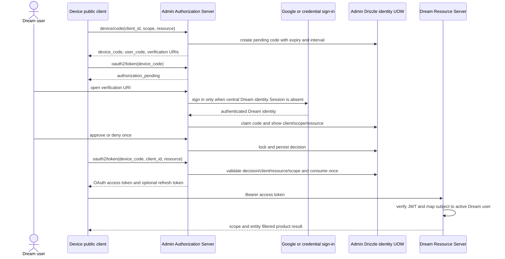

<!-- [Input] Installed Better Auth/OAuth Provider 1.7.4 device routes, Admin device UI, registered public client and normal-service receipts. -->
<!-- [Output] Current RFC 8628 interaction, OAuth token, state, error, refresh and revocation contract. -->
<!-- [Pos] Authoritative Device Flow document linked from unified auth architecture and the cross-project contract. -->
<!-- [Sync] 2026-09-17: reconcile the completed real approve/deny/exchange/refresh validation and a live Gateway canary without logging codes or tokens. -->

# 设备授权

## 背景与问题

CLI、Desktop、Agent 和 MCP 客户端不能保存服务端 OAuth client secret，也不能读取 Dream 用户数据库。Admin 是唯一 OAuth Authorization Server；Dream 设备应用是 public OAuth client，Dream 用户是授权该 client 访问产品资源的主体。两者不能混称，设备登录也不能产生 Admin 管理员 Session 或 RBAC 权限。

当前安装的 `better-auth` 与 `@better-auth/oauth-provider` 均为 `1.7.4`。本地包源码确认 `oauthDeviceAuthorization()` 复用 Device Authorization 的 code/approval 状态机，但把兑换接到 OAuth Provider 的 `/oauth2/token`；`/device/token` 只会签 Session token，因此在 Admin 配置中被关闭。实现依据为本仓库 `app/lib/auth/server.ts` 和安装包 `@better-auth/oauth-provider/dist/index.mjs`，不能直接照搬其他版本 API。

## 目标与边界

- Admin 创建、认领、批准或拒绝 device code，并签发、刷新和适用地撤销 OAuth token。
- 设备 client 是无 secret 的 public client；固定 secret 不得打包到 CLI。
- 设备得到面向 Dream resource 的用户委托 access token；不能得到 Admin 管理权限，也不能用 Google token、ID token、Better Auth Session token 或任意 user ID header 替代。
- Dream Resource Server 校验 ES256 签名、issuer、Dream audience、`at+jwt`、时间声明、client、subject 和 scope，再由 `identity.subject_links` 映射 `public.users`。
- Dream confidential service client 的 `client_credentials` 只用于服务器后台身份，与设备 public client、Dream 用户和 Admin operator 分离。
- 授权页只显示 client、请求 scope、目标 resource 和批准/拒绝动作；不增加重复确认。

## 概念与规则

| 字段 | 规则 |
| --- | --- |
| `device_code` | 仅设备和 Admin token endpoint 使用；单次消费、带到期时间，不进入公开日志 |
| `user_code` | 用户在 Admin 授权页核对；规范化后定位同一设备记录，不进入业务回执 |
| `verification_uri` | Admin 授权页地址；由服务端配置生成 |
| `verification_uri_complete` | 包含 `user_code` 的便捷地址；仅用于当前授权，不写应用日志 |
| `expires_in` | 当前插件配置返回 1800 秒；到期后只能重新发起 |
| `interval` | 初始 5 秒；过快轮询返回 `slow_down` 并增加 5 秒 |
| client | 已注册 public device client；`token_endpoint_auth_method=none`，不含 secret |
| scope | 必须是 client 与 resource 共同允许的显式 scope；不接受任意字符串 |
| resource/audience | 当前 Dream API resource；兑换时只能等于授权时绑定的 resource |
| access token | Admin 签发的 ES256 `at+jwt`，最长 300 秒；设备只把它发给目标 Resource Server |
| refresh token | 只有请求并获准 `offline_access` 时才签发；轮换、重放和撤销由 Admin OAuth Provider 管理 |

实际入口：

| 方法与路径 | 输入与输出 |
| --- | --- |
| `POST /api/auth/device/code` | `client_id`、`scope`、`resource` → RFC 8628 六字段 |
| `GET /api/auth/device?user_code=…` | 使用现有 Dream identity Session 认领当前请求，并返回 client/scope/resource 状态 |
| `POST /api/auth/device/approve` | JSON `{userCode}`；只允许认领该 code 的当前 Dream 用户批准 |
| `POST /api/auth/device/deny` | JSON `{userCode}`；只允许认领该 code 的当前 Dream 用户拒绝 |
| `POST /api/auth/oauth2/token` | `grant_type=urn:ietf:params:oauth:grant-type:device_code`、`device_code`、`client_id`、`resource` → OAuth token set |
| `POST /api/auth/oauth2/token` | refresh grant；同一 lineage 轮换，replay interval 为 0 |
| `POST /api/auth/oauth2/revoke` | 对安装版本实际支持的 refresh/access token 执行 client-bound 撤销 |

## 正常流程

未登录用户完成 Google 登录后仍使用原 `user_code` 恢复授权上下文；Admin 在 GET/approve/deny 时重新查设备记录和当前 Session，不能相信 return URL 中的 client、scope 或 resource。Google callback 只建立 Dream identity Session，不授予 Admin operator 权限。

## 状态转换与失败反馈

| 当前状态/触发 | 对外结果 | 数据行为 |
| --- | --- | --- |
| `pending` 且未批准 | `authorization_pending` | 只更新合法轮询时间 |
| 轮询早于 interval | `slow_down` | interval 增加 5 秒 |
| 当前 Dream 用户批准 | `approved` | 决定一次写入；重复批准不改变主体 |
| 当前 Dream 用户拒绝 | `denied` / `access_denied` | 不签 token；重新使用 code 仍拒绝 |
| 超过 expiry | `expired_token` | code 不复活，客户端重新开始 |
| 未知或不匹配 client | `invalid_client` 或 `invalid_grant` | 不改变原 code 归属 |
| 未授权 scope | `invalid_scope` | 不创建 code/token |
| resource 非法或兑换时扩大 | `invalid_target` | 不签 token |
| code 已消费或重复兑换 | `invalid_grant` | 不再次签 token |
| approve/deny 并发 | 首个合法决定生效 | 同一 Drizzle UOW 锁定记录，后续返回已处理错误 |
| token endpoint/ORM 未知异常 | `temporarily_unavailable` 503 | 当前事务回滚；不记录 SQL 参数或凭据 |

插件内部继续使用 `pending`、`approved`、`denied` 和消费记录；页面可以显示“等待授权”“已允许”“已拒绝”“已过期”，但不得为显示文案改第三方状态值。

## Refresh 与撤销

设备未请求 `offline_access` 时不签 refresh token。已签 refresh token 时，Admin 在同一 client/resource/scope lineage 中原子轮换；旧 token replay 使该 lineage 按插件行为失效，调用方收到 `invalid_grant` 并重新登录。未知 refresh 提交结果不能盲目重放，BFF 或设备客户端需要按自身持久状态恢复。

ES256 access token 是最长 300 秒的离线 JWT。当前资源服务每次重新检查 canonical Dream 用户与实体权限，但不能声称退出或 refresh 撤销会立即使所有已签 JWT 失效。2026-09-17 的 Gateway canary 未请求 `offline_access`，因此没有 refresh token；对该 access token 调用 `/oauth2/revoke` 返回 400，令牌只按 300 秒上限自然失效。这个结果不覆盖此前已经通过的 refresh rotation/replay 和 refresh grant 独立 revoke 回执，也不能写成 JWT 已即时撤销。

## 页面行为与安全

- 未登录时进入唯一 Admin Dream 登录页；成功后恢复同一授权上下文。
- 授权页展示注册 client 名称、请求 scope 和目标 resource；批准与拒绝各一次，不增加第二个确认弹窗。
- 无效、已消费或过期 code 给出重新从设备端开始的反馈，不显示数据库状态或 token 内容。
- Browser、公开日志、Admin audit、Gateway payload 和测试回执都不得保存 device code、user code、access/refresh token 或 client secret。
- Secret 只存在于承担对应能力的服务端配置。public device client 没有 secret；Dream service client secret 只用于服务器从 token endpoint 换取短期 `client_credentials` bearer。

## 影响范围与验收

本机正常 Admin/Dream 服务已经通过公开入口验证：完整 RFC 8628 六字段、`authorization_pending`、`slow_down`、approve、deny、过期、重复和并发决定、OAuth token 兑换、refresh rotation/replay、refresh revoke、access expiry、未知 client/resource、外部 user ID 与未授权 scope。设备码与 token 未写入公开回执。

2026-09-17 追加真实 Gateway canary：现有 Dream 用户 Session 批准 public device client，请求 scope 仅为 `messages:create`；兑换得到无 refresh 的短期用户 token后，与已轮换的 Dream canonical-subject Gateway service key 同时调用公开 `/v1/messages`。Gateway 返回 200，记录 request `req_b912a4968bbc464fb66bf4b656a7aa6d`、11 input tokens 和 5 output tokens。该回执证明 service client 不能代替用户主体，也没有创建 Admin Session。它是小额真实模型/Gateway验收，不能替代完整 Thread/Run/continue/cancel/SSE 业务旅程。

发布顺序仍为 Admin OAuth catalog/capability → Dream client compatibility → 正常公开验收 → 旧入口 contract。回滚不能恢复 Dream 自签 token、Session-token device exchange 或固定 public-client secret。完整身份、数据库与发布关系见[跨项目契约](admin-dream-auth-data-contract.md)，当前通过/待验收项见[验证矩阵](../verification/admin-auth-data-provider-matrix.md)。
