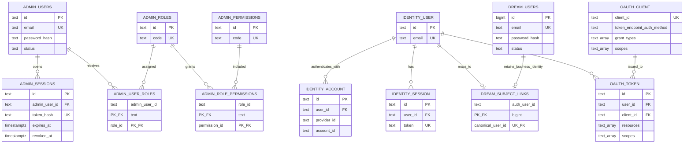
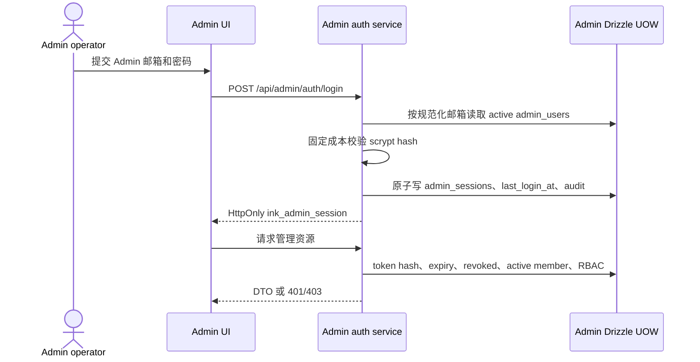
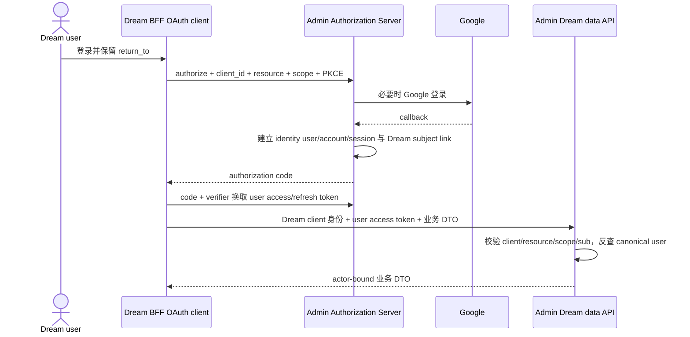
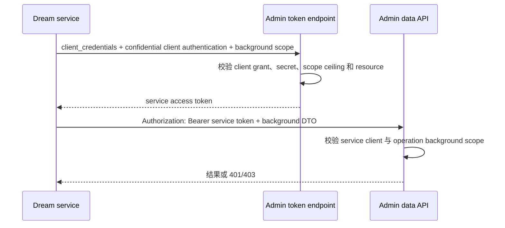
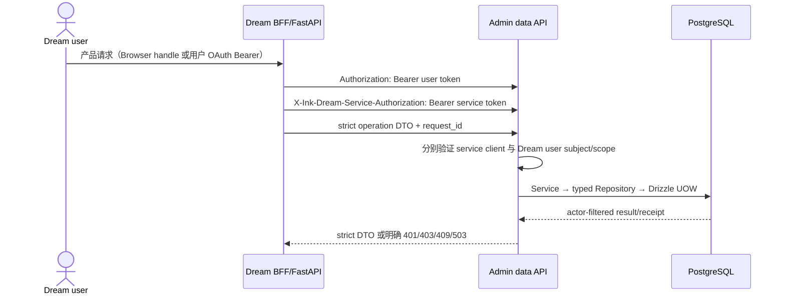

<!-- [Input] Current Admin/Dream auth documents, Better Auth 1.7.4 source, legacy Admin session schema and deployed identity records. -->
<!-- [Output] Reviewed provider/client/operator/user boundaries and the required compatibility-first implementation sequence. -->
<!-- [Pos] Authoritative cross-project auth-domain decision; Admin auth.md and Dream consumer documents must conform to it. -->
<!-- [Sync] 2026-09-17: freeze the RFC OAuth roles before any further business change; a Dream user is the delegated subject/resource owner, never a client registration. -->
<!-- [Sync] 2026-09-17: record the completed separation of Admin operators, Dream users, OAuth clients and service principals. -->

# Admin / Dream 认证业务域评审

## 背景与问题

Admin 同时承载 OAuth Authorization Server、Dream 数据接口和 Admin 管理后台。Dream 是独立产品，有自己的用户、内容、订阅、Thread、Run 和文件权限。两边可以出现相同邮箱，但 `public.admin_users` 和 `public.users` 表示不同业务域中的主体，不能复制、合并或互相替代。

评审时，Dream 浏览器和设备已经注册为 OAuth client，Dream canonical user 主键也已保留；但当时的 Admin 登录路径先验证 Better Auth credential，再通过 `identity.admin_subject_links` 查 Admin member。这会让 Admin 管理登录依赖 Dream/OAuth 用户身份，并造成“同邮箱、不同密码”无法登录，因此被判定为不符合业务边界。现行代码已经恢复 `admin_users.password_hash → admin_sessions → Admin RBAC` 的独立路径；Better Auth Session 和 `identity.admin_subject_links` 均不再参与 Admin 登录或权限检查。

已安装的 `@better-auth/oauth-provider` 版本为 `1.7.4`。本地包源码确认它支持 `client_credentials`，并明确拒绝 public client 使用该 grant。因此浏览器和设备继续作为 public client；Dream 服务端需要单独的 confidential service client。

## 目标与边界

- Admin 管理员是 Admin 业务域中的系统操作主体，真值为 `public.admin_users`、`public.admin_sessions` 和 Admin RBAC 表。
- Dream 用户是 Dream 业务域中的产品主体，真值为 `public.users`；OAuth token 的 `sub` 通过 `identity.subject_links` 映射到该主体。
- Dream 应用是 OAuth client。浏览器 BFF、设备客户端和服务端 client 是不同注册项，不能把 Dream 用户称为 OAuth client。
- Admin Better Auth/OAuth Provider 负责 Dream 用户认证、Google callback、授权、token、refresh、JWKS 和 Device Flow；它不替代 Admin 管理员密码与后台 Session。
- Admin 管理 Session 只能访问 Admin 管理路由；Dream OAuth access token 只能访问其 resource/scope 允许的 Dream 产品和数据接口。
- 相同邮箱不创建 `admin_users ↔ users` 关系，不复制密码哈希，不把 Dream 登录结果转换为 Admin 权限。
- Dream 生产服务不持有 PostgreSQL 凭据；全部数据持久化仍通过 Admin 的 DTO → Domain Service → typed Repository → Drizzle 边界。

### OAuth 角色定论

“客户端模式”只能表示 OAuth `client_credentials` grant，它证明调用应用，不携带用户身份。这里的 OAuth 角色固定如下，后续业务实现不得交换这些角色：

| OAuth / 业务角色 | 本项目实体 | Token 中的身份 | 允许的调用 |
| --- | --- | --- | --- |
| Authorization Server | Admin Better Auth/OAuth Provider | token issuer，不是被委托用户 | 校验 client、登录/同意、签发/刷新 token、提供 JWKS |
| Admin operator | `public.admin_users` + `public.admin_sessions` | 不进入 Dream OAuth token | 登录 `/admin`，按 Admin RBAC 操作管理资源 |
| Public OAuth client | Dream browser BFF、CLI/device | `client_id`，无 client secret | Authorization Code + PKCE 或 RFC 8628，代表已登录 Dream user 请求授权 |
| Confidential OAuth client | Dream server | service token 中 `sub == client_id` | `client_credentials` 仅执行具名无用户后台操作；用户操作时另作为服务身份 |
| Resource owner / delegated subject | Dream user：`identity.user → identity.subject_links → public.users` | 用户 token 的 `sub` | 访问本人 Deck、Thread、Run、订阅、文件和其他产品实体 |
| Resource Server | Admin Dream data API、适用的 Dream/Gateway API | 校验 user/service token | 从用户 `sub` 派生 canonical user，并执行 scope 与实体权限过滤 |

因此，Admin 是授权服务和管理系统，Admin operator 是管理业务主体；Dream 应用才是 OAuth client；Dream user 是被委托的产品主体。若把每个 Dream user 注册成 `client_credentials` client，token 将只证明一组 client credential，无法表达用户同意、个人实体所有权、账户禁用、用户 Session、Device approval 或同一用户跨多个 client 的授权关系，本方案明确禁止这种建模。

## 概念与规则

| 概念 | 业务域与真值 | 认证方式 | 能力边界 |
| --- | --- | --- | --- |
| Admin operator | `public.admin_users` | Admin 独立密码或以后明确增加的 Admin IdP；签发 `public.admin_sessions` | Admin RBAC；不代表 Dream user |
| Dream user | `public.users` | Admin Better Auth 的 Google/credential Session 参与 OAuth 授权 | Dream 产品实体、订阅和历史；不代表 Admin operator |
| Dream browser client | `identity.oauthClient` public client | Authorization Code + S256 PKCE | 取得用户委托 token；无 client secret |
| Dream device client | `identity.oauthClient` public/native client | RFC 8628 Device Authorization | 取得用户委托 token；无固定 secret |
| Dream service client | `identity.oauthClient` confidential client | `client_credentials`，secret 只在 Dream 服务端 | 无用户的后台 scope；不能读取任意用户数据 |
| User delegated access token | Admin OAuth Provider | `sub` + `client_id` + resource/audience + scope | Admin 从 `sub` 反查 Dream user，再做实体权限过滤 |
| Service access token | Admin OAuth Provider | confidential client + scope ceiling | 只执行明确 background operation；没有 canonical user |
| Admin Session | `public.admin_sessions` | `admin_users.password_hash` 校验后签发 HttpOnly cookie | 每个请求重新查询 Admin 状态、角色和权限 |

`client_credentials` 只证明 Dream 服务端这个 client，不携带 Dream 用户。需要用户权限的操作必须继续携带用户委托 access token；后台同步、capability、资源策略等没有用户的操作才使用 service access token。任何接口都不能把 client ID、邮箱或请求体中的 user ID 当作用户主体。

内部数据接口按两种明确的 HTTP 传输形态执行。无用户后台请求把 service access token 放在标准 `Authorization: Bearer`；代表 Dream 用户的请求把用户 access token 放在 `Authorization: Bearer`，Dream 服务端另以 `X-Ink-Dream-Service-Authorization: Bearer <service access token>` 证明 confidential client。第二个头只由 Next/Python 服务端生成，Browser 代理必须剥离浏览器输入和上游输出中的该头。Admin 先验证 service token 的签名、issuer、resource、`sub == client_id` 和 background scope ceiling，再独立验证用户 token 的 `sub`、scope 与实体权限；两个 token 不能互相代替。

数据接口始终执行 strict DTO → Domain Service → typed Drizzle Repository → 单一事务。Handler 不接受 SQL、表列、事务或 caller-selected user ID；Service 从已验证用户主体或明确 background actor 生成权限上下文；Repository 才能执行 ORM 查询、锁、幂等 receipt 与持久化。Dream 客户端只序列化 Pydantic/Zod 对齐的业务 DTO，Admin 不可用时失败关闭。

## 数据 ER

ER 中没有 `ADMIN_USERS ↔ DREAM_USERS` 关系。`identity.admin_subject_links` 已经存在于 migration 历史，为兼容旧实验路径暂不做破坏性删除；新 Admin 登录和权限检查不写、不读该表。确认旧 Session 最大有效期结束且无消费者后，再按 expand → compatibility → contract 单独删除或归档。

## 正常流程

### Admin 管理后台

Dream 的 Better Auth cookie、OAuth token、Google subject、canonical user 和 email 均不参与这条登录判断。

### Dream 浏览器用户

### Dream 服务端 client

用户操作不能只走这条流程。用户 DTO 必须携带用户委托 token，并且 Admin 从 `sub` 派生 Dream user；service token 不能补出或覆盖用户主体。

## 状态与失败处理

| 触发 | 状态/响应 | 数据处理 |
| --- | --- | --- |
| Dream 密码提交到 Admin 管理登录 | `401 ADMIN_CREDENTIALS_INVALID` | 不查 Dream user，不创建 Admin Session |
| Admin 密码提交到 Dream OAuth 登录 | Dream identity credential 不匹配 | 不查 Admin member，不签 Dream token |
| 相同邮箱存在于两张用户表 | 两条业务记录继续独立 | 不建立跨表关系，不复制密码或角色 |
| Admin Session 有效但权限不足 | `403 ADMIN_PERMISSION_DENIED` | Session 保留，当前操作不执行 |
| user token 缺 Dream subject link | `403` 或 `invalid_grant` | 不接受请求体 user ID 代替映射 |
| public client 请求 client_credentials | `invalid_client` | 不签 service token |
| service token 调用户操作 | `403` | 不推导 canonical user |
| Admin/Dream 数据服务不可用 | 明确 `503`/业务错误 | Dream 不回退 PostgreSQL，Admin 登录不回退 Dream credential |

## 已实施范围与后续顺序

1. 已恢复 Admin 独立管理登录：严格 DTO → Admin auth service → typed Drizzle repository，在一个事务校验 `admin_users`、创建 `admin_sessions`、更新登录时间并写 audit。
2. Admin guard 只读取 `ink_admin_session` 并实时计算 RBAC。旧 Better Auth/Dream Session 不再进入管理鉴权；首次 bootstrap 也只创建 Admin operator、RBAC、audit 与独立 Admin Session。
3. Better Auth 保持 Dream OAuth/Google/Device authority；`identity.subject_links` 只映射 Dream canonical user。
4. 已注册独立 confidential service client，为没有用户的后台操作使用 `client_credentials`；public browser/device client 保持 PKCE/Device Flow。
5. Dream consumer 已按 capability 切换 service token；用户调用以双 Bearer 形态同时传递用户委托 token 和独立 service token，不回退数据库。
6. 待旧实验 Session 最大有效期结束并确认无消费者后，再单独评审 `identity.admin_subject_links` 的 contract migration。

## 评审结论与验收

现行数据接口 DTO/ORM 边界、Dream OAuth code/device 流程、Google callback 和 Dream subject mapping 均按评审结论保留。Admin 管理登录/Session 已恢复独立业务域，服务身份已采用 confidential OAuth client；修复过程中没有把 Admin member 绑定到 Dream canonical user。

本轮在业务修改前完成的设计复核结果如下：

| 需求 | 设计结论 | 实现证据 | 评审状态 |
| --- | --- | --- | --- |
| Dream 与 Admin 用户视角分离 | 两张用户表、两套密码/Session/状态/RBAC，无跨表业务关系 | `adminAuthService.ts`、`adminSessionRepository.ts` 只读 Admin 表；Dream OAuth 用 `subject_links` | 通过 |
| OAuth 客户端模式 | Browser/device 是 public client；Dream server 是 confidential client | `serviceIdentity.ts` 要求 service token `sub == client_id`；public client 不用 secret | 通过 |
| 用户委托与服务身份分离 | 用户 operation 同时要求 user bearer 与 server-only service bearer | internal handler 与 Dream BFF/Python transport 使用双 Bearer，拒绝 caller user ID | 通过 |
| 相同邮箱兼容 | 只做冲突检测和显式 legacy adoption，不合并 Admin member | release-time adoption 只创建 Dream `subject_links`，`admin_membership_created=false` | 通过 |
| DTO/ORM 数据边界 | strict DTO → Service → typed Repository → Drizzle/UOW | operation registry 和领域 handler 不接受 SQL、表列或事务选择器 | 通过 |
| 历史 `admin_subject_links` | 仅 schema/迁移兼容及 legacy adoption 冲突检测；不参加登录/RBAC | 管理登录/guard 无该表依赖 | 通过，contract 删除另立迁移 |

结论是现行身份业务代码与本次分域方案一致；本轮无需为了“把 Dream user 变成 OAuth client”改写认证代码。后续业务变更必须以本表为门禁，只有发现与该边界不一致的实际调用才修改实现。

实施完成必须证明：

- Admin 旧密码只验证 `admin_users.password_hash`，签发并撤销 `admin_sessions`，RBAC 每次请求重算。
- Dream 密码/Google 登录仍只得到 Dream OAuth 权限，同邮箱不能进入 Admin。
- Browser/device public client 无 secret；service confidential client 的 `client_credentials` scope 不包含用户数据权限。
- 两张用户表的主键、密码、状态、角色和历史关系不变。
- Admin 与 Dream 的 lint、typecheck、build、认证/权限合同和真实登录隔离测试通过。
- Dream 生产进程继续没有 PostgreSQL credential 或直连路径。
