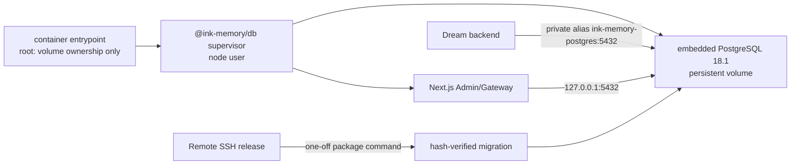
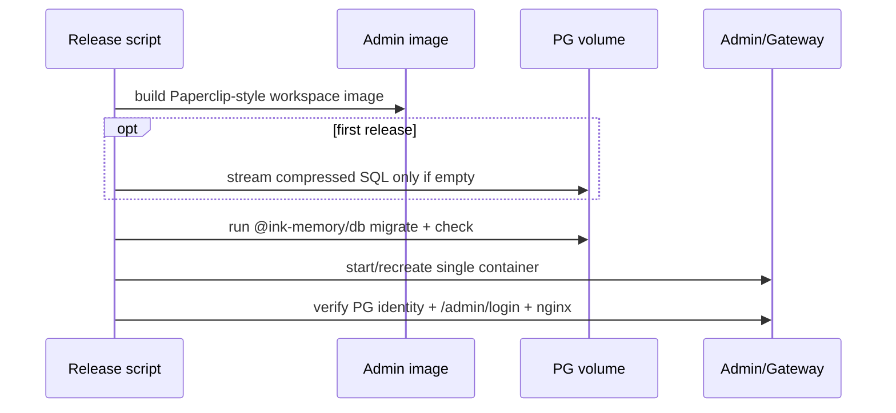

# 数据库 Package 与内嵌 PostgreSQL 设计

## 决策

Admin 采用与 Paperclip `packages/db` 相同的 workspace 边界：`@ink-memory/db`
统一拥有数据库 client、Drizzle schema、migration integrity、内嵌 PostgreSQL
进程和维护命令。Next.js 应用只通过 package client/schema 使用数据库。

阿里云和本地 Docker 不再部署独立 PostgreSQL 服务。一个 Admin 容器包含：

## Package 边界

| 路径 | 所有权 |
|------|--------|
| `packages/db/src/schema/**` | 唯一 TypeScript Drizzle schema |
| `packages/db/src/client.ts` | 应用连接池与 DSN 合同 |
| `packages/db/src/embedded-postgres.ts` | cluster/database 初始化与 PG 进程生命周期 |
| `packages/db/src/migrate.ts` | 唯一生成式 Schema/DDL runner |
| `packages/db/src/database-io.ts` | 空目标压缩纯 SQL 流式导入 |
| `drizzle/**` | 不可变 SQL、journal、snapshot 与 data runner 历史 |
| `app/lib/db*`、`scripts/migrate.mjs` | 旧调用路径的兼容 facade |

迁移目录暂时保留在仓库根 `drizzle/`，这是为了保持 0000–0037 的 SQL、snapshot、
journal tag/when 和数据库 receipt hash 原样不变；“package owns migration”指 runner、
schema-generation config、目标解析与发布执行权均在 `@ink-memory/db`，不是复制或重写历史。

## 启动与 migration 分离

`supervise.ts` 只执行以下基础设施动作：

1. 验证显式 `INK_DATABASE_MODE=embedded-postgres` 与 PostgreSQL 配置；
2. 初始化持久 cluster，创建 `ink-memory` database，并允许私有 Docker network 使用
   SCRAM 认证；
3. 启动调用方命令并同步处理退出信号；
4. 命令退出时干净关闭 PostgreSQL。

它不创建业务 schema，也不运行 migration。`RUN_DB_MIGRATIONS=true` 会 fail closed。
发布脚本在应用启动前单独运行 `packages/db/dist/migrate.js`；runner 继续验证 journal
连续性、已应用 hash、ledger shape 和 advisory lock，并在一个事务内前向执行。

本机 `pnpm db:migrate` 没有 `MIGRATION_DATABASE_URL` 时，只能在
`INK_DATABASE_MODE=embedded-postgres` 已明确配置后启动相同数据目录。运维人员仍可通过
显式 `MIGRATION_DATABASE_URL` 对具名外部/隔离 PostgreSQL 执行 migration。

## 数据、网络与恢复

- Admin volume `ink_memory_postgres_data` 挂载到
  `/var/lib/ink-memory/postgres`；容器以 `node` 用户运行 PostgreSQL。
- Admin 自己使用 `127.0.0.1:5432`；Dream 通过 external network 的
  `ink-memory-postgres:5432` 访问。阿里云不发布 PostgreSQL host port。
- `bootstrap` 从 mode-0600 本机 env 解析并验证 package 管理的 embedded cluster，临时
  启动后生成 gzip 压缩的纯 SQL dump，并流式解压到 `psql`；这避免依赖旧 Docker PG，
  也避免 custom archive 对 `pg_restore` 版本的耦合。目标存在任意用户表即拒绝恢复。
  本机源 data directory 不会删除或迁移。镜像中的 `psql` 固定为 18，与 embedded
  PostgreSQL server major 一致，禁止用 Debian 默认旧客户端读取新版本 dump。
- 日常备份在短维护窗口停止 Admin，对已关闭 cluster 创建物理 `tar.gz`；恢复必须使用
  相同 embedded PostgreSQL major/runtime，并由人工确认目标 volume。
- `EMBEDDED_POSTGRES_SHARED_BUFFERS` 默认 `96MB`，`max_connections` 默认 `50`，适合
  当前 1.6GB ECS；它们是配置，不是业务环境分支。
- Next.js 镜像构建通过 `NEXT_BUILD_CPUS` 与 `NEXT_BUILD_MAX_OLD_SPACE_MB` 显式限制 worker
  和 V8 heap；这只属于 build harness，不改变运行时业务路径。

## 暂停对象存储

MinIO 服务、bucket 初始化、端口、凭据和 storage volume 已从基础拓扑删除。
`FILE_STORAGE_TYPE=disabled` 是显式能力状态：配置发现接口返回
`FILE_STORAGE_DISABLED`，实际文件操作 fail closed。数据库中的历史 URL/metadata
保持不变；重新启用时必须显式选择 `vercel-blob` 或 `s3` 并新增相应部署配置。

## 发布顺序

Dream 必须在 Admin 验证通过后发布。跨版本仍遵守 expand → 双版本兼容 →
backfill/validate → contract，Dream 只依赖已发布 capability。
