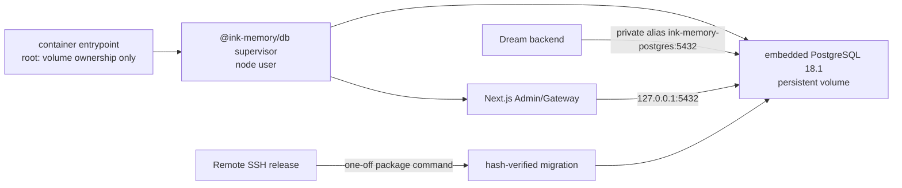
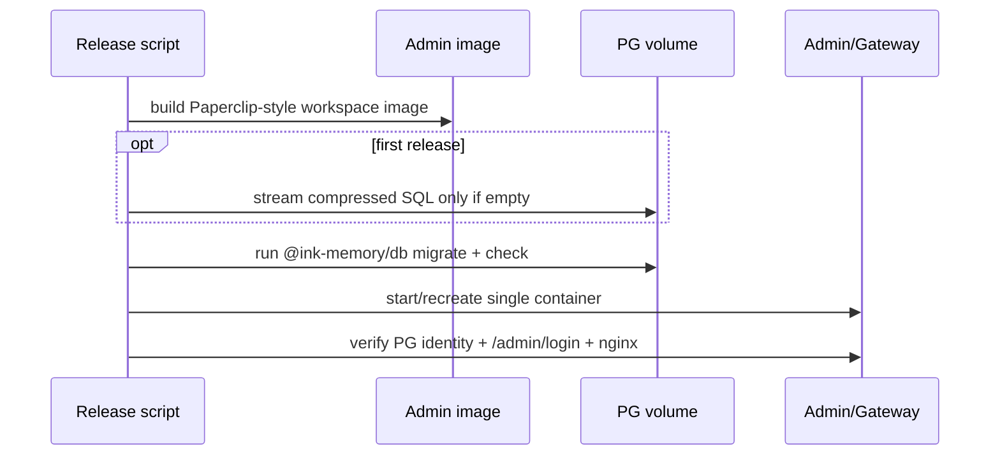

# 数据库 Package 与内嵌 PostgreSQL 设计

> 更新：2026-10-05
<!-- [Sync] 2026-10-05: specify stdio-failure and owned-process-group shutdown without database or business changes. -->

## 决策

Admin 采用与 Paperclip `packages/db` 相同的 workspace 边界：`@ink-memory/db`
统一拥有数据库 client、Drizzle schema、migration integrity、内嵌 PostgreSQL
进程和维护命令。Next.js 应用只通过 package client/schema 使用数据库。

阿里云和本地 Docker 不再部署独立 PostgreSQL 服务。一个 Admin 容器包含：

```mermaid
flowchart LR
  Entry["container entrypoint<br/>root: volume ownership only"] --> Supervisor["@ink-memory/db supervisor<br/>node user"]
  Supervisor --> PG["embedded PostgreSQL 18.1<br/>persistent volume"]
  Supervisor --> Admin["Next.js Admin/Gateway"]
  Dream["Dream backend"] -->|"private alias ink-memory-postgres:5432"| PG
  Admin -->|"127.0.0.1:5432"| PG
  Release["Remote SSH release"] -->|"one-off package command"| Migration["hash-verified migration"]
  Migration --> PG
```

## Package 边界

| 路径 | 所有权 |
|------|--------|
| `packages/db/src/schema/**` | 唯一 TypeScript Drizzle schema |
| `packages/db/src/client.ts` | 应用连接池与 DSN 合同 |
| `packages/db/src/embedded-postgres.ts` | cluster/database 初始化与 PG 进程生命周期 |
| `packages/db/src/migrate.ts` | 唯一生成式 Schema/DDL runner |
| `packages/db/src/database-io.ts` | 空目标压缩纯 SQL 流式导入 |
| `drizzle/**` | 不可变 SQL、journal、snapshot 与 data runner 历史 |
| `app/lib/db*`、`scripts/migrate.mjs` | 旧调用路径的兼容 facade |

迁移目录暂时保留在仓库根 `drizzle/`，这是为了保持 0000–0037 的 SQL、snapshot、
journal tag/when 和数据库 receipt hash 原样不变；“package owns migration”指 runner、
schema-generation config、目标解析与发布执行权均在 `@ink-memory/db`，不是复制或重写历史。

## 启动与 migration 分离

`supervise.ts` 只执行以下基础设施动作：

1. 验证显式 `INK_DATABASE_MODE=embedded-postgres` 与 PostgreSQL 配置；
2. 初始化持久 cluster，创建 `ink-memory` database，并允许私有 Docker network 使用
   SCRAM 认证；
3. 启动调用方命令，POSIX 下创建自有应用进程组，并通过管道转发日志；
4. 收到 `SIGTERM/SIGINT/SIGHUP`、日志输出失败或包装命令退出时，关闭整个自有应用进程组；超出配置期限后强制关闭残留进程；
5. 命令生命周期结束（包括命令启动失败）后，通过 `finally` 干净关闭 PostgreSQL，再保留退出代码或原停止信号。

`src/supervised-command.ts` 只管理进程，不解析数据库配置或调用数据库；正常 supervisor 将 `runtime-config.ts` 解析的 `INK_SUPERVISOR_SHUTDOWN_TIMEOUT_MS`（默认 10 秒）传入该 helper。它不能只等待 `pnpm` 父进程：父进程先退出时，Next 子进程仍可能持有失效的终端，必须继续清理自有进程组。清理不会枚举或停止其他服务。

正常 Next CLI 启动入口在加载框架前通过 `scripts/next-stdio-guard.mjs` 安装标准输出保护，开发 worker 继承同一 Node preload。失效输出流导致无日志失败退出；普通应用异常仍由 Next 既有处理器处理。`uncaughtExceptionMonitor` 仅拦截原生 console 的 `EIO/EPIPE/EBADF` 写入失败，避免框架的 `console.error(error)` 再次写入相同失效终端。容器 standalone 入口保持原命令，由 supervisor 的管道转发与输出失败清理保护。

2026-10-05 本机诊断中，残留 Next 进程的父进程为 PID 1，标准输入、输出和错误终端均为 revoked，没有 Admin 监听或数据库连接。CPU profile 集中于框架错误格式化和 console，短时监测记录半秒 4824 次 `EIO/write`。这解释了当时 CPU 空转；原终端何时退出、由谁关闭不能从存活进程中恢复，不能据此归因于 Gateway 账户锁变更。回归使用自有 Node/Next 进程与合成输出，不调用模型或正常业务数据库。

本轮技术验证如下，测试执行由 `luna-test-stage` 的隔离验证 runner 负责；浏览器所需的具名隔离 PostgreSQL 初始化、迁移和清理由主代理负责。普通最小 Next 应用在 PTY 关闭或撤销后没有稳定复现原进程的异常循环，因此不声称单独关闭终端必然造成 100% CPU。实际 Node/Next 运行时边界验证确认，加载保护代码后关闭或撤销自有 PTY，进程以 1 退出，测试端口释放；成功请求仍返回 200。验证不是正常账户或真实模型验收。

| 命令/检查 | 退出码 | 证据 |
| --- | --- | --- |
| `node --test scripts/process-runtime.test.mjs scripts/next-config.test.mjs` | 0 | 22/22；输出失败、三种停止信号、父进程先退出、拒绝退出的下层进程及资源清理均覆盖；普通 Error、null 和字符串异常仍进入原处理器 |
| `pnpm exec tsc --noEmit --incremental false` | 0 | Admin 类型检查通过 |
| `pnpm --filter @ink-memory/db typecheck` | 0 | 数据库 package 类型检查通过 |
| `pnpm lint` | 0 | 全仓库静态检查通过 |
| `pnpm --filter @ink-memory/db build` | 0 | NodeNext 编译与既有 CLI bundle 通过；未运行 migration |
| `pnpm test:config` | 0 | 32/32 配置与进程测试；环境投影和 topology 合同通过 |
| `INK_ADMIN_E2E_DIST_DIR=.next-e2e-runtime-final-20261005-2152 pnpm build` | 0 | 完整生产构建通过；使用并清理自有输出目录 |
| 隔离 Playwright `gateway-deadlock.spec.ts`，受保护 Next 启动入口、系统 Chrome 和本地 mock Provider | 0 | 新建 fixture 首轮 1/1，27.8 秒；8 路公开 Gateway 请求完成结算并在 Admin 页面可见，无页面异常或同源 5xx |
| 自有最小 Next 16.1.6 应用的 `next build --webpack` 与 `next start` PTY 对照 | 构建 0；受保护进程 1 | 关闭 PTY 与 `revoke` 两种故障均退出并释放端口；guard 参数由正常开发 worker 的 Node options 继承 |
| `pnpm test:run` | 1 | 正常完成，151.33 秒；2206 通过、3 失败、36 跳过。三个未修改的失败与已合并 PR #30 一致：migration 0068/0072、Dream 表数 60/62、拒绝授权状态 403/401 |

首次进程回归有四项失败：定时器与等待循环重复强制停止即将消失的 macOS 进程组，收到 `EPERM`。改为单次强制停止并补齐异常类型边界后，完整 22 项回归通过。最小 Next fixture 首次缺少 layout 的构建失败，以及复用旧故障开关文件的早期注入观测，均只属于 harness 诊断，未计为业务或有效高占用复现。Chrome 首次启动检查超时，但正式 Playwright 成功使用系统 Chrome；为补存日志重复使用已写入业务数据的同一 fixture，因账户已有有效订阅返回 409，不能记为第二次通过，也不改变新建 fixture 首轮的验收结果。测试自有进程、端口、PTY、具名数据库与临时 Next 构建目录均已清理；正常 Admin 保持停止，既有其他服务未修改。

它不创建业务 schema，也不运行 migration。`RUN_DB_MIGRATIONS=true` 会 fail closed。
发布脚本在应用启动前单独运行根迁移编排；package schema runner 继续验证 journal
连续性、已应用 hash、ledger shape 和 advisory lock，并在一个事务内前向执行。
0047/0048 之间需要账号数据 cutover 时，根命令调用编译后的
`packages/db/dist/provider-managed-accounts-data.js`：只认同一个 migration target，先
dry-run 后显式 apply，再执行 0048 和 check；生产制品不依赖 `tsx` 或未复制的 App 源码。
编排器只启动/解析一次显式或 embedded PostgreSQL，并把精确 DSN 传给每个子进程，防止
多个阶段竞争停止同一内嵌数据库。

本机 `pnpm db:migrate` 没有 `MIGRATION_DATABASE_URL` 时，只能在
`INK_DATABASE_MODE=embedded-postgres` 已明确配置后启动相同数据目录。运维人员仍可通过
显式 `MIGRATION_DATABASE_URL` 对具名外部/隔离 PostgreSQL 执行 migration。

## 数据、网络与恢复

- Admin volume `ink_memory_postgres_data` 挂载到
  `/var/lib/ink-memory/postgres`；容器以 `node` 用户运行 PostgreSQL。
- Admin 自己使用 `127.0.0.1:5432`；Dream 通过 external network 的
  `ink-memory-postgres:5432` 访问。阿里云不发布 PostgreSQL host port。
- `bootstrap` 从 mode-0600 本机 env 解析并验证 package 管理的 embedded cluster，临时
  启动后生成 gzip 压缩的纯 SQL dump，并流式解压到 `psql`；这避免依赖旧 Docker PG，
  也避免 custom archive 对 `pg_restore` 版本的耦合。目标存在任意用户表即拒绝恢复。
  本机源 data directory 不会删除或迁移。镜像中的 `psql` 固定为 18，与 embedded
  PostgreSQL server major 一致，禁止用 Debian 默认旧客户端读取新版本 dump。
- 日常备份在短维护窗口停止 Admin，对已关闭 cluster 创建物理 `tar.gz`；恢复必须使用
  相同 embedded PostgreSQL major/runtime，并由人工确认目标 volume。
- `EMBEDDED_POSTGRES_SHARED_BUFFERS` 默认 `96MB`，`max_connections` 默认 `50`，适合
  当前 1.6GB ECS；它们是配置，不是业务环境分支。
- Next.js 镜像构建通过 `NEXT_BUILD_CPUS=1` 与
  `NEXT_BUILD_MAX_OLD_SPACE_MB=640` 显式限制 worker 和 V8 heap；runner 的系统包安装位于
  builder 产物复制之后，确保 BuildKit 在 2 GiB ECS 上串行执行高峰阶段。这只属于
  build harness，不改变运行时业务路径。
- Debian 与 PGDG 软件源通过 build args 注入；阿里云发布 env 使用 ECS VPC 镜像，默认
  build args 保持官方上游地址，不把云厂商网络策略写入应用运行时。
- production image 以 root 在 build 阶段预建 native OpenSSL soname alias；容器运行时只
  由非 root `node` 读取，避免 one-off migration/restore 修改 application layer。

## 暂停对象存储

MinIO 服务、bucket 初始化、端口、凭据和 storage volume 已从基础拓扑删除。
`FILE_STORAGE_TYPE=disabled` 是显式能力状态：配置发现接口返回
`FILE_STORAGE_DISABLED`，实际文件操作 fail closed。数据库中的历史 URL/metadata
保持不变；重新启用时必须显式选择 `vercel-blob` 或 `s3` 并新增相应部署配置。

## 发布顺序

```mermaid
sequenceDiagram
  participant R as Release script
  participant I as Admin image
  participant V as PG volume
  participant A as Admin/Gateway
  R->>I: build Paperclip-style workspace image
  opt first release
    R->>V: stream compressed SQL only if empty
  end
  R->>V: run @ink-memory/db migrate + check
  R->>A: start/recreate single container
  R->>A: verify PG identity + /admin/login + nginx
```

Dream 必须在 Admin 验证通过后发布。跨版本仍遵守 expand → 双版本兼容 →
backfill/validate → contract，Dream 只依赖已发布 capability。
