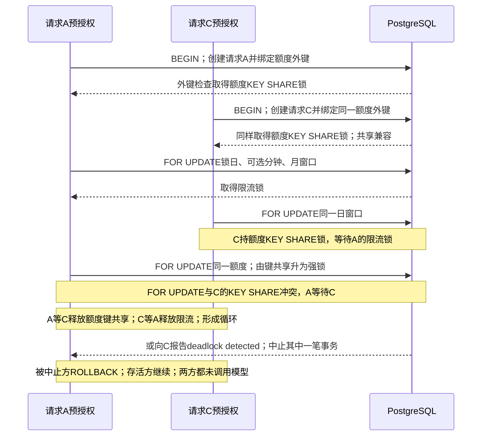
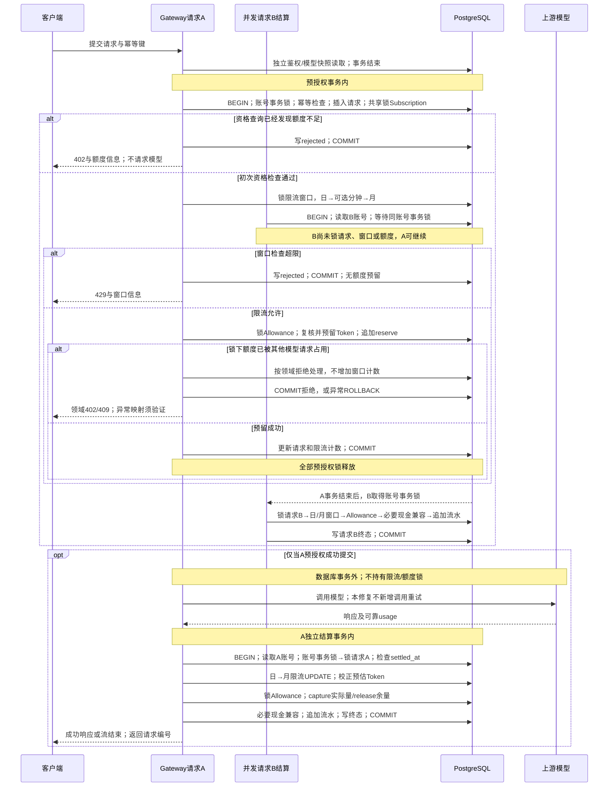
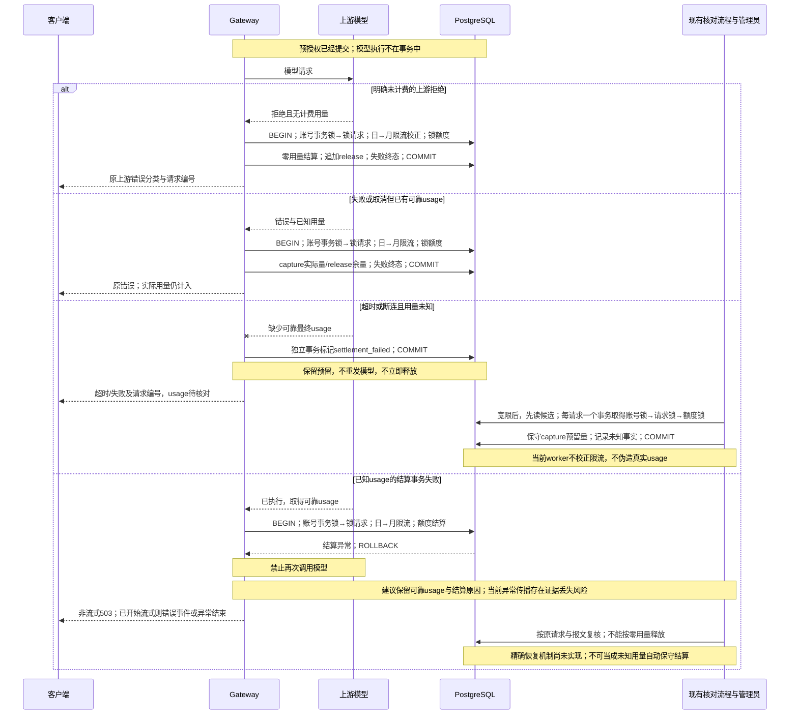
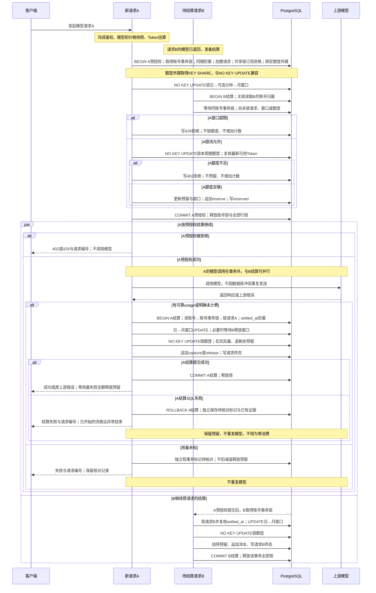

<!-- [Input] Ink Memory Admin and Paperclip local source/history, plus the user-reported PostgreSQL deadlock evidence. -->
<!-- [Output] Chinese architecture analysis, interaction design, transaction sequences and a bounded verification plan. -->
<!-- [Pos] Gateway concurrency design with separately tracked user-authorized minimal implementation and validation. -->
<!-- [Sync] 2026-10-02: implement fixed rate-before-allowance order and FK-compatible Allowance locks; separate proposed recovery/throughput work from actual validation. -->

# Gateway 数据库死锁：架构分析与交互方案

日期：2026-10-02。状态：**最小正确性补丁已写入当前工作区，验证与本机真实模型复测进行中**。本次补充：最小锁设计见 4.4，便于业务对照的推荐时序见 3.4；4.3 保留为显式锁序的基线对照，不能单独覆盖新确认的外键锁升级循环。

本文按“现状架构 → 设计稿 → 业务时序 → 根因与建议 → 目标评审 → 验证计划”组织。`源码事实`表示调查基线或本地 Git 历史支持的结论；修复前后以对应段落标注区分；`日志事实（用户提供）`表示任务描述中的日志信息；`设计建议`表示方案目标（仅 4.6 所列最小范围进入本次补丁）；`待确认`表示没有运行证据的事项。

最初交付为只读设计；用户随后明确要求直接修复当前代码、允许重启现有 3000，并要求测试 Key 可用的全部启用模型。当前实施与验收范围见 4.6，实际回执另列，不把原设计目标视为已实现。未修改 schema、历史迁移或普通业务配置。调查源码基线为 Admin `154c43e84583564bc0b97c0d30b9b67341bdfde9`、Paperclip `8c910b9a40a8878d73cae874d9758f0a433a11c5`。基线表示调查时的本地源码，不证明正在运行的服务使用同一构建。

## 1. 当前项目架构与 Paperclip 参考架构

### 1.1 约束与文档来源

已阅读根目录 `AGENTS.md`、`.folder.md`、`README.md`，`app/`、`app/api/`、`app/lib/`、Gateway、Subscriptions、`packages/db/`、schema 与 `docs/architecture/` 的目录合同；核对 `.cursor/rules/00-overview.mdc`、`04-lib.mdc`、`06-database.mdc`、`07-testing.mdc`、`09-change-guidelines.mdc` 及现有架构、Gateway 设计和计费策略文档。

- **缺失路径**：根 `CLAUDE.md`、`docs/rules/README.md` 不存在；Billing、`app/v1/` 没有独立 `.folder.md`，适用上层合同。本轮如实记录，不补造规则文件。
- **规则冲突**：`06-database.mdc` 仍写 schema 位于 `app/lib/db/schema.ts`；以用户明确指令、根 `AGENTS.md` 和数据库包合同为准，唯一来源是 `packages/db/src/schema/**`。旧导出路径不构成第二套 schema。
- Paperclip 读取根 `AGENTS.md`、数据库说明并核对 `doc/GOAL.md`、`PRODUCT.md`、`SPEC-implementation.md`、`DEVELOPING.md`；数据库包与相关服务目录未发现额外适用的 `AGENTS.md` 或 `.folder.md`。其根说明中的旧 PGlite 开发描述与当前 PostgreSQL 客户端实现不同，参考结论以实际源码为准，不移植其启动策略。

### 1.2 Admin 分层与实际调用链

| 层次 | 源码事实与责任 |
| --- | --- |
| 公开入口 | `app/v1/messages/route.ts`、`app/v1/chat/completions/route.ts` 转交协议 handler；不是事务或 SQL 实现层。 |
| 协议编排 | [Anthropic handler:17](/Users/dmeck/project/ink-admin-memory/app/lib/gateway/anthropic-handler.ts:17)、[OpenAI handler:13](/Users/dmeck/project/ink-admin-memory/app/lib/gateway/openai-handler.ts:13) 解析并验证请求，预授权成功后调用 JSON 或流式代理。 |
| 鉴权与模型解析 | [prepare:81](/Users/dmeck/project/ink-admin-memory/app/lib/gateway/prepare.ts:81) 依次鉴权、解析模型和价格、检查上下文、计算 Token 预估；[auth:171](/Users/dmeck/project/ink-admin-memory/app/lib/gateway/auth.ts:171) 支持受限 Runtime delegation 与 Gateway Key 主体，校验 scope 和有效用户。 |
| 模型快照事务 | [resolver:144](/Users/dmeck/project/ink-admin-memory/app/lib/models/resolver.ts:144) 使用独立事务，共享锁读取用户、Model、Provider、价格；返回模型和定价快照后该事务结束。 |
| 预授权事务 | [repository:211](/Users/dmeck/project/ink-admin-memory/app/lib/gateway/repository.ts:211) 创建请求及价格快照，检查订阅资格，锁限流窗口，预留订阅 Token，追加 Token reserve 流水，更新请求状态及限流计数，一起提交。 |
| 上游执行 | [proxy:231](/Users/dmeck/project/ink-admin-memory/app/lib/gateway/proxy-handler.ts:231)、[proxy:292](/Users/dmeck/project/ink-admin-memory/app/lib/gateway/proxy-handler.ts:292) 在预授权返回之后发送模型请求；报文写入使用独立操作。 |
| 结算事务 | [billing repository:365](/Users/dmeck/project/ink-admin-memory/app/lib/billing/repository.ts:365) 先读账号与稳定终态，取得账号事务锁后再锁请求，按价格快照计算成本，校正UTC限流Token，再结算额度与必要现金账户，追加流水并写入终态。 |
| 异常与核对 | [lifecycle:84](/Users/dmeck/project/ink-admin-memory/app/lib/gateway/lifecycle.ts:84) 区分已知用量和未知用量；[settlement worker:149](/Users/dmeck/project/ink-admin-memory/app/lib/gateway/settlement-worker.ts:149) 处理符合条件的旧未知用量请求。 |
| 管理复核 | [Admin resources:360](/Users/dmeck/project/ink-admin-memory/app/lib/admin/resources.ts:360) 提供请求状态、用量、额度、价格快照与错误；现有 Payload 权限入口承载受保护的完整报文。 |
| 数据与版本 | `packages/db/src/schema/**` 是唯一 Drizzle schema；`drizzle/**` 是不可变迁移历史。当前 Gateway/Billing 热路径实际使用 `pg` 的 `PoolClient` 和领域 SQL，不应把本次问题说成 Drizzle 自动生成事务的问题。 |

**源码事实**：公共事务函数 [platform-db:75](/Users/dmeck/project/ink-admin-memory/app/lib/platform-db.ts:75) 执行 `BEGIN → handler → COMMIT`，异常时 `ROLLBACK` 后重抛，并释放连接；没有事务自动重试，也没有在此函数设置隔离级别。实际数据库默认隔离级别尚未读取。

**源码事实**：新 Gateway 请求固定采用 `token_allowance`，预授权返回 `reservedMicrousd=0`；现金 reserve 导出函数存在，但没有发现当前推理入口调用它。结算保留旧 `money_allowance` 和现金请求的兼容路径。不能把现状描述为“新请求先冻结现金余额”。依据：[subscription gateway:188](/Users/dmeck/project/ink-admin-memory/app/lib/subscriptions/gateway.ts:188)、[repository:444](/Users/dmeck/project/ink-admin-memory/app/lib/gateway/repository.ts:444)、[legacy settlement:488](/Users/dmeck/project/ink-admin-memory/app/lib/subscriptions/gateway.ts:488)。

### 1.3 修复前每条相关路径的事务与锁

以下列出业务行锁及重要隐式写锁；插入还可能取得外键、唯一索引和表级锁，表格不冒充完整 `pg_locks` 回执。`UPDATE` 取得的行锁同样参与等待，不能只统计 `FOR UPDATE`。

| 路径 | 开始与结束 | 资源及实际顺序 | 持锁等待模型 |
| --- | --- | --- | --- |
| 鉴权 | `withPlatformClient`；OAuth/Runtime 主体验证另有独立事务 | Key/身份读取，`last_used_at` 单语句更新；没有限流或额度锁 | 否 |
| 模型与价格解析 | `resolveBillableModel` 的独立 `withPlatformTransaction`，返回后提交 | 用户共享锁 → Model/Provider 共享锁 → 价格共享锁 | 否 |
| 幂等重放 | `beginGatewayRequest` 事务 | 有键时先取得用户+键的事务 advisory lock，再读取原请求；发现原记录即返回并提交 | 否 |
| 订阅资格拒绝 | 同一预授权事务 | 新请求插入/更新 → 订阅 `FOR SHARE OF s`；写 rejected 及终结时间后提交 | 否 |
| 正常限流拒绝 | 同一预授权事务 | 新请求 → 订阅共享锁 → 日、可选分钟、月窗口，按顺序检查；首次超限即可返回，不预留额度、不增加计数；拒绝记录提交 | 否 |
| 成功预授权 | 同一预授权事务 | 幂等锁（可选）→ 新请求 → 订阅共享锁 → 日、可选分钟、月限流行 → Allowance `FOR UPDATE` → Token reserve 流水 → 请求/窗口更新，提交 | 否 |
| 额度并发变化 | 同一预授权事务 | 同上，到额度锁下复核；显式并发冲突分支写 409。其他异常重抛，整个事务回滚 | 否 |
| 已知用量成功/失败/取消结算 | `settleGatewayRequest` 独立事务 | 请求 `FOR UPDATE` → Allowance `FOR UPDATE`/更新及 Token capture/release → 可选现金账户 → 可选额度金额流水 → 日、月限流 `UPDATE` → 现金流水/账户 → 请求终态 → 可选用户 suspend，提交 | 否 |
| 确认未计费的失败释放 | 复用上一行结算事务，不另开释放业务路径 | 以零用量结算，释放该请求预留 Token，限流 Token 校正为零；分钟请求计数不回退 | 否 |
| 用量未知标记 | `markGatewayRequestSettlementFailed` 独立事务 | 条件更新请求行，不修改额度或限流，提交；失败被外围吞掉 | 否 |
| 用量未知后台核对 | 每个请求一个独立事务 | 无锁选择候选 → 读取账号 → 账号事务锁 → 请求 `FOR UPDATE` 与终态复核 → Allowance → Token capture → 请求 `settled_at`，提交；**不更新限流** | 否 |
| 单独 release helper | 仅有 `releaseSubscriptionAllowanceOnClient` 导出，未发现生产调用者 | 调用者负责事务；额度锁 → Token release 流水；函数本身没有请求终态守卫 | 否，不属于当前上游链 |

预授权窗口顺序来自 [repository:96](/Users/dmeck/project/ink-admin-memory/app/lib/gateway/repository.ts:96)，锁语句在 [repository:124](/Users/dmeck/project/ink-admin-memory/app/lib/gateway/repository.ts:124)，额度预留在 [repository:403](/Users/dmeck/project/ink-admin-memory/app/lib/gateway/repository.ts:403)。结算额度锁在 [subscription gateway:382](/Users/dmeck/project/ink-admin-memory/app/lib/subscriptions/gateway.ts:382)，限流更新在 [billing repository:404](/Users/dmeck/project/ink-admin-memory/app/lib/billing/repository.ts:404)（当前修复后位置）。

**边界补充**：订阅资格查询只锁 `subscriptions`，不锁 LEFT JOIN 的 Allowance；所以资格检查在先，不代表额度锁也在限流之前。共享订阅锁一直保留到预授权提交。[subscription gateway:109](/Users/dmeck/project/ink-admin-memory/app/lib/subscriptions/gateway.ts:109)

**边界补充**：Provider 凭据续期先以短事务提交 lease，再在事务外调用远端 refresh，之后另开事务保存结果；这些事务不嵌入额度预授权或结算。[managed credentials:386](/Users/dmeck/project/ink-admin-memory/app/lib/gateway/managed-provider-credentials.ts:386)、[managed credentials:419](/Users/dmeck/project/ink-admin-memory/app/lib/gateway/managed-provider-credentials.ts:419)。现有非流式托管凭据 401 的一次续期重放是另一项协议行为，本方案不扩大该重放机制。[provider transport:219](/Users/dmeck/project/ink-admin-memory/app/lib/gateway/provider-transport.ts:219)

**相邻竞争者**：周期 worker 在每次事务中先领取一条 Subscription 再执行周期推进；管理员赠送 Token 使用 Subscription/Allowance 联合 `FOR UPDATE OF s,a`。这些路径没有发现限流更新，因此不是已识别双资源循环的另一端；联合锁顺序、外键及历史现金路径仍要纳入后续锁图审查，不能据此宣称全库不存在其他死锁。[period worker:49](/Users/dmeck/project/ink-admin-memory/app/lib/subscriptions/period-worker.ts:49)、[subscription service:1142](/Users/dmeck/project/ink-admin-memory/app/lib/subscriptions/service.ts:1142)

### 1.4 Paperclip 的实际参考架构

**源码事实**：Paperclip 是 Express 服务、React/Vite 管理界面、Adapter 执行器与 Drizzle/PostgreSQL 数据包组成的 Agent 控制面。`packages/db` 提供 schema、client 和 migrations，运行时 `createDb` 仅建立 postgres-js/Drizzle 客户端，没有统一业务事务重试装饰器。[DB client:48](/Users/dmeck/project/paperclip/packages/db/src/client.ts:48)

相关实际调用链：`heartbeatService → budgets.getInvocationBlock → adapter.execute → updateRuntimeState → costs.createEvent → budgets.evaluateCostEvent`。预算判断在执行前，费用报告在执行后；不是“限流窗口+订阅 Token 预留+成功扣减/失败释放”的网关计费链。[heartbeat:11431](/Users/dmeck/project/paperclip/server/src/services/heartbeat.ts:11431)、[heartbeat:14447](/Users/dmeck/project/paperclip/server/src/services/heartbeat.ts:14447)、[heartbeat:12397](/Users/dmeck/project/paperclip/server/src/services/heartbeat.ts:12397)

| 参考项 | 查到的实现 | 适用性 |
| --- | --- | --- |
| 预算/余额更新 | `createEvent` 插入 cost event，汇总当月费用，再分别更新 agent 和 company 的月费用，随后评估预算；此函数本身未包裹总事务 | 是观测费用与预算治理，不等于严格余额预授权；不能直接替换 Admin 额度事务。 |
| Token/金额单位 | cost event 存 input/cached/output Token 和整数 cents | Admin 的 Token 额度与整数 micro-USD 合同必须保持。 |
| 费用幂等 | `cost_events` 有随机主键和普通 heartbeat-run 索引；所查 `createEvent` 无幂等键或冲突去重 | 未证明费用重复报告只计一次，不可据此移植重试。 |
| 同进程执行并发 | `withAgentStartLock` 使用进程内 Promise Map 控制 Agent 启动 | 不是跨进程 PostgreSQL 行锁协议，不适合作为本次修复。 |
| 固定锁顺序 | `releaseIssueExecutionAndPromote` 在事务中先按 `issues.id` 排序锁定匹配行，再清理执行归属 | 可以借鉴“固定顺序后写入”的原则，业务对象不同。 |
| 事务/任务重试 | 数据库包与所查 costs/budgets 路径未发现 `40P01`/`40001` 的通用事务重试；heartbeat 的重试安排属于任务执行控制 | 不等于允许重发已经执行的模型请求。 |

源码位置：[costs:55](/Users/dmeck/project/paperclip/server/src/services/costs.ts:55)、[budgets:649](/Users/dmeck/project/paperclip/server/src/services/budgets.ts:649)、[cost schema:9](/Users/dmeck/project/paperclip/packages/db/src/schema/cost_events.ts:9)、[Agent start lock:1](/Users/dmeck/project/paperclip/server/src/services/agent-start-lock.ts:1)、[ordered issue locks:15245](/Users/dmeck/project/paperclip/server/src/services/heartbeat.ts:15245)。

## 2. 本次问题的交互方案设计稿

### 2.1 背景与问题

**日志事实（用户提供）**：正常本机 `http://localhost:3000/v1/` 的真实模型短回复并发测试出现 HTTP 500，PostgreSQL 报告 `deadlock detected`，涉及限流与订阅额度行锁。本轮没有取得完整原始日志文件，未核对进程编号、事务编号、时间、参数与请求编号的一一对应关系。

**源码事实**：预授权与结算具有相反的显式资源顺序；进一步审查确认请求绑定额度的外键检查还会引入额度键共享锁，两个预授权之间存在锁升级循环的可达条件，详见 4.1 与 4.4。**合理推断**：短模型回复让新请求预授权与旧请求结算更容易重叠；仅两笔同时争用同一窗口、同一额度的事务便足以形成循环，不需要达到服务并发容量上限。

GPT-6.1-Sol 空回复没有关联证据，本方案不解释、不修复该独立现象。

### 2.2 目标与边界

**设计建议**：消除已识别的预授权与结算锁循环，保持资格检查、限流、Token 额度、价格快照、现金兼容和追加账本的一致性；成功结算和明确未计费的失败释放仍由同一生产领域入口完成。

原始设计阶段未实施；用户追加授权后的最小实施见4.6。修复优先调整事务内顺序，不扩大连接池、不变更数据库结构、不增加通用配置、页面、确认操作或请求状态。模型调用必须在预授权提交之后，不能纳入数据库重试闭包。

### 2.3 概念与规则

| 概念 | 业务规则（设计建议，保持现有合同） |
| --- | --- |
| 请求身份 | 一次 Gateway 请求有唯一 request id；同用户同幂等键指向原请求。重放返回现有 409 与摘要，不重新执行模型，也不承诺响应正文重放。 |
| 预授权 | 请求必须通过鉴权、模型权限、订阅资格、限流和额度检查；提交成功才允许执行上游。预留量用于保护其他并发请求，不能被两个请求同时占用。 |
| 额度 | 可用 Token = 授予+赠送−已消费−已预留。新请求不使用现金兜底；额度不足时不调用模型。 |
| 执行 | 每个已预授权请求的业务执行独立于数据库事务；本次修复不新增模型调用重试。 |
| 已知用量结算 | 以可靠 usage 与请求价格快照计价，结转预留、追加 capture/release，并校正日/月 Token；同请求只能发生一次已提交结算。 |
| 明确未计费失败 | 以零用量结算，释放该请求预留，保留失败历史。已发生的分钟请求计数不退还。 |
| 用量未知 | 超时、断连、客户端取消不能自动视为零消费；保留预留并进入现有待核对流程，不以自动重发掩盖不确定性。 |
| 结算失败 | 模型已执行与数据库未结算是不同事实。事务回滚后不能再次请求模型，也不能假定额度已经释放；保留证据供核对。 |

这些是业务规则。行锁、SQLSTATE、连接池和数据库重试参数留在架构/运维说明中，不作为普通用户的产品限制。本次不是配置型业务改造，不新增 default/desired/effective/revision 配置资源；继续消费现有 effective 限额与请求时快照。

### 2.4 正常流程与用户可见结果

1. 接收并验证请求，确认用户主体、scope、模型与价格快照。
2. 在预授权短事务中检查订阅，取得限流窗口锁后再取得额度锁；锁下复核额度并追加 reserve，提交请求和窗口计数。
3. 提交后执行模型。流式客户端可逐步收到内容；非流式客户端在可靠用量结算提交后收到成功响应。
4. 独立结算事务先锁原请求并检查 `settled_at`，再校正日、月限流，随后结算额度和必要的历史现金效果，追加流水并写终态，一起提交。
5. 同一幂等键的重复提交沿用当前 409 行为；进行中的原请求不因为客户端重复提交而产生第二次模型调用。

**无需新增界面**。现有 Gateway 返回码、`x-request-id`、Product usage 状态和 Admin 请求/流水列表足以承载正常修复。现有 Product 状态映射为 `inProgress / settled / rejected / usageUnknown`，不增加新状态机。[Product service:653](/Users/dmeck/project/ink-admin-memory/app/lib/product/service.ts:653)

### 2.5 异常交互与重试规则

| 情况 | 当前事实 | 建议交互与处理 |
| --- | --- | --- |
| 额度不足 | 初次资格检查返回 `SUBSCRIPTION_TOKEN_ALLOWANCE_EXHAUSTED` / 402；锁下并发变化可能成为 409，也可能提前触发 Token invariant 异常 | 402 说明当前可用/所需 Token 与周期。降低输出上限或额度恢复后再提交；不盲目重试。后续须验证锁下耗尽仍是可理解的 402/409，不误报容量问题。 |
| 正常限流 | 当前 429 带 window/metric/limit 等数据，`Retry-After` 固定为 60 秒 | 保持限流语义；按实际窗口等待。固定 60 秒不保证日/月窗口恢复，不把数据库冲突转成 429；改进等待提示是独立事项。 |
| 订阅不可用 | 403；Allowance 未准备好为 409 | 先恢复订阅资格或由管理员处理额度配置；无资格不得调用上游。 |
| 额度并发冲突 | 当前显式分支为 `SUBSCRIPTION_ALLOWANCE_CONFLICT` / 409，拒绝记录已提交 | 该请求未发模型，可在刷新状态后提交新的请求键；沿用旧键会获得原请求 409。异常是否按该分支返回须覆盖锁下 invariant 路径。 |
| 预授权数据库事务被中止 | 未分类 PostgreSQL 异常当前落到 `INTERNAL_ERROR` / 500；整个预授权事务回滚 | 锁序修复应先消除该冲突。若未来增加可识别临时错误，允许明确“未发送上游”的 503 提示；同键重试必须继续遵守幂等查询。暂不为了本次锁序修复扩大错误协议。 |
| 上游明确拒绝且未计费 | lifecycle 将上游限流、请求拒绝、凭据拒绝视为可用零用量结算的错误类 | 释放该请求预留；上游限流可稍后发起新请求，凭据问题交管理员处理，请求格式问题先修正。保持现有协议错误分类。 |
| 上游失败但已有可靠 usage | 结算已知用量，outcome 仍为 failed/cancelled | 消费实际用量并释放剩余预留；客户端重发是另一笔业务，不等于原请求零成本重试。 |
| 超时、断连或取消且用量未知 | 标记 `settlement_failed`，不立即释放。现有 worker 到核对宽限后保守消费预估预留 | 告知待核对，以请求编号查询；不自动重发或全额释放。不改变现有保守核对策略，也不将预估量包装成真实模型用量。 |
| 已知用量结算事务失败 | `finalizeKnownUsage` 转为 `BILLING_SETTLEMENT_UNAVAILABLE` / 503，原 PostgreSQL 错误被丢弃；非流式外层 catch 没带原 usage，可能进一步标记未知用量 | 不重发模型。以原请求、成功响应捕获证据与错误核对；若后续实施异常边界修复，应保留原 usage 和结算错误归因，避免降级为未知用量。流式响应已开始时无法再把 HTTP 200 改为 503，必须通过协议错误事件或异常结束表达未完成。 |

现状异常依据：[prepare:187](/Users/dmeck/project/ink-admin-memory/app/lib/gateway/prepare.ts:187)、[errors:24](/Users/dmeck/project/ink-admin-memory/app/lib/gateway/errors.ts:24)、[lifecycle:19](/Users/dmeck/project/ink-admin-memory/app/lib/gateway/lifecycle.ts:19)、[proxy:255](/Users/dmeck/project/ink-admin-memory/app/lib/gateway/proxy-handler.ts:255)、[proxy:356](/Users/dmeck/project/ink-admin-memory/app/lib/gateway/proxy-handler.ts:356)。

**源码限制，不能当成已完成设计**：当前 `BILLING_SETTLEMENT_UNAVAILABLE` 带 retryable 标志，但不表示重发整次请求安全；现有 409 幂等重放不会返回原响应正文。报文捕获为 best effort，非流式成功捕获之后的错误写入可能覆盖部分证据；未知标记失败又被吞掉时，记录可能仍停在 reserved/streaming。不能宣称“所有结算失败都有可恢复的真实 usage”。

**设计建议：异常边界的必要后续收敛**。将模型执行失败与结算失败分开处理，后者沿用原 request id、可靠 usage、outcome 和价格快照，只允许重做数据库结算。若需要跨请求/进程恢复，先评审如何用现有 `response_summary` 与受保护响应捕获保存可靠用量证据，并让未知用量 worker 排除已知结算失败；不能直接让该 worker 按预估量结算已知失败。该工作可以复用现有字段和状态，但尚未实施、未证明恢复完整性，作为独立异常完整性修复，不强行纳入锁序最小补丁，也不新增管理员“重发模型”按钮。

### 2.6 内部事务重试的边界

**本次决定：暂不新增自动事务重试**。先修正顺序并以隔离 PostgreSQL 验证；只有仍存在可解释、可重现的瞬态事务中止，才评估有界重试。

如果后续确有需要，必须满足以下条件：

- 仅重试服务器明确中止的数据库事务，例如 `40P01` 或适用的 `40001`；不能将网络断连、COMMIT 结果未知、任意异常视为已回滚。
- 从 `BEGIN` 重做完整事务闭包及锁下读取，不在已 aborted 的事务中重发最后一条 SQL。预授权闭包绝不包含 `sendProviderRequest`；结算闭包仅接收不可变 request id、usage 和 outcome。
- 预授权重试继续使用同一用户/幂等键并在成功提交之后只发一次模型；已提交拒绝记录不能被内部重试改写成成功。没有客户端键时，内部尝试仍需固定逻辑请求身份，不能因重试制造多个已提交请求。
- 结算先无锁读取账号和稳定终态；已结算直接返回。未结算时取得账号事务锁，再锁请求并复核 `settled_at`。Token/现金流水继续使用原 request id 派生键，回滚事务的所有副作用一起撤销。
- 设置有限次数、退避和总时间边界，依据技术验证确定，不把任意常量包装成产品限额，也不建立通用可编辑重试配置系统。
- 重试耗尽后保留可复核结算证据；**不得重试已经发出的模型调用**。

PostgreSQL 官方说明支持完整事务重试边界，但它不能替代锁序修复：[事务中止与重试](https://www.postgresql.org/docs/18/mvcc-serialization-failure-handling.html)。

### 2.7 管理后台复核

继续使用现有 Admin 请求、限流窗口、Token 流水、现金账本与报文入口。管理员按时间、用户、模型、status、outcome、error_code 查请求，再以 request id 对齐预留、capture/release、价格快照、上游 request id 和响应捕获；区分“请求失败”“模型已返回但结算失败”“用量未知”。[resources:360](/Users/dmeck/project/ink-admin-memory/app/lib/admin/resources.ts:360)、[resources:441](/Users/dmeck/project/ink-admin-memory/app/lib/admin/resources.ts:441)

完整报文继续受 `gateway.payloads.read` 和现有审计保护，不在普通错误正文中展示 SQL、凭据或业务正文。不新增查看确认之外的操作弹窗。现有列表可以复核，不代表存在已实现的管理员精确重新结算操作；已知结算失败应先查证据和修复领域路径，不能直接改账本。

**待确认**：预授权被 PostgreSQL 中止时，新请求和拒绝记录一并回滚，Admin 可能没有对应行。因此事故复核还需脱敏应用日志和 PostgreSQL 事务日志，不能只靠请求列表反推全部失败，也不能声称有单独持久化的死锁错误表。

### 2.8 验收标准与实施范围

完整补丁的验收是“两个预授权之间、预授权与结算之间的交错不会形成已识别循环，同时计数与流水保持正确”，不是某个未经测试的并发数。所有提交效果须满足一次预留、一次终态结算、账本只追加、失败回滚无局部扣减、模型调用数不因数据库重试增加。同一账号的数据库计费临界区允许排队，模型执行继续位于事务外并行。

实施文件包括 `app/lib/gateway/account-lock.ts`（账号事务锁）、`app/lib/gateway/repository.ts`（预授权入口）、`app/lib/billing/repository.ts`（结算入口与顺序）、`app/lib/gateway/settlement-worker.ts`（未知用量核对）、`app/lib/subscriptions/gateway.ts`（额度锁模式）、相关 focused tests、目录合同及本设计/索引。不修改 Route Handler、schema、历史迁移、连接池或运行配置。异常证据恢复若另行实施，再涉及 `lifecycle.ts` 与 `proxy-handler.ts`，须独立验收，不以锁序修复通过代替。

## 3. Mermaid 业务时序图

### 3.1 修复前现状：两个预授权请求的外键锁升级循环

A、C 是同一用户、同一模型、同一有效额度的不同新请求，尚未调用模型。此图比仅画“预授权对结算”更完整：请求绑定额度的外键会先取得键共享锁。以下是源码与 PostgreSQL 外键实现支持的可达交错，尚未关联到事故的具体事务编号。

依据：请求在限流之前绑定 `subscription_allowance_id`，[request binding:316](/Users/dmeck/project/ink-admin-memory/app/lib/gateway/repository.ts:316)；该列具有额度外键，[schema:1745](/Users/dmeck/project/ink-admin-memory/packages/db/src/schema/index.ts:1745)、[migration:186](/Users/dmeck/project/ink-admin-memory/drizzle/0014_subscription_control_plane.sql:186)。PostgreSQL 的普通外键存在性检查使用键共享锁，[官方实现 RI_FKey_check](https://github.com/postgres/postgres/blob/REL_18_STABLE/src/backend/utils/adt/ri_triggers.c)；强锁与键共享冲突见官方锁兼容表。事故原始日志与运行约束仍需核对，不能把图当成已运行的复现。

### 3.2 显式锁序基线：须结合 4.4 的外键兼容设计

本图只说明固定显式写锁顺序的作用，省略外键锁；不能单独作为完整推荐。最终目标以 3.4 与 4.4 为准。

此图的锁下耗尽分支是验收目标与现状异常分支并列说明，不宣称当前 invariant 异常已经映射为 402/409。B 在等待限流时只锁自己的请求，A 不需要该请求行，因此不会形成原来的逆向等待边。

### 3.3 失败释放、未知用量与结算失败

### 3.4 推荐目标：分别标注事务边界与并行执行

这张图对应当前待验证实现。A、B 为同用户同模型的不同请求，B 的模型已经返回。**不使用覆盖所有参与者的背景色表示事务**；每笔事务由所属请求的 `BEGIN` 与 `COMMIT/ROLLBACK` 明确界定。账号事务锁只覆盖数据库计费临界区；`par` 表示 A 的模型调用与 B 的结算可以并行。

A 预授权、B 结算、A 结算是三笔独立事务。同账号事务先在 advisory lock 上排队，取得后仍按请求、窗口、额度顺序访问实际业务行；不共享事务提交。图中 B 展示正常结算分支，其失败同样只回滚自身事务。

图中 402 是目标行为：锁下额度不足须在修改计数/流水之前成为领域拒绝；当前提前执行 `tokenLedgerSnapshot` 的异常映射尚需修复和验证。结算失败后的证据保存仍受现有 best-effort 限制，不能解释为已实现精确恢复。主体业务时序不依赖新增恢复系统。

## 4. 根因分类、Paperclip 对比结论与最小建议

### 4.1 证据强度与根因分类

**调查基线源码事实（修复前）**：预授权的 `lockLimitWindows` 在 `reserveSubscriptionAllowanceOnClient` 之前；结算的 `settleSubscriptionAllowanceOnClient` 在日/月 `UPDATE gateway_rate_limits` 之前。它们都被完整事务包围，因此锁不会在函数调用返回时自动释放，而是保留至提交或回滚。

修复前证据可用 `git show 154c43e:app/lib/billing/repository.ts` 复核原 390/451 行；当前代码已经调整。当前对应位置：[预授权限流:338](/Users/dmeck/project/ink-admin-memory/app/lib/gateway/repository.ts:338) → [预授权额度:404](/Users/dmeck/project/ink-admin-memory/app/lib/gateway/repository.ts:404)；[结算限流:404](/Users/dmeck/project/ink-admin-memory/app/lib/billing/repository.ts:404) → [结算额度:420](/Users/dmeck/project/ink-admin-memory/app/lib/billing/repository.ts:420)（这是修复后的顺序）；[事务结束:79](/Users/dmeck/project/ink-admin-memory/app/lib/platform-db.ts:79)。

**新增源码事实**：预授权在锁限流之前更新请求的额度外键，数据库普通外键检查会先取得被引用额度行的 `FOR KEY SHARE`。调查基线额度 helper 随后使用 `FOR UPDATE`，它与另一个事务的键共享锁冲突。因此不能只列显式 SELECT/UPDATE 的顺序；实际图还包括外键锁与锁升级。

**合理推断，具有直接结构证据**：两个预授权都取得额度键共享锁后，A取得同模型限流行，C等待该限流行，A再申请额度强锁时等待C的键共享锁，产生3.1的循环。跨模型请求也可能都持有同一额度键共享锁后相互申请强锁，形成纯额度锁升级冲突；“只共享额度一定只是正常排队”的旧判断不充分。

**对先前结论的修正**：相反的显式锁序仍是应修正的架构风险，但原先只画“预授权持限流、结算持额度”的图没有包括预授权提前取得的外键锁；在立即执行外键检查的现有DDL下，这些锁会改变可达交错，不能直接证明该两事务图就是事故根因。完整建议必须同时处理固定写锁顺序与额度外键兼容，不能只移动结算更新就宣布充分。

**日志事实（用户提供）**支持确有 PostgreSQL 死锁；但精确归属每次失败仍需原始 `DETAIL/CONTEXT/STATEMENT` 与请求时序。尤其摘要中提及两类 `SELECT FOR UPDATE`，它也与两个预授权竞争的图吻合；当前结算限流使用 `UPDATE`，因此不能把摘要直接归为预授权对结算，仍需事务链关联。

PostgreSQL 的 UPDATE 与显式行锁都会参与等待，数据库检测循环后中止其中一笔事务；统一资源取得顺序是直接预防措施。[官方行锁与死锁说明](https://www.postgresql.org/docs/18/explicit-locking.html#LOCKING-DEADLOCKS)

| 分类 | 判断 |
| --- | --- |
| 事务与锁顺序设计 | **主要问题**。显式资源顺序相反与外键锁升级均有静态依据；须同时统一写锁顺序、使用外键兼容的额度锁。 |
| 代码调用方式 | **直接承载原因**。两个领域 helper 编排顺序不一致，额度读取采用了与外键检查冲突的强锁；错误分类/证据保存又使事故影响扩大。 |
| 数据库结构设计 | 共享额度与共享限流行是业务一致性所需；未见必须改表或拆额度才能修复的证据。 |
| PostgreSQL 性能/连接池 | 本轮没有支持它们为主要根因的证据。增大连接池不能消除等待环，甚至可能增加重叠。 |
| 并发容量 | 未测得容量上限。低并发失败说明存在可达的不良交错，不能据此定义并发能力。 |

### 4.2 Paperclip 是否修复过同类问题

**明确结论**：不能确认 Paperclip 修复过与本项目相同的“限流窗口与订阅额度逆序”问题。所查费用与预算路径没有对应双资源预授权/结算链，也没有找到该业务死锁的历史回执。

**历史事实**：本地提交 `d2ef767712e4a0aa931b2d011f5e9abb6a5fff68`，标题 `fix(heartbeat): clear orphan execution locks on every issue when a run finalizes (#4318)`，把运行结束时的 issue 清理扩展为多行锁定，并新增 `ORDER BY id ... FOR UPDATE`。提交 diff 与当前 [heartbeat:15245](/Users/dmeck/project/paperclip/server/src/services/heartbeat.ts:15245) 都有证据。该改动说明 Paperclip 曾在任务执行锁清理中采用确定锁顺序控制死锁风险；提交主要修复的是残留业务归属锁，**不是已证明发生过的网关计费死锁修复**。

复核命令：`git -C /Users/dmeck/project/paperclip log --oneline -S 'deadlock risk independent' -- server/src/services/heartbeat.ts`，以及 `git -C /Users/dmeck/project/paperclip show --format= --unified=3 d2ef76771 -- server/src/services/heartbeat.ts`。本轮只检查本地可见历史，没有查外部 issue 或声称覆盖所有分支的全部并发问题。

### 4.3 仅调整显式锁序的基线补丁（不足以单独验收）

**基线建议：保留预授权现有顺序，调整结算顺序**。完整的最小锁设计见 4.4；本节只说明删除显式额度→限流反向边的代码调整；外键键共享到强锁的循环必须一并按 4.4 修复。

具体步骤：

1. 结算先无锁读取 request 的 `platform_user_id` 和终态；已结算直接返回。未结算时取得账号事务锁，再锁 request 并复核 `settled_at`，读取预估量、创建时间、价格和订阅来源快照。
2. 计算 charge、actualTokens、estimatedTokens、tokenDelta；这些为纯计算，不取得额度锁。
3. 把现有日、月 `UPDATE gateway_rate_limits` 循环移到 `settleSubscriptionAllowanceOnClient` 之前；依旧按日→月执行，使用相同 request 窗口定位与增量表达式。
4. 后续额度结转、可选历史现金账户、流水、请求终态留在同一事务内。任何后续失败都回滚刚才的限流更新，不能分成“先单独提交限流、再结算额度”。
5. 不新增先行 `SELECT FOR UPDATE`：当前 UPDATE 已能取得所需写锁；不创建新的不存在窗口，也不在结算阶段重新执行 admission 限流检查。

新的完整资源次序为 **账号事务锁 → 请求/幂等资源 → 限流窗口（日→可选分钟→月）→ Allowance → 可选现金账户**。结算只访问日、月，是预授权窗口顺序的同向子集。账号锁按用户串行数据库计费临界区，预授权幂等 advisory lock 在它之后取得；订阅资格共享锁保留在预授权原位置。

**为什么保留此基线**：移动事务内已有更新可删除显式反向边，但不能消除外键锁升级循环。若改为预授权先真正预留额度再检查限流，429 拒绝会要求补偿释放或回滚/再写拒绝记录，改变现有拒绝与流水语义。若仅先锁额度、晚些才预留，又需拆出新的锁 helper，增加改动范围。当前没有证据证明这些方案优于移动结算限流更新。

**无需 migration 的依据**：限流复合主键已定位用户/模型/窗口，[schema:2331](/Users/dmeck/project/ink-admin-memory/packages/db/src/schema/index.ts:2331)；请求幂等索引已有，[schema:1852](/Users/dmeck/project/ink-admin-memory/packages/db/src/schema/index.ts:1852)；Token 流水幂等键和请求序号已有唯一约束，[schema:2148](/Users/dmeck/project/ink-admin-memory/packages/db/src/schema/index.ts:2148)；现金流水幂等索引已有，[schema:2068](/Users/dmeck/project/ink-admin-memory/packages/db/src/schema/index.ts:2068)。所需修改仅是既有 SQL 的执行次序，不改变持久化形状或索引。

**边界**：这个基线只消除显式反向边，不能单独消除全部已识别循环，也不证明全库再无死锁。也不修复已知结算失败的全部证据丢失、单独 release helper 的调用安全或时间窗口定位潜在问题。

### 4.4 最小锁设计：保护必要约束，减少锁强度与持有区间

#### 背景与问题

4.3 仅删除显式额度→限流的反向边，仍未覆盖外键键共享到强锁的升级循环，也不能据此宣称锁范围、强度或持有时间已经最小。用户参考的[数据库锁文章](https://www.cnblogs.com/CoderAyu/p/11375088.html)强调减少锁占用和保持短事务；其具体场景是 SQL Server 大批量删除与锁升级，不能把该机制直接作为本项目 PostgreSQL 事故原因。

#### 目标与边界

**设计建议**：保持每笔请求的预留、结算、窗口计数、追加流水和终态原子性，按必要行定位，使用足以保护不变量的锁模式，并缩短共享写资源的持有区间。推荐保留 4.3 的限流→额度顺序，并将额度预留/结算的 `FOR NO KEY UPDATE` 列为必要组成，以兼容提前取得的额度外键键共享锁；请求/窗口减弱则按对应不变量验证。两种循环分别验证，不能单独用重排序或单独用减弱来宣称完成整个方案。

“最小锁”指有业务依据的局部方案，不是未经测试的全局性能最优。新增互斥只按平台用户分片，不是全系统锁；没有上游网络等待或新的事务/数据库架构，不放宽鉴权，不把额度判断移到缓存。

#### 概念与规则

- **锁定范围**：账号 advisory lock 串行同一用户的短计费事务；实际行锁仍只保护本请求、本用户本模型的窗口和本订阅周期额度。不同用户使用不同锁键并行，禁止表级业务互斥。PostgreSQL 的必要表级意向性质锁和外键/索引内部锁仍存在。
- **锁强度**：请求状态、窗口计数、额度数量改变，但主键及唯一身份列不改变时，推荐 `FOR NO KEY UPDATE`。它仍与同一行的计数更新互斥，但允许 `FOR KEY SHARE` 的外键引用并行；普通 SELECT 本就不受这类行锁阻塞，不能把更弱锁宣传为让所有读取突然并行。
- **持有区间**：数据库行锁通常直到事务提交/回滚才释放。不能在已扣额度但未记流水时提前提交来“释放锁”；外部调用、正文处理、凭据续期和报文上传不进入计数/额度事务。
- **原子性边界**：状态、计数和流水保持一个事务。即使当前请求没有配置日/月上限，这些窗口仍承载用量计数；不能为少锁两行而停止记录它们。

依据：[PostgreSQL 行锁兼容性](https://www.postgresql.org/docs/18/explicit-locking.html#LOCKING-ROWS)。额度弱锁兼容外键键共享在这里首先是死锁正确性要求，性能改善多少仍要验证；不会让两个请求同时不受保护地扣同一额度。

#### 每把锁的决定

| 资源 | 必须保护什么 | 推荐范围和方式 | 何时取得、释放 | 决定 |
| --- | --- | --- | --- | --- |
| 同一平台用户计费临界区 | 多进程预授权、在线结算和worker不得以不同顺序持有共享业务行 | `pg_advisory_xact_lock(hashtext('ink-memory:gateway-account'), hashtext(platformUserId))` 两键命名空间 | 事务开始、任何业务行锁之前；提交/回滚自动释放 | 保留。只串行数据库临界区，模型调用在事务外；与现有单键幂等锁使用不同key space。哈希碰撞仅导致额外串行，不破坏正确性。 |
| 同用户同幂等键 | 两次同时首发不能创建两个业务请求 | 保留当前事务 advisory lock，只覆盖已有用户+键 | 预授权防重时取得；返回原记录或事务结束释放 | 保留。唯一索引本身不足以在不改错误路径的情况下替代现有协议。 |
| 已存在的请求 | 并行成功/失败/worker终结不能重复结算 | 按 request id，目标 `FOR NO KEY UPDATE`；先检查 `settled_at` | 结算开始；提交/回滚释放 | 减弱请求结算读取的锁模式，保留幂等守卫。新请求插入本就受事务保护，不另加 SELECT 锁。 |
| 订阅资格 | 取消、改周期不能与本次资格确认任意穿插 | 按本次选定 Subscription 保留 `FOR SHARE OF s` | 资格检查时；预授权提交/回滚 | 保留。`FOR KEY SHARE` 不能阻止非键状态变更；不为降低锁而改变资格生效边界。 |
| 限流窗口 | 并发检查不能都把同一份剩余额度当成可用 | 按用户+模型+类型+起始时间；预授权目标 `FOR NO KEY UPDATE`，结算用现有 UPDATE 的隐式写锁 | 日→可选分钟→月；提交/回滚 | 减弱预授权读取锁。不在结算 UPDATE 前重复 SELECT 加锁。 |
| 订阅周期额度 | 跨模型预留不能超发，capture/release不能重复改变余额 | 按 allowance id；预留/结算目标 `FOR NO KEY UPDATE`，锁下复核来源和最新可用量 | 限流之后才取得；紧接更新/流水/终态，提交 | 保留必要互斥、减弱模式。不在资格 LEFT JOIN 时提前锁额度。 |
| 请求绑定额度的外键 | 被引用额度身份不能在本次绑定完成前删除/改键 | 保留数据库自动KEY SHARE；额度写锁与它兼容 | 请求绑定至事务结束 | 不禁用外键、不改成延迟约束；不得在持有兼容弱锁后升级FOR UPDATE。 |
| Token流水 | reserve/capture/release不可丢失或重复 | 保留 INSERT、唯一幂等键、请求序号及来源约束 | 数量转换之后，同事务提交 | 不额外锁整份流水历史，不把写流水移到事务外。 |
| 历史现金账户 | 旧请求现金冻结与捕获正确 | 原有按用户定位账户锁；新Token-only不取得 | 仅必要历史兼容分支，额度之后 | 本次不扩大现金锁重构；新请求已免除该资源。 |
| Model/Provider/价格 | 读取一组可审查快照、保留现有启停语义 | 原有独立快照事务共享锁 | 准备阶段取得并先提交，不跨预授权/上游 | 不删除或跨阶段延长。若另做缓存，需单独失效/版本设计。 |
| 后台未知用量领取 | worker不能重复结算同请求，也不能先锁请求再等待账号锁 | 候选查询不加行锁；随后账号锁→请求 `FOR UPDATE`→终态复核 | 单次短事务，仅一个请求 | 保留幂等终态守卫。并发worker可能选中同一候选，但在账号锁后复核并只有一次写入。 |

**源码依据**：请求额度外键在显式窗口锁前绑定，普通外键检查取得键共享，非键更新锁与之兼容。Allowance 唯一键是订阅/周期等身份，[schema:1570](/Users/dmeck/project/ink-admin-memory/packages/db/src/schema/index.ts:1570)；热路径更新的是预留、消费、version 和时间，[reserve:254](/Users/dmeck/project/ink-admin-memory/app/lib/subscriptions/gateway.ts:254)、[settle:417](/Users/dmeck/project/ink-admin-memory/app/lib/subscriptions/gateway.ts:417)。请求更新的是状态/用量/结算字段，限流更新的是计数；来源触发器读关联身份，[provenance:128](/Users/dmeck/project/ink-admin-memory/drizzle/0021_subscription_token_ledger.sql:128)。因此推荐弱锁有静态依据，但实施前仍要证明没有触发器间接改键、锁模式升级或相邻管理路径逆序。

`FOR NO KEY UPDATE` 不是乐观锁，不省掉真正的写锁；显式 SELECT 仍有一次往返。当前 helper 会用锁下 before/after 生成完整流水快照，保留它比重写成未经验证的单语句更容易保护来源和拒绝行为。

#### 锁顺序与持有时间的取舍

| 备选方案 | 业务影响及锁持有区间 | 结论 |
| --- | --- | --- |
| 限流→额度，保留检查后统一写入 | 每模型窗口先取得，跨模型共享额度最后取得；额度锁后只做必要转换与原子写入。结算限流锁比旧实现取得早，会持有到额度结算结束 | **推荐**。与额度弱锁一并采用时针对已识别循环，减少共享额度提前占用；不承诺总锁等待一定降低。 |
| 额度→限流，资格时仅锁额度但先不预留 | 也能统一顺序，但跨模型请求先占用同一用户额度，再等待各自限流窗口；需拆分额度锁定与预留helper | **暂不采用**。未证明更短，且扩大跨模型串行区间；可以在隔离技术对照中比较，不因改动多就断言错误。 |
| 额度先预留、限流后检查 | 被429拒绝的请求已经改变额度，需savepoint或补偿释放/拒绝记录语义 | **暂不采用**。改变拒绝流水和事务设计，本次缺少必要性。 |
| 条件UPDATE RETURNING替代读锁再写 | 可以减少语句往返，但UPDATE仍取行锁；必须证明before/after快照、原子拒绝、来源校验和多窗口全成全败 | **暂不采用为首轮方案**。后续只有实测往返成为主要成本时再评审，不能等同于无锁。 |
| 缓存余额/系统全局互斥/拆成多个提交 | 缓存不能原子保护余额；系统全局锁扩大所有用户串行范围；拆提交破坏窗口、额度、流水一致性 | **不采用**。账号分片事务锁不属于系统全局锁。 |

#### 缩短临界区的具体安排

1. `BEGIN` 前完成请求解析、正文估算、与锁下余额无关的参数验证；现有模型快照事务已独立结束。不能把需要锁下最新额度才能决定的计算提前为不受保护的结论。
2. 结算先读账号和终态；已结算直接返回。未结算时取得账号锁，再锁请求并复核终态；在取得共享窗口锁前完成实际Token、价格快照计价、tokenDelta等纯计算。
3. 限流窗口逐一按固定顺序锁定并检查，超限立即写拒绝并提交；不继续锁额度。额度锁下不足在改余额、计数和流水之前返回领域402，避免当前 conservation异常变500。成功分支不产生“先预留、再补偿”的多余写入。
4. 额度锁后只保留来源/余额复核、数量变化、必要流水和终态写入。报文捕获、Provider续期、网络调用、响应适配继续在该事务外。
5. 不将整个用户多个请求或worker批次包进一个大事务。正常新请求的业务写资源是一个请求、一个订阅资格行、两个或三个窗口、一个额度；这是逻辑资源范围，不是数据库内部锁数量。
6. 复用当前索引，后续仅在隔离库执行查询计划和等待验证；本轮不连接真实库做EXPLAIN，也不为了理论优化增加索引或迁移。

#### 实施与验收边界

当前实现把账号事务锁、统一顺序与额度预留/结算弱锁组合为同一正确性方案；不能只看到新增 advisory lock 就删除业务行锁或幂等守卫。锁下耗尽的领域拒绝仍需覆盖来源/余额不变量。未调用的独立 release helper不得被当作绕过账号锁的新恢复入口。

弱锁验证须新增：两个写请求仍互斥；外键引用兼容；删除/改键仍等待；同请求成功与失败结算只提交一次；同用户不同模型争用额度时不超发；管理员赠送/周期推进、worker既有强锁与新弱锁的交错不形成新增循环。比较获取额度前后的等待和持锁时长，分别报告窗口、额度、请求，不能仅看吞吐或平均HTTP延迟。

推荐方案无需新表、新索引或migration；会修改既有领域SQL的顺序与锁模式、必要的错误分支和测试，不改公开生产入口或新增用户操作。最终是否获得可测的性能收益及是否覆盖所有死锁，仍待隔离PostgreSQL技术验证和另外授权的真实业务复测。

### 4.5 吞吐改善候选：先缩短临界区，再按证据评估热点拆分

#### 背景与问题

**源码事实**：同一订阅周期的请求共享 Allowance 行；同用户同模型请求还共享日/月及可选分钟窗口。当前成功预授权对每个窗口依次执行 `INSERT ON CONFLICT DO NOTHING`、锁读、计数 UPDATE，[窗口创建与锁读:124](/Users/dmeck/project/ink-admin-memory/app/lib/gateway/repository.ts:124)、[计数更新:175](/Users/dmeck/project/ink-admin-memory/app/lib/gateway/repository.ts:175)。额度预留先锁读，再条件 UPDATE，再追加流水，[额度预留:226](/Users/dmeck/project/ink-admin-memory/app/lib/subscriptions/gateway.ts:226)、[流水写入:48](/Users/dmeck/project/ink-admin-memory/app/lib/subscriptions/token-ledger.ts:48)。这些串行数据库往返具有优化空间，但本轮未测量耗时，不能据此断定主要瓶颈。

**架构判断**：只要每个请求仍修改同一额度行，该行的写入就需要互斥。可以通过缩短持锁时间提高服务速度；单纯更弱锁、增加 Gateway 实例或增大连接池不会让该行的写入并行。模型在事务外执行是已有事实，本次继续保留，并不作为新获得的性能收益。

#### 目标与边界

先衡量成功且正确结算的完成率、预授权/结算延迟和资源等待，再选择改动。HTTP 返回更早、接受更多排队请求或减少错误，都不能单独证明持续计费吞吐提高。以下全部为设计候选，无代码、数据、DDL 或配置实施；死锁正确性补丁继续以 4.4 为先决条件。

#### 概念与规则

| 方案 | 可以改善什么 | 正确性约束与限制 | 决定 |
| --- | --- | --- | --- |
| 缩短持锁区间、减少不必要语句 | 同一热点行的每次处理时间，以及整体数据库开销 | 保持计数、额度、流水、请求终态同事务；纯计算提前，锁下复核保留 | **优先评估**。现有事务外模型调用继续保持。 |
| 已有窗口直接锁读，仅缺失时创建并再读 | 省去高频已有窗口的 INSERT/冲突检查往返 | 必须处理并发首次创建，仍按日→可选分钟→月；缓存中的“存在”不能替代数据库事实 | **优先做隔离对照**。改变语句顺序，重新验证完整锁图。 |
| 条件 UPDATE RETURNING 合并额度锁读与更新 | 减少往返和应用计算之间的持锁间隙 | 更新仍有行锁；来源、余额、错误归因、before/after流水快照都须准确。不能用未锁旧读拼快照 | **第二步候选**。无新增表需求，不作为首轮死锁补丁。 |
| version比较更新/乐观锁 | 低冲突时可避免显式锁读，并及时识别过期版本 | UPDATE本身仍取行锁；同一热点上大量版本冲突可能引入重新读取/重算。当前version递增不等于已有CAS协议 | **当前不优先采用**。在高冲突额度行先评估直接条件更新；不得重试模型调用。 |
| 单请求内合并必要写入，避免无效果更新 | 降低一次请求的 SQL 往返、WAL 和重复工作 | 已锁窗口后才考虑合并更新；capture/release保留独立流水身份与序号。tokenDelta=0时跳过窗口写须先确认updated_at语义 | **按耗时评估**。不把多个请求攒成持锁大事务。 |
| 缓存模型目录、静态能力等读取结果 | 多用户总体读取吞吐、CPU和连接使用 | 定价依赖tier、生效时间；停用、撤权与凭据变化必须保留原授权合同。TTL单独不能保证即时失效 | **有条件采用**。模型/定价解析当前有独立事务，[resolver:144](/Users/dmeck/project/ink-admin-memory/app/lib/models/resolver.ts:144)；没有可靠失效机制时先不缓存这些业务决定。额度/严格限流判断不依赖缓存。 |
| 数据库前的有界排队或准入控制 | 热点请求不大量占用连接等待，减少突发导致的资源耗尽 | 仍保留数据库授权与余额保护；多实例、公平性、超时和排队上限需设计。不能排队覆盖整段模型执行 | **仅在连接等待证据充分时评估**。不增加额度行的理论写能力，不新增通用队列配置系统。 |
| PostgreSQL内持久化额度分桶/子预算 | 同用户不同执行通道可修改不同额度行，父额度只在分配/归还时更新 | 总量守恒、额度回收、崩溃恢复、周期变更、全局不足判断及流水快照合同均须重设计；严格日/月窗口可能成为下一个热点 | **当前暂不采用**。只有优化后的单行仍为主要瓶颈才立独立方案；需要前向迁移，不属于本次最小修复。 |
| 异步结算或跨请求批量结算 | 可能缩短响应等待或摊薄提交成本 | 持久化usage、幂等任务、失败恢复必须完整；预留释放延迟会影响下一请求；批量可能延长其他请求等待 | **当前暂不采用**。改变非流式成功返回及流式终结与结算的合同；现有未知用量worker不是可直接复用的通用结算队列。 |
| 查询计划/存储/连接池调整 | 多用户负载下的扫描、I/O或连接瓶颈 | 现有Allowance主键与窗口复合主键先复用；按用户分区不拆同用户同周期行。任何索引/配置调整要有测量证据 | **条件评估**。不因有等待就增加连接，不删除审计流水或降低提交持久性。 |

**PostgreSQL机制依据**：Read Committed 下条件 UPDATE 等待并发更新结束后会对新行版本重新检查条件；它能原子判断单行剩余额度，却仍会等待。RETURNING可带回更新结果；实际运行版本/隔离级别未确认，不能直接使用版本专有的OLD/NEW语法，也不能据单行行为推导多窗口自动原子。[并发更新条件重检](https://www.postgresql.org/docs/18/transaction-iso.html#XACT-READ-COMMITTED)、[UPDATE RETURNING](https://www.postgresql.org/docs/18/sql-update.html)。来源不符、行不存在和余额不足也不能全部折叠为“额度不足”。

**推荐顺序**：先完成4.4正确性修复 → 在隔离PostgreSQL中记录每阶段语句数、耗时与等待 → 对照已有窗口快速路径及纯计算提前 → 若往返仍占主导，再评审条件UPDATE与单请求写入合并 → 根据证据选择读缓存、准入控制或独立子预算架构。不能一次叠加所有候选后无法归因。

**结构变更门槛**：额度分桶不是简单按用户分库、复制余额或把reserved写入内存。每份子预算都必须从父预算原子分配、在PostgreSQL中持久化；普通请求不再每次写父行才可能减少该热点，但这会改变现有额度与流水快照模型。不同桶剩余不可用造成的拒绝、跨桶借用和撤销中的额度也需规定，不能承诺分桶后完全无锁或无限线性扩展。

### 4.6 本次实施范围与状态

**已实施源码事实**：`account-lock.ts` 使用带业务命名空间的事务级 PostgreSQL advisory lock。预授权在幂等、请求、限流和额度资源前取得该锁；结算先无锁读取账号与稳定终态，未结算时取得账号锁，再锁请求并复核终态；unknown-usage worker改为无锁选择候选，再执行账号锁→请求锁→额度锁。`billing/repository.ts` 仍保持日、月窗口 UPDATE 在额度结算前；Allowance 预留与结算保持 `FOR NO KEY UPDATE`，与外键 KEY SHARE 兼容。模型调用不在这些事务内。

**实施边界**：新增的是按平台用户分片的数据库事务锁，不是进程内锁或全系统锁。未增加CAS自旋、事务重试、模型重试、缓存、状态机或页面；未修改任何 schema/migration。未使用独立 `releaseSubscriptionAllowanceOnClient` 替代请求终态结算。4.5 的吞吐候选、并发等待错误映射和已知用量结算证据恢复仍待独立评审。

**验证层次**：`deadlock.integration.test.ts` 在真实迁移后的具名隔离 PostgreSQL 通过10项用例证明同账号跨连接互斥、不同账号分离、相同/不同模型预授权、结算交错、8路守恒、锁超时回滚、非UTC会话及重复终态。`gateway-deadlock.spec.ts` 使用公开 Admin/Gateway、受控本机 Provider 和真实 Session，1项用例验证8个短回复请求与正常Token流水。聚焦单测18/18、TypeScript、全量lint和build通过；全量单测仍有3个与本改动无关的既有合同失败。正常端口3000和真实模型未在本轮复测，不能把隔离结果混报为容量证据。

## 5. 目标符合性及过度设计评审

| 检查项 | 结论与处理 | 仍需验证 |
| --- | --- | --- |
| 消除已识别死锁循环 | **保留**账号事务锁、统一写锁序与额度弱锁兼容外键；删除显式反向边及键共享升级冲突 | 隔离 PostgreSQL 10/10 已覆盖强制交错；部署后仍需用新版本日志确认生产不再出现该等待环。 |
| 限流正确性 | **保留**日/月 actual−estimated 校正与分钟已接收计数；移动执行位置并明确UTC定位 | 隔离回归已证明回滚和非UTC会话；跨日/月、缺失窗口仍待确认。 |
| 订阅额度正确性 | **保留**锁下余额约束、来源校验和 Token capture/release | 同账户多模型的预留竞争、实际 usage 超过预留、拒绝后无预留残留。 |
| 计费与追加账本 | **保留**价格快照、整数 micro-USD、现金兼容和 Token 独立流水 | 新 Token-only 不动现金；旧现金/money_allowance 兼容路径仍原子。 |
| 成功结算幂等 | **保留**request 行锁与 `settled_at` 守卫、稳定流水键 | 同请求重复/并行结算只有一次提交效果。 |
| 失败释放幂等 | **简化**继续零用量走统一结算；不启用独立 release helper | 只有明确未计费才释放；重复失败 finalize 不重复释放。单独 helper 无终态守卫，不能直接宣称可独立重试。 |
| 同一生产路径 | **保留**公开入口与领域事务；不增加 test 环境业务分支 | 隔离 harness 注入 fake Provider，仍调用相同生产入口与 DTO。 |
| 事务内等待模型 | **保留**现有事务外执行 | 验证 fake Provider 阻塞时另一请求能完成预授权；检查无 idle-in-transaction 跨模型等待。 |
| 最小锁范围与模式 | **保留**4.4 的必要性评审，目标锁为相应非键更新行锁；仍须保护余额与终态 | 外键兼容、相邻强锁、触发器及等待区间对照；不能称为已测得的全局最优。 |
| 数据库 migration | **暂不采用** | 如异常完整性后续证明现有字段不足，再独立评审，不提前改表。 |
| 自动事务重试 | **暂不采用** | 先证明锁序；不得拿成功重试掩盖持续死锁。 |
| 账号 advisory lock | **保留**事务级、按平台用户分片的 PostgreSQL 悲观锁 | 隔离测试已证明同账号跨连接串行、不同账号不共享锁键；公开Gateway回归证明模型调用仍在事务外。进程内锁仍不采用。 |
| 新页面/状态机/配置 | **暂不采用** | 现有页面和状态足够展示；如修复错误提示只改相关文案/协议。 |
| 已知结算失败精确恢复 | **保留为独立必要风险，尚未闭合** | 当前 catch 可能丢 usage；流式重复终结、标记失败、捕获覆盖都需要异常注入验证。 |
| 吞吐优化范围 | **保留**4.5的分阶段评估；子预算/异步结算/准入机制暂不作为本次实施范围 | 区分正确完成率、锁等待、持锁时间、连接等待与响应时延；不能只统计接收请求数。 |
| 并发容量承诺 | **暂不采用** | 真实模型每级单批测量只提供已观测范围，没有可承诺的绝对并发上限。 |

总体结论：**账号事务锁把同用户跨进程计费事务的竞争集中到一个最先取得的锁点；固定写锁序与额度外键兼容锁继续保护实际业务行。三者共同消除已识别的限流/额度等待环，同时保留限流、额度、账本和请求终态的原子性。隔离PostgreSQL 10/10、聚焦单测18/18、公开入口1/1、TypeScript、lint和build均通过；正常服务尚未运行本提交，异常证据恢复仍是独立问题。**

## 6. 后续验证计划与待确认事项

### 6.1 本轮完成的文档核对

最初设计阶段验证仅限文档：新增文档在 `docs/README.md` 与 `docs/architecture/.folder.md` 中登记；核对文档 Markdown 链接、源文件路径与行号、四张 Mermaid 图的围栏闭合，以及 diff 无空白错误。命令、退出码与输出在交付回执中列出。该阶段未运行 typecheck、lint、unit、build、浏览器或数据库测试；后续实施回执独立登记，不能用文档检查替代业务修复验证。

### 6.2 隔离 PostgreSQL 技术验证

仅使用明确命名、可删除的专用 PostgreSQL 技术验证目标；由主任务创建自有隔离库，应用未修改的现有迁移；正常业务库不执行迁移。harness 调用公开 Gateway 入口及真实领域函数，不复制计费或事务实现；并发交错控制限定在 tests/harness，fake Provider 不调用模型。

| 验证 | 方法与通过证据 |
| --- | --- |
| 原循环可达与修复后对照 | 保留真实外键，在两个预授权都绑定额度后控制交错，证明KEY SHARE→FOR UPDATE与限流等待成环；再对照NO KEY UPDATE下等待可继续。同模型与跨模型均覆盖。预授权对结算的显式锁序另验证，不删除外键来制造假复现，不能用retry吞掉循环。 |
| 并发正常路径 | 同用户同模型、多模型、多用户分别并发预授权与结算；全部 request、额度、窗口、流水守恒，无重复模型执行；不能只统计 HTTP 成功率。 |
| 拒绝与回滚 | 402、403、429、锁下额度变化、额度 provenance 错误；限流更新提前后若后续失败，整个事务回滚，reserve/capture/release 无局部残留。 |
| 结算与释放幂等 | 对同 request 同时及顺序调用成功结算/零用量失败结算；终态只提交一次，Token/现金流水键唯一，不重复扣费或释放。 |
| 失败不重发 | fake Provider 计数；结算数据库故障、客户端取消、usage 缺失均不因恢复而再次请求 Provider。 |
| 吞吐归因对照 | 固定请求输入与fake Provider条件，分别对照同用户同模型、同用户多模型、多用户。记录每阶段SQL次数/往返、窗口与额度等待、从首次冲突锁取得至事务结束的持锁时间、连接池等待、提交/WAL等待、拒绝原因及成功终态完成率；不靠延长队列或减少账本写入提高表面吞吐。 |
| 持锁时间 | fake Provider 延迟/阻塞期间检查另一预授权可推进，额度/限流事务已经结束；不检查与本目标无关的环境状态。 |
| 时间窗口与兼容 | UTC 日/月交界、请求 `created_at` 与预授权 `new Date()` 不同、数据库 timezone、rate UPDATE 命中行数，以及已有历史现金请求。 |
| 未知 worker 与管理员写入 | 同请求 finalize 对 worker 核对的竞争、赠送/周期推进对额度的竞争；有已知 usage 的结算失败不能被误走保守预估 capture。 |
| 协议与管理复核 | JSON 与 SSE 错误行为、request id、原 usage 证据、Admin 现有列表可定位；只运行有关的 focused Playwright。 |

复用现有 `app/lib/billing/repository.test.ts`、`app/lib/subscriptions/gateway.test.ts`、Gateway proxy/worker tests 与聚焦的 `tests/e2e/gateway-deadlock.spec.ts`。mock 单测可校验编排与失败处理，不能证明 PostgreSQL 实际锁图。后续实施按仓库要求运行 typecheck、lint、unit 和 focused Playwright，高风险变化再运行 build；有界机械验证遵守 Luna test-stage 路由，业务判断留在主任务。

### 6.3 本机真实业务复测（用户已授权）

用户后续已明确授权修复后复测全部启用模型；使用本机日常 Admin/Gateway/Dream、当前真实 PostgreSQL 和用户指定的现有账户及订阅；不能用隔离库、影子账户、临时订阅、替代 Gateway 冒充真实验收。

届时显式限定模型、请求次数和并发阶段，从小规模受控交错开始；保留正常业务库中的 Gateway request、Token 结算与失败记录供 Admin 查询，不清理账户或账本。不记录正文和凭据。验收关注对应故障是否消失、实际用量与流水是否一致、延迟和等待变化；容量结论只能覆盖实际测过的条件。

### 6.4 待确认事项与风险清单

1. **事故关联**：完整脱敏 PostgreSQL 死锁等待链、SQL 参数资源身份、HTTP 500 请求编号及时间；当前只有用户提供的摘要。
2. **运行版本**：正在服务的构建是否对应本地调查基线，以及实际事务隔离级别、数据库 timezone；只读检查已得到 READ COMMITTED、Asia/Shanghai，服务构建需重启后确认。
3. **额度锁下耗尽**：`tokenLedgerSnapshot(afterState)` 在条件 UPDATE 之前执行，负可用额度可能提前抛出不同异常，未必进入现有 409 分支。[subscription gateway:252](/Users/dmeck/project/ink-admin-memory/app/lib/subscriptions/gateway.ts:252) 本轮不将其误分类为已确认死锁原因。
4. **窗口定位**：已将结算 `date_trunc` 显式设置 UTC，并新增非 UTC 会话回归。仍待确认跨日/月等待：预授权取事务中的 `new Date()`，结算按数据库 `created_at` 定位，时间来源不同；本轮不新增窗口快照字段，不声称覆盖跨边界全部情形。
5. **错误证据**：`finalizeKnownUsage` 丢弃原数据库异常；预授权 rollback 会使 Admin 请求记录不存在。后续可在现有日志边界保存 SQLSTATE、事务阶段和安全 request id，避免输出 SQL 参数、DSN 或正文，不新增通用日志系统。
6. **已知结算失败**：可靠 usage 的持久化/恢复完整性、流式 finish/catch/cancel 竞争、捕获 best effort 与标记失败吞错；不能自动重发模型，也不能当作确认未计费。
7. **保守核对现状**：worker 只处理特定 Token-only `settlement_failed` 请求，默认宽限后消费预留；不会自动修复所有 reserved/streaming 或精确重放已知结算。[worker:71](/Users/dmeck/project/ink-admin-memory/app/lib/gateway/settlement-worker.ts:71)
8. **其他锁循环**：订阅联合锁、现金兼容、外键/触发器和未来批量操作仍可能形成别的等待链。锁序约定须覆盖共享资源，而不是仅在一个函数里改名或增加重试。

设计目标与当前最小补丁须分开评审；最终验证、重启与真实模型结果以实际命令回执为准，不据静态设计承诺并发容量。
