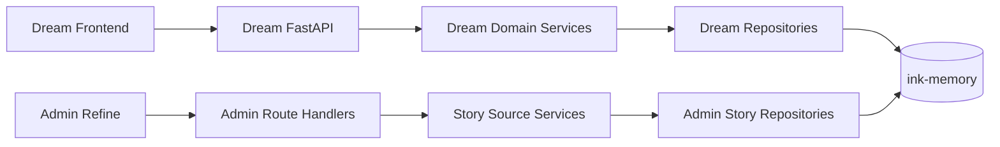

# Dream 业务数据接入与 Admin 读写边界

> 状态：后续实施合同  
> 返回：[总索引](README.md)  
> 依赖：[当前范围与源系统基线](01-current-scope-and-source-baseline.md) · [PostgreSQL 迁移方案](04-postgresql-migration-plan.md)  
> 主要读者：Dream 后端、Admin 后端、DBA、安全审计

## 1. 接入方式

本期不增加 Dream → Admin 的计费、订阅或推理 HTTP 调用。业务接入指的是：Dream 完成 PostgreSQL 切换后，Dream 和 Admin 通过同一个 `ink-memory` 数据库共享 canonical 业务事实，但使用不同 Repository、数据库角色和写权限。



Dream Frontend 继续只调用 Dream FastAPI。Admin Frontend 继续只调用 Admin API。浏览器不直连 PostgreSQL，也不把内部兼容 ID 当作用户输入。

## 2. canonical 实体映射

| 业务实体 | PostgreSQL 权威表 | Dream 写入边界 | Admin 本期边界 |
|---|---|---|---|
| 平台用户 | `users` | 注册、认证资料和业务账户流程 | 只读业务资料；不改 password hash、不创建第二类用户 |
| Workspace | `story_workspace_workspaces` | 现有业务流程；PATCH name/settings | 列表/详情；只允许 name/settings 白名单更新 |
| Story | `story_workspace_stories` | 业务/Agent 创建；白名单 PATCH；confirm/reject/archive 命令 | 列表/详情；同一白名单和状态命令；无通用 create/delete |
| Character | `story_workspace_characters` | 业务/Agent 创建；白名单 PATCH；confirm/reject | 迁入闭包完整后条件开放；无通用 create/delete |
| Scene | `story_workspace_scenes` | 业务/Agent 创建；白名单 PATCH；confirm/reject | 迁入闭包完整后条件开放；移动 Story 前校验同 owner/workspace |
| Story–Character | `story_workspace_story_characters` | 领域事务维护 | 详情读取；未来写入必须校验两端 Workspace |
| Scene–Character | `story_workspace_scene_characters` | 领域事务维护 | 详情读取；未来写入必须校验两端 Workspace |
| Workflow | `workflow_runs`、`workflow_run_transitions`、`workflow_run_token_consumptions` | preflight/start/retry/cancel 等命令；历史事实只追加 | 当前无正式页面；未来默认只读，不允许 PATCH status/delete |
| Deck/Voice | `decks`、`voices` | Dream 现有领域逻辑 | 本期不接入 Admin Resource |
| Chat/Agent | `chat_thread`、`chat_message`、`agent_sessions` | Dream 现有领域逻辑 | 本期不接入 Admin；内容按隐私最小披露 |
| Plugin/Runtime/Reflection/Event | 对应 canonical 原名表 | Dream 现有领域逻辑 | 本期不新增 Admin CRUD |

## 3. 用户身份边界

- `users.id` 是唯一产品用户 ID，也是 Dream 所有业务 FK 的父键。
- Admin 的 `platform_users` 只能是控制面内部兼容行；它不得成为 Dream API、页面或 PostgreSQL 迁移的主用户表。
- PostgreSQL 迁移必须原样保留 `users.id`。现有 INTEGER ID 不转 UUID，不重新编号。
- Dream 不调用“创建计费用户”接口；本期也不读取账户、订阅、额度、Gateway Key 或 Ledger。
- Admin 认证/RBAC 的 `admin_users` 与 Dream `users` 是不同安全域，不能用 `users.role` 替代 Admin permission。

## 4. 数据库角色和最小权限

建议目标角色：

| 角色 | 权限 |
|---|---|
| `ink_dream_app` | Dream canonical 表的业务 SELECT/INSERT/UPDATE/DELETE；实际删除仍受领域规则和 FK 限制 |
| `ink_admin_app` | canonical 表 SELECT；仅对确认的列或安全函数授予 UPDATE/命令权限；Admin 控制面表按自身迁移授权 |
| `ink_dream_migrator` | 仅迁移窗口使用；Dream Schema DDL 和显式数据导入；不作为应用连接角色 |
| `ink_admin_migrator` | 仅 Admin Drizzle migration；不得修改 Dream-owned 表（已发布的三表基线例外需完成所有权交接） |

优先使用列级 GRANT 或 `SECURITY DEFINER` 领域函数承载 Admin 状态命令；不能为了方便给 `ink_admin_app` Dream 全表所有权。数据库角色、Session permission 和 UI 按钮三层都不能单独充当完整授权边界。

## 5. Admin 受控写策略

1. Route Handler 只做 Session、permission、Origin、Zod 和 service 调用。
2. Story Source service 在同一 PostgreSQL 事务中读取当前行、检查 owner/workspace/FK/状态版本、执行白名单更新并写 Admin Audit。
3. FK、unique、check、状态竞态和关联范围冲突统一映射 409；资源不存在 404；表/数据库不可用 503；未知异常 500。
4. Character/Scene/Workflow 表未迁入或闭包不完整时 fail-closed 503，不读取旧 `story_*` 平行表。
5. Workspace/Story/Character/Scene 不提供通用硬删除；Workflow transition、Token consumption、Event 等不可变表不提供 UPDATE/DELETE。
6. Admin 旧平行表只保留历史数据和 deprecated 标记；任何合并必须单独审计，不能自动写入 canonical 表。

## 6. Dream Repository 改造建议

Dream 后续实施时建议按领域拆分，而不是继续向 4,700+ 行 `backend/database.py` 追加 PostgreSQL 分支：

```text
backend/
  persistence/
    postgres.py                 # psycopg pool、事务、dict row、健康检查
    errors.py                   # PG 错误到领域错误
  repositories/
    users.py
    auth.py
    story_workspace.py
    sessions.py
    chat.py
    decks.py
    workflow.py
    plugins.py
    reflections.py
    events.py
  migrations/
    env.py
    versions/
  scripts/
    migrate_sqlite_to_postgres.py
    verify_postgres_migration.py
```

`backend/database.py` 在过渡期只能作为旧调用兼容门面：函数逐个委托到 Repository，并在全部调用迁走后删除 SQLite runtime。禁止实现一个把 SQLite SQL 字符串动态翻译成 PostgreSQL 的长期兼容层。

重点修改位置：

- `backend/database.py`：拆出 Schema/seed/query/transaction；最终不再打开主 SQLite。
- `backend/config.py`、`backend/.env.example`、部署清单：增加目标 `DATABASE_URL` 配置合同；`INK_DATABASE_PATH` 只供显式迁移 CLI。
- `backend/routers/auth.py`、`sessions.py`、`story_workspace.py`、`friends.py`、`oauth.py`、`claude_plugins.py`、`deck_plugins.py` 等：依赖注入 Repository/Unit of Work，不直接调用 `database.get_db()`。
- `backend/services/**`：移除 `sqlite3.Connection`、`row_factory`、`BEGIN IMMEDIATE` 和 PRAGMA 假设。
- `backend/server.py`：启动时只检查/应用已审批 migration version，不再运行巨型 `create_tables()` 作为生产迁移。
- `backend/notion/store.py`：作为独立最后波次迁入 PostgreSQL；不能被主库切换遗漏。

## 7. API 合同

本期 Dream 对前端的 URL、请求体和成功响应保持兼容；数据库切换不能要求前端理解 PG ID、事务或内部兼容键。允许增加的仅是通用可靠性信息：

- 写冲突：HTTP 409 + 安全 `code` + request ID；保留用户输入后刷新资源。
- 数据库维护：HTTP 503 + `Retry-After`；不回退 SQLite。
- 认证失效：维持既有 401/刷新流程。
- 不得在错误中返回 SQL、DSN、password hash、OAuth token、Story 正文或内部 stack。

本期不增加 billing/subscription/payment/inference/Gateway 错误码。

## 8. 跨项目迁移所有权

- Dream 项目成为 canonical 业务 Schema 的长期迁移所有者。
- Admin 已发布 `0010_story_source_canonical.sql` 创建首批三表；Dream 首个 PG baseline 必须先核对这些表的列、约束、索引和所有权。完全一致时“adopt baseline”，不重复 CREATE；不一致时停止并输出差异，禁止自动覆盖。
- 完成所有权交接后，Admin 新 migration 不再变更 Dream-owned 表；Admin 只维护控制面表和明确的兼容外键/视图。
- 两个项目的 migration journal 分离：Dream 使用自己的版本表，Admin 保留 Drizzle journal，任何部署先检查跨项目兼容矩阵。

## 9. 验收

- 同一 `users.id` 在 Dream 页面、Dream API 和 Admin Story 运营中表示同一用户。
- Workspace/Story 的读写结果与切换前 SQLite 业务合同一致；Admin 写入仍受字段白名单、RBAC 和 Audit 保护。
- 缺 Character/Scene/Workflow 表时返回 503，不显示旧表或假数据。
- Dream 不读取或复制 Admin Subscription、Billing、Provider、Gateway、Usage/Ledger 表。
- 任何 PG 迁移/集成测试只使用明确隔离数据库；Dream 源仓库和共享数据不被文档验证过程修改。

