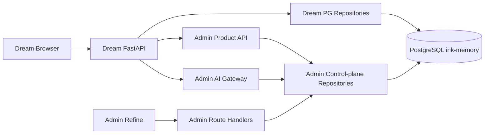
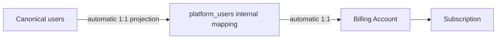

# Dream 业务接入与 Admin/Gateway 边界

> 文档状态：**Planned**  
> 返回：[总索引](README.md)  
> 依赖：[当前基线](01-current-scope-and-source-baseline.md) · [Billing/Subscription/Gateway](06-billing-subscription-gateway-integration.md)  
> 主要读者：Dream 后端、Admin/Gateway 后端、DBA、安全审计

## 1. 目标集成拓扑



浏览器不直连 PostgreSQL、Gateway 或 Provider。Dream FastAPI 是产品用户身份和服务间凭据的边界；Admin 浏览器仍只访问 Admin API。

## 2. 唯一用户与自动计费身份

- `users.id` 是唯一平台产品用户 ID，也是 Dream canonical 业务 FK 父键。
- `platform_users` 只为 Admin 既有 text FK 提供内部一对一映射，不能成为页面、名册、创建按钮或第二套资料源。
- 每个 `users` 行必须由受控 projection 自动获得 mapping 和 `billing_accounts`；不存在 `POST 创建计费用户`。
- 用户关系选择器必须以 `users` 为权威做服务端 `q/page/pageSize/total`，不能预载前 50/100 后本地过滤。
- Gateway Key、Subscription、Model Permission、credit 等命令必须在同一事务反向 JOIN canonical user；mapping 缺失可调用受控 projector，orphan 则 fail-closed。
- 历史 orphan `platform_users` 先审计 Key、余额、Usage、Ledger、Subscription，再隔离/禁用或映射；不得删除财务历史。



## 3. 领域所有权

| 领域 | Dream 边界 | Admin/Gateway 边界 | 禁止 |
|---|---|---|---|
| 43+5 canonical Schema | DDL、Alembic、Repository、业务写、数据迁移 | 批准读取、白名单更新或领域命令 | Admin 通用硬删、继续扩展 Dream DDL |
| canonical User | 注册、认证、资料真值 | 自动映射/account、产品 API只读资料 | 独立计费用户创建、修改映射 email/display name |
| Workspace/Story/Character/Scene | 业务/Agent 完整写 | 受控读取、白名单字段和状态命令 | 直接 SQL PATCH status、通用 create/delete |
| Workflow/Plugin/Runtime/Event | 命令与不可变事实 | 默认只读、最小披露 | UPDATE/DELETE history |
| Plan/Subscription | 展示真实状态、提交产品命令 | 版本、状态机、幂等、审计 | Dream 复制 Plan/Entitlement 或直接写表 |
| Billing/Usage/Ledger | 产品只读视图 | reserve/capture/release/refund/reversal、事实存储 | 浏览器浮点金额、直接改余额、覆盖历史账本 |
| Provider/Model/Pricing/Gateway | 服务端以 stable alias 发请求 | 配置、Secret、Key、资格、限流、路由、计价、结算 | 浏览器 Key、Dream Provider Secret、日志回显 |
| Payment | 展示真实平台状态 | Adapter、Webhook、event store、幂等、测试 Fake | 虚假成功、生产 Fake、真实渠道网络 |

## 4. Repository、角色与迁移日志

目标角色：

| 角色 | 最小权限目标 |
|---|---|
| `ink_dream_app` | Dream canonical 表的业务权限；实际删除仍受领域规则/FK/trigger 限制 |
| `ink_admin_app` | canonical SELECT + 批准列级 UPDATE/领域函数；Admin 控制面按自身迁移权限 |
| `ink_dream_migrator` | 仅迁移窗口使用，管理 Dream-owned DDL与导入 |
| `ink_admin_migrator` | 仅 Admin Drizzle migration，不修改已交接的 Dream 表 |

Dream 使用独立 Alembic version table，Admin 保留 Drizzle journal；部署前检查 compatibility matrix。以上是逻辑所有权目标，不代表真实 owner/ACL。对 `pg_class`、role membership、grants、constraints 和现有行只读盘点后，任何 `ALTER OWNER`、GRANT/REVOKE 均需单独审批；本文不授权执行。

## 5. Admin 对 canonical 业务表的写边界

1. Route Handler 只做 Session、RBAC、Origin、Zod、幂等头解析和 service 调用。
2. Service 在事务中读取当前行、检查 owner/workspace/FK/乐观版本、执行白名单命令并写 Admin Audit。
3. Character/Scene/Workflow 迁移闭包未完成时 fail-closed 503，不读取旧 `story_*` 平行表。
4. Workspace/Story/Character/Scene 无通用硬删除；Workflow transition、Token consumption、Event、receipt 等不可变事实不提供 UPDATE/DELETE。
5. Admin 旧平行表只保留 deprecated 历史；任何归档/删除需独立审计与批准 migration。

## 6. Dream 对控制面的访问边界

Dream 只经 [06](06-billing-subscription-gateway-integration.md) 规定的 Product API 与 Gateway：

- 浏览器 Session → Dream FastAPI canonical user；服务端再绑定同一 user ID 和服务身份。
- Product API 返回发布中的 Plan/Version/Entitlement、当前 Subscription、Allowance/Balance/Usage/Ledger 的产品投影；不返回内部 Secret 或任意控制面列。
- 生命周期写操作由 Dream 提交带 idempotency key 与 expected version 的命令；Dream 不自行推演/写入最终状态。
- Gateway request 只携带获准 model alias 和协议 payload；Gateway 负责资格、Provider 选择、pricing snapshot 和 settlement。
- Dream 不缓存套餐/价格为长期真值；短 cache 必须有版本/ETag，503 时显示不可用而不是静态 fallback。

## 7. API/领域错误合同

| HTTP | 领域语义 | Dream 恢复合同 |
|---:|---|---|
| 401 | 浏览器 Session 或服务身份无效 | 刷新/重新登录；不伪装成余额错误 |
| 402 | Allowance 与允许的余额均不足，单位明确 | 保留输入，展示额度/余额和可执行动作；不自动充值 |
| 403 | 订阅状态、Entitlement、模型权限或 RBAC 拒绝 | 禁用对应操作并给出安全原因 |
| 404 | Plan/version/subscription/model alias 等不存在或不可见 | 刷新产品上下文；不使用本地默认对象 |
| 409 | idempotency、expected version、生命周期或并发冲突 | 拉取新状态并重新做影响预览 |
| 429 | RPM/token quota/平台限流 | 尊重 `Retry-After`，避免无界重试 |
| 502 | Provider 失败或协议错误 | 显示上游失败；Gateway 必须结算到 release/capture/failed 终态 |
| 503 | 数据库、配置、维护或结算不可确定 | 显示维护/重试；不回退 SQLite、静态计划或直接 Provider |

错误体只含稳定 `code`、安全 `message`、`request_id`、可选 `retry_after`/`unit`/`current_version`；不返回 SQL、DSN、Secret、内部 stack、正文或 Provider 原始敏感响应。

## 8. Dream Repository 目标结构

```text
backend/
  persistence/
    postgres.py
    unit_of_work.py
    errors.py
  repositories/
    users.py
    auth.py
    sessions.py
    story_workspace.py
    chat.py
    decks.py
    workflow.py
    plugins.py
    reflections.py
    events.py
    notion.py
  integrations/
    admin_product_client.py
    ai_gateway_client.py
  migrations/
    env.py
    versions/
```

`backend/database.py` 只能暂作逐函数委托的迁移门面，最终从 runtime 删除 SQLite open。禁止建立通用 SQLite SQL→PostgreSQL 翻译层。

## 9. 验收

- 同一 `users.id` 在 Dream、Admin 产品 API、Gateway、Billing Account 和 Subscription 中含义一致。
- Dream 与 Admin 使用独立 Repository、应用角色和 migration journal；所有权盘点与授权变更有独立回执。
- Product API 与 Gateway 是 Dream 唯一控制面/推理接入；浏览器和 Dream 业务表没有任何 Secret。
- Admin canonical 写入受白名单、版本、RBAC、Origin、事务和 Audit 保护；不可变事实拒绝修改。
- 401/402/403/404/409/429/502/503 均有自动测试和无假数据恢复状态。
