# Dream PostgreSQL、产品 API 与 Gateway 发布回滚

> 文档状态：**Current release plan**（R1–R4 与本地 R5 已完成；其他生产 R0/R5 及 R6–R8 仍开放）
> 返回：[总索引](README.md)
> 依赖：[PG 迁移](04-postgresql-migration-plan.md) · [Token-only Subscription/Gateway](06-billing-subscription-gateway-integration.md) · [Dream 集成](07-dream-subscription-and-inference-integration.md)
> Deferred：[Payment/订阅支付](08-payment-adapter-and-webhook-boundary.md)
> 主要读者：QA、运维、Dream/Admin/Gateway 后端、安全、发布负责人

## 1. 发布原则

- 每阶段在隔离环境满足自身门禁后才进入下一阶段；文档目标不能替代代码和测试证据。
- 所有 PG 测试只使用明确命名、可删除的临时 PostgreSQL 或显式 `TEST_DATABASE_URL`；拒绝 runtime URL、共享端口和未知数据库。
- 43+5 cutover 不长期双写；Gateway 可做不扣费的 shadow eligibility 和用户 canary，但不能绕过资格/结算直接 Provider。
- Dream/Admin/Gateway 使用独立 Repository、迁移日志、角色和 rollback switch；一个组件回滚不自动回滚数据库。
- PG 已产生业务写后默认前向修复；没有演练 delta exporter 时禁止回切 SQLite。
- PaymentAdapter、Webhook、Fake guard 与付费开通已实现；真实第三方支付渠道与 ASR Gateway 明确 Deferred。生产 Fake 必须 fail closed，UI 不得伪造成功。

## 2. 发布依赖序列

```mermaid
flowchart LR
  D["Docs + Reader Testing"] --> P["PG 48-table rehearsal"]
  P --> I["Canonical billing identity"]
  I --> A["Admin token-only Product API"]
  A --> U["Dream subscription UX on isolated PG"]
  U --> C["43+5 PG cutover"]
  C --> S["Gateway shadow eligibility"]
  S --> G["Gateway reserve/capture canary"]
  G --> F["Role-by-role inference cutover"]
```



## 3. 阶段、当前状态与退出门禁

| 阶段 | 当前状态 | 允许动作 | 退出门禁 |
|---|---|---|---|
| R0 安全 preflight | **Partial**：隔离 PG、active runtime credential 移除/scan 与 ASR fail-closed 完成；owner 轮换/历史处置未确认 | 仓库/Schema 只读盘点、credential 处置、secret scan、ASR 加固、临时 PG 建立 | 目标 fingerprint 明确；无共享 DB 写；P0 credential 已由所有者确认吊销/轮换。任何生产部署不得早于本门禁 |
| R1 Schema CI | **Passed in isolation**：48/569/81/25、空库/exact-adopt/drift fail-closed | 临时 PG Alembic upgrade、baseline adopt、Repository contract | 48/48 DDL/repository/validator manifest；Admin 表未被 Dream migration 修改；生产 owner/ACL 仍另审 |
| R2 全量 rehearsal | **Passed / local source complete**：43+5 CLI、backend 1,679 passed/14 skipped + 652 subtests；本地真实源 4,921 行 rollback/commit/production-mode rehearsal 全通过 | 只读 SQLite snapshot → staging → PG → verification | 每个新环境重新验证 count/PK/row digest/unique/FK/enum/JSON/time/sequence/trigger |
| R3 用户/控制面闭环 | **Passed locally/in isolation**：Admin `0000–0024`、Token Ledger、付费月续费、66 files/313 tests、tsc/lint/build、订阅 Playwright 4/4 | canonical projection、Token-only Subscription/Product/Payment API 与本机 schema migration 已完成 | 生产 historical orphan 处置、角色 rollout 与 dark-deploy receipt；clone 角色矩阵已通过 |
| R4 Dream UX | **Passed with mocked BFF**：真实页面、frontend lint 0 errors/21 warnings、build、Product API 9/9、订阅 Playwright 4/4 | 预发布完成真实 Token Plans/context/Usage/model catalog、Payment Intent 与 command preview/execute | 真实预发布 Session/服务身份/Admin API 冒烟；无静态/假 Payment fallback |
| R5 PG cutover | **Local complete / other environments Planned**：`localhost:5433/ink-memory` 已完成 Admin 25 migrations + Dream `20260809_06`、4,921 行迁移、catalog 与 startup；其他目标无回执 | 短暂停写、最终 43+5 snapshot/import、PG-only deployment | runtime SQLite open=0；全部领域 API/页面/Admin canonical 回归通过 |
| R6 Gateway shadow | **Implemented client/control; production shadow Planned** | 只执行资格与路由模拟，不 reserve、不 Provider | 真实 cohort 资格结果一致；无 Key/Secret 泄漏；无 cash fallback |
| R7 Gateway canary | **Planned external step** | 内部环境→内部用户→用户级 canary，真实 Token reserve/capture/release | 外部 Provider 下错误/取消/断流/usage 缺失终态和 Token 守恒通过 |
| R8 inference cutover | **Code implemented / production rollout planned** | 文本 PolyAgent、Claude Agent/Chat、Dream/Workflow、image 均已接 Gateway；按入口分批 canary | 既有协议/行为不回归；direct Provider path 保持删除/fail-closed |

ASR 不进入 R8；release 前仅允许“禁用 endpoint”或“canonical 鉴权 + Origin + 限流 + 审计”的安全处置。

## 4. R0/R1/R2 PostgreSQL 门禁

### Schema 与所有权

- 空库可从 Dream Alembic baseline 到 head；重复检查无额外 DDL。
- 已存在 Admin canonical 三表时只做精确 adopt；列/约束/index/owner/行差异 fail-closed。
- Dream migration journal 与 Admin Drizzle journal 独立；每个 migration 只触及其 owner 范围。
- 真实 owner/ACL/role/constraint 先只读盘点；任何 `ALTER OWNER`、GRANT/REVOKE 有独立批准和回执。

### 迁移数据

- 主库 43 表、Notion 5 表逐表有 source/stage/target count、PK/row digest、unique、FK orphan。
- JSON、boolean、时间、enum、NULL、identity/sequence、复合 PK、partial unique 都有显式校验。
- 25 个业务 trigger/等价不变性全部用 mutation rejection 验证。
- `reflection_task_event` 与 `connector_snapshots` 同 key+同 digest 幂等、异 digest 冲突，不覆盖历史。
- password hash、OAuth/refresh token、Secret、Story/Chat 正文不进入日志、回执或截图。

### 应用合同

- Auth：register/login/refresh/logout/OAuth/device。
- Story：Workspace、Story、Character、Scene、关系、review/archive、409。
- Session/Chat、Deck/Voice/Plugin、Workflow/Agent、Reflection/Event/Notion 全部走 PG Repository。
- maintenance/503 不回退 SQLite；所有列表有显式稳定排序。

## 5. R3 控制面门禁

- 所有 canonical `users` 天然是订阅主体；内部 mapping/account 可继续自动投影，但无独立计费用户 POST/UI/筛选。
- 用户 selector 使用服务端 `q/page/pageSize/total`，至少 205 用户、跨页搜索和 selected hydration。
- orphan `platform_users` 的 Key/Subscription/Allowance/Balance/Usage/Ledger 审计完成，隔离过程不删除财务历史。
- Subscription Plan/Version/Entitlement 只保存月度 Token/非货币权益；API/新写入不含 price/currency/micro-USD allowance/cash overage/全局 effective window。Provider Pricing 独立版本历史不受影响。
- Subscription create/renew/upgrade/downgrade/pause/resume/cancel/revoke_cancel、用户周期锚点、自动周期推进、期末取消/撤销和冲突合同通过；Jan 31→Feb 末→Mar 31，无提前/重复续费发 Token。
- Token Allowance reserve/capture/release 在事务锁/幂等键下守恒；耗尽 402，不读取 Billing Account，不写 `subscription_charge`/`allowance_capture`。
- PaymentAdapter/Webhook/Fake/真实渠道的依赖、表、Route、环境变量和 UI 增量为 0。

## 6. R4–R8 Product API 与 Gateway 门禁

- Product API 只从 canonical user 上下文返回真实月度 Token 计划、用户周期、Token Allowance/Usage 与 model alias；无 Balance/Ledger/Payment/内部控制面/Secret 列。
- Dream command 带 idempotency key 与 expected version；409 后重取 preview，不能盲重放。
- Gateway 固定资格顺序：service/Key → canonical user → Subscription → Plan Version → Entitlement → Model Permission → RPM/daily limit → current-period Token Allowance → reserve → Provider；Token 耗尽不得自动进入现金按量。
- Provider/Model/Pricing 使用请求时版本化成本 snapshot；该 micro-USD 事实不进入 Subscription DTO/Allowance/Ledger charge，Token 与金额单位不混用。
- success、Provider failure、cancel、stream interruption、usage missing 都进入明确 request/Token Usage 终态；不按零 Token 成功。
- Gateway Key、Provider/System Secret 不在浏览器、Dream 普通表、响应、console、structured log 或截图中出现；Deferred Payment Secret 不得加入。
- hardcoded Provider credential 已从 active runtime 移除且 secret scan 通过；发布前仍须取得所有者吊销/轮换回执。

## 7. 错误合同验收

| HTTP | 必测场景 | 结算/UX 验收 |
|---:|---|---|
| 401 | Session/service identity/Key 无效 | Provider 未调用；无 reserve；Dream 进入登录/安全错误 |
| 402 | 当前周期 Token Allowance 不足 | `availableTokens/requiredTokens` 单位明确；Provider 未调用；无 Billing Account/Ledger 变化 |
| 403 | subscription/entitlement/model permission/RBAC 拒绝 | Provider 未调用；页面保留只读状态 |
| 404 | plan/version/subscription/model alias 不存在 | 不使用本地 fallback |
| 409 | idempotency/version/lifecycle/settlement 冲突 | 原事务不重复；重取当前 version |
| 429 | RPM/token/平台限流 | `Retry-After`；未调用 Provider 或结算符合已定义阶段 |
| 502 | Provider/protocol 失败 | reserve release 或按真实已用量 capture；request 终态确定 |
| 503 | DB/config/maintenance/settlement unavailable | 不回退 SQLite/direct Provider；不显示成功 |

## 8. 项目验证命令

Admin 至少运行：

```bash
pnpm env:check
pnpm exec tsc --noEmit
pnpm lint
pnpm test:run
pnpm build
```

并运行 focused Playwright：canonical 用户分页、Token-only Subscription 生命周期、Gateway Token 错误/结算与 Secret 不回显；另用静态检查确认 Payment 依赖/页面为 0。

Dream 实现/发布 receipt 命令使用当前已落盘入口；所有 PG 命令必须显式指向 owned disposable database：

```bash
# Current backend suite；PG tests 必须显式读取 TEST_DATABASE_URL
backend/.venv/bin/python -m pytest backend/tests -q

# Schema/Repository/43+5 rehearsal receipt
backend/.venv/bin/python -m alembic -c backend/alembic.ini upgrade head
backend/.venv/bin/python backend/script/migrate_legacy_to_postgres.py \
  --main-sqlite "$(pwd)/backend/data/ink-and-memory.db" \
  --notion-sqlite "$(pwd)/backend/data/notion-connectors.db" \
  --target-dry-run \
  --expected-target-database ink_memory_dream_release_candidate_test
backend/.venv/bin/python backend/script/verify_postgres_schema.py --database

# Current frontend gates
npm --prefix frontend run lint
npm --prefix frontend run build

# focused E2E
npm --prefix frontend exec -- playwright test \
  e2e/story-workspace-subscription.spec.ts --project=chromium --workers=1
```

Dream 仍没有 package-level `frontend unit` script；本轮完成 frontend lint（0 errors/21 warnings）、build、独立 Product API 9/9 与订阅 mocked-browser 4/4。发布回执必须保留 warnings 数量。所有持久化 integration/E2E 使用显式隔离 PG，不能把 SQLite fixture 当作最终通过证据；`.artifacts` 回执不得包含行值、Secret 或正文。

## 9. 生产切换 checklist

以下是生产 checklist。Round 39 的本地 owner/ACL/cutover 回执不能冒充其他环境的生产回执；外部 Provider canary 也尚未执行，因此对应项继续保持未勾选。

- [ ] 变更单记录非敏感 DB/Gateway 环境 fingerprint、Owner、窗口与 rollback owner。
- [ ] PG owner/ACL/constraint/journal/现有行只读盘点完成；备份/PITR 恢复演练通过。
- [ ] 最终 SQLite snapshot hash、权限和恢复步骤验证；所有写入口可统一进入维护。
- [ ] 48 表 manifest 与真实 43+5 inventory 相同，source/target conflict 为 0 或有显式批准处置。
- [ ] PG rollback build（旧功能集 + PG Repository）可部署；若声称能回 SQLite，delta exporter 已演练。
- [ ] canonical projection、205-user selector、orphan 隔离、Token-only Product API 与用户月度状态机门禁通过。
- [ ] Gateway canary 开关可按环境/用户关闭；关闭后不绕到 direct Provider。
- [ ] PaymentAdapter/Webhook/Fake/真实渠道依赖、表、Route、env 和 UI 均未加入。
- [x] active runtime credential 移除、secret scan 与 ASR fail-closed 已完成。
- [ ] credential owner 吊销/轮换与历史处置回执完成。
- [ ] 两个视口及 Admin/Dream 全命令通过，结果/数量写入发布回执。

## 10. 回滚矩阵

| 组件/时点 | 回滚方法 | 数据边界 |
|---|---|---|
| PG 导入前/失败 | 终止，恢复旧 SQLite 写 | 保留失败 receipt/staging；不清共享 PG |
| PG smoke 失败且 committed write=0 | 旧应用 + 最终 SQLite snapshot | 保存 PG 快照，不执行 DROP/TRUNCATE/DELETE |
| PG 已有业务写 | 部署旧功能集 + PG Repository；默认前向修复 | 仅有已演练 delta exporter 才可回 SQLite |
| Product API/Subscription 命令问题 | 关闭命令 flag，保持只读上下文 | 已提交 Subscription Event/Token Usage 不删除；用 forward fix，不恢复 monetary plan 写入 |
| Dream UX 问题 | 回滚前端，保留 PG/Product API | 不恢复静态套餐或假数据 |
| Gateway shadow/canary 问题 | 关闭对应用户 flag，停止新请求 | 已 reserve 请求必须 capture/release 到终态；不丢 request/usage/ledger |

## 11. 监控与回执

监控包含：PG pool/lock/deadlock/timeout/rollback；Subscription transition/周期锚点冲突；Token Allowance 守恒；Gateway eligibility/latency/Provider 5xx/settlement_failed；legacy monetary request 数量；runtime SQLite open；ASR 匿名连接拒绝。日志均以 request/event/migration ID 关联，不记录敏感 payload。

每次发布回执保存 commit、schema versions、非敏感环境 fingerprint、测试命令/通过数量/视口、migration count/digest、canary cohort、错误率、rollback decision、Payment 增量为 0 的检查结果及未执行的外部 Provider 场景。

## 12. 完成标准

- 43+5 已迁入 PG 且 Dream runtime 无 SQLite/JSON DB/内存 DB fallback。
- canonical user→Subscription→Plan Version→Entitlement→Model Permission→current-period Token Allowance→Gateway→Token Usage 完整闭环通过隔离验证；独立现金 Billing 不作套餐兜底。
- Dream 页面只显示真实月度 Token 产品 API 状态；无套餐金额/余额/支付/全局生效日期；既有 Agent/Workflow 不回归。
- PaymentAdapter/Webhook/Fake guard 已通过隔离验证；真实支付渠道保持 Deferred；ASR Gateway 未被误报为实现。
- P0 credential/ASR、Secret、owner/ACL 与共享 DB 安全门禁全部关闭并有证据。
