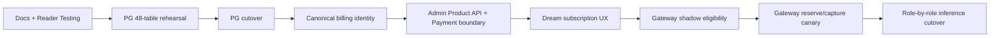

# Dream PostgreSQL、产品 API 与 Gateway 发布回滚

> 文档状态：**Planned**  
> 返回：[总索引](README.md)  
> 依赖：[PG 迁移](04-postgresql-migration-plan.md) · [Billing/Gateway](06-billing-subscription-gateway-integration.md) · [Dream 集成](07-dream-subscription-and-inference-integration.md) · [Payment 边界](08-payment-adapter-and-webhook-boundary.md)  
> 主要读者：QA、运维、Dream/Admin/Gateway 后端、安全、发布负责人

## 1. 发布原则

- 每阶段在隔离环境满足自身门禁后才进入下一阶段；文档目标不能替代代码和测试证据。
- 所有 PG 测试只使用明确命名、可删除的临时 PostgreSQL 或显式 `TEST_DATABASE_URL`；拒绝 runtime URL、共享端口和未知数据库。
- 43+5 cutover 不长期双写；Gateway 可做不扣费的 shadow eligibility 和用户 canary，但不能绕过资格/结算直接 Provider。
- Dream/Admin/Gateway/Payment 使用独立 Repository、迁移日志、角色和 rollback switch；一个组件回滚不自动回滚数据库。
- PG 已产生业务写后默认前向修复；没有演练 delta exporter 时禁止回切 SQLite。
- 真实第三方支付渠道与 ASR Gateway明确 Deferred；不影响当前代码边界完成，但 UI 不得伪造渠道成功。

## 2. 发布依赖序列



## 3. 阶段与退出门禁

| 阶段 | 允许动作 | 退出门禁 |
|---|---|---|
| R0 安全 preflight | 仓库/Schema 只读盘点、secret scan、临时 PG 建立 | 目标 fingerprint 明确；无共享 DB 写；P0 credential 有吊销/轮换负责人 |
| R1 Schema CI | 临时 PG Alembic upgrade、baseline adopt、Repository contract | 48/48 DDL/owner/repository/validator manifest；Admin 表未被 Dream migration 修改 |
| R2 全量 rehearsal | 只读 SQLite snapshot → staging → PG → verification | 43+5 count/PK/row digest/unique/FK/enum/JSON/time/sequence/trigger 全通过 |
| R3 PG cutover | 短暂停写、最终 snapshot/import、PG-only deployment | runtime SQLite open=0；核心 API/页面/Admin canonical 回归通过 |
| R4 用户/控制面闭环 | canonical projection、Billing Account、Subscription、Product API、Payment boundary | 205-user selector；orphan fail-closed；状态机/守恒/Webhook 幂等通过 |
| R5 Dream UX | 真实 Plans/context/Usage/Ledger/model catalog、命令 preview | 无静态套餐/价格/余额/model fallback；两个视口状态通过 |
| R6 Gateway shadow | 只执行资格与路由模拟，不 reserve、不 Provider | 资格结果与预期一致；无 Key/Secret 泄漏；cash-only 默认放行已关闭/受旗标控制 |
| R7 Gateway canary | 内部环境→内部用户→用户级 canary，真实 reserve/capture/release | 401/402/403/409/429/502/503、取消/断流/usage 缺失终态和账本守恒通过 |
| R8 inference cutover | PolyAgent→Claude Agent/Chat→Dream/Workflow→image 分批切换 | 既有协议/行为不回归；direct Provider path 被关闭或明确受控 legacy canary |

ASR 不进入 R8；release 前仅允许“禁用 endpoint”或“canonical 鉴权 + Origin + 限流 + 审计”的安全处置。

## 4. R0/R1/R2 PostgreSQL 门禁

### Schema 与所有权

- 空库可从 Dream Alembic baseline 到 head；重复检查无额外 DDL。
- 已存在 Admin canonical 三表时只做精确 adopt；列/约束/index/owner/行差异 fail-closed。
- Dream migration journal 与 Admin Drizzle journal 独立；每个 migration 只触及其 owner 范围。
- 真实 owner/ACL/role/constraint 先只读盘点；任何 `ALTER OWNER`、GRANT/REVOKE 有独立批准和回执。

### 迁移数据

- 主库 43 表、Notion 5 表逐表有 source/stage/target count、PK/row digest、unique、FK orphan。
- JSON、boolean、时间、enum、NULL、identity/sequence、复合 PK、partial unique 都有显式校验。
- 25 个业务 trigger/等价不变性全部用 mutation rejection 验证。
- `reflection_task_event` 与 `connector_snapshots` 同 key+同 digest 幂等、异 digest 冲突，不覆盖历史。
- password hash、OAuth/refresh token、Secret、Story/Chat 正文不进入日志、回执或截图。

### 应用合同

- Auth：register/login/refresh/logout/OAuth/device。
- Story：Workspace、Story、Character、Scene、关系、review/archive、409。
- Session/Chat、Deck/Voice/Plugin、Workflow/Agent、Reflection/Event/Notion 全部走 PG Repository。
- maintenance/503 不回退 SQLite；所有列表有显式稳定排序。

## 5. R4 控制面门禁

- 所有 canonical `users` 自动获得内部 mapping 与 Billing Account；无独立计费用户 POST/UI。
- 用户 selector 使用服务端 `q/page/pageSize/total`，至少 205 用户、跨页搜索和 selected hydration。
- orphan `platform_users` 的 Key/Subscription/Allowance/Balance/Usage/Ledger 审计完成，隔离过程不删除财务历史。
- Plan Version、Entitlement、Pricing 只创建版本，不覆盖生效历史。
- Subscription create/renew/upgrade/downgrade/pause/resume/cancel、自动周期推进、期末取消和冲突合同通过。
- Allowance reserve/capture/release 与 cash overage 在事务锁/幂等键下守恒；refund/reversal 只追加。
- Payment event ID 唯一；签名失败不推进业务；重复 event 不重复开通或扣费；生产启动拒绝 Fake Adapter。

## 6. R5–R8 Product API 与 Gateway 门禁

- Product API 只从 canonical user 上下文返回真实计划、订阅、Allowance/Balance、Usage/Ledger 与 model alias；无内部控制面/Secret 列。
- Dream command 带 idempotency key 与 expected version；409 后重取 preview，不能盲重放。
- Gateway 固定资格顺序：service/Key → canonical user → Subscription → Plan Version → Entitlement → Model Permission → RPM/token → Allowance → cash balance → reserve → Provider。
- Provider/Model/Pricing 使用请求时版本化 snapshot；金额以 integer micro-USD，Token 与金额单位不混用。
- success、Provider failure、cancel、stream interruption、usage missing 都进入明确 request/usage/ledger 终态；不按零成本成功。
- Gateway Key、Provider/Payment/System Secret 不在浏览器、Dream 普通表、响应、console、structured log 或截图中出现。
- hardcoded Provider credential 已确认吊销/轮换并从代码移除；secret scan 通过。

## 7. 错误合同验收

| HTTP | 必测场景 | 结算/UX 验收 |
|---:|---|---|
| 401 | Session/service identity/Key 无效 | Provider 未调用；无 reserve；Dream 进入登录/安全错误 |
| 402 | Allowance 与允许余额不足 | 单位明确；Provider 未调用；无负余额/双扣 |
| 403 | subscription/entitlement/model permission/RBAC 拒绝 | Provider 未调用；页面保留只读状态 |
| 404 | plan/version/subscription/model alias 不存在 | 不使用本地 fallback |
| 409 | idempotency/version/lifecycle/settlement 冲突 | 原事务不重复；重取当前 version |
| 429 | RPM/token/平台限流 | `Retry-After`；未调用 Provider 或结算符合已定义阶段 |
| 502 | Provider/protocol 失败 | reserve release 或按真实已用量 capture；request 终态确定 |
| 503 | DB/config/maintenance/settlement unavailable | 不回退 SQLite/direct Provider；不显示成功 |

## 8. 项目验证命令

Admin 至少运行：

```bash
pnpm env:check
pnpm exec tsc --noEmit
pnpm lint
pnpm test:run
pnpm build
```

并运行 focused Playwright：canonical 用户分页、Subscription 生命周期、Gateway 错误/结算、Payment Webhook 重放与 Secret 不回显。

Dream 先以项目现有命令为准，最低覆盖：Backend unit/integration、PG Repository contract、43+5 rehearsal、frontend lint/build/unit，以及 1440×1000、390×844 focused E2E。所有持久化集成/E2E 使用显式隔离 PG，不能把 SQLite fixture 当作最终通过证据。

## 9. 生产切换 checklist

- [ ] 变更单记录非敏感 DB/Gateway 环境 fingerprint、Owner、窗口与 rollback owner。
- [ ] PG owner/ACL/constraint/journal/现有行只读盘点完成；备份/PITR 恢复演练通过。
- [ ] 最终 SQLite snapshot hash、权限和恢复步骤验证；所有写入口可统一进入维护。
- [ ] 48 表 manifest 与真实 43+5 inventory 相同，source/target conflict 为 0 或有显式批准处置。
- [ ] PG rollback build（旧功能集 + PG Repository）可部署；若声称能回 SQLite，delta exporter 已演练。
- [ ] canonical projection、205-user selector、orphan 隔离、Product API与状态机门禁通过。
- [ ] Gateway canary 开关可按环境/用户关闭；关闭后不绕到 direct Provider。
- [ ] Fake Payment Adapter 在 production hard fail；真实渠道 UI 不出现。
- [ ] credential 已吊销/轮换、代码移除、secret scan 通过；ASR endpoint 安全处置完成。
- [ ] 两个视口及 Admin/Dream 全命令通过，结果/数量写入发布回执。

## 10. 回滚矩阵

| 组件/时点 | 回滚方法 | 数据边界 |
|---|---|---|
| PG 导入前/失败 | 终止，恢复旧 SQLite 写 | 保留失败 receipt/staging；不清共享 PG |
| PG smoke 失败且 committed write=0 | 旧应用 + 最终 SQLite snapshot | 保存 PG 快照，不执行 DROP/TRUNCATE/DELETE |
| PG 已有业务写 | 部署旧功能集 + PG Repository；默认前向修复 | 仅有已演练 delta exporter 才可回 SQLite |
| Product API/Subscription 命令问题 | 关闭命令 flag，保持只读上下文 | 已提交 Subscription Event/Ledger 不删除；用 reversal/forward fix |
| Dream UX 问题 | 回滚前端，保留 PG/Product API | 不恢复静态套餐或假数据 |
| Gateway shadow/canary 问题 | 关闭对应用户 flag，停止新请求 | 已 reserve 请求必须 capture/release 到终态；不丢 request/usage/ledger |
| Payment boundary 问题 | 禁用 Adapter intake/command，保留 event store | 不删除 event；修复后按 event ID 重放 |
| Fake Adapter 误入生产 | 立即 fail closed、关闭入口并安全审计 | 不把 fake event 转成正式支付成功 |

## 11. 监控与回执

监控包含：PG pool/lock/deadlock/timeout/rollback；Subscription transition 冲突；Allowance 守恒；Gateway eligibility/latency/Provider 5xx/settlement_failed；Webhook invalid signature/replay；runtime SQLite open；ASR 匿名连接拒绝。日志均以 request/event/migration ID 关联，不记录敏感 payload。

每次发布回执保存 commit、schema versions、非敏感环境 fingerprint、测试命令/通过数量/视口、migration count/digest、canary cohort、错误率、rollback decision、未执行的真实支付/外部 Provider 场景。

## 12. 完成标准

- 43+5 已迁入 PG 且 Dream runtime 无 SQLite/JSON DB/内存 DB fallback。
- canonical user→Billing Account→Subscription→Entitlement→Model Permission→Allowance/Balance→Gateway→Usage→Ledger 完整闭环通过隔离验证。
- Dream 页面只显示真实产品 API状态；既有 Agent/Workflow 不回归。
- Payment Adapter/Webhook 边界可验证且真实支付渠道仍 Deferred；ASR Gateway 未被误报为实现。
- P0 credential/ASR、Secret、owner/ACL 与共享 DB 安全门禁全部关闭并有证据。
