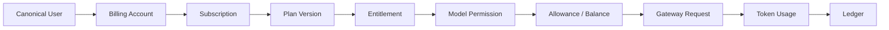
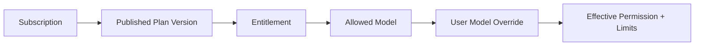
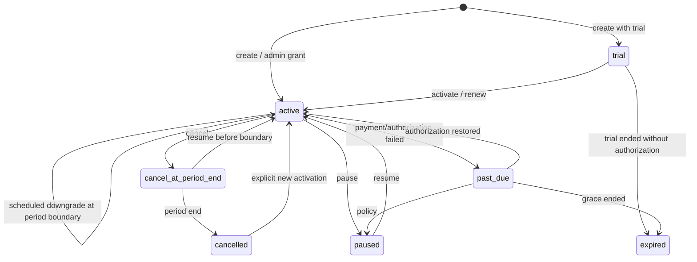
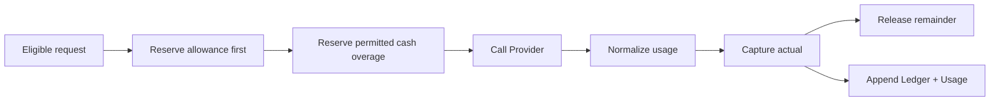

# Billing、Subscription 与 AI Gateway 集成架构

> 文档状态：**Planned**（包含 **Implemented baseline / Partial** 的当前事实）  
> 返回：[总索引](README.md)  
> 依赖：[业务边界](02-business-integration-and-admin-boundary.md) · [发布门禁](05-release-rollout-and-rollback.md)  
> 下游：[Dream 产品与推理集成](07-dream-subscription-and-inference-integration.md) · [Payment 边界](08-payment-adapter-and-webhook-boundary.md)  
> 主要读者：产品架构、Admin/Gateway 后端、Dream 后端、QA、安全

## 1. Current / Target / Release Gate

| 能力 | Current | Target | Release Gate |
|---|---|---|---|
| 用户与 Billing Account | `0015` 已做 canonical-driven projection/account；兼容表仍复制 email/display name | `users` 唯一真值；mapping/account 自动 1:1；orphan 隔离 | 205-user 搜索分页；Gateway/命令反查 `users`；无创建计费用户入口 |
| Plan/Version/Entitlement | 六表控制面、published version/entitlement trigger 已存在 | 发布后版本不可覆盖；历史定价/权益快照可重放 | mutation rejection + effective-window 测试 |
| Subscription | 七态 Schema与部分命令已存在 | create/renew/upgrade/downgrade/pause/resume/cancel、自动周期推进、撤销期末取消、past_due 来源完整 | 状态/时间/并发/幂等属性测试 |
| Allowance/Balance/Ledger | token/micro-USD allowance、account、reserve/capture/release 基线 | 守恒的 allowance→cash overage；refund/reversal；append-only 终态 | serializable/row lock、重复请求、竞争升级测试 |
| Gateway | OpenAI/Anthropic 兼容路由、Key/limit/request/usage/pricing 基线 | canonical 用户、订阅、权益、模型权限、限流、额度/余额的固定资格链 | 401/402/403/409/429/502/503 与请求终态测试 |
| Product API | 未实现 | Dream server-only 产品读 API 与生命周期命令 API | Session/service auth、Origin、幂等、redaction、契约测试 |
| Payment | 未实现 | Adapter/Webhook 边界、test-only Fake | 重复 event 不重复开通/扣费；生产 hard fail Fake |

“Implemented baseline”只说明已有代码/Schema 可复用，不表示整个产品链已完成。

## 2. 目标业务链

任一箭头不可由浏览器直接写表补齐。用户投影、订阅命令、Gateway 资格和结算分别由受控 service transaction 完成。

## 3. canonical 用户、mapping 与 account

### Current 缺口

- `platform_users` 仍复制 `email/display_name`，mutation 白名单若可直接修改会与 `users` 产生资料 split-brain。
- Gateway Key 鉴权当前只 JOIN `platform_users`，没有证明对应 canonical `users` 仍存在。
- 专用选择器加载前 100，通用 Relation selector 首批 50/100，不能代表完整用户集。
- Subscription/Key/Permission/credit 命令尚未统一调用 canonical projection/account ensure。

### Target 合同

1. 新建 `CanonicalUserRelationService`，查询源固定为 `users`，提供 `q/page/pageSize/total`、稳定排序与 selected hydration。
2. `ensureBillingIdentity(user_id)` 只在已经锁定/确认 canonical user 后幂等创建 mapping/account；不能接受任意外部 email 作为开户依据。
3. 从兼容 mapping 的产品 mutation schema 移除 `email/display_name`；资料修改只走 canonical User 领域命令。
4. orphan mapping 先生成关联 Key/Subscription/Allowance/Balance/Usage/Ledger 摘要，再 `isolated/disabled`；禁止硬删。
5. `billing_accounts` 与 mapping 一对一，初始余额为 0；自动存在不等于自动赠款，赠款由 Plan/Subscription/管理员 auditable command 产生。

## 4. Plan、Version、Entitlement 与 Pricing

- `subscription_plans` 是稳定产品标识；`subscription_plan_versions` 保存周期、base price、trial/grace、allowance 与 overage policy。
- draft version 可编辑；published version 与其 entitlement 不可 UPDATE/DELETE。更改必须创建新 `version_number` 并保留旧历史。
- Entitlement 固定 gateway scopes、model、RPM、daily/monthly token 与 storage limit；发布时做完整性校验。
- `ai_pricing_rules` 使用有效窗口和整数 micro-USD；请求建立时将 rule ID、输入/输出/cache 单价、markup/discount 保存为 snapshot。
- API 金额真值使用 integer micro-USD 的 string 或已验证安全 integer；前端 float 只能用于展示格式化，不能回传为账务输入。

## 5. Subscription 状态机

目标状态：`trial`、`active`、`past_due`、`paused`、`cancel_at_period_end`、`cancelled`、`expired`。

每个命令必须携带全局/用户域唯一 idempotency key 与 `expected_version`，在事务中锁定 Subscription、当前 allowance、必要 Billing Account，并写 append-only `subscription_events`。同 key+同 canonical request digest 返回原结果；同 key+异 digest 返回 409。

### 生命周期规则

| 命令 | 生效 | 最低不变式 |
|---|---|---|
| create | 即时 trial/active | 一个用户最多一个 callable 状态；创建 period allowance |
| renew | 新 period | 老 period 不覆盖；新 allowance 新行；重复命令不重复赠款 |
| upgrade | 默认即时，服务端 preview 定义 | 新 version snapshot；额度 delta 只追加；不重算已结算 Usage |
| downgrade | 默认下周期 | 写 `pending_plan_version_id`；周期边界原子切换 |
| pause | 即时或策略指定 | 禁止新 Gateway reserve；在途请求仍结算到终态 |
| resume | 在允许期内 | 重检 Plan/version 可用性、period 与 allowance |
| cancel | 默认期末 | `cancel_at_period_end` 可在边界前撤销；边界后写 cancelled event |

自动 period worker 使用 claim/lock、幂等 boundary key 和可重放 event；不能依赖仅 UI 访问时推进。

## 6. Allowance、余额与 Ledger 守恒

每个请求先以保守估算预授权，真实 usage 后 capture 差额，未使用部分 release：

守恒式：

- `reserved_tokens + consumed_tokens <= granted_tokens`
- `reserved_microusd + consumed_microusd <= granted_microusd`
- `billing.available_microusd >= 0`、`billing.reserved_microusd >= 0`
- 同一 request/account 的 reserve、capture、release、refund、reversal 由稳定 idempotency key 关联，金额变化与 Ledger before/after 一致。

Allowance 优先级固定：token allowance → money allowance → 若 version `overage_policy=cash_balance` 才使用 cash balance；禁止当前无订阅用户的默认 cash-only 放行。迁移期间若保留兼容路径，必须有默认关闭、可观测、按用户的 canary flag，并在正式门禁前删除。

refund/reversal 不 UPDATE 旧 Ledger，而是追加相反方向 entry 并引用原 entry/request；所有人工 credit/debit 需要 RBAC、Origin、reason、idempotency 和 Admin Audit。

## 7. Gateway 资格、调用与结算

资格顺序不可重排：

1. 验证服务身份/Gateway Key hash、scope、status、expiry。
2. `users JOIN platform_users` 反向确认 canonical user；orphan 401/403 fail-closed。
3. 加载唯一 callable Subscription，检查 status、period、trial/grace。
4. 固定 published Plan Version 与 Entitlement snapshot。
5. 解析 stable model alias，检查 entitlement model/scopes 与 `user_model_permissions` override。
6. 原子检查/增加 RPM、daily/monthly token limit。
7. 锁定当前 allowance/account，完成 reserve。
8. 建立 `gateway_requests` 与 pricing/subscription snapshot 后才调用 Provider。
9. 将 Provider usage 归一化为输入/输出/cache token；在同一结算工作流 capture/release 并追加 Usage/Ledger/Audit。

请求终态必须覆盖：success、rejected、provider_failed、cancelled、stream_interrupted、usage_missing、settlement_failed。usage missing 不能按 0 成本成功；按协议能力选择保守 capture、受控 reconciliation 或 settlement_failed，且在途 reserve 不得永久悬挂。

Provider/model/pricing 的版本快照在历史请求上不可覆盖。请求 payload/response 保存按最小化与 retention policy；Secret、Authorization header、工具敏感参数和正文默认不写日志。

## 8. Dream Product API（Target，当前未实现）

下列路径是统一的 **Target contract**，不是 Current endpoint：

| 方法与路径 | 作用 | 核心响应/命令字段 |
|---|---|---|
| `GET /api/product/v1/plans` | 发布中 Plans 与 Version/Entitlement 产品投影 | plan code/name、version、period、micro-USD、allowance、capability；ETag |
| `GET /api/product/v1/me/subscription-context` | 当前用户订阅总览 | canonical user ID、subscription/version/status/period/renewal、allowance/balance、version |
| `GET /api/product/v1/me/usage` | 服务端分页 Usage | items、page/pageSize/total、单位、request/model alias、occurred_at |
| `GET /api/product/v1/me/ledger` | 服务端分页 Ledger 产品投影 | append-only items、micro-USD string、type、request ref、created_at |
| `GET /api/product/v1/me/model-catalog` | 当前用户实际可用模型 | alias/label/capability/limits；无 provider secret/internal ID |
| `POST /api/product/v1/me/subscription-commands` | preview/execute 生命周期命令 | command、target plan/version、expected_version、idempotency key、preview token/confirmation |

读 API 以 Dream 用户 Session + 服务间认证绑定 canonical user，不接受浏览器提交任意 user ID。写命令要求 CSRF/Origin、idempotency、expected version 和 safe audit。响应只使用 allowlist DTO，不把 `platform_user_id`、raw pricing rule、Gateway Key 或 Secret 暴露为产品字段。

## 9. 错误合同

| HTTP | code 范畴 | 何时返回 |
|---:|---|---|
| 401 | `unauthenticated` / `invalid_service_identity` | Session、service identity 或 Key 无效 |
| 402 | `allowance_exhausted` / `balance_insufficient` | 已通过权限但无可用 allowance/允许余额；带明确 unit |
| 403 | `subscription_ineligible` / `model_forbidden` / `permission_denied` | status、Entitlement、model override、RBAC 拒绝 |
| 404 | `resource_not_found` | 对用户可见的 plan/version/subscription/model alias 不存在 |
| 409 | `version_conflict` / `idempotency_conflict` / `invalid_transition` | 并发或状态机冲突 |
| 429 | `rate_limited` / `token_quota_exceeded` | RPM/daily/monthly 限制；带 `Retry-After` |
| 502 | `provider_error` / `provider_protocol_error` | 上游失败；本地 request 必须有确定终态 |
| 503 | `service_unavailable` / `settlement_unavailable` | DB/配置/维护/结算无法安全完成；不 direct fallback |

## 10. Route/Service/Repository 分层

- Route Handler：Session/RBAC、Origin、Zod、header/idempotency 解析、service 调用、错误映射。
- Service/UoW：状态机、资格、事务锁、幂等、守恒、event/audit 编排。
- Repository：参数化 SQL、row lock、append-only insert、版本 compare-and-swap。
- Adapter：Provider/Payment 外部协议，不含平台状态机真值。

SQL、事务和领域逻辑必须位于 `app/lib/**`，不能散在 route handler 或 React 组件。

## 11. Secret 与审计

- Gateway Key 只存 hash/prefix；一次性创建回执关闭后永不回显。
- Provider/Payment/System Secret 使用 server-side secret provider/encryption，响应/日志/数据库普通字段不含明文。
- `system_config.env_vars` 拒绝 secret-like 名称和值；Dream 浏览器不配置 provider credentials。
- Audit/Usage/Ledger/Subscription Event 是 append-only 或终态不可变；settled request/usage 需数据库 guard，不能只靠 UI 隐藏编辑。

## 12. 自动化验收

- 所有 canonical users 自动 mapping/account；205 用户分页与跨页搜索；无 QA-only 结果。
- published Plan Version/Pricing/Entitlement mutation rejection；历史请求 snapshot 不变。
- Subscription 全生命周期、自动 period、并发升级、重复续费、撤销期末取消。
- Allowance/cash 守恒属性测试；重复 Gateway 请求、cancel/断流/Provider 5xx/usage missing。
- 401/402/403/404/409/429/502/503 均验证 Provider 是否被调用与 Ledger 是否变化。
- settled Usage/Ledger/Audit/Subscription Event 不可 UPDATE/DELETE。
- Product API 六个 Target contract 的 auth、pagination、ETag/version、redaction 与错误测试。
- Secret 不出现在 DB 明文字段、响应、DOM、Storage、console、structured logs 或快照。
