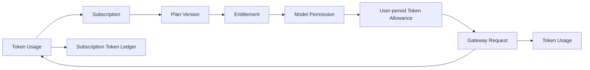
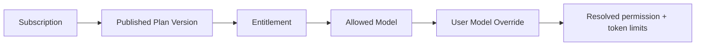
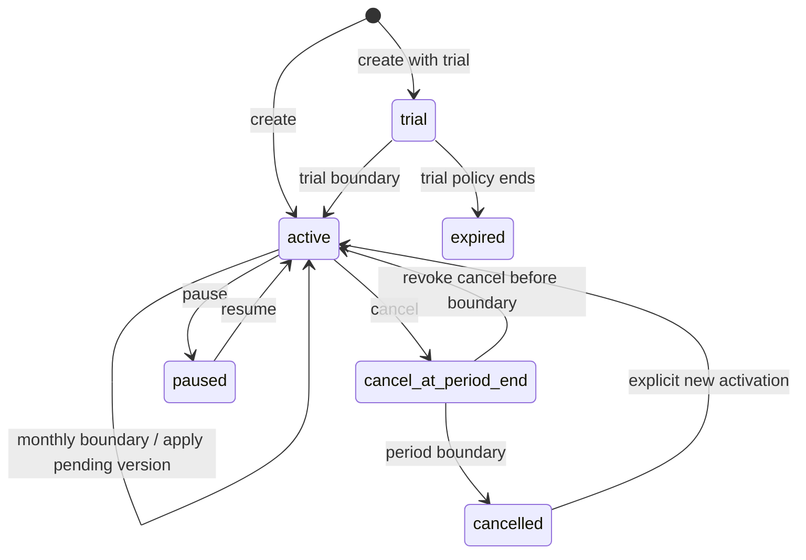
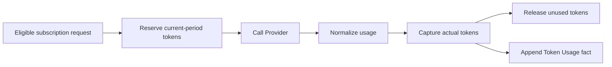

# Token-only Subscription、独立 Billing 与 AI Gateway 集成架构

> 文档状态：**Implemented / Release candidate**（Admin/Product API/Gateway/Dream client 已通过隔离验证；外部 Provider canary 待执行）
> 返回：[总索引](README.md)
> 依赖：[业务边界](02-business-integration-and-admin-boundary.md) · [发布门禁](05-release-rollout-and-rollback.md)
> 下游：[Dream 产品与推理集成](07-dream-subscription-and-inference-integration.md)
> Payment：[Adapter/Webhook 边界](08-payment-adapter-and-webhook-boundary.md)
> 主要读者：产品架构、Admin/Gateway 后端、Dream 后端、QA、安全

## 1. Current / Target / Release Gate

| 能力 | Current | Target | Release Gate |
|---|---|---|---|
| 用户与内部投影 | **Implemented / Release candidate**：canonical-driven mapping/account、服务端分页/搜索、Gateway/命令反查与 QA-only 回归已验证 | `users` 继续是唯一平台用户及订阅主体全集 | 生产历史 orphan 只读盘点与安全处置回执 |
| Plan/Version/Entitlement | **Implemented / Release candidate**：Admin `0017–0024` Token-only guard/data cutover/Token Ledger、月费/续费、strict API/DTO/UI 与不可变合同已通过本机 PG、66 files/313 tests、tsc/lint/build 与订阅 Playwright 4/4 | 保持月度 Token 规则；月费只用于订阅 Payment，禁金额额度/cash overage/全局生效窗 | 生产历史 published 行审计与灰度回执 |
| Subscription | **Implemented / Release candidate**：个人 UTC 月度锚点、自动 period worker、八项 preview→execute、expectedVersion/幂等回执与并发合同已验证 | 每用户续期/换版继续按个人周期 | 生产 cohort 与定时 worker 观测 |
| Token Allowance | **Implemented / Release candidate**：只创建 token_allowance，reserve/capture/release、usage-missing recovery 与终态 guard 已通过隔离 PG | 新请求只消耗当前用户周期 Token；不自动切金额 | 外部 Provider canary 下 usage/取消/断流观测 |
| Subscription Token Ledger | **Implemented / Release candidate**：`0021` 与 Gateway 同事务追加 reserve/capture/release；provenance、请求内顺序、幂等、守恒和 UPDATE/DELETE guard 已通过真实 PG migration 与隔离 Gateway/Playwright | 继续作为 Token 单位审计域，不进入 Dream Product DTO，不伪装金额/支付 Ledger | 外部 Provider canary 与物理最小权限矩阵 |
| 独立 Pricing/Billing/Ledger | Provider Pricing、Billing Account、现金 reserve/capture 与 Ledger 已有基线 | 保留为显式 cash pay-as-you-go/历史域；不能成为套餐权益或 Token 耗尽兜底 | 单独入口/授权/审计；Subscription DTO 与页面无金额字段；历史账务仍 append-only |
| Gateway | **Implemented / Release candidate**：固定 canonical→Subscription→Entitlement→Permission→limit→Allowance 资格链与 settlement 已验证；Dream server-only client 已落地 | 真实外部 Provider/user canary | 生产 Key/Secret 注入与 401/402/403/409/429/502/503 观测 |
| Product API | **Implemented / Release candidate**：Product/Payment exact routes、strict JWT/DTO、Origin/幂等/redaction 与 Dream BFF 合同已通过 | 预发布真实 Session/service identity 冒烟 | 真实环境 ETag/分页/错误/超时观测 |
| Payment/订阅支付 | **Implemented / Release candidate**：`0022–0024`、Adapter、Fake guard、Webhook 幂等、首次开通/付费月续费 Intent 与 Dream UI | 真实渠道 **Deferred** | 生产 Fake 禁用；未接渠道不显示成功；付费到期不免费发 Token |

实现已形成隔离环境端到端 Release candidate；“Implemented”不等于生产已发布。尚未执行的真实外部 Provider canary、生产 cutover 与 credential owner rotation 明确保留为 Release Gate；Dream frontend lint 已通过（0 errors/21 warnings）。

## 2. 目标业务链

任一箭头不可由浏览器直接写表补齐。用户投影、订阅命令、Gateway 资格和 Token 结算分别由受控 service transaction 完成。Provider Pricing →显式现金请求→ Billing Account → Ledger 是另一条独立链；不得从 Token 耗尽自动跳转，也不得把金额包装成 Subscription Allowance。

## 3. canonical 用户、mapping 与 account

### 已修复实现与生产余项

- 产品读取/选择器以 `users` 为真值并服务端分页、搜索和 hydration，不再把前 50/100 当完整用户集。
- Gateway Key 鉴权反向证明 canonical `users`，orphan fail-closed；命令统一经过受控 projection/account ensure。
- `platform_users.email/display_name` 仅作为 deprecated compatibility snapshot，不提供第二套产品 mutation/名册。
- 生产历史 orphan 的 Key、余额、Usage、Ledger、Subscription 仍需只读盘点后映射或隔离；此项不能用测试 seed 代替。

### Target 合同

1. 新建 `CanonicalUserRelationService`，查询源固定为 `users`，提供 `q/page/pageSize/total`、稳定排序与 selected hydration。
2. `ensureBillingIdentity(user_id)` 只在已经锁定/确认 canonical user 后幂等创建 mapping/account；不能接受任意外部 email 作为开户依据。
3. 从兼容 mapping 的产品 mutation schema 移除 `email/display_name`；资料修改只走 canonical User 领域命令。
4. orphan mapping 先生成关联 Key/Subscription/Allowance/Balance/Usage/Ledger 摘要，再 `isolated/disabled`；禁止硬删。
5. 当前 `billing_accounts` 与 mapping 的一对一投影可保留，但它属于独立现金计费/历史兼容域。Subscription 不读取余额决定开通，不向 account 赠款，也不把 account 存在解释为单独“计费用户”。

## 4. Token-only Plan、Version 与 Entitlement

- `subscription_plans` 只保存稳定 `code/name/status/description`；不保存产品币种或价格。
- `subscription_plan_versions` 是不可覆盖的月度 Token/权益快照，产品字段只包含 `versionNumber`、`allowanceTokens`、trial/grace 配置与发布审计时间。`billingPeriod` 固定为 `monthly`，不得接受 `annual`。
- 每个用户订阅的 `currentPeriodStart/currentPeriodEnd` 由该用户开通时的周期锚点推导。Plan Version 不提供 `effectiveFrom/effectiveTo`；`publishedAt` 只证明版本何时可被新订阅选择，不改变既有用户周期。
- Entitlement 固定 Gateway scopes、model、RPM、daily safety limit 与 storage limit。Subscription 总额度只有当前周期 `allowanceTokens`；旧 `monthly_token_limit` 不能再按 UTC 日历月形成第二套套餐额度。
- draft version 可编辑；published version 与其 entitlement 不可 UPDATE/DELETE。更改必须创建新 `versionNumber`，由用户自己的下一个周期边界采用。
- Version 的请求、响应、表单可出现 `currency/basePriceMicrousd` 月费；不得出现 `allowanceMicrousd`、`overagePolicy=cash_balance` 或全局 effective window。

### 独立 Provider Pricing 边界

`ai_pricing_rules` 的 micro-USD 与有效窗口仍用于 Provider 成本快照和显式现金按量域；该有效窗口不是 Subscription Plan 的生效日期。历史请求继续保存 rule ID、输入/输出/cache 单价、markup/discount 等快照。任何现金金额只遵循 Billing 模块的 safe-integer 规则，不进入 Plan、Version、Entitlement、Subscription context 或 Dream 套餐页面。

## 5. Subscription 状态机

Target callable 状态：`trial`、`active`、`cancel_at_period_end`；管理/资格状态：`past_due`、`paused`、`cancelled`、`expired`。付费版本到期由 worker 原子进入 `past_due` 且不发新 Allowance；成功续费 Webhook 后进入下一周期并恢复 `active`。

每个 execute 命令必须携带用户域唯一 idempotency key 与 `expectedVersion`（create 可空），在事务中锁定 Subscription 与当前 Token Allowance，并写 append-only `subscription_events`。付费首次开通和到期续费不由浏览器直接完成，而是等待已验证 Payment Webhook 后原子激活/续期。

### 生命周期规则

| 命令 | 生效 | 最低不变式 |
|---|---|---|
| create | 用户选择时即时 trial/active | 一个用户最多一个 callable 状态；记录用户周期锚点并创建首期 Token Allowance |
| renew | 仅当前 `currentPeriodEnd` 到达后 | 从原锚点计算；正常推进下一月，延迟多月时直接定位包含 now 的周期并记录 `periodsSkipped`，不为已过期月份补发；新 allowance 仅一行；提前调用 409；重复命令不重复发 Token |
| upgrade | 默认用户下周期 | 写 `pendingPlanVersionId`；不立即重置 Token，不产生金额/proration |
| downgrade | 用户下周期 | 与 upgrade 同一边界原子切换；不依赖平台全局日期 |
| pause | 即时或策略指定 | 禁止新 Gateway reserve；在途请求仍结算到终态 |
| resume | 在允许期内 | 重检 Plan/version 可用性与用户当前周期；不额外发 Token |
| cancel | 默认期末 | 写 `cancel_at_period_end`；当前周期仍可使用，边界后写 cancelled event且不发新 Token |
| revoke_cancel | 仅取消边界前 | 只清除期末取消标志并写事件；不移动周期、不续期、不发 Token |

自动 period worker 使用 claim/lock、稳定 boundary key 和可重放 event；不能依赖 UI 访问推进，也不能用不同幂等 key 连续预创建多个未来周期。

### 用户月度周期锚点

- 初次开通保存 `cycleAnchorAt=currentPeriodStart` 与 `currentPeriodNumber=0`；名称只表达周期锚点，不表示金额结算。
- 每个 period end 都从原始锚点计算并对目标月份末日 clamp：1 月 31 日开通的序列应为 2 月末、3 月 31 日、4 月 30 日，而不是永久漂移到 28 日。
- Gateway 资格必须同时验证 `currentPeriodStart <= now < currentPeriodEnd`，禁止未来 allowance 提前可用。
- Plan 发布/停用只影响可选择性；既有用户何时切版本由自己的 period boundary 与 `pendingPlanVersionId` 决定。

## 6. Token Allowance 与独立现金域

Subscription 请求只对 Token 做保守预留，真实 usage 后 capture，未使用部分 release：

守恒式：

- `reserved_tokens + consumed_tokens <= granted_tokens`
- `remainingTokens = grantedTokens - reservedTokens - consumedTokens`，且三个量都不小于 0。
- 同一 request/allowance 的 reserve、capture、release 由稳定 idempotency key 关联；重复 settlement 不重复消耗。
- Subscription Token 使用不产生 micro-USD `allowance_capture` Ledger，不改 Billing Account available/reserved，不写 subscription charge；它在独立 `subscription_token_ledger_entries` 中按请求顺序追加 Token reserve/capture/release。

Token 不足时固定 fail-closed 402；不得继续查 money allowance 或 cash balance。若平台另有显式 cash pay-as-you-go 产品模式，它必须有独立授权、API/页面、request mode、Pricing snapshot、Billing Account 与 Ledger，不得由套餐耗尽自动触发，也不属于本期 Dream Subscription 体验。

独立现金域仍遵守 safe-integer micro-USD、append-only Ledger、refund/reversal 追加和 Admin Audit；这些约束不能反向成为 Plan 的金额字段。

### Current monetary legacy → Target migration

| Current 物理字段/事实 | Target 写策略 | 迁移/回滚要求 |
|---|---|---|
| `subscription_plans.currency` | DTO/表单不读写；仅兼容默认值 | 首阶段保留列并标记 deprecated，不破坏历史；回滚只恢复旧应用读取，不恢复新金额写入 |
| Version `base_price_microusd`、`allowance_microusd`、`overage_policy` | 新 draft/published 固定 `0/0/deny` | Zod + service + DB guard 三层拒绝非零/cash；历史 published 行不 UPDATE |
| Version `billing_period`、`effective_from` | 新 Version 固定 monthly/NULL | 不删除 Provider Pricing 的有效窗口；只处理 Subscription Version |
| Allowance `granted/reserved/consumed_microusd` | 新周期行固定为 0 | 新 INSERT guard；旧在途/历史行只允许既有兼容结算至终态 |
| `subscription_charge`、`allowance_capture`、`money_allowance` 历史 | 禁止新 Subscription 请求产生 | 保留 append-only 历史和 reconciliation；不得 UPDATE/DELETE/伪装成 Token |
| `past_due` Subscription | 付费到期的正式资格状态；不允许 Gateway 调用 | 续费 Intent 绑定 version/period end；成功 Webhook 只推进一次，历史 legacy 行先审计 provenance |

兼容 migration 必须可回滚、非破坏性，先在显式 `TEST_DATABASE_URL` 验证。Schema 暂留 deprecated 列，避免 Drizzle 下一次生成误 DROP；同时新增用户周期锚点及数据库写入 guard。任何共享 `ink-memory` 上的回填或状态归一化都需要独立审批，本文件不授权执行。

## 7. Gateway 资格、调用与结算

资格顺序不可重排：

1. 验证服务身份/Gateway Key hash、scope、status、expiry。
2. `users JOIN platform_users` 反向确认 canonical user；有效 Key 关联 orphan 时固定返回 403 `CANONICAL_USER_REQUIRED`，missing/invalid/revoked Key 固定返回 401 `GATEWAY_AUTH_REQUIRED`，两者都 fail-closed。
3. 加载唯一 callable Subscription，同时检查 `currentPeriodStart <= now < currentPeriodEnd`、trial/grace 与用户周期锚点。
4. 固定 published Plan Version 与 Entitlement snapshot。
5. 解析 stable model alias，检查 entitlement model/scopes 与 `user_model_permissions` override。
6. 原子检查/增加 RPM、daily safety limit；Subscription 月额度只来自当前 period allowance，不再按 UTC calendar month重复计算。
7. 锁定当前 Token Allowance，完成 token reserve；不足固定 402，禁止 money/cash fallback。
8. 建立 `gateway_requests` 与 pricing/subscription snapshot 后才调用 Provider。
9. 将 Provider usage 归一化为输入/输出/cache token；在同一 PostgreSQL transaction 中 capture/release，并追加 Token Usage、Subscription Token Ledger 与 Audit。Provider 成本 snapshot 可以保留，但 Subscription 用户 charge 为 0 且不写金额 allowance Ledger。

请求终态必须覆盖：success、rejected、provider_failed、cancelled、stream_interrupted、usage_missing、settlement_failed。usage missing 不能按 0 成本成功；按协议能力选择保守 capture、受控 reconciliation 或 settlement_failed，且在途 reserve 不得永久悬挂。

Provider/model/pricing 的版本快照在历史请求上不可覆盖；这是运营成本/独立 Billing 事实，不是套餐价格。请求 payload/response 保存按最小化与 retention policy；Secret、Authorization header、工具敏感参数和正文默认不写日志。

## 8. Dream Product API（Implemented / Release candidate）

下列六类 exact 路径已在 Admin 与 Dream BFF 实现并通过 strict contract/focused tests；生产 Session/service identity 冒烟仍是 Release Gate：

| 方法与路径 | 作用 | 核心响应/命令字段 |
|---|---|---|
| `GET /api/product/v1/plans` | 发布中 Token-only Plans 与 Version/Entitlement 产品投影 | plan code/name、version、`billingCycle=monthly`、allowanceTokens、整数 micro-USD 月费、capability；ETag；无 Provider pricing/effective window |
| `GET /api/product/v1/me/subscription-context` | 当前用户订阅总览 | canonical user ID、subscription/version/status、period start/end、renewal/pending version、granted/reserved/consumed/remaining Tokens |
| `GET /api/product/v1/me/usage` | 服务端分页 Token Usage | items、page/pageSize/total、input/output/cache/total tokens、request/model alias、occurredAt |
| `GET /api/product/v1/me/model-catalog` | 当前用户实际可用模型 | alias/label/capability/limits；无 provider secret/internal ID |
| `POST /api/product/v1/me/subscription-commands` | 单一路径的 preview/execute 生命周期命令 | `action=create|renew|upgrade|downgrade|pause|resume|cancel|revoke_cancel`、`phase=preview|execute`、targetPlanVersionId、reason；preview 返回 `previewId/digest/expiresAt`，execute 必须回传三者并携带 `Idempotency-Key`、`expectedVersion`（create 可空） |
| `POST/GET /api/product/v1/me/payment-intents/**` | 付费首次开通/到期续费 Intent 与状态读取 | planVersionId、operation、整数 micro-USD、status、安全 nextAction；不返回 adapter secret/external reference |

读 API 以 Dream 用户 Session + 服务间认证绑定 canonical user，不接受浏览器提交任意 user ID。写命令和 Payment Intent 要求 CSRF/Origin 与幂等。响应只使用 allowlist DTO，不把 `platformUserId`、Billing Account、raw pricing rule、Gateway Key 或 Secret 暴露为套餐字段；Payment DTO 仅含平台 Intent ID、金额、状态和安全 next action。

## 9. 错误合同

| HTTP | code 范畴 | 何时返回 |
|---:|---|---|
| 401 | `PRODUCT_AUTH_REQUIRED` / `GATEWAY_AUTH_REQUIRED` | Product Session/service identity 无效；或 Gateway Key missing/invalid/revoked |
| 402 | `SUBSCRIPTION_TOKEN_ALLOWANCE_EXHAUSTED` | Subscription 当前周期 Token 不足；Gateway `/v1/**` 只返回 `available_tokens/required_tokens/period_end` 与 `metric=tokens/unit=tokens`，Dream BFF 映射为 `availableTokens/requiredTokens/periodEnd`，不返回余额或 micro-USD |
| 403 | `SUBSCRIPTION_ACTION_FORBIDDEN` / `ENTITLEMENT_REQUIRED` / `CANONICAL_USER_REQUIRED` | 生命周期/Entitlement/model override 拒绝，或有效 Key 只关联 orphan billing identity |
| 404 | `PLAN_NOT_FOUND` / `SUBSCRIPTION_NOT_FOUND` / `GATEWAY_MODEL_NOT_FOUND` | 对用户可见的 plan/subscription/model alias 不存在 |
| 409 | `IDEMPOTENCY_CONFLICT` / `VERSION_CONFLICT` / `SUBSCRIPTION_STATE_CONFLICT` | 幂等 digest、expected version 或状态机冲突 |
| 429 | `PRODUCT_RATE_LIMITED` | RPM/daily safety/产品 API 限制；header 带 `Retry-After`，body meta 带 `retryAfterSeconds` |
| 502 | `GATEWAY_PROVIDER_UPSTREAM_FAILURE` | Gateway Provider 上游失败；本地 request 必须有确定终态 |
| 503 | `PRODUCT_DEPENDENCY_UNAVAILABLE` | DB/配置/维护/结算无法安全完成；不 direct fallback |

所有 code 使用 [02](02-business-integration-and-admin-boundary.md) 的嵌套 camelCase envelope；同一场景不得在多个 HTTP status/code 之间任选。

## 10. Route/Service/Repository 分层

- Route Handler：Session/RBAC、Origin、Zod、header/idempotency 解析、service 调用、错误映射。
- Service/UoW：状态机、资格、事务锁、幂等、守恒、event/audit 编排。
- Repository：参数化 SQL、row lock、append-only insert、版本 compare-and-swap。
- Adapter：Provider/Payment 外部协议边界，不持有 Subscription 状态机真值；Payment Webhook 由服务层协调领域命令。

SQL、事务和领域逻辑必须位于 `app/lib/**`，不能散在 route handler 或 React 组件。

## 11. Secret 与审计

- Gateway Key 只存 hash/prefix；一次性创建回执关闭后永不回显。
- Provider/Payment/System Secret 使用 server-side secret provider/encryption，响应/日志/数据库普通字段不含明文。
- `system_config.env_vars` 拒绝 secret-like 名称和值；Dream 浏览器不配置 provider credentials。
- Audit/Token Usage/Subscription Event 是 append-only 或终态不可变；Subscription Token Ledger 与独立现金 Ledger 分别 append-only。settled request/usage 需数据库 guard，不能只靠 UI 隐藏编辑。

## 12. 自动化验收

- 所有 canonical users 都能成为订阅主体；205 用户分页与跨页搜索；无 QA-only 结果和独立计费用户入口。
- Token-only Version/Entitlement publish mutation rejection；Subscription money/effective/cash 字段在 API、表单和新写入中为 0；Provider Pricing effective window 不受影响。
- Subscription 生命周期、用户周期锚点、Jan-31 月末序列、提前续费、并发升降级、重复续费、撤销期末取消。
- Token Allowance/Token Ledger 守恒属性测试；耗尽 402 且无 Billing Account/金额 Ledger 变化；重复 Gateway 请求不重复 Token 记账，覆盖 cancel/断流/Provider 5xx/usage missing。
- 401/402/403/404/409/429/502/503 均验证 Provider 是否被调用、Token 是否变化；Subscription 请求不产生新 monetary Ledger。
- settled Token Usage/Audit/Subscription Event、Subscription Token Ledger 与既有现金 Ledger 不可 UPDATE/DELETE。
- Product API 五个 Target contract 的 auth、pagination、ETag/version、redaction 与错误测试；DTO 不含 currency/price/micro-USD/balance/payment/effective window。
- Gateway/Provider/Payment/System Secret 不出现在 DB 明文字段、响应、DOM、Storage、console、structured logs 或快照。
