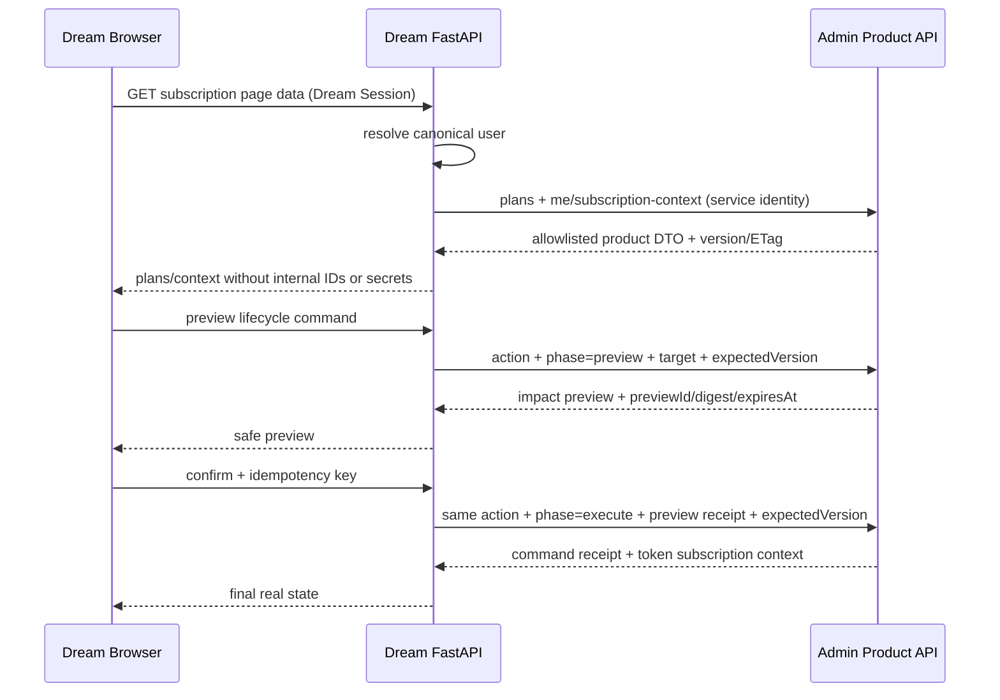
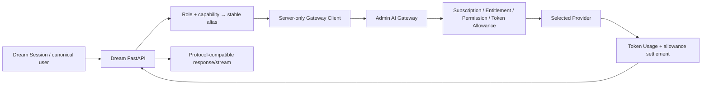

# Dream 订阅体验与推理 Gateway 集成

> 文档状态：**Planned**
> 返回：[总索引](README.md)
> 依赖：[Billing/Subscription/Gateway](06-billing-subscription-gateway-integration.md) · [页面清单](03-page-refactor-checklist.md)
> 配套：[发布门禁](05-release-rollout-and-rollback.md) · Deferred：[Payment/订阅支付](08-payment-adapter-and-webhook-boundary.md)
> 主要读者：Dream 前后端、Admin/Gateway 后端、产品、QA、安全

## 1. Current / Target / Release Gate

| 面 | Current | Target | Release Gate |
|---|---|---|---|
| Subscription page | 静态三档数组与“即将开放”；不是真实数据 | Admin Product API 驱动的月度 Token 计划、用户周期、Token Allowance、Usage 与模型权限 | API failure 无静态 fallback；无金额/余额/支付/全局生效日期；两个视口通过 |
| Model settings | 静态 Auto/Claude/GPT，用户模型字段与执行字段不闭合 | `me/model-catalog` 返回用户可用 alias，服务端再次校验 | 浏览器不能选未授权 provider/model；empty/403/503 真实 |
| PolyAgent | Dream endpoint/key/model 环境配置直连 | server-only Gateway client + role alias | inspiration/echo/trait/pattern 协议与行为回归 |
| Claude Agent/Chat/Dream/Workflow | runner/SDK/CLI 旧执行面 | 单一网络边界切 Gateway，保留 thread/resume/tool/plugin/provenance | streaming/cancel/tool confirmation/deep link 回归 |
| Image | `picture_service.py` 直连 image endpoint/key | Gateway image capability/usage 后分批 canary | 未支持时受控 legacy server-only，不伪报已计费 |
| ASR | 未鉴权 WebSocket 直连，存在已提交 credential P0 | endpoint 先禁用/加固；ASR Gateway **Deferred** | credential 轮换/移除/scan；匿名连接拒绝 |

## 2. Dream 只消费 Token 订阅产品投影

Dream 不复制或直接写 Plan、Subscription、Token Allowance 或 Usage。所有 canonical `users` 都天然是可订阅主体；Dream 不查询或展示独立“计费用户”。Provider Pricing、Billing Account 和现金 Ledger 是独立域，不进入套餐 DTO。目标调用全部由 Dream FastAPI 发起：

| Target 路径（当前未实现） | Dream 用途 |
|---|---|
| `GET /api/product/v1/plans` | 套餐 code/name、固定 monthly、Token 数量与非货币权益摘要；无 price/currency/effective window |
| `GET /api/product/v1/me/subscription-context` | 当前订阅、用户周期起止、续费/待切版本与 Token granted/reserved/consumed/remaining |
| `GET /api/product/v1/me/usage` | 分页 input/output/cache/total Token Usage 与周期耗用投影 |
| `GET /api/product/v1/me/model-catalog` | 当前用户可用 alias/label/capability/limit |
| `POST /api/product/v1/me/subscription-commands` | 生命周期 preview/execute |

浏览器 Session 只提交给 Dream。Dream 服务端根据 Session 解析 canonical `users.id`，以服务间身份调用 Product API；API 不接受浏览器可控的任意 user ID。短 cache 必须绑定 user/subscription version/ETag 并有明确 TTL，403/503 时失效而不回退静态对象。套餐发布时刻只控制是否可选；页面显示的周期始终来自该用户 `currentPeriodStart/currentPeriodEnd`。

## 3. 订阅页面数据流

`action` 只能是 `create|renew|upgrade|downgrade|pause|resume|cancel|revoke_cancel`。Dream BFF 可以代理同一命令合同，但不得发明金额 quote、Payment intent 或充值 endpoint；execute 必须携带 `Idempotency-Key`，create 之外必须携带 `expectedVersion`。

UI 只在 Admin 返回最终 Subscription Event/当前上下文后显示成功。开通不等待支付，续费不扣款；升降级默认在该用户下一周期边界应用，不能用平台全局日期或即时重发整月 Token。页面没有“支付成功”、价格、余额或充值状态。

### 用户可见信息

1. Plan 名称、固定“每月”、每周期 Token 与模型/Scope/速率/Storage 等非货币权益。
2. 用户自己的周期起止、下次周期边界、是否期末取消、待切 Plan Version。
3. Token 已授予、预留、已消耗、剩余与基于 Token burn rate 的耗尽预测；不得换算金额或“预计超额费用”。
4. 当前可用模型与限制。Token 耗尽后显示受控拒绝；不展示或自动启用现金兜底。

## 4. 推理调用拓扑

Dream 浏览器永远不持有 Gateway Key。Dream 服务凭据只来自 server-side secret provider，按环境/服务/最小 scope 独立；不能共享全平台浏览器 Key，也不能写入 `user_preferences`、`system_config.env_vars` 或日志。Gateway 可以保存 Provider Pricing 成本快照，但不得把它转成套餐金额、金额额度或自动 cash fallback。

## 5. 当前接管点

| Current 入口 | 迁移策略 | 必须保留 |
|---|---|---|
| `backend/server.py`、`backend/stateless_analyzer.py` 的 PolyAgent | 新增 Gateway client；为 inspiration/chat/analysis/echo/trait/pattern 配稳定 alias | 当前 JSON/文本输出、timeout、重试与错误语义 |
| `routers/claude_agent.py`、Claude Agent service/runner | 在 runner 的单一网络边界替换 provider transport | Anthropic compatible SSE、thread/resume、tool use、usage |
| `dream_agent_message_service.py`、`dream_confirmation_service.py`、`guidance_service.py`、`dream_launch_gateway.py`、Reflection | 共用同一 runner/Gateway adapter，不逐个业务分叉 | workspace、plugin、tool confirmation、provenance、状态持久化 |
| `picture_service.py` | Gateway 宣布 image capability/usage/settlement 后切 image alias | media payload、失败语义、实际 usage；未支持时不伪报 Gateway 完成 |
| `ModelConfigSection.tsx`、`chat-schema.ts` | 静态型号改为产品 model catalog alias | Auto 仅可表示服务端策略，不代表浏览器任意 provider routing |

`backend/services/story_workspace/dream_launch_gateway.py` 是 Dream 启动协调器，不是 Admin AI Gateway。迁移不得因其文件名而跳过真正的网络边界。

## 6. Gateway 请求合同

Dream server client 发送：

- canonical user binding（由服务端签名/认证上下文派生，不信任浏览器 header）。
- stable `model` alias 与必要 capability；不发送 provider ID 或 Secret。
- OpenAI `/v1/chat/completions` 或 Anthropic `/v1/messages` 兼容 payload；未知扩展字段按 allowlist。
- 唯一 request/idempotency key、trace/request ID、可选 deadline/cancel signal。
- 流式客户端断开时向 Gateway 传播 cancel；不能只断浏览器而让 reserve 永久悬挂。

Gateway 响应保持协议兼容，同时 Dream 只向浏览器透传安全字段。Provider 原始 header、internal pricing rule、subscription snapshot、Gateway Key 和 upstream Secret 永不透传。

## 7. 模型选择与权限

1. 浏览器从 `GET /api/product/v1/me/model-catalog` 取得 alias、label、capabilities 与可展示限制。
2. Dream FastAPI 校验 alias 属于当前用户目录；客户端提交的 provider/model 字符串不直接执行。
3. Gateway 再按当前 Subscription→Plan Version→Entitlement→user override 解析权限；TOCTOU 时以 Gateway 最新状态为准。
4. Auto 由服务端策略解析为请求时 model/pricing snapshot；历史 Usage 显示实际 resolved alias/model label，而不是重新解析当前策略。
5. catalog empty、403、503 分别表示真实无可用模型、当前状态拒绝、控制面不可用；无静态 fallback。

## 8. 流式、失败与结算语义

| 场景 | Dream 行为 | Gateway/账务终态 |
|---|---|---|
| 正常非流式 | 返回协议响应与安全 request ID | capture actual Tokens、release remainder、append Token Usage；Subscription charge=0 |
| 正常流式 | 转发 chunk，结束事件后关闭 | 以最终 usage capture；若协议有 cumulative usage 需去重 |
| 用户取消 | 传播 cancel，UI 标记已取消 | 按已确认 Token usage capture，其余 release；request=cancelled |
| 浏览器断开/流中断 | 后端取消或受控 drain，不静默丢弃 | stream_interrupted；确定 capture/release，不留悬挂 reserve |
| Provider 4xx/5xx | 映射安全 502/业务错误 | 未产生 Token usage 则 release；有真实 usage 按合同 capture |
| usage 缺失 | 不显示零成本成功 | conservative/reconciliation/settlement_failed 三者之一，必须可审计 |
| 本地结算失败 | 不把请求标为完全成功 | settlement_failed + retry/reconciliation；幂等避免重复消耗 Token |

## 9. Dream 错误与恢复

- 401：刷新 Dream Session/重新登录；服务身份错误显示服务不可用，不要求用户输入 Key。
- 402：保留 prompt/编辑内容，显示当前周期 Token 已耗尽、剩余/所需 Token 与下个周期时间；不显示余额、金额、充值或自动 cash fallback。
- 403：模型/权益/订阅状态拒绝，刷新 subscription context/model catalog。
- 404：alias/version 已下线，刷新目录；不回退硬编码型号。
- 409：重复/并发/状态变更，获取最新上下文后由用户重试。
- 429：遵守 `Retry-After`，暂停自动重试，保留可编辑内容。
- 502：上游失败，显示 request ID；重试产生新 attempt 或受控 idempotency，不重复结算。
- 503：Gateway/DB/config/maintenance/settlement 不可用；不 direct Provider、不回退 SQLite。

## 10. canary 顺序

1. 冻结现有协议、行为与 fixture；补 SSE/tool/cancel/usage contract。
2. Product model catalog 接入，但执行仍旧路径；只比较 alias eligibility。
3. Gateway shadow eligibility：不 reserve、不调用 Provider，比较预期拒绝/允许结果。
4. Gateway dry settlement in isolated environment，使用 mock Provider/Fake usage。
5. 内部用户 canary：PolyAgent role 逐个切换。
6. Claude Agent/Chat canary；再切 Dream/Workflow/Guidance/Reflection。
7. image capability 完成后单独 canary。
8. direct Provider fallback 默认关闭并最终删除；回滚 Gateway canary 不能绕过 Subscription 资格，也不能自动进入独立现金按量路径。

## 11. P0 Secret 与 ASR

- `backend/speech_recognition.py` 的已提交 credential 必须由密钥所有者吊销/轮换；删除源码值、增加启动/CI secret scan，并按审批决定 Git 历史处置。不得复述、联网验证或继续使用该值。
- `/ws/speech-recognition` 在当前匿名状态不能发布。最低处置是默认禁用；若保留 legacy ASR，必须 canonical Session 鉴权、WebSocket Origin allowlist、连接/RPM/时长限制、取消、审计与 server-side Secret。
- ASR Gateway 在尚无 streaming-audio capability、输入/输出计量单位、Provider usage 与 reserve/capture 合同前保持 **Deferred**。不能把“endpoint 已加鉴权”误报为“ASR 已经 Gateway 计费”。
- `system_config.env_vars` 必须拒绝 Provider/Gateway/System secret 名称或 secret-like 值；Deferred Payment Secret 不得提前加入。已有数据需只读审计和安全迁移，不在日志输出。

## 12. 自动化验收

- Subscription 页面所有数据来自五个 Target Product API contract；静态 plan/model fallback 为 0，price/currency/micro-USD/balance/payment/effective window 字段为 0。
- 生命周期 preview/execute 的 expected version、idempotency 与 409 恢复通过；升降级按用户周期，提前续费不发 Token，月末锚点不漂移。
- 每个现有推理角色都有旧协议 fixture + Gateway fixture；Claude Agent/Dream/Chat/Workflow 行为不回归。
- 401/402/403/404/409/429/502/503、cancel、stream interruption、usage missing、settlement retry 覆盖。
- Gateway Key/Provider/System Secret 不出现在前端 bundle、DOM、Storage、响应、日志、截图、普通 PG 字段；Payment 依赖/配置为 0。
- 1440×1000 与 390×844 的 loading/empty/error/maintenance/移动布局通过。
- credential 吊销/轮换有所有者确认；ASR 匿名连接被拒绝；ASR Gateway仍明确 Deferred。
