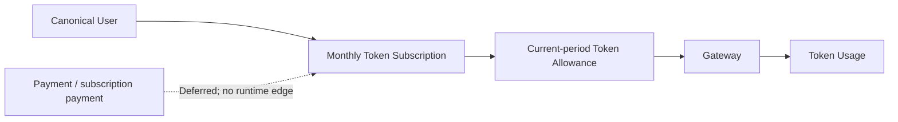

# Deferred：Payment Adapter、Webhook 与订阅支付边界

> 文档状态：**Deferred**（不是当前实现规格）  
> 返回：[总索引](README.md)  
> 上游：[Token-only Subscription/Gateway](06-billing-subscription-gateway-integration.md)  
> 汇总：[延期领域说明](90-deferred-billing-subscription-inference-payment.md)  
> 主要读者：产品、架构、QA、安全、未来支付项目负责人

## 1. Current / Target / Migration / Release Gate

| 维度 | 决策 |
|---|---|
| Current | Admin/Dream 当前没有可证明的 `PaymentAdapter`、payment intent、Webhook event store 或真实支付渠道闭环；Subscription 现存金额字段属于待纠偏 legacy coupling，不证明支付已实现 |
| Target（本轮） | Token-only Subscription 独立运行：套餐不含价格、币种、金额额度、cash overage 或支付状态；开通/续费/升降级不等待 Payment |
| Migration（本轮） | 不新增 payment 表、Route、Adapter、Webhook、Secret、环境变量、SDK、Fake Adapter 或 UI；从 Subscription DTO/页面/状态机删除 Payment 依赖，保留历史账务只读追溯 |
| Release Gate | Payment 相关新增依赖、表、路由、环境变量和 UI 入口均为 0；Token-only 生命周期、Gateway Token 资格与 43+5 PostgreSQL 迁移可在无 Payment 组件时独立通过 |

本文件替代此前“先实现渠道无关 PaymentAdapter/Fake，再接真实渠道”的 Planned 方案。旧方案只通过 Git 历史追溯，不能作为当前开发任务、Schema 合同或验收门禁。

## 2. 本轮明确 Deferred

- `PaymentAdapter` interface、capability discovery、payment intent、authorize/capture/cancel/refund/reversal operation。
- Webhook endpoint、签名验证、event store、replay/reconciliation worker 与渠道 event normalization。
- test/dev Fake Payment Adapter 及其测试支付 UI。
- Stripe、支付宝、微信支付、银行或其他真实 SDK/API、商户配置、收银台和生产 Webhook。
- 订阅价格、订阅扣费、自动续费扣款、欠费恢复、退款、发票、税务、争议与 chargeback。
- Payment Secret、Webhook Secret、支付环境变量、渠道品牌和支付状态文案。

“预留可插拔边界”不构成本轮创建空接口、空表或 Fake 实现的授权。Deferred 能力不得混入 Token-only Subscription release dependency。

## 3. 与 Token-only Subscription 的硬隔离

- 所有 canonical `users` 都是可订阅主体；不存在先创建“计费用户”或支付账户才能订阅的流程。
- Subscription create/renew/upgrade/downgrade/pause/resume/cancel 只改变用户周期、Version、状态和 Token Allowance。
- 新状态机不进入 `past_due`；现存值只作 legacy 审计/迁移输入，不能由支付失败触发新写入。
- Plan/Version/Entitlement/Product API 不返回 `currency`、price、micro-USD allowance、cash overage、payment status 或平台全局 effective window。
- Token 耗尽固定返回 Token 单位的 402；不得创建 payment intent、提示充值或自动切现金余额。
- Provider Pricing、Billing Account、现金 reserve/capture 与 append-only Ledger 若保留，属于独立 pay-as-you-go/历史域，不是 Payment Adapter，也不构成套餐权益。

## 4. 本轮允许的兼容工作

仅允许为解除现有耦合而做以下非破坏性工作：

1. 从 Subscription Zod、Service、Repository DTO 和 UI 移除货币/Payment 字段。
2. 用可回滚 PostgreSQL guard 阻止新 Subscription money allowance、cash overage 与 subscription charge 写入。
3. 保留既有金额列、Ledger 和已结算请求用于历史审计；不 UPDATE/DELETE，不伪装为 Token。
4. 对 legacy 在途 `money_allowance` 请求保留最小终态 reconciliation，resolver 不再创建新请求；清零前必须有可观测数量。
5. Provider Pricing 的有效窗口继续服务独立成本/现金域，不因删除 Subscription `effective_from` 而被误删。

以上工作不得顺便创建 Payment Adapter、Webhook 或 Fake。

## 5. Dream 页面与 API 禁区

Dream 当前不新增：

- 支付方式、收银台、银行卡/二维码、充值、退款、发票或支付历史页面；
- payment intent、payment status、Webhook receipt 或渠道 metadata 类型；
- “支付成功”“自动续费已扣款”“待支付”“欠费恢复”等文案；
- Stripe/支付宝/微信品牌、真实或测试渠道配置；
- Payment/Gateway/Provider Secret 的浏览器字段。

Subscription 页面只显示用户自己的月度周期、Token granted/reserved/consumed/remaining、耗尽预测、模型权限和生命周期操作。

## 6. 未来重新立项条件

只有以下条件全部明确，Payment 才能从 Deferred 转 Planned：

1. 独立 PRD 批准支付究竟服务现金按量、其他商品还是未来付费订阅；不得默认给 Token-only Plan 增加价格。
2. 指定渠道、商户主体、币种/地区、税务/发票、退款/争议、隐私和客服责任。
3. 完成 Adapter、Webhook、幂等、乱序、reconciliation、Secret、SLA、安全和数据保留设计。
4. 明确 Payment 事实与产品领域命令的协调边界；Adapter 不直接 UPDATE Subscription、Allowance、Billing Account 或 Ledger。
5. 隔离 sandbox、生产审批、密钥轮换、监控、灰度和 rollback runbook 可验证。
6. 重新执行 Prompt Architect、PRD、交互、Reader Testing、Schema 审计和单独发布评审。

未来若决定将 Subscription 改为付费产品，这是新的产品决策，必须版本化 PRD 和迁移；不能复活本轮已弃用字段作为默认方案。

## 7. Deferred 验收

- `rg`/dependency/Schema/Route 检查确认当前增量没有 Payment Adapter、Webhook、Fake、payment table/route/env/secret/UI。
- Token-only Subscription 在 Payment 组件完全不存在时通过 create、周期推进、升降级、暂停、取消和 Gateway Token 测试。
- 页面与 API 不包含 price/currency/micro-USD allowance/balance/payment/effective window；Provider Pricing 独立接口除外。
- 历史 monetary Subscription/Ledger 数据未被删除、覆盖或回显敏感信息。
- 文档索引、发布门禁与 Dream 页面清单均把 Payment 标为 Deferred，而不是 Planned 或 current dependency。
