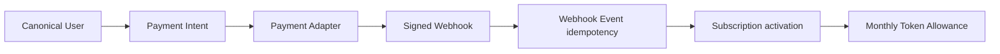

# Payment Adapter、Webhook 与 Token 月订阅支付边界

> 文档状态：**Implemented / Release candidate**
> 更新：2026-08-09（Round 45 范围纠偏）
> 真实第三方渠道：**Deferred**

## 1. 当前、目标与发布门禁

| 分层 | 事实 |
|---|---|
| Current | Admin migration `0022–0024` 已创建并扩展 Payment Intent、Webhook Event 与 refund/reversal adjustment；`PaymentAdapter`、仅测试环境 Fake Adapter、签名校验、事件幂等、首次开通和付费月续费 BFF/UI 已实现。 |
| Target | Token-only 月套餐可以具有整数 micro-USD 月费；点击开通只创建 Payment Intent，只有已验证的 `payment.succeeded` Webhook 才能原子激活 Subscription 与首期 Token Allowance。 |
| Release Gate | 生产禁止 Fake Adapter；未配置真实渠道时不得展示支付成功；Secret/原始签名/原始 Webhook 不回显、不写日志；重复事件不重复开通或扣费。 |
| Deferred | Stripe、支付宝、微信支付、银行等真实网络、商户配置、税务、发票、争议和生产退款网络。 |

## 2. 最小闭环

- canonical `users` 是唯一订阅与付款主体；不创建第二套计费用户。
- 月费真值为 `base_price_microusd` 与 `USD`，API 传整数，浏览器仅格式化显示。
- 免费版本继续走订阅命令；价格大于零的首次开通必须走 Payment Intent。
- 创建 Intent 不激活订阅。Fake Adapter 只返回 `requires_action/test_webhook`，页面明确等待签名测试 Webhook。
- Webhook 签名在持久化业务事件前验证；`adapter + external_event_id` 唯一，同事件重放返回同一结果。
- `payment.succeeded` 在同一事务内写事件、Subscription、首期 Allowance；失败或取消不激活。
- refund/reversal 写 append-only adjustment 并撤销订阅资格；不会删除 Usage、Ledger、Webhook 或审计历史。

## 3. Schema 与代码所有权

| 对象 | 所有者 | 约束 |
|---|---|---|
| `subscription_payment_intents` | Admin Payment service | 用户域幂等、整数 micro-USD、状态机、无明文 Secret |
| `payment_webhook_events` | Admin Payment service | 外部 event ID 唯一；只保存摘要/hash 与处理结果，payload 事实不可覆盖 |
| `subscription_payment_adjustments` | Admin Payment service | refund/reversal 只追加、不可更新/删除 |
| `PaymentAdapter` | Admin server | 渠道映射边界，不直接暴露给浏览器 |
| Dream BFF/UI | Dream | 只创建/读取当前用户 Intent；不持有 Adapter、Webhook 或 Gateway Secret |

## 4. Fake/Test Adapter

Fake Adapter 只有同时满足以下条件才可加载：

1. `NODE_ENV=test`；
2. `INK_PAYMENT_FAKE_ENABLED=1`；
3. 配置至少 32 字节测试 Webhook Secret。

生产或普通开发环境启用 Fake 必须 fail closed。Fake 不连接任何支付网络，不生成虚假成功；测试必须主动发送正确 HMAC 签名事件。

## 5. 错误与安全合同

| 状态 | 含义 |
|---|---|
| 401 | 用户会话或服务身份无效 |
| 403 | Origin/RBAC/Adapter 不允许 |
| 404 | Intent、版本或 canonical 用户不存在 |
| 409 | 幂等键冲突、已有订阅、版本/支付状态冲突 |
| 429 | 用户或 Adapter 速率限制 |
| 502 | 已配置真实 Adapter 的上游协议失败（当前未执行） |
| 503 | Adapter 未配置、Fake 被生产保护拒绝或依赖不可用 |

Provider Secret、Gateway Key、Payment Secret、Webhook 原始签名和服务凭据不得进入 DTO、DOM、Storage、截图、结构化日志或普通数据库字段。

## 6. 验证证据

- migrations `0022–0024` 已在本地 `ink-memory` 应用并幂等复跑；三张支付表当前真实数据均为 0。
- 隔离数据库 `ink_memory_payment_r45_codex_test` 已验证：失败不激活、成功只激活一次、重复 Webhook 不重复写、refund 撤销资格并只写一条 adjustment。
- Admin：66 files / 313 tests、tsc、lint、build 通过；Payment 隔离 PG activation/renewal 2/2 通过。
- Dream：BFF/Gateway focused backend 122 passed、1 existing skip、94 subtests；frontend tsc/lint/build 与三个订阅 Playwright 场景通过。

上述证据不等于真实支付渠道已上线；真实网络仍是 Deferred。
