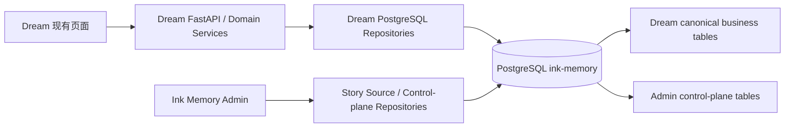

# ink-dream-memory 后续改造总索引

> 状态：当前正式入口  
> 更新：2026-08-09  
> 目标项目：`/Users/dmeck/project/ink-dream-memory`  
> 编写位置：`/Users/dmeck/project/ink-admin-memory/docs/architecture/ink-dream-memory/`  
> 执行边界：本文档集只描述 Dream 后续工作；本轮没有修改 Dream 代码、Schema、迁移、配置或数据库。

## 1. 本轮产品决策

当前主线只有一项：**把 Dream 真实业务持久化从 SQLite 分阶段迁入统一 PostgreSQL `ink-memory`，并保持现有业务行为。**

| 分类 | 本期判断 | 说明 |
|---|---|---|
| PostgreSQL 数据层与迁移 | 规划并后续实施 | 覆盖 Schema 所有权、Repository 解耦、全量迁移、校验、切换和回滚 |
| Dream 用户、Workspace、Story 等真实业务数据接入 | 规划并后续实施 | 使用 canonical 原名表；不建立第二套业务实体 |
| Dream 现有页面的数据源适配 | 规划并后续实施 | 原则上保持页面行为，只替换后端持久化实现 |
| 静态订阅入口清理 | 规划并后续实施 | 隐藏入口或安全重定向；不开发真实订阅页 |
| 计费 | **暂不开发** | 不新增余额、充值、Usage、Ledger、账单页面或 API |
| 订阅 | **暂不开发** | 不新增套餐、权益、额度、生命周期或用户自助管理 |
| 订阅支付 | **暂不开发** | 不接支付渠道、收银台、Webhook、退款或发票 |
| 推理服务 / Gateway 接入 | **暂不开发** | 不把 Dream 现有 Agent/模型调用切到 Admin Gateway，不新增推理服务页面或错误合同 |

“推理服务暂不开发”不等于删除 Dream 已有 Claude Agent、Dream、Chat 或 Workflow 能力；本期只保证这些既有能力在数据库迁移中不回归，不改变其模型调用产品行为。

## 2. 文档导航

| 文档 | 主要读者 | 回答的问题 |
|---|---|---|
| [01-current-scope-and-source-baseline.md](01-current-scope-and-source-baseline.md) | 产品、架构、后端 | Dream 当前到底使用什么数据库、有哪些表、这次做什么/不做什么 |
| [02-business-integration-and-admin-boundary.md](02-business-integration-and-admin-boundary.md) | Dream 后端、Admin 后端、安全 | 迁入 PG 后谁拥有数据、Admin 可以读写什么、冲突如何处理 |
| [03-page-refactor-checklist.md](03-page-refactor-checklist.md) | 产品、Dream 前端、QA | 哪些页面保留、仅做数据层适配、隐藏或延期 |
| [04-postgresql-migration-plan.md](04-postgresql-migration-plan.md) | Dream 后端、DBA、运维 | 如何从 SQLite 安全迁到 PostgreSQL，如何校验、切换和回滚 |
| [05-release-rollout-and-rollback.md](05-release-rollout-and-rollback.md) | QA、运维、发布负责人 | 各环境门禁、灰度、监控、回滚和迁移回执是什么 |
| [90-deferred-billing-subscription-inference-payment.md](90-deferred-billing-subscription-inference-payment.md) | 产品、架构 | 哪些领域明确延期，未来什么条件满足后才能重新立项 |
| [91-evidence-and-legacy-map.md](91-evidence-and-legacy-map.md) | 审计、维护者 | 证据来自哪里，旧文档被哪份新文档替代 |

## 3. 当前事实快照

- Dream 主运行库由 `backend/database.py` 使用 Python `sqlite3` 和 `INK_DATABASE_PATH` 打开，默认文件是 `backend/data/ink-and-memory.db`。
- `backend/database.py` 当前创建 43 张主业务表，并被 Router、Service、Agent、Workflow、Plugin 等大量代码直接以 `sqlite3.Connection` 使用。
- `backend/notion/store.py` 另有 5 张 Connector SQLite 表，是第二个需要独立迁移闭包的数据文件。
- Admin 已有的 `scripts/import-ink-dream-story-source.mjs` 只完成 `users`、`story_workspace_workspaces`、`story_workspace_stories` 三表的一次性只读快照导入验证；它不是 Dream 全量 PostgreSQL 运行时迁移。
- 目标数据库统一为 PostgreSQL `ink-memory`。Dream 业务表与 Admin 控制面表共库但分领域所有权；运行时不保留 SQLite、JSON DB 或内存数据库回退。

## 4. 目标关系

Dream 是 `users`、Story Workspace、Deck、Chat、Workflow 等业务表的迁移和业务写入所有者；Admin 只通过受控 Repository 读取或修改明确白名单字段。计费、订阅、推理和支付控制面不进入本期 Dream 调用链。

## 5. 文档优先级

1. 本目录 `README` 与 01–05 是当前执行基线。
2. `90-deferred-*` 只保存延期边界，不是当前任务清单。
3. `91-evidence-*` 与旧路径文档只用于追溯。
4. 若旧文档要求本期开发 Gateway、计费、订阅、推理或支付，以本页“暂不开发”决策为准。

## 6. 总体验收

- Dream 后续团队能在两次点击内找到本期范围、具体文件、数据迁移顺序、页面清单和回滚方法。
- 当前任务清单不要求实现计费、订阅、订阅支付、推理服务或 Gateway。
- `users` 始终是唯一平台业务用户集合；迁移不创建语义重复用户、Workspace 或 Story 表。
- PostgreSQL 验证仅使用明确隔离数据库或 `TEST_DATABASE_URL`；任何共享库先只读盘点并另行审批。
- 旧文档保留可追溯入口，但不再与当前执行基线竞争。

