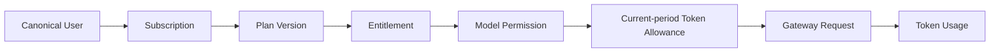
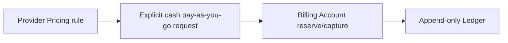

# ink-dream-memory PostgreSQL、Token 订阅与 Gateway 改造总索引

> 文档状态：**Current**（权威入口）  
> 更新：2026-08-09  
> 目标项目：`/Users/dmeck/project/ink-dream-memory`  
> 编写位置：`/Users/dmeck/project/ink-admin-memory/docs/architecture/ink-dream-memory/`  
> 事实基线：[处理判断](../../verification/ink-dream-memory-pg-billing-gateway-treatment-decision.md)

## 1. 当前范围决策

Round 29–30 已替代 Round 24–28 的“全面延期”决定。当前主线同时包含：

1. Dream 主库 43 表与 Notion Connector 5 表全量迁入统一 PostgreSQL `ink-memory`；Dream 运行时最终不保留 SQLite、JSON DB 或内存数据库回退。
2. canonical PostgreSQL `users` 继续作为唯一平台用户全集，也是唯一订阅主体全集；不存在“计费用户”产品实体、名册、筛选或手工开户。现有 `platform_users`/Billing Account 只是内部兼容与独立现金计费投影。
3. Admin 完成 Token-only Plan Version、Entitlement、Subscription、用户独立月度 Token Allowance、Gateway 与 Token Usage 闭环；套餐不包含币种、价格、金额额度、cash overage 或平台全局生效窗口。
4. Dream 既有 Claude Agent、Dream、Chat、Workflow 与受支持模型调用分阶段切入 Admin Gateway，浏览器不持有 Gateway Key 或 Provider Secret。
5. `PaymentAdapter`、Webhook、Fake Adapter、订阅支付及真实 Stripe、支付宝、微信支付、银行等渠道统一保持 **Deferred**，不作为 Token-only Subscription 的依赖或发布门禁。
6. ASR 仅在 Gateway 具备 streaming-audio capability、计量和结算合同后接入；此前 ASR Gateway 是 **Deferred**，当前未鉴权 WebSocket 必须先禁用或完成 canonical 鉴权、Origin、限流和审计。

## 2. 能力状态

| 能力 | 当前状态 | 目标状态 | 权威文档 |
|---|---|---|---|
| Dream SQLite 43+5 | **Current**：两套 SQLite、25 个主库 trigger、深度方言耦合 | **Planned**：Dream Alembic、Repository/UoW、全量迁移与 PG-only runtime | [01](01-current-scope-and-source-baseline.md)、[04](04-postgresql-migration-plan.md) |
| Admin canonical 三表 | **Implemented baseline**：已有 `users/workspaces/stories` DDL 与三表导入器 | **Planned**：结构对齐后由 Dream baseline adopt；保留旧三表脚本并另建 Dream-owned 48 表工具 | [04](04-postgresql-migration-plan.md) |
| 用户与内部投影 | **Partial**：canonical-driven projection 已有，但 Gateway 反查、分页和 orphan 仍有缺口 | **Planned**：所有 canonical users 天然可订阅；205-user 搜索分页验证；无独立计费用户名册 | [02](02-business-integration-and-admin-boundary.md)、[06](06-billing-subscription-gateway-integration.md) |
| Token Subscription/Gateway | **Implemented in Admin workspace / Partial**：`0017`、strict API、个人月度锚点、Token-only Gateway/UI 已完成静态与单元验证；历史金额列仅兼容保留，隔离 PG/E2E 尚未执行 | **Planned**：完成数据库/并发/双视口门禁，并由 Dream 接入真实产品 API；Provider Pricing/独立现金域保持解耦 | [06](06-billing-subscription-gateway-integration.md) |
| 独立 Provider Pricing/现金计费 | **Implemented baseline / Partial** | 与 Subscription 解耦保留；不得在 Token 耗尽时自动兜底，也不进入 Dream 套餐 DTO | [06](06-billing-subscription-gateway-integration.md) |
| Dream 订阅与 Usage 页面 | **Current defect**：静态三档套餐，不是真实订阅 | **Planned**：只渲染月度 Token、当前周期、模型权限和 Token 用量；不显示套餐金额/余额/支付 | [03](03-page-refactor-checklist.md)、[07](07-dream-subscription-and-inference-integration.md) |
| Dream 推理链 | **Current**：PolyAgent、Claude Agent、Image 等直连/本地配置 | **Planned**：server-only Gateway client、stable alias、用户 canary | [07](07-dream-subscription-and-inference-integration.md) |
| Payment/订阅支付 | **Current**：未实现 | **Deferred**：Adapter、Webhook、Fake、真实渠道均不开发；未来独立 PRD 重新立项 | [08](08-payment-adapter-and-webhook-boundary.md)、[90](90-deferred-billing-subscription-inference-payment.md) |
| ASR Gateway | **Deferred** | 具备 streaming-audio capability 与计量/结算合同后另行转 Planned | [07](07-dream-subscription-and-inference-integration.md)、[90](90-deferred-billing-subscription-inference-payment.md) |

同一能力不能同时出现在 Planned 与 Deferred。`90-deferred-*` 维护 Payment/订阅支付与 ASR Gateway 的延期边界；Token-only Subscription、受支持媒体 Gateway 和既有独立现金计费不因此删除，但三者不得重新耦合。

## 3. 文档导航

| 文档 | 状态 | 回答的问题 |
|---|---|---|
| [01-current-scope-and-source-baseline.md](01-current-scope-and-source-baseline.md) | **Current** | 两个项目当前真实实现、43+5 表、推理入口与缺口是什么 |
| [02-business-integration-and-admin-boundary.md](02-business-integration-and-admin-boundary.md) | **Planned** | Dream/Admin/Gateway 如何共享事实又保持最小权限 |
| [03-page-refactor-checklist.md](03-page-refactor-checklist.md) | **Planned** | Dream 哪些页面保留、改造、增加真实数据状态或禁止假数据 |
| [04-postgresql-migration-plan.md](04-postgresql-migration-plan.md) | **Planned** | 48 表如何 baseline adopt、迁移、验证和切换 |
| [05-release-rollout-and-rollback.md](05-release-rollout-and-rollback.md) | **Planned** | PG、Token 产品 API 与 Gateway 的分阶段门禁和回滚是什么 |
| [06-billing-subscription-gateway-integration.md](06-billing-subscription-gateway-integration.md) | **Planned** | Token-only Subscription、独立 Pricing/Billing、资格、API 与迁移合同是什么 |
| [07-dream-subscription-and-inference-integration.md](07-dream-subscription-and-inference-integration.md) | **Planned** | Dream 如何展示订阅并安全迁移既有推理调用 |
| [08-payment-adapter-and-webhook-boundary.md](08-payment-adapter-and-webhook-boundary.md) | **Deferred** | 为什么 Subscription 不依赖 Payment，以及未来重新立项的边界 |
| [90-deferred-billing-subscription-inference-payment.md](90-deferred-billing-subscription-inference-payment.md) | **Deferred / Superseded history** | Payment/订阅支付与 ASR 哪些能力仍延期 |
| [91-evidence-and-legacy-map.md](91-evidence-and-legacy-map.md) | **Current** | 事实证据、旧文档和当前权威入口如何对应 |

## 4. 目标总链路

第二条链是独立现金计费域，不是套餐权益，也不能在 Token Allowance 耗尽时自动承接第一条链。Dream 不复制 Plan、Subscription、Token Usage、Ledger 或 Pricing 真值，也不直接写 Admin 控制面表。Dream 浏览器只访问 Dream 服务端；Dream 服务端以受控服务身份调用 Admin 产品 API 与 Gateway。

## 5. 所有权摘要

| 领域 | 逻辑所有者 | 约束 |
|---|---|---|
| Dream canonical 43+5 Schema、Repository、业务写、Alembic | Dream | Admin 仅批准读取、白名单更新或领域命令；无通用硬删 |
| Admin/RBAC/Audit、Provider/Model/Pricing、Token Subscription、独立 Billing、Gateway/Usage/Ledger | Admin / Gateway | Dream 只经产品 API/Gateway；Subscription DTO 不携带金额；不直接写表 |
| `users` | Dream canonical User 领域 | 唯一用户全集；`platform_users` 仅内部兼容映射 |
| physical PostgreSQL owner/ACL | 目标环境 DBA/审批流程 | 本文逻辑所有权不授权 `ALTER OWNER`、GRANT 或 REVOKE |

## 6. 发布阻断项

- 48 表 Alembic、Repository、迁移器和 validator 未齐，或 Dream runtime 仍能打开 SQLite。
- canonical 用户反查、超过 100 用户服务端搜索分页、orphan billing identity 隔离未通过。
- 隔离验证发现 Subscription 仍可写套餐价格/金额额度/cash overage/全局 `effective_from`，或用户月末周期发生漂移、提前续费重复发 Token。
- Token Allowance 守恒、Gateway reserve/capture/release 与 Token Usage 终态未通过隔离 PG 并发测试。
- Dream 订阅页仍含静态套餐、金额/余额/支付入口，或浏览器能取得 Gateway/Provider Secret。
- 已提交 Provider credential 未由密钥所有者确认吊销/轮换并完成代码移除与 secret scan。
- 未鉴权 ASR WebSocket 未禁用或未补 canonical 鉴权、Origin、限流和审计。
- PaymentAdapter、Webhook、Fake Adapter、支付表/路由或支付环境变量被纳入当前实现。
- 1440×1000、390×844 focused E2E、Admin/Dream 全门禁和迁移演练未通过。

## 7. 文档状态规则

- **Current**：可由当前代码/Schema/只读证据复核的事实。
- **Implemented**：已有实现且仍需按 Release Gate 验证；不等于整条链已完成。
- **Planned**：已批准进入本轮设计和实现，但尚未通过最终验收。
- **Deferred**：明确不在当前实现范围；当前包括全部 Payment/订阅支付与未具备 capability 的 ASR Gateway。
- **Superseded**：历史方案被当前入口替代，只用于追溯。

最终状态以代码、隔离测试和发布回执为准，不能因文档写成目标合同就声称已实现。
