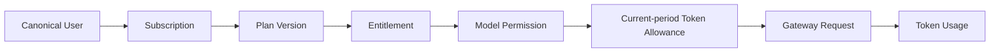
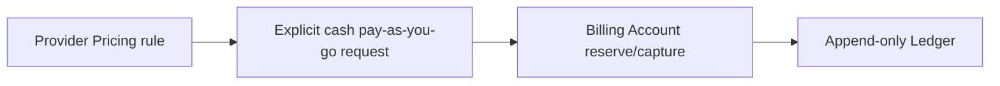

# ink-dream-memory PostgreSQL、Token 订阅与 Gateway 改造总索引

> 文档状态：**Current / Release candidate**（权威入口；实现已完成，生产发布门禁仍开放）
> 更新：2026-08-09  
> 目标项目：`/Users/dmeck/project/ink-dream-memory`  
> 编写位置：`/Users/dmeck/project/ink-admin-memory/docs/architecture/ink-dream-memory/`  
> 事实基线：[处理判断](../../verification/ink-dream-memory-pg-billing-gateway-treatment-decision.md)

## 1. 当前范围决策

Round 29–30 已替代 Round 24–28 的“全面延期”决定。当前主线同时包含：

1. Dream 主库 43 表与 Notion Connector 5 表全量迁入统一 PostgreSQL `ink-memory`；Dream 运行时最终不保留 SQLite、JSON DB 或内存数据库回退。
2. canonical PostgreSQL `users` 继续作为唯一平台用户全集，也是唯一订阅主体全集；不存在“计费用户”产品实体、名册、筛选或手工开户。现有 `platform_users`/Billing Account 只是内部兼容与独立现金计费投影。
3. Admin 完成 Token-only Plan Version、Entitlement、Subscription、用户独立月度 Token Allowance、Gateway 与 Token Usage 闭环；套餐可包含整数 micro-USD 月费，但不包含金额额度、cash overage 或平台全局生效窗口。
4. Dream 既有 Claude Agent、Dream、Chat、Workflow 与受支持模型调用分阶段切入 Admin Gateway，浏览器不持有 Gateway Key 或 Provider Secret。
5. `PaymentAdapter`、Webhook event store、仅测试环境 Fake Adapter 与付费首次开通/到期续费已实现；真实 Stripe、支付宝、微信支付、银行等渠道仍为 **Deferred**。
6. ASR 仅在 Gateway 具备 streaming-audio capability、计量和结算合同后接入；此前 ASR Gateway 是 **Deferred**，当前未鉴权 WebSocket 必须先禁用或完成 canonical 鉴权、Origin、限流和审计。

## 2. 能力状态

| 能力 | 当前状态 | 目标状态 | 权威文档 |
|---|---|---|---|
| Dream PostgreSQL 43+5 | **Implemented / local cutover complete**：除隔离 PG 外，Admin-owned `localhost:5433/ink-memory` 已完成 Admin 0016–0019、Dream head `20260809_06`、43+5/4921 行导入与 48/569/81/25 只读 catalog 验证；main/Notion runtime 为 PG-only | **Release Gate**：其他预发布/生产环境仍须独立 owner/ACL、备份、最终源 rehearsal 与变更审批，不复用本地回执 | [01](01-current-scope-and-source-baseline.md)、[04](04-postgresql-migration-plan.md) |
| Admin canonical 三表 | **Implemented**：Admin `0000–0024` 与 Dream exact baseline-adopt 已在本地 `ink-memory` 完成；旧三表 importer 仍只作为 3/48 安全模式参考 | **Release Gate**：其他环境 owner/ACL/现有数据只读盘点与迁移审批 | [04](04-postgresql-migration-plan.md) |
| 用户与内部投影 | **Implemented / Release candidate**：canonical-driven projection、Gateway 反查、服务端用户分页/搜索及 QA-only 回归均已修复验证 | **Release Gate**：生产历史 orphan 只读盘点、映射/隔离回执 | [02](02-business-integration-and-admin-boundary.md)、[06](06-billing-subscription-gateway-integration.md) |
| Token Subscription/Gateway | **Implemented / Release candidate**：Admin `0017–0024`、Product/Payment API、个人月度状态机、Token Allowance/Token Ledger/Gateway 结算与 Dream BFF/client 已通过 Admin 66 files/313 tests、隔离 PG 与 Dream full/real-PG 合同 | **Release Gate**：真实外部 Provider canary、生产角色切换/凭据注入与用户级流量切换；角色矩阵已在 clone 通过 | [06](06-billing-subscription-gateway-integration.md) |
| 独立 Provider Pricing/现金计费 | **Implemented baseline / Partial** | 与 Subscription 解耦保留；不得在 Token 耗尽时自动兜底，也不进入 Dream 套餐 DTO | [06](06-billing-subscription-gateway-integration.md) |
| Dream 订阅与 Usage 页面 | **Implemented / Release candidate**：真实 Product BFF 数据、月度 Token/周期/月费/模型权限、生命周期预览与付费首次开通/到期续费；无静态价格或假余额 | **Release Gate**：真实预发布 Admin API 冒烟与生产 Session/服务身份配置 | [03](03-page-refactor-checklist.md)、[07](07-dream-subscription-and-inference-integration.md) |
| Dream 推理链 | **Implemented / Release candidate**：server-only Gateway clients、canonical-subject 服务认证、Claude Agent、writing/chat/analyze/echo/traits/patterns 与图片描述/生成均已禁用 direct fallback；61 项聚焦测试通过 | **Planned release step**：外部 Provider canary 与逐角色生产流量切换尚未执行 | [07](07-dream-subscription-and-inference-integration.md) |
| Payment/订阅支付 | **Implemented / Release candidate**：`0022–0024`、Adapter contract、Fake guard、Webhook 幂等、refund/reversal、首次开通、付费月续费与 Dream Intent UI | **Deferred only for real channels**：尚未连接真实支付网络 | [08](08-payment-adapter-and-webhook-boundary.md)、[90](90-deferred-billing-subscription-inference-payment.md) |
| ASR Gateway | **Deferred** | 具备 streaming-audio capability 与计量/结算合同后另行转 Planned | [07](07-dream-subscription-and-inference-integration.md)、[90](90-deferred-billing-subscription-inference-payment.md) |

同一能力不能同时出现在 Planned 与 Deferred。`90-deferred-*` 只维护真实支付渠道与 ASR Gateway 的延期边界；PaymentAdapter/Fake/Webhook 已实现，不能再引用旧文档将其标为 Deferred。

## 3. 文档导航

| 文档 | 状态 | 回答的问题 |
|---|---|---|
| [01-current-scope-and-source-baseline.md](01-current-scope-and-source-baseline.md) | **Current** | 两个项目当前真实实现、43+5 表、推理入口与缺口是什么 |
| [02-business-integration-and-admin-boundary.md](02-business-integration-and-admin-boundary.md) | **Implemented / Release candidate** | Dream/Admin/Gateway 如何共享事实又保持最小权限 |
| [03-page-refactor-checklist.md](03-page-refactor-checklist.md) | **Implemented / Release candidate** | Dream 哪些页面已改造，以及哪些真实发布步骤仍开放 |
| [04-postgresql-migration-plan.md](04-postgresql-migration-plan.md) | **Implemented / Release candidate** | 48 表 baseline adopt、迁移、验证实现与待执行生产切换 |
| [05-release-rollout-and-rollback.md](05-release-rollout-and-rollback.md) | **Current release plan** | 已通过门禁、生产 PG/Gateway 灰度与回滚边界 |
| [06-billing-subscription-gateway-integration.md](06-billing-subscription-gateway-integration.md) | **Implemented / Release candidate** | Token-only Subscription、独立 Pricing/Billing、资格、API 与迁移合同 |
| [07-dream-subscription-and-inference-integration.md](07-dream-subscription-and-inference-integration.md) | **Implemented / Release candidate** | Dream 产品体验/Gateway 客户端实现与外部 canary 余项 |
| [08-payment-adapter-and-webhook-boundary.md](08-payment-adapter-and-webhook-boundary.md) | **Implemented / Release candidate** | Adapter、Intent、Webhook 幂等、Fake guard 与真实渠道边界 |
| [90-deferred-billing-subscription-inference-payment.md](90-deferred-billing-subscription-inference-payment.md) | **Deferred / Superseded history** | 真实支付渠道与 ASR 哪些能力仍延期 |
| [91-evidence-and-legacy-map.md](91-evidence-and-legacy-map.md) | **Current** | 事实证据、旧文档和当前权威入口如何对应 |

## 4. 目标总链路

第二条链是独立现金计费域，不是套餐权益，也不能在 Token Allowance 耗尽时自动承接第一条链。Dream 不复制 Plan、Subscription、Token Usage、Ledger 或 Pricing 真值，也不直接写 Admin 控制面表。Dream 浏览器只访问 Dream 服务端；Dream 服务端以受控服务身份调用 Admin 产品 API 与 Gateway。

## 5. 所有权摘要

| 领域 | 逻辑所有者 | 约束 |
|---|---|---|
| Dream canonical 43+5 Schema、Repository、业务写、Alembic | Dream | Admin 仅批准读取、白名单更新或领域命令；无通用硬删 |
| Admin/RBAC/Audit、Provider/Model/Pricing、Token Subscription、独立 Billing、Gateway/Usage/Ledger | Admin / Gateway | Dream 只经产品 API/Gateway；Subscription DTO 不携带金额；不直接写表 |
| `users` | Dream canonical User 领域 | 唯一用户全集；`platform_users` 仅内部兼容映射 |
| physical PostgreSQL owner/ACL | 目标环境 DBA/审批流程 | 本文逻辑所有权不授权 `ALTER OWNER`、GRANT 或 REVOKE |

## 6. 实现证据与剩余发布阻断项

当前 Release candidate 证据：Admin `0000–0024` 已应用到本地 `ink-memory`，**66 files / 313 tests、tsc/lint/build** 通过；Payment 隔离 PG 已验证首次开通、付费到期不免费发 Token、renewal Intent 复用、签名成功、失败不激活、重复事件幂等和 refund 撤销。Dream 48/569/81/25 Alembic、43+5 migration CLI、PG-only runtime、Product BFF 与全入口 Gateway client 已实现；backend **1,679 passed / 14 skipped / 652 subtests**，推理聚焦 61 passed，前端 lint/build、Product API 9/9 与订阅 Playwright 4/4 通过。角色/最小权限 clone 矩阵通过；真实 startup `/api/health`=200 后已关闭 8765。

- 本地 Admin-owned `localhost:5433/ink-memory` 已完成真实源快照、owner/ACL 指纹、备份、六波 Alembic 与 43+5 cutover；其他预发布/生产环境尚未执行，不能借用本地回执。
- 外部 Provider canary、生产 Gateway 服务身份/Secret 注入和逐角色真实流量切换尚未执行。
- 已提交 Provider credential 已从 active runtime 移除且 secret scan 通过；密钥所有者吊销/轮换仍未确认。
- ASR endpoint 已代码级 fail-closed；密钥所有者吊销/轮换仍未确认，ASR Gateway 继续 Deferred。
- 生产 Fake Adapter 必须 fail closed；未配置真实渠道时不得展示成功或调用支付网络。
- Dream 全仓 frontend lint 已通过（0 errors / 21 warnings）；warnings 仍须保留在回执中，不得写成 0 warnings。

## 7. 文档状态规则

- **Current**：可由当前代码/Schema/只读证据复核的事实。
- **Implemented**：已有实现且仍需按 Release Gate 验证；不等于整条链已完成。
- **Planned**：已批准进入本轮设计和实现，但尚未通过最终验收。
- **Deferred**：明确不在当前实现范围；当前包括真实第三方支付渠道与未具备 capability 的 ASR Gateway。
- **Superseded**：历史方案被当前入口替代，只用于追溯。

最终状态以代码、隔离测试和发布回执为准，不能因文档写成目标合同就声称已实现。
