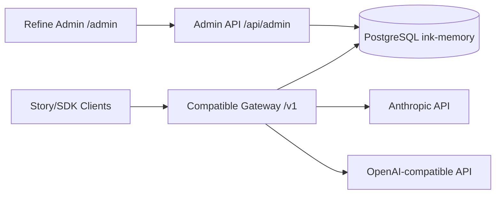
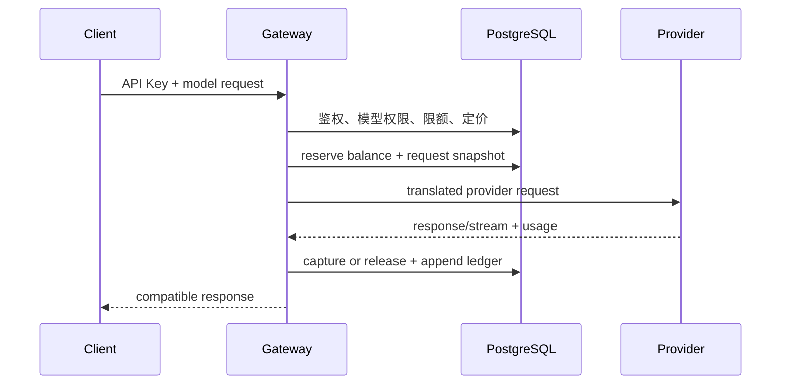

# Ink Memory Admin 架构说明

## 定位

本项目是 AI 创作平台的唯一运营控制面，不是内容创作前台。它负责 Story 数据运营、模型配置、Token 计费、Claude/OpenAI 代理、用户与 RBAC。所有持久化数据统一进入 PostgreSQL 数据库 `ink-memory`。

## 分层

- 页面：`app/(admin)/admin/**`
- Refine UI/provider：`app/components/admin/**`
- 接口：`app/api/admin/**`、`app/v1/**`
- 管理领域：`app/lib/admin/**`
- 网关领域：`app/lib/gateway/**`
- 计费领域：`app/lib/billing/**`
- 模型解析：`app/lib/models/**`
- 数据连接与 schema：`app/lib/db.ts`、`app/lib/db/schema.ts`

Route Handler 只解析请求并调用领域函数。领域层负责 Zod 校验、事务、SQL、权限和审计。

## PostgreSQL 域

- Identity：`platform_users`、`admin_users`、roles/permissions/sessions
- Story：`story_workspaces`、`story_projects`、`story_characters`、`story_scenes`、`story_workflow_runs`
- Model：`ai_providers`、`ai_models`、`ai_pricing_rules`
- Billing：`billing_accounts`、`billing_ledger_entries`
- Gateway：`gateway_api_keys`、`gateway_requests`、`gateway_rate_limits`
- System：`system_settings`、`admin_audit_logs`

`drizzle/0006_smart_hedge_knight.sql` 完成 Story/System 建表并删除旧 ai4sales 业务表。应用不包含 SQLite 运行时依赖。

## 安全边界

- Admin 页面由服务端 Session 保护；API 对每次请求重新校验权限。
- 写操作执行 Origin 检查、严格字段白名单、数据库事务和审计。
- Provider 密钥使用 AEAD 加密；Gateway Key 使用 pepper 哈希。
- 系统敏感设置查询结果统一替换为 `{ "masked": true }`。
- 财务金额使用 micro-USD 整数，账本不可修改或删除。

## 计费网关

流中断且用量无法确定时进入 `settlement_failed`，只允许后台固定确认流程人工对账。
