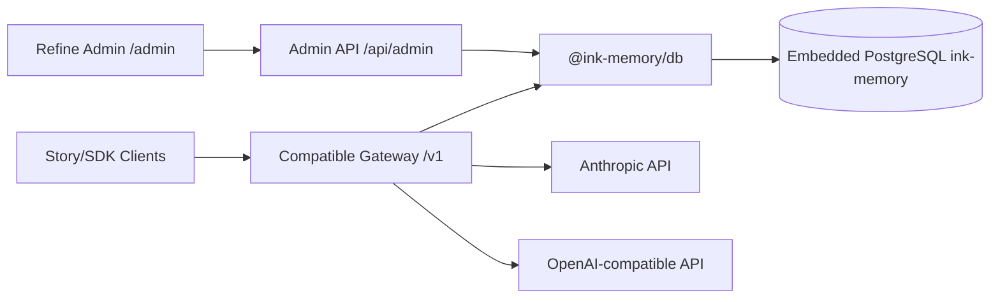
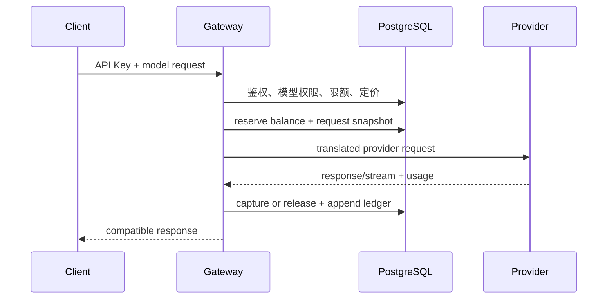

# Ink Memory Admin 架构说明

<!-- [Sync] 2026-09-16: Registry122-126 makes Admin the Deck Plugin binding data owner. -->
<!-- [Sync] 2026-09-16: Registry121 adds claim-bound confirmation Runtime authority through DTO/Service/Drizzle. -->

## 定位

本项目是 AI 创作平台的唯一运营控制面，不是内容创作前台。它负责 Story 数据运营、模型配置、Token 计费、Claude/OpenAI 代理、用户与 RBAC。所有持久化数据统一进入 PostgreSQL 数据库 `ink-memory`。

Deck Plugin binding 的当前态、历史、可选版本、校验和保存由 Registry122-126 提供。请求经 OAuth 主体与严格 DTO 进入 Service，数据库查询与写入只在 typed Drizzle Repository 中执行；保存把 owner 锁、compatibility、expected revision、旧记录 stale、新记录 insert 和 Deck draft revision 推进放入一个 receipt UOW。Dream 保留产品页面、FastAPI 响应、Agent Runtime 和共享文件系统；`agent-type` 本地 materialization 仍是下一阶段，不属于本阶段关闭结果。

对 Dream 的 confirmation Runtime，Admin 通过 Registry121 `story-workspace-confirmation.claim-turn` 在同一事务领取持久化消息并创建或恢复 `server-persistence` grant。输入 DTO 只含 message/claim；Service 从锁定的 message 派生 actor、Thread、Run，Repository 使用 Drizzle 校验 active subject、归属和租约。Dream 使用该 grant 调用具名数据接口，保留 Runtime、EventBus、SSE 与共享文件系统；ACK、claim 替换或租约过期会使后续数据操作失败。

## 分层

- 页面：`app/(admin)/admin/**`
- Refine UI/provider：`app/components/admin/**`
- 接口：`app/api/admin/**`、`app/v1/**`
- 管理领域：`app/lib/admin/**`
- 网关领域：`app/lib/gateway/**`
- 计费领域：`app/lib/billing/**`
- 模型解析：`app/lib/models/**`
- 数据库 package：`packages/db/**`（client、schema、embedded PG、migration）
- 应用兼容 facade：`app/lib/db.ts`、`app/lib/db/schema*`

Route Handler 只解析请求并调用领域函数。领域层负责 Zod 校验、事务、SQL、权限和审计。

## PostgreSQL 域

- Identity：`platform_users`、`admin_users`、roles/permissions/sessions
- Story：`story_workspaces`、`story_projects`、`story_characters`、`story_scenes`、`story_workflow_runs`
- Model：`ai_providers`、`ai_models`、`ai_pricing_rules`
- Billing：`billing_accounts`、`billing_ledger_entries`
- Gateway：`gateway_api_keys`、`gateway_requests`、`gateway_rate_limits`
- System：`system_settings`、`admin_audit_logs`

`drizzle/0006_smart_hedge_knight.sql` 完成 Story/System 建表并删除旧 ai4sales 业务表。应用不包含 SQLite 运行时依赖。

运行拓扑、migration 分离和 MinIO 暂停设计见
[数据库 Package 与内嵌 PostgreSQL](database-package-and-embedded-postgresql.md)。

## 安全边界

- Admin 页面由服务端 Session 保护；API 对每次请求重新校验权限。
- 写操作执行 Origin 检查、严格字段白名单、数据库事务和审计。
- Provider 密钥使用 AEAD 加密；Gateway Key 使用 pepper 哈希。
- 系统敏感设置查询结果统一替换为 `{ "masked": true }`。
- 财务金额使用 micro-USD 整数，账本不可修改或删除。

## 计费网关

流中断且用量无法确定时进入 `settlement_failed`，只允许后台固定确认流程人工对账。
