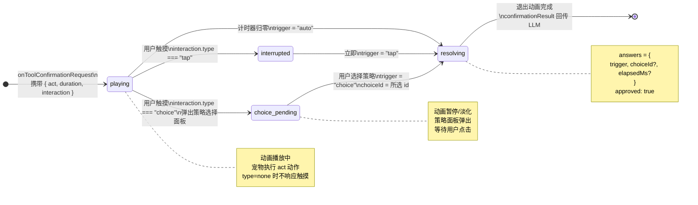
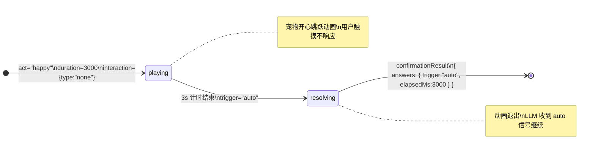
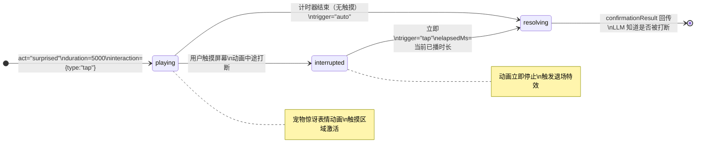
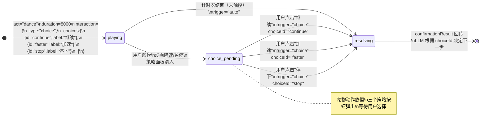
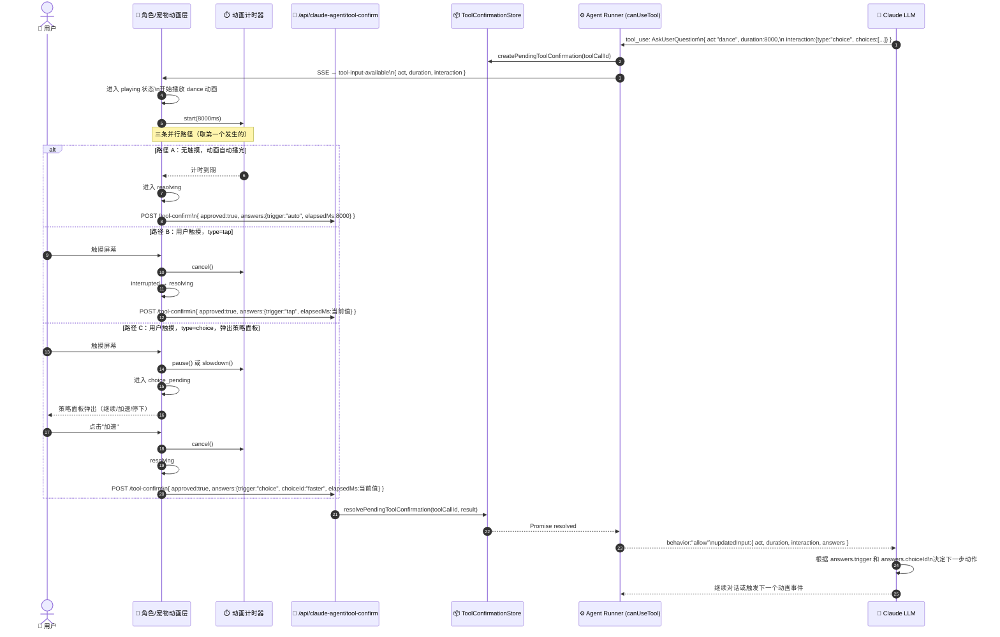
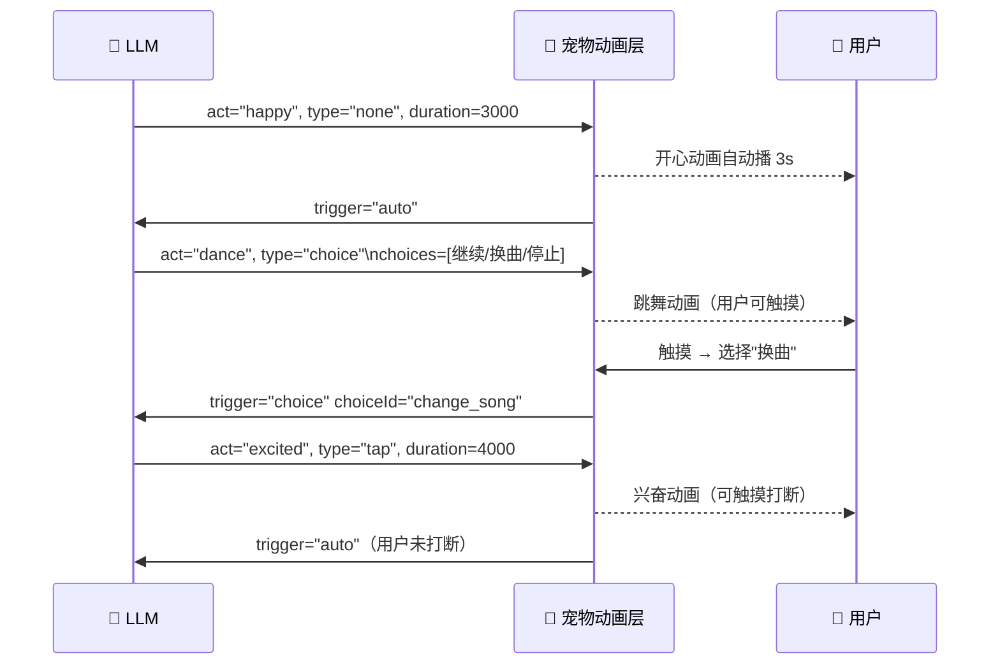

# LLM 驱动动画事件图 — 设计方案

> **文档版本**: v3.0.0  
> **创建日期**: 2026-04-29  
> **关联文档**:  
> - [Claude Agent SDK 交互式工具时序图](./Claude%20Agent%20SDK%20交互式工具时序图.md)  
> - [AI Model 会话流程图](./AI%20Model%20会话流程图.md)  
> - [项目架构设计说明](../architecture/项目架构设计说明.md)

---

## 一、核心心智模型

### 重新定义 AskUserQuestion

> `AskUserQuestion` 在本方案中**不是**字面意义的"向用户提问"。  
> 它是 **LLM 触发宠物/角色动画状态的通道**，是一个动画事件的入口信号。

**类比**：  
就像游戏里的宠物 —— 主人（LLM）给宠物一个指令，宠物开始播放某个动作（开心、跳舞、惊讶...）。  
这个动作**默认按预设时长自动播完**；用户也可以在动作播放期间**触摸打断**，触发可选的后续交互策略。

### 三层结构

```
LLM 层          →  发出 onToolConfirmationRequest (AskUserQuestion)
                   携带动画配置：act + duration + interaction策略
角色动画层      →  宠物进入对应动画状态，按时长自动播放
用户交互层      →  默认：动画播完自动结束
                   触摸：打断动画，进入可选策略（可配置）
```

---

## 二、动画事件配置模型（Animation Event Config）

### 2.1 LLM 发出的动画指令（AskUserQuestion input）

```typescript
interface AnimationEventInput {
  /** 动画动作名称（宠物/角色动画库中定义的 key） */
  act: string;           // "happy" | "dance" | "surprised" | "sad" | "excited" ...

  /** 动画默认播放时长（毫秒） */
  duration: number;      // e.g. 3000

  /** 交互策略配置 */
  interaction: AnimationInteractionConfig;
}
```

### 2.2 交互策略配置（可配置）

三种交互类型，由 LLM 在指令中指定：

| type | 名称 | 行为描述 |
|------|------|---------|
| `"none"` | 纯动画 | 动画自动播完，不响应用户触摸 |
| `"tap"` | 触摸打断 | 用户触摸可打断动画，直接结束该 act |
| `"choice"` | 触摸后选择策略 | 用户触摸后弹出 N 个可选策略按钮，选择一个决定后续 |

```typescript
type AnimationInteractionConfig =
  | { type: "none" }
  | { type: "tap" }
  | {
      type: "choice";
      /** 选项列表，由 LLM 或业务层配置 */
      choices: Array<{
        id: string;       // 策略 ID，回传给 LLM
        label: string;    // 按钮文字
        icon?: string;    // 可选图标
      }>;
    };
```

### 2.3 结果回传（confirmationResult answers）

动画事件结束后，`confirmationResult` 的 `answers` 字段携带触发方式和用户选择：

```typescript
interface AnimationEventResult {
  /** 触发方式 */
  trigger: "auto"    // 动画自然播完
           | "tap"   // 用户触摸打断（type=tap）
           | "choice"; // 用户选择了策略（type=choice）

  /** 选择的策略 ID（仅 trigger==="choice" 时存在） */
  choiceId?: string;

  /** 动画已播放时长（毫秒），打断时有参考价值 */
  elapsedMs?: number;
}
```

---

## 三、动画事件状态机（Animation Event Graph）

### 3.1 核心状态（4 个）

| Act | 名称 | 进入时机 | 退出条件 |
|-----|------|----------|---------|
| `playing` | 播放中 | `onToolConfirmationRequest` 触发，动画开始 | 计时结束 / 被触摸打断 |
| `interrupted` | 已打断 | 用户触摸，type=`"tap"` | 立即 → `resolving` |
| `choice_pending` | 等待选择 | 用户触摸，type=`"choice"` | 用户选择策略 → `resolving` |
| `resolving` | 结束中 | 任意退出路径 | 退出动画完成，回传 `confirmationResult` |

---

### 3.2 完整状态机图



---

### 3.3 场景一：开心动画（type = none，自动播完）

**描述**: LLM 触发 `happy` 动画，无需用户交互，3 秒后自动结束。



---

### 3.4 场景二：惊喜动画（type = tap，触摸打断）

**描述**: LLM 触发 `surprised` 动画，用户可以触摸打断，直接结束该状态。



---

### 3.5 场景三：舞蹈动画（type = choice，触摸后选择后续策略）

**描述**: LLM 触发 `dance` 动画，用户触摸后弹出 3 个策略选项，选择一个决定 LLM 后续行为。



---

## 四、交互时序图

### 4.1 完整系统时序（含三种交互路径）



---

### 4.2 策略链（多轮动画事件）



---

## 五、业务设计稿参照

### 5.1 playing 状态（宠物动画播放中）

```
┌─────────────────────────────────────┐
│                                     │
│           🐾  宠物开心跳跃中         │
│          ／(ˊ〜ˋ)＼                  │
│         动画播放区域                  │
│                                     │
│  ┄┄┄┄ 进度条（动画剩余时长）┄┄┄┄┄   │
│  ████████████░░░░░░░  3.2s 剩余    │
│                                     │
│  （type=none：此区域不响应触摸）     │
│  （type=tap/choice：触摸区域激活）   │
└─────────────────────────────────────┘
```

### 5.2 choice_pending 状态（触摸后策略面板）

```
┌─────────────────────────────────────┐
│                                     │
│       🐾  宠物动作放慢/模糊化        │
│      （背景减速，提示可交互）         │
│                                     │
│  ┌─────────────────────────────┐    │
│  │   你想让它怎么做？（可选）   │    │
│  │                             │    │
│  │  [🔄 继续]  [⚡ 加速]       │    │
│  │            [⏹ 停下]        │    │
│  └─────────────────────────────┘    │
│                                     │
└─────────────────────────────────────┘
选择后 → resolving（宠物执行对应动作退场）
```

### 5.3 resolving 状态（退场特效）

```
trigger="auto"          trigger="tap"           trigger="choice:faster"
┌──────────────┐        ┌──────────────┐        ┌──────────────┐
│   宠物轻轻   │        │   宠物被      │        │  宠物加速    │
│   放松坐下   │        │   叫停，停顿  │        │  冲出屏幕    │
│   淡出消失   │        │   快速退场    │        │  特效粒子    │
└──────────────┘        └──────────────┘        └──────────────┘
```

---

## 六、接口类型定义

```typescript
// app/lib/animation-event-graph/types.ts

/** 动画事件状态（4 个，内聚于动画层） */
export type AnimationEventAct =
  | "playing"          // 动画播放中
  | "interrupted"      // 已被触摸打断（tap 类型中间态，立即→resolving）
  | "choice_pending"   // 等待用户选择策略（choice 类型）
  | "resolving";       // 结束退场中

/** 动画交互策略 */
export type AnimationInteractionConfig =
  | { type: "none" }
  | { type: "tap" }
  | { type: "choice"; choices: AnimationChoice[] };

export interface AnimationChoice {
  id: string;
  label: string;
  icon?: string;
}

/** LLM 通过 AskUserQuestion 传入的动画指令 */
export interface AnimationEventInput {
  act: string;
  duration: number;
  interaction: AnimationInteractionConfig;
}

/** confirmationResult.answers 的结构 */
export interface AnimationEventResult {
  trigger: "auto" | "tap" | "choice";
  choiceId?: string;
  elapsedMs?: number;
}

/** 动画层信号 */
export type AnimationEventSignal =
  | "SIG_ANIM_START"          // onToolConfirmationRequest 触发
  | "SIG_TIMER_END"           // 计时器自然到期
  | "SIG_USER_TOUCH"          // 用户触摸屏幕
  | "SIG_CHOICE_SELECT"       // 用户选择了策略（choice_pending 中）
  | "SIG_RESOLVE_DONE";       // 退场动画完成，可回传结果

/** 动画事件状态机控制器 */
export interface AnimationEventController {
  readonly act: AnimationEventAct;
  readonly progress: number;   // 动画播放进度 0~1
  emit: (signal: AnimationEventSignal, payload?: { choiceId?: string }) => void;
}
```

---

## 七、状态转移表

```typescript
// app/lib/animation-event-graph/transitions.ts

export const ANIMATION_EVENT_TRANSITIONS = [
  // 初始化
  { from: null,              signal: "SIG_ANIM_START",    to: "playing" },

  // 自然结束
  { from: "playing",         signal: "SIG_TIMER_END",     to: "resolving",
    result: () => ({ trigger: "auto" }) },

  // 触摸打断（type=tap）
  { from: "playing",         signal: "SIG_USER_TOUCH",    to: "interrupted",
    guard: (ctx) => ctx.interaction.type === "tap" },
  { from: "interrupted",     signal: "SIG_ANIM_START",    to: "resolving",   // 立即过渡
    result: (ctx) => ({ trigger: "tap", elapsedMs: ctx.elapsedMs }) },

  // 触摸弹出策略（type=choice）
  { from: "playing",         signal: "SIG_USER_TOUCH",    to: "choice_pending",
    guard: (ctx) => ctx.interaction.type === "choice" },
  { from: "choice_pending",  signal: "SIG_CHOICE_SELECT", to: "resolving",
    result: (ctx, payload) => ({ trigger: "choice", choiceId: payload.choiceId, elapsedMs: ctx.elapsedMs }) },

  // 退场完成
  { from: "resolving",       signal: "SIG_RESOLVE_DONE",  to: null },  // 回传 confirmationResult
] as const;
```

---

## 八、信号注入点（工程落地位置）

```
触发链路：

LLM (AskUserQuestion tool_use)
  → onToolConfirmationRequest callback (agent-runner.ts)
    → createPendingToolConfirmation (tool-confirmation-store.ts)
    → SSE: tool-input-available → 前端

前端动画层 (新增组件：PetAnimationEvent.tsx)
  ├── 收到 SSE tool-input-available (act/duration/interaction)
  │     → emit(SIG_ANIM_START) → act: playing
  │     → 启动动画播放器 + 计时器
  │
  ├── 计时器到期
  │     → emit(SIG_TIMER_END) → act: resolving
  │     → POST /tool-confirm { approved:true, answers:{trigger:"auto"} }
  │
  ├── 用户触摸 (type="tap")
  │     → emit(SIG_USER_TOUCH) → act: interrupted → resolving
  │     → POST /tool-confirm { approved:true, answers:{trigger:"tap", elapsedMs} }
  │
  ├── 用户触摸 (type="choice")
  │     → emit(SIG_USER_TOUCH) → act: choice_pending
  │     → 渲染策略选择面板 (choices)
  │     → 用户点击策略
  │       → emit(SIG_CHOICE_SELECT, {choiceId}) → act: resolving
  │       → POST /tool-confirm { approved:true, answers:{trigger:"choice", choiceId, elapsedMs} }
  │
  └── 退场动画完成
        → emit(SIG_RESOLVE_DONE) → 组件卸载
```

---

## 九、参考链接

- [Claude Agent SDK 交互式工具时序图](./Claude%20Agent%20SDK%20交互式工具时序图.md)
- [AI Model 会话流程图](./AI%20Model%20会话流程图.md)
- [项目架构设计说明](../architecture/项目架构设计说明.md)
- `app/lib/claude-agent-kit/server/server/agent-runner.ts` — `onToolConfirmationRequest` / `canUseTool` 实现
- `app/lib/tool-confirmation-store.ts` — Promise 阻塞/解除机制
- `app/api/claude-agent/tool-confirm/route.ts` — 确认结果提交接口
