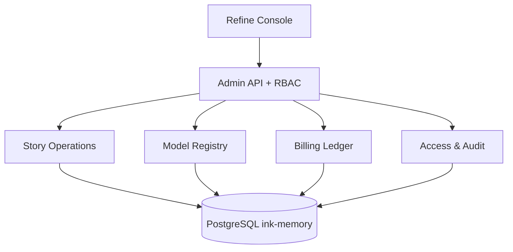

# Ink Memory AI 平台控制面设计

## 产品职责

Ink Memory Admin 同时是：剧本数据运营后台、模型注册中心、Token 计费中心、Claude/OpenAI 代理网关控制台、用户与权限后台。

## 控制面

Story 资源是 PostgreSQL 一等实体，支持完整运营 CRUD；不再通过外部 SQLite 或只读适配器观察。

## 数据规则

- ID 由服务端生成，外部身份通过 `source + external_user_id` 幂等关联。
- Provider/Model/Pricing 使用稳定 code，历史请求保存定价快照。
- 余额与账本使用 micro-USD 整数，所有扣费在事务中完成。
- Gateway 请求保存状态、归因、用量、成本和错误摘要，不保存完整 Prompt/响应。
- Admin 写操作写入不可变审计日志；Gateway 自动结算失败仅记录，不产生人工结算写操作。

## 请求生命周期

1. 验证 Gateway Key、用户状态、scope、模型权限和配额。
2. 解析启用 Provider、模型与当前定价规则。
3. 预估上限并冻结余额，创建请求快照。
4. 调用上游并解析流式/非流式 usage。
5. capture 实际费用或 release 余额；写入账本终态。
6. 未知 usage 不猜测为零，保留 `settlement_failed` 状态、错误和快照供查询；不提供人工结算入口。

## 删除策略

- Story/System 自有运营记录允许带确认的硬删除，受外键保护。
- Provider、Model、Pricing、Platform User、Admin User 使用停用策略。
- Gateway Key 使用 revoke。
- Billing ledger、usage、audit 永不 update/delete。
- 自定义 Admin Role 可删除；内置角色受保护。
