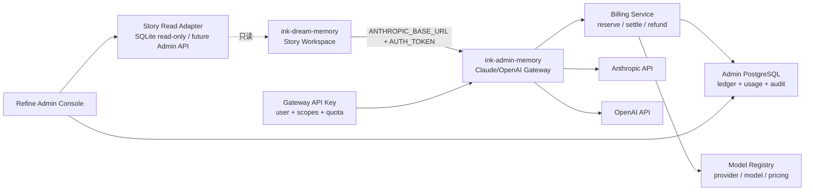
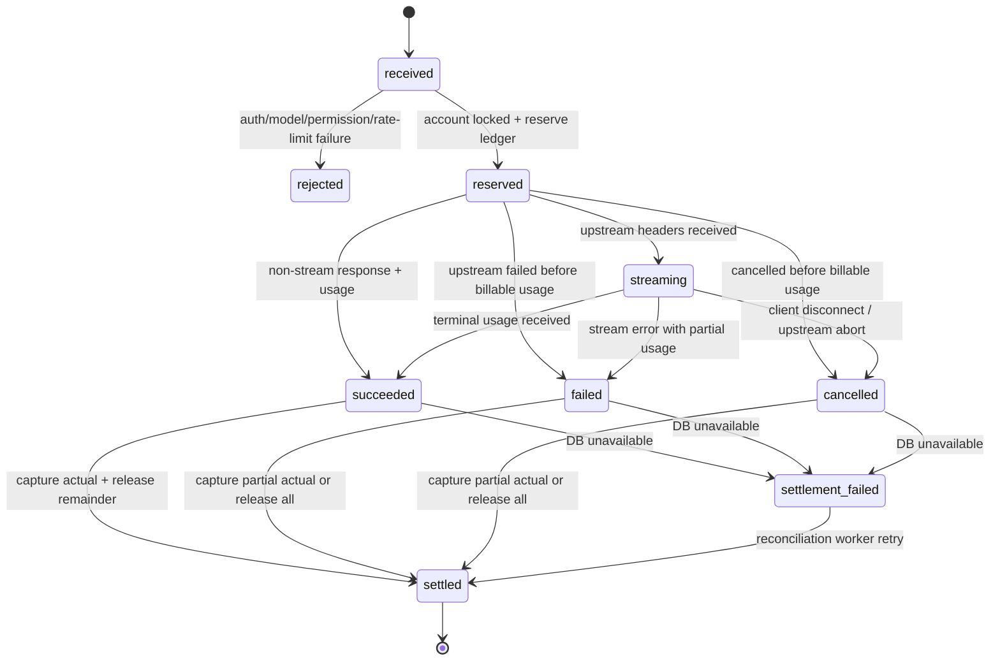

# AI 创作平台管理、计费与模型网关设计

> Design ID：`DESIGN-AI-PLATFORM-CONTROL-001`  
> 基线日期：2026-08-08  
> 目标仓库：`/Users/dmeck/project/ink-admin-memory`  
> 业务数据源：`/Users/dmeck/project/ink-dream-memory`（只读观察，不修改业务代码）  
> 代理参考：`/Users/dmeck/project/cc-switch`  
> 状态：实施基线

## 1. 决策摘要

`ink-admin-memory` 定位为 **AI 创作平台控制面与计费数据面**，而不是 Story Workspace
业务代码的镜像或传统 CMS。

本设计采用以下边界：

1. `ink-dream-memory` 的 SQLite 是用户、剧本、角色、场景和工作流运行的业务真相源。
2. `ink-admin-memory` 的 PostgreSQL 是模型配置、代理身份、额度、余额、账本、用量和审计的
   真相源。
3. 两边不复制可编辑业务表。后台通过只读数据源适配器观察 Story 数据，通过稳定的
   `source + external_user_id` 关联平台用户。
4. Claude 与 OpenAI 协议分别由独立适配器处理；不把 OpenAI-compatible shim 当作
   Anthropic SDK 的替代品。
5. 所有金额使用整数 `micro-USD`（一美元等于 `1_000_000` micro-USD），不使用浮点数。
6. 每笔请求保存定价快照。模型价格随后变化时，历史账单不重算。
7. 计费采用“预授权 → 上游调用 → 实际结算/释放”的状态机，并在一个 PostgreSQL 事务内
   锁定账户完成资金变化。
8. Refine 只负责管理端资源编排；权限最终由服务端 session、RBAC 和 API 检查执行。

## 2. 实仓调研结论

### 2.1 ink-admin-memory

- Next.js 16 App Router，页面与 Route Handler 同仓。
- PostgreSQL + Drizzle；现有运行时会按需初始化基础表。
- Refine 5 已有 `/admin` 路由壳，使用 `@refinedev/nextjs-router`。
- 当前只有 customers、todos、conversations、system_configs；尚无平台用户、模型注册、
  Token 账务和网关数据。
- `app/api` 保持薄层，领域逻辑必须进入 `app/lib`。

### 2.2 ink-dream-memory / story-workspace

- 后端是 FastAPI + SQLite。
- 用户主键为 `users.id INTEGER`；业务数据通过 `author_id`、`owner_id`、`workspace_id`
  归属用户。
- Story Workspace 权威表包括：
  `story_workspace_workspaces`、`story_workspace_stories`、
  `story_workspace_characters`、`story_workspace_scenes`、关联表及 `workflow_runs`。
- Claude Agent SDK 环境层已经允许受控透传：
  `ANTHROPIC_BASE_URL`、`ANTHROPIC_AUTH_TOKEN`、`ANTHROPIC_MODEL`。
- 因此接入网关不要求修改 Story 业务表或路由，只需要在部署环境中把 Claude 上游改为
  管理网关，并发放绑定到用户的 Gateway API Key。

### 2.3 cc-switch 可复用原则

复用的是设计而非 Rust/Tauri 代码：

- 分别解析 input、output、cache-read、cache-write 四类 Token。
- 明确 Anthropic 与 OpenAI 输入 Token 的缓存语义，避免重复计费。
- 使用高精度金额，不使用浮点数。
- 保存 request model、实际 upstream model、pricing model 三个归因字段。
- 按 request/message id 幂等去重；冲突不能静默覆盖。
- 流式与非流式路径都必须在结束事件中提取 usage。
- 错误请求也进入请求审计，但只有实际产生的用量才生成扣款。

## 3. 目标架构



管理面和请求面必须分离：

- 管理面：`/api/admin/**`，Cookie session + RBAC，允许配置资源和人工账务调整。
- 请求面：`/v1/messages`、`/v1/chat/completions`、后续 `/v1/responses`，Gateway API Key
  鉴权，只执行模型调用。
- 业务观察面：`/api/admin/story/**`，仅从只读适配器查询，不直接写 Story SQLite。

## 4. 数据所有权与关联

| 数据 | 真相源 | Admin 是否可写 | 关联键 |
| --- | --- | --- | --- |
| Story 用户 | ink-dream SQLite `users` | 否 | `source=ink-dream` + `external_user_id` |
| 剧本/角色/场景 | ink-dream Story Workspace | 否 | `workspace_id` / `author_id` |
| 工作流运行 | ink-dream `workflow_runs` | 否 | `workspace_id` / `created_by` |
| 平台计费用户投影 | Admin PostgreSQL | 是（状态/套餐） | `platform_users.id` |
| Gateway API Key | Admin PostgreSQL | 是 | `platform_user_id` |
| Provider/Model/Pricing | Admin PostgreSQL | 是 | 内部 ID + 稳定 model code |
| 余额/预授权/账本 | Admin PostgreSQL | 受控写 | `billing_account_id` |
| 请求/Token usage | Admin PostgreSQL | 网关写、后台只读 | `request_id` / `idempotency_key` |
| 管理员/RBAC/审计 | Admin PostgreSQL | 受控写 | `admin_user_id` |

### 4.1 用户映射

平台用户不是 Story `users` 的复制表。它只保存计费需要的投影：

```text
platform_users
  id                    Admin 内部稳定 ID
  source                ink-dream / api / manual
  external_user_id      Story users.id 的字符串形式
  email/display_name    运营快照，可由同步刷新
  tier                  free / pro / enterprise / custom
  status                active / suspended / closed
  daily/monthly limits  用户级默认限制
```

唯一约束为 `(source, external_user_id)`，避免不同业务系统的同名 ID 冲突。

## 5. 数据模型

### 5.1 管理身份与 RBAC

- `admin_users`：邮箱、密码哈希、状态、最近登录时间。
- `admin_roles`：`auditor`、`operator`、`billing_admin`、`super_admin`。
- `admin_permissions`：稳定权限代码，如 `models.read`、`providers.write`、
  `billing.adjust`、`gateway.keys.write`、`audit.read`。
- `admin_user_roles`、`admin_role_permissions`：多对多关系。
- `admin_sessions`：只保存随机 session token 的 SHA-256，不保存原 token。
- `admin_audit_logs`：只追加，记录 actor、action、resource、before/after 摘要、request id、IP。

### 5.2 模型注册中心

`ai_providers`：

- `code`：anthropic-primary、openai-primary 等稳定标识。
- `protocol`：`anthropic` 或 `openai`。
- `base_url`：允许企业代理或兼容上游，必须限制为 HTTPS；开发环境可显式允许 localhost。
- `api_key_ciphertext`、`api_key_iv`、`api_key_tag`：AES-256-GCM 密文。
- `status`、`timeout_ms`、`max_retries`、`config_json`。

`ai_models`：

- 对外 `code` 与上游 `upstream_model` 分离。
- 保存 provider、display name、context window、max output、capabilities、enabled。
- `code` 是客户端请求使用的稳定模型别名；上游型号变化只更新映射。

`ai_pricing_rules`：

- 绑定 model + user tier。
- 保存 input/output/cache-read/cache-write 的每百万 Token 价格（micro-USD）。
- `markup_bps` 和 `discount_bps` 使用基点整数；禁止同时产生负价格。
- `effective_from/effective_to` 支持未来价格切换。
- 同一 model/tier/时间点最多匹配一条 active 规则。

### 5.3 代理身份与权限

`gateway_api_keys`：

- 明文只在创建时返回一次；数据库保存 `key_prefix` 和 SHA-256/HMAC 哈希。
- 绑定 `platform_user_id`、scopes、过期时间、最近使用时间和吊销时间。
- scope 示例：`messages:create`、`chat:create`、`models:list`。

`user_model_permissions`：

- 用户级模型 allow/deny。
- 可覆盖每分钟请求、每日 Token、每月 Token 上限。
- 显式 deny 优先于套餐默认。

### 5.4 账户与账本

`billing_accounts`：

- `available_microusd`：可用余额。
- `reserved_microusd`：进行中请求的预授权金额。
- `lifetime_debited_microusd`、`version`：汇总与乐观锁辅助。
- 账户行在 reserve/settle/refund 中使用 `SELECT ... FOR UPDATE`。

`billing_ledger_entries`：

- 类型：`credit`、`reserve`、`capture`、`release`、`refund`、`adjustment`。
- `amount_microusd` 始终为正，方向由类型定义。
- 保存变更前后 available/reserved 快照。
- `idempotency_key` 唯一，人工调整必须提供原因与管理员 actor。
- 已写账本不可更新或删除；冲正通过新 entry 完成。

### 5.5 请求与用量

`gateway_requests`：

- 身份：request id、client idempotency key、upstream request/message id。
- 归因：user、API key、provider、requested model、resolved model、pricing rule。
- 状态：`received`、`reserved`、`streaming`、`succeeded`、`failed`、`cancelled`、
  `settlement_failed`。
- 用量：input、output、cache-read、cache-write Token。
- 金额：reserved、provider cost、charged amount，均为 micro-USD。
- 快照：四类单价、markup、discount、币种、计价语义。
- 运行：HTTP 状态、错误代码、流式标记、首 Token 与总延迟、时间戳。

唯一约束：

- `request_id` 全局唯一。
- `(platform_user_id, idempotency_key)` 在 idempotency key 非空时唯一。
- `upstream_request_id` 只作为辅助去重和追踪，不覆盖本地 request id。

`gateway_rate_limits` 保存固定窗口计数；首版按 user + model + minute/day 维度更新。

## 6. 金额与定价算法

所有输入必须为非负整数。令价格为每百万 Token 的 micro-USD：

```text
component = ceil(tokens × price_microusd_per_million / 1_000_000)
base = input + output + cache_read + cache_write
marked_up = ceil(base × (10_000 + markup_bps) / 10_000)
charge = ceil(marked_up × (10_000 - discount_bps) / 10_000)
```

为避免缓存重复计费：

- Anthropic：`input_tokens` 按 fresh input 处理，缓存读写单独计价。
- OpenAI：input usage 通常包含 cached tokens；fresh input 为
  `max(0, input_tokens - cached_tokens)`，缓存读单独计价。
- 每条请求必须保存 `input_token_semantics`，不能在历史查询时猜测。

定价匹配顺序：

1. 精确 model + user tier + 当前有效时间。
2. 精确 model + `default` tier。
3. 不允许回退到猜测价格；缺失价格时请求返回 `MODEL_PRICING_UNAVAILABLE`。

## 7. 请求与结算状态机



### 7.1 预授权

- Anthropic 可优先使用官方 `messages.countTokens` 得到输入数量。
- 若计数服务不可用，使用 UTF-8 请求字节数作为保守输入 Token 上界。
- output 使用请求 `max_tokens`/`max_completion_tokens`，并受模型上限截断。
- 预授权金额至少为系统配置 `GATEWAY_MIN_RESERVE_MICROUSD`。
- `available < reserve` 时返回 HTTP 402 `INSUFFICIENT_BALANCE`，不调用上游。

### 7.2 幂等

- 客户端通过 `Idempotency-Key` 传入业务幂等键。
- 同一用户同一键：
  - 已成功：非流式可返回已保存的响应摘要；流式返回 409，避免伪造重放流。
  - 进行中：返回 409 `REQUEST_IN_PROGRESS`。
  - 已失败：只有明确的 retry key 才新建请求。
- 每个账本动作使用 `request_id:reserve/capture/release/refund` 作为独立幂等键。

### 7.3 流式断开

客户端断开不等于没有成本。网关必须：

1. 继续消费或显式取消上游流。
2. 保留最后一次累计 usage。
3. 在 `finally` 中结算已知用量；没有 usage 时把请求标记为
   `settlement_failed`，由对账任务查询或人工处理。
4. 绝不能因为响应流异常而跳过 release/capture。

## 8. API 合同

### 8.1 Gateway

| Method | Path | 协议 | 权限 |
| --- | --- | --- | --- |
| POST | `/v1/messages` | Anthropic Messages passthrough | `messages:create` |
| POST | `/v1/messages/count_tokens` | Anthropic token count | `messages:create` |
| POST | `/v1/chat/completions` | OpenAI Chat Completions | `chat:create` |
| GET | `/v1/models` | 可用模型投影 | `models:list` |

请求鉴权接受：

- `Authorization: Bearer gw_...`
- Anthropic 客户端兼容的 `x-api-key: gw_...`

网关删除客户端携带的上游密钥、Host、Content-Length 等 hop-by-hop/敏感 header，只使用服务端
解密得到的 Provider credential。

标准错误结构：

```json
{
  "error": {
    "type": "billing_error",
    "code": "INSUFFICIENT_BALANCE",
    "message": "Account balance is insufficient for this request",
    "request_id": "req_..."
  }
}
```

### 8.2 Admin

资源 API 统一使用：

```json
{
  "data": [],
  "meta": { "page": 1, "pageSize": 20, "total": 0 }
}
```

首版资源：

- `/api/admin/providers`
- `/api/admin/models`
- `/api/admin/pricing-rules`
- `/api/admin/platform-users`
- `/api/admin/platform-users/:id/account`
- `/api/admin/gateway-api-keys`
- `/api/admin/usage`
- `/api/admin/ledger`
- `/api/admin/gateway-requests`
- `/api/admin/audit-logs`
- `/api/admin/story/projects`（只读）

## 9. Refine 信息架构

```text
/admin
├── dashboard
├── story
│   ├── projects
│   └── workflow-runs
├── users
│   ├── platform-users
│   ├── api-keys
│   └── model-permissions
├── models
│   ├── providers
│   ├── registry
│   └── pricing
├── billing
│   ├── usage
│   ├── ledger
│   └── accounts
├── gateway
│   ├── requests
│   ├── errors
│   └── rate-limits
├── access
│   ├── admin-users
│   └── roles
└── audit
```

高风险交互：

- Provider Key 永不回显；编辑页只显示“已配置/未配置”和密钥后四位指纹。
- 停用模型前显示近 24 小时请求量和受影响用户数。
- 余额调整要求二次确认、原因和幂等键，不能直接编辑账户余额字段。
- API Key 只在创建成功弹窗显示一次，关闭后不可恢复。
- 账本和请求日志只读；退款通过独立动作创建冲正记录。

## 10. 安全要求

- 生产环境缺少 `ADMIN_SESSION_SECRET`、`AI_CREDENTIAL_ENCRYPTION_KEY` 或引导管理员配置时，
  对应能力 fail closed。
- Provider credential 使用 AES-256-GCM；加密主密钥来自环境或 KMS，不入数据库。
- Gateway API Key 使用高熵随机值；哈希比较使用常量时间。
- 管理登录 Cookie：HttpOnly、Secure（生产）、SameSite=Lax、短时 session。
- 管理写 API 校验 Origin/Host，并要求具体 permission。
- 不记录完整 prompt、响应、API Key 或 Provider credential；默认只记录字节数、Token、模型、
  状态与错误分类。调试采样必须显式开启并脱敏。
- 上游 base URL 默认只允许 HTTPS，阻止内网地址和凭证 SSRF；开发 localhost 需要显式开关。
- 日志和账本表通过权限与数据库 trigger 保护为 append-only。

## 11. 对账与恢复

定时对账任务处理：

- `reserved/streaming` 超过超时阈值的孤儿请求。
- `settlement_failed` 请求。
- request 有费用但缺 capture ledger，或 ledger 有 capture 但 request 未 settled。
- account 汇总余额与 ledger 重放结果不一致。

恢复规则：

- 能证明没有用量：释放全部预授权。
- 有最终 usage：按原 pricing snapshot 结算。
- 只有部分 usage：结算已知最小费用并标记 `requires_review`。
- 无法判断：不自动扣款，冻结预授权并进入人工复核队列。

## 12. 实施顺序

### S1：账务基础

- Schema、迁移、金额/usage/定价纯函数。
- 平台用户、账户、账本、Provider、Model、Pricing repository。
- 预授权/结算/退款事务与单元测试。

### S2：身份与管理 API

- Admin session、RBAC、审计。
- Refine Data Provider 与模型、用户、账务资源页面。
- Gateway API Key 生命周期。

### S3：代理网关

- 官方 Anthropic TypeScript SDK 适配器。
- 官方 OpenAI TypeScript SDK 适配器。
- 非流式与流式 usage 采集、超时、取消、错误映射。
- 模型权限、余额、配额、限流。

### S4：Story 观察面与上线门禁

- SQLite 只读适配器与未来 HTTP Admin API 接口。
- Story 项目/运行/用户用量聚合页面。
- 对账任务、运维指标、生产 smoke 和故障演练。
- 在 `docs` 输出 ink-dream-memory 环境接入建议，不修改其代码。

## 13. 验收矩阵

| 场景 | 必须证明 |
| --- | --- |
| 定价 | 四类 Token、缓存语义、markup/discount、整数舍入正确 |
| 余额 | 并发请求不能透支；reserve/capture/release 原子且幂等 |
| 失败 | 上游 4xx/5xx/超时/断流均有请求状态与资金收尾 |
| 流式 | Anthropic message_delta 与 OpenAI terminal usage 可结算 |
| 密钥 | 明文仅创建时可见；数据库和日志无明文 |
| 权限 | UI 隐藏不是证据；直接调用 API 必须返回 401/403 |
| Story | 只读查询不产生 SQLite 写锁或复制可编辑业务数据 |
| 审计 | 管理写操作可追踪；账本/审计不可更新删除 |
| 回归 | `/`、customers、todos、现有 Claude Agent 流程不被 `/admin` 捕获 |
| 生产门禁 | Admin feature flag、必要 secrets、数据库迁移缺一则 fail closed |

## 14. 官方协议依据

- Anthropic Streaming Messages：
  <https://platform.claude.com/docs/en/build-with-claude/streaming>
- Anthropic Count Tokens：
  <https://platform.claude.com/docs/en/api/messages/count_tokens>
- OpenAI Chat API：
  <https://developers.openai.com/api/reference/resources/chat>
- OpenAI Responses streaming events：
  <https://platform.openai.com/docs/api-reference/responses-streaming>

协议实现以官方 SDK 类型和当前官方文档为准；模型价格由运营人员在 Model Registry 中维护，
不把文档中的示例价格写死为不可变业务规则。
