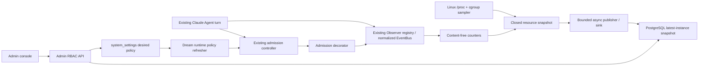
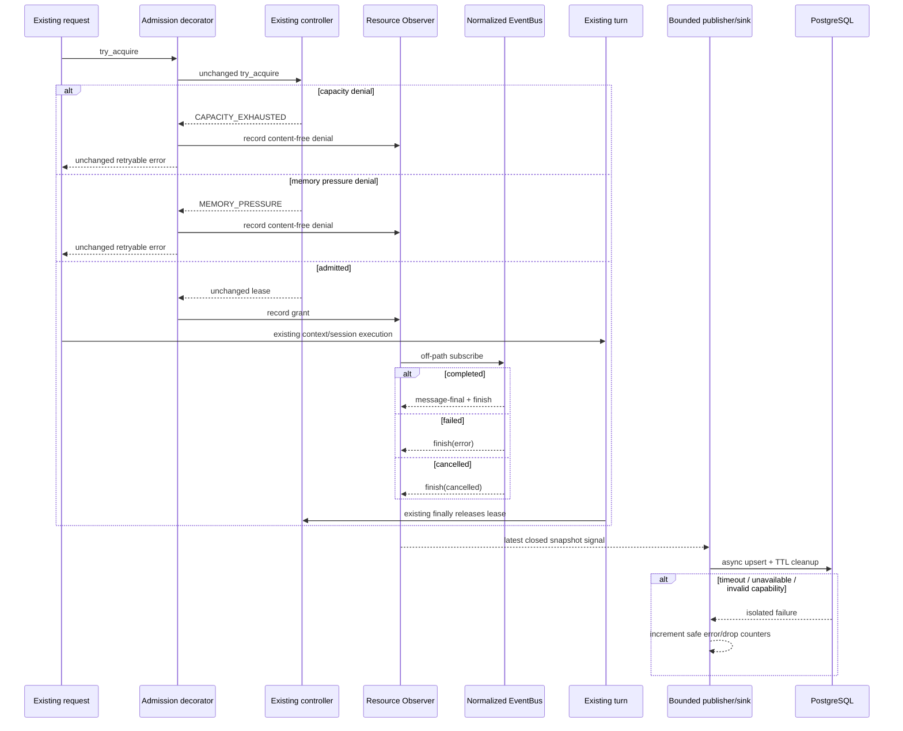

<!--
[Input] 2026-08-27 Claude Agent admission diagnosis, existing Observer/EventBus contracts, and PostgreSQL-only Dream/Admin synchronization requirements.
[Output] Chinese architecture, interaction, schema, security, sequence, validation, rollback, and ownership design for Claude Agent resource governance.
[Pos] Authoritative cross-repository design; Admin Drizzle owns schema, Dream owns content-free observation, and Admin never calls Dream diagnostics HTTP.
[Sync] 2026-08-27: remove the artificial concurrency cap while preserving positive-integer validation, periodic application, and pending/applied feedback.
-->

# Dream Claude Agent 资源 Observer 与 Admin 控制台设计

## 1. Goal、任务账本与执行边界

Codex Goal：在不修改 Dream Agent/Claude Agent 核心业务模块和基础设计模式的前提下，通过既有观察者模式和 PostgreSQL 同步实现 Claude Agent 资源观测，并在 Admin 建立受 RBAC 和审计保护的阈值配置与运行监控控制台，全部使用本地自动化测试完成验证。

| 子任务 | 负责人 | 仓库 / 目录 | 文件所有权 | 当前状态 | 阻断项 |
|---|---|---|---|---|---|
| Dream resource observer | Dream task | `/Users/dmeck/project/ink-dream-memory` | Observer、sampler、PG sink、运行期 policy refresher、capability consumer、Dream tests/docs | 实现和 focused regression 完成 | 无 |
| Admin resource console | Admin task | `/Users/dmeck/project/ink-admin-memory` | Drizzle migration/capability、Admin PG projection、RBAC/Origin/audit、React console、Admin tests/docs | migration、API、UI 和本地验证完成 | 无 |

本轮只做本地代码和隔离自动化验证；不连接远程服务器，不读取 AutoDL 状态，不改部署配置，不发布、部署、合并或执行生产 migration。上一版 `Admin -> Dream HTTP + Bearer` 与 AutoDL env 投影不属于目标架构，必须删除。

内部执行提示已统一为：先证明触发链与边界，再设计 PostgreSQL 单向观测和 desired/effective 交接；自审全部通过后才实现；双仓不得同时修改同一文件。

本轮 Optimized Prompt 记录：仅处理两类 Claude Agent 资源拒绝、既有 Observer/EventBus 扩展、PostgreSQL 快照与 desired/effective 策略交接、Admin 受 RBAC/Origin/审计保护的资源控制台；明确排除 AutoDL、远程连接、部署、生产 migration、Gateway/计费/Deck/Workspace 与 Agent 核心状态机修改。完整原文保留在本 Codex Goal 的发起消息中。

本地验证账本：

| 仓库 | 结果 |
|---|---|
| Dream | 既有 admission/observer/diagnostics/policy/sink/capability/server/thread factory/service/context：261 passed、10 subtests；本轮 sink/diagnostics/policy 增量回归 22 passed、3 subtests；既有 FastAPI lifecycle deprecation warnings |
| Admin | focused Vitest：23 passed；全量 Vitest：432 passed；隔离 PostgreSQL Playwright 可见流程：1 passed；TypeScript、DB package typecheck、ESLint、production build 均 exit 0 |
| PostgreSQL | 明确命名的临时 embedded PostgreSQL 空库重放 0000–0040 并在测试后删除；本机正常 Admin/Dream 链路中 revision 1 已 applied、effective 并发 10、首样本 write errors/drop 均为 0 |

`pnpm dev` 按现有安全协议只托管 PostgreSQL 与 Admin 应用，不隐式执行 Drizzle migration；本地自动化 harness 在启动隔离 Admin 前显式执行 `pnpm --filter @ink-memory/db migrate`。

## 2. 问题定义与本地证据

`CLAUDE_AGENT_CAPACITY_EXHAUSTED` 与 `CLAUDE_AGENT_MEMORY_PRESSURE` 都在 Claude Runner 创建或 context assembly 之前由既有 admission controller 抛出，随后沿既有 normalized error/finish SSE 路径返回。两者不改变 HTTP route、session、resume、cancel 或 SSE 协议。

代码默认值与本机值：

| 配置 | 环境变量 | 代码默认 | 本机 `backend/.env` |
|---|---|---:|---:|
| 最大并发 turn | `INK_AGENT_MAX_CONCURRENT_RUNS` | 1 | 1 |
| 单 turn 内存预算 | `INK_AGENT_RUN_MEMORY_BUDGET_MIB` | 512 MiB | 416 MiB |
| 系统保留内存 | `INK_AGENT_MEMORY_RESERVE_MIB` | 128 MiB | 128 MiB |
| retry hint | `INK_AGENT_SWEEP_INTERVAL_S` | 60 s | 60 s |

进程环境未发现四项覆盖；服务用 `override=False` 加载 `.env`，因此真实进程环境若存在仍优先。本轮没有运行中的 Dream 进程，以上只能称为本地静态配置，不能称为生产或 AutoDL effective。

Admin desired 不对最大并发设置产品人为上限。有效值必须是正整数；`0`、null、负数、小数和 JavaScript 无法精确表达的非安全整数一律无效，任何值都不表示“无限并发”。

## 3. 当前准入算法与两类错误

现有算法必须原样保留：

```text
capacity_denied = active_runs >= max_concurrent_runs
required_bytes  = (run_memory_budget_mib + memory_reserve_mib) * 1024 * 1024
raw_headroom    = max(0, memory.max - memory.current)
reclaimable     = inactive_file + slab_reclaimable
effective       = min(memory.max, raw_headroom + reclaimable)
memory_denied   = known(host MemAvailable) < required
               OR known(cgroup effective) < required
```

判断顺序固定为 capacity 先、memory 后。capacity denial 不触发新内存采样；相等时允许；host/cgroup 任一已知值不足即拒绝；全部内存指标未知时保留既有 concurrency-only admission。本任务不增加预算预扣、不改变比较符、不调整 reclaimable 定义。

错误区别：

- `CLAUDE_AGENT_CAPACITY_EXHAUSTED`：当前单 controller 的活跃 lease 数已达到上限。
- `CLAUDE_AGENT_MEMORY_PRESSURE`：capacity 通过后，实时 host 或 cgroup 保守余量不足。

两者都设置 `retryable=true` 与同一个 retry hint。当前没有自动 retry/backoff/jitter；`INK_AGENT_SWEEP_INTERVAL_S` 同时被 Thread sweeper 使用，UI 和文档必须披露这一既有耦合。

## 4. active run、累计值与 lease

`active_runs` 是单 `ClaudeAgentAdmissionController`、单 Python 进程、单 uvicorn worker 中活跃 session lease 集合的基数。它覆盖所有通过共享 factory 的普通 Chat、Dream launch 和 confirmation turn，不是 PostgreSQL、Redis 或集群全局值。

资源 Observer 的 grant/denial/turn outcome 累计均为当前 Dream 进程生命周期值，重启清零。数据库只保存最新快照中的当前累计值，不把跨重启累计伪装成同一 epoch。

lease 在 factory 唯一 `finally` 中幂等释放，覆盖完成、执行失败、context/setup 异常、cancel、stop、close 和 factory shutdown。正常业务路径未发现泄漏。已知风险是外部 terminal publish 或 Runner 永久挂起会延迟到达 `finally`；这表示 turn 仍未终结，不在本任务中修改 timeout 或状态机。

## 5. Observer、EventBus 与公开扩展点

复用边界：

- `SessionObserverRegistry.register/unregister/aclose`；普通 Observer 异常被记录并吞掉。
- `on_after_context_assembly` 中公开的 normalized EventBus；hook 只做常数时间 task handoff。
- `NormalizedAgentTurnClassifier` 区分 completed/failed/cancelled，禁止复制第二套终态判断。
- admission decorator 原样委托 `try_acquire/config/stats`，只记录公开 grant/两类 denial；lease 原样返回。
- admission `stats()` 提供 process-local active/max 与最后资源信号；系统 sampler 只读 `/proc` 和 cgroup，不读 Agent 私有 pool/set/lock。
- composition root 是 admission config、运行期 policy refresher、observer、sampler、publisher 与 sink 的唯一组装点。

Observer hook 不等待 PostgreSQL、网络或采样。Observer 内部错误、EventBus reader 错误和 sink 错误都不得传播到 turn。

## 6. PostgreSQL 同步架构



数据方向：

- Dream Observer/sampler -> 有界 publisher -> PostgreSQL 最新快照。
- Admin API -> PostgreSQL 读取快照；禁止请求 Dream diagnostics API。
- Admin API -> `system_settings` 写 desired。
- Dream 运行期 policy refresher 定时通过公开 provider 读取 desired，并把通过 capability 与边界校验的新 revision 动态应用到既有 admission controller。

策略刷新只沿 Dream 内部公开配置入口原子替换 effective config，不读取 controller 私有字段，也不提供远程 restart。Admin 保存后立即显示 pending；Dream 下次定时读取、应用并写回新 effective revision/values 后，页面自动收敛为 applied，全程无需重启。

## 7. 数据模型与 migration 判断

策略继续复用现有 `system_settings` 固定行：

```json
{
  "schemaVersion": 1,
  "revision": 3,
  "maxConcurrentRuns": 1,
  "runMemoryBudgetMib": 512,
  "memoryReserveMib": 128,
  "retryAfterSeconds": 60
}
```

资源观测不能塞入 settings，也不能复用携带业务 aggregate 的通用 events，因此需要 Admin Drizzle 新增一个最小表：

```text
claude_agent_resource_snapshots
  instance_id         text primary key
  process_started_at  timestamptz not null
  heartbeat_at        timestamptz not null
  sampled_at          timestamptz null
  snapshot            jsonb not null
  created_at          timestamptz not null default now()
  updated_at          timestamptz not null default now()
  index(heartbeat_at)
```

`instance_id` 是每个 Dream 进程启动时生成的随机 UUID，不含 hostname、PID、Thread、Session、用户或业务 ID。`heartbeat_at` 与有样本时的 `sampled_at` 均由 PostgreSQL `CURRENT_TIMESTAMP` 产生；`process_started_at` 至多取数据库当前时间，避免 Dream/DB 时钟偏移破坏 freshness。每次写入只 upsert 当前 instance 行；同一写事务清理 heartbeat 超过 7 天的其他实例。因此历史有明确 TTL，不形成无界时序平台。Admin 默认选择 heartbeat 最新实例，并可明确显示 process scope。

Admin 必须通过新的前向 migration `0040_*` 生成 SQL/journal/snapshot，并在全部 DDL 之后发布精确 `dream.claude-agent-resource-observer.v1` capability/version/hash。hash 由版本、关系/列、DB-clock、content-free/latest-instance 与 desired/effective canonical contract lines 重新计算验证。Dream 不创建 migration、DDL、表或 fallback；Admin GET、PATCH 事务和 Dream sink/provider 均在读写前验证精确 capability，其中 PATCH 必须在同一事务、任何 desired 或 audit 写入前 fail closed。

`0039_claude_agent_resource_rbac` 已进入 journal，仅修复 `system.read/system.write` 角色授权，保持不可变。

## 8. 快照闭集与隐私

快照只包含：

- schema version、instance/process start、heartbeat、sample time、sample status/stale。
- scope=`process`、counters=`process_lifetime`、restart reset=true。
- defaults、effective、effective version、loaded desired revision/更新时间、policy load status。
- active/max、grant、capacity/memory denial、最近 denial 类型/时间。
- turn started/completed/failed/cancelled。
- Claude child process count/total RSS 与 available 标志。
- host available；cgroup current/max/raw；inactive_file/slab_reclaimable/effective；required。
- `memory.events low/high/max/oom/oom_kill`。
- `can_start_new_agent: true | false | null`；样本不新鲜或无法确定时必须是 null。
- publisher/sink 的安全闭集健康值，例如 dropped/write error count；不含异常文本或 DSN。

严禁写入或返回 Thread ID、Session ID、actor/user ID、消息、prompt、transcript、文件内容、Token、Cookie、Authorization、DSN、完整 env、完整 argv、hostname 或 PID。Admin 必须用 strict schema 剥离未知 JSON 字段。

## 9. desired / effective 与 fail-closed

Dream policy provider 在 composition root 启动后由有界运行期 refresher 定时读取：

- capability 与 policy 均有效且 revision 更新：通过 admission controller 的公开配置入口动态应用完整 desired，记录 `applied` 和 revision。
- policy 行不存在：启动阶段使用通过 Admin 同一上下界验证的有限 env config；越界则使用代码默认，记录 `not_configured`；运行中不得把缺失行解释成无限制配置。
- policy JSON/边界无效：保留当前 last-known-good effective；若启动时尚无 effective，则保留上述有限 fallback，记录 `invalid`。
- PostgreSQL/capability 不可用：保留当前 last-known-good effective；若启动时尚无 effective，则保留上述有限 fallback，记录 `unavailable`。

任何异常都不得产生无限并发、零预算或关闭内存门禁。最大并发只接受明确的正整数，不使用无限 sentinel。运行中 PostgreSQL 失联或 capability 漂移时 controller 的既有 effective 对象不变；refresher 后续成功即可继续从更高 revision 收敛，sink 恢复后继续 upsert。

Admin 展示状态：

- `applied`：desired 四项与最新 fresh snapshot effective 四项一致，且 effective revision 等于 desired revision。
- `pending`：desired 有效，但 fresh snapshot 仍是旧 revision/值。
- `invalid`：存储策略不满足 closed schema/bounds；不把它投影给 Dream。
- `unavailable`：数据库 capability/快照不可可信读取，或没有 fresh Dream heartbeat。
- `not_configured`：没有 desired 行，Dream 运行有限 env/default config。

## 10. 非阻塞 sink 与心跳

publisher 每 5 秒取得一个 immutable closed DTO 并以 `put_nowait` 写入容量 1 的 latest-value queue；队列满时以新快照替换旧快照并累计 dropped，不反压 Observer 或 turn。单独 worker 通过 `asyncio.to_thread` 使用既有 psycopg 连接边界，外层 timeout，SQL 设置局部 statement timeout。驱动线程超时后仍由该 worker 串行收敛，完成前不启动下一次 driver call，防止旧快照晚到覆盖新快照；Agent 主路径和 Observer hook 均不等待它。失败只记录固定错误码/计数，不记录连接字符串或 payload。

启动首样本允许 `sampled_at=null`；SQL 必须将该参数显式 cast 为 `timestamptz`，否则 PostgreSQL 无法为 null bind 推断类型并产生一次虚假 write error。有样本后 `sampled_at` 仍使用 DB clock，不信任 Dream 墙钟。

建议时间合同：sample 5 秒、heartbeat 5 秒、DB write timeout 1 秒、Admin refetch 10 秒、heartbeat 超过 20 秒 stale、超过 60 秒 offline；Dream policy refresh 使用独立、有界且可配置的运行期周期。Admin 用数据库当前时间计算年龄，避免信任浏览器时钟。Dream 异常退出后不再更新 heartbeat，旧行自然 stale/offline；下次进程以新 instance UUID 和清零计数启动。

## 11. Admin 信息架构

路由保持 `/admin/system/claude-agent-resources`，分为：

1. 状态条：Dream backend `online/stale/offline/unavailable`、实例 epoch、heartbeat/sample 时间与年龄、process scope/重启清零说明。
2. 准入概览：active/max、can-start 三态、grant、两类 denial、最近 denial。
3. turn 累计：started/completed/failed/cancelled。
4. Linux 资源：host/cgroup/raw/reclaimable 分项/effective/required、memory.events、Claude child count/RSS。
5. 策略表：default、Admin desired、Dream effective、revision/version、更新时间、applied/pending/invalid/unavailable；主操作只在有效草稿变更后可用，无效整数/范围不发 PATCH；保存成功立即投影新 desired/pending，显式提示“等待 Dream 下次定时读取，无需重启”，不把旧 effective 伪装为已更新。
6. 观测管线：sample status、sink dropped/write errors；只显示安全数字与枚举。

字段缺失显示“未知/不可用”，不能显示 0；`can_start_new_agent=null` 显示“未知”，不能显示“拒绝”。保存按钮只对 `system.write` 可见/可用；页面不提供 Shell、kill、restart、部署或关闭门禁按钮。

## 12. RBAC、Origin、并发控制与审计

- GET 要求服务端 `system.read`；PATCH 要求服务端 `system.write`。
- PATCH 必须先验证 Origin；缺失、错误或 allowlist 不匹配一律 403，不按 `NODE_ENV` 放宽。
- body 使用 strict Zod、整数边界；最大并发接受正安全整数且不设产品最大值，拒绝未知字段、0、null、负数、小数、无法精确传输的非安全整数、无限值与 partial policy；UI 同样提前阻断无效草稿且不发 PATCH，但客户端校验不替代服务端边界。
- UI 在第一次编辑时冻结 `expectedRevision`；轮询发现 revision 变化即禁止覆盖并提示刷新。PATCH 携带该基准 revision；事务中 `SELECT ... FOR UPDATE` 后不匹配返回 409，防止两个管理员互相覆盖。
- revision、settings upsert 与 success audit 在同一数据库事务；audit 失败则全部 rollback。
- audit before/after 只含四个整数、schemaVersion、revision，不含 request headers、Token、env 或 snapshot。
- 未登录、权限不足、Origin 错误、数据库不可用、capability 漂移全部 fail closed。

## 13. 业务时序

### 13.1 准入、生命周期、lease 与异步写入



### 13.2 采样、Admin 读取、desired 写入与运行期动态应用

```mermaid
sequenceDiagram
  participant S as Linux sampler
  participant Q as PG publisher
  participant P as PostgreSQL
  participant M as Admin API
  participant UI as Admin page
  participant C as Dream policy refresher
  participant A as Existing admission controller

  loop every 5 seconds
    S->>S: read host/cgroup/proc with timeout
    S-->>Q: safe sample or unavailable
    Q->>P: upsert instance snapshot/heartbeat
  end
  UI->>M: GET monitor
  M->>M: require system.read
  M->>P: read desired + latest snapshot + DB age
  P-->>M: rows
  M-->>UI: applied/pending/stale/offline DTO
  UI->>M: PATCH desired + expectedRevision
  alt unauthorized or bad Origin
    M-->>UI: 401/403, no write
  else valid writer
    M->>P: exact capability + row lock + revision + audit transaction
    alt DB/audit failure
      P-->>M: rollback
      M-->>UI: fail closed
    else committed
      M-->>UI: desired pending
    end
  end
  Note over UI,C: Admin never restarts or controls Dream
  loop bounded runtime policy interval
    C->>P: exact capability + desired read
  end
  alt valid newer desired
    C->>A: atomically apply validated config
    C->>P: publish new effective revision/values
  else invalid/unavailable/not configured
    C->>A: retain last-known-good bounded config
  end
  alt desired revision matches fresh effective
    M-->>UI: applied
  else Dream stopped heartbeat
    M-->>UI: stale then offline; can-start unknown
  end
```

## 14. 数据库不可达与异常退出

- Dream 已运行且 PostgreSQL 变慢/离线：sink/refresher timeout 或 drop；Agent admission、lease、turn、SSE 不受影响；effective 保持 last-known-good 对象，恢复后继续定时收敛。
- Dream 启动加载 desired 失败：使用有限 env/default config 并上报 unavailable；既有数据库启动 capability gate 仍可按仓库合同阻止不兼容 schema，运行期 refresher 成功后可动态应用有效 desired。
- Admin 数据库不可达：身份/RBAC/desired/snapshot 均不可可信，GET/PATCH 返回 503；不能绕过数据库去请求 Dream。
- Dream 异常退出：快照行保留，heartbeat age 进入 stale/offline；`can_start_new_agent` 强制 null。
- Observer、sampler 或 sink 异常：只影响健康计数/新鲜度，不影响 Agent。

## 15. 测试矩阵

Dream：

- Observer register/unregister、普通异常隔离、normalized completed/failed/cancelled。
- 两类 denial、grant、Observer 失败不改变异常/lease。
- context/setup failure、cancel/stop/close/aclose 的 lease 释放；Chat/SSE/resume 回归。
- cgroup current/max/stat/events、`memory.max=max`、`/proc`/cgroup 缺失、Claude descendant/RSS 聚合。
- publisher queue 容量、latest replacement、DB timeout/slow/unavailable、capability missing/drift、启动 `sampled_at=null` 类型、upsert/TTL、字段隐私。
- policy provider valid/missing/invalid/unavailable；运行期周期、revision 去重、动态应用与 last-known-good 保留；既有 env/default 始终有限。

Admin：

- 未登录、`system.read`、`system.write`、缺失/错误 Origin。
- 大正整数并发成功保存；0/负数/小数/非安全整数、其他 strict bounds/unknown fields、expected revision conflict、before/after audit、同事务 rollback。
- GET/PATCH capability missing/drift；PATCH 在同一事务的任何 desired/audit 写入前 fail closed；policy invalid、snapshot absent/fresh/stale/offline、DB unavailable。
- desired/effective applied/pending/invalid/unavailable 与 `can-start=null`。
- React 10 秒刷新、query signal、卸载取消、无 write 权限、保存确认、无草稿禁用、按钮对比度、保存后立即 desired/pending、轮询 applied、390px 无水平溢出。
- Drizzle generate、snapshot/capability contract、空库 replay、重复执行、partial drift/concurrent migrator（仅明确隔离数据库）。
- TypeScript、DB package typecheck、lint、focused tests、全量 unit、production build。

本地 mock/fixture 只能称为技术验证，不能称为生产或 AutoDL 实测。

## 16. 设计自审

| 问题 | 结论 |
|---|---|
| 是否完全避免修改 Agent 核心业务逻辑？ | 是；service/Runner/ThreadFactory/ThreadPool/EventBus/Chat route 不在实现所有权内 |
| 是否复用 Observer/EventBus？ | 是；registry、normalized bus、现有 classifier 为唯一生命周期事实 |
| 是否复制状态机？ | 否 |
| 是否读取或修改私有运行状态？ | 否；只用 public config/stats 与 closed snapshots |
| 是否改变 turn、resume、cancel、SSE？ | 否 |
| 是否改变准入算法和顺序？ | 否；decorator 原样委托 |
| Observer/数据库失败是否影响 Agent？ | 否；hook 不做 I/O，queue 有界，worker timeout 隔离 |
| 是否只通过 PostgreSQL同步？ | 是；删除 Admin->Dream HTTP route/proxy/Bearer |
| 配置是否仅由受控 provider/refresher 加载？ | 是；composition root 组装唯一运行期 refresher，定时校验并动态应用完整配置 |
| schema 是否只由 Admin Drizzle 管理？ | 是；Dream 只验证 capability |
| 是否复用 system_settings/RBAC/audit？ | 是 |
| 是否泄漏业务标识、正文或凭据？ | 否；闭集 DTO + 反向测试 |
| 是否存在远程执行、restart、kill 或关闭门禁？ | 否 |
| 是否引入不必要时序平台/队列？ | 否；单 latest 表 + 进程内容量 1 queue |
| 是否可双仓独立回滚？ | 是 |

结论：核心约束全部通过，可以开始最小实现。

## 17. 回滚方案

Dream 回滚：停止 publisher/sink 与 policy refresher 启动注册，移除 PG policy provider，composition root 恢复有限 env config；保留 Observer/diagnostics 纯本地能力或一并移除。不会改 Agent 数据、状态机或 lease。

Admin 回滚：隐藏页面/导航并移除专用 API；`system_settings` desired 行可保留为无副作用审计事实。`0040` 是 additive migration，不修改或删除历史；表可暂时无人写入。`0039` RBAC migration 保持。

双仓不要求同一 commit 原子回滚：Admin schema 先 expand；Dream 可在 capability 发布后上线；Admin UI 可最后切换 PG read。旧 HTTP/Bearer 能力删除后不保留双运行通道。

## 18. 已知风险与明确不实现

已知风险：

- process-local active/counters 不是多 worker 集群总数；页面必须显示 scope。
- capacity denial 时 memory 可能是上一采样；页面显示 sampled time/age。
- retry hint 与 sweeper env 的既有耦合仍存在。
- `to_thread` 外层 timeout 不能强制杀死已进入驱动的线程；SQL statement timeout、单一 inflight driver call 与容量 1 queue 限制影响，持续卡住会导致 heartbeat 自然 stale/offline，但不会并发堆积写线程。
- 随机 instance UUID 会保留短期旧 epoch；7 天 TTL 清理限制增长。

本期明确不实现：一小时趋势、事件明细表、消息队列、跨实例总和、自动 restart、Shell/kill、远程部署、无限并发、关闭内存门禁、用户级/Thread 级资源账本、读取正文推断状态，以及任何 AutoDL 或生产验收。运行期策略动态应用仅接受 Admin 写入 PostgreSQL 的完整、受校验 desired policy，不引入第二操作入口。
