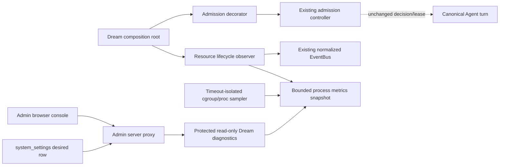

<!--
[Input] 2026-08-27 Claude Agent resource-admission diagnosis and the requested Admin control-console contract.
[Output] Chinese architecture, interaction, security, sequence, migration, test, rollback, and task-ownership design.
[Pos] Admin design source for the Dream Claude Agent resource observer console; it does not authorize deployment or runtime process control.
[Sync] 2026-08-27: completed read-only diagnosis and passed the pre-implementation design review with live AutoDL evidence blocked.
-->

# Dream Claude Agent 资源 Observer 与 Admin 控制台设计

## 1. Goal、任务账本与 Optimized Prompt

Codex Goal：在不修改 Dream Agent/Claude Agent 核心业务模块和基础设计模式的前提下，通过既有观察者模式实现 Claude Agent 资源观测，并在 Admin 建立受 RBAC 和审计保护的阈值配置与运行监控控制台。

| 子任务 | 负责人 | 仓库/目录 | 文件所有权 | 状态 | 已有测试 | 阻断 |
|---|---|---|---|---|---|---|
| Dream observer | `dream_diagnosis` | `/Users/dmeck/project/ink-dream-memory` | Dream observer、diagnostics、只读 route、Dream tests/docs | 设计通过，未实现 | admission/thread-factory 75 passed | 无 AutoDL SSH/PID/cgroup 实时证据 |
| Admin console | `admin_diagnosis` | `/Users/dmeck/project/ink-admin-memory` | 专用策略 API、proxy、页面、RBAC migration、Admin tests/docs | 已实现并验证 | focused 14 passed；Admin 全量 418 passed；typecheck/lint/build passed | 本机 PostgreSQL 未运行；跨服务 secret 尚未部署 |

本轮 copy-paste ready Optimized Prompt：

```text
你是一名资深 Claude Agent Observer/EventBus、FastAPI、PostgreSQL、Next.js、
Linux cgroup v2 与 Admin 控制台工程师。先只读证明
CLAUDE_AGENT_CAPACITY_EXHAUSTED 和 CLAUDE_AGENT_MEMORY_PRESSURE 的触发链、
配置、作用域及 lease 释放；再仅通过既有 Observer、normalized EventBus、
公开 admission diagnostics 和 composition root 增加 content-free 观测。

不得修改 Agent Service、Runner、状态机、turn/session/resume/cancel/SSE、
准入算法或 lease；不得读取私有集合/锁、解析正文、复制状态机、monkey patch，
也不得增加 Shell、kill、restart 或关闭资源门禁能力。

Admin 使用专用固定 DTO 复用 system_settings、system.read/system.write、Origin、
事务和审计；区分 default/env/desired/effective/applied/restart-required。
浏览器只访问 Admin；Admin 以服务端固定 base URL 和专用 bearer secret 代理
Dream 只读 diagnostics，不转发 Cookie，不回显 secret。Dream 不写数据库 schema。

完成中文架构、交互、Mermaid、自审后才实现；Observer 与 sampler 失败必须隔离，
测试覆盖 denial、turn 终态、lease、cgroup/proc 缺失、鉴权、隐私、RBAC、Origin、
审计、stale、自动刷新取消、typecheck/build 和 Chat/SSE/cancel/resume 回归。
未取得当前 AutoDL PID/cgroup/env/log 时不得声明生产验收完成。
```

## 2. 问题定义与实测边界

`CLAUDE_AGENT_CAPACITY_EXHAUSTED` 是单 backend 进程内的并发门禁；`CLAUDE_AGENT_MEMORY_PRESSURE` 是启动 Claude 子进程前的 host/cgroup 内存门禁。两者均为 retryable，并在 Runner 创建前结束请求。

当前代码默认值：最大并发 1、单 turn 预算 512 MiB、保留 128 MiB、retry 60 秒。AutoDL projector 明确移除前三项覆盖，因此静态投影预期仍为 `1/512/128/60`；本机 `backend/.env` 文件值为 `1/416/128/60`，但本机没有运行中的 Dream，不能称为 effective。

用户旧日志可复算：`required=671,088,640`（640 MiB），raw headroom 77.508 MiB，加 reclaimable 377.759 MiB，effective 455.266 MiB，短缺 184.734 MiB，因此该次必然是 cgroup memory denial。当前工作区没有 AutoDL `platform.env`/SSH 目标，本机为 macOS 且无 `/proc`/cgroup；PID、`memory.current/max/stat/events` 和当前远端 env 仍是明确阻断，旧日志不是本轮实时采样。

## 3. 当前准入算法与两类错误

```text
capacity: active_runs >= max_concurrent_runs
required: (run_memory_budget_mib + memory_reserve_mib) * MiB
raw:      max(0, memory.max - memory.current)
reclaim:  inactive_file + slab_reclaimable
effective:min(memory.max, raw + reclaim)
memory:   known host MemAvailable < required OR known effective < required
```

capacity 先判断且不触发新内存采样；memory 只有通过 capacity 后才采样。指标全部不可用时，现有语义退化为 concurrency-only；本任务不改变它。Dream effective 来源 `INK_AGENT_SWEEP_INTERVAL_S` 同时是 sweeper interval 与 retry hint；operator 交接投影使用部署层键 `AUTODL_AGENT_RETRY_AFTER_SECONDS`。UI 必须披露该映射，不能伪装成独立动态字段。

`active_runs`、两类 denial 累计和最近采样均是单 Controller、单 Python 进程/uvicorn worker内存值，重启归零，不是 Redis/数据库历史或集群全局值。现有 AutoDL 合同为单 worker；未来多 worker 时每个 worker 独立门禁。

lease 在 factory `finally` 幂等释放，覆盖完成、失败、setup 异常、cancel、stop、close、aclose；75 个 focused 回归通过，未发现 lease 泄漏。硬退出会同时清空进程内 set；永久挂起表示真实 turn 仍活跃。

## 4. Observer/EventBus 现状与目标扩展

现有 `SessionObserverRegistry` 支持注册/注销并吞掉普通 Observer 异常；现有 Dream Observer 已证明可在 `on_after_context_assembly` 对同一 normalized EventBus 建独立 reader。`NormalizedAgentTurnClassifier` 用 `message-final + first finish` 区分 completed/failed/cancelled，必须复用，不能仅看 `finishReason`。

缺口是 admission 发生在第一个 hook 之前，denial 无法被现有 Observer 看见；hook 也没有 turn outcome。目标扩展：

- composition root 注入一个兼容既有 `try_acquire/config/stats` 的 admission decorator，只记录 grant/两类 denial/最近时间并原样返回 lease 或异常；不改判定、阈值和释放。
- 资源 Observer 在 hook 内只执行常数时间 subscribe/task handoff；reader 在旁路消费 normalized terminal，复用 classifier，只累计 content-free outcome。
- sampler 独立、超时、有界、异常隔离；读取 host/cgroup 和 `/proc`，不访问 Agent 私有 pool/set/lock。
- diagnostics snapshot 使用原子副本；不保存或返回 Thread/Session ID、正文、prompt、transcript、文件、argv、env 全集或凭据。

禁止修改：Dream `service.py`、Runner、`thread_pool.py`、`thread_factory.py`、EventBus terminal/replay、Chat router、resume/cancel/SSE，以及 admission `try_acquire/_release` 算法。

## 5. 目标 Observer 架构与配置投影



当前没有安全动态配置接口。v1 仅由 Admin 保存 desired；Dream effective 仍由进程启动时的 `AgentAdmissionConfig.from_env()`/composition root 决定。页面显示 `pending` 和 `restartRequired=true`，部署人员通过既有安全配置投影后执行受控重启；控制台不提供重启按钮或远程命令。Dream 不在 admission、Runner、ThreadFactory 或状态机查询数据库。

跨服务合同冻结为：Admin server 读取 `DREAM_DIAGNOSTICS_BASE_URL`，以专用 `DREAM_DIAGNOSTICS_TOKEN` 调用 Dream；Dream 只读取对应专用 `INK_AGENT_DIAGNOSTICS_TOKEN` 并使用恒时比较。浏览器不直连 Dream，不转发 Admin Cookie/Authorization；token 不写数据库、不回显、不记录。缺配置时 diagnostics proxy fail closed 为明确 unavailable，但不影响 Agent。

## 6. 资源策略数据模型与 desired/effective

复用现有 `system_settings` 单行：`category=claude_agent`、`key=resource_policy`、`is_secret=false`。固定 JSON DTO：

```json
{
  "schemaVersion": 1,
  "revision": 3,
  "maxConcurrentRuns": 1,
  "runMemoryBudgetMib": 512,
  "memoryReserveMib": 128,
  "retryAfterSeconds": 60
}
```

写入使用 strict Zod、整数有界值、`SELECT ... FOR UPDATE`、revision 单调递增、同事务 upsert 与审计。不得接受未知字段、0 并发、无限值、负保留或任意 JSON。`applied` 仅当四个 desired 数值与 Dream effective 数值全部相等；Dream 不可达时为 `unknown`，绝不把 desired 当 effective。环境列只显示四个 allowlisted 变量的 `set/default` 和解析后数字，不显示原始环境或其他变量。

## 7. Dream 运行指标 DTO

DTO 包含：scope/instance start time、active/max；turn started/completed/failed/cancelled；capacity/memory denial；最近拒绝类型/时间；Claude 子进程 count/total RSS；backend status；host available；cgroup current/max/raw；inactive_file/slab_reclaimable/effective；required；`memory.events` low/high/max/oom/oom_kill；最近 admission 是否允许及其时间（明确是 observation，不是旁路决策）；sampledAt/ageSeconds/stale/errors。

所有计数均为“当前进程启动以来累计”，active/内存/子进程为最新实时样本，desired 为数据库持久值。v1 不创建数据库历史；没有可靠持久化指标能力，因此不实现一小时趋势图。

默认采样建议 5 秒，Admin 刷新 10 秒，Dream sample 超过 15 秒标 stale。页面卸载/切换用 React Query `signal` 取消；Dream fetch 超时 3 秒。数值缺失显示“不可用”，不显示 0。

## 8. Admin 页面信息架构

路由 `/admin/system/claude-agent-resources`，系统治理导航仅对 `system.read` 可见；服务端仍重复授权。页面由四区组成：

1. 状态条：Dream reachable/backend status、sample time/stale、instance scope、重启清零说明。
2. 准入卡：active/max、最近是否允许、required/effective、最近 denial 与累计。
3. Linux 资源表：host、cgroup current/max/raw/reclaimable 分项、memory.events、Claude child count/RSS；缺失字段逐项降级。
4. 策略表单：default、env、desired、effective 四列；revision/updatedAt/applied/pending/restart required；只有 `system.write` 显示保存，保存前确认“仅保存期望配置，不会重启或立即改变运行中 Agent”。

Dream 不可达：保留上一份浏览器缓存但顶部红色 unavailable，按 sample age 显示 stale；无缓存则所有 runtime 值为 unavailable。数据库或 Admin auth 数据不可用时，RBAC 身份无法可信建立，GET/PATCH 整体 fail closed 并返回明确 503；不得绕过数据库授权边界去获取或展示新的 Dream snapshot。浏览器只可保留 React Query 已有缓存并明确标记刷新失败。任何写入失败全部回滚。

## 9. RBAC、Origin、审计与 migration

- GET policy/monitor 要求 `system.read`；PATCH 要求 `system.write`。
- PATCH 在解析 body 前后都不信任客户端权限；使用现有 admin session guard。
- PATCH 必须执行现有 `assertAdminMutationOrigin`；GET 不产生 mutation。
- 审计 before/after 只含四个整数、revision、状态；metadata 只含 requestId/result，不含 token、header、URL query、env 或 Dream payload。
- 写入与 success audit 同一事务；audit 失败则策略不提交。denied/validation failure 走现有安全错误与必要审计规则。

策略表已经存在，资源字段不需要 schema migration。但当前 bootstrap canonical permissions 已移除 `system.read/system.write`，而旧 migration 的角色授权可能在首次 bootstrap 前执行并写入 0 行。需要一个最小前向 **RBAC 数据 migration**：幂等 upsert 两权限，并授予 super_admin/operator 读写、auditor 只读；同时修复 bootstrap 供未来新库。没有新表、列、索引或 Dream migration。

## 10. 完整业务时序

```mermaid
sequenceDiagram
  participant U as Agent request
  participant A as Admission decorator
  participant C as Existing controller
  participant O as Resource observer
  participant E as EventBus
  participant T as Existing turn
  participant S as Sampler
  participant D as Dream diagnostics
  participant M as Admin API
  participant P as PostgreSQL

  U->>A: try_acquire
  A->>C: unchanged try_acquire
  alt capacity denial
    C-->>A: CAPACITY_EXHAUSTED
    A->>O: content-free denial
    A-->>U: unchanged retryable error
  else memory denial
    C-->>A: MEMORY_PRESSURE
    A->>O: content-free denial
    A-->>U: unchanged retryable error
  else admitted
    C-->>A: unchanged lease
    O->>E: subscribe off-path
    U->>T: existing start/resume
    alt completed
      E-->>O: message-final + finish
    else failed
      E-->>O: finish(error)
    else cancelled
      E-->>O: finish(cancelled)
    end
    T->>C: existing finally release lease
  end
  loop bounded sampling
    S->>S: host/cgroup/proc with timeout
    S-->>D: atomic safe snapshot
  end
  M->>D: bearer-protected GET
  D-->>M: whitelisted DTO
  alt Dream unavailable
    M-->>M: mark unavailable/stale
  end
  M->>P: system.read desired
  alt database unavailable
    P-->>M: 503; no fabricated desired
  end
  M-->>M: compare desired/effective
  M->>P: system.write PATCH + row lock
  P->>P: update + audit transaction
  M-->>M: pending/restart required
  Note over M,T: deployment projection + controlled restart occurs outside console
  Note over D,M: abnormal Dream exit makes old sample stale; process counters reset on restart
```

## 11. 安全与隐私边界

返回白名单数值/枚举/时间戳和有界错误码。严禁用户消息、transcript、prompt、Thread/Session ID、文件内容、环境变量全集、完整命令行、Token/Cookie/Authorization、DSN 或堆栈。Claude 子进程通过 `/proc` PPid 后代关系和可验证 executable identity 聚合；识别失败返回 unavailable，不读 cmdline 猜测。Admin/Dream 日志不得记录 bearer secret 或 diagnostics body。

Admin/Dream 任一不可达不影响 Agent；Observer、reader、sampler、Admin proxy 任一异常不进入 turn 主路径。队列满时丢弃观测并增加 dropped counter，不能反压 Agent。

## 12. 测试矩阵

- Dream：Observer 注册/注销、异常/慢 sink 隔离；start/completed/failed/cancelled；两类 denial；lease 不受 observer 影响；原 admission 结果不变。
- Linux：cgroup v2 current/max/stat/events、`max`、缺文件、错误值、超时；host meminfo；`/proc` 缺失；child/RSS 聚合且不读 cmdline。
- Dream route：无/错 token 401/403，合法 token 200；DTO 闭集、无敏感 key；sample stale/unavailable。
- Admin domain/API：未登录 401；system.read/system.write；Origin；strict bounds/unknown fields；row lock/revision；desired/effective/applied；audit before/after 与失败回滚；Dream timeout/invalid DTO/unreachable。
- React：自动刷新、stale banner、unavailable、保存确认、无 write 权限、卸载 abort。
- 回归：Python unit；Claude Agent Chat/SSE/cancel/resume/error/admission；Admin focused tests、typecheck、lint、production build。

真实 AutoDL 验收还需只读采集目标 PID 的四项有效配置、cgroup current/max/stat/events、host MemAvailable、Claude child/RSS 和过滤后的 denial 日志；没有这些证据不得标 Goal 完成。

## 13. 设计自审

| 自审问题 | 结论 |
|---|---|
| 避免修改 Agent 核心业务逻辑、状态机、turn/resume/cancel/SSE？ | 是；全部列入禁止文件/语义 |
| 复用 Observer/EventBus，未复制状态机？ | 是；复用 registry、normalized bus、现有 classifier |
| 未读写私有运行集合/锁？ | 是；active/config 只读公开 stats/config |
| 未修改准入算法？ | 是；decorator 原样委托，既有 controller 仍唯一决策 |
| 配置通过公开对象/composition root？ | 是；v1 effective 仍是启动时 AgentAdmissionConfig |
| 复用 system_settings/RBAC/Origin/事务/审计？ | 是；专用固定 DTO，不恢复 generic CRUD |
| migration 必要且最小？ | 是；仅修复 RBAC 数据顺序，不改策略 schema |
| diagnostics 不泄漏业务/凭据？ | 是；显式 DTO 白名单和反向测试 |
| Admin/Observer 失败不影响 Agent？ | 是；无 Agent→Admin 调用，全部旁路隔离 |
| 无 Shell/kill/restart/关闭门禁/无限并发？ | 是 |
| 无无法验证的过度设计？ | 是；不做趋势历史/动态热更新/集群聚合 |
| 可独立回滚？ | 是；移除新 route/observer/console，保留无害 RBAC 权限 |

结论：核心约束全部通过，可以进入最小实现。生产完成状态仍受 AutoDL 实机证据阻断。

## 14. 回滚与已知风险

回滚 Dream：取消新 router 挂载、observer 注册和 composition decorator，回到原 controller/EventBus；不触碰 Agent 数据。回滚 Admin：隐藏导航/页面并移除专用 API；desired row可保留为无副作用审计记录，或经另一个显式受审计变更禁用。RBAC migration 为 additive，不回退已发布 migration。

风险：process-local 指标不是全局；capacity denial 的 memory 值可能是旧样本；retry 与 sweeper 共用变量；`/proc` identity 需 AutoDL 实证；服务 secret/base URL 尚待部署；本机 PostgreSQL与AutoDL均不可达。所有风险必须在页面/交付中明示。
