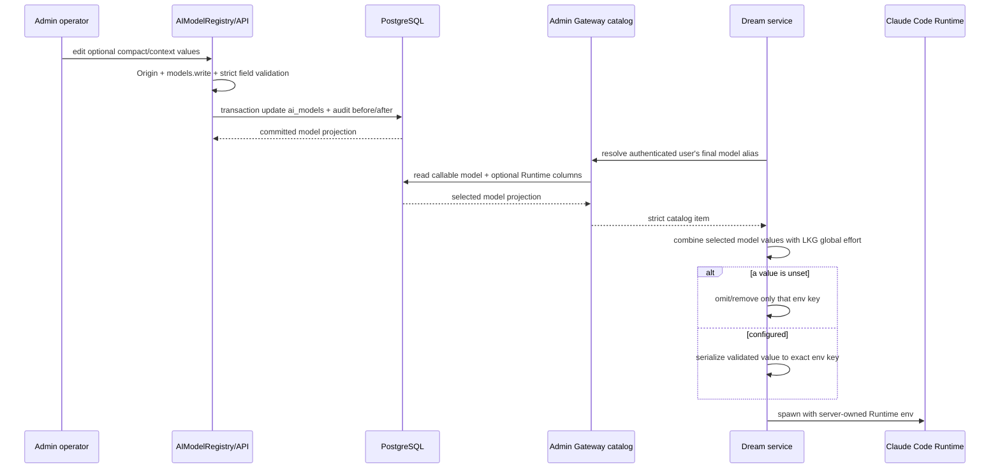
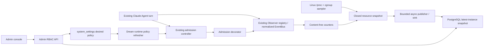
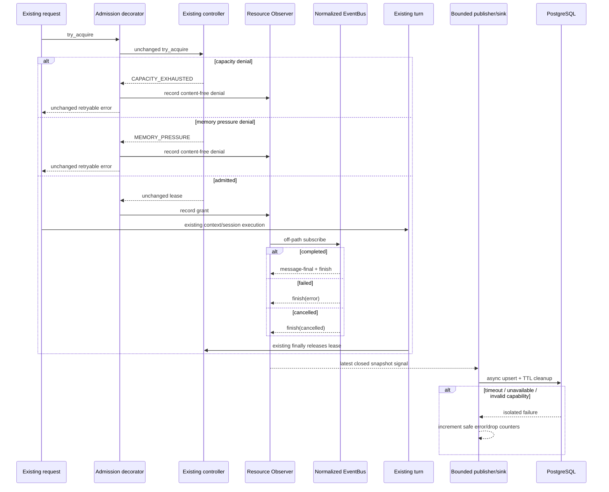

<!--
[Input] 2026-08-27 Claude Agent admission diagnosis, existing Observer/EventBus contracts, and PostgreSQL-only Dream/Admin synchronization requirements.
[Output] Chinese architecture, interaction, schema, security, sequence, validation, rollback, and ownership design for Claude Agent resource governance.
[Pos] Authoritative cross-repository design; Admin Drizzle owns schema, Dream owns content-free observation, and Admin never calls Dream diagnostics HTTP.
[Sync] 2026-08-28: add model-scoped Claude Code context controls and revisioned global effort policy with omit-when-unset Runtime injection.
-->

# Dream Claude Agent 资源 Observer 与 Admin 控制台设计

## 1. 背景与问题

Claude Agent 资源控制台用于维护准入策略并观察 Dream 的真实生效状态。现有实现的核心问题不是缺少更多控制，而是同一个页面没有稳定地区分“管理员想要的值”和“Dream 当前使用的值”，且历史硬编码、表单序列化与反馈方式会让合法策略被拒绝或看起来没有保存。

需要解决的产品问题有六类：

1. 已有 desired 再次编辑时，`schemaVersion/revision` 被误带进 strict PATCH，导致保存返回 400。
2. 16/8192/4096/3600 与 128/64/5 是无运行时证据的历史产品边界，合法的大值会被 UI、Admin API 或 Dream parser 拒绝。
3. 保存回调只等待缓存失效，PATCH 后短时间仍展示旧 desired/revision/updatedAt；effective 的异步收敛也缺少诚实状态。
4. 正常字段长期显示“仅限整数/无产品上限”等重复说明，原生 `confirm` 打断显式保存动作；API 400 又只显示全局错误。
5. 资源观察与策略写入必须继续满足 PostgreSQL-only、RBAC、Origin、审计、乐观锁与 fail-closed，不能为了修 UI 建立第二条 Dream HTTP、部署或进程控制通道。
6. Claude Code Runtime 的 effort、自动压缩窗口和最大上下文目前没有受控的 Admin 配置来源；若把它们继续放在进程环境、用户 Settings 或通用模型 `context_window/max_output_tokens` 中，会造成全局策略、模型能力和单次运行行为三种语义混淆，也无法保证“未配置即不注入”。

详细代码复现、历史边界和直接根因见附录 B。

## 2. 目标与边界

### 2.1 产品目标

- 管理员能保存四项完整 desired 策略，并立即看到 authoritative desired、revision 与 updatedAt。
- Dream effective 独立展示；保存后先进入 pending，只有 fresh snapshot 的 revision、四项 admission 值与全局 effort 都一致才进入 applied。
- 四项策略只保留跨 PostgreSQL JSONB、JSON 与 TypeScript 的真实精度边界，不设置任意产品 min/max，也不提供无限或关闭保护 sentinel。
- 无效输入紧邻字段反馈且不发 PATCH；可识别的 API 400 path 回填到字段，未知错误保留安全全局提示。
- 关键监控每 10 秒自动刷新；页面卸载后不再保留 timer 或在途 GET。
- 在 AIModelRegistry 的模型设置中分别维护可空的 Claude Code 自动压缩窗口和最大上下文 Token；在 Claude Agent 资源策略中统一维护可空的 effort level。
- Dream 根据服务端最终选中的模型和最近一次有效的全局 resource policy 组装 Runtime 环境；任一字段未配置时，对应环境变量完全不存在。

### 2.2 所有权与非目标

Admin 任务只拥有本仓库直接相关的设计、目录合同、既有 Drizzle schema/migration、API、RBAC/Origin/审计、React 页面和测试。Dream observer/provider/refresher 的合同对齐由 Dream task 负责；Admin 只读核对差异，不修改 Dream 文件。

本期不提供 AutoDL 投影、部署、restart、kill、Shell、关闭内存门禁、无限并发、用户/Thread 级 Runtime 覆盖、任意环境变量编辑器、跨实例总和或历史趋势。Admin 不直连 Dream diagnostics HTTP，不读取生产/远程状态，不执行生产 migration，不发布或推送。

### 2.3 Migration 判断

全局 effort 随既有策略保存在 `system_settings.value jsonb`，不需要独立列；四项 admission 数值也不需要改变存储类型。模型级两个 Runtime 数值与既有 `context_window/max_output_tokens` 语义不同，必须由 `ai_models` 的独立可空正整数列承载，因此需要 Admin Drizzle 新增前向 migration，并在所有 DDL 完成后发布精确 `dream.claude-code-runtime-config.v1` capability。Dream 只读取该 capability 和列，不创建 migration、不执行 runtime DDL。已进入历史的 `0039/0040` SQL、snapshot、journal 保持不可变，本任务不执行生产 migration。

## 3. 概念与规则

### 3.1 核心概念

| 概念 | 产品定义 |
|---|---|
| default | 代码内有限安全默认值；只用于没有可信 desired/effective 时说明基线，不代表当前运行值 |
| desired | Admin 已审计写入 `system_settings` 的完整 admission + 可空 effort 期望策略，包含 schemaVersion、revision、updatedAt |
| effective | 最新 fresh Dream snapshot 报告的当前 admission 与全局 Runtime 策略；只能由 Dream 应用并写回，Admin 不直接改写 |
| revision | desired 的单调递增乐观锁版本；编辑开始时冻结 expectedRevision，冲突返回 409 |
| pending | desired 有效，但 fresh effective 的 revision 或任一值尚未匹配 |
| applied | fresh effective 的 revision 与 desired revision 相等，且四项 admission 值和全局 effort 完全一致 |
| invalid | 存储策略或 snapshot 不满足 strict schema/技术边界；不得部分应用 |
| unavailable | 数据库/capability/可信 snapshot 不可用，无法证明应用状态 |
| not_configured | 没有 desired 行；Dream 继续使用有限 env/default，不解释为无限 |
| fresh | heartbeat age `<=20s`，可用于 applied/can-start 判断 |
| stale | heartbeat age `>20s` 且 `<=60s`；保留观测值但 can-start 强制未知 |
| offline | heartbeat age `>60s`；应用状态 unavailable，不能把旧 effective 当作当前事实 |
| last-known-good（LKG） | Dream 最近一次完整验证并成功应用的 effective；desired invalid、PG/capability 不可用时保持不变 |

### 3.2 校验与边界

- `maxConcurrentRuns`、`runMemoryBudgetMib`、`memoryReserveMib`、`retryAfterSeconds` 均为正安全整数，即 `1..Number.MAX_SAFE_INTEGER`。
- `0`、null、负数、小数、布尔、字符串、Infinity、非安全整数、partial object 与未知字段全部无效；任何值都不表示无限或关闭保护。
- 为保证 `required_headroom_bytes = (runMemoryBudgetMib + memoryReserveMib) * 1_048_576` 在 JSON/TypeScript 中精确，两项 MiB 合计不得超过 `floor(Number.MAX_SAFE_INTEGER / 1_048_576)`。
- 上述安全整数与组合内存是技术边界；16/8192/4096/3600、128/64/5 均不是产品边界，也没有保留资格。
- React 校验只用于即时反馈；Admin strict Zod 必须重复验证。Dream task 必须采用同一合同并在失败时保留 LKG。

### 3.3 Claude Code Runtime 配置规则

| 配置 | 所有权 | 合法值 | 未配置语义 | Runtime 投影 |
|---|---|---|---|---|
| Claude Code effort level | Claude Agent resource policy（全局） | `low`、`medium`、`high`、`xhigh`、`max` | 不设置 effort 环境变量 | `CLAUDE_CODE_EFFORT_LEVEL` |
| 自动压缩窗口 | AIModelRegistry（每模型） | PostgreSQL `integer` 可表达的正整数 | 不设置自动压缩窗口环境变量 | `CLAUDE_CODE_AUTO_COMPACT_WINDOW` |
| 最大上下文 Token | AIModelRegistry（每模型） | PostgreSQL `integer` 可表达的正整数 | 不设置最大上下文环境变量 | `CLAUDE_CODE_MAX_CONTEXT_TOKENS` |

- `context_window` 代表 Gateway 公开的模型上下文能力，`max_output_tokens` 代表单次上游输出上限；二者都不得复用为上述 Claude Code Runtime 字段。
- effort 枚举来自当前 Dream SDK `EffortLevel` 的真实合同，不增加自定义等级、默认值或任意 sentinel。页面使用带“未设置”选项的下拉框，不接受自由文本。
- 两个模型级数值只接受可被 PostgreSQL `integer`、TypeScript number、JSON 和 Python int 一致表达的正整数；不额外包装产品 min/max。空值写为 SQL NULL。
- Runtime env 只能由 Dream 服务端根据最终模型选择和 LKG 全局策略组装。浏览器请求、用户 `system_config.env_vars`、Deck、Plugin、workspace settings 和父进程同名变量均不是此配置的授权来源。
- Dream 在用户环境 overlay 之后应用精确三键白名单：已配置键覆盖非授权同名值，未配置键从显式 SDK env 中移除，使子进程回到 Runtime 自身行为，而不是注入空字符串、零值或代码默认值。
- resource policy 的新 revision 只有在 admission 与 effort 都完整验证后才整体替换；invalid/unavailable 保留最近一次有效 admission 和 effort。模型配置在每次服务端模型目录解析时读取当前 Admin PostgreSQL 投影；目录缺失 capability、字段非法或响应漂移时 fail closed，不启动该 turn。

### 3.4 周期与状态规则

- Dream sample/heartbeat 建议每 5 秒写入 latest-instance snapshot；Dream policy refresher 使用独立有界周期。
- Admin GET 每 10 秒刷新；React Query signal 传给 fetch，observer 卸载后取消 interval 与在途 GET。
- 保存成功先用 PATCH 回执投影 desired/pending，再显式 refetch active GET；这次 GET 重取 desired/revision/updatedAt，不能等待下一个 10 秒 tick。
- effective 只在后续轮询读到 Dream 写回后变化；不得以 desired 覆盖 effective 或提前显示 applied。

## 4. 信息架构与页面结构

页面路由为 `/admin/system/claude-agent-resources`，只保留策略、阈值与监控入口，按以下顺序组织：

1. 观测状态：online/stale/offline/unavailable、实例 epoch、进程启动、heartbeat/sample 时间与年龄、process scope。
2. 准入概览：active/max、can-start 三态、grant、capacity/memory denial 与最近拒绝。
3. 策略表：四项 admission 的 default/Admin desired/Dream effective；表下单独的“Claude Code Runtime”区域显示全局 effort 的 default（未设置）、desired、effective、application/desired/Dream policy 状态、revision/version 与更新时间。
4. Turn 与进程：started/completed/failed/cancelled、Claude child count/RSS。
5. Linux/cgroup：host、current/max、raw/reclaimable/effective/required 与 memory.events。
6. 观测管线：sample status/stale、queue dropped、write errors 与最近安全错误时间。

AIModelRegistry 仍沿用现有模型设置页面结构，只在 Token 上限之后增加“Claude Code Runtime”分区，包含“自动压缩窗口”和“最大上下文 Token”两个可空数字输入。空输入保存为未设置；列表卡片不常驻展示底层环境变量名，也不新增启动、同步、测试运行或其他动作。

正常字段下不显示常驻 helper。字段无效时才渲染与 input `aria-describedby` 关联的简短错误。保存按钮只在有有效草稿且拥有 `system.write` 时可用；保存中禁用输入、撤销与重复提交。页面不出现原生 `confirm/alert/prompt`。

页面文案只描述用户可判断的状态和下一步，不展示存储/传输实现细节。状态区标题使用“Dream 资源状态”；策略区说明使用“保存后将自动应用，无需重启”；pending 只说明 desired revision 已更新、当前 effective 尚未变化及完成后自动刷新。PostgreSQL、HTTP、部署管线和“控制台不提供某实现”等信息只允许出现在技术附录，不作为常驻页面文案。

## 5. 交互流程

### 5.1 读取、编辑与保存

1. 页面以 `system.read` GET 读取 policy contract、desired、latest runtime 与 application state。
2. form 只从 desired 显式 pick 四个数值字段和可空 effort；schemaVersion/revision 留作只读元数据。若无 desired，数值回退 effective/default，effort 回退 effective/未设置。
3. 第一次编辑冻结当前 revision；背景轮询发现 revision 变化时禁用保存并提示重新加载。
4. 客户端无效时显示字段错误且不发 PATCH；有效草稿点击显式保存后直接提交，不弹原生确认。
5. PATCH payload 再次显式 pick四项数值、可空 effort 并携带 expectedRevision。成功回执立即投影 desired/pending，随后显式 active GET 重取 authoritative metadata。
6. 10 秒轮询继续读取 effective；匹配后自动显示 applied。页面卸载时 query observer 取消 interval 与 GET signal。

### 5.2 错误与冲突

- 400 的公开 Zod issue 只按四个已知 path 映射；组合内存错误同时贴近 run/reserve。未知 path 不显示内部 details，只给安全全局错误。
- 401/403、409、数据库/capability/audit 失败使用全局错误；409 保留草稿但禁止覆盖新 revision。
- 刷新失败且已有缓存时继续展示上一份结果并明确“刷新失败”；没有缓存时展示不可用与重试入口。
- 模型设置保存遵循既有 `models.write`、Origin、事务与 before/after 审计；模型级 Runtime 数值非法时返回对应字段 issue，空值则清除该模型的投影。

```mermaid
sequenceDiagram
  participant U as Admin user
  participant UI as Resource console
  participant API as Admin API
  participant PG as PostgreSQL
  participant D as Dream refresher/observer

  UI->>API: GET projection (system.read)
  API->>PG: exact capability + desired + latest snapshot
  PG-->>API: DB-clock projection
  API-->>UI: desired/effective/revision/freshness
  U->>UI: edit admission fields and global effort
  alt invalid draft
    UI-->>U: field error, no PATCH
  else valid draft
    U->>UI: explicit save
    UI->>API: PATCH picked policy fields + expectedRevision
    API->>API: Origin + system.write + strict Zod
    API->>PG: advisory lock + capability + row lock
    alt revision conflict or audit/store failure
      PG-->>API: rollback
      API-->>UI: 409/503 safe error
    else committed
      PG-->>API: desired revision/updatedAt
      API-->>UI: authoritative desired
      UI-->>U: project desired + pending
      UI->>API: immediate active GET refetch
    end
  end
  loop Dream bounded policy interval
    D->>PG: read desired; validate admission + effort; retain LKG on invalid/unavailable
    D->>PG: write effective admission + effort revision in fresh snapshot
  end
  loop Admin every 10 seconds while mounted
    UI->>API: cancellable GET
    API-->>UI: pending or applied/stale/offline
  end
  U-xUI: leave page
  UI-xAPI: cancel interval and in-flight GET
```

模型级 Runtime 解析与单次 turn 注入时序：



完整 admission/Observer/sink 技术时序见附录 F。

## 6. 权限与审计

- GET 服务端必须验证 Session 与 `system.read`；PATCH 服务端必须验证 Session 与 `system.write`，Refine 按钮隐藏不构成授权边界。
- PATCH 在鉴权和数据库访问前验证 Origin；缺失、非法、与 request origin/显式 allowlist 不匹配均 403，不按部署环境名称放宽。
- 写事务顺序为 advisory lock → exact capability → `SELECT ... FOR UPDATE` → revision 比较 → settings upsert → success audit。任何一步失败全部 rollback。
- resource policy audit before/after 只记录 schemaVersion、revision、四个整数与可空 effort；模型审计记录两个可空 Runtime 数值及既有安全模型字段。两者都不记录 Token、Cookie、DSN、组装后的 env、snapshot 或业务正文。
- capability 缺失/漂移在任何 desired/audit 写入前 fail closed；Admin 不回退到 Dream HTTP、内存配置或未审计写入。

## 7. 可自动化验收标准

- 四项分别使用高于旧 16/8192/4096/3600 的合法正安全整数可以保存；已有 desired 的第二次保存 payload 仍只有四项值、可空 effort 与 expectedRevision。
- 四项的 0/null/负数/小数/非安全整数均被 UI 和 API 拒绝；run/reserve 合计越过精确 bytes 边界时两字段报错且不发 PATCH。
- 正常字段无“仅限整数/无产品上限”等常驻 helper；组件源码和浏览器流程均无 confirm/alert/prompt。
- 保存中只发一个 PATCH；成功后先看到新 desired/pending，并在下一次 10 秒 tick 前观察到显式 GET；effective 未匹配前保持旧值，Dream snapshot 更新后自动 applied。
- 可识别 API 400 path 紧邻对应字段；未知 path/DB/capability/auth/audit 错误只显示安全全局错误。
- GET/PATCH 分别证明 system.read/system.write、Origin、exact capability、409 乐观锁、同事务 audit rollback 与无 Dream HTTP。
- focused unit/API/schema tests、复用本机 Chrome 的 isolated PostgreSQL Playwright、typecheck、lint、production build 全部通过；记录每条命令、退出码与通过数量。
- AIModelRegistry 可保存 `262144` 等合法模型级数值并可清空；Admin catalog 对 Dream 返回当前选中模型的两项可空 Runtime 投影，缺失新 capability 时 fail closed。
- 全局 effort 可保存五个 SDK 支持等级或未设置；desired/effective/revision 按同一 resource policy 状态机收敛，invalid/unavailable 不覆盖 LKG。
- Dream turn 对已配置字段注入精确三键；未配置字段在最终 SDK env 中不存在，用户 env、Deck、Plugin 和浏览器请求不能覆盖。切换模型后下一 turn 使用新模型配置，无需重启 Dream。
- 不修改既有 0039/0040 SQL/snapshot/journal，不部署、发布、推送或执行生产 migration。

---

# 技术附录

## 附录 A：任务账本与执行边界

Codex Goal：在不改变 Dream Agent/Claude Agent 核心业务语义和基础设计模式的前提下，通过既有 PostgreSQL/provider/公开替换边界实现资源与 Claude Code Runtime 配置，并在 Admin 建立受 RBAC 和审计保护的配置与监控控制台。

| 子任务 | 负责人 | 仓库 / 目录 | 文件所有权 | 当前状态 | 阻断项 |
|---|---|---|---|---|---|
| Dream resource observer/runtime | Dream task | `/Users/dmeck/project/ink-dream-memory` | policy provider/LKG、effective snapshot、模型目录 DTO、server-owned Runtime env 注入、Dream tests/docs | complete；focused 与 Agent 语义回归通过 | 无；Dream 未执行 migration |
| Admin resource console/model registry | Admin task | `/Users/dmeck/project/ink-admin-memory` | Drizzle 0041/capability、模型 API/catalog、resource policy、React 页面、Admin tests/docs | complete；unit/typecheck/lint/build/isolated browser 全部通过 | 无；未执行生产 migration，0039/0040 保持不可变 |

Admin 独立任务记录：原始需求在既有资源治理上增加模型级 `CLAUDE_CODE_AUTO_COMPACT_WINDOW/CLAUDE_CODE_MAX_CONTEXT_TOKENS` 与全局 `CLAUDE_CODE_EFFORT_LEVEL`，未设置时不注入；负责人为 Admin Codex task；正式设计路径为 `/Users/dmeck/project/ink-admin-memory/docs/design/dream-agent-resource-observer-console.md`。文件所有权覆盖本 Admin 仓库直接相关设计、目录说明、Drizzle schema/0041 migration、模型 API/catalog、resource policy、权限/审计、页面与测试，不修改 Dream 文件，不部署、发布、推送或执行生产 migration。migration 判断为：全局 effort 继续使用 JSONB，无独立列；两个模型级字段需要 0041 additive columns 与精确 capability；既有 0039/0040、snapshot、journal 保持不可变。

本轮只做本地代码和隔离自动化验证；不连接远程服务器，不读取 AutoDL 状态，不改部署配置，不发布、部署、合并或执行生产 migration。上一版 `Admin -> Dream HTTP + Bearer` 与 AutoDL env 投影不属于目标架构，必须删除。

内部执行提示已统一为：先证明触发链与边界，再设计 PostgreSQL 单向观测和 desired/effective 交接；自审全部通过后才实现；双仓不得同时修改同一文件。

本轮 Optimized Prompt 记录：在既有资源 desired/effective 交接上增加全局 effort 与模型级 compact/context 配置，沿 Admin Drizzle/API/UI、认证模型目录和 Dream server-owned Runtime env 最短链路实现“未设置即不注入”；同时保留 RBAC、Origin、事务审计、LKG 和 Agent 核心语义，明确排除 AutoDL、远程连接、部署、生产 migration、任意 env 编辑器与状态机修改。完整原文保留在本 Codex Goal 的发起消息中。

本轮验证账本（以下均为本轮当前工作树结果，不沿用上一轮数量；敏感测试值以占位符表示）：

| 范围 | 命令 | 退出码 / 结果 |
|---|---|---|
| Browser preflight | `python3 .agents/skills/ink-admin-playwright-qa/scripts/preflight.py --json` | `0`；项目 runner 与本机 Chrome 可用；3000/5433 均为空闲，不下载 Chromium |
| Isolated PostgreSQL migration replay | `MIGRATION_DATABASE_URL=<isolated-DSN> pnpm db:migrate` | `0`；本轮自有 embedded PostgreSQL 应用 `0000..0041`，未执行生产 migration |
| Isolated migration status | `MIGRATION_DATABASE_URL=<isolated-DSN> pnpm db:migrate:check` | `0`；`42/42 current`，latest=`0041_claude_code_runtime_config` |
| Admin focused tests | `pnpm exec vitest run app/components/admin/claude-agent-resource-console.test.ts app/components/admin/AdminResourceManager.test.ts app/lib/admin/claude-agent-resources.test.ts app/lib/gateway/models.test.ts app/lib/db/claude-code-runtime-schema-contract.test.ts --reporter=verbose` | `0`；5 files、56 tests 全部通过 |
| Admin full unit | `pnpm test:run` | `0`；89 files、451 tests 全部通过 |
| Admin typecheck | `pnpm exec tsc --noEmit` | `0` |
| Admin lint | `pnpm lint` | `0`；ESLint 无错误 |
| Admin production build | `INK_ADMIN_E2E_DIST_DIR=.next-e2e-claude-runtime-final-20260828 NEXT_BUILD_CPUS=2 pnpm build` | `0`；DB package build、Next production compile/type/page generation 全部通过；独立 dist 已清理，未触碰用户 `.next` |
| Playwright harness attempt 1 | 与最终命令同一自有 3016/55428 lane | `1`；未显式设置 `INK_USE_TEST_DATABASE_URL=1`，应用安全守卫按设计返回 503，未进入业务断言 |
| Playwright harness attempt 2 | 与最终命令相同 | `1`；业务已到 effective=`high`，测试定位同时命中 `<option>` 与值段落；收紧为段落定位 |
| Playwright harness attempt 3 | 与最终命令相同 | `1`；资源业务已通过，模型分区使用 `fieldset/legend` 而非 heading；改用可访问 `group` 定位 |
| Isolated PostgreSQL Playwright | `PLAYWRIGHT_BASE_URL=http://127.0.0.1:3016 PLAYWRIGHT_BROWSER_CHANNEL=chrome TEST_DATABASE_URL=<isolated-DSN> ADMIN_BOOTSTRAP_E2E_TOKEN=<test-token> pnpm exec playwright test tests/e2e/claude-agent-resource-console.spec.ts --project=chromium --reporter=line --workers=1 --timeout=180000` | `0`；1/1 通过（18.0s）；资源大值/global effort/revision/pending/applied/桌面移动，以及 AIModelRegistry create/edit、两个 `262144` 保存、清空回 `NULL` 全部通过；自有数据库、端口、进程和产物已清理 |
| Dream Runtime focused | `PYTHONPATH=backend .venv/bin/python -m pytest -q backend/tests/test_sdk_env.py backend/tests/test_admin_gateway_models.py backend/tests/test_admin_gateway_model_selection.py backend/tests/test_claude_agent_resource_policy.py backend/tests/test_claude_agent_resource_diagnostics.py backend/tests/test_claude_agent_service.py` | `0`；90 passed、23 subtests passed |
| Dream Agent regression | `PYTHONPATH=backend .venv/bin/python -m pytest -q backend/tests/test_schema_capabilities.py backend/tests/test_server_claude_agent.py backend/tests/test_claude_agent_runner.py backend/tests/test_claude_agent_thread_factory.py backend/tests/test_claude_agent_admission.py backend/tests/test_claude_agent_resource_observer.py backend/tests/test_claude_agent_resource_postgres_sink.py` | `0`；303 passed、1 skipped、138 subtests passed；仅有仓库既有 FastAPI deprecation warnings |

`pnpm dev` 按现有安全协议只托管 PostgreSQL 与 Admin 应用，不隐式执行 Drizzle migration；本地自动化 harness 在启动隔离 Admin 前显式执行 `pnpm --filter @ink-memory/db migrate`。

## 附录 B：本地复现与诊断证据

资源控制台原实现同时存在保存反馈滞后、任意并发上限、重复说明和原生确认四类问题。2026-08-28 在 Admin 分支用只读 `git show` 与定向 `rg` 复核得到以下证据；这些是本地代码复现，不代表生产或 AutoDL 现状。

| 现象 | 本地证据 | 根因与设计决定 |
|---|---|---|
| 四项策略都有历史硬编码上下限 | `git show 22557a6^:config/claude-agent-resource-policy.ts` 显示并发 `1..16`；实施前诊断时 policy/Dream provider 显示内存预算 `128..8192`、保留量 `64..4096`、重试 `5..3600`；同版 UI 把 max 写入 `<input>`，领域 Zod 与 Dream parser 也重复 `.max(...)` | 这些值没有来自 admission 算法的不可缺少证据，不能包装为产品或技术边界。四项统一为正安全整数；删除 16/8192/4096/3600 与 128/64/5，拒绝 0/null/负数/小数/非安全整数/无限 sentinel |
| 未发现本业务其他 `<=100` 上限 | 对 console、API、policy、schema、两条 migration 和 focused tests 定向搜索 `<=16/100`、`.max(16/100)`、`max: 16/100`；当前 Admin 本业务路径无 100，仓库其他 100 命中属于分页、字符串或其他资源。Dream 测试中的并发 100 是样例值，不是上限 | 不修改无关资源，也不把无关 100 当成本业务缺陷 |
| 已有 desired 后再次保存返回 400 | 实施前 `desired.values` 同时含四项值、`schemaVersion` 和 `revision`；component 直接把整个对象 spread 进 form，`policyMutationPayload` 又 spread 进 PATCH，而服务端 mutation schema 是 strict 且只允许公开 policy 字段 + `expectedRevision` | 这是“策略无法保存”的直接根因。读取 desired 与构造 PATCH 时都显式 pick 四个 admission 字段和可空 effort；schemaVersion/revision 只作为投影元数据与乐观锁基准，不进入 mutation values |
| 保存后 desired 仍显示旧值 | `git show a82317c^:app/components/admin/ClaudeAgentResourceConsole.tsx` 显示旧 `onSuccess` 丢弃 PATCH 回执，只调用 `invalidateQueries` | PATCH 已返回 authoritative desired，但旧 UI 在后续 GET 完成前保留旧 cache。保存后先投影 PATCH 回执为新 desired/pending，再立即发起 active GET 重取 desired/revision/updatedAt；effective 保持旧值直至 Dream 写回 |
| `policy invalid` 不可操作 | 旧 response parser 直接透传英文服务端 message；领域只返回统一 `CLAUDE_AGENT_POLICY_INVALID` | UI 草稿逐字段给简短错误并阻止 PATCH；服务端仍 strict Zod，400 code 映射成简洁中文保存失败提示 |
| 保存出现浏览器原生确认 | 历史 component 的按钮调用 `window.confirm(...)` | 保存是显式主按钮且非破坏性操作，直接提交；本页面不得使用 `confirm/alert/prompt` |
| 字段下方长期重复解释 | 当前实现对每项常驻“仅限整数”，并对并发常驻“无产品上限” | 正常态不显示字段帮助；只在无效草稿时显示该字段的简短错误 |

校验链必须保持单一来源：`config/claude-agent-resource-policy.ts` 提供四项正安全整数、组合内存技术边界与 SDK effort 枚举；React 只做同合同的提前反馈；`claude-agent-resources.ts` 用 strict Zod 重复验证外部输入；PostgreSQL `system_settings.value` 以 JSONB 保存完整对象。四项数值都必须在 `1..Number.MAX_SAFE_INTEGER`；此外 `(runMemoryBudgetMib + memoryReserveMib) * 1_048_576` 必须仍是安全整数，因此两项 MiB 合计不得超过 `floor(Number.MAX_SAFE_INTEGER / 1_048_576)`。这是真实序列化边界，不是产品配额。策略没有独立 `integer/int4` 列，所以新增 effort 不需要策略列；模型级 Runtime 数值则必须使用 0041 独立 nullable integer 列，避免污染已有 Gateway 字段。`0039/0040` 保持不可变，本轮不执行生产 migration。

实施前的 Dream 只读交叉核对证明 admission 的真实语义下限为：并发 `>=1`、run memory `>=1`、retry `>=1`；当时底层 `AgentAdmissionConfig` 允许 reserve=0，会关闭系统保留量保护，且 Python parser 还接受 `10**30` 并发。最终共享合同因此采用四项 `>=1` 的正安全整数和组合内存精确边界，不能采用 Python 单端能力；Dream task 已完成同合同实现与 focused 回归。

`CLAUDE_AGENT_CAPACITY_EXHAUSTED` 与 `CLAUDE_AGENT_MEMORY_PRESSURE` 都在 Claude Runner 创建或 context assembly 之前由既有 admission controller 抛出，随后沿既有 normalized error/finish SSE 路径返回。两者不改变 HTTP route、session、resume、cancel 或 SSE 协议。

代码默认值与本机值：

| 配置 | 环境变量 | 代码默认 | 本机 `backend/.env` |
|---|---|---:|---:|
| 最大并发 turn | `INK_AGENT_MAX_CONCURRENT_RUNS` | 1 | 1 |
| 单 turn 内存预算 | `INK_AGENT_RUN_MEMORY_BUDGET_MIB` | 512 MiB | 416 MiB |
| 系统保留内存 | `INK_AGENT_MEMORY_RESERVE_MIB` | 128 MiB | 128 MiB |
| retry hint | `INK_AGENT_SWEEP_INTERVAL_S` | 60 s | 60 s |

进程环境未发现四项覆盖；服务用 `override=False` 加载 `.env`，因此真实进程环境若存在仍优先。本轮没有运行中的 Dream 进程，以上只能称为本地静态配置，不能称为生产或 AutoDL effective。

Admin desired 不对四项策略设置产品人为 min/max。有效值必须是正安全整数；`0`、null、负数、小数和 JavaScript 无法精确表达的非安全整数一律无效，任何值都不表示“无限”或关闭保护。两项内存值还必须满足 required-headroom bytes 的组合精确表达边界。

## 附录 C：架构、算法与数据合同

### C.1 当前准入算法与两类错误

现有算法必须原样保留：

```text
capacity_denied = active_runs >= max_concurrent_runs
required_bytes  = (run_memory_budget_mib + memory_reserve_mib) * 1024 * 1024
raw_headroom    = max(0, memory.max - memory.current)
reclaimable     = inactive_file + slab_reclaimable
effective       = min(memory.max, raw_headroom + reclaimable)
memory_denied   = known(host MemAvailable) < required
               OR known(cgroup effective) < required
```

判断顺序固定为 capacity 先、memory 后。capacity denial 不触发新内存采样；相等时允许；host/cgroup 任一已知值不足即拒绝；全部内存指标未知时保留既有 concurrency-only admission。本任务不增加预算预扣、不改变比较符、不调整 reclaimable 定义。

错误区别：

- `CLAUDE_AGENT_CAPACITY_EXHAUSTED`：当前单 controller 的活跃 lease 数已达到上限。
- `CLAUDE_AGENT_MEMORY_PRESSURE`：capacity 通过后，实时 host 或 cgroup 保守余量不足。

两者都设置 `retryable=true` 与同一个 retry hint。当前没有自动 retry/backoff/jitter；`INK_AGENT_SWEEP_INTERVAL_S` 同时被 Thread sweeper 使用，UI 和文档必须披露这一既有耦合。

### C.2 active run、累计值与 lease

`active_runs` 是单 `ClaudeAgentAdmissionController`、单 Python 进程、单 uvicorn worker 中活跃 session lease 集合的基数。它覆盖所有通过共享 factory 的普通 Chat、Dream launch 和 confirmation turn，不是 PostgreSQL、Redis 或集群全局值。

资源 Observer 的 grant/denial/turn outcome 累计均为当前 Dream 进程生命周期值，重启清零。数据库只保存最新快照中的当前累计值，不把跨重启累计伪装成同一 epoch。

lease 在 factory 唯一 `finally` 中幂等释放，覆盖完成、执行失败、context/setup 异常、cancel、stop、close 和 factory shutdown。正常业务路径未发现泄漏。已知风险是外部 terminal publish 或 Runner 永久挂起会延迟到达 `finally`；这表示 turn 仍未终结，不在本任务中修改 timeout 或状态机。

### C.3 Observer、EventBus 与公开扩展点

复用边界：

- `SessionObserverRegistry.register/unregister/aclose`；普通 Observer 异常被记录并吞掉。
- `on_after_context_assembly` 中公开的 normalized EventBus；hook 只做常数时间 task handoff。
- `NormalizedAgentTurnClassifier` 区分 completed/failed/cancelled，禁止复制第二套终态判断。
- admission decorator 原样委托 `try_acquire/config/stats`，只记录公开 grant/两类 denial；lease 原样返回。
- admission `stats()` 提供 process-local active/max 与最后资源信号；系统 sampler 只读 `/proc` 和 cgroup，不读 Agent 私有 pool/set/lock。
- composition root 是 admission config、运行期 policy refresher、observer、sampler、publisher 与 sink 的唯一组装点。

Observer hook 不等待 PostgreSQL、网络或采样。Observer 内部错误、EventBus reader 错误和 sink 错误都不得传播到 turn。

### C.4 PostgreSQL 同步架构



数据方向：

- Dream Observer/sampler -> 有界 publisher -> PostgreSQL 最新快照。
- Admin API -> PostgreSQL 读取快照；禁止请求 Dream diagnostics API。
- Admin API -> `system_settings` 写 desired。
- Dream 运行期 policy refresher 定时通过公开 provider 读取 desired，并把通过 capability 与边界校验的新 revision 动态应用到既有 admission controller。

策略刷新只沿 Dream 内部公开配置入口原子替换 effective config，不读取 controller 私有字段，也不提供远程 restart。Admin 保存后立即显示 pending；Dream 下次定时读取、应用并写回新 effective revision/values 后，页面自动收敛为 applied，全程无需重启。

### C.5 数据模型与 migration 判断

策略继续复用现有 `system_settings` 固定行：

```json
{
  "schemaVersion": 1,
  "revision": 3,
  "maxConcurrentRuns": 1,
  "runMemoryBudgetMib": 512,
  "memoryReserveMib": 128,
  "retryAfterSeconds": 60,
  "claudeCodeEffortLevel": "high"
}
```

`claudeCodeEffortLevel` 也可为 `null`，含义是最终 Runtime env 中不设置 `CLAUDE_CODE_EFFORT_LEVEL`。0041 对 `ai_models` 只做 additive expand：

```text
claude_code_auto_compact_window integer null check (> 0)
claude_code_max_context_tokens integer null check (> 0)
```

资源观测不能塞入 settings，也不能复用携带业务 aggregate 的通用 events，因此需要 Admin Drizzle 新增一个最小表：

```text
claude_agent_resource_snapshots
  instance_id         text primary key
  process_started_at  timestamptz not null
  heartbeat_at        timestamptz not null
  sampled_at          timestamptz null
  snapshot            jsonb not null
  created_at          timestamptz not null default now()
  updated_at          timestamptz not null default now()
  index(heartbeat_at)
```

`instance_id` 是每个 Dream 进程启动时生成的随机 UUID，不含 hostname、PID、Thread、Session、用户或业务 ID。`heartbeat_at` 与有样本时的 `sampled_at` 均由 PostgreSQL `CURRENT_TIMESTAMP` 产生；`process_started_at` 至多取数据库当前时间，避免 Dream/DB 时钟偏移破坏 freshness。每次写入只 upsert 当前 instance 行；同一写事务清理 heartbeat 超过 7 天的其他实例。因此历史有明确 TTL，不形成无界时序平台。Admin 默认选择 heartbeat 最新实例，并可明确显示 process scope。

Observer 关系与 `dream.claude-agent-resource-observer.v1` capability/version/hash 已由既有且不可变的 Admin Drizzle `0040` 发布。新的 0041 只新增模型列并发布 `dream.claude-code-runtime-config.v1`，其 hash 覆盖列名/类型/null/正数约束、effort 枚举、omit-when-unset 与 snapshot additive projection。Dream 不创建 migration、DDL、表或 fallback；Admin model catalog/resource GET/PATCH 与 Dream provider/catalog consumer 均验证新精确 capability，其中写操作必须在任何模型/desired/audit 写入前 fail closed。

`0039_claude_agent_resource_rbac` 已进入 journal，仅修复 `system.read/system.write` 角色授权，保持不可变。

### C.6 快照闭集与隐私

快照只包含：

- schema version、instance/process start、heartbeat、sample time、sample status/stale。
- scope=`process`、counters=`process_lifetime`、restart reset=true。
- defaults、effective、effective version、loaded desired revision/更新时间、policy load status。
- active/max、grant、capacity/memory denial、最近 denial 类型/时间。
- turn started/completed/failed/cancelled。
- Claude child process count/total RSS 与 available 标志。
- host available；cgroup current/max/raw；inactive_file/slab_reclaimable/effective；required。
- `memory.events low/high/max/oom/oom_kill`。
- `can_start_new_agent: true | false | null`；样本不新鲜或无法确定时必须是 null。
- publisher/sink 的安全闭集健康值，例如 dropped/write error count；不含异常文本或 DSN。

严禁写入或返回 Thread ID、Session ID、actor/user ID、消息、prompt、transcript、文件内容、Token、Cookie、Authorization、DSN、完整 env、完整 argv、hostname 或 PID。Admin 必须用 strict schema 剥离未知 JSON 字段。

### C.7 desired / effective 与 fail-closed

Dream policy provider 在 composition root 启动后由有界运行期 refresher 定时读取：

- capability 与 policy 均有效且 revision 更新：通过 admission controller 的公开配置入口动态应用完整 desired，记录 `applied` 和 revision。
- policy 行不存在：启动阶段使用通过 Admin 同一上下界验证的有限 env config；越界则使用代码默认，记录 `not_configured`；运行中不得把缺失行解释成无限制配置。
- policy JSON/边界无效：保留当前 last-known-good effective；若启动时尚无 effective，则保留上述有限 fallback，记录 `invalid`。
- PostgreSQL/capability 不可用：保留当前 last-known-good effective；若启动时尚无 effective，则保留上述有限 fallback，记录 `unavailable`。

任何异常都不得产生无限并发、零预算或关闭内存门禁。最大并发只接受明确的正整数，不使用无限 sentinel。运行中 PostgreSQL 失联或 capability 漂移时 controller 的既有 effective 对象不变；refresher 后续成功即可继续从更高 revision 收敛，sink 恢复后继续 upsert。

Admin 展示状态：

- `applied`：desired admission + effort 与最新 fresh snapshot effective 完全一致，且 effective revision 等于 desired revision。
- `pending`：desired 有效，但 fresh snapshot 仍是旧 revision/值。
- `invalid`：存储策略不满足 closed schema/bounds；不把它投影给 Dream。
- `unavailable`：数据库 capability/快照不可可信读取，或没有 fresh Dream heartbeat。
- `not_configured`：没有 desired 行，Dream 运行有限 env/default config。

### C.8 非阻塞 sink 与心跳

publisher 每 5 秒取得一个 immutable closed DTO 并以 `put_nowait` 写入容量 1 的 latest-value queue；队列满时以新快照替换旧快照并累计 dropped，不反压 Observer 或 turn。单独 worker 通过 `asyncio.to_thread` 使用既有 psycopg 连接边界，外层 timeout，SQL 设置局部 statement timeout。驱动线程超时后仍由该 worker 串行收敛，完成前不启动下一次 driver call，防止旧快照晚到覆盖新快照；Agent 主路径和 Observer hook 均不等待它。失败只记录固定错误码/计数，不记录连接字符串或 payload。

启动首样本允许 `sampled_at=null`；SQL 必须将该参数显式 cast 为 `timestamptz`，否则 PostgreSQL 无法为 null bind 推断类型并产生一次虚假 write error。有样本后 `sampled_at` 仍使用 DB clock，不信任 Dream 墙钟。

建议时间合同：sample 5 秒、heartbeat 5 秒、DB write timeout 1 秒、Admin refetch 10 秒、heartbeat 超过 20 秒 stale、超过 60 秒 offline；Dream policy refresh 使用独立、有界且可配置的运行期周期。Admin 用数据库当前时间计算年龄，避免信任浏览器时钟。Dream 异常退出后不再更新 heartbeat，旧行自然 stale/offline；下次进程以新 instance UUID 和清零计数启动。

## 附录 D：页面字段明细

路由保持 `/admin/system/claude-agent-resources`，分为：

1. 状态条：Dream backend `online/stale/offline/unavailable`、实例 epoch、heartbeat/sample 时间与年龄、process scope/重启清零说明。
2. 准入概览：active/max、can-start 三态、grant、两类 denial、最近 denial。
3. turn 累计：started/completed/failed/cancelled。
4. Linux 资源：host/cgroup/raw/reclaimable 分项/effective/required、memory.events、Claude child count/RSS。
5. 策略表：四项 admission 与单独的 Claude Code Runtime effort 区域共同展示 default、Admin desired、Dream effective、revision/version、更新时间、applied/pending/invalid/unavailable；主操作只在有效草稿变更后可用，无效整数/枚举不发 PATCH；正常字段下不常驻“仅限整数/无产品上限”等重复说明；保存成功立即投影新 desired/pending 并主动重取 authoritative metadata。
6. 观测管线：sample status、sink dropped/write errors；只显示安全数字与枚举。

字段缺失显示“未知/不可用”，不能显示 0；`can_start_new_agent=null` 显示“未知”，不能显示“拒绝”。保存按钮只对 `system.write` 可见/可用；页面不提供 Shell、kill、restart、部署或关闭门禁按钮。

## 附录 E：安全实现细则

- GET 要求服务端 `system.read`；PATCH 要求服务端 `system.write`。
- PATCH 必须先验证 Origin；缺失、错误或 allowlist 不匹配一律 403，不按 `NODE_ENV` 放宽。
- body 使用 strict Zod；四项数值都接受正安全整数且不设产品 min/max，effort 只接受 SDK 五值或 null；拒绝未知字段、数值 0/null/负数/小数/无法精确传输的非安全整数、无限值与 partial policy；run/reserve 合计还必须保证 required-headroom bytes 精确。UI 同样提前阻断无效草稿且不发 PATCH，但客户端校验不替代服务端边界。
- 400 `CLAUDE_AGENT_POLICY_INVALID` 保留 Zod issue details；客户端只识别四个公开字段 path，并映射为紧邻字段的安全短错误。无法识别的 path、数据库/capability/auth/audit 错误只显示全局安全错误，不把原始内部 details 放进 UI。
- UI 在第一次编辑时冻结 `expectedRevision`；轮询发现 revision 变化即禁止覆盖并提示刷新。PATCH 携带该基准 revision；事务中 `SELECT ... FOR UPDATE` 后不匹配返回 409，防止两个管理员互相覆盖。
- revision、settings upsert 与 success audit 在同一数据库事务；audit 失败则全部 rollback。
- resource policy audit before/after 只含四个整数、可空 effort、schemaVersion、revision；模型 audit 保存两个可空 Runtime 数值，不含 request headers、Token、组装后的 env 或 snapshot。
- 未登录、权限不足、Origin 错误、数据库不可用、capability 漂移全部 fail closed。

## 附录 F：完整技术时序

### F.1 准入、生命周期、lease 与异步写入



### F.2 采样、Admin 读取、desired 写入与运行期动态应用

```mermaid
sequenceDiagram
  participant S as Linux sampler
  participant Q as PG publisher
  participant P as PostgreSQL
  participant M as Admin API
  participant UI as Admin page
  participant C as Dream policy refresher
  participant A as Existing admission controller

  loop every 5 seconds
    S->>S: read host/cgroup/proc with timeout
    S-->>Q: safe sample or unavailable
    Q->>P: upsert instance snapshot/heartbeat
  end
  UI->>M: GET monitor
  M->>M: require system.read
  M->>P: read desired + latest snapshot + DB age
  P-->>M: rows
  M-->>UI: applied/pending/stale/offline DTO
  UI->>M: PATCH desired + expectedRevision
  alt unauthorized or bad Origin
    M-->>UI: 401/403, no write
  else valid writer
    M->>P: exact capability + row lock + revision + audit transaction
    alt DB/audit failure
      P-->>M: rollback
      M-->>UI: fail closed
    else committed
      M-->>UI: authoritative desired pending
      UI->>M: immediate GET desired/revision/updatedAt
    end
  end
  Note over UI,C: Admin never restarts or controls Dream
  loop bounded runtime policy interval
    C->>P: exact capability + desired read
  end
  alt valid newer desired
    C->>A: atomically apply validated config
    C->>P: publish new effective revision/values
  else invalid/unavailable/not configured
    C->>A: retain last-known-good bounded config
  end
  alt desired revision matches fresh effective
    M-->>UI: applied
  else Dream stopped heartbeat
    M-->>UI: stale then offline; can-start unknown
  end
  Note over UI,M: 10 秒轮询由 query observer 管理；页面卸载时取消 interval 与在途 GET
```

## 附录 G：数据库不可达与异常退出

- Dream 已运行且 PostgreSQL 变慢/离线：sink/refresher timeout 或 drop；Agent admission、lease、turn、SSE 不受影响；effective 保持 last-known-good 对象，恢复后继续定时收敛。
- Dream 启动加载 desired 失败：使用有限 env/default config 并上报 unavailable；既有数据库启动 capability gate 仍可按仓库合同阻止不兼容 schema，运行期 refresher 成功后可动态应用有效 desired。
- Admin 数据库不可达：身份/RBAC/desired/snapshot 均不可可信，GET/PATCH 返回 503；不能绕过数据库去请求 Dream。
- Dream 异常退出：快照行保留，heartbeat age 进入 stale/offline；`can_start_new_agent` 强制 null。
- Observer、sampler 或 sink 异常：只影响健康计数/新鲜度，不影响 Agent。

## 附录 H：测试矩阵

Dream：

- Observer register/unregister、普通异常隔离、normalized completed/failed/cancelled。
- 两类 denial、grant、Observer 失败不改变异常/lease。
- context/setup failure、cancel/stop/close/aclose 的 lease 释放；Chat/SSE/resume 回归。
- cgroup current/max/stat/events、`memory.max=max`、`/proc`/cgroup 缺失、Claude descendant/RSS 聚合。
- publisher queue 容量、latest replacement、DB timeout/slow/unavailable、capability missing/drift、启动 `sampled_at=null` 类型、upsert/TTL、字段隐私。
- policy provider valid/missing/invalid/unavailable；运行期周期、revision 去重、动态应用与 last-known-good 保留；既有 env/default 始终有限。
- 五个 effort 枚举与 null、模型级两个可空正整数、严格 catalog DTO、选中模型切换、三键白名单、未设置键移除、用户/Deck/Plugin 同名值不可覆盖。

Admin：

- 未登录、`system.read`、`system.write`、缺失/错误 Origin。
- 四项分别使用高于旧 16/8192/4096/3600 的较大合法值成功保存，并覆盖已有 desired 的第二次编辑只提交四项值、可空 effort + expectedRevision；0/负数/小数/非安全整数、组合内存 bytes 非安全、unknown fields、expected revision conflict、before/after audit、同事务 rollback。
- GET/PATCH capability missing/drift；PATCH 在同一事务的任何 desired/audit 写入前 fail closed；policy invalid、snapshot absent/fresh/stale/offline、DB unavailable。
- desired/effective applied/pending/invalid/unavailable 与 `can-start=null`。
- React 10 秒刷新、query signal、卸载取消、无 write 权限、显式直接保存、无草稿/保存中禁用、按钮对比度、无常驻整数/产品上限提示、无原生 confirm/alert/prompt、保存后立即 desired/pending 并主动 GET 重取、轮询 applied、390px 无水平溢出。
- Drizzle generate、snapshot/capability contract、空库 replay、重复执行、partial drift/concurrent migrator（仅明确隔离数据库）。
- AIModelRegistry 两个独立可空字段的 create/update/clear、字段错误、before/after audit；Gateway catalog 精确投影且 capability missing/drift fail closed。
- resource policy effort 五值/null、desired/effective/pending/applied、revision conflict、LKG 和 additive 旧快照兼容。
- TypeScript、DB package typecheck、lint、focused tests、全量 unit、production build。

本地 mock/fixture 只能称为技术验证，不能称为生产或 AutoDL 实测。

## 附录 I：设计自审（14 项）

| # | 问题 | 结论 |
|---:|---|---|
| 1 | 是否明确双仓所有权？ | 通过；Admin 独占 Drizzle/model/API/UI，Dream 独占 provider/catalog consumer/Runtime env；两仓不修改同一文件 |
| 2 | 是否复用 Observer/EventBus 与公开扩展点？ | 通过；registry、normalized bus、现有 classifier 为唯一生命周期事实，不读私有 pool/set/lock |
| 3 | 是否复制或改变 Agent 状态机？ | 通过；不复制状态机，不改变 turn、resume、cancel、SSE、lease 与准入判断顺序 |
| 4 | Observer/数据库失败是否影响 Agent？ | 通过；hook 不做 I/O，queue 有界，worker timeout 隔离，last-known-good effective 保留 |
| 5 | 是否复用现有数据边界？ | 通过；全局策略只经 PostgreSQL provider，模型配置复用已认证 Admin Gateway catalog；无 Admin->Dream diagnostics/control HTTP |
| 6 | schema 与 migration 判断是否正确？ | 通过；Admin Drizzle 是唯一 DDL owner；global effort 使用 JSONB，模型级独立字段由 additive 0041 + exact capability 发布，0039/0040 不变 |
| 7 | 四项策略是否移除任意产品 min/max？ | 通过；都只接受正安全整数；内存合计只受 required-headroom bytes 精确表达边界；拒绝 0/null/负数/小数/非安全整数，不定义无限/关闭保护 sentinel |
| 8 | 页面信息架构与文案是否克制？ | 通过；资源页新增单独 Runtime effort 区，模型页新增两字段分区；不增加环境变量编辑器、手动同步、AutoDL、restart、kill 或关闭门禁 |
| 9 | 表单反馈是否简洁且可访问？ | 通过；正常态无“仅限整数/无产品上限”常驻提示；客户端与可识别 API 400 path 都只在对应字段关联简短错误，未知错误留在全局 |
| 10 | 保存交互是否原生且防重复？ | 通过；显式按钮直接提交，无 confirm/alert/prompt，保存中禁用提交与输入 |
| 11 | desired/effective 是否诚实刷新？ | 通过；PATCH 后立即投影并 GET 重取 desired/revision/updatedAt；effective 仅由 10 秒轮询 fresh snapshot 收敛，卸载取消 interval/GET |
| 12 | 权限与请求边界是否 fail closed？ | 通过；GET=`system.read`，PATCH=`system.write`，Origin 缺失/非法/不匹配均拒绝，capability 漂移返回 503 |
| 13 | 并发与审计是否原子？ | 通过；冻结 expectedRevision、advisory lock + row lock、409 冲突、setting/revision/audit 同事务，audit 失败 rollback |
| 14 | 隐私、验收与回滚是否闭合？ | 通过；闭集 DTO 不含正文/凭据/完整 env；三键仅由服务端白名单组装；focused unit/API/schema/Playwright/typecheck/lint/build 可自动验收；Admin 与 Dream 可独立回滚 |

结论：14/14 通过；最小实现与本地自动化验收均已完成。

## 附录 J：回滚方案

Dream 回滚：停止消费 0041 模型 Runtime 字段并移除三键注入，global effort 保留在 desired 中但旧 Dream 会因未知字段 fail closed 并继续使用 LKG；不会改 Agent 数据、状态机或 lease。若整体回滚 provider，则 composition root 恢复有限 env config。

Admin 回滚：先停止写入/投影新增字段，再回滚应用；`system_settings` 中 effort 与 0041 两个 nullable 列/capability 可保留为无副作用 additive 事实，不修改或删除历史 migration。若需要 contract 阶段删除列，必须另建后续前向 migration，不能反改 0041。

双仓不要求同一 commit 原子回滚：Admin schema 先 expand；Dream 可在 capability 发布后上线；Admin UI 可最后切换 PG read。旧 HTTP/Bearer 能力删除后不保留双运行通道。

## 附录 K：已知风险与明确不实现

已知风险：

- process-local active/counters 不是多 worker 集群总数；页面必须显示 scope。
- capacity denial 时 memory 可能是上一采样；页面显示 sampled time/age。
- retry hint 与 sweeper env 的既有耦合仍存在。
- `to_thread` 外层 timeout 不能强制杀死已进入驱动的线程；SQL statement timeout、单一 inflight driver call 与容量 1 queue 限制影响，持续卡住会导致 heartbeat 自然 stale/offline，但不会并发堆积写线程。
- 随机 instance UUID 会保留短期旧 epoch；7 天 TTL 清理限制增长。
- 实施前交叉审查曾发现 Dream 的旧 caps 会把 Admin 新允许的较大内存/retry desired 判为 invalid；Dream task 现已完成四项正安全整数、组合内存边界、周期 provider/LKG/snapshot 与 focused 回归，该跨仓合同阻断已关闭。Admin 未修改 Dream 文件，也没有建立第二套兼容路径。
- 旧 Admin 严格 snapshot schema 不认识新的 Runtime projection，因此发布顺序必须是 0041 expand → 兼容新字段的 Admin → Dream producer/consumer；独立回滚时保留 additive schema/capability。

本期明确不实现：一小时趋势、事件明细表、消息队列、跨实例总和、自动 restart、Shell/kill、远程部署、无限并发、关闭内存门禁、用户级/Thread 级 Runtime 覆盖、任意 env 编辑器、读取正文推断状态，以及任何 AutoDL 或生产验收。运行期策略动态应用仅接受 Admin 写入 PostgreSQL 的完整受校验 policy 和最终服务端模型目录，不引入第二操作入口。
