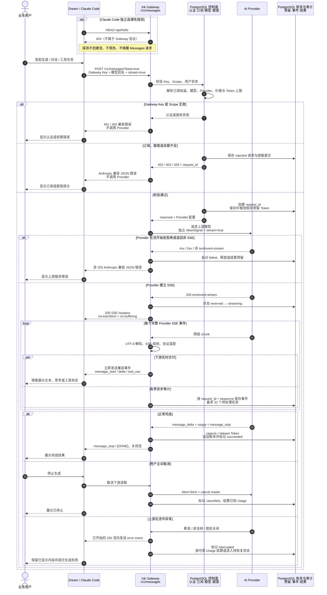
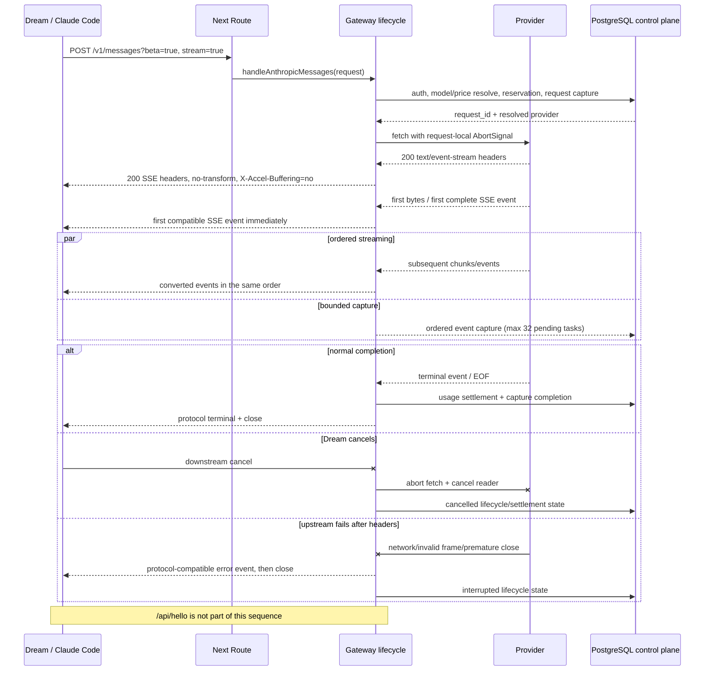

# Dream `/v1/messages` 实时 SSE 代理设计

> 状态：已实现
> 日期：2026-08-10（Asia/Shanghai）
> 范围：`app/v1/messages`、`app/lib/gateway`、Gateway focused tests

## 1. 背景与问题

Dream 通过 Claude Code / Anthropic Messages 兼容入口调用本项目的
`POST /v1/messages?beta=true`。现场日志显示一次请求约 4.3 秒、另一次约
12.5 秒，并夹有 `HEAD /api/hello 404`。客户端表现为首个请求没有持续收到
SSE，后续请求或流结束附近才出现数据。

目标是保证首个 Messages 请求在上游事件到达后立即下发，不依赖健康探测、
预热、第二个请求或固定延时，并保证请求隔离、取消传播和有界内存。

## 2. 证据与根因

### 2.1 已证实事实

1. Route Handler 仅调用 `handleAnthropicMessages()`；鉴权、适配、Provider
   transport、SSE parser 和生命周期均位于 `app/lib/gateway/**`。
2. 当前流状态是函数内请求级变量。没有模块级 controller、共享 reader、共享
   `ReadableStream`、单例 emitter 或 12 秒轮询器。
3. `parseSseStream()` 使用增量 `TextDecoder` 和跨 chunk buffer；现有测试已证明
   分片 event、单 chunk 多 event、CRLF 和 EOF 尾帧处理。
4. 流分支不会调用 `response.text()` / `response.json()`；完整读取只存在于预流式
   Provider HTTP 错误和明确的非流式分支。
5. Claude Code 的连通性预检会访问 Anthropic API origin 的 `/api/hello`。本项目
   没有该路由，因此 404 是外部客户端探测，不是 SSE producer 的启动信号。
6. Next 16 自带的 compression middleware 会压缩可压缩响应；只有
   `Cache-Control` 包含 `no-transform` 时才明确跳过压缩。`text/event-stream`
   属于可压缩类型。

### 2.2 可重复实验

使用仓库当前 Next 16 内置 compression middleware，服务端先写一个小 SSE frame，
300ms 后写终帧：

| 响应头 | Content-Encoding | 首个解压事件 | 流完成 |
|---|---|---:|---:|
| `Cache-Control: no-cache` | gzip | 327ms | 328ms |
| `Cache-Control: no-cache, no-transform` | identity | 2ms | 304ms |

实验表明缺少 `no-transform` 会让小事件留在 gzip 缓冲区，直到后续数据或流完成。
现场的 12.5 秒 Next 日志是请求/流完成总时长，不是 TTFB 指标；若整个响应被压缩
缓冲，客户端会把该总时长误认为首事件延迟。

### 2.3 根因结论

直接根因是流响应只有 `no-cache`，未禁止 Next / 反向代理转换，导致 SSE 被 gzip
缓冲。`/api/hello` 404 与流启动没有因果关系；第二个请求也不会唤醒另一个请求的
request-local Web Stream。它们与第一个流结束或产生更多网络活动时间接近，形成了
观察上的相关性。

同时审计发现两个生命周期风险并一并修复：

- 遇到 OpenAI `[DONE]` 时 iterator 未显式结束，reader lock 可能保留到 GC；
- payload capture 使用无限增长的 Promise chain，数据库慢于流时会无界保留事件闭包。

### 2.4 已排除假设

- 不存在跨请求共享流或全局队列；
- producer 不在 consumer 建立前使用共享 controller 发送；
- 流分支不等待完整上游 body；
- 没有 12 秒 debounce、poll、heartbeat 或 batch interval；
- `stream: true`、受限 `beta=true|1` query、Anthropic 兼容 headers 已向上游传播；
- Next 首次编译可能增加路由进入时间，但不能解释一个已开始的 SSE 被整流交付。

## 3. 异常与目标交互

### 3.1 修复前

```text
Dream -> Gateway -> Provider headers -> Provider SSE frame
                              -> Next gzip buffer ... Provider stream ends
Dream <-                    compressed response finally flushes
```

### 3.2 修复后

```text
Dream -> Gateway auth/reservation -> Provider headers -> request-local parser
Dream <- SSE headers (identity) <- first complete event <- upstream bytes
Dream <- next event           <- next complete event  <- upstream bytes
```

## 4. 业务交互时序

### 4.1 完整功能交互



业务上以 `request_id` 贯穿一次调用。Dream 只持有 Gateway Key 和模型别名；Provider
密钥、实际模型、价格快照、订阅额度和账务状态均留在服务端。首个完整上游事件一旦
完成组帧就立即交付 Dream，报文审计在有界队列中异步进行，不要求 `/api/hello`、预热
或第二次请求。

### 4.2 技术执行时序



## 5. 请求级状态与生命周期

每个 `proxyStreaming()` 调用独立创建：

- Provider `Response`、linked `AbortController` 和 timeout；
- SSE async iterator、`TextDecoder`、跨 chunk buffer；
- protocol adapter 状态；
- usage accumulator、sequence、response hash 和 terminal/cancelled flags；
- 下游 `ReadableStream` controller；
- 容量为 32 的顺序 payload capture queue。

状态转换为：`reserved -> streaming -> succeeded | failed | cancelled`。上游响应头和
Content-Type 在返回 200 SSE 前校验；首字节前错误仍可返回非 200 JSON。流开始后的错误
只能以兼容协议 error event 表达，并将数据库状态标记为 interrupted。

parser 只在读到空行后产生完整 SSE event。一个 event 可跨任意 chunk，单 chunk 可含
多个 event；增量 decoder 保留跨 chunk UTF-8 字节。CRLF 规范化为 LF。终止标记、取消
或 abort 都会退出 iterator，并取消/释放 reader。

## 6. 背压与内存边界

下游 stream 使用 `pull()`：只有 consumer 请求数据时才继续读取上游 event。一个
Provider event 最多产生协议 adapter 的有限个输出，不整流缓存。

报文持久化与下游写入解耦，以免 PostgreSQL 延迟阻塞首事件；但异步捕获不是无界的。
`BoundedTaskQueue(32)` 保持事件顺序，达到上限后暂停下一轮上游读取，直到释放一个
slot。这样把最大保留量限制为 32 个捕获任务，并把持续过载转化为可控背压。捕获失败
会脱敏记录失败状态，但不撤回已成功写给 Dream 的 SSE。

## 7. 超时、心跳、重试与断线

- Provider timeout 使用模型 Provider 的 `timeoutMs`，与 downstream request signal 联结；
- 客户端取消立即 abort Provider、退出 iterator、取消 reader，并完成 cancelled 结算；
- Gateway 不在请求内部自动重试流，避免重复事件和重复计费；重试由客户端以新的请求
  或幂等契约发起；
- 本修复不增加固定 12 秒 timer；
- 当前不注入 heartbeat。若部署环境存在空闲连接超时，应使用 SSE comment heartbeat，
  但必须是请求级 timer、在所有终态清理，且不能代替业务事件 flush。

## 8. Headers、兼容错误与非流式行为

流响应固定包含：

- `Content-Type: text/event-stream; charset=utf-8`
- `Cache-Control: no-cache, no-transform`
- `Connection: keep-alive`
- `X-Accel-Buffering: no`
- `X-Request-Id: <gateway request id>`

Anthropic 下游使用 named event + JSON data；OpenAI 使用 `data:`，成功时只有一个
`[DONE]`。非法 JSON frame、上游中断和 Usage 缺失映射为现有协议错误体。非流式分支
继续完整读取 JSON、适配、结算并返回 `application/json`，本次不改变其行为。

## 9. 可观测性与安全

以 `X-Request-Id` 关联以下已有持久化时间点：

- `gateway_requests.created_at`：通过前置控制面后的请求生命周期起点；
- `gateway_response_payloads.started_at`：上游 headers 可用、下游 SSE 建立；
- `gateway_response_payloads.first_event_at` 与首条 event `elapsed_ms`：首个下游 event；
- `gateway_response_payloads.completed_at`：完成/中断/取消；
- `gateway_response_events` 数量和 sequence：下游事件数与顺序；
- `gateway_requests.first_token_ms` / latency：首 token 与总时长。

诊断必须比较 `time_to_upstream_headers`、首 event 和 completion，不能只使用 Next 的
请求完成日志。认证 header、Gateway Key、Provider secret、Cookie 不进入日志或响应；
payload header 按 allowlist 保存，敏感字段固定为 `[REDACTED]`。Provider secret 只在
内存中解密并重建上游认证 header。

## 10. 测试矩阵

| 场景 | 证据 |
|---|---|
| 首个 `/v1/messages` 在 Provider 结束前收到首事件 | focused HTTP/Playwright mock Provider |
| 不需要 `/api/hello` 或第二请求 | 首事件断言发生在任何 hello/后续请求前；随后 HEAD 仍为 404 |
| Next 不压缩 SSE | `no-transform`、无 `Content-Encoding` |
| event 跨 chunk / 单 chunk 多 event | parser unit tests |
| CRLF、multiline、UTF-8 跨 chunk | parser unit tests |
| 两个并发请求严格隔离 | proxy concurrency unit test |
| downstream cancel / signal abort / `[DONE]` | reader/fetch cancel unit tests |
| 上游首字节前错误 / 流中错误 / 非 SSE | proxy error tests |
| 鉴权失败 | gateway auth/handler tests |
| 非流式回归与双向协议适配 | proxy + focused E2E |
| 捕获慢或失败 | 首事件不等待 capture；有界队列和 failure-continuation tests |

时间测试使用“首事件发生时 Provider 尚未结束”的因果断言，不依赖 CI 中脆弱的绝对
毫秒阈值。

## 11. 发布、回滚与风险

发布顺序：相关 unit -> typecheck/lint -> focused Gateway E2E -> build -> staging 使用
`curl -N` / Dream SDK 观察首事件 -> 逐步发布。反向代理仍需保留
`X-Accel-Buffering: no` 并尊重 `no-transform`。

回滚只需回退应用代码，无 schema 或 migration。若回滚 `no-transform`，压缩缓冲会立即
复现，因此优先回滚其他变更并保留该 header。主要风险是禁用 SSE 压缩增加带宽；这是
为低延迟事件交付有意接受的权衡。32-task capture 上限可能在数据库极慢时降低上游读取
速率，但不会无界增长内存或跨请求污染。

## 12. 为什么不需要 `/api/hello` 或第二次请求

`/api/hello` 是 Claude Code 面向 Anthropic 服务的连通性探测，本 Gateway 不把它当成
初始化、健康状态或流开关。每次 `/v1/messages` 在同一请求内完成鉴权、上游连接、parser
和 controller 创建；上游完整 event 到达后直接 enqueue 给该请求的 consumer。

修复后 Next 不再压缩变换 SSE，因此第一个小 event 自身就能越过 HTTP 边界。另一个
HTTP 请求既不共享 controller，也不参与 queue 或 flush；第二请求不可能、也不再需要
“唤醒”第一请求。
