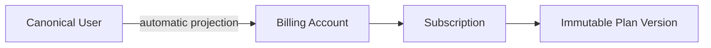
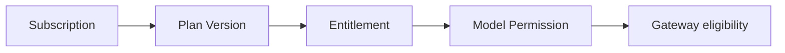
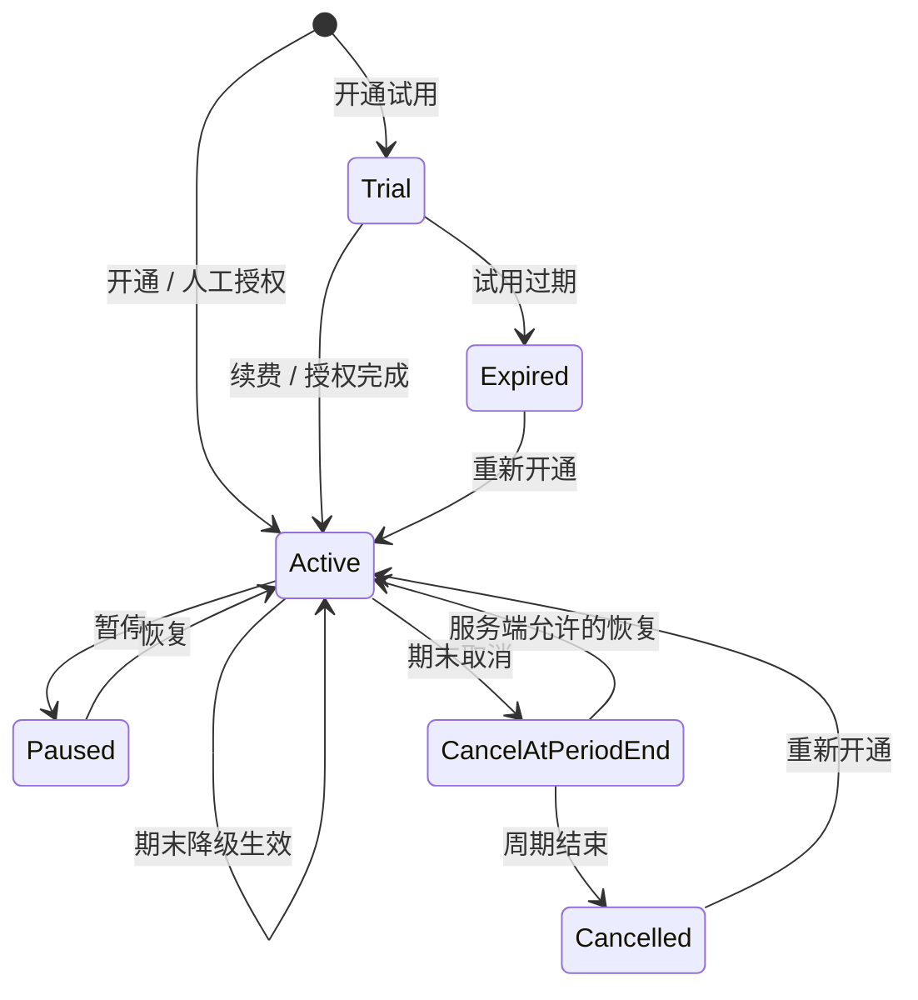

# 01 · Subscription Experience

> 文档状态：**Planned**  
> 正式入口：`/story-workspace/subscription`  
> 操作者：已登录的 Dream canonical user  
> 返回：[Dream 交互设计索引](README.md)

## 1. 页面目标与状态分层

### Current

- `StoryWorkspaceSubscriptionPage.tsx` 渲染本地静态三档套餐数组和“即将开放”文案。
- 页面没有真实 Subscription、Plan Version、Entitlement、Allowance、Billing Account 或生命周期命令数据源。
- 因此当前页面不能作为价格、用户订阅或可用权益证据。

### Target

让用户在一个可追溯页面内：理解当前订阅与周期，对比对其真实可用的已发布 Plan Version/Entitlement，预览开通、续费、升级、降级、暂停、恢复和取消的实际影响，再以幂等命令提交给 Admin。

### Release Gate

- 删除静态 Plan 数组和任何 fallback；只渲染 Admin 产品 API 返回的 published/effective 版本。
- canonical user 从 Dream Session 绑定，所有用户都可被自动投影为 Billing Account；页面不存在手工开户。
- 全生命周期命令、幂等重放、并发 409、网络结果未知、两视口和无障碍 E2E 通过。
- 页面的 Current/Target 文案与 API 实现、PRD 和架构状态一致。

## 2. 数据来源与合同

### 2.1 首屏聚合数据

Dream BFF `GET /api/story-workspace/subscription/context` 服务端调用 `GET /api/product/v1/me/subscription-context`。响应形状：

```json
{
  "data": {
    "canonicalUser": { "id": "usr_..." },
    "subscription": {
      "id": "sub_...",
      "status": "active",
      "version": 7,
      "currentPeriodStart": "2026-08-01T00:00:00Z",
      "currentPeriodEnd": "2026-09-01T00:00:00Z",
      "cancelAtPeriodEnd": false,
      "pendingChange": null,
      "allowedActions": ["renew", "upgrade", "downgrade", "pause", "cancel"]
    },
    "planVersion": {
      "planCode": "creator",
      "planName": "Creator",
      "planVersionId": "pv_...",
      "version": 4,
      "billingCycle": "monthly",
      "basePriceMicrousd": 12000000,
      "currency": "USD"
    },
    "entitlements": [],
    "allowance": {
      "unit": "token",
      "granted": 1000000,
      "reserved": 1000,
      "consumed": 240000,
      "remaining": 759000,
      "resetsAt": "2026-09-01T00:00:00Z"
    },
    "billingAccount": {
      "currency": "USD",
      "availableMicrousd": 8500000,
      "reservedMicrousd": 200000,
      "version": 11
    },
    "asOf": "2026-08-09T10:00:00Z"
  },
  "meta": { "requestId": "req_..." }
}
```

示例只定义类型/单位，不得复制其中数值作为 fixture 外的页面数据。无订阅时 `subscription/planVersion/allowance` 为 `null`，不由前端构造 free plan。`canonicalUser` 不包含内部 `platformUserId`。

### 2.2 套餐列表

`GET /api/story-workspace/subscription/plans?page=1&pageSize=20` → `GET /api/product/v1/plans`，返回 `{data, meta:{total,page,pageSize}}`。每项只允许：

- `planCode/planName/description`；
- published `planVersionId/version/billingCycle/effectiveFrom/effectiveTo`；
- `basePriceMicrousd/currency`；
- 结构化 `entitlements`：`scope/modelAlias/rpm/tokenLimit/storageLimit/overagePolicy`；
- `eligibility` 与服务端解释；
- `availableActions` 与目标生效方式。

列表不接受浏览器传入的 user ID。无 published/effective 版本时 System Empty；页面不显示过期价格、未发布版本或 Admin 内部备注。

### 2.3 预览与命令

`POST /api/story-workspace/subscription/previews` 转发至 `POST /api/product/v1/me/subscription-command-previews`：

```json
{
  "action": "upgrade",
  "targetPlanVersionId": "pv_...",
  "expectedSubscriptionVersion": 7,
  "cancelTiming": null
}
```

服务端返回 `previewToken/expiresAt/current/target/effectiveAt/priceImpactMicrousd/allowanceImpact/balanceImpact/gatewayImpact/paymentRequirement/warnings`。未知/无法估算字段为 `null` 并有 `reasonCode`，不显示 0。

`POST /api/story-workspace/subscription/commands` 转发至 `POST /api/product/v1/me/subscription-commands`：

```json
{
  "action": "upgrade",
  "targetPlanVersionId": "pv_...",
  "expectedSubscriptionVersion": 7,
  "previewToken": "opaque-short-lived-token",
  "idempotencyKey": "client-operation-uuid",
  "reason": "User confirmed upgrade"
}
```

响应包含 `commandId/outcome(applied|scheduled|pending_authorization)/subscription/actualImpact/paymentState/idempotentReplay/requestId`。浏览器不自行计算新余额；只使用命令响应和随后 refetch。

## 3. 核心关系





Dream 不让用户编辑 Billing Account、Plan Version 或 Entitlement，也不把内部投影键显示成业务对象。

## 4. 页面结构、字段和控件

| 区域 | 字段/内容 | 控件 | 规则 |
|---|---|---|---|
| 页头 | 订阅与用量、`asOf`、数据健康 | Refresh button | 刷新不清空当前内容；加载时标记 stale，不冒充最新 |
| 当前订阅 | 状态、Plan + Version、周期、续费/取消、pending change | status tag、definition list | 状态文字+图标；显示精确时区 |
| Allowance | granted/reserved/consumed/remaining/reset | progress + definition list | 数值守恒可读；不与 cash 合并 |
| 当前权益 | scope、model alias、RPM、Token/Storage、overage | 只读分组列表 | `null` 显示“未设置”，不补默认值 |
| 套餐比较 | 名称、version、cycle、price、entitlements、eligibility | radio/list + “预览影响” | 只展示 API 返回项；不用 marketing 静态卡片 |
| 影响预览 | current→target、effective time、price/allowance/balance/gateway/payment | 宽 Drawer/Modal | 数据由 preview API 提供；过期后不可提交 |
| 确认区 | reason、同意影响、幂等操作 ID | textarea + checkbox + button | 不允许重复点击；永不要求输入 Secret |

### 订阅状态标签

| 状态 | 主文案 | 关键辅助信息 |
|---|---|---|
| `trial` | 试用中 | 试用结束时间、结束后条件 |
| `active` | 已生效 | 当前周期结束时间 |
| `past_due` | 待处理 | 受影响功能与处理入口；不假设支付渠道 |
| `paused` | 已暂停 | Gateway 可用性与可恢复时间 |
| `cancel_at_period_end` | 将于期末取消 | 实际生效时间和 API 返回的可用恢复动作 |
| `cancelled` | 已取消 | 终止时间和历史版本 |
| `expired` | 已过期 | 过期时间与可重新开通条件 |

## 5. 生命周期与影响预览



每个动作的 preview 必须包括：

| 动作 | 生效时间 | 必须预览的影响 | 不得假设 |
|---|---|---|---|
| 开通 | 立即、试用开始或待授权 | 目标版本、价格、试用、Allowance、Gateway、payment requirement | 未接真实渠道时不显示已支付 |
| 续费 | 新周期 | 新 period、价格版本、Allowance reset/grant、余额/授权 | 不隐藏全额扣费或版本变化 |
| 升级 | API 返回的立即/期末 | 当前→目标、是否重开周期、是否 prorate/refund、新 Allowance | 不在前端自算差价 |
| 降级 | 默认期末，以 API 为准 | 排队变更、生效时间、权益/模型丧失 | 不在当前周期提前收窄体验 |
| 暂停 | 命令结果时间 | Gateway 停止范围、period/allowance 处理、恢复条件 | 不只显示一个 Switch |
| 恢复 | 命令结果时间 | 恢复后状态、新周期/费用/权益、Gateway | 不把收费的 renew/upgrade 标为“撤销取消” |
| 取消 | 期末或 API 允许的时间 | 最后可用时间、Allowance/余额、Gateway、可恢复条件 | 不隐藏未结算 Usage |

## 6. Loading、Empty 和错误

| 状态 | 展示 | 恢复 |
|---|---|---|
| Loading | 稳定页头+等高订阅/Allowance/套餐 skeleton，`aria-busy=true` | 请求可取消；不显示假数值 |
| 无订阅 | “当前没有订阅”+真实可用 Plan | 预览开通；无 Plan 则说明暂无可用版本 |
| 无可用 Plan | 不显示过期/静态套餐 | 刷新或联系支持；显示 request ID |
| 403 | 具体状态/权益条件；不显示不可用命令 | 返回当前订阅概览 |
| 409 | 保留 Drawer 和 reason，显示 current version 已变 | 刷新→重新 preview→使用新 idempotency key |
| 429 | 提交命令过快或读取限制的窗口和 Retry-After | 按计时后重试；禁用按钮但不抢焦 |
| 503 | 明确 Admin/PG 不可用或维护，显示 `asOf` | 重试；不切回静态 plans |
| 结果未知 | 不显示 success，显示 operation ID | 用同一幂等键查询/重放；按服务器结果刷新 |

## 7. 响应式、键盘和读屏

### 1440×1000

- 上部为当前订阅与 Allowance/Balance 摘要；下部套餐比较用平面对比表，不使用三列 marketing 卡片。
- 影响预览宽 Drawer 最大 720px，标题/错误摘要/最终操作保持可见，内容独立滚动。

### 390×844

- 顺序为状态→周期→Allowance→Balance→权益→可用 Plan；套餐对比改为可展开的定义列表。
- Preview 全屏；底部操作区不遮挡 checkbox/error/safe area，长 ID 不撑开视口。

### 焦点与读屏

- 套餐选择使用原生 radio 语义；每项 accessible name 包含名称、版本、周期与格式化价格。
- Drawer 锁焦，打开聚焦 H2/摘要，409 聚焦冲突摘要，关闭归焦原动作。
- 当状态因后台命令改变时，`aria-live=polite` 宣布实际状态和生效时间；不只宣布“成功”。

## 8. 可自动化验收

- `DREAM-SUB-01`：无订阅用户仅看到 API 返回的 published Plans；断网/503 时不出现静态三档。
- `DREAM-SUB-02`：trial/active/past_due/paused/cancel_at_period_end/cancelled/expired 的状态、时间和 allowed actions 与 API 一致。
- `DREAM-SUB-03`：七类生命周期操作都必须先拿 previewToken；过期/并发返 409 且保留输入。
- `DREAM-SUB-04`：重复提交同 idempotency key 只产生一个 Subscription Event/账务效果，UI 显示 `idempotentReplay`。
- `DREAM-SUB-05`：所有价格/影响传输值为整数 micro-USD，无 JS 浮点反算提交。
- `DREAM-SUB-06`：无真实支付渠道时，开通/续费只能显示待人工授权或测试环境真实状态，不显示虚假支付成功。
- `DREAM-SUB-07`：1440×1000 与 390×844 无横向溢出；只用键盘可完成选择、preview、确认、冲突恢复和关闭归焦。

