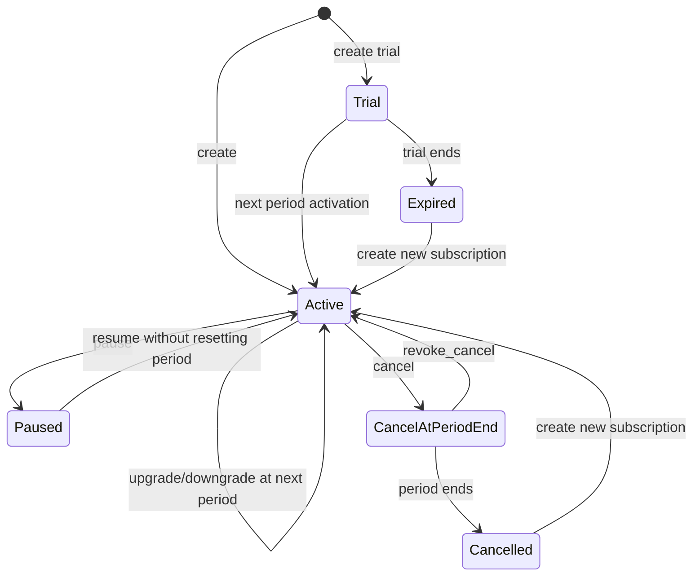

# 01 · Subscription Experience

> 文档状态：**Implemented / Release candidate**
>
> 正式入口：`/story-workspace/subscription`
>
> 操作者：已登录的 Dream canonical user
>
> 返回：[Dream 交互设计索引](README.md)

## 1. 页面目标与状态分层

### Current / Implemented

- `StoryWorkspaceSubscriptionPage.tsx` 已由真实 Dream 同源 BFF 驱动，不再渲染本地静态三档套餐或“即将开放”fallback。
- 页面已展示 Subscription、Plan Version、Entitlement、个人月度 Token Allowance/Usage，并支持八项 preview→execute 生命周期命令。
- DTO/DOM 可包含 Admin 返回的整数月费、USD 和当前用户 Payment Intent 状态；不包含金额余额、Secret 或平台统一生效日。

### Target

让用户在同一页面理解当前订阅状态、个人月度周期、Token 发放与权益，对比 Admin 已发布的 Token-only Plan Version，预览下一周期的变更，再以幂等命令提交。

页面只回答：本周期何时开始/结束、发放/预留/消耗/剩余多少 Token、允许哪些模型和 Scope、RPM/Storage 限制是什么、下周期将使用哪个套餐。

Round 52补充：页面固定展示Admin Product API返回的`free`、`dream`、`is-dreaming`三项Plan identity及正式`eyebrow/name/note/details`。Free published版本可用；Dream/is Dreaming在商业参数未发布时仍显示叙事卡片并明确“暂不可开通”，不得因为版本为draft而消失，也不得把draft显示成US$0或假支付成功。新用户和确实没有需要保留订阅的历史用户由Admin自动获得Free Subscription、Allowance与activation Event；前端不自行构造Free状态。

### Release Gate

当前页面 lint/build、Product API 9/9 与订阅 mocked-browser 4/4 已通过，覆盖 1440×1000、390×844、首次付费和到期续费；真实预发布 Admin API、Session/service identity、网络结果未知与生产数据冒烟仍需发布回执。

- 删除静态 Plan 数组和任何 fallback；只渲染 Admin Product API返回的正式Plan identity。published版本可操作，draft identity只读显示“暂不可开通”。
- canonical user 从 Dream Session 绑定；每个平台用户天然是订阅主体，不存在手工开户或独立“计费用户”。
- DTO、DOM、控件和文案可展示真实套餐月费与 Payment Intent；仍不包含金额 allowance、cash balance、充值、金额超额或全局 `effectiveFrom/effectiveTo`。
- 全生命周期命令、个人月度锚点、幂等重放、并发 409、网络结果未知、两视口和无障碍 E2E 通过。

## 2. 数据来源与合同

### 2.1 首屏聚合数据

Dream BFF `GET /api/story-workspace/subscription/context` 服务端调用 `GET /api/product/v1/me/subscription-context`。响应形状：

```json
{
  "data": {
    "canonicalUser": { "id": "usr_..." },
    "subscription": {
      "id": "sub_...",
      "status": "active",
      "version": 7,
      "cycleAnchorAt": "2026-08-09T10:00:00Z",
      "currentPeriodNumber": 0,
      "currentPeriodStart": "2026-08-09T10:00:00Z",
      "currentPeriodEnd": "2026-09-09T10:00:00Z",
      "cancelAtPeriodEnd": false,
      "pendingChange": null,
      "allowedActions": ["upgrade", "downgrade", "pause", "cancel"]
    },
    "planVersion": {
      "planCode": "creator",
      "planName": "Creator",
      "planVersionId": "pv_...",
      "version": 4,
      "billingCycle": "monthly"
    },
    "entitlements": [
      {
        "gatewayScope": "story.generate",
        "modelAliases": ["dream-balanced"],
        "rpmLimit": 30,
        "storageBytes": 10737418240
      }
    ],
    "allowance": {
      "unit": "tokens",
      "granted": 1000000,
      "reserved": 1000,
      "consumed": 240000,
      "remaining": 759000,
      "resetsAt": "2026-09-09T10:00:00Z"
    },
    "asOf": "2026-08-09T10:05:00Z"
  },
  "meta": { "requestId": "req_..." }
}
```

示例只定义类型与单位，不得复制数值为页面假数据。无订阅时 `subscription/planVersion/allowance` 为 `null`，不由前端构造 free plan。`canonicalUser` 不包含平行用户 ID。

`cycleAnchorAt` 是用户个人月度锚点，`currentPeriodNumber` 是相对锚点的零基周期序号；二者都不是平台套餐生效日。服务端必须执行月末钳制并记住原锚点日：1 月 31 日→2 月月末→3 月 31 日；前端不得用固定 30 天或前一周期结束日自行推导。

### 2.2 套餐列表

`GET /api/story-workspace/subscription/plans?page=1&pageSize=20` → `GET /api/product/v1/plans`，返回 `{data,meta:{total,page,pageSize}}`。每项字段白名单：

- `planCode/planName/description`；
- `planVersionId/version/billingCycle`，其中 `billingCycle` 固定为 `monthly`；
- `monthlyAllowanceTokens`；
- `entitlements`：`gatewayScopes/modelAliases/rpmLimit/storageBytes`；
- `eligibility` 与服务端安全解释；
- `availableActions` 和变更将在当前用户 `currentPeriodEnd` 应用的说明。

列表不接受浏览器传入 user ID。无 published 版本时进入 System Empty。`publishedAt` 仅可作为版本元数据，不得显示或解释成全体用户统一生效时间；产品合同不返回 `effectiveFrom/effectiveTo`。

### 2.3 预览与命令

预览与执行共用 Dream BFF `POST /api/story-workspace/subscription/commands` 和 Admin `POST /api/product/v1/me/subscription-commands`。升级预览：

```json
{
  "action": "upgrade",
  "phase": "preview",
  "targetPlanVersionId": "pv_...",
  "expectedVersion": 7
}
```

服务端返回：

- `previewId/digest/expiresAt`；
- `current/target` 套餐与版本；
- `appliesAt`，升级和降级均等于该用户 `currentPeriodEnd`；
- `allowanceImpact`，明确本周期不变、下周期 Token 数；
- `entitlementImpact/gatewayImpact/warnings`；
- `allowed` 与稳定 `reasonCode`。

不得返回或渲染 `priceImpactMicrousd/balanceImpact/paymentRequirement/currency`。前端不自行做差额、比例、金额或 Token 折算。

执行使用同一路由，并由 Dream BFF 转发 HTTP `Idempotency-Key`：

```json
{
  "action": "upgrade",
  "phase": "execute",
  "targetPlanVersionId": "pv_...",
  "expectedVersion": 7,
  "previewId": "preview_...",
  "digest": "sha256:...",
  "expiresAt": "2026-08-09T10:10:00Z",
  "reason": "User confirmed next-period upgrade"
}
```

响应使用 `{data,meta}` envelope：`data` 包含 `commandId/outcome(applied|scheduled)/subscription/actualImpact/idempotentReplay`，`meta.requestId` 保存追踪 ID。`action` 只允许 `create|renew|upgrade|downgrade|pause|resume|cancel|revoke_cancel`。浏览器只使用命令回执与随后 refetch，不自行构造未来周期或发放 Token。

## 3. 个人月度周期与生命周期规则



| 动作 | 应用时点 | Token 与周期规则 | 冲突行为 |
|---|---|---|---|
| 开通 | 命令成功时间 | 建立个人 `cycleAnchorAt/currentPeriodNumber=0`，发放首个完整月度 Token | 已有不可兼容订阅返 409 |
| 续费 | 当前周期边界 | 只生成一个新周期和一份新 Token；不允许提前使用未来 Token | 提前续费或不同 key 重复续费返 409 |
| 升级 | 当前 `currentPeriodEnd` | 当前周期 Token/权益不变；下一周期采用目标版本完整快照 | 已有 pending change 时按最新状态重新 preview |
| 降级 | 当前 `currentPeriodEnd` | 当前周期不提前收窄；下一周期采用目标版本 | 与并发取消/升级冲突返 409 |
| 暂停 | 服务端命令时点 | 不重置个人锚点、不重复发放；Gateway 按状态拒绝 | 状态不允许返 409/403 |
| 恢复 | 服务端命令时点 | 恢复剩余当前周期；不新开周期 | 过期后需 create，不伪装 resume |
| 取消 | 默认当前周期末 | 保留本周期 Token/权益至 `currentPeriodEnd` | 已取消命令幂等回放同一结果 |
| 撤销期末取消 | 周期结束前 | 清除期末取消标记，周期与 Token 不变 | 周期已结束返 409 |

Plan Version 的发布只决定能否被新命令选择。已订阅用户在本周期固定引用不可变版本快照，平台不得用一个全局日期无提示切换所有用户。

## 4. 页面结构、字段与控件

| 区域 | 字段/内容 | 控件 | 规则 |
|---|---|---|---|
| 页头 | 订阅、`asOf`、数据健康 | H1 + Refresh button | 刷新不清空当前内容；stale 有文字标签 |
| 当前订阅 | 状态、Plan + Version、个人周期、期末取消、pending change | status tag + definition list | 精确时区；不用“平台生效日” |
| Token Allowance | granted/reserved/consumed/remaining/reset | progress + definition list | 每项显式 `Token`；reserved 有解释 |
| 当前权益 | model alias、Gateway Scope、RPM、Storage | 只读分组列表 | `null` 显示“未设置”，不补默认值 |
| 套餐比较 | 名称、version、monthly Token、月费、模型/Scope/RPM/Storage、eligibility | 原生语义 radio + 平面对比列表 | 价格只来自 API 整数 micro-USD |
| 影响预览 | current→target、`appliesAt`、下周期 Token/权益变化 | 宽 Drawer/Modal | 升降级固定下周期；过期 preview 不可提交 |
| 确认区 | reason、确认影响、幂等操作状态 | textarea + checkbox + button | 防重复点击；永不要求 Secret |

### 订阅状态标签

| 状态 | 主文案 | 关键辅助信息 |
|---|---|---|
| `trial` | 试用中 | 个人试用结束与 Token reset 时间 |
| `active` | 使用中 | 当前个人周期结束时间 |
| `past_due` | 付费月订阅已到期，下一期尚未付款 | 显示“已逾期”和唯一 `renew` 操作；创建 renewal Intent 后等待已验证 Webhook，不提前发 Token、不伪造成功 |
| `paused` | 已暂停 | Gateway 不可用范围与可恢复动作 |
| `cancel_at_period_end` | 将于期末取消 | 实际期末时间与撤销动作 |
| `cancelled` | 已取消 | 终止时间与重新开通条件 |
| `expired` | 已过期 | 过期时间与可选择套餐 |

## 5. Loading、Empty 与错误恢复

| 状态 | 展示 | 恢复 |
|---|---|---|
| Loading | 稳定页头+等高订阅/Token/套餐 skeleton，`aria-busy=true` | 请求可取消；不显示假数值 |
| 无订阅 | “当前没有订阅”+真实可用 Plan | 预览开通；无 Plan 时说明暂无版本 |
| 无可用 Plan | 不显示过期/静态套餐 | 刷新或联系支持；显示 request ID |
| 401 | 不渲染订阅或 Token | 登录后返回原安全路由 |
| 402 `SUBSCRIPTION_TOKEN_ALLOWANCE_EXHAUSTED` | 当前个人周期 Token 不足 | 显示 `availableTokens/requiredTokens/periodEnd`，等待重置或预览下周期套餐 |
| 403 | 具体状态、模型或 Scope 条件 | 返回当前订阅概览，不显示不可用命令 |
| 404 | Plan/Subscription 不存在或不可见 | 返回真实空状态并刷新列表 |
| 409 | 保留 Drawer/reason，显示服务器版本或状态变化 | 刷新→重新 preview→提交；不提前发 Token |
| 429 | 命令或 Gateway 窗口限流 | 按 `Retry-After` 后重试；禁用按钮但不抢焦 |
| 503 | Admin/PG/Gateway/Payment Adapter 不可用或合同违规 | 重试；不切回静态 plans、价格或 Fake 成功 |
| 结果未知 | 不显示成功，显示 operation ID | 使用同一幂等键查询/重放，按服务器结果刷新 |

## 6. 高风险确认与错误预防

- 升级/降级确认标题必须写“将在 {currentPeriodEnd} 应用”，不能用笼统“立即生效”。
- 取消确认必须列出最后可用时间、剩余 Token 的到期处理和 `revoke_cancel` 截止条件。
- 暂停确认列出 Gateway 受影响 Scope，并明确恢复不会重置 Token。
- 二次确认使用明确按钮文案，如“确认下周期升级”；不使用通用“确定”。
- `previewId` 过期、版本变化或 pending change 冲突时禁止静默重新提交。

## 7. Secret、身份与数据边界

- 页面、DOM、Storage、Network response、analytics 和日志永不出现 Gateway Key、Provider Secret、Payment Secret、System Secret 或服务间凭据。
- canonical user 由 Dream Session 确定；BFF 不接受浏览器提交 user ID，页面不存在用户映射控件。
- Plan/Entitlement 响应不含 Provider endpoint、routing secret reference、Admin 内部备注、Provider Pricing 或财务对象；仅允许套餐整数 micro-USD 月费。
- Usage 与 Subscription Event 为只读事实；Dream 不提供手工 Token 发放、调整、编辑或删除入口。

## 8. 响应式与无障碍

### 1440×1000

- 上部为当前订阅与 Token Allowance 2:1 摘要，下部为权益和套餐平面对比；不使用营销三卡布局。
- Preview Drawer 宽度约 560–640px，首屏显示应用时点和 Token 变化；操作区不遮挡警告。
- 桌面表格仅在内部容器横滚，表头与套餐名称保持可见。

### 390×844

- 顺序为状态→个人周期→Token→权益→可用 Plan；套餐改为可展开定义列表。
- Drawer/Modal 全屏并考虑 safe area；主操作位于内容流末尾，不固定遮挡 402/409。
- 时间与长 ID 可换行；页面无 document 横向溢出。

### 键盘、焦点、Label 与读屏

- 套餐选择使用原生 radio 语义；accessible name 包含名称、版本、月度 Token 与关键权益。
- Drawer 打开后聚焦标题/影响摘要，Tab 留在层内，Escape 关闭，关闭后归焦原按钮。
- 确认 checkbox 有独立 label 和 description；错误摘要 `role=alert`，首错字段 `aria-describedby` 关联错误。
- 进度条 `aria-valuemin=0`、`aria-valuemax=granted`、`aria-valuenow=consumed`，读屏文本另报 reserved 与 remaining。
- 状态变化由单一 `aria-live=polite` 公告；颜色、图标、进度都配文字。

## 9. 可自动化验收

- `DREAM-SUB-01`：无 Session 返 401；页面和响应不泄露订阅、Token 或内部 user ID。
- `DREAM-SUB-02`：每个平台用户可直接读取自己的订阅上下文；不存在“创建计费用户”入口或独立名册。
- `DREAM-SUB-03`：套餐列表含 monthly Token、整数月费、model/scope/RPM/storage；金额 allowance、balance、Secret 和 `effectiveFrom/effectiveTo` 均不存在。
- `DREAM-SUB-04`：1 月 31 日锚点按月末钳制后回到 3 月 31 日；不同用户按各自起点计算。
- `DREAM-SUB-05`：升级/降级只在各自 `currentPeriodEnd` 应用；本周期 Token 不变且不重复发放。
- `DREAM-SUB-06`：提前续费、重复续费、同幂等键异 payload、并发变更均返确定 409 且无额外周期/Token。
- `DREAM-SUB-07`：Token 耗尽返 402，wire `metric/unit` 均为 `tokens`，页面无现金补扣、充值或金额超额路径。
- `DREAM-SUB-08`：loading/empty/401/402/403/404/409/429/503 和网络结果未知均显示准确恢复动作。
- `DREAM-SUB-09`：1440×1000 与 390×844 下无横向 document overflow；radio、Drawer、焦点归还、label、live region 与 200% zoom 通过。
