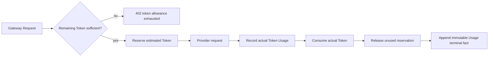

# 02 · Usage and Monthly Token Allowance

> 文档状态：**Planned**
>
> 正式入口：`/story-workspace/subscription?view=usage`
>
> 文件名因旧链接兼容保留；本设计不包含 Balance 或金额 Overage
>
> 返回：[Dream 交互设计索引](README.md)

## 1. 页面目标与边界

### Current

- Dream 尚未从 Admin 产品 API 读取个人月度 Token Allowance 或 Gateway Token Usage。
- 既有设计把套餐 Token、现金余额、金额超额和财务 Ledger 拼在同一页面，造成“订阅套餐发放金额”的错误认知。

### Target

页面只回答三件事：本周期发放了多少 Token、当前已预留/消耗/剩余多少 Token、哪些 Gateway 请求产生了这些 Token Usage。

现金按量计费即使在平台其他独立域保留，也不作为订阅兜底，不进入本页面的 API、筛选、摘要、详情、空状态或操作入口。

### Release Gate

- `granted = reserved + consumed + remaining` 的 Token 守恒由服务端事务和属性测试保障。
- 预留、消费、释放与 Usage 终态可按 Gateway Request 追溯；历史事实只追加，不可编辑或删除。
- 页面和 DTO 不出现价格、currency、micro-USD、cash balance、充值、金额超额、Payment 或财务 Ledger。
- 402 Token 耗尽、429 窗口限流、未知 Usage 和两视口可恢复状态通过 E2E。

## 2. 信息层级与单位

| 层级 | 用户问题 | 真值来源 | 显示规则 |
|---|---|---|---|
| 1. 个人周期 | 这份 Token 何时可用？ | Subscription period | `currentPeriodStart/currentPeriodEnd` + 时区 |
| 2. Allowance | 本周期还能用多少？ | Token allowance snapshot | granted/reserved/consumed/remaining + `unit=tokens` + `periodEnd` |
| 3. Usage summary | 已经使用了什么？ | Append-only Token Usage | requests/input/output/cache/total + known/unknown |
| 4. Usage detail | 哪次请求消耗 Token？ | Gateway Request + Token Usage | model alias、scope、outcome、Token 分项、时间、request ID |
| 5. Exhaustion projection | 按近期速率何时可能耗尽？ | 服务端 Token projection | 只显示预计耗尽时间/Token 缺口及 `asOf`，不换算金额 |

`remaining` 必须由服务端返回。前端可以检查守恒并在异常时显示 503 合同错误，但不能用本地重算值替代服务器事实。

## 3. 数据合同

### 3.1 Usage 汇总与列表

Dream BFF：

```text
GET /api/story-workspace/usage
  ?period=current_subscription_period
  &outcome=completed
  &modelAlias=dream-balanced
  &page=1&pageSize=25
```

对应 Admin `GET /api/product/v1/me/usage`。响应形状：

```json
{
  "data": {
    "period": {
      "start": "2026-08-09T10:00:00Z",
      "end": "2026-09-09T10:00:00Z",
      "timezone": "Asia/Shanghai"
    },
    "allowance": {
      "unit": "token",
      "granted": 1000000,
      "reserved": 1000,
      "consumed": 240000,
      "remaining": 759000,
      "resetsAt": "2026-09-09T10:00:00Z"
    },
    "summary": {
      "requestCount": 48,
      "inputTokens": 130000,
      "outputTokens": 90000,
      "cacheReadTokens": 18000,
      "cacheWriteTokens": 2000,
      "totalTokens": 240000,
      "unknownUsageCount": 0
    },
    "projection": {
      "asOf": "2026-08-09T10:05:00Z",
      "sampleWindowDays": 7,
      "projectedExhaustionAt": null,
      "projectedTokenShortfall": 0,
      "confidence": "insufficient_data"
    },
    "items": []
  },
  "meta": { "total": 48, "page": 1, "pageSize": 25, "requestId": "req_..." }
}
```

示例不作为 fixture 外数据。`items[]` 字段白名单：

- `gatewayRequestId/modelAlias/gatewayScope/protocol/outcome/settlementState`；
- `inputTokens/outputTokens/cacheReadTokens/cacheWriteTokens/totalTokens`；
- `allowanceReservedTokens/allowanceConsumedTokens/allowanceReleasedTokens`；
- `startedAt/completedAt/errorCategory`。

响应不包含 prompt、response、raw headers、Provider route、价格快照、金额字段或 Secret。

### 3.2 原子快照

Allowance、period、summary 和 projection 必须共享同一个 `asOf`/事务快照。前端不并发拼接多个时间点后声称为“当前剩余”。

当请求仍在流式执行时，`reserved` 保持已预留 Token；完成后消费实际 Token、释放多余预留。取消、上游失败或超时也必须得到确定的 consume/release 结果；无法确认时标记 `usage_unknown`，不能写成 0。

## 4. Gateway Token 流



订阅用户 Token 不足时流程必须停在 402，不检查或扣除现金余额，也不自动切换模型。402 详情：

```json
{
  "error": {
    "code": "SUBSCRIPTION_TOKEN_ALLOWANCE_EXHAUSTED",
    "message": "Current subscription-period token allowance is exhausted.",
    "details": {
      "metric": "tokens",
      "unit": "tokens",
      "availableTokens": 759000,
      "requiredTokens": 800000,
      "periodEnd": "2026-09-09T10:00:00Z"
    }
  },
  "meta": { "requestId": "req_..." }
}
```

## 5. 页面结构与控件

### 5.1 摘要

| 区域 | 字段 | 控件/展示 | 规则 |
|---|---|---|---|
| Period | start/end/reset/timezone | definition list | 来自当前用户订阅，不显示平台统一月份 |
| Token Allowance | granted/reserved/consumed/remaining | progress + tabular nums | 四项均显式 Token；reserved 有可键盘打开的说明 |
| Usage summary | request/input/output/cache/total/unknown | flat metrics | 不把 request count 和 Token 混作同单位 |
| Projection | projectedExhaustionAt/tokenShortfall/sample/asOf/confidence | neutral callout | 预测与已结算事实视觉分区；不换算金额 |

### 5.2 筛选、排序与分页

- 时间：默认当前个人订阅周期，可选择服务端允许的历史周期；日期时间控件显示时区。
- 筛选：Outcome 单选、Model alias 可搜索下拉、Gateway Scope 可搜索下拉、Settlement state 单选。
- 排序白名单：`startedAt/totalTokens/modelAlias/outcome`；默认 `startedAt desc`。
- 分页：服务端 `page/pageSize/total`；切换筛选回到第一页并同步 URL。
- 无批量编辑、删除、导出金额或“调整 Token”操作。未来 CSV 如启用，只导出当前用户可见 Token 白名单字段。

### 5.3 Usage 列表与详情

桌面列：Time、Model alias、Scope、Outcome、Input/Output、Cache、Total Token、Settlement、Request ID。

详情 Drawer 顺序：Summary→Model/Scope/Protocol→Token breakdown→Reserve/Consume/Release→Timeline→Error/settlement diagnosis。用户内容回到原 Dream Session 查看，不在用量页复制 prompt/response。

## 6. Loading、Empty 与错误恢复

| 状态 | 展示 | 恢复 |
|---|---|---|
| Loading | 等高 Allowance/summary/list skeleton，保留筛选宽度，`aria-busy=true` | 可取消请求；不先显示 0 |
| System Empty | 当前周期无 Usage | Token Allowance 仍显示真实值；引导返回创作而非伪造记录 |
| Filter Empty | “没有匹配结果” | 一键清除筛选，保留 period |
| 401 | 不显示 Usage/Token | 登录后返回原安全路由 |
| 402 `SUBSCRIPTION_TOKEN_ALLOWANCE_EXHAUSTED` | 当前周期 Token 不足 | 显示 `availableTokens/requiredTokens/periodEnd`；查看套餐或等待重置 |
| 403 | Scope/model 不允许 | 返回模型目录或订阅权益，不泄露隐藏型号 |
| 404 | Subscription/request 不存在或不可见 | 返回 usage 列表，显示 request ID |
| 409 | 周期/版本在读取后变化 | refetch 原子快照；保留筛选 |
| 429 | RPM/Token 窗口限流 | 显示 `Retry-After`；只运行一个可取消 timer |
| 503 | PG/Admin/Gateway 不可用、守恒失败或合同异常 | 分区 error + retry；不回退本地 Token |
| Usage unknown | Token 显示“待确认”，不显示 0 | 等待终态或联系支持；保留 request ID |

## 7. 安全、响应式与无障碍

- API、DOM、Storage、日志和 CSV 不包含 Gateway Key、Provider/Payment/System Secret、Authorization、prompt 或 response。
- Copy 仅用于 request/subscription ID，并有 accessible name；复制值不进入 analytics。
- Token 是整数并带单位；超出 JS safe integer 时合同层拒绝并显示 503，不截断或转浮点。

### 1440×1000

- 上方为 Period、Allowance、Usage、Projection 四个平面分区；Allowance 是主要层级，Projection 使用中性样式。
- 下方为 Usage 表格；容器局部横滚，document 不横滚，Time/Request ID 不挤压 Token 列。

### 390×844

- 顺序为 Period→remaining/granted→consumed/reserved→Projection→筛选→Usage。
- Usage 转为可展开语义列表；首行保留 Time、Model、Total Token、Outcome。
- 筛选 Drawer 全屏、锁焦并考虑 safe area；关闭后归焦筛选按钮。

### 键盘、焦点、Label 与读屏

- Progress 具有 `aria-valuemin/max/now`，读屏文本完整说明 granted/reserved/consumed/remaining。
- 筛选按钮的 expanded/controls 状态正确；Drawer 初始聚焦 H2，Escape 关闭并归焦。
- 表格有 caption、`scope=col`；局部横滚容器 `tabindex=0` 且有说明。
- Loading、402、Usage terminal state 的实际变化进入单一 `aria-live`；轮询未变化不重复公告。

## 8. 可自动化验收

- `DREAM-USG-01`：Allowance 四项与 API 一致且守恒；异常显示 503，不以本地重算掩盖。
- `DREAM-USG-02`：页面、DTO、筛选和详情不存在价格、currency、金额余额、充值、金额超额、Payment 或财务 Ledger。
- `DREAM-USG-03`：不足请求在 Provider 调用前返 402，details 精确为 token 单位，不发生现金兜底。
- `DREAM-USG-04`：预留→消费→释放在 success/failure/cancel/stream interruption 下均得到一个可追溯终态；unknown 不显示 0。
- `DREAM-USG-05`：服务端分页/白名单筛选/排序/total 正确，filter empty 与 system empty 可区分。
- `DREAM-USG-06`：loading/empty/401/402/403/404/409/429/503 和 Usage unknown 均有安全恢复动作。
- `DREAM-USG-07`：1440×1000 与 390×844 无 document 横向溢出；表格、筛选 Drawer、焦点归还、label、live region 和 200% zoom 通过。
