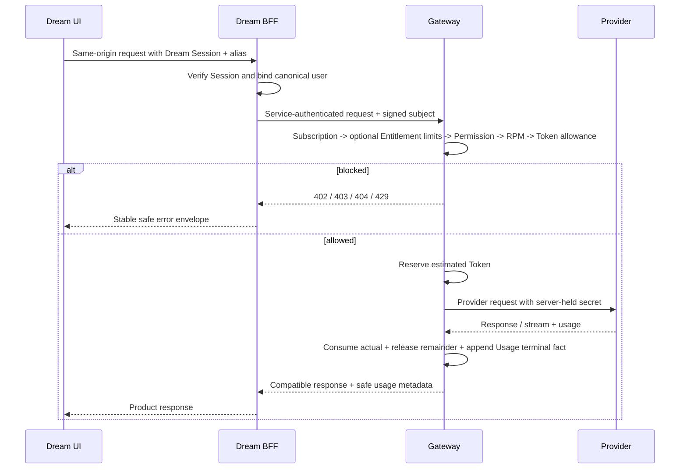
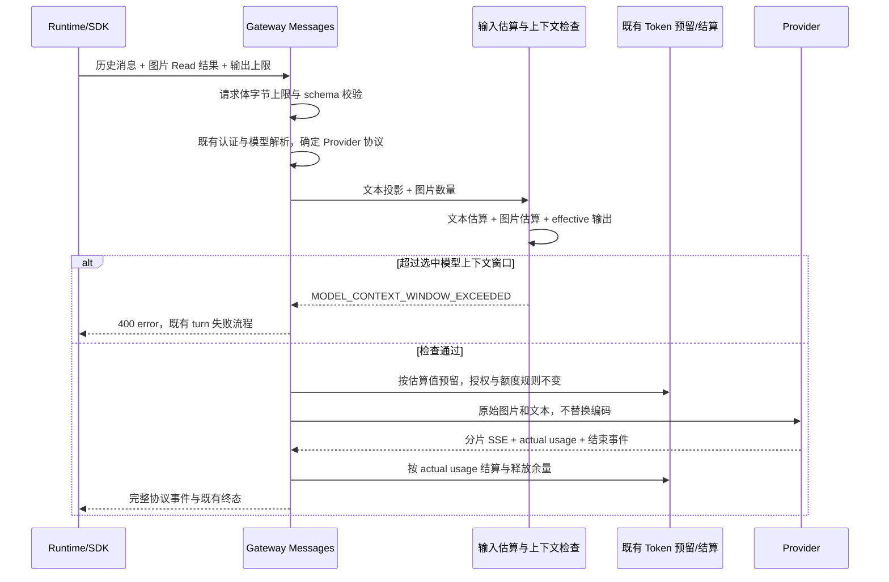

<!-- [Input] Authenticated Dream inference, model catalog, and Gateway protocol rules. -->
<!-- [Output] Current model/Gateway interaction, input estimation, failure handling, and acceptance design. -->
<!-- [Pos] Dream-facing Gateway design; request lifecycle and actual settlement remain shared. -->
<!-- [Sync] 2026-09-13: separate protocol-image token estimates from encoding byte limits. -->
<!-- [Sync] 2026-09-17: align current Gateway callability with the approved allowance-only model contract. -->

# 03 · Model and Gateway Experience

> 2026-09-17现行合同：详细交互与Reader Testing见[06-model-catalog-and-default-subscription-plans](06-model-catalog-and-default-subscription-plans.md)。Admin `enabled=true`决定所有已登录canonical用户的可见目录；Subscription状态/周期、Permission、Provider/Pricing与Allowance决定逐模型callability。Plan Entitlement存在时提供更严格的模型级RPM/日/月Token限制，缺失本身不构成模型白名单拒绝。无订阅不再让目录消失，也不再映射为503。

> 文档状态：**Implemented client / Release candidate**（外部 Provider/user canary 待执行）
>
> 入口：Dream 创作/对话的模型选择器、`/story-workspace/subscription?view=models`、推理错误回执
>
> 操作者：已登录的 Dream canonical user
>
> 返回：[Dream 交互设计索引](README.md)

## 1. 页面目标与状态分层

### Current / Implemented

- Dream 已实现 Product model-catalog BFF/allowlist；订阅模型体验只使用 Admin 发布给当前用户的 alias/capability，不返回价格、currency、金额余额或现金兜底。
- server-only Gateway client、canonical-subject 服务认证、协议 adapter、canary 开关与 direct-fallback 禁止边界已实现并通过 mock/focused contract。
- 真实外部 Provider 与 PolyAgent/Claude Agent/Chat/Dream/Workflow 的逐角色生产 canary 尚未执行；静态设置项若仍存在不得被视为可执行真值。

### Target

- Dream 只显示 Admin 产品 API 对当前 canonical user 返回的模型 alias/capability，不暴露 Provider 路由、真实 model ID 或 Secret。
- Dream 服务端以受控服务身份和签名 canonical subject 调用 Gateway；Gateway顺序执行Subscription状态/周期→可选Entitlement限额→Model Permission→RPM/Token limit→月度Token Allowance。
- 订阅 Token 不足直接返 402；不在 Dream 推理路径展示或触发现金补扣、金额超额、充值或 Payment。

### Release Gate

代码级 Gateway client/focused contract 已通过；本节“所有推理入口走 Gateway”仍要求外部 Provider/user canary、真实 stream/cancel/usage-missing 观测和生产 Secret 注入回执，不能由 mock 测试替代。

- 静态型号与默认 fallback 被删除；Admin catalog/Gateway 不可用时显示真实 503。
- Browser bundle、DOM、Storage、Network 与日志无 Gateway Key、Provider endpoint/secret 或服务身份。
- 所有推理入口走 Gateway；资格判断在 Provider 调用前完成，Usage 终态可追溯。
- 1440×1000、390×844、键盘、读屏与全部错误状态 E2E 通过。

## 2. Model Catalog 合同

Dream BFF `GET /api/story-workspace/models` 服务端调用 `GET /api/product/v1/me/model-catalog`。每项字段白名单：

```json
{
  "modelAlias": "dream-balanced",
  "displayName": "Balanced",
  "description": "Balanced quality and latency for story generation.",
  "capabilities": ["text", "stream", "tool_use"],
  "contexts": ["story_generation", "assistant_chat"],
  "eligibility": {
    "allowed": true,
    "reasonCode": null,
    "subscriptionStatus": "active",
    "gatewayScopes": ["story.generate"],
    "rpmLimit": 30,
    "monthlyTokenRemaining": 759000,
    "monthlyTokenResetAt": "2026-09-09T10:00:00Z"
  },
  "availability": "available",
  "asOf": "2026-08-09T10:05:00Z"
}
```

不得返回 Provider 名称、endpoint、credential reference、真实路由 model ID、内部 Pricing ID、价格、currency、cash balance 或 Payment 状态。用户可见 `monthlyTokenRemaining` 只用于资格提示，最终预留仍由 Gateway 在请求事务中决定。

“Auto”只能是Admin发布且实时callable的真实routing alias，具有明确capability；前端不能通过空值、本地Provider列表或错误fallback自行选型。Product catalog中的Plan权益投影不能替代Gateway目录授权。

## 3. Gateway 请求合同与流

Browser 只调用 Dream 同源生成/对话 BFF。BFF 从 Session 获取 canonical user，不接受客户端 user ID，并将下列安全业务输入送往 Gateway：

- `model`：已发布 alias；
- 用户输入与必要业务上下文；
- 协议参数白名单；
- 服务端签名的 subject/audience/timestamp/nonce；
- 安全 `requestId` 与幂等/取消关联。



资格判断固定顺序：

1. canonical user 存在且 Session subject 一致；
2. Subscription 状态允许 Gateway；
3. Model alias为Admin `enabled=true`并且Provider/Pricing可用；
4. Entitlement存在时，请求Scope与模型级RPM/日/月Token限制必须匹配；缺失时记录`allowance-only`而不伪造Entitlement；
5. 显式Model Permission未拒绝，RPM/Token window未超限；
6. 当前用户个人周期Token Allowance足够预留；
7. Provider路由健康且Secret可解密。

任一步阻断都不得调用 Provider。Provider Pricing 可作为平台内部成本域存在，但 Dream 不接收或展示其价格窗口，也不能把它误认为套餐生效日。

### 3.1 图片读取后的上下文检查

**背景与问题**：2026-09-13 本机图片 Read 后记录了 Gateway
`400 MODEL_CONTEXT_WINDOW_EXCEEDED`，随后 Runtime 输出 API error 并结束。
该终态与网络中断不同。原估算直接以完整 JSON UTF-8 字节数除以 3，
把 PDF 页面图片和后续 Read 图片的 base64 当作文本 Token；历史图片在后续
请求中再次发送时，会错误放大输入估算、上下文检查以及 Token 预留。
文件大小、SDK 单条消息缓冲区、模型上下文窗口是三个不同的技术边界。

**目标与边界**：修复图片编码影响估算的问题，不提高上下文窗口、不自动换模型、
不裁剪图片或历史、不重放推理、不变更 Thread/resume/cancel/SSE 状态机，
不新增数据库字段或迁移。大文本、Bash 打印的 base64、工具参数仍按文本检查。

**概念与规则**：

- `prepareGatewayRequest` 复用既有认证与模型查询，解析选中 Provider 协议后
  调用服务端输入估算回调；原数字型调用仍保持原校验方式，不新增一次模型查询。
  `estimateInputTokens` 只生成估算投影，不修改原始请求或持久化内容。
- Anthropic 的消息内容、system 内容及 `tool_result.content` 数组中的标准
  `image`/`source`，OpenAI 消息内容中的标准 `image_url`，分别按图片估算。
  每张图片都计数；base64、URL 和 file reference 不按其编码长度估算文本。
- 仅当公开请求与选中 Provider 协议一致时采用图片估算。现有跨协议转换器
  可能将图片工具结果序列化为文本；此时必须保留原 JSON 字节估算，不能低估
  实际发送的文本。跨协议图片转换功能不属于本次修复。
- 文本、字符串工具结果、tool input、tool schema 和 response format 保留
  原来的 JSON UTF-8 字节数除以 3 规则。不得递归清除任意对象的 `data` 字段，
  不解析文本内打印的 JSON。未知或不完整图片格式、二进制 document 仍沿原规则；
  本次不扩展文档解析、跨协议图片转换或模型图像能力。
- `GATEWAY_IMAGE_INPUT_TOKEN_ESTIMATE` 是服务端每张图片的预留估算：default
  为 `4784`，来源是 [Claude 官方视觉预算说明](https://platform.claude.com/docs/en/build-with-claude/vision)。
  不同 Provider 的视觉分词不同；该值不宣称是所有模型的精确消耗或能力上限，
  运维应按实际 Provider 调整。desired 来自启动环境，effective 为本次合法解析值；
  无动态 revision。需要图片估算时，配置必须是正安全整数，非法配置返回 503；
  组合溢出返回 400。无图片及跨协议请求不应用该图片估算配置。
- 图片编码仍完整计入 `GATEWAY_MAX_BODY_BYTES`；上下文检查仍比较估算输入加
  effective 最大输出与选中模型的 context window。预留仍使用估算值，
  完成后的实际消耗仍来自 Provider `usage`，不是图片估算值。
- 原生 Anthropic `count_tokens` 继续调用 Provider；OpenAI Provider 对 Anthropic
  count 请求的既有本地估算 fallback 保留原 JSON 字节规则，符合上述跨协议边界。
- 真正上下文超限时按既有 error 通道反馈并保留 partial 内容，不显示为成功，
  也不把 HTTP 200 或已经出现工具结果当作完整 turn 成功。



**影响范围与方案评审**：修改 Gateway Messages/Chat 的输入估算及 prepare 中的服务端
估算调用时机；原生 count 与跨协议本地 fallback 行为不变。
不修改 Dream Python SDK/Runtime 版本、MCP Apps descriptor、资源读取或 App 宿主。
复用现有 parse/prepare/proxy/settlement，不新增 tokenizer 服务、图片下载、
全局 buffer 扩张或新的恢复分支。前端原有 Terminal 会显示工具返回的 JSON；
隐藏 base64 或新增图片展示属于另一项 UI 改动，本次不改该行为。

**验收**：`input-token-estimate.test.ts` 覆盖直接/嵌套图片、大小变化、URL/file、
OpenAI、跨协议保守估算、字符串/参数/schema 不被误清除、配置与组合溢出。
`image-read-flow.test.ts` 经公开 Messages handler、真实估算/prepare/proxy，
用合成十页历史与两张新图片验证原算法超限、新算法可完成分片 SSE，
Provider 请求图像不变且按实际 usage 结算；大文本及跨协议图片工具结果文本
仍在调用前按原规则返回 400，原生 count 及跨协议 count fallback 不变。
授权、预留、Provider 网络与持久化由测试依赖注入，不使用真实用户文件或模型。
这是 Provider-free 技术合同验证，不能替代正常 Dream/Admin/PG 真实业务复验。

## 4. 模型选择交互

### 4.1 页面结构与字段

| 区域 | 内容 | 控件 | 规则 |
|---|---|---|---|
| 当前选择 | displayName、alias、availability | labelled combobox | 必须来自 catalog；没有隐式默认 |
| 模型选项 | 名称、说明、capabilities、contexts | searchable listbox | 不显示 Provider、价格或内部 model ID |
| 权益提示 | subscription status、Scopes、RPM、monthly Token remaining/reset | definition list | 只读；Token 明确单位 |
| 不可用原因 | stable reasonCode + 用户文案 | inline callout | 选项可见但 disabled 时仍可读原因 |
| 刷新 | catalog `asOf`、数据健康 | Refresh button | 刷新失败保留 stale 标签，不冒充最新 |

### 4.2 选择规则

- 页面初次加载等待 catalog 后再决定当前值；已保存 alias 不再可用时显示 404/403 callout 并要求用户重选。
- 可搜索字段仅为 displayName/alias/capability；服务端返回的 eligibility 是真值。
- 切换 alias 只改变后续请求，不修改 Plan/Entitlement，不触发套餐、金额或支付操作。
- Token 接近耗尽可显示 API 返回的阈值提醒，但前端不预扣、不用平均字符数估算精确请求 Token。
- 模型配置如果需要保存，使用严格 schema 和 optimistic version；409 时保留用户选择并显示服务器新状态。

## 5. 推理进行中与终态

| 阶段 | UI 行为 | Token 行为 |
|---|---|---|
| Preparing | 显示模型 alias 与取消入口 | Gateway 原子预留预计 Token |
| Streaming | 增量渲染，状态文字不只 spinner | `reserved` 保留；UI 不显示本地猜测消耗 |
| Completed | 标记完成并安全刷新 Usage 摘要 | 消费实际 Token，释放余量，追加完成事实 |
| Cancelled | 保留已收到内容并标记取消 | 记录已知实际 Token；释放未用预留 |
| Provider failed | 显示安全错误与 request ID | 按已知 usage 结算；未知则标记 unknown |
| Stream interrupted | 不显示“成功”或 0 Token | 用 request ID 查终态；结果未知可恢复 |

Dream 不从客户端响应长度反算 Token，也不因请求失败删除 Usage 事实。

## 6. 错误状态与恢复

| HTTP | 含义 | UI 文案/行为 | 恢复 |
|---|---|---|---|
| 401 | Session 无效 | 不渲染 catalog 或推理内容 | 登录后返回原安全路由 |
| 402 `SUBSCRIPTION_TOKEN_ALLOWANCE_EXHAUSTED` | 当前个人周期 Token 不足 | 显示 `availableTokens/requiredTokens/periodEnd`，不显示金额或充值 | 查看套餐或等待周期重置 |
| 403 | Subscription、存在时的Entitlement限额、Scope或Model Permission不允许 | 说明受阻条件，不泄露隐藏路由；缺Entitlement本身显示`allowance-only`而不是403 | 打开订阅权益、恢复订阅或重选允许模型 |
| 404 | alias 不存在、已下线或对象不可见 | 清除失效选择，不自动 fallback | refetch catalog 后重选 |
| 409 | 保存版本、幂等或状态冲突 | 保留输入与选择，显示服务器新状态 | 重新确认后提交 |
| 429 | RPM/Token 窗口限流 | 显示 window/current/limit/remaining 与 `Retry-After` | 计时后手动重试，不自动换模型 |
| 502 | Provider 上游或协议失败 | 显示安全上游错误与 request ID；本地 Request/Token settlement 必须有确定终态 | 按 retryable 提示手动重试，不切换直连 Provider |
| 503 | Admin/Gateway/PG/配置/维护不可安全服务 | 分区错误 + request ID；不回退直连 Provider | 按 Retry-After 重试 |
| Stream unknown | 连接中断且终态未知 | 保留已收到内容并标记“结果待确认” | 用 request ID 查询；不重复发送 |

402 是个人月度总额度不足；429 是短窗口限流。两者的 code、单位、文案和恢复动作不得混用。

## 7. Secret 与内容安全

- Gateway Key、Provider Secret、Provider endpoint、服务身份、签名 nonce 内部材料永不进入浏览器 bundle、DOM、Storage、analytics、普通日志或截图。
- 用户 prompt/response 不进入用量 API、订阅上下文或错误 details；request ID 只提供可追溯链接。
- Dream BFF 不允许浏览器指定 canonical user，也不将浏览器 `Authorization` 原样转发 Provider。
- 错误不返回 raw Provider payload、stack、SQL、上游 header 或密钥前后缀。

## 8. 响应式与无障碍

### 1440×1000

- 模型 selector 与当前权益在工作区工具栏或设置面板中平面分组；展开 listbox 不遮住错误摘要。
- 目录详情采用两栏：capability/contexts 与 Scope/RPM/Token；不创建营销卡片墙。
- 生成状态与取消入口保持稳定，stream 内容滚动不导致工具栏跳动。

### 390×844

- Selector、eligibility、Token 提示单列；listbox 以全宽 Popover/Drawer 呈现，选项至少 44px。
- 错误与 Retry-After 位于生成区之前，底部操作不遮挡最后一行或 safe area。
- 长 alias/request ID 可换行或截断配复制按钮，无 document 横向溢出。

### 键盘、焦点、Label 与读屏

- Combobox 按 ARIA pattern 实现：label、expanded、controls、activedescendant、方向键、Enter、Escape 完整。
- Disabled 选项仍能通过关联 description 读取不可用原因；不能只用灰色表示。
- 生成开始/完成/取消/错误进入单一 `aria-live=polite`；流式每个 token 不逐字公告。
- 错误摘要可程序聚焦；Drawer/Popover 关闭后归焦 selector；200% zoom 与 reduced motion 可用。

## 9. 可自动化验收

- `DREAM-GTW-01`：所有推理入口走 Gateway；直连 Provider/静态默认型号/失败 fallback 的调用计数为 0。
- `DREAM-GTW-02`：Browser bundle/Network/DOM/Storage/log 扫描无 Gateway Key、Provider endpoint/secret、服务 credential 或用户替换 header。
- `DREAM-GTW-03`：catalog 只含 alias/capability/eligibility/Token 权益，不含 Provider route、价格、currency、cash balance 或 Payment。
- `DREAM-GTW-04`：Subscription、存在时的 Entitlement 限额、Permission、RPM、Token window、月度 Token Allowance 各阻断点返回正确 402/403/404/429；缺少 Entitlement 进入 `allowance-only`，实际资格拒绝均在调用 Provider 前停止。
- `DREAM-GTW-05`：Token 不足只返 402 token details，不检查或扣除现金，不自动切换模型。
- `DREAM-GTW-06`：success/failure/cancel/stream interruption/unknown usage 都产生确定或明确 unknown 的 Usage 终态，UI 不将 unknown 显示 0/成功。
- `DREAM-GTW-07`：loading/empty/401/402/403/404/409/429/502/503 和 stream unknown 均有恢复动作且无静态 fallback。
- `DREAM-GTW-08`：1440×1000 与 390×844 下 selector/listbox/stream/error 无横向 overflow；键盘、焦点、label、live region、200% zoom 通过。
