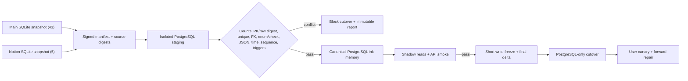

# 05 · Migration, Maintenance and Error States

> 文档状态：**Implemented runtime / Release candidate**（真实生产数据 cutover 仍 Planned）
>
> 入口：产品内维护 Banner、`/maintenance`（用户安全页）、隔离环境 migration receipt（发布操作员）
>
> 操作者：Dream canonical user、发布/值班操作员；二者视图权限隔离
>
> 返回：[Dream 交互设计索引](README.md)

## 1. 目标与状态分层

### Current / Implemented

- Dream main/Notion 运行时已是 PostgreSQL-only，具备 psycopg pool、UoW、独立 Alembic head 与 fail-fast；SQLite 构造仅保留在 legacy catalog、显式只读迁移 CLI 和测试边界。
- Dream-owned 43+5 migration CLI 已覆盖只读 Online Backup、manifest、48 staging、六波 import、冲突阻断与 count/PK/FK/unique/check/JSON/time/sequence/trigger 验证；Admin 三表导入器仍只作为 3/48 安全模式参考。
- 目标 **48 表 / 569 列 / 81 索引 / 25 trigger** 的空库、exact-adopt 与 drift fail-closed 已在 owned disposable PG 验证。

### Target

- 带可复核 manifest 地将 SQLite 43+5 迁入单一 PostgreSQL `ink-memory`；对已存在 canonical 三表 baseline adopt，不重建/覆盖。
- 短暂停写后 cutover；运行时只允许 PostgreSQL，出错 fail-fast/进维护，不回退 SQLite、JSON DB、文件数据库或内存业务真值。
- 产品用户看到准确的影响范围、预计时间、当前模式和恢复动作；发布操作员在隔离环境看到表级验证回执，但不看业务行内容/Secret。

### Release Gate

代码/隔离门禁已通过 backend 1,679 passed/14 skipped + 652 subtests；frontend lint 0 errors/21 warnings、build、Product API 9/9 与订阅 Playwright 4/4。本地 `ink-memory` 已完成真实源/备份/cutover；角色矩阵在 clone 通过，其他生产环境仍须独立执行。

- 43+5 每表 DDL、Repository、owner、迁移 manifest 与 row/constraint/trigger 验证完成；25 个不可变 trigger 语义重建并有 mutation rejection 测试。
- 行数、PK/row digest、unique、FK orphan、check/enum、JSON、time、sequence/identity、partial unique、trigger 全通过；任一冲突默认阻断。
- FastAPI 启动期遇到 `INK_DATABASE_PATH/INK_AGENT_NOTION_DB_PATH` 运行时路径或 PG 缺失立即失败；无 SQLite/JSON/内存 fallback 测试通过。
- 所有演练/测试只用明确命名、可删除的临时 PostgreSQL 或显式 `TEST_DATABASE_URL`；未连接共享/生产库。
- 1440×1000/390×844 的维护、只读、依赖失效和错误恢复 E2E 通过。

## 2. 43+5 迁移流



迁移窗口不采用长期双写。PG 已有新业务写后默认前向修复；只有预先演练、通过 digest 校验的 PG→SQLite delta exporter 才能回切 SQLite。否则回滚只能切换到“旧功能集 + PostgreSQL Repository”构建，不得丢弃 PG 新写。

## 3. 迁移模式与用户体验

| 模式 | 产品行为 | 页面呈现 | 允许动作 |
|---|---|---|---|
| `normal` | 正常 PostgreSQL 读写 | 无维护 Banner；页面显示各自 `asOf` | 正常 |
| `scheduled_maintenance` | 尚可读写，即将停写 | 可关闭 Banner；开始/结束、影响、时区 | 提前保存，不启动长 Workflow |
| `write_freeze` | 业务写返 503；经验证的读可用 | 常驻 Banner + 表单只读；显示下次状态检查 | 刷新、查看已持久事实；禁止提交 |
| `cutover_validating` | 关键读可能暂停 | `/maintenance` 全页；不渲染 stale 可编辑数据 | 手动重试、安全退出 |
| `canary` | 部分用户已切 PG/Gateway | 不暴露内部 cohort；只显示真实服务状态 | 正常；异常进前向修复 |
| `degraded_read_only` | 仅允许经审批的读 | 高优先级 Banner；每个数据分区显示 `asOf/stale` | 刷新/查看；无写 |
| `unavailable` | PG/Admin/Gateway 不能安全服务 | `/maintenance` 与 request ID；不加载假数据 | 按 Retry-After 手动重试 |

模式必须来自服务端签名/受控的运行状态，不由前端 feature flag 单方面宣告迁移成功。维护结束后页面必须 refetch 新 PG 事实，不把维护前缓存作为当前值。

## 4. 安全状态 API

Dream 同源 `GET /api/story-workspace/availability` 聚合 Dream PostgreSQL 连接、Admin 产品 API 和 Gateway 的用户安全健康状态：

```json
{
  "data": {
    "mode": "write_freeze",
    "startedAt": "2026-08-09T10:00:00Z",
    "expectedNextUpdateAt": "2026-08-09T10:10:00Z",
    "affectedCapabilities": ["story_write", "subscription_command", "gateway_request"],
    "readCapabilities": ["subscription_context", "usage_history"],
    "message": "Scheduled data migration is validating.",
    "retryAfterSeconds": 300
  },
  "meta": { "requestId": "req_..." }
}
```

该 API 不暴露 DSN、database host/name/role、migration SQL、owner/ACL、table name、row count、stack trace、Provider config 或 Secret。生产监控与操作员 receipt 使用独立管理权限，不复用产品用户 API。

## 5. `/maintenance` 页面设计

| 区域 | 字段/控件 | 规则 |
|---|---|---|
| 状态 | mode、人类可读标题、开始时间 | 文字+图标；不只依赖颜色/动画 |
| 影响 | affectedCapabilities/readCapabilities | 按用户任务翻译：写日记、Dream Session、订阅命令、用量查询 |
| 时间 | startedAt、expectedNextUpdateAt、retryAfter | 显示时区；预计时间标记“下次更新”而不伪装修复 ETA |
| 恢复 | Retry、Return to safe page、Sign out | Retry 受 Retry-After 限制但可聚焦；不自动重载输入草稿 |
| 支持 | request ID、安全联系方式 | Copy 具有 accessible name；不包含内部 trace/Secret |

如用户在提交时进入 write freeze，界面保留未提交草稿在当前运行时状态中，但不把草稿存为替代数据库。恢复后重新获取服务器 version，冲突返 409，由用户合并/重试。

## 6. 发布操作员 migration receipt

该 receipt 只在显式隔离的临时 PostgreSQL 演练中生成，是不可变报告而非可编辑 CRUD。页头必须显示：

- 环境名、显式 `TEST_DATABASE_URL` 安全判定结果、执行时间、commit/build ID；
- source snapshot ID/digest（不含路径中的用户 Secret）、manifest version；
- 43 主表 + 5 Connector 表的 coverage total，baseline-adopt 三表状态；
- owner/ACL 只读 preflight 是否通过；未授权时“未执行”，不冒充通过；
- 验证总结和 blocker 数量；通过/失败表级列表。

表级行：`table/wave/ddl/repository/sourceCount/stagingCount/targetCount/pkDigest/rowDigest/unique/fk/checkEnum/json/time/sequence/trigger/owner/result`。各项为 status+安全 detail，不显示实际业务行、密码 hash、Token、日记正文、OAuth ciphertext 或连接字符串。

Conflict report 默认只显示对象类型、安全 hash/行号、规则和数量；用户数据调查是另一个最小权限流程。页面只允许下载脱敏 receipt，不允许“忽略冲突并继续”。

## 7. 统一错误 code 与产品恢复

| HTTP / stable code | 用户安全语义 | 产品恢复 | 迁移/运维行为 |
|---|---|---|---|
| 401 `PRODUCT_AUTH_REQUIRED` | Session 需重新验证 | 登录后返回原安全路由 | 不渲染保护数据；服务认证不得降级匿名 |
| 402 `SUBSCRIPTION_TOKEN_ALLOWANCE_EXHAUSTED` | 当前个人订阅周期 Token 不足 | 显示 `metric=tokens/unit=tokens/availableTokens/requiredTokens/periodEnd`，查看订阅 | 与 PG 连接故障和 429 短窗口限流区分；不转现金兜底 |
| 403 `SUBSCRIPTION_ACTION_FORBIDDEN` | 当前状态不允许动作 | 刷新 subscription + allowedActions | 不直接修表解锁 |
| 403 `ENTITLEMENT_REQUIRED` | 缺少 scope/model 权益 | 查看 Plan/Entitlement | 不回退旧直连 Provider |
| 404 `PLAN_NOT_FOUND` | Plan Version 已不可用 | 刷新真实 Plan 列表 | 不渲染静态 Plan |
| 404 `SUBSCRIPTION_NOT_FOUND` | 当前无订阅/对象不可见 | 返无订阅空状态 | 不手工创建 billing user |
| 404 `GATEWAY_MODEL_NOT_FOUND` | alias 不存在/已下线 | 刷新 model catalog 并重选 | 不使用静态默认型号 |
| 409 `IDEMPOTENCY_CONFLICT` | 同 key 对应不同 payload | 保留输入，显示 operation ID，人工确认 | 不 upsert 覆盖，不重复创建周期或发放 Token |
| 409 `VERSION_CONFLICT` | 读取后对象已变 | 载入服务器新版本、重新 preview | 不跳过乐观版本 |
| 409 `SUBSCRIPTION_STATE_CONFLICT` | 生命周期状态竞争 | 刷新当前状态/allowedActions | 不直接写表矫正 |
| 429 `PRODUCT_RATE_LIMITED` | 产品/Gateway 限制 | 显示窗口与 Retry-After | 不无界自动重试 |
| 503 `PRODUCT_DEPENDENCY_UNAVAILABLE` | PG/Admin/Gateway/配置或维护不可用 | 进 `/maintenance`，按 Retry-After 手动重试 | 默认阻断写；绝不切 SQLite/JSON/内存 fallback |

API 错误 envelope 至少包含 `error:{code,message,details?},meta:{requestId,retryAfterSeconds?}`。`details` 是 code 对应的白名单数值/单位；禁止 SQL、DSN、stack、raw provider response 或 Secret。订阅与迁移产品 API 不返回金额、Balance 或 Payment 字段。

## 8. Loading、Empty 和错误状态

- Loading：Banner 区域不导致 layout shift；`/maintenance` 保留标题/影响区骨架，不显示“即将恢复”。
- Empty：availability API 正常但无 incident 时返业务页；migration receipt 无演练时显示“尚无报告”，不显示 48/48 通过。
- 403：普通用户访问 operator receipt 不显示任何表/环境元数据，返回安全维护页。
- 409：migration validation 冲突是发布 blocker，不有“继续”按钮；产品草稿冲突保留两版信息并由用户选择。
- 429：页面仅运行一个可取消的 retry timer；切换页面/恢复正常后清理。
- 503：给出具体用户能力影响和数据 `asOf`；不加载静态 Plan、假 Token、假模型或 SQLite fallback。

## 9. Secret、权限与数据安全

- 迁移/健康 UI 不显示 `DATABASE_URL/TEST_DATABASE_URL`、host/port/password、database role、Gateway/Provider/System Secret、Session secret、OAuth token/ciphertext 或密码 hash。
- receipt 使用 source/row digest 而非实际内容；日志仅记步骤、数量、结果、安全对象 ID 和 request/run ID。
- PostgreSQL owner/ACL/constraint/现有数据仅做迁移前只读检查；UI 不提供 `ALTER OWNER`/GRANT/REVOKE 按钮，文档逻辑所有权不是执行授权。
- 禁止在未知/共享数据库执行 DROP/TRUNCATE/DELETE/migration/fixture；隔离数据库删除是独立的、明确命名的测试清理流程。

## 10. 响应式与无障碍

### 1440×1000

- Banner 位于 Dream 顶栏下、业务标题上，不覆盖内容；高影响模式不可关闭，预告模式可关闭但导航保留状态点。
- `/maintenance` 主信息最大 720px，影响/时间/恢复清晰分组；没有装饰性动画或伪进度条。
- operator receipt 的 48 表列表在局部容器横滚，表头/表名 sticky，document 不横滚。

### 390×844

- Banner 保留状态、主要影响和“查看详情”；不用仅图标折叠关键信息。
- `/maintenance` 单列，Retry/Sign out 按钮不遮挡 request ID/错误；考虑 safe area 且无横向溢出。
- operator receipt 移动端按表分组为定义列表，优先显示 result/blocker/failed checks；不删除安全证据字段。

### 键盘/读屏

- Banner 首次出现时以 `role=status`，不抢走用户编辑焦点；立即停写/数据不安全使用 `role=alert`。
- 维护页 H1 可程序聚焦；Retry 完成后宣布实际新 mode，不在自动轮询每次公告。
- receipt 表格有 caption、`scope=col`、状态文字；失败摘要提供跳到第一个 blocker 的链接。
- 焦点样式在高对比/200% zoom 下可见；`prefers-reduced-motion` 下取消所有不必要状态过渡。

## 11. 可自动化验收

- `DREAM-MIG-01`：manifest 精确覆盖主库 43 + Connector 5，三表 baseline adopt 不重建；每表 DDL/Repository/owner/import/validator 状态可追溯。
- `DREAM-MIG-02`：行数、PK/row digest、unique、FK orphan、check/enum、JSON、time、sequence、partial unique、25 trigger 任一失败阻断 cutover，界面无“忽略继续”。
- `DREAM-MIG-03`：启动/运行时 PG 不可用时返 `PRODUCT_DEPENDENCY_UNAVAILABLE`；SQLite/JSON/内存数据库打开计数为 0。
- `DREAM-MIG-04`：只在显式隔离 `TEST_DATABASE_URL` 演练；指向 runtime/shared/5433 或未知库时在任何 DDL/DML 前 fail。
- `DREAM-MIG-05`：scheduled/write_freeze/validating/canary/degraded/unavailable 的影响、允许动作、`asOf` 和恢复行为与服务端一致。
- `DREAM-MIG-06`：401/402/403/404/409/429/503 稳定 code 与字段/单位精确；402 只使用 Token 合同，response 不含金额、Payment、SQL/DSN/stack/Secret。
- `DREAM-MIG-07`：维护前草稿不被当作数据库 fallback；恢复后先 refetch version，冲突以 409 恢复。
- `DREAM-MIG-08`：1440×1000 与 390×844 的 Banner、`/maintenance`、receipt 无横向 document 溢出，键盘/读屏/焦点/状态公告通过。
