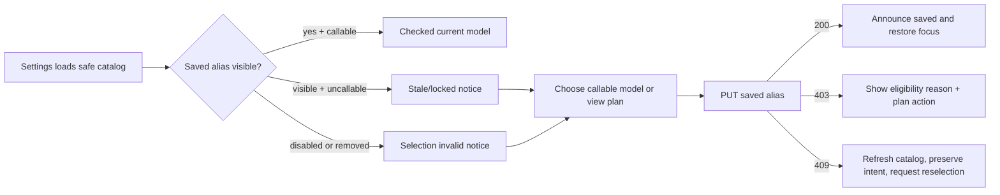
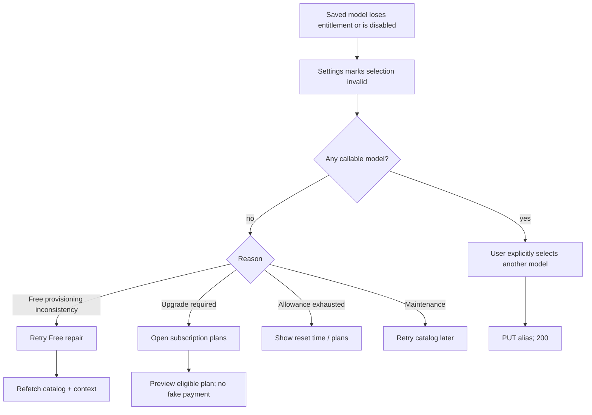
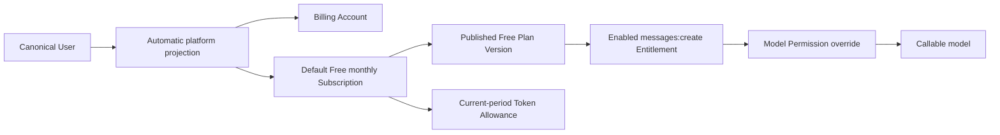
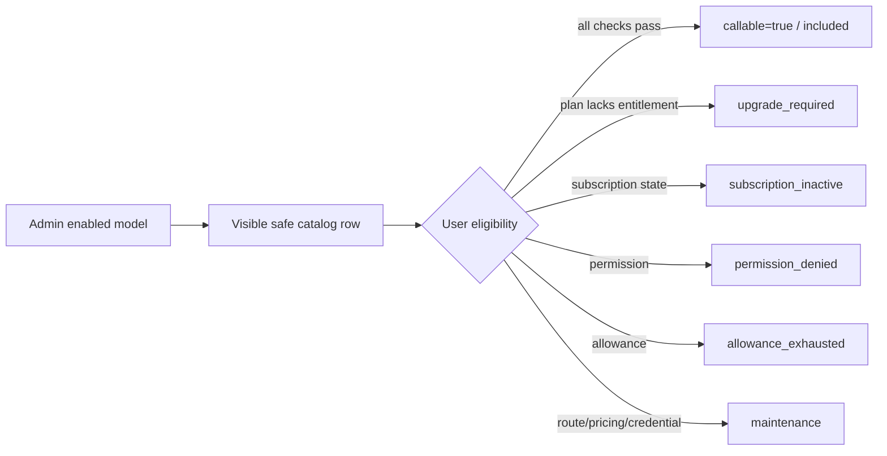
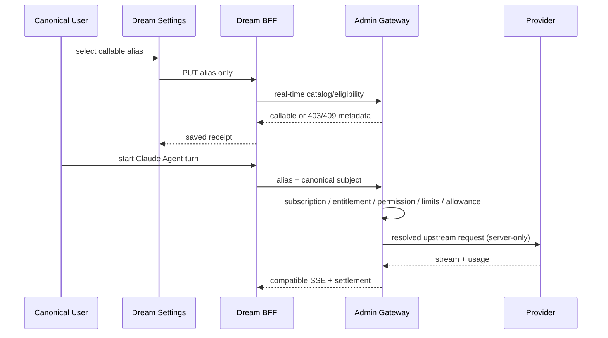
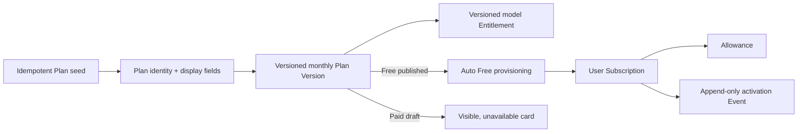

# 06 · Model Catalog & Default Subscription Plans

> 文档状态：**Approved for implementation**  
> 更新日期：2026-08-09  
> 操作者：已登录 Dream canonical user；Admin model/plan operator 仅在受保护 Admin 页面操作  
> 根因证据：[`ink-memory-model-catalog-default-free-root-cause.md`](../../verification/ink-memory-model-catalog-default-free-root-cause.md)

## 1. 产品目标与不可变边界

本设计解决两个彼此相关但不能混成一件事的问题：用户能看到平台提供的哪些模型，以及用户当前能调用其中哪些模型。

- Admin Registry 中 `enabled=true` 的 platform model alias 构成 Dream **可见目录**。
- canonical user、Subscription、published Plan Version、Entitlement、Model Permission、RPM/Token limit 和当前周期 Token Allowance 构成每个模型的 **调用资格**。
- 可见不等于可调用。升级、暂停、额度耗尽、模型维护都不能让模型从目录中消失。
- Dream 浏览器只访问 Dream BFF；BFF用 server-only service identity + canonical-subject JWT读取Admin公共目录。
- Admin Registry页面仍要求Admin Session，Admin API仍要求permission；普通用户不会获得Admin页面或CRUD能力。
- Provider Secret、Gateway Key、upstream model、Provider route/base URL、Pricing rule、密钥前缀永不进入公共DTO、DOM、Storage或日志。

## 2. 用户与数据真值

| 对象 | 权威来源 | Dream用途 | 浏览器可见 |
|---|---|---|---|
| canonical user | PostgreSQL `users` | 当前Session主体 | 只显示当前用户产品状态，不接受身份覆盖 |
| model visible | Admin `ai_models.enabled` | 设置页全部选项 | alias/name/protocol/capability/limits |
| model callable | Admin Gateway eligibility evaluator | 锁定、原因、选择与推理 | boolean +安全availability + required plan |
| current plan/allowance | Admin Product API | 订阅页与设置上下文 | plan code/name、Token守恒、周期 |
| plan display copy | Admin Plan正式字段 | 三套餐叙事层级 | eyebrow/name/note/details |
| Provider route/secret | Admin only | server-side inference | 永不公开 |

## 3. 安全公共模型合同

Dream BFF接受并再次strict-validate以下安全投影：

```ts
type PublicGatewayModel = {
  modelAlias: string;
  displayName: string;
  protocol: 'anthropic' | 'openai';
  capabilities: Record<string, boolean>;
  contextWindow: number | null;
  maxOutputTokens: number | null;
  enabled: true;
  callable: boolean;
  availability:
    | 'included'
    | 'upgrade_required'
    | 'subscription_inactive'
    | 'allowance_exhausted'
    | 'permission_denied'
    | 'maintenance';
  requiredPlanCode: string | null;
  upgradeHint?: string | null;
};
```

禁止字段示例：`providerId/providerCode/baseUrl/upstreamModel/apiKey/keyPrefix/pricingRule/cost/credentialRoute`。strict validator遇到未知字段必须fail closed为502，不能把未知字段透传浏览器。

### 3.1 availability优先级

同一模型若同时命中多个原因，按安全、可恢复性和用户行动排序：

1. `maintenance`：模型虽enabled，但Provider不可路由、credential不可用或没有有效Pricing；不提供虚假套餐。
2. `permission_denied`：用户级Model Permission显式禁用。
3. `subscription_inactive`：存在Subscription但状态/周期不可调用，或默认Free自动修复失败。
4. `upgrade_required`：当前Plan无Entitlement，但存在一个可公开且可开通的required Plan。
5. `allowance_exhausted`：模型和权益已包含，但当前周期Token不足。
6. `included`：全部实时资格满足；`callable=true`。

目录请求在1–5均返回200。实际推理仍依次返回403、402、429、502/503等业务状态，不能只信目录缓存。

## 4. 模型设置页

### 4.1 页面目标

用户在不理解Provider内部路由的前提下，知道平台有哪些模型、自己为什么能或不能用，并只保存当前实时callable的platform alias。

### 4.2 信息层级

1. 标题“创作模型”与一句低干扰说明；
2. 当前选择摘要：display name、alias、当前套餐、实时状态；
3. `fieldset + legend`模型卡片列表；
4. 锁定模型的原因、required plan和“查看套餐”；
5. 页面级catalog错误与重试；
6. stale selection恢复条。

每张模型卡片显示：

- 显示名称与alias；
- protocol和启用capabilities；
- context window / max output；
- `可使用 / 需要升级 / 订阅未生效 / 本周期额度不足 / 无模型权限 / 维护中`；
- 当前套餐来自Subscription context；required plan只来自Admin catalog；
- callable模型使用radio；uncallable模型保留在同一列表，radio disabled但“查看套餐/了解原因”仍可聚焦。

### 4.3 选择与保存



- 保存前端不提交Provider或upstream model，只提交alias。
- 保存API重新读取实时资格；页面加载时的`callable=true`不构成授权。
- 403用于用户仍可见但从未有权限/需要升级；409用于已保存或刚选择alias在并发中被停用/失权，需要重新选择。
- 保存成功触发same-tab config event；只影响下一次Claude Agent turn。现有进行中的turn不热切换模型。

### 4.4 模型失权恢复



系统不得暗中选择另一个高级模型。Claude Agent解析顺序仅为：保存且仍callable的alias → Free Plan明确配置的default alias → 结构化错误。

### 4.5 状态矩阵

| 状态 | 页面文案 | 主动作 | 焦点/播报 |
|---|---|---|---|
| loading | 正在读取平台模型 | 无 | 容器`aria-busy`; 不移动焦点 |
| enabled empty | 平台尚未启用模型 | 重试 | `role=status`；不是订阅错误 |
| no callable | 模型可见，但当前没有可调用模型 | 修复Free / 查看套餐 | 焦点到摘要；列出逐模型原因 |
| 401 | 登录已失效 | 重新登录 | `role=alert`，登录按钮 |
| 402 save/inference | 本周期Token不足 | 查看重置时间/套餐 | 保留选择；播报available/required |
| 403 | 当前套餐或权限不允许 | 查看套餐/联系管理员 | 原因与控件用`aria-describedby`关联 |
| 409 | 模型状态已变化，请重新选择 | 刷新并重新选择 | 保留用户意图，焦点到首个callable项 |
| 429 | 请求频繁 | 按Retry-After重试 | 倒计时不高频播报 |
| 502 | Provider/DTO异常 | 重试 | 不展示上游正文 |
| 503 | Admin或service identity不可用 | 重试 | 不回退静态模型 |

## 5. 订阅套餐页

### 5.1 品牌与布局

页面保持Dream现有暖纸张背景、Georgia标题、细边框、低饱和accent、tabular Token数字与充足留白。套餐不是后台resource row，而是叙事化的三章：

| code | eyebrow | name | note | details |
|---|---|---|---|---|
| `free` | A quiet beginning | Free | 从一段创作目标开始 | 查看已有Deck；发起有限次数的Dream；保留最近的工作台入口 |
| `dream` | For active stories | Dream | 给持续创作留出空间 | 更充足的Dream创作额度；更长的Dream Agent对话历史；优先体验新的创作工作台能力 |
| `is-dreaming` | For ongoing worlds | is Dreaming | 为长期作品准备的工作台 | 面向多部作品的持续创作支持；更完整的Deck与工作台协作空间；适合正在形成中的故事世界 |

这些字符串来自Admin Product API正式字段，前端无同名常量。

### 5.2 卡片状态

- **当前套餐**：左边缘低调accent、状态“正在使用”、展示真实Allowance/period；主按钮为当前允许的生命周期动作。
- **推荐套餐**：仅当Admin metadata明确推荐时显示“适合持续创作”，不能由前端按价格猜测。
- **可开通/可变更**：展示真实Token与真实价格；点击先进入preview，不立即改订阅。
- **暂不可开通**：Dream/is Dreaming没有published商业版本时仍显示完整文案，数值区显示“商业参数待发布”，按钮disabled并提供说明；不显示`US$0`或“免费”。
- **维护/无权限**：保留卡片，说明服务或资格原因。

### 5.3 桌面/移动

1440×1000：三卡片等宽横排，卡片顶部基线对齐；`eyebrow → name → note`在首屏，details有稳定最小高度；当前Allowance摘要位于卡片组上方或当前卡内部；preview使用宽dialog/drawer。

390×844：单列，顺序固定Free→Dream→is Dreaming；当前套餐卡优先在页面摘要中给出锚点，但不改变三卡语义顺序；卡片按钮满宽、details不折叠；dialog全屏并考虑safe-area。任何长alias/requestId使用`overflow-wrap:anywhere`，document级`scrollWidth <= clientWidth + 1`。

### 5.4 套餐数据状态

| 状态 | 产品表达 |
|---|---|
| loading | 三张稳定骨架，`aria-busy=true` |
| plan identities empty | 系统配置缺失；这是发布阻断，不显示本地三卡fallback |
| Free published, paid draft | Free可用；Dream/is Dreaming“暂不可开通” |
| context missing after auto-provision | “Free资格正在修复”，显式重试；不得误报503为无套餐 |
| network/503 | 保留页面壳，显示依赖错误和requestId；不展示缓存假状态 |
| no permission | 仍可读三套餐公开信息；命令区域说明为何不可操作 |
| maintenance | 卡片可读，开通按钮不可用；不显示假支付 |

## 6. 核心数据流程

### 6.1 默认Free资格



### 6.2 可见目录与callability



### 6.3 Settings到Provider



### 6.4 Plan seed到用户订阅



## 7. Admin操作与RBAC

- `AIModelRegistry`继续显示内部Provider和upstream model，因为它是Admin页面；这些字段不得进入Dream DTO。
- enabled toggle影响公共目录可见性并要求`models.write`；Dream用户不能调用该API。
- Plan/Version/Entitlement编辑继续要求`subscriptions.write`；published Version不可更新，必须新建版本。
- 默认seed/backfill是migration/system actor，不通过普通Dream请求开放任意Plan写入。
- 普通用户访问`/admin/models/models`被重定向登录或拒绝；普通Dream bearer token不等于Admin Session。

## 8. Reader Testing

### 8.1 第一轮发现

| 读者 | 首轮问题 | 修复 |
|---|---|---|
| 首次登录Free用户 | “无订阅”和“Free正在自动建立”容易被误写成服务503 | 增加`subscription_inactive`与“Free资格正在修复”状态，503仅保留依赖故障 |
| 历史无订阅用户 | 不清楚是否会覆盖旧记录 | 明确backfill只补缺，不覆盖paid/Allowance/Usage/Ledger/Event |
| 高级模型浏览者 | locked model若没有required plan会误导“升级即可” | maintenance优先于upgrade；无可验证套餐时不显示升级承诺 |
| 保存模型后被停用者 | 原草案可能暗中选Free默认，破坏用户预期 | 设置页要求显式重选；Free默认只用于从未有有效保存值的Claude Agent兜底，并返回可测试receipt |
| 键盘/屏幕阅读器用户 | disabled radio内部升级链接不可成为radio的一部分 | 锁定卡片把状态说明和独立可聚焦动作分离；radio通过describedby引用原因 |
| 移动端创作者 | 三卡片若按“当前优先”重排会破坏套餐比较 | 保持Free→Dream→is Dreaming语义顺序，在页头另给当前套餐锚点 |
| Admin运营者 | enabled可能被误解为“已可收费/可调用” | Registry与PRD明确enabled仅控制可见；另显示pricing/entitlement readiness |

### 8.2 第二轮验收

- 七类读者均能用一句话区分visible与callable。
- 所有错误状态都给出单一主动作和焦点目标；没有只靠颜色或hover的信息。
- draft套餐能显示正式文案但不会出现假价格、假开通或假支付成功。
- DTO禁止字段、Admin RBAC与server-only credential边界无歧义。
- 1440×1000与390×844的信息顺序、局部滚动和document无溢出标准明确。
- Reader Testing无剩余实现阻断项；阶段三可在新的Prompt Architect Round记录后开始。

## 9. 实现验收清单

- 全部enabled models对所有authenticated canonical users可见。
- 无Subscription目录为200；每项有callability metadata。
- Settings不可保存uncallable alias；stale selection为409并可恢复。
- Free Plan自动发布且至少一个priced/enabled/messages model；缺模型阻断migration/startup。
- 三Plan identity与展示字段来自Admin API；paid draft显示暂不可开通。
- 自动Free产生Subscription、Allowance、Event且backfill幂等；paid/history fingerprint不变。
- Claude Agent仍经Admin Gateway实时资格、reserve/capture/release。
- 两视口无overflow，键盘/读屏/焦点恢复与零app diagnostics通过。
