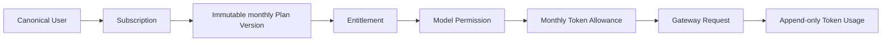

# Ink Dream Memory 产品用户交互设计

> 文档状态：**Planned**
>
> 更新日期：2026-08-09
>
> 适用范围：Dream 产品用户的 Token-only 月度订阅、用量、模型、Gateway 与 PostgreSQL 迁移维护体验
>
> 事实基线：[`ink-dream-memory-pg-billing-gateway-treatment-decision.md`](../../verification/ink-dream-memory-pg-billing-gateway-treatment-decision.md)
>
> 平台交互基线：[`refine-admin-ui-v3-interaction-design.md`](../refine-admin-ui-v3-interaction-design.md)

## 1. 文档地图

| 文档 | 产品面 | 当前状态 | 目标 |
|---|---|---|---|
| [01-subscription-experience](01-subscription-experience.md) | 套餐、个人月度周期、订阅生命周期 | Current 静态三档页 | 真实 Token-only Plan Version、Entitlement 与 Subscription |
| [02-usage-balance-and-overage](02-usage-balance-and-overage.md) | Token Allowance 与 Usage；文件名为兼容旧链接保留 | Current 无产品闭环 | 可追溯的 Token 发放、预留、消耗与释放 |
| [03-model-and-gateway-experience](03-model-and-gateway-experience.md) | 模型选择、Gateway 资格、推理错误 | Current 静态型号/直连 Provider | Admin 发布 alias + server-only Gateway + Token 资格判断 |
| [04-payment-adapter-states](04-payment-adapter-states.md) | 真实支付与订阅支付延期边界；文件名为兼容旧链接保留 | Deferred | 不提供可执行支付界面或合同 |
| [05-migration-maintenance-and-error-states](05-migration-maintenance-and-error-states.md) | 43+5 迁移窗口、维护、错误恢复 | Current SQLite 运行时 | PostgreSQL-only cutover 与可恢复状态 |

`Planned` 表示本目录是实现合同，不是已上线证据。页面只能在对应 Release Gate 通过后标记为 `Implemented`。

## 2. 本轮不可变产品决策

1. canonical PostgreSQL `users` 是唯一平台用户全集。每个平台用户天然具备订阅主体身份；Dream 不出现“创建计费用户”、“计费用户名册”、手工开户或独立 billing user。
2. 套餐是每位用户按自己订阅起点滚动计算的**月度 Token 规则**。周期由 `cycleAnchorAt/currentPeriodNumber/currentPeriodStart/currentPeriodEnd` 表达，不存在平台统一 `effectiveFrom/effectiveTo`。
3. Plan Version 只快照月度 Token、模型、Gateway Scope、RPM 和 Storage 权益；不包含套餐价格、currency、金额赠送、现金余额、充值或金额超额策略。
4. 订阅页面只展示 `granted/reserved/consumed/remaining` Token、个人周期、订阅状态和权益。Token 必须保持单位明确，不能格式化成金额或“余额”。
5. 升级和降级都在当前用户的下一个周期边界生效；当前周期不得因切换套餐被立即重开、重复发放 Token 或发生前端比例计算。
6. Token 耗尽由 Gateway 返回 HTTP 402 `SUBSCRIPTION_TOKEN_ALLOWANCE_EXHAUSTED`；Dream 产品错误只使用 `metric=tokens/unit=tokens/availableTokens/requiredTokens/periodEnd`，不自动转入现金扣费。
7. 现金按量计费、Billing Account、财务 Ledger 与 Provider Pricing 即使在平台其他域保留，也与套餐订阅解耦，Dream 的订阅体验不读取、不组合、不展示这些对象。
8. 真实支付、订阅支付、PaymentAdapter 与 Webhook 接入全部 Deferred；它们不是本阶段 Release Gate，不得出现测试付款、人工授权、充值或虚构支付状态。
9. Usage、Audit、Subscription Event 和 Token Allowance 变更是只追加事实；Dream 没有编辑或删除历史记录的控件。
10. 浏览器永不持有 Gateway Key、Provider Secret、Payment Secret 或服务间凭据，也不提交 canonical user ID 替换当前身份。
11. 503、维护和无数据时禁止回退静态套餐、默认模型、假 Token 或上次成功数据冒充当前状态。

## 3. 双跳 API 边界

Dream 前端只访问 Dream 同源 BFF。BFF 从已验证 Session 取 canonical user，再使用服务身份访问 Admin。下表为 Target 合同；Current 尚未实现。

| Dream 同源 BFF | Admin 服务端 Target | 用途 |
|---|---|---|
| `GET /api/story-workspace/subscription/context` | `GET /api/product/v1/me/subscription-context` | 当前订阅、Plan Version、权益、个人周期和 Token Allowance |
| `GET /api/story-workspace/subscription/plans` | `GET /api/product/v1/plans` | 服务端分页的已发布 Token-only 月度版本 |
| `POST /api/story-workspace/subscription/commands` | `POST /api/product/v1/me/subscription-commands` | `phase=preview\|execute`；预览后幂等提交生命周期命令 |
| `GET /api/story-workspace/usage` | `GET /api/product/v1/me/usage` | 当前个人周期 Token 汇总与服务端分页明细 |
| `GET /api/story-workspace/models` | `GET /api/product/v1/me/model-catalog` | 当前用户可用 alias、capability 与 Token/RPM 限制 |

Admin 端的 `me` 不是浏览器 Cookie：它是经服务间认证、签名 subject、audience、timestamp/nonce 校验后的 canonical user。Dream BFF 不转发浏览器自定义 `X-User-Id`。响应使用字段白名单，只返回安全 `requestId`。

Target 仅包含上表 5 个 Admin 产品 API。Dream 不暴露 subscription payment、cash balance、top-up、financial ledger 或 payment-intent 路由。命令 `action` 只允许 `create|renew|upgrade|downgrade|pause|resume|cancel|revoke_cancel`；`phase=preview` 返回 `previewId/digest/expiresAt`，`phase=execute` 必须携带该预览与 `Idempotency-Key/expectedVersion`（`create` 的 `expectedVersion` 可空）。

## 4. 核心对象关系

用户只看自己的订阅、个人周期、Token 与推理事实，不看内部用户映射、Gateway Key、Provider 路由密钥、Pricing 内部 ID、Billing Account 或 Payment Secret。

## 5. 全局页面壳与信息层级

Dream 沿用产品侧导航和暖纸张语言，但订阅页是任务界面，不是 Landing Page 或营销卡片墙。固定信息顺序为：

1. 页面标题、数据时间与数据源健康；
2. 当前 Subscription 状态、套餐版本、个人周期和期末动作；
3. `granted/reserved/consumed/remaining` Token；
4. 模型、Scope、RPM、Storage 权益；
5. 当前周期 Usage 趋势与明细；
6. 套餐/生命周期操作及下周期影响预览。

页面不设置价格、金额余额、充值、金额超额、财务 Ledger 或 Payment 分区。

## 6. 响应式与无障碍基线

### 1440×1000

- 内容最大宽度与 Dream 工作区对齐；页头与摘要定位稳定，明细表格在自身容器滚动。
- 订阅摘要与 Token Allowance 使用 2:1 栅格；生命周期影响预览使用右侧宽 Drawer 或 Modal。
- Token、RPM、Storage 和时间使用 tabular nums；表格不依赖 hover 显示动作。

### 390×844

- 摘要单列；状态、当前套餐、个人周期结束时间和剩余 Token 在首屏内。
- 列表优先转为语义定义列表；必须保留的表格局部横滚，滚动容器可聚焦且有 accessible label。
- Drawer/Modal 全屏，锁焦；Escape/返回按钮关闭后归焦触发器；操作区考虑 safe area。

### 通用无障碍

- 首个 Tab 是 skip link；焦点顺序为页头→状态摘要→筛选→明细→分页→操作。
- 每个表单字段有稳定 `label/description/error`；错误摘要 `role=alert` 并聚焦首个错误字段。
- 状态不只依赖颜色；Token 进度同时提供数值、单位和读屏文本。
- Loading 保持稳定骨架且 `aria-busy=true`；后台更新、成功和状态变化进入单一 `aria-live=polite`。
- 200% 文字缩放、仅键盘和 `prefers-reduced-motion` 下能完成全部操作。

## 7. 统一错误合同

| HTTP | 页面语义 | 恢复动作 |
|---|---|---|
| 401 `PRODUCT_AUTH_REQUIRED` | Session 无效，不渲染保护数据 | 登录后返回原安全路由 |
| 402 `SUBSCRIPTION_TOKEN_ALLOWANCE_EXHAUSTED` | 当前个人周期 Token 不足 | 显示 `metric/unit/availableTokens/requiredTokens/periodEnd`，进入套餐或等待周期重置 |
| 403 `SUBSCRIPTION_ACTION_FORBIDDEN` / `ENTITLEMENT_REQUIRED` | 状态、模型、Scope 或权限不允许 | 说明需要条件，返回可用页面 |
| 404 `PLAN_NOT_FOUND` / `SUBSCRIPTION_NOT_FOUND` / `GATEWAY_MODEL_NOT_FOUND` | 对象不存在或对当前用户不可见 | 返回对应列表，只显示安全 `requestId` |
| 409 `IDEMPOTENCY_CONFLICT` / `VERSION_CONFLICT` / `SUBSCRIPTION_STATE_CONFLICT` | 版本、幂等键、状态或 preview 冲突 | 保留输入，获取服务器新状态，重新预览后提交 |
| 429 `PRODUCT_RATE_LIMITED` | RPM/Token 窗口限流，不等同周期额度耗尽 | 显示窗口、当前/本次/上限/剩余与 `Retry-After` |
| 503 `PRODUCT_DEPENDENCY_UNAVAILABLE` | Admin/Gateway/PG 不可用、合同异常或维护 | 说明依赖、数据时间、重试；不回退假数据 |

## 8. 总 Release Gate

- 同源 BFF 与 Admin 产品 API 具有 schema contract、服务认证、subject 绑定、nonce/replay、超时和安全日志测试。
- `/story-workspace/subscription` 不再包含静态套餐/价格/状态数组，也不在 API 失败时回退该数组。
- Plan/Version/Subscription DTO 与 DOM 不含 `currency`、价格、micro-USD allowance、cash balance、payment 或全局 effective window。
- 个人月度锚点保持语义稳定；例如 1 月 31 日开通后依次为 2 月月末、3 月 31 日，而不是漂移至 3 月 28 日。
- 升降级均在 `currentPeriodEnd` 生效；提前续费与并发重复命令返 409，不提前发放未来 Token。
- 401/402/403/404/409/429/503、loading、system empty、filter empty 和网络结果未知均有 focused E2E。
- 1440×1000 和 390×844 无 document 横向溢出，键盘、焦点归还、Label、live region 与读屏语义通过。
- Browser bundle、DOM、Storage、Network 和日志不出现 Gateway/Provider/Payment/System Secret。
