# Ink Dream Memory 产品用户交互设计

> 文档状态：**Planned**  
> 更新日期：2026-08-09  
> 适用范围：Dream 产品用户的订阅、用量、余额、模型、Gateway、支付协作与迁移维护体验  
> 事实基线：[`ink-dream-memory-pg-billing-gateway-treatment-decision.md`](../../verification/ink-dream-memory-pg-billing-gateway-treatment-decision.md)  
> 平台交互基线：[`refine-admin-ui-v3-interaction-design.md`](../refine-admin-ui-v3-interaction-design.md)

## 1. 文档地图

| 文档 | 产品面 | 当前状态 | 目标 |
|---|---|---|---|
| [01-subscription-experience](01-subscription-experience.md) | 套餐、订阅、全生命周期 | Current 静态三档页 | 真实 Plan Version/Entitlement/Subscription |
| [02-usage-balance-and-overage](02-usage-balance-and-overage.md) | Allowance、余额、Usage、预计超额、Ledger | Current 无产品闭环 | 可追溯账务事实 |
| [03-model-and-gateway-experience](03-model-and-gateway-experience.md) | 模型选择、Gateway 资格、推理错误 | Current 静态型号/直连 Provider | Admin 发布 alias + server-only Gateway |
| [04-payment-adapter-states](04-payment-adapter-states.md) | 支付协作、Webhook、退款/冲正状态 | Current 未实现 | 中立 Adapter 边界；真实渠道 Deferred |
| [05-migration-maintenance-and-error-states](05-migration-maintenance-and-error-states.md) | 43+5 迁移窗口、维护、错误恢复 | Current SQLite 运行时 | PostgreSQL-only cutover 与可恢复状态 |

`Planned` 表示本目录是实现合同，不是已上线证据。页面只能在对应 Release Gate 通过后标记为 `Implemented`。

## 2. 全局产品原则

1. canonical PostgreSQL `users` 是唯一用户全集；每个用户自动拥有内部 billing identity 和 Billing Account。Dream 不出现“创建计费用户”、“计费用户名册”或 `platform_users` 文案。
2. Dream 只渲染 Admin 产品 API 的真实 Plan、不可覆盖的 Plan Version、Entitlement、Subscription、Allowance、Balance、Usage 和 Ledger。不保存本地快照作为业务真值。
3. 金额传输真值只能是整数 `micro-USD`；界面可生成本地化 USD 预览，但不传回浮点数。Token、RPM、Storage 与 micro-USD 始终分单位展示。
4. Usage、Ledger、Audit、Subscription Event 是只追加/不可变事实。Dream 没有编辑、删除或“修正历史行”控件；修正以新 reversal/refund 事实表达。
5. 浏览器永不持有 Gateway Key、Provider Secret、Payment Secret 或服务间凭据，也不提交 canonical user ID 来替换当前身份。
6. 没有真实支付渠道时，界面只显示真实的人工授权、待处理、失败或测试环境 Adapter 状态；不显示“支付成功”、虚构交易号或虚构账单。
7. 503、维护和无数据时禁止回退静态套餐、默认模型、假余额或上次成功数据冒充当前状态。

## 3. 双跳 API 边界

Dream 前端只访问 Dream 同源 BFF。BFF 从已验证 Session 取 canonical user，再使用服务身份访问 Admin。下表为 Target 合同；Current 尚未实现。

| Dream 同源 BFF | Admin 服务端 Target | 用途 |
|---|---|---|
| `GET /api/story-workspace/subscription/context` | `GET /api/product/v1/me/subscription-context` | 当前订阅、版本快照、权益、Allowance、Balance 摘要 |
| `GET /api/story-workspace/subscription/plans` | `GET /api/product/v1/plans` | 服务端分页的已发布且对当前用户可用的版本 |
| `POST /api/story-workspace/subscription/previews` | `POST /api/product/v1/me/subscription-command-previews` | 生命周期影响预览和短期 `previewToken` |
| `POST /api/story-workspace/subscription/commands` | `POST /api/product/v1/me/subscription-commands` | 幂等提交开通/续费/升降级/暂停/恢复/取消 |
| `GET /api/story-workspace/billing/usage` | `GET /api/product/v1/me/usage` | Usage 摘要与服务端分页明细 |
| `GET /api/story-workspace/billing/ledger` | `GET /api/product/v1/me/ledger` | 只读 Ledger 和可追溯链接 |
| `GET /api/story-workspace/models` | `GET /api/product/v1/me/model-catalog` | 当前用户可用 alias/capability/限制 |
| `GET /api/story-workspace/payments/{id}` | `GET /api/product/v1/me/payment-intents/{id}` | 真实 Payment Adapter 协作状态；无对象则 404 |

Admin 端的 `me` 不是浏览器 Cookie：它是经服务间认证、签名 subject、audience、timestamp/nonce 校验后的 canonical user。Dream BFF 不转发浏览器自定义 `X-User-Id`。所有响应仅返回 allowlist 字段与安全 `requestId`。

## 4. 核心对象关系

```mermaid
flowchart LR
  U["Canonical User"] -->|"automatic 1:1 projection"| B["Billing Account"]
  B --> S["Subscription"]
  S --> V["Immutable Plan Version"]
  V --> E["Entitlement"]
  E --> M["Model Permission"]
  M --> A["Allowance / Balance"]
  A --> G["Gateway Request"]
  G --> X["Token Usage"]
  X --> L["Append-only Ledger"]
```

用户看见的是自己的订阅和消费事实，不看见内部 `platform_users`、Gateway Key、Provider 路由密钥、Pricing 内部 ID 或 Payment Secret。

## 5. 全局页面壳与信息层级

Dream 沿用产品侧导航和暖纸张语言，但订阅页是任务界面，不是 Landing Page 或卡片墙。固定信息顺序为：

1. 页面标题、数据时间与数据源健康；
2. 当前 Subscription 状态、周期、续费/取消时间；
3. Allowance 使用情况；
4. cash Balance 与预计超额，明确标注估算条件；
5. Usage 趋势/明细与 Ledger 追溯；
6. 套餐/生命周期操作与影响预览。

Allowance 和 Balance 不合并为“余额”；估算值不与已结算事实同色同层。

## 6. 响应式与无障碍基线

### 1440×1000

- 内容最大宽度与 Dream 工作区对齐；页头与摘要定位稳定，明细表格在自身容器滚动。
- 订阅摘要与 Allowance/Balance 可用 2:1 栅格；生命周期影响预览使用右侧宽 Drawer 或 Modal。
- 数字、Token、micro-USD 预览和时间使用 tabular nums；表格不依赖 hover 显示动作。

### 390×844

- 摘要单列；状态、当前套餐和下一个生效时间在首屏内，不固定底部按钮遮挡错误。
- 列表优先转为语义定义列表；必须保留的表格局部横滚，滚动容器可聚焦且有 accessible label。
- Drawer/Modal 全屏，锁焦，Escape/返回按钮关闭后归焦触发器；操作区考虑 safe area。

### 通用无障碍

- 首个 Tab 是 skip link；焦点顺序为页头→状态摘要→筛选→明细→分页→操作。
- 每个表单字段有稳定 `label/description/error`；错误摘要 `role=alert` 并聚焦首个错字段。
- 状态不只依赖颜色；进度条同时提供数值、单位和读屏文本。
- Loading 保持稳定骨架且 `aria-busy=true`；后台更新、成功和状态变化进入单一 `aria-live=polite`。
- 200% 文字缩放、仅键盘和 `prefers-reduced-motion` 下能完成全部操作。

## 7. 统一错误合同

| HTTP | 页面语义 | 恢复动作 |
|---|---|---|
| 401 | Session 无效，不渲染保护数据 | 登录后返回原安全路由 |
| 402 | 明确的 Allowance/Balance 不足 | 显示 `metric/unit/available/required/resetAt`，链接套餐或账户处理 |
| 403 | 订阅状态、权益、模型权限或角色不允许 | 说明需要的条件，返回可用页面 |
| 404 | 对象不存在或对当前用户不可见 | 返回对应列表，只显示安全 `requestId` |
| 409 | 版本、幂等键、状态或 preview 已过期 | 保留输入，显示服务器新状态，重新预览后提交 |
| 429 | RPM/Token 限制 | 显示窗口、当前/本次/上限/剩余与 `Retry-After` |
| 502 | Provider 请求失败 | 显示请求终态和是否 release，不暴露上游报文 |
| 503 | Admin/Gateway/PG 不可用或维护 | 说明依赖、数据时间、重试；不回退假数据 |

## 8. 总 Release Gate

- 同源 BFF 与 Admin 产品 API 具有 schema contract、服务认证、subject 绑定、nonce/replay、超时和安全日志测试。
- `/story-workspace/subscription` 不再包含静态套餐/价格/状态数组，也不在 API 失败时回退该数组。
- 所有金额往返为安全范围内整数 micro-USD；Allowance、Token、Balance 单位契约测试通过。
- 401/402/403/404/409/429/502/503、loading、system empty、filter empty 和网络结果未知均有 focused E2E。
- 1440×1000 和 390×844 无 document 横向溢出，键盘、焦点归还、Label、live region 与读屏语义通过。
- Browser bundle、DOM、Storage、Network 和日志不出现 Gateway/Provider/Payment/System Secret。
- 未接真实支付渠道时，任何路径都不显示虚假成功；Fake Adapter 在 production 启动硬失败。

