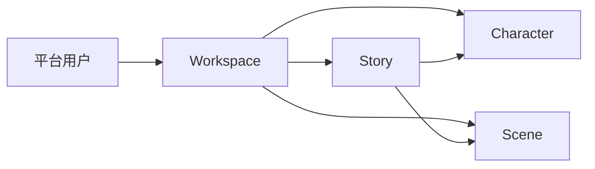

# 模块交互：Dream 剧本数据运营

> 返回：[全局交互规范](../refine-admin-ui-v3-interaction-design.md) · PRD：[Story 运营](../../prd/modules/02-story-operations.md)

## 1. 操作者与层级

内容运营按 `平台用户 → Workspace → Story → Character/Scene` 定位真实创作数据。面包屑和详情关联必须保留 Workspace 上下文。

## 2. 列表规范

| 页面 | 主要列 | 筛选/排序 | 行动作 |
|---|---|---|---|
| Workspace | name、owner、story 数、updated | owner/email/name；updated/name | 查看、编辑 name/settings |
| Story | title/identifier、workspace、author、status/review/type、updated | keyword、workspace、author、status/review/type | 查看、编辑白名单、confirm |
| Character | name/identifier、workspace、story_count、review | keyword、workspace、author/review/status | 条件查看/编辑/confirm |
| Scene | name/identifier、story、workspace、order、review | keyword、story/workspace/review | 条件查看/编辑/confirm |
| Workflow | id、status、provenance、created/completed | status/workspace/time | 只读查看 |

分页 20/50/100；无批量写、创建和删除。扩展实体不在主导航时只能从关联详情进入；缺表显示 503 状态页。

## 3. 详情与编辑

- Workspace：Drawer；`name` text，`settings` JSON Editor，保存时展示 owner 与影响。
- Story：宽 Drawer，正文/关系只读；编辑 title text、description textarea、type select；pending 时显示“确认”命令。
- Character：Drawer；文本字段、avatar URL、tags multiselect/token input、notes textarea。
- Scene：Drawer；name/description、可搜索 Story relation、order integer；变更 Story 显示目标 Workspace/owner 校验摘要。
- Workflow：宽只读 Drawer，provenance/transition/token consumption 分区，无 retry/cancel。

Confirm 使用 Modal，显示对象、当前 review status、不可撤销影响和 reason（若服务要求）。409 保留层并提供载入最新状态。

## 4. 状态与响应式

- Loading 保留筛选和表头；Filter Empty 提供清筛；System Empty 不提供创建。
- 503 显示缺失表清单和重试，不跳到旧表。
- Desktop 关联数据分区并排；Mobile 改为纵向定义列表，正文和 JSON 自身滚动。
- 表格 caption、aria-sort；confirm 后 live region 播报并归焦该行。

## 5. 交互验收

- UI-STO-01：用户→Workspace→Story 的筛选与返回上下文保持。
- UI-STO-02：任何页面无通用创建/硬删；Workflow 无人工状态按钮。
- UI-STO-03：FK/状态 409、缺表 503、无权限 403 都有明确恢复动作。
- UI-STO-04：390×844 下正文/JSON/长 ID 不造成 document 横滚。
