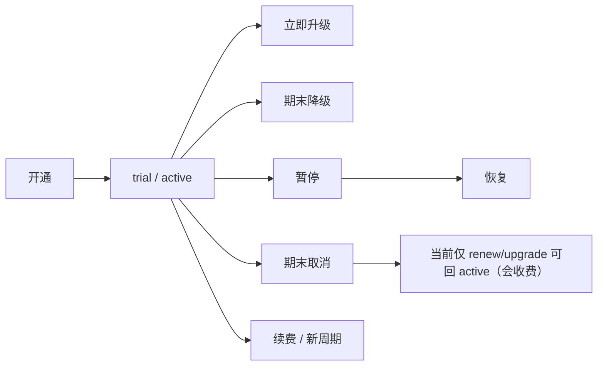

# 模块交互：订阅、版本、权益与生命周期

> 返回：[全局交互规范](../refine-admin-ui-v3-interaction-design.md) · PRD：[订阅中心](../../prd/modules/03-subscriptions.md)

> 实现状态：Plan/Version/Entitlement 管理、订阅列表/开通和生命周期 Modal 已实现；聚合详情 Drawer 与完整账务影响预览为后续目标。

## 1. 页面结构

| 页面 | 列表重点 | 创建/编辑容器 |
|---|---|---|
| 套餐 | code/name/status/currency/current version | Drawer；停用 Modal |
| 版本 | plan、version、status、cycle、price、effective | 独立页/全窗口层；发布确认 Modal |
| 权益 | version、model/scope、RPM、Token/Storage、overage | 独立页或宽 Drawer；published 只读 |
| 用户订阅 | user、plan/version、status、period、renewal/pending change | 开通 Drawer；详情宽 Drawer；生命周期 Modal |

列表均为服务端分页/排序；筛选包含 plan/status/user/cycle/effective date。Published Version、Entitlement、Allowance、Event 无行内编辑/删除。

## 2. 字段控件

- Plan：name text、code text（创建后只读）、currency select、status select、description textarea。
- Version：plan relation、version number、billing cycle select、base price micro-USD integer + USD preview、trial days integer、allowance type/amount、overage switch/rule、effective datetime。
- Entitlement：version/model relations、Gateway scopes multiselect、RPM/Token/Storage integers、overage select。
- Subscription：平台用户 relation、published version relation、start trial switch、idempotency key 只读自动值/高级字段、reason textarea。

关系选项同时显示状态；未发布 Version 不可用于开通。金额、Token 和 Storage 分栏，不能共用含糊“额度”输入。

## 3. 用户订阅详情

顺序：状态与周期 → 套餐/版本快照 → 有效 Entitlement → 当前 Allowance（granted/reserved/consumed/remaining）→ cash account → Usage/Ledger → append-only Events。

桌面宽 Drawer；移动全屏。所有历史 ID 可复制；pending downgrade/cancel 显示实际生效时间和恢复动作。

## 4. 生命周期确认

每个 Modal 显示 current→target、立即/期末生效、价格/Allowance 影响、Gateway 影响、reason 和幂等回执。提交中禁止重复；409 留在 Modal 并提供刷新最新状态。

当前已实现 Modal 仅提供 action/target/reason 与结果消息；完整影响预览是后续目标。上线前文案至少必须明确：upgrade 从当前时间重开周期、全额扣目标版本价格、发完整新 Allowance、旧周期不 prorate/退款；downgrade 仅排队到续费；renew 按目标版本全额收费。`resume` 当前只接受 paused/past_due；对 cancel_at_period_end 执行 renew/upgrade 是收费动作，不得标成“撤销取消”。当前没有自动 cancelled/expired 状态推进 UI 或后台任务。UI 不发送不存在的 `expectedVersion`，并发由服务端行锁、状态校验和幂等键处理。

## 5. 状态与验收

- Empty：无 Plan 时可创建；无 published Version 时开通按钮禁用并链接版本页。
- 403 不显示价格写控件；404 返回对应列表；503 保留筛选和重试。
- UI-SUB-01：键盘可完成 Plan→Version→Entitlement→Publish→开通。
- UI-SUB-02：已发布对象只读且无误导编辑按钮。
- UI-SUB-03：两视口清楚区分 Allowance 与 cash、立即与期末动作。
- UI-SUB-04：重复提交显示同一结果，不出现两条成功回执。
