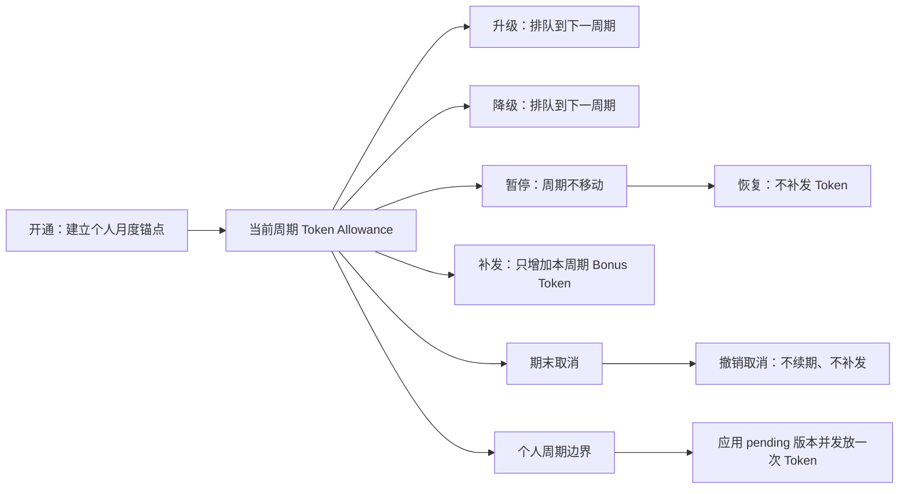

# 模块交互：Token-only 月度订阅、版本与权益

> 返回：[全局交互规范](../refine-admin-ui-v3-interaction-design.md) · PRD：[订阅中心](../../prd/modules/03-subscriptions.md)

> 交互纠偏：订阅页面只配置与展示用户个人月度周期、Token Allowance 和非货币 Entitlement。任何 currency、price、金额额度、现金超额、Payment 或平台统一生效日期控件都是业务错误，必须从可操作界面和 API 投影移除。

## 0. Current / Target / Migration / Release Gate

| 分层 | 交互边界 |
|---|---|
| Legacy baseline | `0014` 与历史记录仍保留金额、annual/cash overage 和 `effectiveFrom` 兼容列；只允许在受权限保护的迁移证据中审计，不再进入套餐交互。 |
| Implemented / Release candidate | Plan/Version 表单、列表、用户订阅页、只读 Token 流水页、Product/Payment API 与 Dream BFF 只显示个人月度周期、Token、月费与权益。Admin 66 files/313 tests、tsc/lint/build、Payment PG 2/2；Dream frontend lint 0 errors/21 warnings、build、Product API 9/9 与订阅 Playwright 4/4 已通过。 |
| Target | 运营只管理 Plan identity、不可覆盖 monthly Token Version、非货币 Entitlement 和用户级生命周期；所有影响预览只显示版本、个人周期、Token 与 Gateway 资格。 |
| Migration | 先让读取投影和表单停止暴露错误字段，再切严格 Token-only API；旧货币历史若需排障，只在受权限保护的 Legacy evidence 只读区显示，不进入套餐详情、筛选或导出。 |
| Release Gate | 两视口、键盘和读屏测试确认没有金额/支付/全局生效控件；个人周期、下期换版、Token 守恒、402 Token 恢复和 409 并发恢复均由真实 API 驱动。 |

## 1. 信息架构与列表

| 页面 | 主要操作者 | 列表字段 | 筛选 / 排序 / 批量 |
|---|---|---|---|
| 套餐 | 订阅运营 | name、code、status、current published version、updated | q/status；name/code/updated；无批量写或历史删除 |
| 版本 | 订阅运营、审计 | plan、version、status、固定“月度”、allowance tokens、published at | plan/status；version/publishedAt；无 cycle/effective date 筛选，无批量编辑/删除 |
| 权益 | 模型运营、订阅运营 | version、model、scopes、RPM、Storage、status | version/model/scope；published 对象只读；无金额 overage |
| 用户订阅 | 支持、订阅运营 | user、plan/version、status、current period、token remaining、pending version/cancel | canonical user/plan/status/period；updated；生命周期动作逐条确认，不做批量换版 |

全部列表使用服务端分页、排序、白名单筛选和真实 total。用户关系选择器搜索 canonical `users`，支持 debounce、跨页保留与 hydration；不存在“计费用户”筛选、开户按钮或 qa 专用名单。

## 2. 创建与编辑控件

### 2.1 Plan Drawer

| 数据项 | 控件 | 校验与说明 |
|---|---|---|
| name | text | trim，1–160 字符，必填 |
| code | text → 创建后只读 code | 2–80 字符，小写字母/数字开头，可含点、下划线和连字符，稳定唯一 |
| description | textarea | 可选，说明目标用户/能力，不写价格 |
| status | select | draft/active/retired；retire 走确认 Modal |

不得渲染 currency、base price、支付渠道或生效日期，即使 Legacy API 暂时仍返回这些字段也必须在 adapter 层丢弃。

### 2.2 Plan Version 独立页 / 全窗口层

| 数据项 | 控件 | 校验与说明 |
|---|---|---|
| plan | 可搜索关系选择器 | 必填，显示 name + code + status |
| version | 自动生成的只读 integer | 服务端按 Plan 分配递增版本，`>=1` 且唯一；客户端不猜下一个值 |
| cadence | 只读状态标签“每月” | 固定 monthly，无 select/radio |
| allowance tokens | integer | `>0`，step 1，明确“每个用户订阅周期发放” |
| trial days | integer | `>=0`，只影响资格状态，不代表免费金额 |
| grace period days | integer | `>=0`，说明恢复窗口 |
| status / published at | 只读状态标签 / datetime | `publishedAt` 仅审计时间，绝不标成“生效时间” |

不得出现 `basePriceMicrousd`、`allowanceMicrousd`、overage switch/rule、currency、annual 周期或 `effectiveFrom/effectiveTo`。发布确认 Modal 显示版本快照、Token 发放量、Entitlement 数量和“发布后不可编辑”；发布时间不改变现有用户，只有开通或下一周期 pending change 才使用该版本。

### 2.3 Entitlement 宽 Drawer / 独立页

| 数据项 | 控件 | 校验与说明 |
|---|---|---|
| version / model | 可搜索关系选择器 | 只选 draft Version 与 active model |
| Gateway scopes | multiselect | 使用白名单枚举 |
| RPM limit | integer | 空值表示继承明确的上层策略；`>=1` |
| Storage limit | integer + 单位选择/只读换算 | 数据库存 bytes，UI 明确 GiB/MiB |
| 状态/快照 ID | 只读 code/status tag | 发布后无编辑/删除动作 |

Token 周期总额度只在 Version 配置，避免与 Entitlement 的安全限流字段重复成第二套月度额度。Model permission 的用户例外入口仍在 Gateway 限流模块。

### 2.4 开通 Drawer

- canonical user：可搜索 relation；结果显示 name/email/id/status，不出现 billing-user 标签。
- published version：可搜索 relation；显示 Plan、版本、固定月度、Token/周期和关键 Entitlement。
- start at：datetime，默认当前时刻但可明确调整；其值成为该用户的周期锚点，不是平台统一套餐生效日。
- start trial：Switch；reason textarea；idempotency key 默认自动生成并可在高级区只读复制。
- 提交前摘要只显示 `[periodStart, periodEnd)`、Token granted、模型/scope 与 trial；没有金额/支付摘要。

## 3. 用户订阅详情

桌面使用右侧宽 Drawer（最大 920px），390×844 使用全屏详情，分区顺序固定：

1. 用户、状态与合法动作。
2. 当前 Plan/Version 快照与固定“每月”。
3. 个人周期 `[currentPeriodStart, currentPeriodEnd)` 与 cycle anchor（周期锚点，不是金额结算锚点）。
4. 当前 Token：套餐 Token、补发 Token、可用总额、reserved、consumed、remaining 与消耗进度；数值使用等宽 tabular nums 和明确 `tokens` 单位。
5. 有效 model/scope/RPM/Storage Entitlement。
6. pending next version / cancel-at-period-end 与准确生效边界。
7. recent Token Usage 与 append-only Subscription Events。

详情不嵌入 cash account、金额 Ledger、预计金额超额或 Payment。需要排查独立 Provider 成本/现金账务的管理员可按 permission 跳转 Billing 模块，但文案必须为“独立账务”，不能称为订阅余额。

`/admin/subscriptions/token-ledger` 是 `subscriptions.read` 控制的只读审计页，按 Gateway Request 展示 `request_sequence`、reserve/capture/release、Token amount 和 available/reserved/consumed 前后快照。页面不得提供新增、编辑、删除、退款成功或支付状态控件，也不得把 Token 流水称为账单金额。

当前周期免费 Token 的写入口固定为“订阅 → 用户订阅 → 管理 → 补发本周期 Token”，不得写在“Gateway → 限流策略”的资源或表单中。限流页可以提供用户行级“处理 402／补发 Token”导航：URL 携带邮箱和 `intent=grant`，目标订阅列表自动按邮箱筛选；点击“管理”后，有 `subscriptions.grant` 权限时默认选中补发动作。只有 `subscriptions.grant` 可看到并提交该动作。确认 Modal 必须显示当前剩余、补发正整数数量、明确原因，并说明“立即参与 Gateway 预授权、只对当前周期有效、不修改 429 安全限流、下周期不重复发放”。提交后刷新套餐 Token/补发 Token/可用总额，成功回执可跳转 Token 流水中的不可变补发记录。

## 4. 生命周期与影响确认

生命周期统一使用 Modal；移动端为锁焦的全屏/底部 sheet。每个 Modal 显示 current→target、当前周期、准确边界、Token 变化、Gateway 可用性、reason、expected version 和幂等回执。

- 升级和降级都显示“将在 YYYY-MM-DD HH:mm（含时区）下一周期生效”；不得出现“立即升级”、proration、退款或价格差。
- 续期由周期边界推进；运营手工重试只能在边界到达后执行。若已漏过多个边界，确认层说明“跳过已过期周期且不追溯补发 Token”，成功后定位到包含当前时刻的个人周期。提前操作禁用并说明剩余时间；服务端 409 时载入最新周期。
- 暂停/恢复明确“不会改变本期结束时间或 Token”；期末取消明确“本期可继续使用”，撤销取消明确“不发放新额度”。
- 补发 Token 使用独立危险能力提示和二次确认；数量、原因、Allowance version、幂等键缺一不可。409 时保留输入并要求刷新最新额度，权限不足时完全隐藏动作；普通 `subscriptions.write` 不能代替 `subscriptions.grant`。
- 提交中禁用重复动作；同幂等结果复用原回执。409 保留 Modal、聚焦冲突摘要并提供“载入最新”，不盲写。

## 5. Token 额度不足与错误恢复

402 `SUBSCRIPTION_TOKEN_ALLOWANCE_EXHAUSTED` 仅显示 Product API 的 `availableTokens/requiredTokens/periodEnd`：

- 标题“本周期 Token 已用尽”，正文说明下次重置时间、当前/所需 Token 与可选的下周期换版动作。
- 不显示金额、余额不足、充值、支付或“现金继续调用”。
- 若错误缺少 `metric=tokens` 或 token 字段，显示安全通用错误和 request ID，不猜测单位。

其他状态：401 恢复 session；403 显示所需 permission/不允许的模型或状态；404 返回相应列表；409 载入最新 version/period；429 显示 RPM/Token 限流窗口；503 保留筛选并说明依赖不可用。所有恢复动作由真实 API 提供，不能用静态 Plan 或默认额度。

## 6. 响应式与可访问性

### 1440×1000

- Plan/Version/Subscription 列表保持单个主 Paper；Token 列右对齐，period 列不与 published-at 混排。
- 详情 Drawer 的状态/周期/Token 摘要 sticky，内部内容独立滚动；表格局部横滚，document 不横滚。
- Version 页面将基本信息、Token 规则和 Entitlement 分为有标题的平面 section，不使用价格卡片或营销卡墙。

### 390×844

- 主识别列 sticky；次要筛选进入 Filter Sheet；周期拆为“开始/结束”两行，Token 数值不省略单位。
- Drawer 全屏、确认 sheet 底部考虑 safe area，错误摘要与最后字段不得被动作栏遮挡。
- 详情摘要单列；长 ID 截断并用有 accessible name 的 Copy，不把四个 Token 指标挤成不可读横排。

### 键盘与读屏

- 表单每个控件有可见 label、description/error 关联；固定 monthly 使用只读文本而非 disabled 无标签控件。
- 表格有 caption、`scope=col` 与 `aria-sort`；状态同时使用文字和图标，不只靠颜色。
- Dialog/Drawer 锁焦，Escape 关闭并归焦触发器；发布、状态变更和 Token 额度结果进入 `aria-live=polite`，错误摘要使用 `role=alert`。
- 200% 放大和 reduced motion 下可完成 Plan→Version→Entitlement→Publish→开通→排队换版全过程。

## 7. 状态与验收

- Empty：无 Plan 显示“创建套餐”；有 Plan 但无 published Version 时开通禁用并链接版本页；无订阅时说明所有平台用户都可直接开通，不显示“无计费用户”。
- Loading：保留页头/筛选/表头等高 skeleton；503 不清除筛选或用户选择。
- UI-SUB-01：键盘可完成 Token-only Plan→Version→Entitlement→Publish，且请求/DOM 无订阅货币字段。
- UI-SUB-02：published Version 只显示 published-at 审计时间，无 effective date、currency、price、money allowance、cash overage、annual 或 Payment 控件。
- UI-SUB-03：402 两视口只显示 Token 字段和周期重置；Token 数永不格式化为 USD，也不提供现金 fallback。
- UI-SUB-04：开通只发一份当期 Token；升级/降级预览均指向下一周期，暂停/恢复/取消/撤销取消不显示补发或金额影响。
- UI-SUB-05：Jan-31 月末边界、提前/重复/并发续期和 pending version 冲突显示确定结果；409 不关闭当前层。
- UI-SUB-06：至少 205 个 canonical 用户可通过服务端搜索/跨页选择；无独立 billing-user resource、筛选或开户文案。
- UI-SUB-07：1440×1000 与 390×844 覆盖 loading/empty/402/403/404/409/503、焦点归还、读屏播报、200% 放大和无页面级横向溢出。
