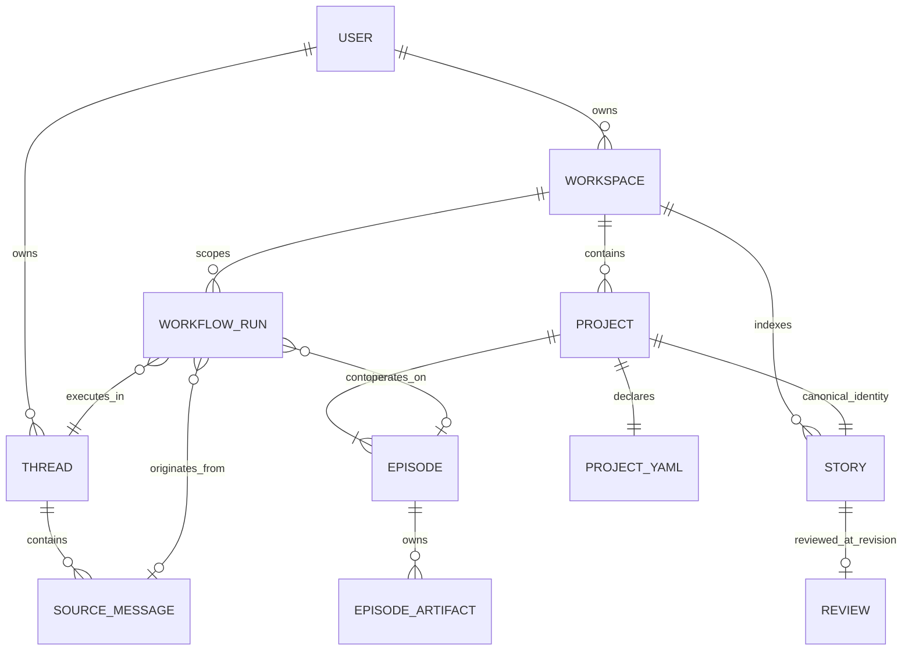
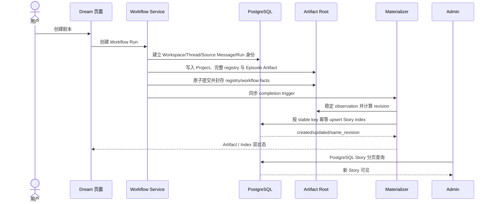
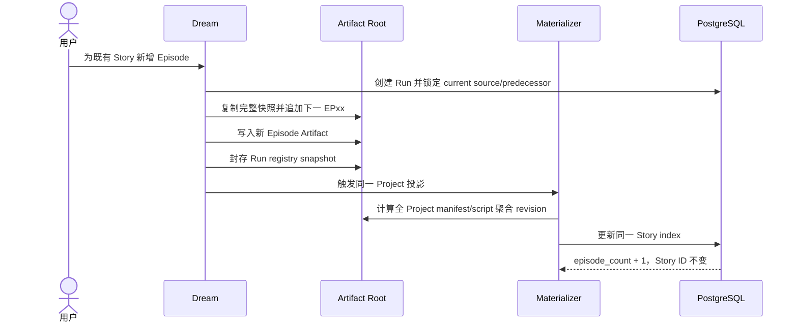
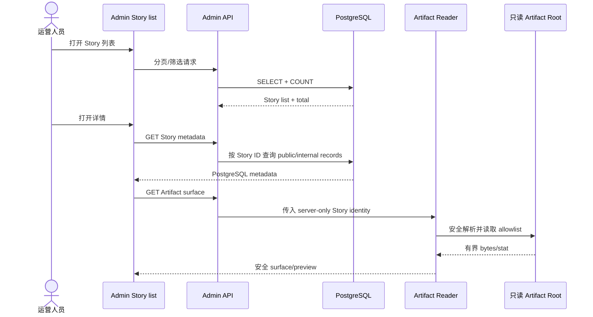
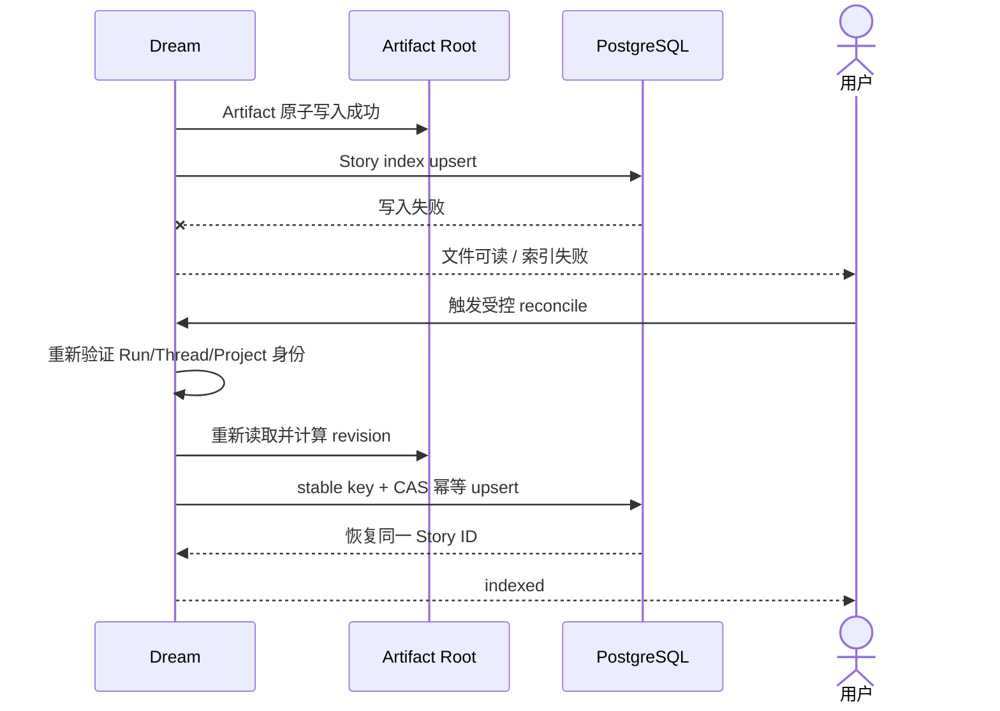
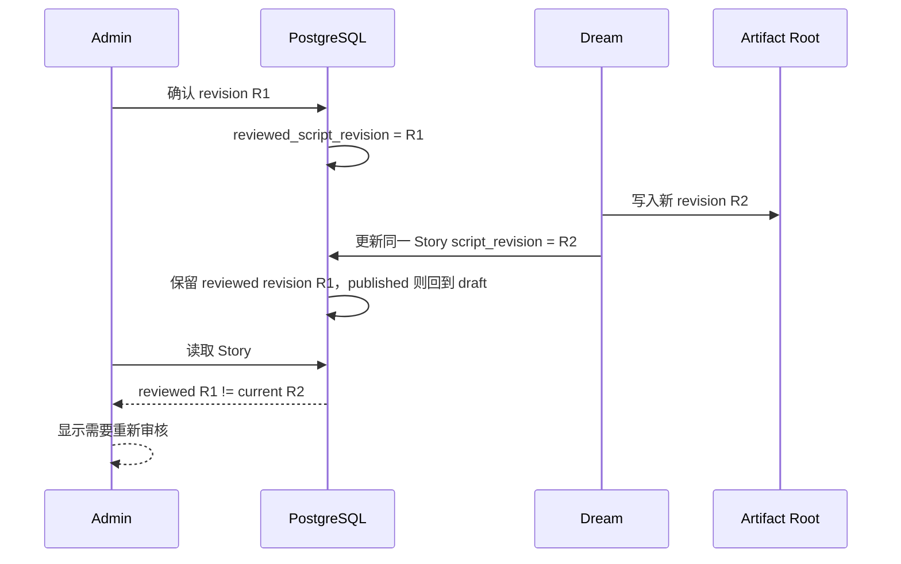
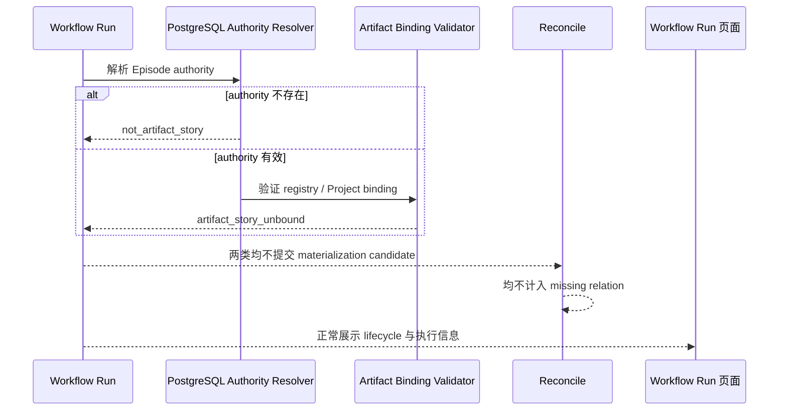
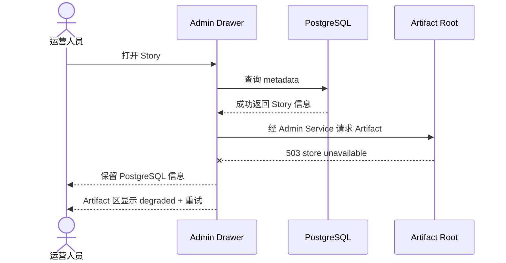

# Ink Memory 剧本业务：Admin / Dream 最终交互与架构设计

## 术语与概念定义

| 术语 | 定义 |
|---|---|
| Dream | 面向创作者的剧本创作系统；唯一写入 Artifact、Story identity 与 Story 运营索引的业务系统。 |
| Admin | 面向运营和审核人员的管理系统；查询 PostgreSQL Story 索引，通过只读共享挂载预览 Artifact，并仅以受控 CAS 命令写审核字段。 |
| Artifact Root | Dream 与 Admin 共享挂载的服务端文件根；Dream 读写，Admin 在操作系统和容器层只读，浏览器不可见。 |
| Artifact | Run 隔离的完整 Project snapshot，包含 `project.yaml`、Run 级身份文件及 Episode 内容文件；已封存 snapshot 的 bytes 是剧本内容真源。 |
| Workspace | 用户拥有的剧本业务和授权边界；容纳 Project、Story 与 Workflow Run。 |
| Project | 一部连续剧本作品的创作容器；以 `source_project_id` 稳定标识，在一个 Workspace 内唯一对应一条 canonical Story。 |
| Canonical Story | Project 在 PostgreSQL 中唯一、稳定、可搜索和可审核的运营身份；不保存完整剧本正文。 |
| Episode | Project 内按 `EP01`–`EP99` 连续编号的创作单元；多个 Episode 更新同一 Story。 |
| Workflow Run | 一次可重试、可审计的工作流执行过程；可以作用于 Project/Episode，但不是 Story identity。 |
| Thread | Dream 执行连续性和 Artifact Root 定位的服务端身份；属于一个 User，ID 与根目录均不进入 public DTO。 |
| Source Message | 用户发起 Run 的不可变来源事实；属于 Thread，并由 Run 引用以证明 Project/Episode authority。 |
| Story Index | `story_workspace_stories` 中由 Dream 维护的 Story identity、关系、状态、revision、摘要和运营查询字段。 |
| revision | 对确定的 canonical bytes 计算所得 `sha256:<64hex>`；用于内容识别、ETag、索引一致性和审核 CAS。 |
| current source Run | Story `source_run_id` 指向的当前投影来源；既有 Story 必须指向最近成功 materialize 的封存 snapshot，首个 Project 的 generating 行可暂指唯一未封存候选且不可预览。 |
| predecessor Run | 新 Run 建立 registry 候选时引用的 current source Run；用于 Episode 连续性和并发 CAS。 |
| Reconcile | Dream 重新授权身份、稳定读取 Artifact、重算 revision 并幂等恢复同一 Story 索引的受控命令。 |
| Review CAS | Admin 以 `expectedScriptRevision` 为前置条件，在单一 PostgreSQL 事务中写当前审核事实和审计的比较并交换操作。 |
| public DTO | 经 Session、RBAC 和字段 allowlist 后可返回浏览器的数据合同；不得包含路径、Thread 引用、Secret、Source Message 或异常堆栈。 |
| server-only record | 仅在 Repository/Service 内流转、包含授权和 Artifact 定位所需内部引用的数据结构；不得序列化到浏览器。 |

## 0. 文档结论

本设计采用以下最终边界：

```text
Dream
= 剧本创作系统
= Artifact 唯一写入方
= Story 索引唯一业务写入方
= Workspace / Project / Episode / Run / Thread / Source Message 身份关系权威维护方

文件系统 Artifact
= 剧本正文、Episode 大纲、Storyboard、审阅报告的内容真源

PostgreSQL story_workspace_stories
= Story 稳定身份、关系、状态、revision、摘要和运营索引

Admin
= PostgreSQL Story 索引的只读运营入口
= 共享只读 Artifact Root 的安全预览入口
= 仅通过受控命令写审核字段，不创建或修改 Artifact identity
```

Dream 与 Admin 使用同一 PostgreSQL，并挂载同一 Artifact Workspace Root。Dream 挂载为读写，Admin 在操作系统和容器层挂载为只读。浏览器不接触绝对路径、Thread Root、`source_thread_ref`、Secret、服务端凭证或内部异常。

设计符合性结论：**符合目标**。

---

## 1. 业务处理判断

### 1.1 业务对象关系

1. Workspace 是用户拥有的剧本业务边界，也是 Project、Story 和 Workflow Run 的授权边界。
2. Project 是一部连续剧本作品的创作容器；Story 是该 Project 在 PostgreSQL 中的唯一 canonical 运营身份。
3. Episode 是 Project 内按 `EP01`、`EP02` 连续编号的创作单元。多个 Episode 必须归属于同一 Project 和同一 Story。
4. Workflow Run 是一次可重试、可审计的执行过程记录。它保存工作流、运行状态、来源、幂等和运行时凭据，不是 Story identity。
5. Thread 是 Dream Agent 的执行连续性和服务端 Artifact 根定位依据。Thread 只属于一个用户；浏览器和 Admin public DTO 不得取得它对应的文件路径。
6. Source Message 是用户发起本次创作的权威来源证据。它属于 Thread，并由 Run 的 `source_message_id` 引用；其服务端 metadata 可保存 Episode authority，但正文不得进入 Story public DTO。
7. Artifact 是 Project/Episode 的内容真源。`project.yaml` 拥有 Project identity；`episode.json` 拥有 Run 与 Episode registry；`episode-workflow.json` 保存 Episode 工作流完成事实；`script.md`、`episode-outline.md`、`storyboard.yaml`、`review-report.md` 保存内容。

### 1.2 一个 Project 只对应一条 canonical Story

结论：**是**。一个 Workspace 内，同一 `artifact_source_type='dream_episode'` 与 `source_project_id` 只能命中一条 Story。数据库部分唯一键和 Dream 幂等 Repository 必须共同保证这一点。

```text
Canonical Story Stable Key
= workspace_id
+ artifact_source_type
+ source_project_id
```

`story_id` 必须严格按第 4.1 节 UUIDv5 公式由 stable key 确定性生成。不得使用 Run ID、Episode ID、Thread ID 或随机请求 ID 创建 Story。

### 1.3 多个 Episode 的归属

每个 Artifact Story Run 都保存该 Project 的**完整、Run 隔离 Artifact snapshot**，其中 `episode.json` 是完整 registry。Run 只修改自己的 staging snapshot；进入 materialization 前原子发布并封存，封存后不可修改。Story 的 `source_run_id` 唯一指定当前权威 snapshot，Admin 只读取该 Run。新增 Episode 的 Run 必须声明当前 `source_run_id` 为 `predecessor_run_id`，复制其完整封存 snapshot 后追加下一连续编号；索引 CAS 成功后，新 Run 才成为当前来源。两个 Run 从同一 predecessor 并发追加时只能一个成功；失败 Run 的隔离 snapshot 不影响当前 Story，并返回 409 后基于新的 current source 重新建立 Run。新增 Episode 更新同一 Story 的 `episode_count`、聚合 revision、当前来源 Run 和索引时间，Story ID 不变。

### 1.4 Workflow Run 的性质

Workflow Run 是**业务过程记录**，不是 Story identity。一个 Story 可以先后关联多个 Run；`source_run_id` 只表示当前投影来源：首个 generating Story 可指唯一候选 Run，其余状态必须指最近成功 materialize 的封存 snapshot。Run 的重试链、失败步骤和状态转换保留在 `workflow_runs` 及其运行记录中，不复制到 Story identity。

### 1.5 Dream URL 中 `runId` 的解析

`/story-workspace/dream?run={runId}` 和 `/story-workspace/runs/{runId}/execution` 必须执行同一服务端解析链：

```text
authenticated user
→ workflow_runs.id
→ workflow_runs.workspace_id + created_by
→ story_workspace_workspaces.owner_id
→ workflow_runs.source_voice_thread_id
→ chat_thread.id + user_id
→ workflow_runs.source_message_id
→ chat_message.id + thread_id + role=user
→ allowlisted source metadata 中的 Episode authority
→ episode.json.source_project_id = project.yaml.project_id
→ (workspace_id, dream_episode, source_project_id)
→ canonical Story
```

任一授权边不成立时必须在文件系统探测前终止。Run ID 只能启动上述解析，不能直接成为 Workspace、Project、Story 或文件路径。

该链分为两个明确阶段：

1. **PostgreSQL identity resolution**：验证 User/Workspace/Run/Thread/Source Message 关系，从 server-authored Source Message metadata 读取 Project/Episode authority，并由 `(workspace_id, dream_episode, source_project_id)` 查询 canonical Story。Admin Workflow Run 列表和 Run → Story 链接只执行本阶段，绝不读取文件。
2. **Artifact contract verification**：Dream 创作、execution、materialize/reconcile，以及 Admin 已打开 Story 后的 Artifact surface 请求，才根据已解析的 server-only locator 读取 `episode.json`、`project.yaml` 和 allowlist 文件。本阶段决定 Artifact availability，不参与 Admin Run 列表查询。

Artifact Story Run 必须恰好引用一个 user-role Source Message；普通 Run 可以不引用 Source Message。Source Message 中的 `story_workspace_episode_identity` 由 Dream 服务端在建立 binding 时写入，浏览器不得提交或修改，字段集合严格为：

```json
{
  "schema": "story-workspace-episode-authority/v1",
  "workflow_run_id": "run_0123456789abcdef0123456789abcdef",
  "episode_uid": "0123456789abcdef0123456789abcdef",
  "source_project_id": "rainy-night-letter",
  "episode_code": "EP01"
}
```

该对象禁止额外字段；Run ID 必须与当前 Run 相等，Episode UID 必须为 32 位 lowercase hex，`source_project_id` 必须匹配 `^[a-z0-9]+(?:-[a-z0-9]+)*$` 且为 1–80 ASCII bytes，Episode code 只允许 `EP01`–`EP99`。`authority.source_project_id`、`project.yaml.project_id`、`episode.json.source_project_id`、Story `source_project_id` 和 public DTO `projectId` 必须是同一个 canonical 值；`projectId` 只是 camelCase 表示，不是另一种身份。服务端一旦把 authority 绑定到 Run/Source Message，就不得原地修改；另一个 Episode 或 Run 写新的 authority fact。

### 1.6 Dream 创建或更新 Story 索引的条件

Dream 仅在以下条件全部成立时执行幂等 upsert：

1. Run、Workspace、User、Thread、Source Message 的关系已由 PostgreSQL 授权。
2. Source Message 中存在严格有效的 Episode authority，且与 Run ID 一致。
3. `episode.json` 与 `project.yaml` 可安全读取，Project identity、Episode UID、Episode code 与 registry 一致。
4. Project stable key 可唯一确定。
5. Project/Episode Artifact 状态已经形成可验证的有界投影；内容可处于 `generating`、`available`、`missing` 或 `invalid`，但身份合同不得含糊。

创建 Project 并形成可信 identity 后，Dream 可以先创建 `artifact_status=generating` 的 Story 索引；每次 Episode registry、allowlist Artifact 状态、文件 revision、标题摘要或最新来源 Run 变化时，Dream 更新同一行。文件完成写入后必须先计算 revision，再启动索引写入。文件写入成功与索引成功必须分别记录和展示。

### 1.7 Artifact 存在但 Story 索引不存在

Dream 将其表达为：

```text
Artifact status = available
Story Index status = missing
retryable = true
storyId = null
```

Dream 页面显示“文件已生成，Story 索引尚未建立”，并允许受控 reconcile。Admin Story 列表不会出现该 Project，因为列表只查询 PostgreSQL；Admin Workflow Run 页面可以通过 PostgreSQL Run/Source Message authority 显示“尚无 canonical Story 索引”，但不得扫描文件补出 Story。

### 1.8 Story 索引存在但文件缺失或 revision 变化

- 文件缺失：`artifact_status=missing`。Story metadata 仍可展示；Artifact 区独立返回 404；索引行不删除。
- Artifact 合同无效：`artifact_status=invalid`。Story metadata 仍可展示；Artifact 区返回 422 和安全错误码。
- 文件 revision 与索引 revision 不同：`artifact_sync_status=stale`。Dream 显示 observed/indexed 双 revision；Admin 显示“Revision 已变化”，预览请求必须携带 expected revision。
- 文件系统暂时不可用：不把内容判定为 missing；API 返回 503/degraded，并保留 PostgreSQL metadata。

### 1.9 不进入 Story reconcile 的 Workflow Run

分类必须穷举：

- metadata 完全没有 `story_workspace_episode_identity` 的普通 Chat、分析、插件管理、其他工作流或仅有 Dream stage 文件的 Run：`not_artifact_story`。
- metadata 声称具有 Episode authority，但 schema 或 Run/Workspace/User/Thread/Source Message 关系不一致：`identity_invalid`。
- PostgreSQL authority 有效，但 Dream Artifact verification 找不到有效 `episode.json` registry / `project.yaml` binding：`artifact_story_unbound`。
- authority、registry、Project binding 全部有效：`artifact_story_bound`，才允许进入 materialization/reconcile。

`not_artifact_story` 和 `artifact_story_unbound` 均不计为 `missing_relations`；`identity_invalid` 计入独立的 `invalid_identity`，不计 missing；只有 `artifact_story_bound` 且 stable key 无 Story 行时才计 `missing_relations`。前三类不自动修复，Workflow Run 页面仍正常展示 lifecycle。

### 1.10 Admin 不能按 `runId` 或用户路径扫描文件

Run 是过程身份，不能唯一代表长期 Story；用户路径不是授权事实；扫描会绕过 Workspace/User/Thread/Project 关系校验，并产生路径穿越、symlink escape、TOCTOU、跨租户可见性和分页不准确风险。因此 Admin 必须先从 PostgreSQL Story ID 获取内部 identity，再读取 registry 中的 allowlist Artifact。

### 1.11 列表、Run 与 Artifact 详情跳转

- Story 列表 → Story detail Drawer：使用 `storyId`，先加载 PostgreSQL，再加载 Artifact。
- Story detail → 当前来源 Run：使用 `source_run_id` 打开 Admin Workflow Run 或 Dream execution。
- Workflow Run → canonical Story：先从 Run/Source Message authority 解析 stable key，再查询 Story；不得把 Run ID 当 Story ID。
- Artifact 文件详情始终附着在已授权 Story detail 和 registry Episode 上，不存在独立路径型入口。

### 1.12 状态归属

| 状态域 | 权威事实 | 取值 |
|---|---|---|
| Workflow Run lifecycle | `workflow_runs.status` | `preflight`、`queued`、`running`、`output_validating`、`pending_review`、`confirmed`、`rejected`、`completed`、`failed`、`cancelled` |
| Artifact availability | Dream 文件投影；Story 行保存最近观测摘要 | `generating`、`available`、`missing`、`invalid` |
| Story Index | Dream materializer/observation | `syncing`、`indexed`、`stale`、`missing`、`failed` |
| Review | Admin 受控审核命令 | `pending`、`confirmed`、`rejected` |
| Story business | Dream 业务命令 | `draft`、`published`、`archived` |

这些状态必须独立存储或独立派生，禁止用一个字段承载多个领域含义。

---

## 2. 产品目标与系统边界

### 2.1 产品目标

用户在 Dream 完成 Project 和 1–99 个 Episode 的创作后，Dream 以稳定 Project identity 将 Artifact 摘要幂等写入同一 PostgreSQL Story。运营人员在 Admin 中通过准确分页的 Story 列表找到该 Story，核对 Workspace、作者、来源 Run、Episode 数和 revision，在不取得写权限和路径信息的前提下预览同一份 Artifact，并对明确的 Script 聚合 revision 执行审核。

系统必须保证：

- Dream 与 Admin 对“同一 Story”的判断只依赖 stable key。
- 文件正文只存在于 Artifact，不复制到 PostgreSQL。
- Admin 列表在文件系统不可用时仍稳定工作。
- Artifact 失败不遮蔽 PostgreSQL metadata；索引失败不伪装成文件失败。
- 任一 Episode Script 变化都会使 Story 级审核显示为需要重新审核。

### 2.2 系统职责矩阵

| 能力 | Dream | Admin |
|---|---|---|
| 创建 Workspace | 权威实现 | 禁止 |
| 创建 Project | 权威实现 | 禁止 |
| 创建 Episode | 权威实现 | 禁止 |
| 写入 Artifact | 唯一写入方 | 禁止 |
| 计算 per-file revision | 权威实现 | 只读验证 |
| 计算 Project 聚合 revision | 权威实现 | 只读验证 |
| 写 Story identity/index 字段 | 唯一业务写入方 | 禁止 |
| Story 搜索分页 | 用户态支持 | 主要运营入口 |
| Workflow Run 查看 | 用户态查看 | 运营态查看 |
| Artifact 预览 | 创作态读取 | 共享挂载只读 |
| 审核状态 | 展示结果 | 受控 CAS 审核 |
| 业务状态 | 权威业务命令 | 只读 |
| 文件路径 | 服务端内部 | 不接收、不返回 |
| Reconcile | 权威实现 | 只展示诊断或触发受控 Dream 命令 |
| Artifact root 权限 | 读写 | OS/container 只读 |

---

## 3. 核心业务对象

### 3.1 对象定义

| 对象 | 稳定 ID | 所属关系 | 权威来源 | 生命周期 | Admin 修改 | 浏览器直接访问 |
|---|---|---|---|---|---|---|
| Workspace | `story_workspace_workspaces.id` | 属于一个 `users.id` | PostgreSQL / Dream | active → archived | 禁止 | 仅 public DTO |
| Story | `story_workspace_stories.id`，由 stable key 锁定 | 属于 Workspace、Author；一对一对应 Project | PostgreSQL identity + Dream index writer | draft → published → archived | 仅审核字段 | 仅 public DTO |
| Project | `project.yaml.project_id` / `source_project_id` | 属于 Workspace；一对一对应 Story | Dream + `project.yaml` | created → active → archived | 禁止 | 仅安全 ID/摘要 |
| Episode | registry `episode_uid`；展示 code `EPxx` | 多个属于一个 Project/Story | Dream + `episode.json` | registered → generating → available/invalid/missing | 禁止 | 只以 `EPxx` 选择 |
| Workflow Run | `workflow_runs.id` | 属于 Workspace/User；可指向一次 Project/Episode 操作 | PostgreSQL / Dream workflow | Run lifecycle 状态机 | 禁止 | actor/admin 授权后查看 |
| Thread | `chat_thread.id` | 属于 User；承载多个 Source Message | PostgreSQL / Dream | created → active → retained | 禁止 | 不作为 Artifact API 输入 |
| Source Message | `chat_message.id` | 属于 Thread；被 Run 引用 | PostgreSQL / Dream | created → immutable source fact | 禁止 | 不公开正文/metadata |
| Artifact | Project/Episode 内 allowlist 文件 identity | 属于 Project 或 Episode | 文件系统 / Dream | generating → available/missing/invalid | 禁止 | 仅有界预览 DTO |
| Story Index | Story 行的 identity、关系、状态、revision、摘要字段 | 属于 Story | PostgreSQL / Dream | syncing/indexed/stale/missing/failed | 禁止 | public allowlist |
| Review | `review_status + reviewed_script_revision + review_notes` | 属于 Story 的明确 Script revision | PostgreSQL / Admin CAS command | pending/confirmed/rejected；revision 变化后派生为需重审 | 允许受控修改 | 仅命令 DTO |

### 3.2 业务对象关系图



---

## 4. 稳定身份与 revision 规则

### 4.1 canonical Story identity

```text
stable_key = (workspace_id, artifact_source_type, source_project_id)
artifact_source_type = "dream_episode"
```

强制规则：

1. 一个 Workspace 下一个 Project 只能有一条 Story。
2. Story ID 必须稳定、幂等，并固定为 `UUIDv5(NAMESPACE_URL, "urn:ink-memory:artifact-story:v1:" + workspace_id + ":dream_episode:" + source_project_id)` 的 lowercase UUID 文本；禁止随机创建后再锁定。
3. Run ID、Episode UID、Episode code、Thread ID 均不得进入 Story stable key。
4. 新 Episode 更新同一 Story。
5. 新 Run 可以在服务端证明同一 Project 后更新 `source_run_id` 和内部 `source_thread_ref`，不能新建 Story。
6. `source_thread_ref` 固定保存已验证的 `chat_thread.id`，是 server-only 引用，不是磁盘路径或 Story identity；变更必须经过完整关系授权和 Project identity 验证。Artifact Root Resolver 以 canonical root 目录 fd 和该 Thread ID 生成受控内部目录键，禁止把数据库值直接拼成路径。
7. PostgreSQL 不保存完整剧本正文；`content` 不作为 Artifact Story 的内容来源，public DTO 不返回它。

同一 Project 默认继续使用同一 Thread。跨 Thread 更新 `source_thread_ref` 只能由 Dream 的受控 Project rebind 完成：目标 Thread 必须属于同一 User/Workspace；Dream 在目标 Thread 建立 rebind Run，将 current source 的完整封存 snapshot 复制到该 Run 的隔离 staging 区，原子发布后安全复读并重新计算聚合 revision；`project.yaml.project_id` 与 `source_project_id` 必须一致；随后在同一 Story row lock 中一次性更新最新 Run/Thread 引用和 revision。禁止按同名目录合并、从两个 Thread 拼接 Episode、由浏览器声明 rebind，或在完整性验证前切换引用。不同 Workspace 中相同 `source_project_id` 始终是不同 Story。

### 4.2 Project/Episode Artifact 合同

```text
<shared-root>/<server-derived-thread-directory>/
  .dream/runtime/runs/<run-id>/
    episode.json
    episode-workflow.json
    artifact/
      stories/<source-project-id>/
        project.yaml
        episodes/<EPxx>/
          script.md
          episode-outline.md
          storyboard.yaml
          review-report.md
```

以上布局仅为服务端内部合同。Run 写入 `.artifact-staging-<nonce>`，完成所有文件原子写、file fsync 和 directory fsync 后，以同目录 rename 将其一次性发布为唯一 `artifact/`；随后封存两份 Run identity 文件。已存在 `artifact/` 时只允许 bytes 完全相同的幂等结果，禁止覆盖。Story CAS 失败只留下不可见的 Run snapshot，current `source_run_id` 和当前内容不变；保留或清理由 Dream retention 处理，Admin 永不读取未被 Story 选择的 snapshot。

`source_thread_ref` 保存 `chat_thread.id`；Artifact Root Resolver 使用 `sha256("ink-thread-root:v1\0" + thread_id)` 的 lowercase hex 作为单层目录键，并通过 canonical root 目录 fd 逐段打开。数据库值、URL 参数和浏览器输入均不得直接拼接路径。API 不接收或返回任何目录键或路径。

三份身份文件使用严格 schema：UTF-8、无 BOM、最大深度 8、禁止 YAML tag/alias、多文档与重复键；未列出的字段全部拒绝。时间统一为带 `Z` 的 RFC 3339 UTC。`project.yaml` 最大 256 KiB，`episode.json` 最大 64 KiB，`episode-workflow.json` 最大 16 KiB。registry 上限按 99 个最大 320 bytes entry 加 2 KiB envelope 计算为 33,680 bytes，并向上取 64 KiB 安全边界。

#### `project.yaml`

```yaml
schema: dream-project/v1
project_id: rainy-night-letter
workspace_id: workspace-01
project_name: 雨夜来信
planned_episode_count: 12
```

字段合同：

| 字段 | 类型与约束 |
|---|---|
| `schema` | 固定 `dream-project/v1` |
| `project_id` | 1–80 ASCII bytes 安全 slug；必须等于 `source_project_id`、目录名和 authority 值 |
| `workspace_id` | 1–255 字符；必须等于已授权 Run/Story Workspace |
| `project_name` | 1–255 个 Unicode 字符；禁止控制字符和凭证形态 |
| `planned_episode_count` | `null` 或整数 1–99；仅表示创作目标，不代替 registry 实际数量 |

#### `episode.json`

每个 Run 的文件是完整 Project registry 候选；materialization 只接受 `sealed=true`。首个 Run 的 `predecessor_run_id=null`；后续 Run 必须引用 materialize 开始时 Story 的 `source_run_id`。`registry_revision` 必须等于 predecessor revision + 1；首个快照为 1。

```json
{
  "schema": "dream-episode-registry/v1",
  "workflow_run_id": "run_0123456789abcdef0123456789abcdef",
  "predecessor_run_id": null,
  "workspace_id": "workspace-01",
  "source_project_id": "rainy-night-letter",
  "active_episode_uid": "0123456789abcdef0123456789abcdef",
  "registry_revision": 1,
  "sealed": true,
  "episodes": [
    {
      "episode_uid": "0123456789abcdef0123456789abcdef",
      "episode_number": 1,
      "episode_code": "EP01",
      "relative_root": "stories/rainy-night-letter/episodes/EP01",
      "created_at": "2026-08-10T06:00:00Z"
    }
  ],
  "updated_at": "2026-08-10T06:00:00Z"
}
```

`episodes` 长度为 1–99，顺序必须与 `episode_number=1..N` 完全一致；code 必须是相同序号的 `EP01`–`EP99`，UID 唯一，`active_episode_uid` 必须存在，`relative_root` 必须由服务端按 Project/Episode identity 精确生成。第 100 个 Episode 请求返回 422 `episode_limit_exceeded`。封存快照不可覆盖；若同一 Run ID 下 bytes 变化，判定合同无效。

#### `episode-workflow.json`

```json
{
  "schema": "dream-episode-workflow/v1",
  "workflow_run_id": "run_0123456789abcdef0123456789abcdef",
  "workspace_id": "workspace-01",
  "source_project_id": "rainy-night-letter",
  "episode_uid": "0123456789abcdef0123456789abcdef",
  "episode_code": "EP01",
  "registry_revision": 1,
  "sealed": true,
  "revision": 1,
  "completions": [
    {
      "action": "write_script",
      "input_revision": "sha256:aaaaaaaaaaaaaaaaaaaaaaaaaaaaaaaaaaaaaaaaaaaaaaaaaaaaaaaaaaaaaaaa",
      "manifest_revision": "sha256:bbbbbbbbbbbbbbbbbbbbbbbbbbbbbbbbbbbbbbbbbbbbbbbbbbbbbbbbbbbbbbbb",
      "message_id": "dream_agent_cccccccccccccccccccccccccccccccccccccccccccccccccccccccccccccccc",
      "recorded_at": "2026-08-10T06:10:00Z"
    }
  ],
  "updated_at": "2026-08-10T06:10:00Z"
}
```

`action` 只允许 `plan_episode|write_script|review_script|build_assets|regenerate_storyboard|review_full_chain|commit_episode|prepare_render_guide`，每个 action 最多一条；`message_id` 固定为 `dream_agent_` 加 64 位 lowercase hex，`revision` 为正整数。文件中的 Run、Workspace、Project、Episode、registry revision 必须与 authority 和 `episode.json` 完全一致。`sealed=true` 后不可覆盖。

#### 交叉校验

Materializer 必须证明：数据库 Run/Workspace/Thread/Source Message 关系有效；authority 与 Run 相等；三份身份文件与 authority 的 `workspace_id/source_project_id/episode_uid/episode_code` 一致；registry predecessor 正是 materialize 开始时锁定的 Story current source；Project 目录、registry relative root 和 allowlist 文件均由同一 identity 派生。任何不一致返回 409 `artifact_identity_conflict` 或 422 `artifact_contract_invalid`，不得猜测、合并或扫描其他目录。

### 4.3 revision 定义

| revision | 算法 | 用途 |
|---|---|---|
| per-file revision | `sha256(file_bytes)` | ETag、单文件并发验证 |
| `script_revision` | 对完整 Episode 集合的 Script fact canonical bytes 计算 SHA-256 | Story 级审核 CAS；任一 Episode Script 变化都会变化 |
| `artifact_manifest_revision` | 对 registry 与全部 allowlist file fact canonical bytes 计算 SHA-256 | 判断整个 Project Artifact 投影是否变化 |
| observation ETag | 对当前 Artifact 投影与当前 Story index 行的 public-safe比较结果计算 SHA-256 | Dream `If-Match` reconcile CAS |

`script_revision` 表示最近一次完整、严格有效的 Project Script 集合。生成中、缺失或无效期间保留最近一次完整值作为只读摘要，但 UI 必须同时显示非 `available` Artifact 状态，且禁止审核或发布。`artifact_manifest_revision` 始终反映最新已观测的状态组合。

“完整 Episode 集合”严格等于当前封存 registry 中按 `episode_number=1..N` 连续排列的全部 entry；每个 entry 必须恰好存在一个严格有效的 `script.md` fact。断号、重复 UID/code、未注册目录或任一 Script 非 `available` 都不能生成新的完整 `script_revision`。

Canonical bytes 规范固定为：UTF-8、无 BOM、无空白、LF 不参与结构序列化；对象键按下列顺序输出；字符串使用 JSON escaping；整数使用无前导零十进制；revision 固定 lowercase hex。Script 输入形态固定为：

```text
[{"episodeCode":"EP01","scriptRevision":"sha256:<64hex>"},{"episodeCode":"EP02","scriptRevision":"sha256:<64hex>"}]
```

Manifest 输入固定为：

```text
{"registryRevision":1,"projectId":"rainy-night-letter","episodes":[{"episodeCode":"EP01","episodeUid":"0123456789abcdef0123456789abcdef","files":[{"kind":"script","availability":"available","revision":"sha256:cccccccccccccccccccccccccccccccccccccccccccccccccccccccccccccccc","sizeBytes":28410},{"kind":"episode_outline","availability":"missing","revision":null,"sizeBytes":null},{"kind":"storyboard","availability":"missing","revision":null,"sizeBytes":null},{"kind":"review_report","availability":"missing","revision":null,"sizeBytes":null}]}]}
```

episodes 按 code 排序，files 固定按 `script,episode_outline,storyboard,review_report` 排序；mtime 不进入 revision。测试向量：上述 Script 单 Episode 输入在 script revision 为 64 个 `a` 时，结果必须为 `sha256:ca2ba2bbd5bd6030eb50142a07e4ec4b98b6aacc0666aa8a9c53f207fbd5377c`；上述 Manifest 结果必须为 `sha256:2586b819b2df542892886436b8c16e13603a9ed461c5d4ac078bdef4c4a80a28`。Dream 使用唯一 canonical serializer；Admin 仅用相同测试向量验证实现一致性。

### 4.4 多文件 observation 一致性

一次 projection 使用固定算法形成逻辑快照：

1. 通过 root/thread/run/project 目录 fd 打开三份身份文件，记录每个文件的 `dev/ino/size/mtime_ns/sha256`，验证 registry 已封存。
2. 只按 registry 枚举 Episode；逐个以 `openat + O_NOFOLLOW` 打开四种 allowlist 文件，读取有界 bytes，并记录相同 file fact。禁止目录扫描补充 Episode。
3. 全部内容读取后，再从同一目录 fd 对每个已读取名称执行 `fstatat(..., AT_SYMLINK_NOFOLLOW)`，必须仍指向相同 `dev/ino/size/mtime_ns`。
4. 重新打开并复读 `project.yaml`、`episode.json`、`episode-workflow.json`；bytes hash、registry revision、sealed flag 和 inode 必须与步骤 1 相同。
5. 所有事实稳定后才计算 Script/Manifest revision 并构造 projection；任何名称、inode、size、mtime、bytes 或 registry revision 变化都丢弃整次 observation，返回 409 `artifact_observation_conflict`，不得生成混合 revision。

单次 observation 最多读取 99 个 Episode、每个 4 个内容文件，总时限 5 秒；超时返回 503 `artifact_observation_timeout`，不写 Story 状态。

---

## 5. Dream 页面交互

### 5.1 Dream Story 列表 `/story-workspace/stories`

每一行显示标题、Story ID、Project identity、Episode 数、业务状态、审核状态、审核新鲜度、Artifact 状态、Story Index 状态、Script revision、当前来源 Run 和更新时间。

交互：

- “继续创作”打开 `/story-workspace/dream?run={sourceRunId}`。
- “查看执行”打开 `/story-workspace/runs/{sourceRunId}/execution`。
- `sourceRunId` 为空时禁用 Run 跳转，但 Story 仍可查看。
- `review_status=confirmed` 且 `reviewed_script_revision != script_revision` 时显示“已审核 revision 已过期”。
- 列表只消费 PostgreSQL public Story DTO，不以文件扫描补行。

### 5.2 Dream 创作入口 `/story-workspace/dream?run={runId}`

页面顶部固定显示已授权的 Workspace、Project、Episode、Run 和 Thread 连续性摘要；Thread ID 不显示。页面将 Artifact 与 Story Index 分成两条状态轨：

| Artifact | Story Index | 主文案 | 操作 |
|---|---|---|---|
| generating | syncing/indexed | 文件生成中 | 查看执行进度 |
| available | syncing | 文件已生成，索引处理中 | 自动轮询；不可宣称 Admin 可见 |
| available | indexed | 文件与索引均已就绪 | 查看 Story / Admin 可见 |
| available | failed | 文件可读，Story 索引失败 | 安全重试 reconcile |
| available | stale | 文件 revision 已变化 | 刷新 observation / reconcile |
| missing | indexed/failed | 预期文件缺失 | 回到对应生成动作；不自动造文件 |
| invalid | failed | Artifact 合同无效 | 显示安全诊断；人工检查 |
| 任意 | missing | canonical Story 索引不存在 | 受控 reconcile |
| not applicable | not_artifact_story | 当前 Run 不属于 Episode Artifact | 正常展示 Run，不提供 reconcile |

页面绝不得把“文件写入成功”显示成“Admin 已同步”。只有 Story Index `indexed` 且 observed/indexed revision 完全一致时，才显示“Admin Story 已可见”。

### 5.3 Dream execution 页面 `/story-workspace/runs/{runId}/execution`

页面显示 Workflow Run lifecycle、transition、失败步骤、重试链、Project/Episode authority 结果和双轨状态。它必须区分：

- Run completed：只表示工作流结束，不等于 Artifact available 或 Story indexed。
- Run failed：不删除既有 Story 和 Artifact。
- Run not Artifact Story：不显示缺失剧本错误，不提供 reconcile。
- Run 有可信 authority 但文件/索引失败：显示独立恢复操作。

### 5.4 Episode Artifact 面板

- Episode selector 只使用 registry 返回的 `EPxx`；不接受目录名或路径输入。
- Artifact tabs 固定为 `script`、`episode_outline`、`storyboard`、`review_report`。
- 每个 tab 显示 availability、size、mtime、revision 和只读预览。
- `generating` 使用进度骨架；`missing` 使用中性缺失态；`invalid` 显示合同错误；临时不可读显示 degraded。
- 一个 Artifact 失败不清空同 Episode 其他已验证内容。

### 5.5 Story Index 状态面板

显示 `storyId`、Project ID、observed/indexed manifest revision、observed/indexed script revision、Episode 数、最近索引时间、安全错误码和 `retryable`。不显示 `source_thread_ref`、路径、正文或异常。

### 5.6 Reconcile 操作

Reconcile 是 Dream 权威命令：

1. 先 GET observation 并取得 ETag。
2. POST 命令携带 `If-Match` 和幂等键；请求体不允许 locator、Project ID、Thread ID 或 revision 覆写值。
3. 服务端重新执行多层授权、重新安全读取 Artifact、重新计算 revision。
4. 在 stable-key advisory lock 和 Story row lock 内执行 CAS upsert。
5. 相同 revision 返回 `same_revision`；并发变化返回 409；不可证明 identity 返回 422/403，不自动恢复。

可安全重试：数据库短暂不可用、索引写失败、Story 行缺失、CAS 冲突后重新 GET。不可自动恢复：Project/Thread identity 冲突、registry 合同无效、symlink/path 安全错误、无法证明 authority。

---

## 6. Admin 交互设计

### 6.1 Admin Story 列表 `/admin/story/stories`

该资源固定查询 `artifact_source_type='dream_episode'`，只表示 Dream canonical Artifact Story。表中不具有 Artifact identity 的其他业务行不进入该列表、筛选 total 或 Workspace Story 聚合。

列表列：

| 列 | 说明 |
|---|---|
| Story 标题 | PostgreSQL 摘要 |
| Story ID | 稳定 ID，截断并可复制 |
| Workspace | ID + name |
| 作者 | ID + display/email |
| Project identity | `source_project_id` |
| 当前来源 Run | `source_run_id`；不是 Story ID |
| Episode 数量 | `episode_count` |
| Artifact 状态 | `artifact_status` |
| Script revision | Project 聚合 `script_revision` |
| 最近索引时间 | `artifact_indexed_at` |
| 审核状态 | `review_status` + 审核新鲜度 |
| 业务状态 | `status` |
| 更新时间 | `updated_at` |

筛选必须由 PostgreSQL 完成：Project identity、Workspace、作者、Artifact 状态、可持久化的 Story Index 状态（`syncing|indexed|stale|failed`）、审核状态、审核新鲜度、业务状态、更新时间范围。分页使用相同 WHERE 条件执行 data query 和 `COUNT(*)`，返回准确 `total`。

Story Index `missing` 表示 stable key 没有 Story 行，不能成为 Story 列表筛选项；它只在 Dream observation 中出现。Admin Workflow Run 的 PostgreSQL-only 对应状态为 `artifact_candidate_index_absent`，待 Dream 验证 registry/binding 后才可确认为真正的 index missing。

`runId` 可以作为直接筛选入口，但必须映射为 `source_run_id`，只命中当前来源 Run；UI 标签显示“当前来源 Run”。它不能被解释为 Story ID。对历史 Run 的 Story 解析使用 Run authority resolver，而不是该筛选。

状态：

- 系统无数据：显示“PostgreSQL 中尚无 Story 索引”。
- 筛选无结果：显示“没有匹配当前筛选的记录”，提供清除筛选。
- PostgreSQL 失败：显示独立 error/degraded 页面，不扫描文件兜底。
- Artifact Root 失败：不影响列表、total 或排序。

### 6.2 Admin Story 详情 Drawer

Drawer 使用双轨信息结构：

```text
PostgreSQL Story Index
+
Artifact Content
```

#### PostgreSQL Story Index 区

显示 Story identity、Workspace/User 关系、Project identity、当前来源 Run、Episode 数、Artifact/index revision、Artifact 状态、Story Index 状态、审核状态、审核 revision、审核新鲜度、业务状态、索引时间和 allowlist 同步诊断。

该区不得显示 `source_thread_ref`、`content`、Agent session、Source Message 正文/metadata、绝对路径或内部异常。

#### Artifact Content 区

独立请求加载：

- Episode selector。
- `script.md`、`episode-outline.md`、`storyboard.yaml`、`review-report.md` tabs。
- 文件大小、revision、更新时间、availability。
- offset/limit 有界只读预览。
- ETag / `If-None-Match`；304 保留现有预览。
- 单文件不可用时的独立错误和重试。

Admin Artifact Service 只能解析 Story `source_thread_ref + source_run_id` 指向的已封存 `artifact/` snapshot。首个 Project 的 Story 仍为 `artifact_status=generating` 时，Service 不打开 staging 或未封存目录，返回 409 `artifact_snapshot_not_sealed`，Artifact 区显示生成中；PostgreSQL 区保持完整。

Artifact 请求失败不得卸载或遮蔽 PostgreSQL 区。预览没有 editor、上传、重命名、删除、任意下载或路径输入。

### 6.3 审核交互

Admin 审核命令必须携带 `expectedScriptRevision`。Review CAS Service 在事务内 `SELECT ... FOR UPDATE`，确认 Story 当前为 `draft`、`script_revision` 匹配、`artifact_status=available`、`artifact_sync_status=indexed`，再写审核字段和同事务审计。确认命令写 `review_status=confirmed`、当前 `reviewed_script_revision`、notes 和 `confirmed_at=now()`；拒绝命令写 `review_status=rejected`、当前 reviewed revision、notes，并将 `confirmed_at=NULL`。CAS 或状态不一致返回 409，要求刷新。

`published` 和 `archived` Story 禁止执行 confirm/reject，返回 409 `story_business_status_conflict`。因此 Admin 不会在审核事务中修改业务状态：Dream 在发布前读取 current review；Dream 写入新的 Script revision 时先在同一 Story 事务中把 `published` 回退为 `draft`，之后 Admin 才能审核新的 revision。此前的确认时间与 before/after 状态保存在 append-only `admin_audit_logs`，Story 行只表达当前审核事实。

审核命令不修改 Story identity、来源字段、Artifact、正文或业务状态。发布命令不属于 Admin；Dream 发布前必须要求当前 revision 已确认。新 Script revision 或任一持久化 Artifact/Index 状态使 current review 条件失效时，若 Story 为 `published`，Dream 在同一业务事务中将其变为 `draft`，保留 reviewed revision 并显示 `needs_rereview` 或 `blocked`。

### 6.4 Admin Workspace 列表 `/admin/story/workspaces`

Workspace 列表只查询 PostgreSQL，显示 Workspace ID/name、Owner、Dream Artifact Story 数、Artifact 状态聚合、待审核 Story 数、最近 Story 更新时间和关系健康度。所有 Story 聚合固定使用 `artifact_source_type='dream_episode'`，并通过受限 SQL 子查询或 grouped query 计算，不能扫描 Artifact Root。

- 点击 Story 数跳转 `/admin/story/stories?workspace_id={workspaceId}` 并自动应用筛选。
- Owner 筛选使用 `owner_id`，点击 Owner 可进入对应用户运营视图。
- Artifact Root 不可用时，Workspace 列表及 Story 数保持可用；聚合展示数据库中最近索引事实。
- Workspace 详情不得暴露 settings 中的 Secret、Thread locator 或任何文件路径。

### 6.5 Admin Workflow Run 列表 `/admin/story/workflow-runs`

Workflow Run 列表只查询 PostgreSQL，显示 Run ID、Workspace、Workflow definition、Run lifecycle、失败步骤/安全错误码、重试来源、Source Message 时间、创建者、开始/完成时间，以及服务端派生的 Artifact Story eligibility：

| PostgreSQL eligibility | 穷举判定 | Admin 操作 |
|---|---|---|
| `artifact_candidate` | PostgreSQL 关系完整、authority schema 有效、stable key 命中 Story | 显示 canonical Story 链接；不宣称文件合同已验证 |
| `artifact_candidate_index_absent` | PostgreSQL 关系完整、authority schema 有效、stable key 无 Story | 显示“候选 Story 尚无索引”和 Dream execution 链接；Admin 不计 missing |
| `not_artifact_story` | metadata 完全没有 `story_workspace_episode_identity` | 不显示缺失告警，不提供 reconcile |
| `identity_invalid` | metadata 声称 Episode identity，但 schema、Run/Thread/Message/Workspace 任一关系不成立 | 显示安全诊断，禁止自动修复 |

`runId` URL 参数自动应用 Run ID 精确筛选。列表和详情不得读取 Artifact 文件；`identity_invalid` 在该页面仅表示 PostgreSQL 关系或 authority metadata 无效，不判断文件合同。Dream execution 再把 `artifact_candidate*` 验证为 `artifact_story_bound|artifact_story_unbound`；只有 bound + Story absent 才进入 reconcile 和 `missing_relations`。只有用户主动跳转到已解析的 canonical Story 详情后，Admin 才加载 Artifact surface。历史 Run 通过 PostgreSQL Source Message authority 解析 Project stable key，因此即使它不再是 Story 的 `source_run_id`，仍可跳转同一 canonical Story。

---

## 7. Admin 与 Dream 跳转策略

| 来源 | 目标 | URL | 行为 |
|---|---|---|---|
| Dream Run | canonical Story | `/story-workspace/stories?storyId={storyId}` | 自动应用 Story ID 定位并打开详情 |
| Dream Story | execution | `/story-workspace/runs/{sourceRunId}/execution` | Run 缺失时禁用并解释 |
| Dream Story | 创作入口 | `/story-workspace/dream?run={sourceRunId}` | actor-scoped 解析 Run |
| Admin Story | Admin source Run | `/admin/story/workflow-runs?runId={sourceRunId}` | 自动筛选精确 Run |
| Admin Story | Dream execution | `{DREAM_PUBLIC_BASE_URL}/story-workspace/runs/{sourceRunId}/execution` | 仅使用配置的 public base URL |
| Admin Workflow Run | canonical Story | `/admin/story/stories?storyId={resolvedStoryId}` | 通过 PostgreSQL authority/stable key 解析 |

没有 Story 索引时：Dream Run 页面显示 `Story Index missing` 并可 reconcile；Admin Workflow Run 页面显示“尚无 canonical Story 索引”，不生成 Story link，可提供 Dream execution link。Run 不属于 Artifact Story 时显示“该 Run 不产生 Episode Artifact”，不标记缺失。

URL 参数：

- Dream deep link 固定使用 `run`。
- Admin Run 定位使用 `runId`。
- Admin/Dream Story 定位使用 `storyId`。
- Admin 列表持久筛选使用数据库字段名，如 `workspace_id`、`source_project_id`、`source_run_id`；`storyId` 是定位行为，不是模糊搜索。

页面反馈：

| HTTP | 页面反馈 |
|---|---|
| 404 | 已授权资源不存在；返回列表或保留 metadata 后显示文件缺失 |
| 409 | identity/revision/读期间变化冲突；清除不可信预览并刷新 |
| 422 | Run/registry/Artifact 合同无效；显示安全错误码，禁止自动恢复 |
| 503 | PostgreSQL 或 Artifact store 暂不可用；分别降级，不互相伪装 |

---

## 8. 状态模型

### 8.1 Workflow Run lifecycle

沿用 `workflow_runs.status`：`preflight → queued → running → output_validating → pending_review → confirmed → completed`；`rejected`、`failed`、`cancelled` 为终止分支。确认后的工具执行仍属于同一 `confirmed` 业务阶段，不建立额外 lifecycle 状态。Run 状态不推导 Artifact 或 Story Index 成功。

### 8.2 Artifact availability

| 状态 | 定义 |
|---|---|
| generating | identity 已建立，目标文件仍在生成 |
| available | 当前 source snapshot 的 identity 合同有效，且每个 registry Episode 的 required Script 可安全读取 |
| missing | 当前封存 snapshot 至少一个 required Script 不存在；不含 store 503 |
| invalid | identity 合同或至少一个 required Script 的 encoding/schema/revision 无效 |

Artifact 必需性固定为：`project.yaml`、`episode.json`、`episode-workflow.json` 是 identity-required；每个 registry Episode 的 `script.md` 是 content-required；`episode-outline.md`、`storyboard.yaml`、`review-report.md` 是 optional auxiliary。Optional 文件各自仍有 `generating|available|missing|invalid`，并进入 manifest revision，但 missing/invalid 不降低 Story Script 的审核与发布可用性。

Story `artifact_status` 只聚合其 `source_run_id` 所选 snapshot；另一个候选 Run 的状态只显示在该 Run 的 Dream 页面。聚合按以下顺序短路，确保任一事实组合只得到一个状态：

| 优先级 | 条件 | Story `artifact_status` |
|---|---|---|
| 不持久化 | Artifact Root/读取服务暂不可用 | 保持数据库原值；本次 observation 为 503 degraded |
| 1 | Project/registry/workflow identity 无效，或任一 required Script 为 invalid | `invalid` |
| 2 | identity 有效且 snapshot 已封存，但任一 required Script 为 missing | `missing` |
| 3 | 首个 Project identity 已建立但 snapshot 尚未封存，或任一 required Script 仍 generating | `generating` |
| 4 | identity 有效、snapshot 已封存、全部 required Script available | `available` |

既有 Story 的候选 Run 生成期间继续指向并展示 current sealed snapshot；只有首个 Project 尚无 sealed snapshot 时，Story 行才持久化 `generating`。候选 snapshot 通过 predecessor CAS 后，Dream 才在同一 Story 事务中切换 `source_run_id` 并写新的聚合状态。

### 8.3 Story Index status

| 状态 | 定义 |
|---|---|
| syncing | 当前投影正在写入 |
| indexed | PostgreSQL 与当前 observed revision 完全一致 |
| stale | Story 行存在但 revision/摘要不同 |
| missing | observation 未找到 stable key 对应的 Story 行；该状态通常不存入不存在的行 |
| failed | 写入、identity conflict 或不可恢复校验失败 |

### 8.4 Review status 与审核新鲜度

`review_status` 只取 `pending|confirmed|rejected`。确认和拒绝都必须把 `reviewed_script_revision` 写为命令实际审核的 current revision；未审核的 pending 行为 NULL。审核新鲜度为 SQL/API 穷举派生值：

```text
current
= review_status = confirmed
+ reviewed_script_revision = script_revision
+ artifact_status = available
+ artifact_sync_status = indexed

rejected_current
= review_status = rejected
+ reviewed_script_revision = script_revision
+ artifact_status = available
+ artifact_sync_status = indexed

needs_rereview
= reviewed_script_revision IS NOT NULL
+ script_revision IS NOT NULL
+ reviewed_script_revision <> script_revision

unreviewed
= review_status = pending
+ reviewed_script_revision IS NULL
+ script_revision IS NOT NULL
+ artifact_status = available
+ artifact_sync_status = indexed

blocked
= script_revision IS NULL
+ OR artifact_status <> available
+ OR artifact_sync_status <> indexed
```

`blocked` 优先级最高，其次 `needs_rereview`，再按 base review status 得到 `current|rejected_current|unreviewed`；因此任意行恰好得到一个 freshness。Dream 不覆盖 Admin-owned review 字段。

### 8.5 Story business status

`status` 只取 `draft|published|archived`。`published` 必须在命令时满足 current review；Artifact 非 available、Index 非 indexed 或审核过期时禁止发布。任一 Dream materialization/diagnostic 写入导致 `artifact_status <> available`、`artifact_sync_status <> indexed`、`script_revision IS NULL` 或 `reviewed_script_revision <> script_revision` 时，必须在同一 Story 事务内把 `published` 回退为 `draft`。文件系统瞬时 503 是读取降级，不写成 Artifact 状态，也不单独改变已发布业务事实。`archived` 保留索引和只读 Artifact 访问，不执行硬删除。

### 8.6 允许与禁止组合

| 组合 | 是否允许 | 说明 |
|---|---|---|
| generating + indexed | 允许 | 索引准确记录“生成中” |
| available + syncing | 允许 | 文件完成，索引尚在写 |
| available + indexed | 允许 | 完全就绪 |
| available + stale | 允许 | observed revision 已变化 |
| available + failed | 允许 | 文件成功、索引失败 |
| missing + indexed | 允许 | 索引准确记录文件缺失 |
| invalid + indexed | 允许 | 索引准确记录合同无效；禁止预览正文 |
| store unavailable + missing | 禁止 | 503 不能降格为文件 missing |
| Run completed + indexed | 允许但非必然 | 两个领域独立 |
| Run completed + failed/missing index | 允许 | 需要 reconcile 或人工处理 |
| published + needs_rereview/blocked/rejected_current/unreviewed | 禁止稳定存在 | 任一持久化 current-review 条件失效都必须在同一事务回到 draft |
| archived + 任意只读诊断 | 允许 | archived 不删除事实 |
| confirmed + reviewed revision 为 NULL | 禁止 | 审核必须绑定 revision |
| not_artifact_story + missing index | 禁止 | 不属于 Artifact Story 的 Run 不进入该状态域 |

---

## 9. 业务时序流程图

### 9.1 Dream 新建剧本



### 9.2 新增 Episode



### 9.3 Admin 查看 Story



### 9.4 文件成功、索引失败



### 9.5 Revision 变化



### 9.6 不属于 Artifact Story 的 Run



### 9.7 Artifact 不可用降级



---

## 10. 代码模块与分层设计

### 10.1 Dream 后端

| 模块 | 输入 | 输出 | 事务边界 | 主要错误码 | 幂等与存储关系 |
|---|---|---|---|---|---|
| Artifact Projector | 已授权 Run、actor、Thread、Episode authority | 内部 `ArtifactStoryProjection` | 无 DB 事务；执行第 4.4 节完整稳定 observation | `artifact_missing`、`artifact_contract_invalid`、`artifact_observation_conflict` | 纯投影；只读文件系统；整次快照失败即无输出 |
| Story Index Repository | frozen projection、可选 expected DB record | created/updated/same_revision/conflict | stable-key advisory lock + `FOR UPDATE` + 单事务 | `story_index_schema_unavailable`、`database_unavailable`、`write_failed`、`conflict`、`revision_conflict` | `ON stable key` 幂等；只写 PostgreSQL |
| Materializer Service | projector 输入 + DB unit of work | Artifact/Index 双状态 | 文件读取完成后启动 DB 事务；不伪造跨存储事务 | Projector/Repository 安全错误码 | 文件成功不因 DB 失败回滚；可重试同一 projection |
| Reconcile Service | runId、actor、If-Match、idempotency key | 最新 Story index observation | 授权/文件读取在事务外；CAS upsert 在单 DB 事务 | 403/404/409/422/503 | 不接收 locator；相同 key/ETag 收敛同一 Story |
| Workflow completion trigger | Artifact 已完成原子写入和 fsync 的可信 run context | 同一 HTTP/command 响应中的 Artifact/Index 双状态 | 固定在 Artifact commit 之后同步调用 Materializer；禁止后台 fire-and-forget；DB 事务独立 | `story_index_write_failed`、`story_index_database_unavailable` | Run 可保持 completed，但响应明确 index failed；GET observation 可重建事实，POST reconcile 是唯一重试入口 |
| Story index read/retry API | actor-scoped runId、ETag/If-Match | observation/reconcile result | GET 只读；POST 由 Service 控制 | 304/403/404/409/422/503 | GET 不写；POST revision guarded |
| Artifact Binding Validator | Run、Thread、Source Message authority、`episode.json`、`project.yaml` | trusted Workspace/Project/Episode binding | 无 DB 写事务 | `artifact_not_story`、`identity_conflict`、`contract_invalid` | 只接受服务端事实；文件系统只读验证 |

Workflow completion trigger 不使用分布式事件总线。文件原子写入、目录 fsync 和 registry seal 全部完成后，同一请求同步调用 Materializer，再返回双状态。索引失败不回滚 Artifact、不把 Run 改成 Artifact 失败，也不返回“Admin 已同步”；Dream 页面通过 GET observation 恢复可见事实，并仅以受控 reconcile 重试。

### 10.2 Admin 后端

| 模块 | 职责 |
|---|---|
| Story Repository | PostgreSQL list/detail/total、筛选、排序、public allowlist；不读取文件 |
| Internal Story Artifact Record | `storyId/workspaceId/authorId/sourceType/sourceRunId/sourceThreadRef/sourceProjectId/indexedRevision`；仅 server-only |
| Story Artifact Reader | canonical root、Story-selected Run snapshot、identity/path 验证、registry/project 合同、allowlist stat/open/read/hash；拒绝 staging 和其他 Run |
| Story Artifact Service | 先取 Internal Record，再调用 Reader；统一安全错误与 DTO |
| Artifact surface Route | Session、RBAC、Story ID 解析、Service 调用、HTTP 映射 |
| Artifact preview Route | Zod 校验 Episode/kind/offset/limit/revision、ETag/304 |
| Review CAS Service | revision guarded review transition、事务、审计 |
| Run–Story Resolver | 只用 PostgreSQL Run/Thread/Source Message authority 解析 stable key；不扫描文件 |

Route Handler 只负责 Session、RBAC、Zod 参数解析、Service 调用和 HTTP 错误映射。SQL、事务、stable-key 解析、文件校验、revision 计算和审计必须位于 Repository/Service。

### 10.3 Admin 前端

| 组件 | 职责 |
|---|---|
| `StoryResourceView` | 列表、准确分页、URL state、打开 Drawer |
| Story filter panel | Project/Workspace/Author/Artifact/Index/Review/Business/时间筛选 |
| Story Artifact Detail Drawer | 双轨请求协调；移动端全屏 |
| PostgreSQL fact rail | identity、关系、状态、revision、诊断 |
| Artifact fact rail | availability、surface ETag、degraded 状态 |
| Episode selector | 仅消费 surface `EPxx` |
| Artifact kind tabs | 四种 allowlist kind |
| Preview viewer | 有界 UTF-8 文本、分段加载、复制 |
| Error/degraded panel | 401/403/404/409/413/422/500/503 独立反馈 |

---

## 11. PostgreSQL 数据设计

### 11.1 复用表

继续使用以下六张业务表，且不得建立平行 User、Workspace、Story、Episode 或 Artifact 表：

- `users`
- `story_workspace_workspaces`
- `story_workspace_stories`
- `workflow_runs`
- `chat_thread`
- `chat_message`

审核审计复用既有基础设施表 `admin_audit_logs`。因此本设计使用“六张业务表 + 一张既有审计基础表”，不新增数据库表；Episode registry 继续由 Run 隔离 snapshot 中的 `episode.json` 权威维护。

### 11.2 `story_workspace_stories` 索引字段

| 字段 | SQL 类型 / NULL / default | 含义与所有者 | Public |
|---|---|---|---|
| `id` | `text NOT NULL PRIMARY KEY` | Dream 按第 4.1 节 UUIDv5 公式生成；永久稳定 | 是 |
| `identifier` | `text NOT NULL` | Dream 生成展示编号，不参与 identity | 是 |
| `title` | `text NOT NULL` | Dream 从严格 Project metadata 投影，1–255 字符 | 是 |
| `description` | `text NULL DEFAULT NULL` | Dream 写有界摘要，不含正文 | 是 |
| `workspace_id` | `text NOT NULL` | Dream 写；FK 到现有 Workspace | 是，按 DTO 展开 |
| `author_id` | `bigint NOT NULL` | Dream 写；FK 到现有 User | 是，按 DTO 展开 |
| `artifact_source_type` | `text NULL DEFAULT NULL` | Artifact Story 固定 `dream_episode`；Dream 写 | 是 |
| `source_project_id` | `text NULL DEFAULT NULL` | canonical Project identity；Dream 写 | 是 |
| `source_run_id` | `text NULL DEFAULT NULL` | 当前投影来源 Run；仅首个 generating 行可指未封存候选，其余必须为封存 snapshot；Dream 写 | 是 |
| `source_thread_ref` | `text NULL DEFAULT NULL` | 等于已验证 `chat_thread.id`；Dream 写 | 否 |
| `episode_count` | `integer NULL DEFAULT NULL` | 当前完整 registry 数量，1–99；Dream 写 | 是 |
| `artifact_status` | `text NULL DEFAULT NULL` | 第 8.2 节 identity-required + Script-required 聚合状态；Dream 写 | 是 |
| `artifact_manifest_revision` | `text NULL DEFAULT NULL` | Project Artifact 聚合 revision；Dream 写 | 是 |
| `script_revision` | `text NULL DEFAULT NULL` | 最近完整 Project Script revision；Dream 写 | 是 |
| `artifact_sync_status` | `text NULL DEFAULT NULL` | 持久化只允许 `syncing|indexed|stale|failed`；Dream 写 | 是 |
| `artifact_indexed_at` | `timestamptz NULL DEFAULT NULL` | 最近一次成功 materialization 时间；Dream 写 | 是 |
| `artifact_sync_error_code` | `text NULL DEFAULT NULL` | allowlist 安全错误码；Dream 写 | 是 |
| `script_size_bytes` | `bigint NULL DEFAULT NULL` | 完整 Script 集合总 bytes；Dream 写 | 是 |
| `reconcile_version` | `integer NULL DEFAULT NULL` | Artifact projector 合同代号，Artifact Story 固定为 1；Dream 写 | 是 |
| `review_status` | `text NOT NULL DEFAULT 'pending'` | `pending|confirmed|rejected`；Admin CAS 写 | 是 |
| `review_notes` | `text NULL DEFAULT NULL` | Admin 写，最多 2,000 字符 | 是 |
| `reviewed_script_revision` | `text NULL DEFAULT NULL` | Admin 实际审核的聚合 revision | 是 |
| `confirmed_at` | `timestamptz NULL DEFAULT NULL` | 仅当前 confirmed review 的确认时间；reject/pending 为 NULL | 是 |
| `status` | `text NOT NULL DEFAULT 'draft'` | `draft|published|archived`；Dream 业务命令写 | 是 |
| `published_at` | `timestamptz NULL DEFAULT NULL` | 当前 published 的发布时间；Dream 写 | 是 |
| `content` | `text NULL DEFAULT NULL` | Artifact Story 必须为 NULL，不作内容来源 | 否 |

`artifact_status` 与 `artifact_sync_status` 严格分域。`artifactAvailable` 只允许作为 API 中 `artifactStatus === 'available'` 的派生布尔值，不在 PostgreSQL 中成为第二状态权威。

非 Artifact Story 必须满足 `artifact_source_type IS NULL`，且 `source_project_id/source_run_id/source_thread_ref/episode_count/artifact_status/artifact_manifest_revision/script_revision/artifact_sync_status/artifact_indexed_at/artifact_sync_error_code/script_size_bytes/reconcile_version` 全部为 NULL。Artifact Story 必须满足 `artifact_source_type='dream_episode'`，identity、Run、Thread、Episode count、Artifact/Index 状态和 reconcile version 均非 NULL；revision 是否为 NULL 由 Artifact 状态决定。

### 11.3 索引与约束

```text
UNIQUE (workspace_id, artifact_source_type, source_project_id)
WHERE artifact_source_type IS NOT NULL
  AND source_project_id IS NOT NULL
```

建议索引：

- `(workspace_id, updated_at DESC, id)`
- `(author_id, updated_at DESC, id)`
- `(source_project_id, workspace_id)`
- `(source_run_id)`
- `(artifact_status, artifact_sync_status, updated_at DESC)`
- `(review_status, updated_at DESC)`
- `(status, updated_at DESC)`
- `artifact_indexed_at DESC`

`source_project_id` 必须同时满足安全 slug regex 与 `octet_length BETWEEN 1 AND 80`。revision 必须匹配 `^sha256:[0-9a-f]{64}$`；Episode count 为 1–99，大小非负；source type、各状态字段使用 CHECK。Story 行持久化的 `artifact_sync_status` 只允许 `syncing|indexed|stale|failed`；`missing` 仅属于无行时的 observation API。Review 约束固定为：`pending` 对应 `reviewed_script_revision IS NULL AND confirmed_at IS NULL`；`confirmed` 对应非 NULL reviewed revision 与 confirmed_at；`rejected` 对应非 NULL reviewed revision 且 confirmed_at 为 NULL。`published_at` 仅在 `status='published'` 时非 NULL。Story stable partial unique key 和 conditional Artifact CHECK 是 schema gate，缺失时 Dream 禁止写入并返回 503。

### 11.4 字段写入所有权矩阵

| 字段组 | Dream | Admin | 浏览器 |
|---|---|---|---|
| Story/Workspace/Project identity | 写 | 只读 | 不可提交覆写 |
| Run/Thread/Source Message relation | 写 | server-only 只读 | 不可提交 |
| Artifact/revision/index 摘要 | 写 | 只读验证 | 不可提交覆写 |
| 标题/描述摘要 | 写 | 只读 | 不可通用 PATCH |
| Review 状态/notes/revision | 只读展示 | CAS 写 + audit | 仅提交命令意图与 expected revision |
| Business status | 业务命令写 | 只读 | 仅通过 Dream 业务命令 |
| 正文 | 文件系统写 | 有界只读 | 只读预览 |

### 11.5 审核审计合同

审核复用现有 append-only `admin_audit_logs`，不新增业务表。Review CAS 与 audit insert 位于同一个 PostgreSQL 事务：

- `action`：`story.review.confirm` 或 `story.review.reject`。
- `resource_type`：`story`；`resource_id`：Story ID。
- `actor_type/actor_id/request_id/ip_address/user_agent`：来自已验证 Admin Session 和请求上下文。
- `before/after`：只保存 `reviewStatus/reviewNotes/reviewedScriptRevision/confirmedAt/businessStatus`，不保存正文、路径、Thread 或 Source Message。
- `metadata`：保存 `expectedScriptRevision/currentScriptRevision` 与命令结果。
- 同一 `request_id + action + resource_type + resource_id` 只能写一条；Story CAS 或 audit insert 任一失败则整个事务回滚。

---

## 12. API 合同

### 12.0 Endpoint 清单

| 系统 | Method / Path | 用途 |
|---|---|---|
| Dream | `GET /api/story-workspace/stories` | actor-scoped Story 列表 |
| Dream | `GET /api/story-workspace/workflow-runs/{runId}` | Run lifecycle/detail |
| Dream | `GET /api/story-workspace/workflow-runs/{runId}/episode-artifacts` | actor-scoped Episode Artifact surface |
| Dream | `GET /api/story-workspace/workflow-runs/{runId}/story-index` | Artifact/Index observation |
| Dream | `POST /api/story-workspace/workflow-runs/{runId}/story-index/reconcile` | `If-Match` 受控 reconcile |
| Admin | `GET /api/admin/story-workspaces` | Workspace 运营列表 |
| Admin | `GET /api/admin/story-stories` | Story 准确分页列表 |
| Admin | `GET /api/admin/story-stories/{storyId}` | Story PostgreSQL detail |
| Admin | `GET /api/admin/story-workflow-runs` | Workflow Run 运营列表 |
| Admin | `GET /api/admin/story-workflow-runs/{runId}` | Workflow Run detail / DB-only Story resolution |
| Admin | `GET /api/admin/story-stories/{storyId}/artifact-surface` | Artifact 逻辑树 |
| Admin | `GET /api/admin/story-stories/{storyId}/artifacts` | 单文件有界预览 |
| Admin | `POST /api/admin/story-stories/{storyId}/confirm` | revision guarded 确认 |
| Admin | `POST /api/admin/story-stories/{storyId}/reject` | revision guarded 拒绝 |

### 12.1 通用请求与响应规则

- ID：`storyId` 为 lowercase UUID；`runId` 匹配 `^run_[0-9a-f]{32}$`；`workspaceId` 长度 1–255；`projectId` 使用 1–80 ASCII bytes 安全 slug；`episodeId` 只允许 `EP01`–`EP99`。PostgreSQL `bigint` ID 在 JSON 中一律使用无符号十进制字符串，禁止 JavaScript number。
- 分页：`page` 默认 1、最小 1；`pageSize` 默认 20、范围 1–100。列表响应固定为 `{"data":[],"page":1,"pageSize":20,"total":0,"totalPages":0}`，data query 与 count query 使用同一过滤条件。
- 排序：`order=asc|desc`；未声明在 endpoint allowlist 中的 `sort` 返回 422。稳定排序必须在用户排序字段后追加 `id`。
- 时间：query 使用 `updatedFrom/updatedTo` RFC 3339 UTC，闭区间；`updatedFrom > updatedTo` 返回 422。
- JSON：所有 object `additionalProperties=false`；响应使用 camelCase；nullable 字段必须显式返回 `null`，不能以缺失字段表达另一语义。
- 缓存：所有响应为 `Cache-Control: private`；metadata detail 与命令使用 `no-store`，列表和 Artifact surface 使用 `no-cache`；Artifact/observation 支持 ETag/304。
- 大小：Project manifest 256 KiB；registry 64 KiB；workflow 16 KiB；`script.md`、`episode-outline.md`、`review-report.md` 各 1 MiB；`storyboard.yaml` 2 MiB；单次 preview chunk 默认 32 KiB、最大 64 KiB；review notes 最大 2,000 字符；idempotency key 最大 255 字符。

统一错误 envelope：

```json
{
  "error": {
    "code": "artifact_observation_conflict",
    "message": "Artifact changed while it was being read.",
    "requestId": "req_0123456789abcdef",
    "retryable": true
  }
}
```

错误 object 只允许以上四个字段。`message` 是固定安全文案；`code` 来自 endpoint allowlist；不得返回 validation input、路径、SQL、errno、堆栈或 Source Message。

### 12.2 Endpoint 请求与响应合同

#### Dream

| Endpoint | 严格 request | 成功 response | sort / 主要错误 |
|---|---|---|---|
| `GET /api/story-workspace/stories` | `page,pageSize,sort,order,workspaceId?,projectId?,artifactStatus?,storyIndexStatus?,reviewStatus?,businessStatus?,updatedFrom?,updatedTo?` | `StoryListEnvelope` | sort `updatedAt|title|artifactIndexedAt`；401/403/422/503 |
| `GET /api/story-workspace/workflow-runs/{runId}` | path only | `{"data": WorkflowRunDetail}` | 401/403/404/422/503 |
| `GET .../{runId}/episode-artifacts` | `episodeId?`；`If-None-Match?` | `{"data": ArtifactSurface}` 或 304 | 401/403/404/409/413/422/503 |
| `GET .../{runId}/story-index` | `If-None-Match?` | `{"data": StoryIndexObservation}` 或 304 | 401/403/404/409/422/503 |
| `POST .../{runId}/story-index/reconcile` | header `If-Match` 必填；body 仅 `{idempotencyKey}`，长度 1–255 | `{"data": ReconcileResult}` | 403/404/409/422/503；no-store |

Dream Story 列表的 `sort` 默认 `updatedAt desc`；各状态 query 只接受本设计状态枚举。`episodeId` 省略时 surface 返回全部 1–99 个 Episode metadata，不返回正文。

#### Admin

| Endpoint | 严格 request | 成功 response | sort / 主要错误 |
|---|---|---|---|
| `GET /api/admin/story-workspaces` | `page,pageSize,sort,order,ownerId?,workspaceId?,status?,updatedFrom?,updatedTo?` | `WorkspaceListEnvelope` | sort `updatedAt|name|storyCount`；401/403/422/503 |
| `GET /api/admin/story-stories` | `page,pageSize,sort,order,storyId?,workspaceId?,authorId?,projectId?,runId?,artifactStatus?,storyIndexStatus?,reviewStatus?,reviewFreshness?,businessStatus?,updatedFrom?,updatedTo?` | `StoryListEnvelope` | sort `updatedAt|title|artifactIndexedAt|episodeCount`；401/403/422/503 |
| `GET /api/admin/story-stories/{storyId}` | path only | `{"data": StoryDetail}` | 401/403/404/503；no-store |
| `GET /api/admin/story-workflow-runs` | `page,pageSize,sort,order,runId?,workspaceId?,createdBy?,lifecycle?,eligibility?,createdFrom?,createdTo?` | `WorkflowRunListEnvelope` | sort `createdAt|startedAt|finishedAt`；401/403/422/503 |
| `GET /api/admin/story-workflow-runs/{runId}` | path only | `{"data": WorkflowRunDetail}` | 401/403/404/422/503；no-store |
| `GET .../{storyId}/artifact-surface` | `If-None-Match?` | `{"data": ArtifactSurface}` 或 304 | 401/403/404/409/413/422/503 |
| `GET .../{storyId}/artifacts` | `episodeId,kind,offset=0,limit=32768,revision?`；`If-None-Match?` | `{"data": ArtifactPreview}` 或 304 | offset 0–2,097,152；limit 4–65,536；401/403/404/409/413/422/503 |
| `POST .../{storyId}/confirm` | `{expectedScriptRevision,reviewNotes}` | `{"data": ReviewResult}` | notes 为 null 或 0–2,000 字符；400/403/404/409/422/503 |
| `POST .../{storyId}/reject` | `{expectedScriptRevision,reviewNotes}` | `{"data": ReviewResult}` | `reviewNotes` 必须 1–2,000 字符；400/403/404/409/422/503 |

Admin Story/Workspace 聚合请求由 Repository 固定追加 `artifact_source_type='dream_episode'`。`runId` filter 只映射 `source_run_id`；`projectId` 映射 `source_project_id`。`kind` 只允许 `script|episode_outline|storyboard|review_report`。`revision` 和 `expectedScriptRevision` 匹配 `^sha256:[0-9a-f]{64}$`。默认排序：Workspace/Story 为 `updatedAt desc`，Workflow Run 为 `createdAt desc`。

### 12.3 DTO 字段合同

| DTO | 必须返回且非 NULL 的 public 字段/结构 | 必须返回但值可为 NULL 的 public 字段 | 禁止字段 |
|---|---|---|---|
| `WorkspaceListItem` | `id,name,owner{id,label},storyCount,artifactCounts{generating,available,missing,invalid},pendingReviewCount,relationHealth,updatedAt` | 无 | settings、Secret、Thread/path |
| `StoryListItem` | `id,title,workspace{id,name},author{id,label},artifactSourceType,projectId,sourceRunId,episodeCount,artifactStatus,storyIndexStatus,reviewStatus,reviewFreshness,businessStatus,createdAt,updatedAt` | `description,scriptRevision,manifestRevision,artifactIndexedAt,errorCode` | content、sourceThreadRef、Source Message |
| `StoryDetail` | `StoryListItem` 全字段，加 `syncDiagnostics{code,retryable}` | `reviewNotes,reviewedScriptRevision,confirmedAt,publishedAt` | content、locator、堆栈 |
| `WorkflowRunListItem` | `id,workspace{id,name},createdBy{id,label},workflowDefinition,lifecycle,eligibility,createdAt` | `retryOfRunId,sourceMessageAt,startedAt,finishedAt,failureStep,errorCode,resolvedStoryId` | Thread ID、Source Message ID/正文/metadata、路径 |
| `WorkflowRunDetail` | list item 全字段，加 `transitions,retryable,dreamExecutionUrl` | `projectId,episodeId` | 同上 |
| `ArtifactSurface` | `storyId,projectId,sourceRunId,registryRevision,manifestRevision,episodes[]`；Episode 含 `id,availability,artifacts[]`；file 非空字段为 `kind,fileName,availability` | file 的 `sizeBytes,updatedAt,revision,errorCode` | Episode UID、relativeRoot、Thread/path |
| `ArtifactPreview` | `storyId,projectId,episodeId,kind,content,offset,returnedBytes,totalBytes,revision,truncated` | `nextOffset` | path、fd、inode、未界定全文 |
| `StoryIndexObservation` | `runId,projectId,status,episodeCount,retryable,etag` | `storyId,observedManifestRevision,observedScriptRevision,indexedManifestRevision,indexedScriptRevision,errorCode` | Thread/root/path |
| `ReconcileResult` | `result(created|updated|same_revision),storyId,storyIndexStatus,manifestRevision,etag` | `scriptRevision,errorCode` | client supplied identity/locator |
| `ReviewResult` | `storyId,reviewStatus,reviewedScriptRevision,reviewFreshness,businessStatus,updatedAt` | `reviewNotes,confirmedAt` | audit actor internals、Artifact/path |

`relationHealth` 只允许 `healthy|invalid_identity`；Workflow Run `eligibility` 只允许 `artifact_candidate|artifact_candidate_index_absent|not_artifact_story|identity_invalid`。Artifact file availability 只允许 `generating|available|missing|invalid`。`content` 只存在于经过 Story/Episode/kind 授权的有界 `ArtifactPreview`，不得进入 Story、Run 或 list DTO。

嵌套 object 合同：

| Object | 严格字段 |
|---|---|
| `WorkspaceRef` | `{id:string(1..255),name:string(1..255)}` |
| `ActorRef` | `{id:string(^[0-9]+$),label:string(1..255)}`；PostgreSQL bigint 仅用十进制字符串 |
| `WorkflowDefinition` | `{id:string(1..255),name:string(1..255),kind:string(^[a-z][a-z0-9_]{0,63}$)}` |
| `RunTransition` | `{from:RunLifecycle|null,to:RunLifecycle,step:string(1..128)|null,at:RFC3339,errorCode:string(1..128)|null}`；每个 Run 最多 200 条，按 `at` 升序 |
| `SyncDiagnostics` | `{code:string(1..128)|null,retryable:boolean,observedRevision:sha256|null,indexedRevision:sha256|null,checkedAt:RFC3339}` |
| `ArtifactCounts` | `{generating:int>=0,available:int>=0,missing:int>=0,invalid:int>=0}` |

`WorkflowRunDetail.transitions` 是 `RunTransition[]`；`workflowDefinition` 是 `WorkflowDefinition`；`StoryDetail.syncDiagnostics` 是 `SyncDiagnostics`。所有嵌套 object 同样 `additionalProperties=false`。`RunLifecycle` 固定使用第 8.1 节枚举；URL 只返回应用配置的 HTTPS Dream public URL 或站内相对 URL，最大 2,048 字符。

Artifact preview 的 `offset/limit/returnedBytes/nextOffset` 都以原始 UTF-8 bytes 计数：`offset` 必须为 0、文件总大小，或指向 UTF-8 code point 的首 byte；落在 continuation byte 时返回 422 `preview_offset_not_utf8_boundary`。Reader 从 offset 最多读取 `limit + 3` bytes，将结束位置回退到不超过 `offset + limit` 的最后一个完整 code point；使用 fatal decoder，绝不插入替换字符。`returnedBytes` 是实际解码 bytes 数，`nextOffset = offset + returnedBytes`；到达 EOF 时 `nextOffset=null,truncated=false`，否则 `truncated=true`。`offset > totalBytes` 返回 422 `preview_offset_out_of_range`。

### 12.4 DTO 总表

| DTO | Public 字段 | Server-only 字段 | ETag/缓存 | 浏览器提交 | 错误码 |
|---|---|---|---|---|---|
| Story list item | Story/Workspace/Author/Project/current Run、counts、状态、revision、时间 | `source_thread_ref`、content、Source Message | private no-cache；列表可短时重验证 | 否 | 401/403/422/500/503 |
| Story detail | list item + review facts/diagnostics | internal locator、正文、堆栈 | private no-store | 否 | 401/403/404/500/503 |
| Artifact surface | Story/Project/current Run、registry revision、episodes/files metadata | root/path/Thread/UID locator | ETag，private no-cache | 仅 Story ID 路径参数 | 401/403/404/409/422/503 |
| Artifact preview | Story/Project/EPxx/kind/content chunk/offset/size/revision | path、fd、internal stat | file revision ETag；304 | `episodeId/kind/offset/limit/revision` | 401/403/404/409/413/422/503 |
| Story index observation | run/project/story、observed/indexed revisions、status、retryable | workspace root、Thread、author internal snapshot | observation ETag；304 | runId 仅作授权解析 | 403/404/409/422/503 |
| Reconcile command | `idempotencyKey` | 重新计算的 identity/revisions | `If-Match` required；no-store | 允许提交命令，不允许 locator/revision value | 403/404/409/422/503 |
| Review command | endpoint 表达 confirm/reject 意图；body 仅 `reviewNotes/expectedScriptRevision` | actor、before/after audit | no-store | 允许 | 400/403/404/409/422/503 |

### 12.5 示例：Story list item

```json
{
  "id": "7cf35be4-cfec-5bd4-b8e2-e056b1c80f61",
  "title": "雨夜来信",
  "description": null,
  "workspace": { "id": "workspace-01", "name": "短剧工作室" },
  "author": { "id": "201", "label": "创作者 A" },
  "artifactSourceType": "dream_episode",
  "projectId": "rainy-night-letter",
  "sourceRunId": "run_0123456789abcdef0123456789abcdef",
  "episodeCount": 3,
  "artifactStatus": "available",
  "storyIndexStatus": "indexed",
  "scriptRevision": "sha256:aaaaaaaaaaaaaaaaaaaaaaaaaaaaaaaaaaaaaaaaaaaaaaaaaaaaaaaaaaaaaaaa",
  "manifestRevision": "sha256:bbbbbbbbbbbbbbbbbbbbbbbbbbbbbbbbbbbbbbbbbbbbbbbbbbbbbbbbbbbbbbbb",
  "errorCode": null,
  "reviewStatus": "confirmed",
  "reviewFreshness": "needs_rereview",
  "businessStatus": "draft",
  "artifactIndexedAt": "2026-08-10T06:20:00Z",
  "createdAt": "2026-08-10T06:00:00Z",
  "updatedAt": "2026-08-10T06:20:00Z"
}
```

### 12.6 示例：Artifact surface

```json
{
  "storyId": "7cf35be4-cfec-5bd4-b8e2-e056b1c80f61",
  "projectId": "rainy-night-letter",
  "sourceRunId": "run_0123456789abcdef0123456789abcdef",
  "registryRevision": 3,
  "manifestRevision": "sha256:bbbbbbbbbbbbbbbbbbbbbbbbbbbbbbbbbbbbbbbbbbbbbbbbbbbbbbbbbbbbbbbb",
  "episodes": [
    {
      "id": "EP01",
      "active": false,
      "artifacts": [
        {
          "kind": "script",
          "fileName": "script.md",
          "availability": "available",
          "sizeBytes": 28410,
          "updatedAt": "2026-08-10T06:18:00Z",
          "revision": "sha256:cccccccccccccccccccccccccccccccccccccccccccccccccccccccccccccccc",
          "errorCode": null
        }
      ]
    }
  ]
}
```

### 12.7 示例：Story index observation 与命令

```json
{
  "runId": "run_0123456789abcdef0123456789abcdef",
  "projectId": "rainy-night-letter",
  "storyId": null,
  "status": "missing",
  "observedManifestRevision": "sha256:bbbbbbbbbbbbbbbbbbbbbbbbbbbbbbbbbbbbbbbbbbbbbbbbbbbbbbbbbbbbbbbb",
  "observedScriptRevision": "sha256:aaaaaaaaaaaaaaaaaaaaaaaaaaaaaaaaaaaaaaaaaaaaaaaaaaaaaaaaaaaaaaaa",
  "indexedManifestRevision": null,
  "indexedScriptRevision": null,
  "episodeCount": 3,
  "errorCode": "story_index_row_missing",
  "retryable": true,
  "etag": "sha256:dddddddddddddddddddddddddddddddddddddddddddddddddddddddddddddddd"
}
```

```json
{
  "idempotencyKey": "story-index:8d713ec0-53df-49b2-9b6c-a23619bb1f4e"
}
```

Reconcile 的 revision 通过 `If-Match` 提交，Review 的 revision 通过严格命令字段提交；两者均不接受路径或 server-only identity。

Reconcile 的持久幂等性由 stable-key Repository 和 projection equality 保证，不新增幂等表：如果重新授权和重算后的 projection 已与当前 Story 行完全一致，Service 在不执行写入的情况下返回 `200 same_revision` 和当前 ETag，即使原 `If-Match` 已因首次成功而过期；只有确实需要写入且 `If-Match` 不再匹配时才返回 409。`idempotencyKey` 用于单进程并发 single-flight、日志关联和同 key/不同 Run 请求冲突检测，不承担跨重启正确性。进程重启后的重复命令重新计算并收敛为 `same_revision`。命令记录不得保存路径、正文或凭证。

---

## 13. 安全边界

### 13.1 多层授权

Dream actor 授权与 Admin 运营授权是两条不同规则：

- Dream：Session user 必须等于 Workspace owner、Run creator、Thread owner，并满足 Source Message 关系。
- Admin：先验证 Admin Session、`story.read`/`story.review` permission 和管理员 tenant/workspace scope；管理员不需要等于创作者。随后验证 Story 内部引用的 Workspace owner、Run creator、Thread owner、Source Message 必须彼此指向同一个业务 User/Workspace。后一步是数据关系完整性校验，不能替代 Admin permission/scope，也不能把管理员 ID 与 owner ID 比较。

读取 Artifact 前必须按顺序验证：Session → Admin RBAC/tenant scope 或 Dream actor scope → Workspace/User 关系 → Run `created_by/workspace_id` → Thread `user_id` → Source Message `thread_id/role` → Episode authority → Project identity → Story stable key。Admin 还必须先由 Story ID 查询 Internal Story Artifact Record；任一步失败均不得探测文件系统。

### 13.2 安全读取算法

1. 从单一显式配置读取 canonical Artifact Root；必须为绝对路径、真实目录且不是 symlink。
2. Admin 部署将该 Root 以 OS/container read-only 挂载；应用不得拥有写、rename、unlink、mkdir 权限。
3. 仅由 Internal Story Artifact Record 的 `source_thread_ref + source_run_id` 解析一个精确 Run，并只接受该 Run 下字面量为 `artifact` 的已封存 snapshot；staging、同 Project 其他 Run 和未被 Story 选择的目录均不可读。
4. **Path traversal 防护**：所有路径段只由 server-only identity 和 registry allowlist 生成；拒绝 `/`、`\\`、NUL、`.`、`..`、编码绕过和超长段。
5. **Symlink escape 防护**：逐段执行 `lstat`/目录 fd 校验，拒绝 symlink、device、socket、FIFO 和非预期类型。
6. **realpath containment**：`realpath` 后的目标必须位于 canonical root 内，且不能只依赖字符串前缀判断。
7. 最终文件使用 `O_RDONLY | O_NOFOLLOW | O_CLOEXEC`；可用平台优先使用 `openat` 目录 fd 链。
8. 比较打开前后及读取后的 `dev/ino/type/size/mtime`；变化返回 409，防止 TOCTOU。
9. **文件大小限制**：registry、project manifest、单文件和单次 chunk 使用独立大小上限；超限返回 413。
10. 仅允许四种内容文件；`project.yaml`、`episode.json`、`episode-workflow.json` 只参与服务端 identity/状态验证，不作为任意预览入口。
11. 按第 12.3 节 byte offset/code point 边界规则，以 fatal UTF-8 decoder 执行有界读取；非法编码或非字符边界 offset 返回 422。
12. 以 bytes 计算 SHA-256；ETag 使用带引号的 revision；`If-None-Match` 命中返回 304。
13. 错误 DTO 只返回 allowlist code、通用 message、request ID；不返回路径、errno 细节、堆栈或 Secret。

### 13.3 Public DTO 禁止字段

Public DTO 不得返回：`source_thread_ref`、Workspace root、绝对/相对磁盘 locator、Source Message 正文或 metadata、`content` 全文、Agent session、Provider/Gateway key、服务端凭证、内部 SQL、异常堆栈。

---

## 14. 响应式 UI 设计

### 14.1 1440×1000

- Story 列表使用页面宽度内的运营表格；仅表格容器允许横向滚动，document 不横向溢出。
- Filter panel 两至四列自适应，主操作和 active filters 固定可见。
- Detail Drawer 宽 760–820px；PostgreSQL/Artifact fact rail 顶部并排，正文区单列。
- Episode selector 与 Artifact tabs sticky；预览区使用等宽字体、软换行和独立滚动。

### 14.2 390×844

- Drawer 全屏，占满可视区；标题栏、关闭按钮和审核操作区固定，内容纵向滚动。
- 双轨 fact rail 改为上下堆叠；不得缩成不可读双栏。
- Filter panel 使用 bottom sheet/折叠区；应用后回到列表。
- 表格可改为卡片行或仅在局部容器横向滚动，页面级 `scrollWidth` 不得超过 viewport。

### 14.3 长 ID 与 revision

- 默认显示首 8 + 尾 6 字符，中间省略。
- 提供“复制完整值”，复制内容来自 public DTO。
- 详情中的完整值使用 `overflow-wrap:anywhere`；不得撑宽页面。
- revision 标签同时显示类型，避免 Story ID、Run ID 和 revision 视觉混淆。

### 14.4 通用状态

| 状态 | 交互 |
|---|---|
| Loading | DB 与 Artifact 独立骨架；不清空另一轨 |
| Empty | 系统无 Story 的中性说明 |
| Filter empty | 显示 active filters 与清除入口 |
| Error | 显示 HTTP 对应标题、request ID、重试/返回 |
| Degraded | 保留 last-good 或 PostgreSQL facts，明确哪一轨不可用 |

所有状态不能只依赖颜色；交互目标最小 44px；Drawer 支持 focus trap、Esc、关闭后 focus return 和 `aria-live` 状态反馈。

---

## 15. 错误状态矩阵

| HTTP | 典型错误 | Dream | Admin |
|---|---|---|---|
| 401 | Session 失效 | 跳转登录，不保留敏感内容 | 跳转登录 |
| 403 | RBAC/actor/workspace 拒绝 | 不探测 Artifact | 不探测 Artifact |
| 404 | Story/Run/allowlist 文件不存在 | 区分资源不存在与 Artifact missing | metadata 404 返回列表；文件 404 保留 metadata |
| 409 | ETag/CAS/identity/TOCTOU 冲突 | 重新 GET 后再重试 | 清旧预览并刷新；审核不成功 |
| 413 | 文件或 chunk 超限 | 显示大小限制 | 缩小 chunk 或停止预览 |
| 422 | registry/identity/schema/UTF-8 无效 | 禁止自动恢复，显示安全码 | 保留 DB facts，Artifact 区合同无效 |
| 500 | 未分类服务错误 | 通用错误 + request ID | 通用错误 + request ID |
| 503 | PostgreSQL/Artifact store 不可用 | 标明具体状态轨 | DB 失败影响 metadata；FS 失败仅降级 Artifact 区 |

---

## 16. 可测试性与验收映射

| 场景 | Unit | Integration | Focused Playwright |
|---|---|---|---|
| 新 Project materialization | deterministic ID、revision aggregation | 文件投影 + PostgreSQL upsert | Dream ready → Admin 可见 |
| 新增 Episode | registry contiguous、Story ID 不变 | episode_count/revision 更新 | 两端 Episode 数一致 |
| 并发新增 Episode | predecessor/CAS、Run snapshot 隔离 | 仅一个 source Run 获胜，失败 snapshot 不改变当前内容 | 当前 Story 预览始终来自获胜 Run |
| Artifact 状态聚合 | required/optional 优先级穷举 | 99 Episode/file fact 聚合唯一 | optional 缺失独立显示且不阻止 Script 审核 |
| 文件成功索引失败 | error mapping、retryable | DB 故障后 reconcile same Story | 双轨状态与重试 |
| revision 变化 | review freshness CASE/CAS | reviewed R1/current R2 | Admin 显示需重审，409 防旧审核 |
| 非 Artifact Run | authority classifier | reconcile 排除且 missing 不增加 | Run 页面正常无缺失告警 |
| Artifact 503 | reader errno mapping | DB 成功 + read-only root unavailable | Drawer metadata 保留 |
| 安全读取 | path/symlink/TOCTOU/UTF-8/limit | 临时 root + inode race | 恶意 query 422，无路径泄漏 |
| UTF-8 分段预览 | byte/code point boundary | 多字节边界、EOF、revision conflict | 连续 nextOffset 无乱码或重复 bytes |
| 分页筛选 | query schema/WHERE builder | data/count 同条件 | total、URL filter、empty states |
| 响应式 | view-model/state reducer | API contract fixtures | 1440×1000、390×844 无页面溢出 |

验收必须至少覆盖每个 API/领域变更的成功路径和一个失败路径；持久化 E2E 仅使用明确归属的隔离 PostgreSQL 与临时 Artifact Root。

---

## 17. 过度设计审查

| 审查问题 | 结论 |
|---|---|
| 1. 是否可继续使用共享 Artifact Root，无需跨服务 Gateway | 是。共享挂载、OS 只读权限和安全 Reader 已满足目标边界 |
| 2. 是否错误增加新的数据库表 | 否。复用六张业务表和既有 `admin_audit_logs` 审计基础表；仅在现有 Story 表补最小状态字段 |
| 3. 是否重复解析 Dream Artifact | 否。Dream Projector 负责权威投影；Admin 只验证 identity 并读取预览所需 allowlist bytes，不重建业务模型 |
| 4. 是否让 Admin 获得文件写权限 | 否。应用与部署层均为只读 |
| 5. 是否把 Run 当成 Story identity | 否。Run 只解析到 stable key/current source relation |
| 6. 是否把文件扫描放进 Story 列表请求 | 否。列表仅 PostgreSQL SELECT + COUNT |
| 7. 是否引入不必要的队列、事件总线、Outbox、分布式事务或微服务 | 否 |
| 8. 是否可由现有 PostgreSQL、共享挂载和幂等 Repository 完成 | 是 |
| 9. 当前必要能力 | stable-key upsert、聚合 revision、双状态、受控 reconcile、Admin 安全预览、review CAS、准确分页、跨页跳转、响应式错误态 |
| 10. Deferred 能力 | 见第 19 节 |

---

## 18. 设计符合性结论

**符合目标**。

本设计满足以下不可变结果：Dream 是 Artifact 与 Story 索引的唯一业务写入方；一个 Project 只产生一个 canonical Story；多 Episode 更新同一 Story；Run 不成为 Story identity；Admin 列表只依赖 PostgreSQL；Admin 只以受控只读方式预览 Artifact；文件状态、索引状态、审核状态、业务状态和 Run lifecycle 独立；不属于 Artifact Story 的 Run 不进入 reconcile；失败、重试和降级均有明确时序与 HTTP/UI 反馈。

---

## 19. Deferred 能力清单

- S3 / 对象存储适配。
- 跨服务 Artifact Gateway。
- 服务 JWT。
- 消息队列。
- Outbox。
- 分布式事务。
- 全文搜索引擎。
- 单独的 Story 服务。
- 新的 Artifact 数据库。
- 自动修复无法证明身份的历史 Run。
- Artifact 跨区域复制与 CDN。
- Admin 任意文件下载、编辑、上传或目录浏览。

---

## 20. 需求追踪矩阵

| 验收目标 | 覆盖章节 |
|---|---|
| 文档开头术语与概念定义 | 术语与概念定义 |
| Admin/Dream 职责边界 | 0、2 |
| Story/Project/Episode/Run/Thread 身份 | 1、3、4 |
| Dream 唯一业务写入 | 0、2、10、11 |
| Admin 列表只依赖 PostgreSQL | 6.1、10.2 |
| Admin Artifact 受控只读 | 6.2、13 |
| 一个 Project 一条 Story | 1.2、4.1、11.3 |
| 多 Episode 不重复 Story | 1.3、4.2、9.2 |
| 文件/索引状态独立 | 5、8 |
| 非 Artifact Run 不误报 | 1.9、5.3、9.6 |
| 正常/失败/重试/降级时序 | 9.1–9.7 |
| Service/Repository/API/Component 落地设计 | 10、12 |
| 严格 Artifact schema 与多文件一致性 | 4.2–4.4 |
| PostgreSQL 字段、约束与审核审计 | 11 |
| 不新增表/队列/Gateway/微服务 | 11.1、17、19 |
| 响应式与错误态 | 14、15 |
| 可测试性 | 16 |
