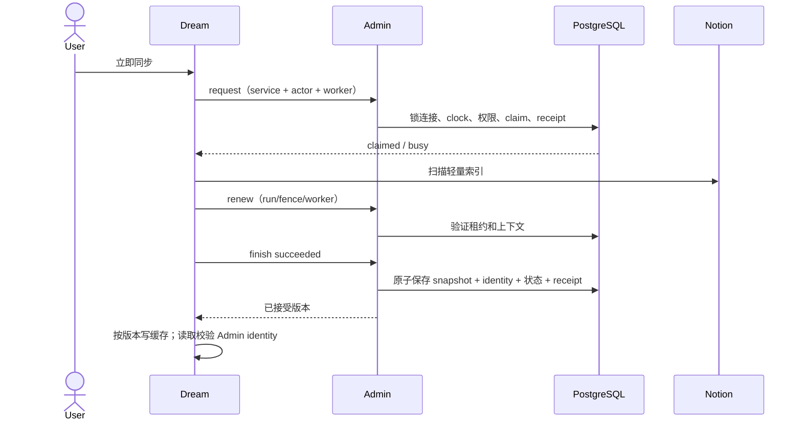
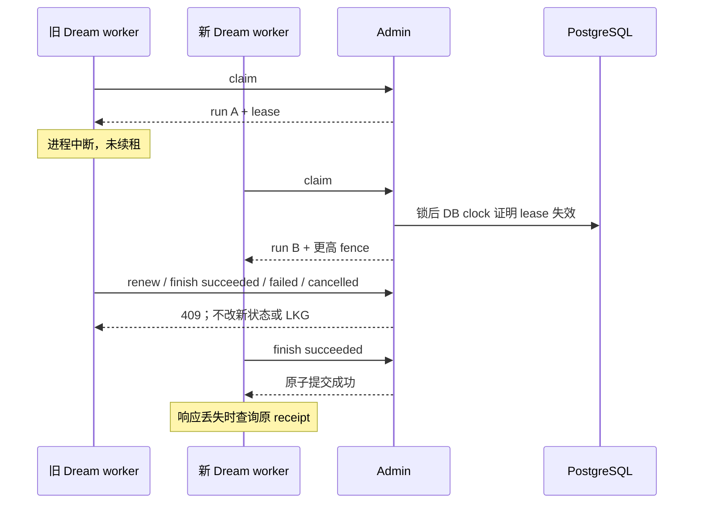
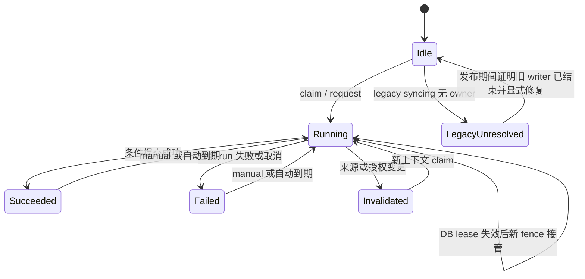

<!-- [Input] Current Admin Notion persistence and Dream execution/cache ordering. -->
<!-- [Output] Reviewed strict execution contract, publication gate and acceptance matrix. -->
<!-- [Pos] Formal Admin design; isolated technical review passed, normal publication gates remain open. -->
<!-- [History] Initial header described this contract as Proposed and independent review pending; those labels record drafting status only. -->
<!-- [Sync] 2026-10-07: publish reviewed source contracts through Git; preserve the three original business diagrams and separate normal rollout. -->
# Notion 同步执行归属合同

## 背景与问题

connector 行锁仅跨单次数据库事务，不跨 Notion 扫描。Dream 本地锁无法跨进程互斥。先发布 current.json 再保存 Admin 的顺序会使被拒绝的旧执行影响消费者。

## 目标与边界

复用 connector JSON/行锁、五表 Repository、operation receipt/audit 与现有认证。四个具名 operation 共用一个 claim 内核：user `notion.sync-run.request`；background `notion.sync-run.claim/renew/finish`。后者要求 connectors:sync；manual 同时要求验证 service scope 与 dream:write actor。worker_id 是 Dream 进程生成 UUID，浏览器不接触归属键。

无新业务表。仅由 Admin Drizzle 增加 identity.lock_active_notion_sync_actor(bigint,text)（固定 search_path、静态三表 FOR SHARE、PUBLIC revoke、仅 DATA execute，不授身份 UPDATE），并注册 `dream.notion-sync-ownership.v1` 精确 hash。服务器 `NOTION_SYNC_OWNERSHIP_CLAIMS_ENABLED` 未设或不为 true 时禁止新 request/claim；不禁止已有 run 的 renew/finish 和原 receipt 恢复。readiness 分别核对配置、gate 与精确 capability。新 operation 单独追加 registry，保留旧 21 descriptor/hash。读接口兼容。新代码拒绝所有旧同步 snapshot 和 identity/status 写入口；原 receipt 可重放已提交结果，但不能产生新效果。策略配置仍经原 patch，必须严格 revision 前进、desired/effective 一致，Admin 从当前状态重建结果字段，拒绝旧同步 transition。selected_* 与 reserved JSON 禁止 generic 写入；范围仅由 resources.replace/delete 更新。

## 概念与规则

Admin 保留 `snapshot_sync_execution` 包含 schema_version、selection_revision、authorization_revision、fence_epoch 和 nullable 当前 run。run 包含 run_id、service_client_id、worker_id、owner_user_id、上下文 revisions、policy_revision、started/heartbeat/lease timestamps、status 与安全 error_code。只保存当前执行，不建活动历史库。每次范围写及有效授权写推进单调 revision；同一 receipt 不重复推进。auth-state.save 保守地推进授权 revision，Dream 应仅在需要持久授权状态时调用。generic auth/status/session 或 platform 改动也推进上下文。空范围原子清 current identity。终止旧上下文的 run，保留范围求交下的 LKG。

每个操作锁 connector 和 active actor 行后读取 PostgreSQL clock_timestamp；actor active 行锁保持到提交，finish 持久化末尾再次检查 lease；不使用 transaction-start time 或客户端时钟。claim 校验 active canonical actor、有效授权、非空来源。活跃 lease 返回 busy。失效 lease 可替换，fence 单调增加。scheduled 在锁内判断最新 effective 与 due；manual 忽略自动开关。renew/finish 严格比对 service/worker/run/fence、actor、授权和范围 revisions、数据库时钟租约。错误分别为 RUN_INVALID / LEASE_EXPIRED / CONTEXT_CHANGED；任何旧执行成功、失败、取消均拒绝。

服务器 `NOTION_SYNC_EXECUTION_POLICY_JSON` 严格包含 lease_seconds、heartbeat_seconds、renewal_budget_seconds，正安全整数且 heartbeat+budget<lease；缺失 fail closed。原策略默认和允许间隔来自明确 config 模块，不复用租约作为产品频率。

finish succeeded 使用原 saveSnapshot 私有内核，同一事务保存 snapshot/page关系/current identity/成功状态/run terminal/receipt/audit，pages 必须为空、workspace 必须为 connector_id、snapshot_version 不允许修改旧内容。失败/取消只写安全枚举 code，保留 LKG。finish 按当前 policy 计算状态和 next-sync，不接受旧 policy 对象。

未知 write 必须以同一个 request_id/input 从原 receipt 核对，禁止新 claim/finish。已提交结果重放不等于当前租约有效；Dream 仍必须 renew 才能继续远程扫描。

## 发布、兼容与 Dream 集成门禁

expand capability → Dream 发布 strict DTO/receipt、renew、先 finish 后缓存、版本隔离写与 identity 读校验的兼容代码（暂不 claim） → drain 所有旧 Dream writer 和旧 Admin ingress 实例 → 全路由 enforcement 激活并证明旧写拒绝 → 启用新 claim → 公开合同验证。仅登记 capability 或新实例拒写不能证明旧实例已停止。不得混用新 claim 与旧 snapshot writer。无 owner 的 legacy syncing 返回 NOTION_SYNC_LEGACY_OWNER_UNRESOLVED；不能按年龄、本地锁或新进程启动接管。未提供证明与显式修复回执时保持该门禁，不自动数据迁移。

缺精确 capability 返回 DREAM_DATA_SCHEMA_NOT_READY；不依赖最新 Drizzle head。配置缺失返回 NOTION_SYNC_POLICY_NOT_CONFIGURED。部署和正常数据库迁移不属于本轮技术验证授权。

Dream 必须先接受 finish identity，再写 version-isolated cache；任何消费者读取须核对 Admin 接受的完整 workspace/connector/version/source_revision/sync_cursor 身份及当前范围，不能只比较版本名。不匹配应从现有 snapshot.current/get 读取接受版本。旧 run 迟到写本地文件不能覆盖被接受版本。续租拒绝后停止自建远程调用，不能再写 failed。凭证有效身份变化在 Dream 扫描前后检测并拒绝提交；Admin 不接收 token/路径。此跨项目集成由 Dream 主任务负责，本任务提供 DTO、能力与隔离回执。

## 验收矩阵

并发 claim 仅一个成功；manual busy；DB clock 过期接管与旧 run 全部拒绝；service/worker/actor 权限拒绝；范围及授权 A→B→A；关闭自动仍 manual；最新 policy 不被覆盖；失败保留 LKG；snapshot/identity/state/receipt/audit 故障原子回滚；原 receipt 重放及未知提交恢复；旧写入口封闭；legacy unresolved；精确 capability 缺失/错 hash fail closed；Drizzle replay/repeat/concurrent migrator；Markdown/路径/Mermaid/diff。仅具名可删除隔离 PostgreSQL，用生产 DTO/公开入口。不能将技术验证称真实业务恢复。

实施补充：legacy_owner_unresolved 是 Admin 保留的独立标记，普通策略/授权/范围保存不能清除。函数的 owner 必须仍为 identity schema owner；本合同由该 schema owner 执行迁移，EXECUTE 仅允许 owner 与当前 DATA 角色，PUBLIC/其他角色/授权转授漂移均 fail closed。新 finish 使用严格轻量 snapshot：完整 connector/index/databases/database_pages/pages/identity；拒绝正文、config、额外字段、错误类型、重复/越界索引及身份副本不匹配。旧 wire descriptor 不改。

## 源码 Git 交付与正常发布状态（2026-10-07）

本稿的三幅正常/异常时序及状态图保持原图体。独立技术评审与公开接口旅程已通过，Git 交付包含四项同步 operation、0074 capability 及不可省略的0073历史前置。正常数据库应用0074、全部旧 writer 排空、enforcement、claims 启用和新机制真实业务验收仍未闭合；合并源码不代表这些步骤完成。详见[本轮验证](../verification/notion-sync-ownership-20261007.md#源码-git-交付验证2026-10-07)。
