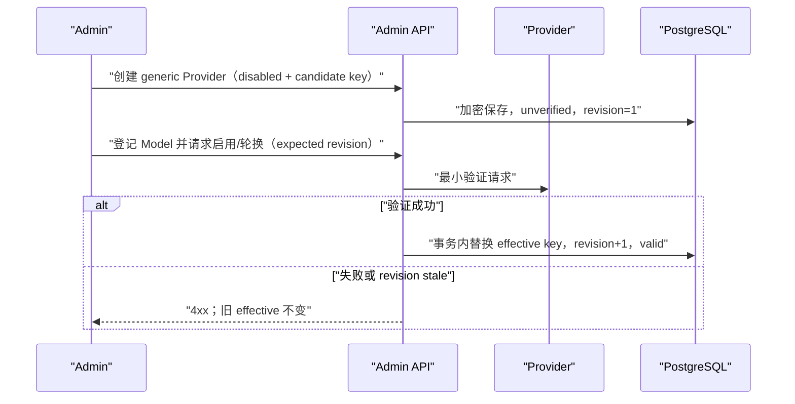
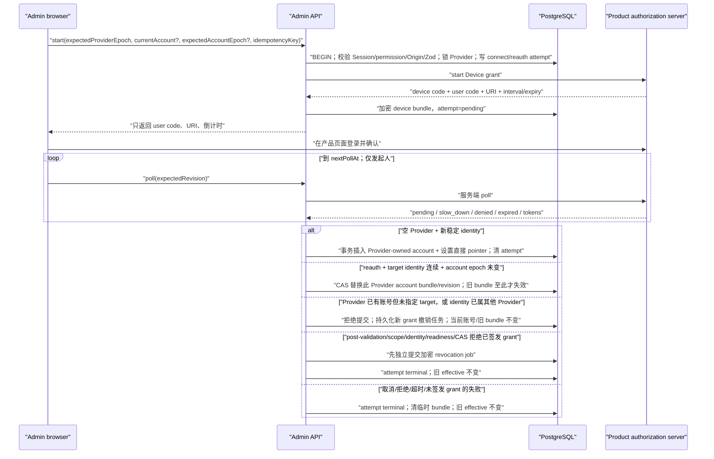
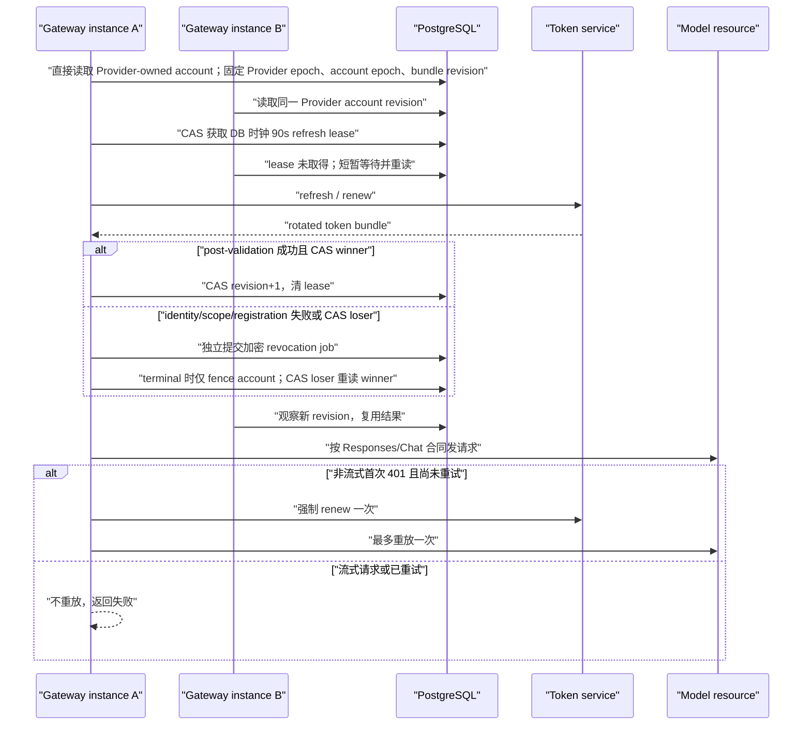
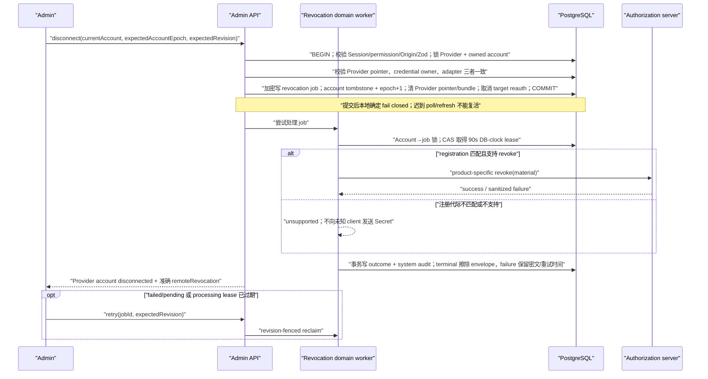

<!-- [Input] cc-switch evidence, official OAuth/RFC contracts, and the approved one-Provider-one-account lifecycle. -->
<!-- [Output] Go decision, single-account Provider rules, fenced Gateway lifecycle, migration path, and release acceptance. -->
<!-- [Pos] Canonical Provider authentication design; schema, Admin, Gateway, migration, deployment, and E2E docs must stay aligned with this contract. -->
<!-- [Sync] 2026-09-04: define post-connect managed catalog snapshots, generation/advisory locking, Apply boundaries, and unsupported Copilot models. -->

# Provider 认证能力与凭据生命周期设计

## 背景与问题

Ink Memory Admin 已有通用 Provider 的静态 API Key 能力，同时需要把 cc-switch 中 Codex、xAI 和 GitHub Copilot 的账号型认证经验迁移到单一 PostgreSQL 控制面。两类凭据不能继续共用一个模糊的“Bearer”概念：静态 Bearer 只是请求头格式，托管 OAuth/Device 则包含产品级客户端元数据、交互式授权、账号身份、刷新、撤销、并发 fencing 和 Gateway 运行期续期。产品对象的最终语义是：一个 managed Provider 对应一个产品账号和一组模型/运行配置；同一产品需要第二个账号时创建第二个 Provider，而不是在一个 Provider 内维护账号池。

### 问题研判

1. cc-switch 证明三类产品存在可工作的 Device/刷新链路，但它是单机桌面实现，依赖本地文件、进程内锁和内嵌客户端身份，不能直接充当多实例服务端合同。
2. Codex 官方文档公开了 ChatGPT 登录、Device Code beta、token 缓存与自动刷新；截至 2026-09-04，没有在所引官方页面中发现供任意第三方后端自助注册 Codex Device 客户端的合同。
3. xAI 的 OIDC discovery 公布了 Device、token、refresh、revoke 与 PKCE 能力，但 discovery 不包含动态 `registration_endpoint`；xAI 公共推理文档仍以 API Key 为公开接入方式。协议存在不等于本部署已取得可用 OAuth client。
4. GitHub 官方明确支持开发者创建自己的 OAuth App/GitHub App 并启用 Device flow；但 GitHub 登录成功不等于 Copilot entitlement、组织策略与 integration profile 已获准。
5. 产品决策现明确要求 cc-switch parity：Codex、xAI、GitHub Copilot 的公开 native-client 元数据随代码固定发布，管理员无需另行注册 OAuth 应用；加密密钥、identity pepper、Endpoint policy、授权结果和真实账号 entitlement 仍是 fail-closed gate。上游可随时拒绝这些客户端或改变版本门槛，因此固定值必须与参考 commit 一起升级并由 E2E 验证。
6. 先前的产品账号池/default/binding 设计会让列表中两个同名 Provider 与一个共享账号的归属关系不可判断，也会把账号切换变成隐式运行时行为。最终裁决恢复严格所有权：一个 live managed credential 只能属于一个 Provider；禁止复制 refresh token，也禁止两个 Provider 共享同一 live credential。
7. cc-switch 的 generic 与三个产品模型接口都由用户显式触发：它证明上游请求形状，不证明认证后自动同步。Ink Memory 另行定义产品行为：managed credential 提交后立即做一次账号级 discovery，仅形成 review snapshot；认证与发现是两个独立结果。

### cc-switch 证据基线

- 只读源目录：`/Users/dmeck/project/cc-switch`。
- 审查时 HEAD：`92d529168560bdec4ca1b429b50a203c5fc8a87e`，提交 `fix(codex): reject duplicate managed accounts (#7061)`。
- 审查时分支显示 `main...origin/main`，但本轮没有执行远端 `fetch`，所以“与远端最新提交同步”的基线未确认。
- 工作树非干净：存在未跟踪的 `docs/codex-local-routing-modules.md` 与 `docs/codex-local-routing-sequence.md`。它们不作为本设计的协议来源。
- Codex 的固定客户端、Device endpoints、授权码/PKCE 交换和 refresh 证据：`/Users/dmeck/project/cc-switch/src-tauri/src/proxy/providers/codex_oauth_auth.rs:35-67`、`:400-518`、`:520-728`。
- xAI 的 issuer/discovery、固定客户端和 scope 证据：`/Users/dmeck/project/cc-switch/src-tauri/src/proxy/providers/xai_oauth_auth.rs:18-27`；discovery → Device → poll → refresh/单飞证据：`:220-401`、`:515-638`、`:731-746`。
- GitHub Copilot 的固定客户端与 integration fingerprint 证据：`/Users/dmeck/project/cc-switch/src-tauri/src/proxy/providers/copilot_auth.rs:26-42`、`:135-140`；Device → GitHub identity → Copilot entitlement/token 与刷新锁证据：`:597-715`、`:720-780`、`:822-844`。
- Codex 账号级模型目录的 endpoint、account header 与响应形状证据：`/Users/dmeck/project/cc-switch/src-tauri/src/services/codex_oauth_models.rs:1-69`。
- xAI 账号级 `/v1/models` 命令证据：`/Users/dmeck/project/cc-switch/src-tauri/src/commands/xai_oauth.rs:77-135`。
- Copilot `/models` 的 vendor/model-picker/capabilities 解析与产品 header 证据：`/Users/dmeck/project/cc-switch/src-tauri/src/proxy/providers/copilot_auth.rs:190-216`、`:796-885`；显式 fetch/刷新编排证据：`/Users/dmeck/project/cc-switch/src-tauri/src/proxy/forwarder.rs:2638-2740`。
- 上述行号只对该 commit 和审查时工作树成立。本实现按明确产品决策复制其中的公开 client ID、scope、User-Agent 与 integration fingerprint，但绝不复制 client secret、Token、Cookie 或本机凭据；这种兼容行为不等于上游向任意第三方发布了长期托管合同。

## 目标与边界

### 目标

- 一个 Provider 明确选择 `generic | codex | xai | github_copilot` adapter，创建后不可原位换产品。
- 通用 Provider 保留静态 API Key/Bearer 兼容路径；三个产品 adapter 使用服务端托管 Device/OAuth 路径。
- 每个 managed Provider 最多拥有一个 live account credential；同一产品的多个账号由多个 Provider 表达，列表直接展示每张卡片的账号 label。
- Admin 只展示安全投影；Device code、access token、refresh token、source token 与 client secret 永不下发浏览器或回显 API。
- 尝试态与账号有效态分离；定向 reauth 保持 account ID 和旧 bundle，只有同一 identity 的新 grant 通过后才原子替换。
- Gateway 每个请求固定 Provider auth epoch、该 Provider 直接拥有的 account ID、account epoch 和 bundle revision；到期时按该账号做跨实例 singleflight，不自动 failover。
- 移除账号与所有“已签发但未生效”的 grant 都先持久化最小撤销材料；本地状态 fail closed，远端撤销通过可恢复 outbox 如实记录 outcome。
- managed credential/account 提交后自动执行一次产品专用模型发现，返回可审查 snapshot；失败不回滚连接，成功也不自动创建 Model 或 Pricing。

### 边界

- 不导入 `~/.codex/auth.json`、cc-switch 本地 token、GitHub CLI/Copilot CLI credential store 或浏览器 cookie。
- 不把任意 OAuth client ID、客户端指纹或 endpoint 放进数据库供管理员编辑；三个已支持产品使用版本固定的服务端默认值，环境变量只提供受控升级覆盖。
- 不承诺上游永久接受内置客户端元数据，也不承诺 GitHub Copilot entitlement；真实授权/资源交换仍是最终能力证明。
- 不新增通用 OAuth 编辑器，不允许管理员填写任意 issuer、token endpoint、scope 或 header。
- 不为测试加入 production test-only 分支，不用真实消费者账号、真实 token 或生产数据库验收。
- Claude Code/Codex runtime 自主管理登录、WIF 和 CLI 本地账号导入不在本阶段。不做账号池、默认账号、权重、轮询、健康分、配额感知选择或失败自动切换。
- 不把 post-connect discovery 扩展成周期同步、启动同步或后台自动重试；Ink 现有 generic Provider 保持“新建成功后自动一次 + 卡片手动重试”。静态目录不作为 managed 产品账号的模型事实来源。

## 概念与规则

### 核心对象

| 对象 | 含义 | 可见性 |
| --- | --- | --- |
| Provider | 稳定的路由/模型配置；拥有 adapter、desired status、唯一 managed credential pointer 与 `authEpoch` | Admin 安全字段 |
| Product protocol profile | 固定 client ID、scope、issuer、integration profile、可选 client secret 和 endpoint policy | 服务端代码默认；env 只做高级覆盖 |
| Registration fingerprint | 对产品、client、scope、issuer/集成身份的稳定摘要；不包含 secret | Admin/Gateway 可见摘要 |
| Provider account | 由一个 Provider 独占的产品账号；拥有稳定 account ID、keyed identity fingerprint、状态、`accountEpoch`、`bundleRevision`、加密 token bundle 和 refresh lease | Admin 安全投影；Gateway 可解密 |
| Keyed identity fingerprint | 对产品稳定 identity canonical value 做 HMAC-SHA-256 的摘要，用于去重与 reauth continuity；不存原始 subject/account ID | 数据库可比较；前端不可见 |
| Auth attempt | 一次 `add | reauth` Device 操作，记录 actor、target account/期望 account epoch、过期、poll revision 与加密临时 bundle | Admin 安全投影 |
| Revocation material | 仅足够撤销一个已签发 grant 的产品特定最小 Secret：Codex/xAI refresh token，Copilot source access token | 只能经不可 JSON 序列化的进程内 handoff 进入加密 outbox |
| Revocation job | 绑定 account/来源 attempt、source account epoch/bundle revision、registration fingerprint、加密材料、DB-clock lease、重试与准确终态 | Admin 只见无 Secret 状态；领域服务可解密处理 |
| Catalog generation | adapter/产品合同版本、Provider auth epoch、account ID/account epoch、credential revision 与 registration fingerprint 的稳定组合 | 服务端并发/陈旧检查；前端不拼装 |
| Discovery snapshot | 某 generation 下规范化后的账号模型目录、catalog hash、`new/existing/conflict/unsupported` diff、过期与 Apply 状态 | Admin 只见安全模型元数据与计数 |
| Effective access snapshot | 一个 Gateway 请求固定的 Provider auth epoch、Provider-owned account ID、account epoch、bundle revision、URL、dialect 与产品 headers | 仅 Gateway 内部/无 Secret 审计摘要 |

### 产品映射矩阵

| Adapter | 授权与稳定身份 | 续期 | Gateway 资源合同 | 运行时前置 |
| --- | --- | --- | --- | --- |
| `generic` | 管理员写入静态 API Key；以 fingerprint/revision 表示版本 | 人工验证轮换 | 按 Provider protocol 使用 Anthropic Messages 或 OpenAI Chat，`x-api-key`/Bearer | 上游 API Key 与 host allowlist |
| `codex` | Device → authorization code + verifier → token bundle；以 OIDC subject + ChatGPT account ID 绑定 | refresh token rotation | `openai_responses`；ChatGPT Codex Responses；固定 `originator/version` | 内置 cc-switch-compatible product profile；账号/工作区允许 Device Code 和 Codex |
| `xai` | OIDC discovery → Device grant；以 OIDC `sub` 绑定 | refresh token rotation | `openai_responses`；xAI Responses | 内置 Grok CLI product profile；账号具备对应 API/product access |
| `github_copilot` | GitHub Device → GitHub user token → `/user` 数字 ID → Copilot token；以 `github.com + numericId` 绑定 | 用 source token 续取短期 Copilot token；source refresh 如存在则轮换 | `openai_chat`；GitHub Copilot Chat Completions；固定 VS Code/Copilot profile headers | 内置 github.com product profile；用户/组织具备 Copilot entitlement |

`clientRegistrationConfigured`、`integrationProfileConfigured` 与 `copilotAccessVerified` 是不同事实。特别是 Copilot：前两项就绪只能开始授权；只有 token exchange/资源资格验证成功后才可将账号视为 connected。

模型目录同样按 adapter 分离：Codex 携带 ChatGPT account ID 读取 `/backend-api/codex/models?client_version=...`；xAI 以该账号 access token 读取 `/v1/models`；Copilot 以该账号短期 token 和固定 integration headers 读取 `/models`。Copilot 返回的 `vendor=openai` 或仅支持 Responses 的模型，与本项目当前固定 `openai_chat` Gateway 合同不兼容，必须标记 `unsupported` 并禁止 Apply，不能用上游 picker 可见性替代路由能力判断。

### 角色与权限

| 角色 | 权限/职责 |
| --- | --- |
| 部署运营方 | 在 secret manager/env 提供加密 key 与 identity pepper；需要升级固定产品元数据时才显式覆盖，不经 Admin UI 编辑 |
| `providers.read` 管理员 | 查看 Provider、readiness、账号 label、attempt 状态、到期和 revoke outcome；非 attempt 发起人也不能看到用户码/验证 URI |
| `providers.write` 管理员 | 创建 disabled Provider，开始/轮询/取消本人 attempt，重新授权、disconnect，满足业务 gate 后启用 |
| Attempt 发起人 | 在 active attempt 上继续 poll/cancel；其他管理员只能观察“由另一位管理员发起” |
| Gateway | 按已解析 Provider/Model 权限读取并解密 effective bundle，刷新、构造产品 header 和调用资源；不拥有 Admin 会话权限 |
| 浏览器 | 仅接收 `userCode`、验证 URI、倒计时和安全状态；直接访问 identity provider，不接触 `deviceCode` |

所有 Admin API 在服务端重复 Session、permission 与 mutation Origin 检查。按钮隐藏不是授权边界。

### Desired、effective、revision

- `desired` 是管理员想要的 Provider 运行状态和产品选择；创建时固定 adapter，Provider 一律先 `disabled`。
- `effective` 是运行时事实，不等同于 desired。托管产品必须同时满足：代码支持、有效 product profile、加密 key/identity pepper、Endpoint policy、可由当前 key 解密并通过严格 schema/product 校验的 connected credential、Provider `active`、至少一个 enabled Model 和有效 pricing。
- `revision` 不是单一数字：
  - `provider.authEpoch` fence Provider 的认证所有权代际；连接、断开或替换账号时推进。
  - `account.authEpoch` fence 账号生命周期；remove、terminal invalid grant 与定向 reauth 的目标校验使用它，普通 refresh 不推进。
  - `attempt.revision` fence poll/cancel；请求必须携带 `expectedRevision`。
  - `credential.revision` fence refresh rotation；新 token bundle 用 CAS 原子替换。
  - `revocationJob.revision` fence 手工重试；processing lease 到期才能被新实例恢复，旧 worker 不能提交终态。
  - `registrationFingerprint` fence product-profile 代际；代码升级或 env override 改变 client/scope/issuer/integration identity 后旧 bundle 不再 effective，必须重新授权。
  - `catalog generation` fence 账号模型事实；任何 auth/account/credential/registration 或 adapter 合同代际变化都会产生新 generation，旧 snapshot 不得 Apply。
- `desired=active` 但任一 effective gate 不成立时，服务端拒绝启用或立即 fail closed，不降级到静态 Key、旧 token、内存凭据或未知 endpoint。

### Attempt 与 effective credential 分离

| Attempt 状态 | 是否可显示用户码 | 是否改变旧 effective | 后续动作 |
| --- | --- | --- | --- |
| `starting` | 否 | 否 | 等待上游创建 Device grant；失败转 `failed` |
| `pending` | 是 | 否 | 按 `nextPollAt` poll；可取消 |
| `succeeded` | 否 | 新增账号时插入独立账号；定向 reauth 时只替换同一 account ID 的 bundle | 清除 attempt 临时密文 |
| `denied` | 否 | 否 | 显示拒绝，可重新开始 |
| `expired` | 否 | 否 | 显示过期，可重新开始 |
| `cancelled` | 否 | 否 | 显示取消，可重新开始 |
| `failed` | 否 | 否 | 显示安全 failure code，可按可重试性重试或重新开始 |

空 Provider 首次授权会创建它唯一的账号；已有账号时，缺少 target 的“再添加”请求返回 `PROVIDER_MANAGED_ACCOUNT_ALREADY_CONNECTED`。定向 reauth 必须保持 identity continuity，并在旧 `accountEpoch`/bundle revision 上 CAS。相同稳定 identity 也不能同时归属其他 Provider；新 grant 验证或提交失败时旧 bundle 继续 effective，disconnect 后迟到的 poll/refresh 不得复活 tombstone。

### Post-connect 模型发现与 Apply

认证成功的提交事务只负责 credential/account、Provider pointer、attempt 终态与必要撤销 handoff。该事务提交后，poll 请求立即以已提交的账号凭据执行一次产品专用 discovery：成功响应带 `catalogSync={status:"succeeded", snapshotId, discoveredCount, newCount, conflictCount, unsupportedCount, reused}`；失败仍为 HTTP 200、`credentialStatus=connected`，只带 `catalogSync={status:"failed", code}`。模型上游失败绝不把账号改回未认证，也不删除或替换 effective bundle。

Discovery 仅保存 snapshot，不创建 Model/Pricing。管理员可通过 Provider 编辑页手动重试；成功后进入 `/admin/models/providers/:id/discover/:snapshotId` review。Diff 状态固定为：

- `new`：本地无对应 Model，可选；Apply 后以 `disabled` 创建。
- `existing`：对应本地 Model，可选；Apply 只刷新显示名、能力、上下文等安全 catalog 元数据，不隐式启用。
- `conflict`：标识或映射存在歧义，不可直接 Apply。
- `unsupported`：产品目录存在但当前 Gateway dialect 无法路由，不可选择；目前包括 Copilot 的 OpenAI/Responses 模型。

上游本次缺失的已有本地 Model 不停用、不删除。Discovery 和 Apply 都不创建、匹配或更新 Pricing；价格覆盖仍是独立、可审计的版本流程。

并发以数据库为权威：服务端先计算当前 catalog generation；generation 与规范化 models 共同产生 catalog hash，并在事务中取得 Provider + catalog hash 的 PostgreSQL transaction advisory lock；相同 hash 且 Provider 未变化时可复用未过期 ready snapshot。Apply 再锁 snapshot，重新计算当前 generation/models hash，并核对 Provider `updated_at`；任一 fence 改变即返回 409 stale。认证后的自动 discovery 只有一次，没有轮询 worker、周期任务或失败自动重试。

### Admin API 合同

| Route | 权限 | 严格请求 | 安全响应/规则 |
| --- | --- | --- | --- |
| `GET /api/admin/providers/:id/managed-auth/status` | `providers.read` | 无 | `no-store`；Provider/readiness/当前账号/attempt 安全投影；兼容字段也不得返回其他 Provider 的账号 |
| `POST /api/admin/providers/:id/managed-auth/start` | `providers.write` + Origin | `expectedAuthEpoch`, `idempotencyKey`, 可选 `targetAccountId/expectedAccountEpoch` | 空 Provider 才允许无 target 首次连接；已有账号必须定向 reauth；只返回 user code、URI、expires/poll/revision |
| `POST /api/admin/provider-auth-attempts/:id/poll` | `providers.write` + Origin + 发起人 | `expectedRevision` | pending/slow_down/terminal/connected 安全状态；connected 后追加上述 `catalogSync` union，发现失败仍返回 connected |
| `POST /api/admin/provider-auth-attempts/:id/cancel` | `providers.write` + Origin + 发起人 | `expectedRevision` | 幂等 terminal cancel；清除 attempt 临时密文 |
| `POST /api/admin/providers/:id/managed-auth/binding` | `providers.write` + Origin | 任意 | 已移除的兼容入口；返回 unsupported，不再允许改绑其他 Provider 的账号 |
| `POST /api/admin/providers/:id/managed-auth/accounts/:accountId/default` | `providers.write` + Origin | 任意 | 已移除的兼容入口；返回 unsupported，不存在产品默认账号 |
| `POST /api/admin/providers/:id/managed-auth/accounts/:accountId/disconnect` | `providers.write` + Origin | `expectedAccountEpoch`, `expectedRevision` | 只接受该 Provider 当前拥有的账号；同事务写撤销任务、tombstone 并清 Provider pointer |
| `POST /api/admin/providers/:id/managed-auth/revocations/retry` | `providers.write` + Origin | `jobId`, `accountId`, `expectedRevision` | Provider 仅提供权限/产品上下文；只恢复该 account 的 pending/failed 或 lease 已过期 processing job；返回安全投影 |
| `POST /api/admin/providers/:id/discover` | `models.write` + Origin | 空 strict body | generic 卡片手动发现或 managed post-connect 失败后的手动重试；创建/认证后的自动动作复用同一领域服务，成功返回 snapshot ID、计数与 `reused` |
| `GET /api/admin/provider-discovery/:snapshotId` | `models.read` | 无 | 返回 snapshot 与安全 diff，不含 token/header/raw upstream body |
| `POST /api/admin/providers/:id/apply-discovery` | `models.write` + Origin | snapshot ID、所选 model IDs/aliases 与 snapshot fence | generation/hash/Provider stale 检查后原子 Apply；unsupported 拒绝；不写 Pricing |
| `DELETE /api/admin/providers/:id` | `providers.write` + Origin | 服务端投影的 opaque `expectedDeleteRevision` | Model 或间接 Pricing 非空时 409；connected account、active attempt、未完成 revoke 必须先安全收口；成功写 tombstone、清静态 Secret 并从 list/detail 隐藏，历史请求/计费/审计不删 |

所有 body 使用 strict schema，未知字段失败；所有响应携带 request ID，不返回 token、device code、client secret、密文列或上游原始错误 body。

### UI 状态与中文文案

| 条件 | 主状态/主操作 | 必须展示的中文文案 |
| --- | --- | --- |
| 正在加载 | 无 | `正在读取产品认证状态…` |
| 显式 product profile 覆盖无效或服务端安全 gate 未就绪 | `尚未生效`；保留产品登录按钮并 disabled | `未认证`；说明无效产品配置、加密密钥/identity pepper 或 Endpoint policy；服务端保持 fail closed |
| 未连接且可授权 | `尚未生效`；产品登录按钮（`使用 ChatGPT/xAI/GitHub 登录`） | `未认证`；说明授权成功后账号固定属于此 Provider |
| 已有账号 | 主操作 `重新授权`，次操作 `断开账号` | 只显示此 Provider 的账号 label、状态和到期；第二个账号使用 `新建 Provider` |
| start 中 | `授权进行中` disabled | `正在创建授权` |
| pending 且本人发起 | `授权进行中` disabled；`立即检查`、`取消本次授权` | `在产品验证页输入用户码`、`复制用户码`、`打开验证页面`、下次检查/剩余倒计时 |
| pending 且他人发起 | 无用户码、验证 URI、poll/cancel 按钮 | `该授权由另一位管理员发起；用户码与验证地址仅对发起人可见。` |
| 当前账号 connected 但 Provider disabled | `账号已连接 · Provider 尚未启用` | 当前账号 label/到期 |
| connected 且全部 gate 生效 | `认证可用于 Gateway` | 当前账号 label/到期 |
| connected 且自动模型发现成功 | 进入模型 review | 显示 snapshot 的新增/已有/冲突/不支持计数；Apply 前不创建 Model/Pricing |
| connected 且自动模型发现失败 | 保持账号已连接；`重试同步模型` | 显示安全 failure code；不得显示“认证失败”、token、Authorization header 或上游原始 body |
| connected 行存在但 registration 已变化或当前 key 无法解密/内容损坏 | `尚未生效`；账号状态 `认证不可用`；按 readiness 决定是否允许重新授权 | registration 变化时要求重新授权；无法解密时说明 Gateway 保持停用，并允许恢复部署密钥或断开后重连 |
| 当前账号 `reauth_required` | 显示 `重新授权`、`断开账号` | 此 Provider effective=false；不自动换其他账号 |
| denied/expired/cancelled/failed | `授权被拒绝`/`授权已过期`/`授权已取消`/`授权失败`；可重新开始 | 安全 `failureCode`，不显示上游 secret/body |
| 撤销 pending/failed | 本地继续停用；`重试远端撤销` | `远端凭据撤销尚未完成`、安全 failure code；说明撤销材料仍为密文 |
| 撤销 processing 且 lease 过期 | `恢复远端撤销` | 只在 DB-clock lease 到期后允许 revision-fenced reclaim |
| disconnect account | 风险确认后执行 | 清除此 Provider 的账号 pointer；本地与远端结果分开展示 |
| delete Provider | 一次风险确认；必要时先安全断开账号 | `仍有关联模型或定价` 时显示 Model/Pricing 数量和 `请先删除 Pricing 和模型`；不提供级联删除 |

Device 步骤只有断开账号属于立即清除本地 bundle 的高风险动作，保留一次确认；Provider 删除复用同一次删除确认，不再叠加第二个断开确认。start、poll、cancel 和撤销重试不增加重复确认弹窗。

### 静态 API Key 兼容

- `generic` 保留 `x-api-key` 或静态 Bearer header 模式；这两者都不是 OAuth 状态。
- 新 Provider 只能 disabled/unverified；启用或任何敏感轮换先用确定性 Model 做最小验证。
- candidate 只在验证期间存在，成功才原子替换；失败、超时与 409 均保留旧 effective。
- 产品 adapter 不接受 `baseUrl`、`apiKey` 或可编辑 `authMode`，也不回退到 generic。

### Device 开始、浏览器、等待、取消与恢复

- start 的 idempotency key 按 actor、Provider、current account/epoch、adapter、registration fingerprint 和 canonical request 校验；同请求复用，不同请求冲突。
- 同一 Provider 同时只允许一个 active attempt。已有账号时必须携带当前 account target 做 reauth；未携带 target 的第二次 connect 返回 409。旧网络结果受 attempt revision、Provider epoch、target account epoch 与 registration fingerprint fence，不能在 disconnect 后提交。
- 浏览器可打开 `verificationUriComplete`，否则打开 `verificationUri` 并复制 `userCode`；绝不接收 `deviceCode`。
- `authorization_pending` 保持 pending；`slow_down` 至少增加 poll 间隔；未到 `nextPollAt` 返回可重试等待，不忙轮询。
- cancel 仅发起人可执行；terminal cancel 幂等。拒绝、过期和 terminal protocol error 清临时密文。
- 页面刷新/浏览器重启后从 PostgreSQL 恢复 pending 投影与倒计时；服务进程重启不依赖内存 attempt。
- retryable 网络/5xx 只延后下一次 poll；denied、expired、registration changed、identity mismatch、duplicate identity、invalid grant 等 terminal 结果要求重新开始或重新授权。
- Adapter 一旦从 token endpoint 收到可撤销的长期 grant，就同时创建不可 JSON 序列化的 revocation handoff；后续 scope、JWKS、identity、entitlement、readiness 或数据库提交失败不能丢失该 handoff。

### Gateway refresh rotation、singleflight 与 401

- Gateway 每个请求只做一次 Provider→owned credential 直接解析。它固定 Provider auth epoch、account ID、account epoch、bundle revision 与 registration fingerprint，并把无 Secret 快照写入 Gateway request；历史 `provider_managed_default_revision` 固定为 `NULL`。
- 到期 bundle 通过 PostgreSQL lease + CAS 做跨实例 singleflight；lease loser 重读 revision，不能再用旧 refresh token 覆盖 rotation。
- 产品控制面单次 HTTP 请求最多 15 秒且拒绝 redirect；一次 poll/renew 最多三个串行请求，严格短于 90 秒 DB-clock lease。
- refresh 返回新 refresh/source token 时完整替换此 Provider 账号的加密 bundle，不保留旧 generation。
- 被 CAS winner 替代、或续期后验证失败的新长期 grant，不得只丢弃内存结果；必须以 immutable source revision 绑定 envelope AAD 写入撤销 outbox，并在后续安全处理。
- terminal `invalid_grant`、身份改变或 source token 失效只把 account 标成 `reauth_required` 并推进 account epoch；Provider desired 与 account pointer 保留，该 Provider 请求 fail closed，不尝试其他账号。
- Provider/account snapshot 在请求执行前变为 stale 时重新解析整条请求；收到 401/refresh 失败不得在同一请求内切换账号或自动 failover。
- 非流式请求在未产生可见输出前，可因一次 401 强制 renew 并最多重放一次。流式链路不设置该许可：请求一旦发出/可能产生输出，401 不重放，避免工具调用或计费副作用重复。
- retryable refresh 错误返回可重试配置错误；不会回退到旧 token 或静态 API Key。

### Provider 账号断开与 remote outcome

- Provider 不提供改绑或默认切换 API。要接入另一个账号，新建 Provider；要更换当前账号，先断开再授权，或对同一 identity 定向 reauth。
- disconnect 只能作用于 URL Provider 当前直接拥有的 credential；account ID 属于其他 Provider 或 pointer 已变化时返回 409，不得跨 Provider 清理。
- 撤销任务写入与账号 tombstone 属于同一事务；任务无法持久化时不得清除唯一撤销材料。事务提交后本地停用是确定性安全边界，远端失败不能恢复 effective。
- outcome 只允许 `pending | succeeded | failed | unsupported | not_attempted`；`processing` 只存在于安全状态投影，禁止把“删除本地 token”写成“远端已撤销”。
- GitHub Device flow 不要求 client secret；但应用级远端 grant revoke 需要与当前 client ID 匹配的 client secret，缺失时是 `unsupported`，不是失败的本地断开。
- registration fingerprint 已改变时不向未知/不匹配 registration 发送旧 token，记录 `unsupported`。
- `succeeded/unsupported` 必须在同一事务内清空全部 envelope 列；`failed` 保留密文并使用有界技术重试时间，管理员可显式重试。系统在每次 finish 写 Secret-free 幂等审计。

### 并发、幂等与审计

- 所有敏感状态转换在事务内执行，并带 Provider epoch、account epoch、attempt/bundle revision 或 operation lease 条件；0 row update 视为 stale/conflict。
- start、poll、refresh 与 revoke 都使用 DB-clock 90 秒 operation lease；同一记录只有一个实例访问上游。断线实例的 lease 到期后可恢复。
- start idempotency key 只保存 hash；同 actor/同 canonical request 重放返回同 attempt，跨 actor 或不同 canonical request 返回 409。
- connect account、Provider direct pointer、attempt succeeded/临时密文清除与旧 grant 撤销任务入队在同一事务；新 grant 在事务前被拒绝时先独立持久化撤销任务，任何一步失败都不产生半连接状态或无主长期 grant。
- 审计至少记录 actor、request ID、Provider、adapter、account/attempt ID、before/after status、epoch/revision、registration fingerprint 摘要、failure code、refresh/revoke outcome；不记录 token、device code、user code、client secret、identity fingerprint、Authorization header 或上游原始响应。
- 关键 action 包括 `managed_auth_start`、`managed_auth_pending/slow_down`、`managed_auth_connected`、`managed_auth_denied/expired/failed/cancelled`、`managed_auth_disconnected`、`managed_auth_remote_revocation`、`managed_auth_remote_revocation_retry` 与 system `provider_remote_revocation_finished`。

### 安全边界

- `AI_CREDENTIAL_ENCRYPTION_KEY`、`AI_CREDENTIAL_ENCRYPTION_KEY_ID` 与独立的 `AI_PROVIDER_ACCOUNT_IDENTITY_PEPPER` 由部署 secret manager 提供；attempt/account 使用认证加密 envelope，稳定 identity 只以 keyed HMAC fingerprint 参与去重。
- client ID 不是 secret；三个产品的固定客户端元数据仅存在服务端源码/config，并以 cc-switch commit 为升级基线，不进入迁移、数据库业务行或前端 bundle。client secret、Token、Cookie 和本机 CLI 凭据始终禁止内置或复制。
- endpoint override 仅部署级高级配置；仍必须是 HTTPS、默认 443、无 userinfo/hash，并精确命中产品/用途 host allowlist。Admin 不接受任意 URL。
- verification URI 可带查询参数但仍受产品 authorization host policy；token/discovery/resource endpoint 禁止任意 query/host 跳转，并使用 `redirect: error`。
- scope 使用固定产品集合并进入 registration fingerprint；token 响应显式返回 scope 时必须覆盖配置 required scopes，缺少任一项即拒绝生效并撤销新 grant。改变 scope 等于新 registration generation，要求重新授权。Codex refresh scope 与 cc-switch 一致为 `openid profile email`，refresh token 本身是离线续期能力的权威事实。
- Codex/xAI ID Token 通过受限 JWKS 验证签名、固定 issuer、当前 product-profile client audience、有效期和允许算法后才提取稳定身份；Device 合同未提供 nonce 时不伪造 nonce 规则。
- 日志、错误、metrics 与响应统一 secret-safe；上游 body 先结构化分类再丢弃，不把 OAuth 错误描述原样透传。
- OAuth discovery/device/token/identity/refresh/revoke JSON 响应最多 64 KiB；账号模型目录使用独立的 8 MiB 传输上限，并在规范化层继续限制最多 5000 个模型。两类上限不得互相复用或取消。
- Provider 密钥和 Gateway Key 不明文落库；账本与计费不因认证方式改变，Gateway 仍走同一预授权/结算合同。

### 服务端配置

三个产品默认使用下表固定元数据，可直接显示并执行该 Provider 的产品登录。这些值来自 cc-switch committed HEAD `92d529168560bdec4ca1b429b50a203c5fc8a87e`；升级时必须同步协议测试和浏览器 E2E。

| 产品 | 内置 product profile | 必需部署 Secret | 可选覆盖 |
| --- | --- | --- | --- |
| 全部 | 产品 endpoint 受固定 host policy 约束 | `AI_CREDENTIAL_ENCRYPTION_KEY`、`AI_PROVIDER_ACCOUNT_IDENTITY_PEPPER`；`AI_CREDENTIAL_ENCRYPTION_KEY_ID` 未设置时由现有 key 派生 | 旧 key/identity pepper 轮换材料由显式数据迁移管理 |
| Codex | client `app_EMoamEEZ73f0CkXaXp7hrann`；scope `openid profile email`；UA `cc-switch-codex-oauth`；`originator=codex_cli_rs`；`version=0.144.1` | 同“全部” | 对应 `INK_PROVIDER_CODEX_*` 元数据及固定 host endpoint overrides |
| xAI | client `b1a00492-073a-47ea-816f-4c329264a828`；scope `openid profile email offline_access grok-cli:access api:access`；UA `cc-switch-xai-oauth`；issuer `https://auth.x.ai` | 同“全部” | 对应 `INK_PROVIDER_XAI_*` 元数据及 discovery/resource overrides |
| GitHub Copilot | client `Iv1.b507a08c87ecfe98`；scope `read:user`；UA `GitHubCopilotChat/0.38.2`；integration `vscode-chat`；editor `vscode/1.110.1`；plugin `copilot-chat/0.38.2`；API `2025-10-01` | 同“全部” | 对应 `INK_PROVIDER_GITHUB_COPILOT_*`；`_CLIENT_SECRET` 仅使匹配注册的远端 revoke 可用 |

高级 override 采用 `INK_PROVIDER_<PRODUCT>_{DEVICE_AUTHORIZATION_ENDPOINT|DEVICE_POLL_ENDPOINT|TOKEN_ENDPOINT|VERIFICATION_ENDPOINT|REDIRECT_URI|DISCOVERY_ENDPOINT|JWKS_ENDPOINT|IDENTITY_ENDPOINT|COPILOT_TOKEN_ENDPOINT|REVOKE_ENDPOINT|RESOURCE_ENDPOINT|MODELS_ENDPOINT}`。本阶段具体模型覆盖为 `INK_PROVIDER_CODEX_MODELS_ENDPOINT`、`INK_PROVIDER_XAI_MODELS_ENDPOINT` 与 `INK_PROVIDER_GITHUB_COPILOT_MODELS_ENDPOINT`。不是每个产品使用全部字段；无值时用 registry 内受限默认 endpoint，有值也必须通过相同 host policy。

### 数据模型与前向迁移

- `ai_provider_managed_credentials` 保存 Provider account lifecycle、keyed identity、加密 bundle 与 refresh lease；live 行的 `provider_id` 是唯一 owner，Provider 的 `managed_credential_id` 必须通过三列 FK 同时匹配 credential ID、owner Provider ID 与 adapter。
- 每个 Provider 最多一个 `connected | reauth_required` credential；同一 adapter + 稳定 identity 也只允许一个 live credential，避免复制 refresh token。disconnected 历史行可保留 nullable owner，不进入 Gateway。
- `managed_account_binding_mode` 为不可编辑兼容列：managed 恒 `pinned`，generic 恒 NULL。产品默认账号表在 0050 删除；新应用代码不读 default/binding，Gateway 历史 `provider_managed_default_revision` 保留 nullable 且新写入恒 NULL。
- `0047`/原显式 runner/`0048` 是已经进入 journal 的不可变账号级 AAD/HMAC 迁移，不修改其 SQL、snapshot、tag、when 或 hash。
- `0049` 只打开可恢复兼容窗口并登记 `provider-owned-credentials-v1`；新的显式 runner 在五表锁和 serializable transaction 内按旧 effective binding 计算 owner。它在写入前阻断 shared/orphan live credential、active attempt、非终态 revoke、悬空/adapter mismatch 和 envelope 校验失败。
- `provider-owned-credentials` runner 成功路径只更新 credential owner、Provider direct pointer、内部 pinned 值并清空 defaults；credential ID、ciphertext/AAD、identity、Gateway 历史均不复制、不删除、不重加密。共享账号必须由管理员显式断开/重新授权，迁移不得擅自选择 owner。
- `0050` 只有在 committed receipt、defaults 清空、工作队列静止和 direct ownership 全部验证后才删除 defaults 表并建立 owner-aware FK、live Provider 唯一约束与 live-owner check。
- 模型 discovery 复用现有 snapshot 表；generation 进入 snapshot hash/fence，不建立第二套 catalog job 或周期任务。Apply 只写现有 `ai_models`，不需要也不得由认证流程写 `ai_pricing_rules`。
- 正式存量升级入口是根 `pnpm db:migrate`：同一 migration target 顺序执行 `0047 → managed-account data → 0048 → 0049 → provider-owned data → 0050 → check`；命名兼容入口 `pnpm db:migrate:provider-managed-accounts` 执行同一流程。任一 gate 失败都只保留已提交前缀并输出可恢复错误，不把未提交 migration 谎报为已应用。

### 验收：Given / When / Then

#### API Key

- Given 一个 disabled/unverified generic Provider 和已登记 Model；When 管理员用正确 expected revision 启用且最小验证成功；Then 新 key 才成为 effective、revision + 1、响应与日志无 secret。
- Given 已有 valid effective key；When candidate 验证失败或 revision stale；Then 返回失败/409，旧 fingerprint、validatedAt 与 effective key 保持不变，candidate 从不回显。

#### Device

- Given 空 product override env 且 encryption/identity pepper/endpoint gate 就绪；When 读取任一内置产品 status；Then `clientRegistrationConfigured=true`、`authorizationReady=true`，Admin 登录按钮可点击。
- Given 任一显式 product override、encryption/identity pepper 或 endpoint gate 无效；When 读取 status 并 start；Then status 明确 `authorizationReady=false`，start 503 fail closed，数据库没有可用 attempt/token。
- Given connected row 的 envelope key ID、认证标签、AAD、schema 或 product 与当前部署不一致；When 读取 status 或请求启用；Then `credentialUsable=false/effective=false` 且启用被拒绝，DTO 只含安全 reason，Gateway 继续 fail closed。
- Given deployment ready；When 同一 actor 用同 idempotency key 重试 start；Then 返回同一 attempt；换 actor 或改变 canonical request 返回 409。
- Given pending attempt；When 发起人浏览器刷新；Then 从 PostgreSQL 恢复 user code/URI/倒计时；非发起人只看到占用状态，浏览器与 API 均找不到 device/access/refresh/source token。
- Given pending；When 上游依次 pending、slow_down、denied/expired；Then poll 遵守间隔并产生对应 terminal 状态，清临时密文，旧 effective 不变。
- Given token endpoint 已签发长期 grant；When scope/JWKS/identity/entitlement/readiness 或 connect 事务拒绝该结果；Then 加密撤销任务先持久化，attempt terminal，旧 effective 不变，任何 API/log/audit 不含撤销材料。
- Given pending；When 发起人 cancel；Then attempt terminal 且密文清除；其他管理员 cancel 返回 403。
- Given Provider 已有 connected account；When 未指定 target 再次 start；Then 409 `PROVIDER_MANAGED_ACCOUNT_ALREADY_CONNECTED`，不能在同一卡片添加第二个账号。
- Given 同一产品需要第二个稳定 identity；When 管理员创建第二个 Provider 并授权；Then 两个 Provider 各自拥有一个 account，Gateway 分别解析，任一端断开不影响另一端。
- Given 新授权的稳定 identity 已属于其他 Provider；When connect；Then 409 `PROVIDER_MANAGED_ACCOUNT_ALREADY_EXISTS`，既有账号与新 grant 撤销结果可审计。
- Given 定向重新授权返回不同稳定身份；When connect；Then 409 account mismatch，target account ID/旧 bundle 不变。
- Given target account 在 poll 期间被移除；When 迟到 poll 返回 token；Then account epoch CAS 失败，新 grant 进入撤销，tombstone 不复活。

#### Post-connect catalog

- Given managed auth 成功且账号事务已提交；When 产品模型 endpoint 成功；Then poll 返回 `credentialStatus=connected` 与 `catalogSync.succeeded`，只产生 ready snapshot，并导航到 review；Apply 前 Model/Pricing 数均不变。
- Given managed auth 成功但产品模型 endpoint 返回失败；When poll 完成；Then HTTP 200 仍返回 connected 与 `catalogSync.failed`，credential/pointer 不回滚；管理员手动重试后可获得 ready snapshot。
- Given review 选择一个新模型；When Apply；Then Model 以 disabled 创建且没有 Pricing。Given 已有模型；Then 只刷新安全 catalog 元数据。Given 本次缺失的本地模型；Then 不改变。
- Given Copilot `/models` 返回 picker 可见但 `vendor=openai`/Responses-only 模型；When review；Then 标记 unsupported、checkbox disabled，Apply 请求也由服务端拒绝。
- Given 两个请求同时发现相同 Provider generation；When 都进入持久化；Then advisory lock 只形成一个可复用 ready snapshot。Given认证/账号/credential/registration 或 catalog hash 在 Apply 前变化；Then旧 snapshot 返回 stale 409。
- Given任何自动或手动 Discover/Apply 响应、页面、日志和数据库安全投影；When扫描 Secret sentinel；Then不出现 token、Authorization header、client secret 或上游原始错误 body。

#### Gateway refresh

- Given 两个实例同时观察到期 revision；When 两者请求资源；Then 只有 lease winner 调 refresh，loser 重读新 revision，rotation token 不被旧结果覆盖。
- Given refresh 已签发 rotated grant；When post-validation 失败或 credential CAS loser；Then 新 grant 写入加密撤销 outbox并处理，winner revision 保持不变。
- Given 同一 Provider 的两个 Gateway 实例同时观察到期；When 同时续期；Then仅一个账号级 lease winner 调上游，二者读取同一新 bundle revision。
- Given refresh terminal invalid grant；When Gateway 续期；Then account=`reauth_required`、account epoch 推进；Provider desired/binding 保留且所有引用请求 fail closed，不回退或换账号。
- Given 非流式请求首次 401；When 尚未产生输出且只重试一次；Then 强制 renew 后最多重放一次。Given 流式请求或已经重试；When 收到 401；Then 不重放。

#### Account ownership 与 disconnect

- Given Provider A 拥有 account A；When Provider B 的 route 尝试 reauth/disconnect account A；Then 409，A 的 pointer、bundle 与 revision 不变。
- Given Provider A 断开 account A；When 事务提交；Then A tombstone、Provider A pointer 清空、auth epoch 推进，迟到 callback/refresh 不能重新激活。
- Given 管理员调用历史 binding/default route；When 请求通过权限与 Origin 校验；Then返回明确 unsupported，不产生隐式账号共享。
- Given 远端 revoke 成功/失败/不支持/尚未处理；When remove 完成；Then 本地均保持 tombstone，响应和审计准确记录 `succeeded|failed|unsupported|pending|not_attempted`，不夸大远端结果。
- Given worker 在 claim 后退出；When 90 秒 DB-clock lease 到期；Then 状态投影允许管理员用当前 revision 恢复撤销；lease 未到期或 revision stale 均返回冲突，不能并发执行。

#### UI、权限与恢复

- Given 只有 `providers.read`；When 查看账号页；Then 可读安全状态但所有 mutation 被服务端拒绝。
- Given attempt 由另一管理员发起；When 当前管理员查看；Then 显示归属文案且不出现 poll/cancel 操作。
- Given 服务进程在 pending poll 或 refresh lease 后重启；When lease 到期并由新实例继续；Then 从 PostgreSQL 恢复，不依赖内存且旧 generation 无法提交。

### 测试协议

- E2E 只使用明确命名、可删除的隔离 PostgreSQL，显式 `TEST_DATABASE_URL` + `INK_USE_TEST_DATABASE_URL=1`，并走公开 Admin/Gateway production routes 与真实 DTO。
- 上游使用测试进程级严格 fetch 注入或受信本地 TLS/CONNECT fake；只拦截精确官方产品 host/path 并实现真实协议响应，包括 Codex、xAI、Copilot 三种 model endpoint/header/响应形状；不拦截 Admin API 伪造成功。不使用真实账号、真实 token、生产库或 production test-only 分支。
- success lane 独立启动 Next 进程，显式注入合法形状的测试注册与严格 fake upstream；至少经 UI 创建两个同产品 Provider，分别完成“登录 → user code → 自动 poll → encrypted Provider-owned account”。第一条账号链路令自动 catalog 故意失败，断言连接保留、无 Model/Pricing、手动重试获得 snapshot；review/apply 断言新 Model disabled、unsupported Copilot 模型不可选择且仍无 Pricing。第二条账号链路断言 post-connect 自动 snapshot/review。之后再通过公开 `/v1` 分别发起 Gateway 请求，证明每个 Provider 到达 fake Resource API 且使用自己的 credential，并保留原有 ownership/orphan recovery、第二次无 target start 409 与 Secret 非回显检查。注入只存在于测试 harness，不进入生产模块。fail-closed lane 在无注册进程独立运行。
- 本地浏览器优先系统 Chrome，只做一次轻量启动检查；不重复下载 Chromium revision。

## 独立评审与最终决定

### Keep

- 保留 generic 静态 credential 的 candidate → validate → effective 原子轮换。
- 保留 cc-switch 证明有效的 Device 状态分类、稳定账号 identity、定向 reauth、refresh rotation 与 Copilot source-token → short-token 两级结构。
- 保留并提升 PostgreSQL attempt/credential、epoch/revision、跨实例 lease、secret-safe projection、最小加密撤销 outbox 与 Gateway 计费链路为账号作用域。
- 保留 cc-switch 三类产品模型请求形状，并提升为认证提交后的单次、generation-fenced review snapshot；Apply 与 Pricing 继续显式分离。

### Simplify

- 一张 Provider 卡片只显示一个账号；同产品多账号通过多 Provider 表达，不复制 cc-switch “自动选择最近账号”的桌面便利行为。
- Admin 只提供当前账号的登录/等待/取消、定向 reauth 和断开；不提供账号池、默认账号、跨 Provider 绑定、通用 OAuth 参数编辑器或额外验证模型选择器。
- remove 只承诺本地确定性 tombstone；远端 revoke 由最小产品 outbox 和准确 outcome 表达，不扩展成通用任务平台。
- post-connect discovery 同步完成并返回成功或失败 receipt；失败由管理员手动重试，不扩展成常驻 catalog worker。

### Delete

- 删除旧“Hosted OAuth/Device 永久 No-Go”结论。
- 删除把 Bearer header 当 OAuth、把 CLI 文件删除当远端 revoke、把 attempt 当 effective 的表述。
- 删除复制 cc-switch/官方客户端 ID、secret、User-Agent、integration ID 或 endpoint fingerprint 的做法。
- 删除产品级 account pool、default pointer、`follow_default`/可编辑 `pinned` 绑定和跨 Provider 共享 live credential。

### Defer

- 上游正式第三方注册/批准渠道与 Copilot entitlement 运营流程；这些不是代码能保证的能力，不再阻断当前 cc-switch-parity Device Flow。
- 自动负载均衡、健康评分、配额轮转、跨账号/跨产品 failover、WIF、CLI credential import、通用 OAuth provider builder。
- 周期性 managed catalog 同步、后台自动重试，以及 Copilot OpenAI/Responses 模型的 Gateway 支持；未实现前保持 `unsupported`。
- 组织级账号隔离与跨组织共享。

### 目标追踪矩阵

| 业务目标 | 真实约束与证据 | 对应交互/模块 | 是否帮助用户决策 | 必要性 | 删除影响 | 结论 |
| --- | --- | --- | --- | --- | --- | --- |
| 同一产品添加多个账号 | 用户必须能区分账号归属；禁止共享/复制 refresh token | 每账号一个 Provider、卡片账号 label、keyed identity HMAC | 是 | 必需 | 列表产生歧义 | Keep |
| Provider 解析实际账号 | 每次请求只能解析一个确定账号 | Provider direct pointer、Gateway snapshot | 是 | 必需 | 产生隐式或漂移选择 | Keep |
| Device/OAuth 生命周期 | 官方 Device/refresh/revoke 合同与产品 capability | 授权 attempt、轮询、定向 reauth、账号级 refresh/revoke | 是 | 必需 | 无法安全运行账号认证 | Keep |
| 认证后确认账号可用模型 | cc-switch 提供产品请求形状，但没有自动触发语义；认证与目录失败必须解耦 | post-connect 单次 discovery、snapshot review、手动重试、fenced Apply | 是 | 必需 | 管理员无法安全登记真实可路由模型 | Keep |
| 自动轮换或故障切换账号 | 官方协议不提供产品级调度语义 | 无入口 | 否 | 非 MVP | 无 | Defer |
| 通用 OAuth 参数编辑器 | 当前只支持三个固定产品 profile 与受控 env override | 无 Admin 入口；无效覆盖 fail closed | 否 | 不应提供 | 避免伪配置与 Secret 风险 | Delete |
| 旧 API Key 路径 | 现有 Provider 合同必须兼容 | candidate → validate → effective | 是 | 必需 | 现有 Provider 退化 | Keep |

### 独立复审结论：Go

修订稿保留 keyed identity、账号级 refresh、定向 reauth、Provider/account revision fencing、Gateway 单次解析与前向迁移要求，并按明确产品决策采用 cc-switch-parity 固定产品 profile。它同时明确 cc-switch 的模型 fetch 是手动证据，而本项目在 managed credential 提交后增加一次自动、generation-fenced snapshot；catalog 失败不回滚连接，Apply 不创建 Pricing，Copilot OpenAI/Responses 暂为 unsupported。复审删除了账号池、default 与跨 Provider binding：它们不能帮助管理员理解一张 Provider 卡片实际使用哪个账号。API Key 合同保持兼容，显式覆盖、安全 gate、授权或 entitlement 失败时仍 fail closed。结论为 `Go`。

## 官方与 RFC 依据

以下外部来源均于 2026-09-04 访问；cc-switch 本地源码证据见前述固定 commit/绝对路径/行号。

- OpenAI Codex 认证：ChatGPT/API Key 登录、Device Code beta、缓存与自动刷新：[Authentication](https://learn.chatgpt.com/docs/auth)。该页面没有给出通用第三方注册合同；当前可用性结论来自固定 cc-switch/Codex-compatible 行为证据而不是动态注册能力。
- xAI OIDC discovery：issuer、Device endpoint、token、refresh、revoke、PKCE 与 scope：[OpenID configuration](https://auth.x.ai/.well-known/openid-configuration)。该文档未声明动态 `registration_endpoint`。
- xAI 公共推理接入与 Responses/API Key：[Quickstart](https://docs.x.ai/developers/quickstart)、[Inference REST API](https://docs.x.ai/developers/rest-api-reference/inference)。
- GitHub 自有 App 与 Copilot 用户 OAuth：[GitHub OAuth setup](https://docs.github.com/en/copilot/how-tos/copilot-sdk/setup/github-oauth)。
- GitHub Device flow、poll、expiring/refresh token：[Authorizing OAuth apps](https://docs.github.com/en/apps/oauth-apps/building-oauth-apps/authorizing-oauth-apps)。
- GitHub Device flow 安全与后端 token 加密建议：[Best practices for creating an OAuth app](https://docs.github.com/en/apps/oauth-apps/building-oauth-apps/best-practices-for-creating-an-oauth-app)。
- GitHub 远端 OAuth grant revoke 与 client secret 要求：[REST API endpoints for OAuth authorizations](https://docs.github.com/en/rest/apps/oauth-applications)。
- Device Authorization Grant：[RFC 8628](https://www.rfc-editor.org/rfc/rfc8628.html)。
- PKCE：[RFC 7636](https://www.rfc-editor.org/rfc/rfc7636.html)。
- Authorization Server Metadata：[RFC 8414](https://www.rfc-editor.org/rfc/rfc8414.html)。
- Token Revocation：[RFC 7009](https://www.rfc-editor.org/rfc/rfc7009.html)。
- OAuth 2.0 Security Best Current Practice：[RFC 9700](https://www.rfc-editor.org/rfc/rfc9700.html)。
