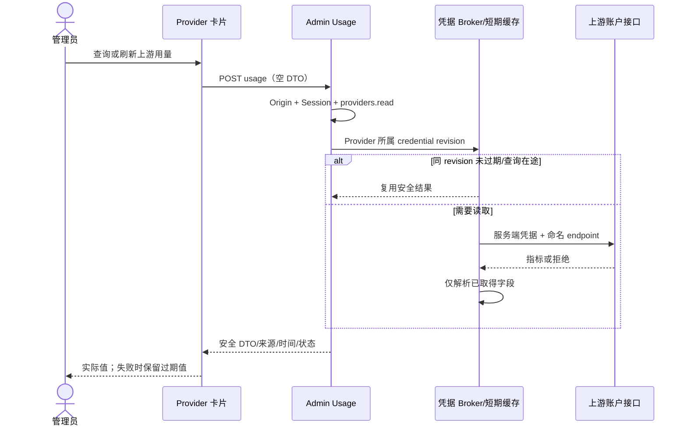
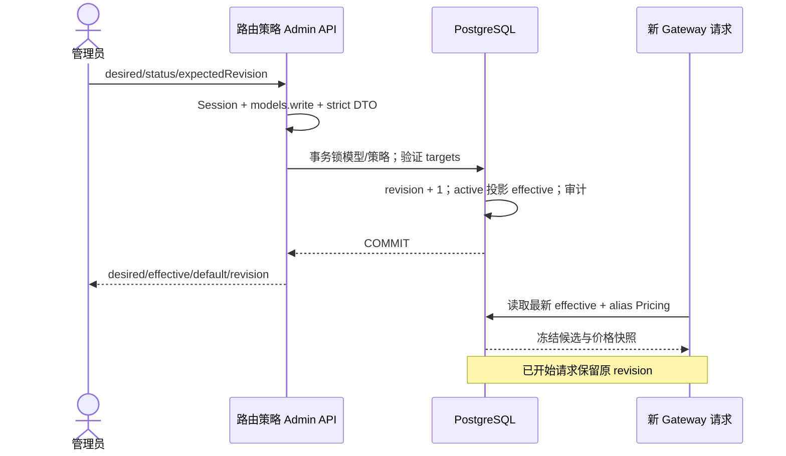
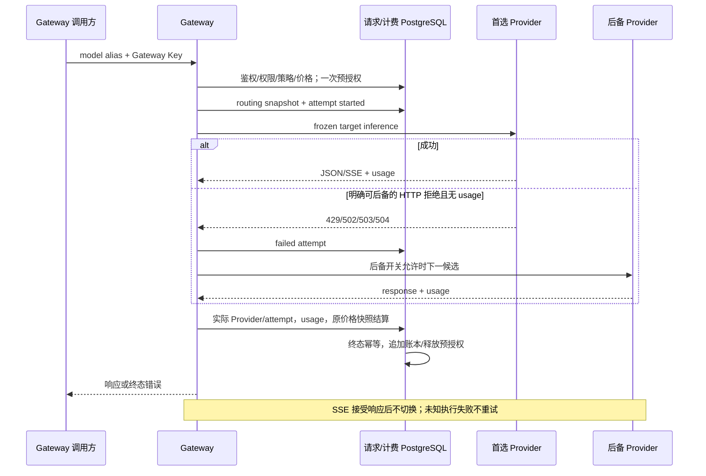

<!-- [Input] Current Admin/Gateway code, cc-switch pinned and current HEAD, and official OpenRouter docs accessed 2026-10-05. -->
<!-- [Output] Reviewed interaction, impact, routing/billing contracts and acceptance criteria. -->
<!-- [Pos] Current Provider upstream usage and same-model routing design; supersedes single-provider-only limits in historical model/gateway designs. -->
<!-- [Sync] 2026-10-06: preserve explicit migration prerequisite and link the subsequently authorized normal backup/release recovery proof. -->

# Provider 上游用量与同模型动态路由

## 1. 背景与问题

Provider 卡片的 24h 请求/成功率来自本平台，不足以判断上游余额或订阅窗口。现有 `ai_models.provider_id/upstream_model` 只有默认关联，同一公开别名不能在多个账号间分流或使用后备。直接在客户端切换会破坏鉴权、请求归属和计费快照。

调研日期：2026-10-05。cc-switch 本地版本 4.0.1、HEAD `f5db60db87e240964b5a512eda76793e9f8f923f`，只读 `ls-remote origin HEAD` 与本地一致。历史接入设计与 product config 均记录基线 `92d529168560bdec4ca1b429b50a203c5fc8a87e`；不能据此断言每个历史实现均完整移植。源项目有两份未跟踪文档，未改动。

基线后相关变更包括 `3b1292fe`（托管 Codex 卡片按绑定账号展示 quota）、`c0e093a2`（ChatGPT reset 信息）、`15c0b3ce`（每应用 direct/proxy 所有权）。采用绑定账号查询、保留上次成功值与明确缺失指标；本项目已有 Provider-owned credential/auth epoch/refresh fence，不搬入桌面 direct/proxy、CLI 文件读取、SQLite、Tauri script evaluator。另同步 `d0b57827` 的 Codex 请求/catalog 版本 `0.159.0`，现有 OAuth 注册指纹保持兼容。其余协议更新逐项裁决见第9节，不整体覆盖已有适配器。

## 2. 目标与边界

- Provider 列表呈现实际上游指标，明确来源、单位、窗口与查询时间；独立于平台统计和账本。
- 新增独立“路由策略”菜单，每个公开模型至多一个策略；多个 Provider target 对应同一业务模型。
- 复用公开 `/api/admin`、`/v1/messages`、`/v1/chat/completions`、既有请求生命周期与结算。此任务为无真实 Provider 的技术验收，不授权真实模型消费或部署。
- 不做跨模型 Auto Router、区域调度、脚本编辑器、价格推测、自动迁移或新账本。

## 3. 概念与规则

### 3.1 上游指标

| 来源 | 实际语义 | 不可推导的指标 |
| --- | --- | --- |
| OpenRouter `/api/v1/key` | 当前 Key 的累计/日/周/月支出，Key spending limit 与 remaining，USD | 账户余额、Token、明确周期边界（接口未提供时不补） |
| DeepSeek `/user/balance` | 账户余额及赠送/充值余额，原币种 | 已消费、总额度、周期 |
| Codex `wham/usage` | 绑定账号窗口使用率与 reset，窗口秒数 | Token、金额、订阅总额度 |
| Copilot `copilot_internal/user` | premium/chat/completions entitlement/remaining，reset，unlimited 时显示不限量，不假设总额 | 美元余额、平台 Token |
| xAI / 未选择查询来源的 generic | 不支持查询 | 所有数值 |

产品查询路径来自命名 source config/现有注册；托管高级覆盖为 `INK_PROVIDER_CODEX_USAGE_ENDPOINT` / `INK_PROVIDER_GITHUB_COPILOT_USAGE_ENDPOINT`，沿用产品 UA/集成身份，查询 Endpoint 失效只影响该查询，不改变 registration fingerprint 或推理就绪。generic 必须显式选择 OpenRouter/DeepSeek，绝不通过 Provider ID 猜测服务商。仅服务端解密；禁止任意脚本、跳转携带凭据或回传上游原始正文。

首屏展示“查询上游用量”；用户手动查询，无后台轮询。成功值按 Provider 的 auth revision/epoch/account/config 隔离，卡片在认证版本变化时清空旧显示。进程内缓存仅用于短期展示优化，不是 DB 回退；有效期由 `PROVIDER_USAGE_CACHE_TTL_SECONDS` 配置，默认 60 秒（手动连续点击复用一分钟，限制重复上游读调用）。同进程相同 key 合并在途查询，多进程各自查询；未配置分布式轮询。有效期到达后页面显示过期，刷新失败保留上次成功并明确“数据已过期”，失败不缓存成零。没有指标为 missing，部分指标为 partial，401/403 为 forbidden，协议/网络错误为 failed，不支持为 unsupported。缓存仍需每次通过 Session/RBAC，浏览器响应 no-store。

### 3.2 路由所有权与状态

`Model alias → 默认 Provider + upstream_model` 保留；`Route policy → target[]` 扩展供给，target 包含 Provider、上游型号、权重。目标必须与默认 Provider 的协议和 adapter kind 一致，复用 alias 的能力、context/output 和请求头合同；保存与每次请求均检查 target 已有启用的型号登记，能力、context/output 满足 alias；管理员仍负责确认它是同一业务模型，平台不按相似名字猜测等价。不同 dialect 的供给不进入同一策略，避免静默丢弃请求参数。

- default：没有启用策略时仍使用默认 Provider，不新增隐式后备。
- desired：最近保存的严格配置；revision 是每次保存递增的 CAS 版本。
- effective：active 保存的配置立即原子生效；draft/disabled 为 null，使用 default。
- 草稿 → 启用 → 停用；启用可直接修改，修改后只影响新请求。保存草稿/停用即撤回策略，回到 default；界面明确显示。
- 请求一次读取并冻结候选和配置 revision，不在后备时重新读取新策略。Provider credential 仍通过已有 live fence，撤销的凭据 fail closed。
- ordered 按界面顺序；weighted 只按管理员正整数权重选择首个，剩余候选保持原顺序。无价格加权，因此无输入/输出价格混算。
- 候选筛除 disabled/deleted、凭据缺失、型号登记或能力不足、协议/adapter 不匹配、失效 Endpoint/config。无可用候选在预授权前返回明确 503（尚无 Gateway Request），不产生扣费，不退回策略外 Provider。无新健康冷却常量；既有“网络可达”和“凭据有效”不冒充模型运行健康。
- 每个 target 最多一次推理尝试。允许后备时，仅明确 HTTP 429/502/503/504 且错误正文没有可计费 usage 才可切换；已有 managed 401 renewal 保留。超时/连接中断可能已经执行，不能证明未计费，因此不盲目重试。400/401/403、取消、成功响应解析失败、缺失 usage 不后备。
- SSE 接受上游响应之后锁定 Provider；流中错误或客户端已收到字节不得切换，沿用 partial/unknown usage settlement。
- alias Pricing 对所有 target 相同，是平台现有结算口径；input/output/cache/markup/discount 均在 reserve 时冻结，不根据最终 target 重新定价。每次请求只有一次预授权和终态结算；被明确拒绝的后备前置尝试不额外扣款。上游未知费用仍按既有 unknown usage 合同保留失败事实，不能宣称上游没有收费。
- 请求保存安全 routing snapshot（策略 revision、候选 ID/上游型号、筛除原因），逐尝试状态/HTTP/错误码和最终 Provider。快照绝不含 Secret/Endpoint headers。平台账本只追加。

## 4. 对照与采用成本

| 维度 | Admin 原实现/本次 | cc-switch | OpenRouter 参考 |
| --- | --- | --- | --- |
| 模型/endpoint | 唯一 alias，默认 Provider；本次追加显式 targets | app Provider 配置、model mapping | model slug 多 endpoint |
| 所有者 | 管理员全局每模型 policy；调用方不能覆盖 | 本机用户 app queue | 请求偏好与账号配置 |
| 筛选/选择 | enabled/credential/dialect；ordered/weighted | 顺序 queue + circuit breaker | provider preference、price/latency/throughput |
| 健康 | 配置就绪与每次实际错误，暂不聚合熔断 | app breaker 与 DB health | 平台监控/提供方声明 |
| 价格 | alias input/output/cache micro-USD immutable snapshot | 本地成本统计/price map | 多 modality/request billing |
| 观测 | PostgreSQL request/attempt/usage/ledger/audit | 本地日志/usage | generation/provider metadata |

采用 target 与 ordered（供给容灾，成本：schema + 管理 + transport）、显式 weight（同模型分流，成本：纯选择函数与 UI）、账号 quota（运维判断，成本：命名 adapter + safe projection）。不复制 circuit threshold、30s window 或 inverse-price：缺少本项目运行健康策略与真实 target 成本。

[Provider Routing](https://openrouter.ai/docs/guides/routing/provider-selection)：默认优先最近 30 秒稳定提供方，再在低成本候选按价格平方反比选择，剩余为后备；近期故障者仍可最后尝试。`sort/order` 禁用该默认均衡；`allow_fallbacks=false` 限制后备。`partition=model/none` 是多模型 fallback 的排序分组，不是本次同模型池的分区设计。

[For Providers](https://openrouter.ai/docs/guides/community/for-providers)：capacity 声明输入/输出/请求作用域的限额，不是余额；service_tier 是单模型分档供给；datacenters 是物理服务位置；deprecation_date 控制退役；is_ready 是发布/隐藏信号。它们不是客户端已验证的实时健康。本次没有复刻这些供给协议。

[Auto Router](https://openrouter.ai/docs/guides/routing/routers/auto-router) 在模型之间选择，和本次保持请求模型不变的 Provider 选择不同。

指标依据：[OpenRouter current key](https://openrouter.ai/docs/api/api-reference/api-keys/get-current-key)、[DeepSeek balance](https://api-docs.deepseek.com/zh-cn/api/get-user-balance/)，Codex/Copilot 使用 cc-switch 上述已实现的账号接口，属于非公开稳定性保证的集成，保留 unsupported/forbidden/failed 状态。

## 5. 影响矩阵（修改与测试前冻结的范围）

| 范围 | 现状 → 拟修改 | 兼容风险 | 验证 |
| --- | --- | --- | --- |
| 菜单/交互 | Provider 无 quota → 指标区；新路由菜单/列表/编辑 | 小屏布局、加载与错误 | Chrome desktop/mobile focused E2E |
| Session/RBAC/audit | 已有权限 → providers.read 查询、models.read/write 策略 | UI 隐藏不构成授权 | 未登录/只读角色/审计 API |
| DTO/API | 现有 catchall → 薄 routing/usage ingress、strict schema/CAS | unknown keys、并发覆盖 | 成功/400/403/409 |
| Provider/Secret | encrypted static/managed → 复用 broker 查询 quota | 账号泄露、跳转/错误正文 | mock header、redaction、绑定 fence |
| 模型映射 | 单默认关联 → 非破坏扩展 targets | dialect/能力、禁用默认 | single-provider + invalid candidate |
| Gateway/协议 | 已有 adapters → pre-response 候选尝试 | 200 后重试/流中重复输出 | JSON/SSE + 中断 |
| 重试/failover | 单目标/managed401 → 有界拒绝后备 | 超时/usage 不能重复调用 | 首选/后备/禁用/全失败 |
| 计费/账本 | alias price/reserve/settle → 保持一次并冻结路由 | 归属/重复结算 | request/usage/price/ledger/idempotency |
| PG/兼容 | 新 policy/target 表 + request snapshot/attempt columns | 旧 DB 缺 migration | forward generate + 隔离 migrate/reapply |
| docs/headers/tests | 单 Provider 文档 → 同步 current contracts | 旧设计冲突/失效链接 | Markdown inventory/link + diff |

## 6. 页面与交互

沿用现有 Admin 配色/字体和 `admin-panel`；Provider 信息区下方加入“上游用量”，与 24h 平台调用摘要分开。金额不绘制假总额度进度条，只有真实 percent 展示窗口使用率。loading/部分成功/过期/权限不足有内联状态与重试，无普通确认弹窗。

独立 `/admin/routing` 列表按模型分页；显示模型、状态、选择方式、策略候选、revision；策略候选数量为配置数，可用性在每请求重验。编辑使用模型选择、有序 target 行（Provider、上游型号、权重、上下移/删除）、后备开关和状态；有权重策略才编辑 weight。详情展示 desired/effective/default。保存成功更新列表与 revision，CAS 冲突要求重新读取。没有策略时引导添加；错误不清空表单。请求详情显示逐尝试记录供核对。

## 7. 业务时序

## 8. 设计审查与验收

所有字段服务于选择供给、判断真实上游剩余量或复核请求；没有推测余额/任意环境编辑/跨模型推荐。复用已有权限体系、组件、broker、价格和结算；普通保存与刷新不确认。兼容默认单 Provider，不回填业务数据。采用 expand migration 后部署应用，验证后保留兼容列；本轮没有 contract/drop。

发布前置为显式0073迁移完成，不能把“现有单Provider配置兼容”解释为新应用可运行在旧schema上。共享platform readiness缺少新增路由对象时拦截管理业务；Admin保留`PLATFORM_SCHEMA_NOT_READY`/503和数据库升级提示，未知数据库异常继续脱敏500。VS Code 的`pnpm dev`只启动服务，不自动迁移；正常库升级必须另行明确授权，隔离库测试不证明正常库已升级。

2026-10-06用户补充授权“备份后应用0073并复核”；正常本机库已完整备份，通过生产`pnpm db:migrate`应用0073并达到74/74，正常Admin只读恢复已核对。该操作没有改变启动合同，也不代表真实Provider/模型验收；备份、迁移与读取证据见[验证报告](../verification/provider-usage-routing-2026-10-05.md)。

技术验收覆盖登录授权、Provider 全状态、多 target 保存/CAS/revision、公开 Gateway 首选成功/后备成功/关闭后备/全失败/无候选/stream、实际 Provider 与价格/usage/ledger、单 Provider 与非法输入。typecheck/lint/unit/focused Playwright/build/隔离 migration 必须有真实退出码；记录在 [验证报告](../verification/provider-usage-routing-2026-10-05.md)。真实账户与真实模型未调用。

## 9. 源码证据与技术边界

cc-switch 当前提交的 [绑定账号 quota](https://github.com/glide-the/cc-switch/blob/f5db60db87e240964b5a512eda76793e9f8f923f/src-tauri/src/services/subscription.rs)、[usage 查询](https://github.com/glide-the/cc-switch/blob/f5db60db87e240964b5a512eda76793e9f8f923f/src-tauri/src/services/provider/usage.rs)、[缓存](https://github.com/glide-the/cc-switch/blob/f5db60db87e240964b5a512eda76793e9f8f923f/src-tauri/src/services/usage_cache.rs)、[Provider router](https://github.com/glide-the/cc-switch/blob/f5db60db87e240964b5a512eda76793e9f8f923f/src-tauri/src/proxy/provider_router.rs) 支持本次概念裁决。引用内容来自本机读取，未调用真实账户查询。

| 基线后协议变更 | 本项目判断与处理 | 依据与成本 |
| --- | --- | --- |
| [Codex OAuth client 0.159.0](https://github.com/glide-the/cc-switch/commit/d0b57827) | 需要同步：默认推理 Header version 与 catalog client_version 均更新到0.159.0；明确 override 仍有效 | 源提交记录账号模型 gate；使用既有 config/adapter，增加独立 wire version，保留原 registration identity，不修改已绑定账号或 DB；unit 证明两处实际请求与指纹兼容 |
| [晚到工具参数](https://github.com/glide-the/cc-switch/commit/3459658f)、[延迟释放修正](https://github.com/glide-the/cc-switch/commit/f5a4bdc9) | 不复制 native Responses scrubber：本项目只开放 Messages/Chat，转换不在空 output_item.done 结束工具调用；既有非流聚合接收之后 delta | 阅读 responses-adapter 事件合同并新增空 done→late delta→completed 回归，证明完整参数且不重复；并未宣称支持 terminal 之后的无效 delta |
| [第三方 Stack 模型](https://github.com/glide-the/cc-switch/commit/73c187be)、[compaction/opaque state bridge](https://github.com/glide-the/cc-switch/commit/81cc2f7b) | 不采用：要求 Codex 原生 Responses/compaction 历史和第三方模型目录合并，本次只做同业务模型供给，不开放新客户端协议 | 原生入口、跨模型历史与压缩状态超出目标，复制会改变 Runtime 所有权与重试/计费合同 |
| [Copilot stop 参数删除](https://github.com/glide-the/cc-switch/commit/56df6513) | 不静默删除调用方 stop：本项目保留 Messages stop_sequences→Chat stop；Copilot 不支持时仍明确400、无后备 | 源修复针对 Claude Code classifier；无证据证明删除对普通 Gateway 请求保留语义。此接口兼容限制保留为实测前边界，不能用转换“成功”掩盖参数丢失 |

`resourceClientVersion` 是 Codex 请求兼容版本，`integrationVersion` 继续表示既有 OAuth registration 身份；前者和 catalog/usage 配置不进入 registration fingerprint。新增 `INK_PROVIDER_CODEX_RESOURCE_CLIENT_VERSION` 命名覆盖，不添加通用环境变量编辑器。既有模型 `version` override 在产品默认值之后合并，401续期沿用同一规则。

DTO 的 32 个 target 上限和权重最大值仅用于控制 JSON/整数运算边界，不定义套餐或上游容量；候选按实际配置最多各尝试一次。保存时不锁所有供给模型，以免多个 alias 策略交叉编辑形成锁环；保存快照校验后，运行时继续重验型号状态/能力。此版没有多进程共享 usage 缓存，也不宣称官方非公开账号接口稳定或全部 Provider 支持查询。
