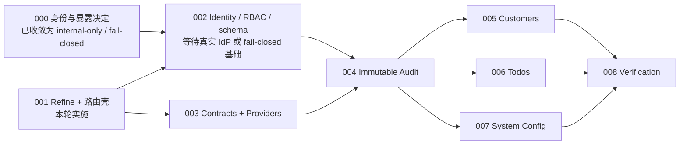

# Refine 管理后台交互方案设计

> Design ID：`DESIGN-REFINE-ADMIN-UX-001`  
> 关联架构：`DESIGN-REFINE-ADMIN-001`  
> 关联任务：`TASK-REFINE-ADM-001` 至 `TASK-REFINE-ADM-008`  
> 基线日期：2026-08-08  
> 状态：S0 路由壳可实施；S1–S4 交互已定义但受各自 Task gate 约束  
> 产品姿态：`internal-only`，不构成 public-ready 声明

> 2026-08-08 扩展说明：本文保留最初 Refine S0 路由壳与基础资源交互基线；后续用户明确要求
> 增加 Story 运营观察、模型配置、Token 计费和代理网关。该扩展范围以
> [`ai-platform-admin-billing-gateway-design.md`](./ai-platform-admin-billing-gateway-design.md)
> 为实施依据，本文中“延期/不进入菜单”的相关描述仅代表旧 MVP gate，不再限制新阶段。

## 1. 问题裁决

### 1.1 当前事实

当前 `/Users/dmeck/project/ink-admin-memory` 是本轮唯一代码基线。仓库中没有独立的
`ink-admin-memory-output/` 应用，包名仍是 `ai4sales-pwa-app`；因此“只修改
ink-admin-memory-output”在本轮解释为只修改当前 checkout，不修改
`ink-dream-memory`、`story-workspace` 或 Repomix 聚合文件。

既有 `refine-admin-validated-architecture.md` 已经完成实仓校验，早期概念稿中以下内容不能
直接执行：

- App Router 不使用 `@refinedev/react-router`，而使用 `@refinedev/nextjs-router`。
- 当前产品已有 Tailwind 与自定义组件体系，MVP 不引入 Ant Design/MUI。
- 当前数据库没有平台用户、Model Registry、Token 账务或代理网关的数据所有权与协议；这些
  能力保持延期，不先造镜像表或假资源。
- Refine 的 Access Control Provider 只改善客户端体验，服务端 session/RBAC 才是授权边界。

### 1.2 历史阻塞与本轮处理

历史 `TASK-REFINE-ADM-001` spike 因 Next.js/Tailwind 基线无法完成 build 与 dev smoke 而
回退。2026-08-08 复验时，无 Refine 基线的 `pnpm build` 已完整通过，包含
`/_not-found` 预渲染，因此原构建 blocker 已解除，可以恢复 S0 路由壳任务。

本轮只实现 `TASK-REFINE-ADM-001`：依赖、显式路由、Provider seam、动态路由探针和回归
测试。身份、RBAC、schema、audit 和资源 CRUD 仍遵循原 DAG，不因壳层可运行而越级进入。

### 1.3 任务依赖



## 2. 产品定位与用户

产品不是传统 CMS，而是 AI 创作平台的内部运营控制面。当前 MVP 管理本仓库已有的
customers、todos、运行设置和后台操作审计；未来业务域只有在数据契约、安全边界和账务模型
分别确认后才进入菜单。

| 角色 | 核心目标 | MVP 权限摘要 |
| --- | --- | --- |
| auditor | 查阅业务状态与操作证据 | customers/todos/settings/audit 只读 |
| operator | 完成日常运营维护 | customers/todos 新建和编辑；不可删除或改系统设置 |
| admin | 管理高风险业务操作 | 包含删除与 system-config 白名单字段更新 |

当前 S0 没有真实身份接入。登录页面只能解释配置状态，不提供 mock 密码、临时管理员或客户端
身份旁路。

## 3. 设计方向

### 3.1 视觉主题：Control Ledger

后台沿用现有 PWA 的蓝、橙、石墨色和本地字体，但用“控制账本”而不是通用统计卡片表达运营
后台：界面首先展示哪些能力已经被证据解锁、哪些仍被 gate 锁定。其标志性元素是纵向
**Release Rail**，把 S0–S4 的依赖和状态直接编码成界面结构，不用虚构 GMV、Token 或请求量。

调色板：

- Canvas `#F5F7FB`：工作台背景。
- Surface `#FFFFFF`：内容与表单表面。
- Ink `#1E293B`：主文本和高对比结构。
- Signal Blue `#2F6FED`：可导航、可执行状态。
- Gate Orange `#FF6B00`：当前 gate 与高风险确认。
- Evidence Green `#00C48C`：已验证证据。

字体职责：

- Noto Serif SC：页面命题和关键标题，克制使用。
- Noto Sans SC：导航、表单和正文。
- IBM Plex Mono：Task ID、requestId、路由、模型代码和状态标签。

界面不增加第三方图标或字体依赖。动效只用于一次进入淡入和控件状态变化，并尊重
`prefers-reduced-motion`。

### 3.2 自我审查

第一版若使用“欢迎语 + 四个 KPI 大卡片”，会与任意 SaaS 模板无差别且制造尚不存在的运营
数据。因此本设计移除虚构指标，以 Release Rail、真实路由边界和明确的 locked 状态作为首页
主叙事。橙色只标记 gate/高风险动作，不作为全页装饰。

## 4. 信息架构

```text
/admin
├── login                         身份入口（不在 protected layout 内）
└── (protected)                   后续由 server layout 执行身份检查
    ├── /                         控制台概览 / Release Rail
    ├── customers                 客户资源
    │   ├── create
    │   ├── show/:id
    │   └── edit/:id
    ├── todos                     待办资源
    │   ├── create
    │   ├── show/:id
    │   └── edit/:id
    ├── settings                  运行设置只读
    │   └── edit                  admin 高风险编辑
    └── audit                     审计日志
        └── show/:id
```

S0 物理实现会暂时提供 `/admin/compatibility/[id]` 作为动态路由探针。它不进入正式资源菜单，
在兼容性证据稳定后可删除或仅保留为测试夹具。

明确不出现在 MVP 菜单中的域：用户套餐、Story 外部数据、AI Model Registry、Token Billing、
Proxy Gateway、通用角色编辑器。

## 5. 全局壳层

### 5.1 桌面端

```text
┌───────────────┬──────────────────────────────────────────────────────────┐
│ INK / OPS     │ CONTROL PLANE                         internal / S0      │
│               ├──────────────────────────────────────────────────────────┤
│ ● 概览        │                                                          │
│ ○ 客户        │  页面标题                         页面级主要操作          │
│ ○ 待办        │  说明与面包屑                                            │
│ ○ 运行设置    │                                                          │
│ ○ 审计日志    │  ┌────────────────────────────────────────────────────┐  │
│               │  │ 页面内容 / 状态 / 表格 / 表单                    │  │
│ ───────────   │  └────────────────────────────────────────────────────┘  │
│ internal-only │                                                          │
└───────────────┴──────────────────────────────────────────────────────────┘
```

- 左栏固定在视觉层，不依赖 Refine UI 套件。
- 顶栏说明当前控制面、环境和 gate，不显示无法证明的用户身份。
- 主要操作固定在标题右侧；危险操作与普通保存分离。
- 主内容宽度限制在可读范围，数据表除外。

### 5.2 窄屏

```text
┌──────────────────────────────┐
│ INK / OPS       internal S0  │
├──────────────────────────────┤
│ 概览  客户  待办  更多 →     │
├──────────────────────────────┤
│ 页面标题                     │
│ 说明                         │
│                              │
│ 内容按卡片/横向滚动表格呈现  │
└──────────────────────────────┘
```

- 导航变为横向可滚动区，不用遮挡内容的永久抽屉。
- 表格保留字段语义：次要字段折叠到行详情，不把每行拆成失去列关系的随机卡片。
- 触控目标不小于 44×44px。

## 6. 页面交互

### 6.1 `/admin` 概览

单一任务：让运营人员理解“现在能安全地做什么”。首屏显示产品命题、当前 gate、路由隔离
状态和 Release Rail。未解锁模块显示锁定原因及前置 Task，不提供空按钮。

S0 路由壳只展示真实信息：Refine 已挂载、Next Router 已连接、业务资源尚未开放。不得展示
Token 消耗、模型费用或用户数等假数据。

### 6.2 `/admin/login`

状态按真实认证能力分支：

1. IdP 已配置：显示单一“使用企业身份继续”动作及目标环境。
2. IdP 未配置：显示“身份接入尚未配置”、`internal-only` 和明确的解锁责任，不渲染账号密码框。
3. callback 配置错误：停止跳转，给出稳定错误码，不回显 callback secret 或原始令牌。

登录页不显示业务导航。成功登录后只允许跳转到经过服务端验证的原始 same-origin 目标。

### 6.3 资源列表

- 标题区：资源名称、结果数量、允许角色可见的“新建”动作。
- 工具区：搜索、白名单筛选、白名单排序；筛选状态同步 URL。
- 数据区：首屏 skeleton，后续刷新保留旧内容；空状态说明如何产生第一条记录。
- 分页：从 1 开始，每页不超过 100；总量来自 admin API `meta.total`。
- 行操作：查看始终优先；编辑/删除由同一权限矩阵控制可见性，但服务端再次裁决。

### 6.4 详情、新建与编辑

- 详情页按“身份信息—运营信息—时间与来源”分组，默认最小披露 PII。
- 表单使用显式标签、帮助文本和字段级错误；服务端 409 保留用户输入并说明冲突。
- 保存按钮文案保持一致：“保存更改”；成功提示为“已保存更改”。
- 离开脏表单的提示由具体页面实现，不把 App Router 下的全局 UnsavedChangesNotifier 当作
  验收基础。

### 6.5 删除与高风险设置

- 删除使用二次确认，描述资源和不可逆影响；operator/auditor 不显示入口且直调 API 返回 403。
- system-config 编辑只允许 `system_prompt`、`model`、`provider`、`workspace_enabled`。
- 最终确认列出 changed fields，只展示字段名与安全摘要，不展示 secret、`extras` 或完整 prompt。
- audit 写入失败时业务 mutation 失败；UI 不提示“稍后补审计”。

### 6.6 审计日志

- 只读 list/show，没有编辑、删除、批量动作或导出捷径。
- 列表优先显示时间、actor、action、resource、outcome、requestId。
- 详情显示 changed field names 和 reason code，不显示请求体、手机号、邮箱、prompt 或 secret。
- requestId 使用等宽字体并提供复制动作；复制成功由 aria-live 提示。

## 7. 角色交互矩阵

| Resource/action | auditor | operator | admin |
| --- | --- | --- | --- |
| customers list/show | 显示 | 显示 | 显示 |
| customers create/update | 隐藏并拒绝 | 显示 | 显示 |
| customers delete | 隐藏并拒绝 | 隐藏并拒绝 | 显示 + 二次确认 |
| todos list/show | 显示 | 显示 | 显示 |
| todos create/update | 隐藏并拒绝 | 显示 | 显示 |
| todos delete | 隐藏并拒绝 | 隐藏并拒绝 | 显示 + 二次确认 |
| system-config show | 显示 | 显示 | 显示 |
| system-config update | 隐藏并拒绝 | 隐藏并拒绝 | 显示 + changed-fields 确认 |
| audit list/show | 显示 | 显示 | 显示 |

客户端隐藏不是安全证据。所有“不显示”动作仍必须有直调 API 401/403 测试。

## 8. 系统状态

| 状态 | 交互规则 |
| --- | --- |
| 初次加载 | 使用与最终布局同构的 skeleton，避免表格列跳动 |
| 后台刷新 | 保留已加载内容，在局部显示刷新状态 |
| 空数据 | 解释为什么为空；有权限时提供唯一下一步动作 |
| 401 | 清理客户端身份体验并进入登录流程，保留安全的 return target |
| 403 | 留在当前页，显示缺少的权限，不自动登出 |
| 404 | 说明资源不存在或已删除，返回对应列表 |
| 409 | 说明数据已变化，保留输入并提供刷新/重试 |
| 422 | 字段级显示校验问题，聚焦第一处错误 |
| 429 | 显示可重试时机，不自动高频重放 mutation |
| 5xx | 使用通用错误文案与 requestId，不显示堆栈/details |
| 离线 | 禁用 mutation，保留表单草稿并在恢复后由用户主动重试 |

## 9. Refine 映射

| UI 能力 | Refine/Next 映射 | 安全边界 |
| --- | --- | --- |
| 显式页面 | Next App Router `page.tsx` | 不使用顶层 catch-all |
| 客户端导航 | `@refinedev/nextjs-router` | 只负责路由体验 |
| CRUD 数据 | 自定义 Data Provider | 只访问 same-origin `/api/admin/*` allowlist |
| 身份体验 | Auth Provider | server layout/API guard 为权威 |
| 按钮可见性 | Access Control Provider | 服务端 policy 再裁决 |
| 缓存 | 复用根 TanStack QueryClient | 不创建第二个全局 client |
| 审计 | 服务端 audit transaction seam | 客户端不直接写 audit |

## 10. 可访问性

- 所有页面具有唯一 `h1`，导航使用 `nav` 和可辨识标签。
- 当前导航项使用 `aria-current="page"`；状态不只依赖颜色。
- 键盘焦点可见，弹窗焦点被约束并可用 Escape 关闭。
- 错误摘要使用 `role="alert"`，非阻断保存结果使用 `aria-live="polite"`。
- 文本与背景满足 WCAG AA；等宽小字仍不低于 12px。
- `prefers-reduced-motion` 下移除位移动画。

## 11. 验收标准

### S0 本轮

- Core 5.x 与 Next.js Router 7.x 使用精确版本，并声明 Node `>=20`。
- `/admin`、`/admin/login` 和 `/admin/compatibility/[id]` 为显式路由。
- Refine 使用根 QueryClient 实例；没有 React Router、Ant Design/MUI 或第二个 QueryClient。
- 默认生产环境不开放壳层；开发或显式 feature flag 才能进行兼容性 smoke。
- build、SSR、Refine `useGo` 客户端导航、动态参数和旧 `/`、`/customers` 路由均有证据。

### 后续阶段

- S1–S4 只能在 `stage_refine_admin_mvp.md` 的前置完成后实施。
- 任何资源 mutation 必须同时满足 server authorization 与 audit transaction。
- 最终发布说明保持 `internal-only`；public-ready 需要独立安全 blocker。

## 12. 非目标与风险

本设计不实现或暗示已经具备：普通用户中心、Story DB 接入、模型供应链、密钥轮换、Token
账务、余额、代理网关、动态角色编辑、多租户或行级权限。

主要风险：

- `next: "*"` 只是 peer 声明，不是 Next 16 运行兼容承诺；以本仓 build/E2E 为准。
- 现有旧业务 API 尚无完整生产鉴权；受保护的 admin 前缀不能被表述为全站安全。
- IdP/session/subject/callback 未配置时只能 fail closed，不能以 mock 身份完成生产验收。
- system-config 会改变 AI 行为，必须最后启用 mutation，并具备二次确认与原子审计。
