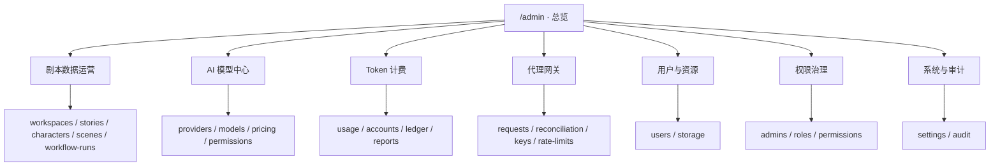
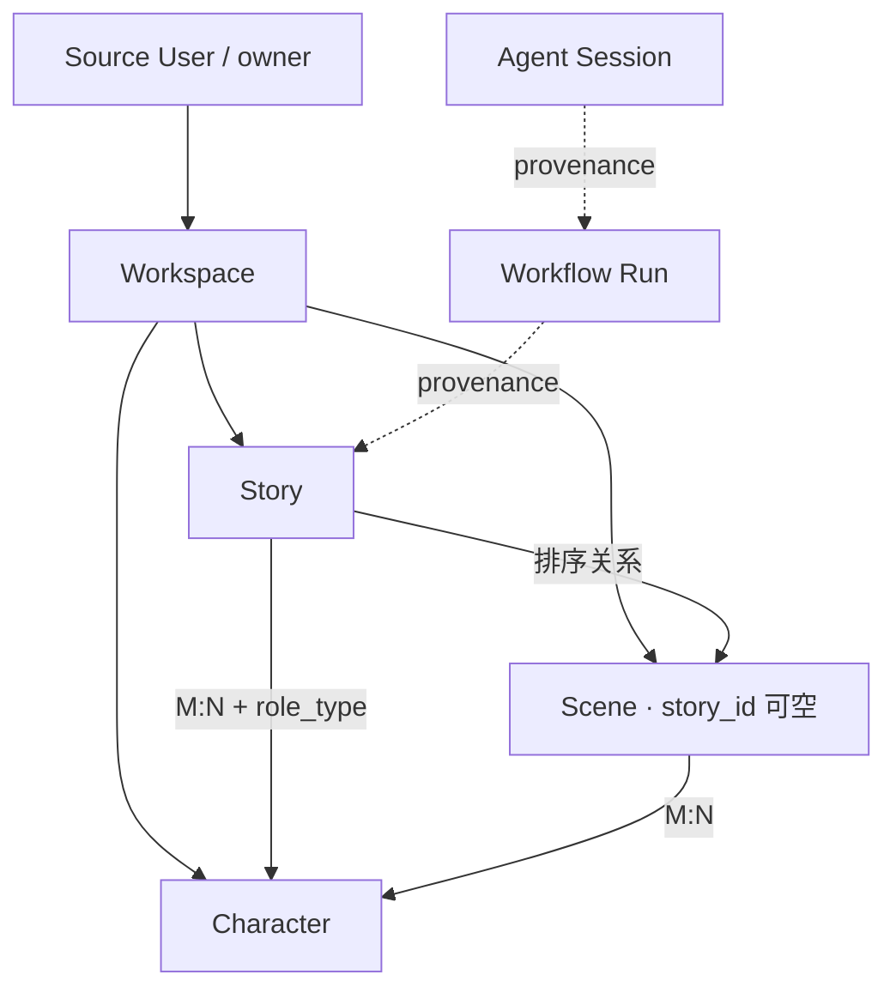
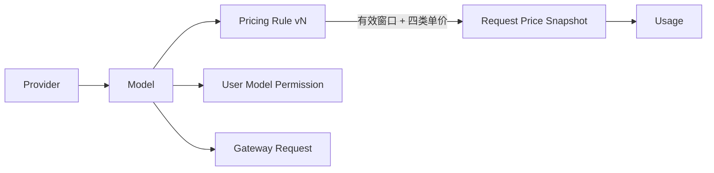
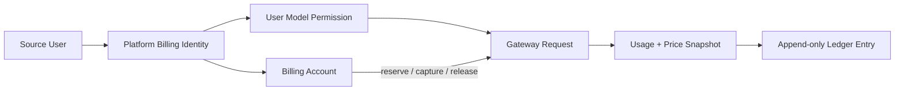
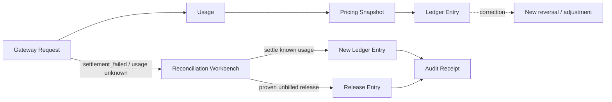

# Ink Memory Admin v2 交互设计规范

> 状态：工程实施基线  
> 产品：Ink Memory Admin（Next.js 16 + React 19 + Refine 5 + Tailwind CSS 4）  
> 基准视口：Desktop 1440×1000；Mobile 390×844  
> 权威输入：`docs/prd/ink-memory-admin-prd-v2.md`、HTML Design Workflow Stage 1–4  
> 视觉方向：暖纸安静工作台（Warm-paper Quiet Workbench）× 超感官极简主义

## 1. 文档目的与决策优先级

本规范是 Admin v2 的 canonical 交互与视觉实施基线，覆盖 Shell、资源页面、领域工作台、状态恢复、响应式、可访问性和验收口径。
冲突时依次采用：工程 PRD 的功能/数据边界 → PDF v2.1 的最新亮色值 → `color_system` 的暗色与语义补充 → Stage 1–4 的结构和实施细节。
Stage 4 中与工程 PRD 不同的暗色草案不进入实现；本文件第 3 节给出的 Light/Dark 值为最终选择。
硬边界：

- 这是运营后台，不是 Landing Page；不恢复业务前台或 PWA。
- PostgreSQL 是唯一数据库；Story 数据源不可用时 fail-closed 为 503。
- 不新增 SQLite、better-sqlite3、本地 JSON DB 或隐式内存回退。
- 不使用虚构 KPI、随机图表、无行为按钮或只有外观的通用 CRUD。
- Provider Secret、System Secret、Gateway Key 不明文落库、回显或进入 URL/日志/缓存。
- 金额事实值是整数 micro-USD；Pricing snapshot 保留历史；Ledger/Audit append-only。
- Route Handler 只编排；Session/RBAC、Zod、SQL、事务、状态机、审计均在服务端领域层。

## 2. 从 PDF / Color System 提取的视觉原则

参考视觉是一页经过精确排版的色彩规范纸：暖白纸面、棕色正文、细规则线、紧凑表格和极少量色样。

| 原则 | UI 转译 | 明确禁止 |
|---|---|---|
| Warm Canvas + Paper Cream 承担面积 | 暖画布包围一张奶油工作纸 | 冷灰全屏底、纯白卡片海 |
| Charcoal / Body Brown 建立阅读 | 标题、正文、图标、导航统一棕色体系 | 纯黑正文、蓝色主导航 |
| Yellow / Green / Blue 只是 voice | 当前项短线、健康标记、文字链接 | 大面积彩底、装饰色块 |
| 文档式规则线 | 唯一虚线纸边；内部细实线和留白 | 多层虚线、每区套框 |
| 少面板、多留白 | 标题→上下文→数据连续阅读 | 仪表盘拼贴、嵌套卡片 |
| 平直数据行 | 表格静止无阴影，hover 才轻反馈 | 浮空行、大圆角行 |
| 本地编辑排版 | Serif 标题、Sans 正文、Mono 事实值 | 远程字体、伪造字重 |
| 安静微动效 | 只解释打开、更新、提交状态 | 渐变、glow、弹跳、视差 |

页面只能出现一圈 dashed：`AdminPaper` 外边界。内部容器一律使用 solid border 或 spacing。

## 3. 最终语义 Token

### 3.1 色彩

| Token | Light | Dark | 用途 |
|---|---:|---:|---|
| `--color-bg-app` | `#F6EFE5` | `#1D1916` | 暖纸 / 暖夜画布 |
| `--color-bg-paper` | `#FFFAF2` | `#2A241F` | 主工作纸 |
| `--color-bg-surface-solid` | `#FFFDF8` | `#342D27` | Menu、Popover、Dialog 实底 |
| `--color-text-primary` | `#3F3429` | `#F3E8D8` | 标题、Logo、主图标 |
| `--color-text-body` | `#4B3F33` | `#EEE8DF` | 正文和主要数据 |
| `--color-text-secondary` | `#7A6A59` | `#C8BCAE` | 说明、label、来源 |
| `--color-text-muted` | `#9A8A78` | `#9F9283` | placeholder、disabled、重复信息 |
| `--color-action-primary` | `#5F4A36` | `#F3E8D8` | 主动作、当前导航文字 |
| `--color-text-on-action` | `#FFFDF8` | `#2A241F` | 主动作前景 |
| `--color-border-paper` | `#D8C7B3` | `#5A4D3D` | 纸边、输入和分隔线 |
| `--color-border-focus` | `#3F3429` | `#F3E8D8` | 键盘焦点线 |
| `--color-action-link` | `#4A90E2` | `#81B7D2` | 关联资源和发送链接 |
| `--color-action-link-hover` | `#357ABD` | `#6AA3BF` | 链接 hover |
| `--color-voice-yellow` | `#F39C12` | `#F7C96A` | 当前项、警示短标 |
| `--color-voice-green` | `#27AE60` | `#7BDBA0` | 健康、成功短标 |
| `--color-state-success` | `#4CAF50` | `#7BCF8F` | 成功反馈 |
| `--color-state-error` | `#F44336` | `#FF7A70` | 请求/校验失败 |
| `--color-state-danger` | `#DD4444` | `#FF8A7F` | 破坏性动作 |
| `--color-state-danger-hover` | `#BB3333` | `#E06060` | 破坏性 hover |

状态底、hover、overlay、selection 和 shadow 必须用 `color-mix()` / alpha 从以上 token 派生，不在组件中新增孤立颜色值。
`text-muted` 不承载关键说明；正文、时间窗、数据来源等有意义小字至少使用 `text-secondary`，并在 Light/Dark 分别验收 WCAG AA。
普通字号链接若单用 Link Blue 未达到页面背景上的 AA，对正文采用 `text-primary` 并以 Link Blue 下划线/图标表达链接，不擅自改动 canonical token。

### 3.2 Tailwind 4 映射

```css
@import "tailwindcss";
@theme inline {
  --color-app:var(--color-bg-app); --color-paper:var(--color-bg-paper); --color-surface:var(--color-bg-surface-solid); --color-ink:var(--color-text-primary); --color-body:var(--color-text-body); --color-secondary:var(--color-text-secondary); --color-muted:var(--color-text-muted);
  --color-action:var(--color-action-primary); --color-on-action:var(--color-text-on-action); --color-paper-border:var(--color-border-paper); --color-focus:var(--color-border-focus); --color-link:var(--color-action-link); --color-success:var(--color-state-success); --color-error:var(--color-state-error); --color-danger:var(--color-state-danger); --color-memory:var(--color-voice-yellow); --color-spark:var(--color-voice-green); --font-sans:var(--font-local-sans),"Noto Sans SC",ui-sans-serif,sans-serif; --font-serif:var(--font-local-serif),"Noto Serif SC",ui-serif,serif; --font-mono:var(--font-local-mono),"IBM Plex Mono",ui-monospace,monospace;
}
```

本地字体文件为 `app/fonts/NotoSansSC-400.ttf`、`NotoSansSC-500.ttf`、`NotoSerifSC-600.ttf`、`IBMPlexMono-400.ttf`、`IBMPlexMono-500.ttf`，通过 `next/font/local` 暴露上述变量。
图标沿用 `app/icon.svg` 和本地 React SVG：24×24 viewBox、约 1.75px stroke、`currentColor`；不引入 Font Awesome 或远程图标。

### 3.3 排版与几何

| 场景 | Desktop | Mobile | 字体/行高 |
|---|---:|---:|---|
| Page H1 | 32px | 28px | Noto Serif SC 600 / 1.25 |
| Section H2 | 20px | 19px | Noto Serif SC 600 / 1.4 |
| Component H3 | 16px | 16px | Noto Sans SC 500 / 1.5 |
| 正文 | 15px | 15px | Noto Sans SC 400 / 1.7 |
| 数据行 | 14px | 14px | Sans / 1.5 |
| ID/金额/Token/时间 | 12px | 12px | IBM Plex Mono / 1.55，tabular nums |

- 基础间距 4px；常用 8/12/16/20/24/32/40/48px。
- 区段间距 32px；字段组 20px；label 到 control 8px。
- 圆角仅 4/6/8/12px；胶囊仅用于短状态或紧凑计数。
- 表头 44px；数据行 Desktop 52px、Mobile 56px；触控目标至少 44×44px。
- 静止列表无阴影；轻 shadow 仅用于可点击行 hover；浮层 shadow 只用于 Popover/Dialog/Sheet。

## 4. 全局 Shell、导航与选中态

```text
AdminShell
├─ A2 AdminSidebar / A3 MobileNavigationDrawer
└─ AdminPaper（唯一 dashed、主纵向滚动）
   ├─ A4 BreadcrumbIdentity + A5 SourceHealthAndUser
   ├─ B1 PageHeading + B2 PrimaryDomainAction
   ├─ RouteSurface（List / Detail / Form / Workbench / State 互斥）
   └─ H4 LiveFeedback（唯一可叠加状态）
```

Sidebar 分组可折叠，当前路由所在组默认展开；permission 不满足的叶子不渲染。
当前项同时使用：`aria-current="page"`、500 字重、主操作棕色，以及左侧 3×18px Memory Yellow 短线；不使用整行深色填充。
hover 只使用极浅派生底色；focus-visible 使用 2px focus outline + 2px offset；selected、hover、focus 三态不可互相替代。
旧聚合路由进入分组首个有权限叶子；找不到可访问叶子时显示 403，而不是空白页。

### 4.1 菜单导航图



### 4.2 Desktop 1440×1000

- Canvas 24px padding、100dvh、overflow hidden；Sidebar 248px，与 Paper 间距 24px，自身可纵滚且无卡片边框。
- Paper 剩余约 1120px，`height:calc(100dvh - 48px)`，12px radius、1px dashed 外边，唯一页面纵滚 owner。
- Topbar 56px sticky、paper 实底、solid 下边，A4 左/A5 右；明确写 Story 数据源状态。
- 页面内距 32px，PageHeading 可用 40px 上下留白，列表占满可用宽度。

### 4.3 Mobile 390×844

- Canvas 8px padding、overflow-x clip；Paper 全宽，最小高 `calc(100dvh - 16px)`，内距 12–16px。
- Topbar 52px、菜单 44×44；Sidebar 为 `min(320px,88vw)` 模态 Drawer，锁焦/Escape/遮罩/归焦完整。
- 面包屑保留当前模块和末级；长 ID 截断并配 44px Copy；标题→说明→来源/更新时间→主动作单列。
- 根节点不横滚；Filter Sheet、Drawer、Popover、JSON 编辑区只在自身边界纵滚。

## 5. Dashboard（总览）

总览只帮助发现真实待办，不提供创建入口或装饰性“健康分”。
信息顺序：数据源健康 → 待处理队列 → 今日真实使用 → 最近高风险审计。
可展示：启用 Model 数、今日 Gateway Request / 四类 Token / 计费、`settlement_failed` 数、异常 Provider、pending review Story、余额不足用户、最近 RBAC 变更。
每项必须附带时间窗、时区、更新时间与来源；任一查询失败独立写“不可用”，不能以 0 占位。
呈现为 flat summary rows 或短定义列表，点击后携带白名单筛选参数进入对应列表；不使用大 KPI 卡片或随机图表。

## 6. 列表、筛选、表格与分页

顺序：PageHeading → QueryBar → ResultContext → FlatDataTable → Pagination。

### 6.1 查询与筛选

- `getList` 使用服务端 page/pageSize、单 sorter 和 `eq/contains/in` 白名单 filter。
- 查询、筛选、排序、页码和 pageSize 同步 URL；刷新、分享、返回均恢复上下文。
- Desktop：搜索 `minmax(240px,1fr)`，筛选和视图动作横排；空间不足先换行。
- Mobile：关键词/ID/时间/状态/来源进入 bottom FilterSheet；触发器显示“筛选（n）”。
- 应用筛选后关闭 Sheet、归焦触发器，结果更新后由 live region 播报。
- 清除只移除白名单筛选，不丢失合法的资源上下文参数。

### 6.2 FlatDataTable

- 原生 `table/caption/thead/tbody/th/td`；排序列设置 `aria-sort`。
- D2 滚动框是唯一内容横向滚动 owner，`tabindex=0` 并有“可横向滚动”名称。
- D1、分页、页头不进入横滚区；必要时只 sticky 第一主识别列，背景必须不透明。
- 主识别列显示名称和可复制 ID；数字右对齐、Mono、单位常显。
- 行静止透明且无 shadow；hover 为轻派生底；focus-within 有可见 outline。
- 状态使用短色标/本地 SVG/文字；不能只靠红黄绿。
- “查看”常显；其余动作进入行菜单，并由 permission + record state 双重裁剪。
- Usage、Ledger、Audit、Gateway Request、Workflow 等只读域不显示 edit/delete。
- 只有存在真实批量命令时才显示 checkbox；不为视觉完整添加空选择列。

### 6.3 Pagination

Desktop 提供结果范围、20/50/100、页码和前后页；Mobile 保留结果范围、pageSize、前后页。
页码变化写 URL，列表刷新后聚焦 D1 结果标题；空页自动回到最后有效页，不静默显示“系统无数据”。

## 7. 详情页

统一顺序：E1 身份摘要 → E2 基础资料 → E3 关系/时间 → E4 领域链 → E5 危险动作。
E1 回答“是什么、当前状态、属于谁、来自哪里”；不放装饰 KPI。
E2/E3 用 `dl`：Desktop 为 `minmax(0,1.2fr) minmax(280px,.8fr)`，中间 solid 线；Mobile 单列。
关联资源使用文字链接且只带白名单上下文；ID、时间和金额用 Mono；截断值必须可复制或展开。
E4 按域显示 Story 层级、Workflow provenance、Provider/Model/Pricing、Gateway/Usage/Ledger 或 RBAC 影响。
E5 永远在末端；先展示前置状态、影响对象、permission、审计结果，再允许进入确认流程。

## 8. 结构化表单、JSON 与 Secret

### 8.1 StructuredForm

- 常规字段使用 input/select/textarea/date 等语义控件；JSON 不能替代业务表单。
- 表单最大阅读宽度 760px；短字段可两列，长文本、Secret、JSON、错误摘要通栏。
- 每字段包含可见 label、必填/可选、description、control、error，使用稳定 ID 和 `aria-describedby`。
- 控件最小高 44px、6px radius、solid border、surface 实底；focus 不依赖 shadow。
- 400：保留所有输入，错误摘要列出可跳转字段，并聚焦首错。
- 409：展示冲突类型、服务器最新状态和相关记录，不静默覆盖输入。
- 脏表单离开前确认；成功刷新 Refine list/detail cache 并播报实际动作。
- Mobile F5 可 sticky；底部使用 safe area，末字段额外留至少 96px。

### 8.2 JSON Editor

- 仅用于 Workspace settings、Provider config、System Settings 等真实 JSON 字段。
- Mono 13px/1.65；提供格式化、行列错误、复制、恢复服务器值和保存前 diff。
- 严格 schema 拒绝未知字段；服务端错误后保留编辑内容。
- diff 同时使用 `added/removed/changed` 文字，不只靠红绿；长行换行，不撑宽页面。

### 8.3 Provider / System Secret 与 Gateway Key

- Secret 默认 `type=password`，支持显隐与粘贴；显隐只作用于本次未提交值。
- Provider credential 更新留空表示“不轮换”，不是清空；列表/详情只显示“已配置/未配置”。
- System Secret 写入后详情仅返回 `{masked:true}`。
- Gateway Key 创建回执只显示一次明文，并提供 Copy 与“关闭后不可恢复”提示。
- Key 列表只显示 prefix、name、scopes、status、last_used、expires；允许 revoke，不允许取回或更新 secret。
- Secret/Key 不进入 URL、DOM 持久副本、localStorage、analytics、错误信息或审计 metadata。

## 9. Story 运营域



- Workspace：读、受控改 name/settings；不创建、删除、停用。
- Story：读，更新 title/description/type，pending 可 confirm/reject，active 可 archive；不通用创建/硬删。
- Character：读、允许字段更新、confirm/reject/archive；不通用创建/硬删。
- Scene：读，更新 name/description/story_id/order_index；绑定 Story 时校验同 owner/workspace。
- Workflow Run：只读时间线、transition、token consumption；retry/cancel 是带状态版本与幂等键的命令。
- Story/Character/Scene 详情保留 Workspace 上下文；关系编辑必须事务校验，不复制源记录。
- Story PostgreSQL 不可用显示 503；控制面其他域保持可用，但不展示旧表或假数据。

## 10. Provider、Model 与 Pricing



- Provider 可创建/更新/停用，不硬删；停用前展示关联 enabled Model 数和影响链接。
- Model 可创建/更新/启停，本版本不开放删除。
- Pricing 新价格创建版本并关闭旧窗口；重叠窗口返回 409 与冲突规则链接。
- 已被 Request snapshot 引用的 Pricing 不可破坏性更新/删除。
- 四类单价清楚标注 `micro-USD / million tokens`，USD 仅为只读格式化展示。
- Model Permission 管理 enabled、RPM、daily/monthly token limit；删除 override 表示恢复默认。

## 11. User、Permission、Usage 与 Billing



平台用户列表以源 `users` 为主，组合计费身份、tier/status/limits/account；业务用户字段只读。
“绑定/初始化计费身份”是显式动作；重复 `(source, external_user_id)` 返回 409。停用计费身份不等于删除源用户。
Billing Account 显示 available、reserved、lifetime debited；不允许直接编辑余额。
余额只通过 credit/debit/reversal 命令改变，必填 reason、idempotency key，可填 external ticket。
Usage 来源为 Gateway Request 的四类 Token 和价格快照，只读；未知 usage 显示“未知”。
Ledger append-only：显示 amount、available_after、reserved_after、request/pricing 引用和 operator reason；纠错追加 reversal/adjustment。
报表只聚合真实 Usage/Ledger，显示日期范围、时区、币种和换算规则；CSV 仅导出当前筛选且排除敏感正文。

## 12. Gateway Request 与 Reconciliation



Request 列表/详情只读；展示 request/upstream ID、user、model/provider/protocol、outcome、四类 Token、reserved/provider cost/charged、latency、error 和时间。
详情只展示安全 metadata，不展示完整 Prompt/Response；链路节点都可跳到对应过滤视图。
Reconciliation 默认筛选 `settlement_failed`、usage unknown、ledger mismatch。
G1 固定上下文：冻结金额、已知四类 Token、Provider 错误、价格快照和更新时间。
G2 操作：disposition 二选一；settle 填实际 Token，release 必须明确证明无用量。
G3 影响：整数 micro-USD 的 available/reserved/amount before→after；409 展示最新请求状态。
G4 提交：reason、external ticket、idempotency key；成功进入只读回执，不允许改历史分录。

## 13. RBAC 管理矩阵

| Permission | super_admin | operator | auditor | UI 能力 |
|---|:---:|:---:|:---:|---|
| `dashboard.read` | ✓ | ✓ | ✓ | 总览 |
| `story.read` | ✓ | ✓ | ✓ | Story 读取 |
| `story.write` | ✓ | ✓ | — | 受控编辑/审阅/命令 |
| `users.read` | ✓ | ✓ | ✓ | 用户/计费身份读取 |
| `users.write` | ✓ | ✓ | — | 绑定/停用/override |
| `providers.read` | ✓ | ✓ | ✓ | Provider 读取 |
| `providers.write` | ✓ | ✓ | — | Provider/Secret 轮换 |
| `models.read` | ✓ | ✓ | ✓ | Model 读取 |
| `models.write` | ✓ | ✓ | — | Model 启停/更新 |
| `pricing.read` | ✓ | ✓ | ✓ | Pricing 读取 |
| `pricing.write` | ✓ | ✓ | — | Pricing 版本发布 |
| `billing.read` | ✓ | ✓ | ✓ | Usage/Account/Ledger/Report |
| `billing.adjust` | ✓ | — | — | 调账/异常结算 |
| `gateway.read` | ✓ | ✓ | ✓ | Request/Key 掩码/限流 |
| `gateway.keys.write` | ✓ | ✓ | — | 创建/revoke Key |
| `access.read` | ✓ | — | ✓ | Admin/Role/Permission 读取 |
| `access.write` | ✓ | — | — | Admin/RBAC 变更 |
| `system.read` | ✓ | ✓ | ✓ | Setting 读取 |
| `system.write` | ✓ | — | — | Setting/Secret 更新 |
| `audit.read` | ✓ | — | ✓ | Audit 读取 |

管理员可创建、改显示名、重置密码、分配角色、启停，不硬删；不能停用最后一个 active super_admin，竞态返回 409。
自定义 Role 可创建/更新/删除；内置 Role 不可删除；删除前展示受影响管理员，有关联时 409。
Permission code 按域与风险分组且只读。勾选矩阵使用 44px 命中区，提交前列出新增/移除 permission 与受影响管理员。

## 14. Storage / 资源

Storage 首版是能力与诊断工作台，不是假文件浏览器。

- 复用 `/api/storage`、`/api/storage/upload*`、`/api/storage/file/**` 和 `app/lib/file-storage/**`。
- 展示 driver、配置健康、direct upload 支持、prefix 规则与上传诊断。
- 支持受控上传，以及对已知 key 执行 metadata / exists / download。
- 当前接口无 list 能力，因此不显示文件总量、伪资源列表或分页。
- 删除对象是高风险动作，本版本 UI 不开放；未来 list/delete 必须是显式接口扩展。
- 长 key 在自身容器换行/截断并可复制；下载错误提供 request ID，不泄露存储凭据。

## 15. 状态与恢复

| 状态 | 页面表现 | 恢复动作与焦点 |
|---|---|---|
| Loading | 保留页头/筛选/表头；骨架与最终行等高；`aria-busy=true` | 不跳焦；超时写“仍在加载” |
| Empty/filter | 显示当前筛选和“无匹配结果” | 清筛选；刷新后聚焦结果标题 |
| Empty/system | 解释系统尚无数据 | 返回上层；只在可创建域显示创建 |
| 400 | 表单错误摘要 + 字段错误，保留输入 | 聚焦首错并允许修正 |
| 401 | Session 失效，不显示保护内容 | 登录并安全返回原 URL |
| 403 Forbidden | 所需 permission，不泄露资源 | 返回可访问页/申请权限；聚焦错误标题 |
| 404 | 记录不存在或不可见 | 返回对应列表 |
| 409 Conflict | 冲突类型、最新状态、相关记录 | 载入最新值/刷新后重试；禁止盲写 |
| 500 | 安全说明 + request ID | 重试、复制 ID；不显示 SQL/stack/secret |
| 503 | PostgreSQL/Story source 不可用 | 重新检查/运维提示；无 SQLite/JSON/旧表回退 |
| Success | 实际动作、resource ID、request ID、audit result | 刷新缓存；H4 polite 播报；合理归焦 |

H1–H3 替换当前正常主体但不移除恢复所需上下文；H4 是唯一可与任一主体叠加的反馈层。
Toast 使用不透明 surface，Desktop 位于 Paper 右下、Mobile 位于 safe area / F5 上方，最多两条且不抢焦点。

## 16. 高风险确认规范

适用：Provider 停用、Key revoke、Story reject/archive、Workflow retry/cancel、余额调整、异常结算、Role 删除、管理员停用、Secret 覆盖。
确认 Dialog 顺序：动作名称 → 不可逆性 → 前置状态 → 影响范围与数量 → before/after → reason/ticket/idempotency → 类型化确认（仅最高风险）→ 提交。
确认对象与当前服务器状态不一致时返回 409；Dialog 保留用户输入并把焦点移到冲突摘要。
提交中按钮显示动词进行态并禁止重复；网络结果未知时不得提示成功，先按 idempotency key 查询结果。
关闭/取消归焦原触发器；成功聚焦只读回执。点击遮罩只能取消，不能确认。
Role 硬删除仅允许自定义 Role，并要求输入 resource code；账本、审计、Story 业务记录没有硬删除确认入口。

## 17. 键盘、焦点、标签与溢出

- 首个 Tab 到 skip link；顺序为导航→页头→筛选→表格链接/动作→分页→表单/命令。
- 所有 focusable 保留 2px outline 和 2px offset；禁止全局 `outline:none` 后只依赖 shadow。
- Drawer、Sheet、Dialog 锁焦；Escape 关闭；关闭后归还触发器。
- Popover 为实底，方向键移动菜单项，Escape 关闭并归焦本行操作按钮。
- 图标按钮有 accessible name；装饰 SVG `aria-hidden=true`；状态有文字和非颜色线索。
- 表格有 caption、column header、scope、aria-sort；局部滚动壳可聚焦并说明滚动。
- label、description、error、required 用稳定 ID 关联；错误摘要 `role=alert`。
- 后台刷新和成功提示进入单一 `aria-live=polite`，不抢当前输入焦点。
- 长 ID/key/code 截断并可复制；关系链换行；JSON 长行折行；根节点永不横滚。
- 文字放大 200% 后仍可完成任务；hover 不是暴露关键操作的唯一方式。
- 动效 160–240ms；`prefers-reduced-motion` 下缩短到近零；无 glow、无限脉冲和装饰旋转。

## 18. 实施组件与路由映射

### 18.1 目标组件

| Component | 目标位置 | 职责 |
|---|---|---|
| `AdminShell` | `app/components/admin/shell/` | Canvas、Sidebar、Paper、scroll ownership |
| `AdminNavigation` | 现有 workspace `_components/` | 分组路由、permission、selected、Drawer |
| `AdminTopbar` / `PageHeading` | `app/components/admin/shell/` | Breadcrumb、health、identity、主动作 |
| `ResourceQueryBar` | `app/components/admin/resources/` | URL 查询、FilterSheet、列设置 |
| `FlatDataTable` | 替代 `AdminResourceTable.tsx` 外观 | 原生 table、局部滚动、状态与行操作 |
| `ResourceDetail` / `DefinitionSection` | `app/components/admin/resources/` | E1–E5 详情结构 |
| `StructuredForm` / `Field` / `SecretField` | `app/components/admin/forms/` | F1–F5、标签、错误、脏状态 |
| `JsonEditor` / `DiffSummary` | `app/components/admin/workbench/` | schema、格式化、恢复、diff |
| `CommandWorkbench` | 替代通用 `AdminCrudWorkbench` | 领域命令 G1–G4，不暴露假 CRUD |
| `ReconciliationWorkbench` | 演进 `GatewayReconciliationAction.tsx` | 冻结、用量、影响、幂等回执 |
| `ContentState` / `LiveFeedback` | `app/components/admin/feedback/` | Loading/Empty/Error/Toast/live region |
| `LocalIcon` primitives | `app/components/admin/icons/` | currentColor SVG、统一笔画与名称 |

### 18.2 页面路由

| 分组 | 路由 |
|---|---|
| 总览 | `/admin` |
| Story | `/admin/story/workspaces`、`/stories`、`/characters`、`/scenes`、`/workflow-runs` |
| Models | `/admin/models/providers`、`/models`、`/pricing`、`/permissions` |
| Billing | `/admin/billing/usage`、`/accounts`、`/ledger`、`/reports` |
| Gateway | `/admin/gateway/requests`、`/reconciliation`、`/keys`、`/rate-limits` |
| Resources | `/admin/resources/users`、`/storage` |
| Access | `/admin/access/admins`、`/roles`、`/permissions` |
| System | `/admin/system/settings`、`/audit` |

页面位于 `app/(admin)/admin/**`；API 位于 `app/api/admin/**`；领域规则位于 `app/lib/admin/**`、`app/lib/billing/**`、`app/lib/gateway/**`；唯一 Drizzle schema 位于 `app/lib/db/schema.ts`。
所有列表实现 Refine `{data, meta:{total,page,pageSize}}` 合同；400/401/403/404/409/500/503 不被折叠成通用失败文案。

## 19. 验收清单

### 19.1 视觉与响应式

- [ ] Light/Dark 严格使用第 3 节 token，组件无孤立颜色值。
- [ ] 1440×1000：248px Sidebar、24px gap、单一 dashed Paper、唯一主纵滚。
- [ ] 390×844：Drawer/FilterSheet 可完整操作，页面根无横向溢出。
- [ ] 列表 flat rows 静止无 shadow；详情以 `dl`/规则线组织；无卡片海。
- [ ] 无远程字体、Font Awesome、Tailwind 2、渐变、glow 或 Landing Page 视觉。
- [ ] Dashboard 每个值有真实来源、时间窗、时区和更新时间；不可用不显示为 0。

### 19.2 领域与安全

- [ ] Story 只使用 PostgreSQL 权威表；503 fail-closed；无旧表/SQLite/JSON fallback。
- [ ] Story/Character/Scene 不提供通用 create/硬删；Workflow 仅命令式 retry/cancel。
- [ ] Provider/System Secret 永不回显；Gateway Key 只在创建成功显示一次。
- [ ] Pricing overlap 返回 409；历史 snapshot 不破坏更新。
- [ ] Usage/Ledger/Audit 无 update/delete；调账和纠错只追加记录。
- [ ] micro-USD 始终为整数事实值；未知 Usage 不按 0 结算。
- [ ] Storage 不虚构 list/count；首版不开放删除对象。
- [ ] 菜单隐藏与 API 服务端 RBAC 均实现；写操作使用严格 Zod、事务和审计。

### 19.3 交互与可访问性

- [ ] Loading、两类 Empty、400、401、403、404、409、500、503、Success 均有恢复动作。
- [ ] 键盘可完成导航、筛选、表格、分页、表单、工作台和确认流程。
- [ ] focus ring、label/description/error、caption/aria-sort、live region 正确。
- [ ] Drawer/Sheet/Dialog 锁焦、Escape、归焦一致；图标按钮有 accessible name。
- [ ] 高风险确认展示影响/before-after/reason/idempotency；提交防重复且有审计回执。
- [ ] 两主题满足 WCAG AA；状态不只靠颜色；触控目标至少 44×44。
- [ ] `prefers-reduced-motion` 生效，文字放大 200% 后任务仍可完成。

### 19.4 工程发布

- [ ] `pnpm env:check`、`pnpm exec tsc --noEmit`、`pnpm lint`、`pnpm test:run`、`pnpm build` 通过。
- [ ] focused Playwright 覆盖登录/RBAC/Story/Models/Billing/Gateway/Users/Storage/状态/移动布局。
- [ ] 持久化 E2E 使用明确隔离 PostgreSQL，不迁移或清理未知数据库。
- [ ] 已移除路由继续 404；未恢复 `app/(app)`；未修改外部业务源仓库。
