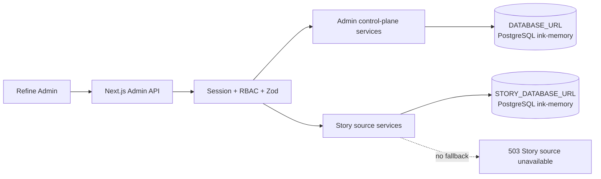
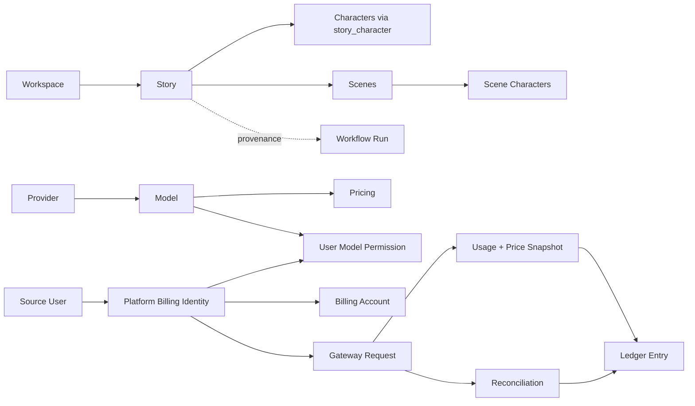

# Ink Memory Admin PRD v2

> 版本：2.1
> 日期：2026-08-08  
> 状态：工程实施基线  
> 视觉依据：`Ink & Memory UI Design v2.1`、`docs/prd/color_system/**`  
> 数据依据：`docs/verification/ink-dream-memory-data-integration-audit.md`
> 字段与控件：`docs/design/admin-resource-field-control-matrix.md`
> 模型/计费设计：`docs/design/cc-switch-model-billing-adaptation.md`
> 视觉实施：`docs/design/admin-ui-visual-specification.md`

## 1. 产品定义

Ink Memory Admin 是 Ink Memory 的运营控制台和 AI 控制面，服务于内容运营、模型运营、财务结算、客服支持、安全审计和系统管理员。它不是剧本创作前台，也不承载已移除的 PWA。

产品需要在一处完成五类工作：

1. 观察和维护真实剧本业务数据及其工作流状态。
2. 以 cc-switch 的配置方式管理 Provider、模型别名、能力、定价和用户模型权限，并把已注册供应商通过兼容代理发布给外部服务。
3. 追踪 Token 用量、余额、预授权、结算与不可变账本。
4. 运营 Anthropic/OpenAI 兼容代理网关、Key、限流和失败结算。
5. 治理 Admin 身份、角色、权限、系统设置、Storage 和审计证据。

### 1.1 目标用户

| 用户 | 主要目标 | 风险边界 |
|---|---|---|
| 内容运营 | 查找 Workspace/Story/Character/Scene，审阅、纠错、确认、拒绝或归档 | 不创建 Agent 产物，不硬删除业务记录，不改 Workflow provenance |
| 模型运营 | 配置 Provider/Model/Pricing，控制可用性和生效窗口 | Secret 永不回显；活动价格不可重叠 |
| 财务运营 | 查询用量、余额、账本和异常结算，执行有理由的调账/核对 | micro-USD 整数；账本只追加；每次人工动作审计 |
| 客服/支持 | 按用户、请求、时间、错误码定位问题 | 默认只读；不得查看 Provider Secret、Gateway 明文 Key、完整 Prompt/响应 |
| 安全审计 | 检查管理员操作、RBAC、Key 和系统配置 | 审计只读且 append-only |
| Super Admin | 初始化、角色治理、系统配置和紧急处置 | 高风险动作二次确认；内置角色和关键历史记录受保护 |

### 1.2 非目标

- 不恢复 `app/(app)` 或任何业务前台页面。
- 不修改 `ink-dream-memory` 的代码、Schema、迁移或运行逻辑。
- 不把 Admin 的旧 `story_*` 表包装成“真实业务数据”。
- 不安装 SQLite 驱动、读取 SQLite 文件、复制同步业务表或提供隐式内存/JSON 回退。
- 不保存/展示完整模型 Prompt、响应、Provider Secret 或已创建 Gateway Key 的明文。
- 不使用虚构 KPI、随机数据或只有外观没有真实行为的 CRUD。

## 2. 经审计的数据前提

业务源当前实际使用 SQLite，Admin 使用 PostgreSQL。目标实现只支持 PostgreSQL，因此代码采用显式的 Story PostgreSQL 数据源，并在业务源尚未完成 PostgreSQL 化时 fail-closed。



部署形态：

- 同实例：`STORY_DATABASE_URL=DATABASE_URL`，真实业务表和控制面表位于同一 `ink-memory` 数据库；仍由不同 repository 维护领域边界。
- 分实例：两个 URL 分别连接数据库名均为 `ink-memory` 的 PostgreSQL；不复制、不双写业务实体。
- 当前开发源：`ink-dream-memory` 仍为 SQLite，不能声明已接通真实数据。工程可用隔离 PostgreSQL 复刻真实表契约验收；生产切换依赖业务源所有者完成受控 PostgreSQL 迁移。

## 3. 数据域边界

### 3.1 业务源权威表

| 域 | 真实表 | 关键关系 | Admin 策略 |
|---|---|---|---|
| 业务用户 | `users` | 整数 PK；拥有 workspace/story/character/scene | 业务字段只读；与 `platform_users` 通过 source/external ID 映射 |
| 工作区 | `story_workspace_workspaces` | owner_id -> users.id | 读、受控改名/设置；不创建/删除 |
| 剧本 | `story_workspace_stories` | author_id、workspace_id | 读、允许字段更新、confirm/reject/archive；不通用创建/删除 |
| 角色 | `story_workspace_characters` | author_id、workspace_id；与 Story M:N | 读、允许字段更新、confirm/reject/archive；不通用创建/删除 |
| 场景 | `story_workspace_scenes` | author_id、workspace_id、可空 story_id；与 Character M:N | 读、允许字段更新、confirm/reject/archive；不通用创建/删除 |
| 剧本角色 | `story_workspace_story_characters` | (story_id, character_id)，含 role_type | 详情读取；关系变更须事务校验同 owner/workspace |
| 场景角色 | `story_workspace_scene_characters` | (scene_id, character_id) | 详情读取；关系变更须事务校验同 owner/workspace |
| 工作流 | `workflow_runs`、`workflow_run_transitions`、`workflow_run_token_consumptions` | provenance、状态版本、幂等、转换历史 | 只读；retry/cancel 仅走命令式接口 |
| 关联创作域 | `decks`、`voices`、`chat_thread`、`chat_message`、`agent_sessions` | 工作流/Agent provenance | 默认不独立运营；按最小披露用于详情关联 |

### 3.2 Admin 控制面表

以下表只属于 Admin，可继续维护：

- 身份治理：`admin_users`、`admin_roles`、`admin_permissions`、关联表、`admin_sessions`。
- 审计/设置：`admin_audit_logs`、`system_settings`。
- 模型：`ai_providers`、`ai_models`、`ai_pricing_rules`、`user_model_permissions`。
- 计费：`platform_users`（计费身份映射）、`billing_accounts`、`billing_ledger_entries`。
- 网关：`gateway_api_keys`、`gateway_requests`、`gateway_rate_limits`。

`platform_users` 不再被称为业务用户主表。它是计费与网关身份映射，唯一性由 `(source, external_user_id)` 保证。

### 3.3 旧平行表

`story_workspaces`、`story_projects`、`story_characters`、`story_scenes`、`story_workflow_runs` 标记为 deprecated：

- 新代码不得查询或写入。
- 当前不删除、不改写历史迁移 `0006`。
- UI 和 API 不提供旧表入口。
- 最终删除需要独立 DBA 变更、备份、差异核对、签字与回滚演练。

## 4. 全局信息架构

```text
总览
剧本数据运营
  ├─ 工作区
  ├─ 剧本项目
  ├─ 角色
  ├─ 场景
  └─ 工作流运行
AI 模型中心
  ├─ Provider
  ├─ Models
  ├─ Pricing
  └─ 模型权限
Token 计费
  ├─ 使用记录
  ├─ 账户余额
  ├─ 交易账本
  └─ 计费报表
代理网关
  ├─ 请求日志
  ├─ 错误与异常结算
  ├─ Gateway Key
  └─ 限流策略
用户与资源
  ├─ 平台用户
  └─ Storage / 资源
权限治理
  ├─ 管理员
  ├─ 角色
  └─ 权限
系统与审计
  ├─ 系统设置
  └─ 审计日志
```

### 4.1 路由

| 页面 | 路由 |
|---|---|
| 总览 | `/admin` |
| 工作区/剧本/角色/场景/工作流 | `/admin/story/workspaces`、`/stories`、`/characters`、`/scenes`、`/workflow-runs` |
| Provider/Models/Pricing/权限 | `/admin/models/providers`、`/models`、`/pricing`、`/permissions` |
| 使用/余额/账本/报表 | `/admin/billing/usage`、`/accounts`、`/ledger`、`/reports` |
| 请求/异常/Key/限流 | `/admin/gateway/requests`、`/reconciliation`、`/keys`、`/rate-limits` |
| 平台用户/Storage | `/admin/resources/users`、`/admin/resources/storage` |
| 管理员/角色/权限 | `/admin/access/admins`、`/roles`、`/permissions` |
| 系统设置/审计 | `/admin/system/settings`、`/audit` |

旧聚合路由 `/admin/story`、`/admin/models`、`/admin/billing`、`/admin/gateway`、`/admin/users`、`/admin/access`、`/admin/system` 应重定向到对应分组首个可访问子路由。

## 5. 全局 Shell 与导航需求

- 桌面 1440×1000：248px 固定侧栏；内容列最大宽度但不锁死，列表占满可用宽度；顶栏显示当前模块、面包屑、数据源健康和用户菜单。
- 移动 390×844：侧栏收进可关闭抽屉；顶栏保留菜单、页面名和高优先动作；不使用整页横向滚动。
- 分组可折叠，当前分组展开；子项以左侧细线/文字权重/小面积 Memory Yellow 标记当前状态，不使用整行深色填充。
- 仅按客户端 permission 隐藏菜单；服务端 API 必须再次验证 Session 和 permission。
- 面包屑必须可返回上层列表，并在 Story 详情中表达 Workspace -> Story -> Scene/Character。
- 导航和操作全部支持键盘；抽屉打开后锁定焦点，Escape 关闭并归还焦点。

## 6. 页面与功能需求

所有列表共同要求：服务端分页、总数、单字段排序、白名单筛选、查询参数同步、可复制 ID、详情跳转、列语义标签、loading skeleton、空状态行动建议、错误恢复和局部横向滚动。

### 6.1 总览

用户目标：快速发现需要处理的真实运营事项，而非阅读装饰性指标。

- 显示真实来源：Story 数据源健康、启用模型数、今日网关请求/Token/计费、待人工结算数、停用/异常 Provider、最近审计。
- 不显示虚构“release 4/4”等静态指标。
- 优先队列链接到：pending review Story、settlement_failed、余额不足用户、Provider 不可用、最近 RBAC 变更。
- 每个数字说明统计时间窗、更新时间与来源；数据不可用时显示不可用而不是 0。
- 不提供创建；所有卡片是跳转或刷新动作。

### 6.2 剧本数据运营

#### 工作区

- 字段：id、owner_id、owner email/display、name、settings、created_at、updated_at。
- 筛选：owner_id、owner email、name；排序：created_at、updated_at、name；分页 20/50/100。
- 详情：基本信息、Story/Character/Scene 数量与最近更新时间。
- 更新：name 与 settings 白名单；严格 JSON object；写前校验 owner。
- 创建/删除/停用：禁止。源业务负责默认 Workspace 生命周期。

#### 剧本项目

- 实际实体为 `story_workspace_stories`；UI 使用“剧本项目”，API/代码使用 `story-stories`，不再使用平行 `story_projects`。
- 字段：id、identifier、title、description、status、review_status、type、author_id、workspace_id、character_count、scene_count、agent_generated、agent_session_id、review_notes、created/updated/confirmed/published。
- 筛选：关键词 title/identifier、workspace_id、author_id、status、review_status、type、agent_generated；排序：title、created_at、updated_at。
- 详情：正文只读预览、关联角色、排序场景、审阅历史、Agent/Workflow provenance。
- 更新：仅 title、description、type；content 默认只读，若未来开放需独立权限与版本快照。
- 动作：pending -> confirm 或 reject；active Story -> archive。状态不匹配返回 409。
- 创建：禁止，Agent/业务流程是权威创建者。删除：禁止硬删除。

#### 角色

- 字段：id、identifier、name、avatar_url、identity、personality、background、catchphrase、tags、notes、author_id、workspace_id、story_count、status、review_status、agent_generated、review_notes、confirmed_at、archived_at、created/updated。
- 筛选：name/identifier、workspace_id、author_id、review_status、status、agent_generated；排序：name、created_at、updated_at。
- 详情：完整角色资料、关联 Story 及 role_type、关联 Scene；跳转保持 Workspace 上下文。
- 更新：name、avatar_url、identity、personality、background、catchphrase、tags、notes。
- 动作：confirm/reject/archive；创建和硬删除禁止。

#### 场景

- 字段：id、identifier、name、description、story_id、author_id、workspace_id、character_count、order_index、status、review_status、agent_generated、review_notes、confirmed_at、archived_at、created/updated。
- 筛选：name/identifier、story_id、workspace_id、author_id、review_status、status；排序：order_index、name、created_at、updated_at。
- 详情：所属 Story、出场角色、前后场景导航、审阅状态。
- 更新：name、description、story_id、order_index。story_id 变更校验目标 Story 与 Scene 同 owner/workspace。
- 动作：confirm/reject/archive；创建和硬删除禁止。

#### 工作流运行

- 字段：id、workspace_id、deck_plugin_id/version、workflow_definition_ref、runtime snapshot/lock/receipt、status、failed_step、error_code、retry_of_run_id、preflight_id、agent_session_id、source message provenance、idempotency_key、status_version、created_by、created/started/completed。
- 筛选：id、workspace_id、created_by、status、error_code、deck_plugin_id、created_at 范围；排序 created_at、started_at、completed_at。
- 详情：provenance、状态时间线、transition、token consumption、失败信息和相关 Story/Agent 链接（存在时）。
- 通用 create/update/delete 全部禁止。
- cancel/retry 为显式命令，需 `story.write`、状态前置条件和幂等键；冲突返回 409。

### 6.3 AI 模型中心

模型设置直接采用 `/Users/dmeck/project/cc-switch` 的交互骨架：Provider 使用预设驱动的全屏新增/编辑面板，依次呈现协议、基础信息、Credential、Endpoint、关联模型摘要和高级配置；Model 使用同一全屏设置面板与 Model Dropdown；Pricing 使用全屏“创建价格版本”流程。视觉不复制 cc-switch 蓝灰，而由 Ink Memory 暖纸/暖夜 Token 统一实现。字段级控件和安全差异以 `docs/design/cc-switch-model-billing-adaptation.md` 为准。

AI 模型中心同时是代理发布控制面：Provider Secret 只用于服务端连接上游；外部服务，主要是 `ink-dream-memory`，使用独立 Gateway Key 和稳定的 `ai_models.code` 调用 Ink Memory 代理。外部调用不得接触 Provider Secret、真实上游 Endpoint 或 `upstream_model`。

#### Provider

- 列表/筛选：code、name、protocol、status、base_url、updated_at；支持状态和协议筛选。
- 创建/更新容器：独立全屏面板，固定 Header/Footer，中段独立滚动；移动端同为全屏。
- 创建/更新字段：code 为创建时文本、编辑只读；protocol 为预设/分段单选且编辑只读；name 为文本；baseUrl 为 URL 输入；timeoutMs/maxRetries 为边界明确的整数输入；status 为开关；authMode/outputTokenParam 为下拉；只有未知扩展 config 使用 JSON Editor。
- Secret：credential 仅提交时存在；列表/详情永不返回；更新空值表示不轮换而非清空。
- Credential 使用 password 输入和本次草稿显隐；已配置凭据只显示状态与 fingerprint，不能载入或复制历史明文。
- 停用：允许；硬删除禁止。确认 Modal 必须读取并说明关联启用模型和近期请求影响。
- 对外代理：页面固定展示 `/v1/messages`、`/v1/messages/count_tokens`、`/v1/chat/completions`、`/v1/models`，分别说明 Header、Gateway Key Scope 和稳定模型别名；示例只能使用环境变量占位符。

#### Models

- 字段：code、provider、upstream_model、display_name、capabilities、context_window、max_output、enabled。
- 创建/编辑容器：桌面和移动均采用 cc-switch 风格全屏设置面板；provider 使用受权、分页、可搜索 Combobox，禁止手填 Provider ID；`upstream_model` 使用按供应商分组的 Model Dropdown 并允许受控自定义；从 Provider 详情发起时预选并锁定。
- capabilities 使用已知能力复选组，不用 JSON；context_window/max_output 使用可空正整数控件；enabled 使用开关并校验 Provider active。
- CRUD：创建、更新、启停；删除默认禁止，只有无 Pricing/Permission/Request 依赖且具备高风险权限时才可讨论，本版本不开放。
- 筛选：provider、code、upstream、enabled、capability；排序 code/updated_at。

#### Pricing

- 字段：model、user_tier、四类 Token 单价、markup_bps、discount_bps、currency、effective_from/to、status。
- 容器：直接采用 cc-switch Pricing 全屏编辑骨架，但主动作固定为“创建价格版本”，不是“覆盖保存”。
- model 使用真实可搜索 Combobox；四类价格使用十进制 USD/1M Token 输入并同步显示精确整数 micro-USD；markup/discount 使用百分比输入和 bps 辅助值；effective_from/to 使用带时区说明的日期时间选择器。
- 创建新生效规则；提交前必须显示旧/新价格、有效窗和真实可得的影响摘要；重叠窗口返回 409 并展示冲突规则链接且保留草稿。
- 已被请求快照引用的历史规则不可破坏性更新/删除；调整价格创建新版本并关闭旧窗口。
- 价格单位明确显示 micro-USD / million tokens，并同时给只读 USD 格式化值。

#### 模型权限

- 按 source user/计费身份与 model 设置 enabled、RPM、daily/monthly Token limit。
- 创建/更新/删除 override；删除表示恢复平台默认，不删除用户/模型。
- 唯一冲突 `(platform_user_id, model_id)` 返回 409。

### 6.4 Token 计费

Usage 页面直接采用 cc-switch 的“全局筛选 → 事实摘要 → 趋势 → 请求日志 / Provider 统计 / 模型统计页签 → 请求详情”结构。全部区域由同一 URL 查询状态驱动；摘要和趋势仅使用真实聚合 API，暂不可得时显示“暂不可用”，不得对当前页数据外推或虚构全量指标。

#### 使用记录

- 来源为 gateway request 的四类 Token 与价格快照；只读。
- 全局筛选：日期范围/时区、protocol、Provider、Model、Platform User、outcome、刷新频率；筛选同时驱动摘要、趋势和三个页签。
- 请求日志专属筛选：request/status/http status/error code；排序 created_at、charged、tokens。
- 详情采用桌面宽 Drawer、移动全屏，按用户与 Key、路由/模型解析、四类 Token、价格快照、Provider cost/charged、结算与 Ledger、性能、脱敏错误分区；保持列表筛选和页签上下文。
- Request、Usage、快照与 Ledger 均只读；人工纠错入口跳转 Reconciliation 命令页，不直接编辑事实记录。

#### 账户余额

- 列表：source user、计费身份、available/reserved/lifetime debited、updated_at。
- 余额调整只允许 credit/debit/reversal 命令，必须填写 reason、idempotency key 和可选工单号。
- 不允许直接编辑余额列或删除账户。

#### 交易账本

- append-only、只读；筛选 account/user/request/type/time/idempotency key。
- 显示 amount、available_after、reserved_after、价格/请求引用与操作者原因。
- 不提供 update/delete；纠错必须新增 reversal/adjustment entry。

#### 计费报表

- 仅基于真实 usage/ledger 聚合；支持日期、user、model、provider、status。
- 总计和分组必须显示时区、币种、micro-USD 转换规则；不可用时不显示 0。
- 首版支持 CSV 导出当前筛选，不导出 Secret/完整请求正文。

### 6.5 代理网关

代理网关是 AI 模型中心的执行面。`ink-dream-memory` 的接入链固定为：源用户映射 → Gateway Key → 兼容端点 → 稳定 Model alias → 注册 Provider → 上游调用 → Usage/价格快照 → Ledger。Provider active 本身不代表可调用；Credential、Model enabled、有效 Pricing、模型权限、余额、Scope 和限流必须全部通过。

| 外部协议 | 路径 | 鉴权 | Scope | 外部 model 字段 |
|---|---|---|---|---|
| Anthropic Messages | `POST /v1/messages` | `x-api-key: $INK_MEMORY_GATEWAY_KEY` | `messages:create` | `ai_models.code` |
| Anthropic Token Count | `POST /v1/messages/count_tokens` | `x-api-key: $INK_MEMORY_GATEWAY_KEY` | `messages:create` | `ai_models.code` |
| OpenAI Chat | `POST /v1/chat/completions` | `Authorization: Bearer $INK_MEMORY_GATEWAY_KEY` | `chat:create` | `ai_models.code` |
| Model List | `GET /v1/models` | Bearer 或 `x-api-key` | `models:list` | 返回当前用户真正可调用的 alias |

#### 请求日志

- 字段：request ID、upstream ID、user、model、provider、protocol、status/outcome、四类 Token、reserved/provider cost/charged、latency、error code、created/completed。
- 筛选：request/upstream/user/model/provider/status/outcome/error/time；只读详情。
- 详情展示 request -> usage -> pricing snapshot -> ledger 链路，不展示完整 Prompt/响应。

#### 错误与异常结算

- 默认筛选 `settlement_failed`、用量未知、账本不一致。
- 人工核对操作要求 disposition、实际四类 Token 或明确 release、reason、external ticket、幂等键。
- 操作前展示现有冻结、已知用量、Provider 错误和影响金额；提交后不可修改，通过新 reversal 纠错。

#### Gateway Key

- 创建时选择计费身份、name、scopes、expires_at；明文只在成功后一次显示，离开后不可恢复。
- 列表只显示 prefix、name、scopes、status、last_used、expires；支持 revoke，不支持取回或更新 Secret。
- 页面不得把明文写入 URL、日志、localStorage 或 analytics。

#### 限流策略

- 分钟/日/月窗口计数只读；策略来自 user/model override 与默认限额。
- 筛选 user/model/window type/time；展示 request/token count 与阈值、重置时间。
- 修改限额跳转“模型权限”，不直接编辑计数。

### 6.6 用户与资源

#### 平台用户

- 列表以源 `users` 为主，组合显示 id、email、display_name、avatar、role、created/updated，以及是否绑定 `platform_users`、tier/status/limits/account balance。
- 源业务字段只读。创建业务用户、改 password_hash、硬删除均禁止。
- 计费身份可执行“绑定/初始化”：`source=ink-dream`、external_user_id=源 id；重复绑定返回 409。
- 计费 status/tier/limit 可更新；停用计费身份不等同于删除业务用户。

#### Storage / 资源

- 复用现有 `/api/storage`、`/api/storage/upload*`、`/api/storage/file/**` 和 `app/lib/file-storage/**`。
- 首版展示 driver、配置健康、direct upload 能力、prefix 规则和上传诊断；支持受控上传与按已知 key 检查 metadata/exists/download。
- 当前 FileStorage 无 list 能力，不虚构文件总量或资源列表；如未来加 list，必须作为接口能力扩展且继续复用 driver。
- 删除对象是高风险动作，本版本不在管理 UI 开放；不得删除或弱化现有 API/shared lib。

### 6.7 权限治理

#### 管理员

- 创建、改显示名、重置密码、分配角色、启停；不硬删除。
- 禁止操作者停用最后一个 active super_admin；竞态返回 409。

#### 角色

- 自定义角色创建/更新/删除；内置角色不可删除，super_admin 权限由系统维护。
- 删除前列出受影响管理员；有关联时 409。

#### 权限

- 系统权限代码只读；按域和风险分组，显示被哪些角色使用。

### 6.8 系统与审计

#### 系统设置

- category/key 唯一；普通设置可创建、更新、停用。
- Secret value 创建/覆盖后永不回显；详情只返回 `{masked:true}`。
- 不提供硬删除；配置解析失败返回 400，唯一冲突 409。

#### 审计日志

- append-only、只读；筛选 actor/action/resource/request/time。
- 详情显示安全的 before/after/metadata；Secret、password、Key、Token、完整 Prompt/响应必须被移除或掩码。

## 7. 页面联动



跨模块链接必须携带白名单筛选参数而不是复制数据，例如用户详情 -> Usage、Request、Ledger；Model 详情 -> Pricing、Permission、Request；Gateway Request -> User、Model、Ledger。

## 8. Refine Resource / API / 数据映射

| Refine Resource | Admin API | 权威表/服务 | 能力 |
|---|---|---|---|
| `source-users` | `/api/admin/source-users` | Story PG `users` + control crosswalk | list/get；计费绑定为自定义动作 |
| `story-workspaces` | `/api/admin/story-workspaces` | `story_workspace_workspaces` | list/get/update |
| `story-stories` | `/api/admin/story-stories` | `story_workspace_stories` | list/get/update + confirm/reject/archive |
| `story-characters` | `/api/admin/story-characters` | `story_workspace_characters` + relations | list/get/update + review/archive |
| `story-scenes` | `/api/admin/story-scenes` | `story_workspace_scenes` + relations | list/get/update + review/archive |
| `story-workflow-runs` | `/api/admin/story-workflow-runs` | `workflow_runs` + transition/consumption | list/get + retry/cancel command |
| `providers` | `/api/admin/providers` | `ai_providers` | list/get/create/update/disable |
| `models` | `/api/admin/models` | `ai_models` | list/get/create/update/enable/disable |
| `pricing-rules` | `/api/admin/pricing-rules` | `ai_pricing_rules` | list/get/create/version |
| `user-model-permissions` | `/api/admin/user-model-permissions` | control tables | CRUD override |
| `billing-accounts` | `/api/admin/billing-accounts` | `billing_accounts` | list/get + adjustment command |
| `usage` | `/api/admin/usage` | `gateway_requests` usage projection | list/get only |
| `ledger` | `/api/admin/ledger` | `billing_ledger_entries` | list/get only |
| `gateway-requests` | `/api/admin/gateway-requests` | `gateway_requests` | list/get + reconcile command |
| `gateway-api-keys` | `/api/admin/gateway-api-keys` | `gateway_api_keys` | list/get/create/revoke |
| `gateway-rate-limits` | `/api/admin/gateway-rate-limits` | `gateway_rate_limits` | list/get only |
| `platform-users` | internal composition/crosswalk | `platform_users` | bind/update/disable |
| `admin-users` | `/api/admin/admin-users` | Admin RBAC tables | list/get/create/update |
| `admin-roles` | `/api/admin/admin-roles` | Admin RBAC tables | list/get/create/update/delete custom |
| `admin-permissions` | `/api/admin/admin-permissions` | `admin_permissions` | list/get only |
| `system-settings` | `/api/admin/system-settings` | `system_settings` | list/get/create/update/disable |
| `audit-logs` | `/api/admin/audit-logs` | `admin_audit_logs` | list/get only |

Data Provider 合同：

- `getList` 接受 page/pageSize、单 sorter、`eq/contains/in` 白名单 filter，返回 `{data, meta:{total,page,pageSize}}`。
- `getOne` 返回 `{data}`；不存在为 404。
- 不支持的字段/运算符为 400；未登录 401；权限不足 403；FK/unique/state 冲突 409；业务源不可用 503；其他 500。
- UI 不得根据 200 空数组推断数据库健康；503 有独立状态。

## 9. RBAC 矩阵

| 权限 | super_admin | operator | auditor | 能力 |
|---|:---:|:---:|:---:|---|
| `dashboard.read` | ✓ | ✓ | ✓ | 总览 |
| `story.read` | ✓ | ✓ | ✓ | 业务源读取 |
| `story.write` | ✓ | ✓ | - | Story 受控编辑/审阅/命令 |
| `users.read` | ✓ | ✓ | ✓ | 源用户与计费身份读取 |
| `users.write` | ✓ | ✓ | - | 计费身份绑定/停用/权限 override |
| `providers.read` | ✓ | ✓ | ✓ | Provider 读取 |
| `providers.write` | ✓ | ✓ | - | Provider/Secret 轮换 |
| `models.read` | ✓ | ✓ | ✓ | Model 读取 |
| `models.write` | ✓ | ✓ | - | Model 启停/更新 |
| `pricing.read` | ✓ | ✓ | ✓ | Pricing 读取 |
| `pricing.write` | ✓ | ✓ | - | Pricing 版本发布 |
| `billing.read` | ✓ | ✓ | ✓ | Usage/Account/Ledger/Report |
| `billing.adjust` | ✓ | - | - | 调账与失败结算 |
| `gateway.read` | ✓ | ✓ | ✓ | Request/Key 掩码/限流读取 |
| `gateway.keys.write` | ✓ | ✓ | - | 创建/revoke Gateway Key |
| `access.read` | ✓ | - | ✓ | Admin/Role/Permission 读取 |
| `access.write` | ✓ | - | - | Admin/RBAC 变更 |
| `system.read` | ✓ | ✓ | ✓ | 设置读取 |
| `system.write` | ✓ | - | - | 设置变更/Secret 覆盖 |
| `audit.read` | ✓ | - | ✓ | 审计读取 |

所有矩阵必须在服务端重复验证；Refine `useCan` 只负责交互可见性。

## 10. 状态、错误与恢复

| 状态 | 展示 | 恢复动作 |
|---|---|---|
| Loading | 与最终行结构一致的 skeleton，保留表头/筛选器 | 自动完成；超过阈值显示“仍在加载” |
| Empty | 说明当前筛选无结果或系统尚无数据 | 清除筛选/跳转可创建模块；只读域不诱导创建 |
| 400 | 字段级错误、保留用户输入 | 聚焦首个错误，允许修正重试 |
| 401 | Session 过期提示 | 跳转登录，登录后回到原 URL |
| 403 | 无权页面，显示所需权限，不泄露数据 | 返回上页/申请权限 |
| 404 | 记录不存在或不可见 | 返回相应列表 |
| 409 | 展示冲突类型和相关记录/最新状态 | 刷新后重试；禁止盲目覆盖 |
| 500 | 安全错误、request ID | 重试、复制 request ID；不泄露 SQL/Secret |
| 503 | Story/数据库不可用，明确是数据源问题 | 重新检查；展示配置/运维提示；无旧表/假数据回退 |
| Success | 行内/Toast 确认实际动作和资源 ID | 刷新 list/detail cache；焦点回到合理位置 |

## 11. 视觉系统

### 11.1 依据与冲突取舍

PDF v2.1（2026-07-25）晚于 `color_system` 子文档中的旧亮色值，并明确对齐业务源最新 `frontend/src/styles/tokens.css`。因此 Admin 采用 PDF/最新 tokens 值；子文档提供暗色、语义和组件行为补充。当前 Admin 的冷灰、蓝色主操作、霓虹橙与大阴影系统应被替换。

### 11.2 Token

| Token | Light | Dark | 用途 |
|---|---:|---:|---|
| `--color-bg-app` | `#F6EFE5` | `#1D1916` | 页面暖纸/暖夜画布 |
| `--color-bg-paper` | `#FFFAF2` | `#2A241F` | 主内容纸面 |
| `--color-bg-surface-solid` | `#FFFDF8` | `#342D27` | Menu/Popover |
| `--color-text-primary` | `#3F3429` | `#F3E8D8` | 标题、图标 |
| `--color-text-body` | `#4B3F33` | `#EEE8DF` | 正文 |
| `--color-text-secondary` | `#7A6A59` | `#C8BCAE` | 说明 |
| `--color-text-muted` | `#9A8A78` | `#9F9283` | 时间/placeholder |
| `--color-action-primary` | `#5F4A36` | `#F3E8D8` | 主操作/当前导航 |
| `--color-border-paper` | `#D8C7B3` | `#5A4D3D` | 纸边/分隔 |
| `--color-action-link` | `#4A90E2` | `#81B7D2` | 链接 |
| `--color-voice-yellow` | `#F39C12` | `#F7C96A` | 小面积重点 |
| `--color-voice-green` | `#27AE60` | `#7BDBA0` | 小面积辅助 |

状态、阴影、代码和 disabled token 直接沿用业务源最新语义 Token；不得新增孤立 hex。暗色主按钮必须使用深色前景 token，不能在暖白按钮上放白字。

### 11.3 布局与组件语言

- “少面板、多留白、视觉收敛、轻纸面分区、单一虚线边界、无卡片堆叠”。
- 普通列表行静止无阴影；hover 才允许极轻 shadow；选中态用细线/对勾/小面积 accent。
- Display 标题使用本地 Noto Serif SC；正文/控件使用本地 Noto Sans SC；ID/金额/Token 使用 IBM Plex Mono。Admin 不依赖远程字体。
- 圆角层级 4/6/8/12px；胶囊仅用于短状态/紧凑动作，不把所有容器做成 24-28px 大卡片。
- 动效 0.2-0.3s；尊重 `prefers-reduced-motion`；禁止强 glow、无限脉冲、液态渐变和装饰性旋转。

## 12. 表单与高风险交互

- `docs/design/admin-resource-field-control-matrix.md` 是所有资源的字段级权威规范；页面实现不得用通用推断覆盖其中的展示类型、控件、关系数据源、校验、脱敏和容器选择。
- 常规字段使用结构化表单，不再以 JSON Workbench 作为默认 CRUD。
- JSON/Config 编辑只用于真实 JSON 字段，提供格式化、schema 错误行列、恢复到服务器值；不允许未知字段。
- 密钥输入显示“新凭据将覆盖旧凭据”，默认 password 类型，有显隐和粘贴支持；已保存值永不填回。
- 停用/撤销确认说明影响范围；硬删除仅自定义 Role，并要求输入资源 code。
- 财务/结算确认展示 before/after 金额、幂等键和理由，提交后不可编辑。
- 所有表单有可见 label、description/error 关联、required/optional 标识和离开未保存提醒。

| 操作复杂度 | 强制容器 | 示例 |
|---|---|---|
| 单实体、字段有限、从当前列表进入 | Modal 或右 Drawer；移动全屏 | Workspace、Model Permission、Platform Identity、Admin User、System Setting |
| 多分区、依赖关系或财务高风险 | 独立全屏面板/独立路由 | Provider、Model、Pricing 新版本、Role 权限矩阵、Reconciliation |
| 只读核对且需保留列表上下文 | 右 Drawer；移动全屏 | Story 详情、Workflow、Usage/Gateway Request |
| 单一停用/撤销/拒绝/调账命令 | 有影响摘要的确认 Modal | Provider/Model 停用、Key revoke、Story reject、余额调整 |

表单必须从操作者选中的真实记录 `getOne` 预填；不存在“记录 ID”输入框或模板占位 ID。Provider、Model、User、Role、Permission、Workspace、Story 等关系字段必须使用真实、受权、可搜索选择器。数组使用复选/多选，枚举使用下拉或分段单选，布尔使用开关，日期使用日期时间控件，整数和 micro-USD 使用有单位的数字控件；只有数据库真实 JSON 字段使用 JSON Editor。

## 13. 响应式与可访问性

- 1440×1000：侧栏 + 顶栏 + 单主内容滚动；表格局部滚动，sticky first/last column 仅在不遮挡内容时使用。
- 390×844：筛选器收进 disclosure/sheet；列表优先显示主字段、状态、时间和动作，详细字段在详情页；页面宽度始终不超过 viewport。
- 最小触控目标 44×44；正文不小于 14px；关键说明建议 16px。
- 可见 focus ring 使用 `--color-border-focus`，不得全局 `outline:none` 后只依赖 box-shadow。
- 状态不只用颜色：配文字/图标；图标按钮必须有 accessible name。
- 表格有 caption/column headers；错误用 `role=alert`，异步成功用 polite live region。
- 颜色对比达到 WCAG AA；两主题均验收。

## 14. 安全与财务要求

- Provider credential 使用现有加密能力；响应仅返回配置状态，不返回密文或明文。
- Gateway Key 只存 hash/prefix；创建响应只显示一次。
- system secret 值只写不读；audit 必须脱敏。
- 所有金额使用整数 micro-USD；禁止 JS 浮点参与账务计算。
- Gateway Request 保存价格快照；历史账本 append-only，由数据库 trigger 与 API 双重禁止 update/delete。
- 未知 usage 不按 0 结算；进入 `settlement_failed` 人工核对。
- Route Handler 仅解析、鉴权、调用 service；SQL、事务、状态机和审计在 `app/lib/**`。

## 15. 迁移、兼容与回滚

1. 新代码先引入 story-source repository 和数据源健康检查，旧资源仍存在但不可见。
2. Refine/API 切到真实表名；未配置/未迁移的 Story PG 返回 503。
3. 隔离环境用真实字段与关系完成读写/冲突验收。
4. 生产部署前由业务源所有者迁移 SQLite -> PostgreSQL，完成行数、FK、JSON、UTC、哈希抽样和停写切换。
5. Admin 只在明确连接目标后启用 Story 菜单；控制面功能不受 Story 503 影响。
6. 回滚仅回滚 Admin 代码/配置到上一个不写 Story 的版本；不得回滚到旧平行表写入。
7. 旧表清理为独立未来迁移，本版本不执行。

本版本的 `drizzle/0007_curvy_sabretooth.sql` 仅添加 deprecated 表注释；不会删除、清空、重命名或搬运旧表数据。Drizzle 目标 Schema 已移除这些平行实体，以阻止后续功能继续依赖它们。

## 16. 可测试验收标准

### 数据接入

- [ ] Story repository 只使用 `story_workspace_*`、`workflow_*` 与源 `users`；生产代码无旧 `story_projects/story_characters/story_scenes/story_workflow_runs` 查询。
- [ ] `STORY_DATABASE_URL` 仅接受 PostgreSQL，数据库名为 `ink-memory`；不可用时 503，无 SQLite/JSON/旧表回退。
- [ ] Story ID、integer user ID、M:N 关系和可空 story_id 原样保留。
- [ ] 受控更新成功；非法字段 400；FK/unique/state 冲突 409；create/delete 禁止。

### Admin/安全

- [ ] 无 Session 页面重定向登录，Admin API 401；权限不足 403。
- [ ] Provider/system secret 永不回显；Gateway Key 仅创建时一次显示。
- [ ] Pricing overlap 409；模型/Provider 启停关系明确。
- [ ] Usage/Ledger/Audit 无 update/delete UI/API；数据库 trigger 阻止破坏性 SQL。
- [ ] Gateway failure 有人工核对入口并产生 ledger/audit。
- [ ] Storage 现有 route/lib 单测继续通过。

### UI/UX

- [ ] 菜单与本 PRD IA 一致，桌面/移动可用，当前项清晰。
- [ ] 默认页面不再呈现 JSON-only CRUD 工作台或默认 Refine/Ant Design 模板。
- [ ] Provider/Pricing/Usage/Request Detail 保留 cc-switch 指定交互骨架，并完成 Ink Memory light/dark Token 换肤。
- [ ] 每个表单字段与 `admin-resource-field-control-matrix.md` 一致；关系选择器只提交真实选中 ID，列表选择后能以服务器当前值预填。
- [ ] Provider、Model 与 Pricing 在 cc-switch 式全屏面板完成；普通编辑在 Drawer/Modal；Request Detail 只读并保持筛选上下文。
- [ ] loading/empty/400/401/403/404/409/500/503/success 均有恢复动作。
- [ ] 1440×1000 与 390×844 无页面级横向溢出；表格局部滚动。
- [ ] 键盘导航、焦点、label、live region、对比度通过检查；light/dark token 一致。

### 回归与发布

- [ ] `pnpm env:check`、`pnpm exec tsc --noEmit`、`pnpm lint`、`pnpm test:run`、`pnpm build` 通过。
- [ ] 聚焦 Playwright 覆盖登录/RBAC/Story/模型/计费/Gateway/用户/Storage/状态/移动布局。
- [ ] 隔离 PostgreSQL 验收不迁移、清空或删除共享 `ink-memory`。
- [ ] `/customers`、`/todos`、`/api/customers`、`/api/claude-agent` 与已移除 PWA 路由继续 404。
- [ ] 未修改 `ink-dream-memory`，未引入 SQLite，未恢复 `app/(app)`，未删除 Storage/shared lib，未操作共享数据库真实数据。
