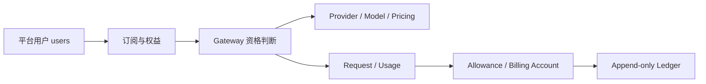

# Ink Memory Admin PRD v3 — 平台总纲

> 版本：3.0  
> 更新：2026-08-08  
> 状态：平台产品与工程实施基线  
> 详细需求：[`docs/prd/modules/`](modules/)  
> 全局交互规范：[`docs/design/refine-admin-ui-v3-interaction-design.md`](../design/refine-admin-ui-v3-interaction-design.md)

## 1. 产品定位

Ink Memory Admin 是剧本业务运营控制台、AI 模型控制面、订阅计费后台和安全治理入口。主要操作者是内容运营、模型运营、财务运营、客服支持、安全审计与 Super Admin；它不是 Dream 创作前台，不恢复已移除的 PWA。

平台必须完成以下闭环：

## 2. 不可变产品决策

1. PostgreSQL `users` 是唯一平台用户全集；所有平台用户天然可订阅、持有计费账户、获得 Gateway Key 并产生 Usage/Ledger。不存在独立“计费用户”。
2. `platform_users` 仅是现有 Gateway/Billing 文本外键的内部一对一兼容键，由迁移与 trigger 自动维护，不作为产品主数据或手工开户入口。
3. Dream 权威业务表使用真实原名；Admin 不读取错误平行 Story 表，不修改 Dream 仓库。缺表时 503 fail-closed，不回退 SQLite、JSON 或内存数据。
4. 单一 `DATABASE_URL`、单一 PostgreSQL 数据库 `ink-memory`、单一连接池。Route Handler 只做 Session/RBAC、Origin、解析、Zod 和 service 调用；SQL、事务与状态机位于 `app/lib/**`。
5. 金额事实为整数 micro-USD；Plan Version、价格快照不可覆盖；Usage、Ledger、Subscription Event 与 Audit 不可变或只追加。
6. Provider Secret、Gateway Key、系统 Secret 永不明文落库、回显、写日志或进入截图。Gateway Key 只在创建回执显示一次。
7. 不使用假数据、虚构 KPI 或没有真实 API/领域行为的 CRUD 外壳。

## 3. 模块地图

| 模块 | PRD | 主要路由 | 当前边界 |
|---|---|---|---|
| 平台基础与总览 | [00-platform-foundation](modules/00-platform-foundation.md) | `/admin`、登录与 Shell | Session、导航、全局状态、总览事实 |
| 平台用户 | [01-platform-users](modules/01-platform-users.md) | `/admin/resources/users` | canonical 用户、计费账户自动附属、用户级限额 |
| Dream 创作运营 | [02-story-operations](modules/02-story-operations.md) | `/admin/story/**` | 真实 Workspace/Story；扩展表缺失时 503 |
| 订阅与权益 | [03-subscriptions](modules/03-subscriptions.md) | `/admin/subscriptions/**` | Plan、Version、Entitlement、生命周期、Allowance |
| 模型供应链 | [04-model-catalog](modules/04-model-catalog.md) | `/admin/models/**` | Provider、Model、Pricing、模型权限与同步 |
| Gateway | [05-gateway](modules/05-gateway.md) | `/admin/gateway/**`、`/v1/**` | Key、协议代理、Request、Payload、限流 |
| Usage 与账务 | [06-billing](modules/06-billing.md) | `/admin/billing/**` | Usage、账户、Ledger、报表与调账 |
| Storage | [07-storage](modules/07-storage.md) | `/admin/resources/storage`、`/api/storage/**` | S3/Vercel Blob 能力、资源与安全下载 |
| 权限与系统治理 | [08-governance](modules/08-governance.md) | `/admin/access/**`、`/admin/system/**` | Admin、RBAC、Session、Settings、Audit |

专项历史文档继续作为证据，不是平台入口：Gateway 完整报文条款已收敛到 [Gateway PRD](modules/05-gateway.md)；v2 保留为历史基线，不再新增跨模块需求。

## 4. 角色与权限原则

| 角色 | 默认职责 | 禁止越界 |
|---|---|---|
| Super Admin | 全模块、RBAC、Secret、财务高风险命令 | 不能改写 Ledger/Audit/历史版本 |
| Operator | Story、模型、订阅、Gateway 日常运营 | 默认无 `billing.adjust`、`access.write`、`gateway.payloads.read` |
| Auditor | 读取运营事实、RBAC、Audit、受保护 Payload | 不执行写操作 |

服务端权限码按模块使用：`dashboard.*`、`story.*`、`users.*`、`subscriptions.*`、`providers.*`、`models.*`、`pricing.*`、`gateway.*`、`billing.*`、`storage.*`、`access.*`、`system.*`、`audit.*`。客户端隐藏按钮只是可用性优化，不是授权边界。

## 5. 全局状态契约

| 状态 | 产品表现 | 恢复路径 |
|---|---|---|
| Loading | 保留页头、筛选和表头的等高骨架 | 不跳焦；超时说明仍在加载 |
| Empty | 区分系统无数据与筛选无结果 | 创建（仅允许域）、清筛或返回上层 |
| 400 | 错误摘要与字段错误，保留草稿 | 聚焦首错 |
| 401 | 清除保护内容并进入登录 | 登录后安全返回原 URL |
| 403 | 显示所需 permission，不泄露记录 | 返回可访问模块或申请权限 |
| 404 | 资源不存在或不可见 | 返回模块列表 |
| 409 | 展示最新状态、冲突对象和 request ID | 刷新/载入最新值后重试，不盲写 |
| 500 | 安全错误摘要和 request ID，不展示 SQL/stack/Secret | 重试或复制 request ID 联系支持 |
| 503 | 数据源或依赖不可用 | 明确依赖与重试；禁止假数据回退 |
| Success | 显示资源 ID、实际结果、审计/幂等回执 | 刷新受影响查询并合理归焦 |

## 6. 跨模块数据与调用边界

| 数据域 | 权威表/服务 | 写入者 | 消费模块 |
|---|---|---|---|
| 平台用户 | `users` | Dream/迁移；Admin 业务字段只读 | 用户、订阅、Gateway、账务 |
| Story | `story_workspace_*` | Dream；Admin 仅受控字段/确认命令 | Story、总览 |
| 订阅 | `subscription_*` | Subscription service | Gateway、账务、用户详情 |
| 模型供应链 | `ai_providers/models/pricing_rules` | Model services | Gateway、订阅权益、Usage |
| Gateway 事实 | `gateway_*`、payload tables | Gateway lifecycle | Usage、审计、支持排障 |
| 财务事实 | `billing_accounts`、`billing_ledger_entries` | Billing transaction services | Billing、订阅、Gateway |
| 治理 | `admin_*`、`system_settings` | Admin security services | 全模块 |

## 7. 发布与回滚

- Schema 只做增量、非破坏迁移；旧平行表停止使用但不在本轮删除。
- Plan Version、Pricing snapshot、Usage、Ledger、Audit 和 Subscription Event 不回滚为旧内容；问题使用向前修复或 reversal。
- 新模块按“只读影子查询 → 小范围运营写入 → Gateway cohort → 全量”灰度。
- 数据库测试只允许明确一次性 PostgreSQL 或 `TEST_DATABASE_URL`；不得迁移、清空或删除未知共享数据库。
- Dream 后续接入遵循 [`ink-dream-subscription-integration-change-list.md`](../architecture/ink-dream-subscription-integration-change-list.md)，Admin 本轮不修改 Dream 代码。

## 8. 平台级验收

- 每个平台用户自动拥有唯一内部兼容键和唯一计费账户；任何用户选择器不依赖手工开户。
- 所有列表具备真实总数、服务端分页/排序、白名单筛选和明确错误映射。
- Session/RBAC 401/403、唯一/FK/状态 409、依赖 503 均有自动测试。
- Gateway 资格链按 `User → Subscription → Entitlement → Model Permission → Allowance/Balance → Request → Usage → Ledger` 执行并冻结快照。
- Secret 不出现在详情、API 重读、日志、DOM 或截图；Usage/Ledger/Audit 不提供更新/删除。
- 1440×1000 与 390×844 无页面级横向溢出，键盘、焦点、label、状态文字和读屏通知可用。
- `pnpm env:check`、TypeScript、lint、unit、build、隔离 PostgreSQL与 focused Playwright 通过；Storage、PWA 404 和 Dream 真实表回归不退化。

## 9. 文档维护规则

- 新需求先进入对应模块；只有跨三个以上模块的决策才修改本总纲。
- PRD 描述“为什么、范围、规则与验收”；交互规范描述“页面如何工作”；实现细节只保留足以建立可测试契约的映射。
- 模块 PRD 与同名交互文档必须双向链接，状态、路由、权限、表名、金额单位和验收编号一致。
- 变更不得覆盖历史文档；过时内容标记 superseded，并从本索引移除主入口。
