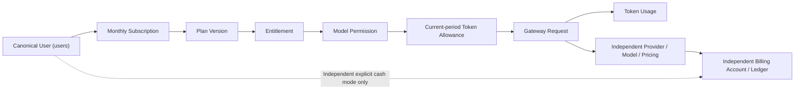

# Ink Memory Admin PRD v3 — 平台总纲

> 版本：3.4
> 更新：2026-08-09  
> 状态：**Implemented / Release candidate**；生产 cutover、外部 Provider canary 与安全所有者回执仍受 Release Gate 约束
> 详细需求：[`docs/prd/modules/`](modules/)  
> 全局交互规范：[`docs/design/refine-admin-ui-v3-interaction-design.md`](../design/refine-admin-ui-v3-interaction-design.md)

## 0. 状态与本轮范围

| 分层 | 本文定义 |
|---|---|
| **Current / Implemented** | Admin `0000–0024`、唯一 canonical 用户投影、Token-only 个人月度订阅、付费开通/续费、Subscription Token Ledger、Product/Payment API、strict Gateway/Token settlement、PaymentAdapter/Fake/Webhook 已在本机 PG 与隔离库通过；Dream 48/569/81/25 Alembic、43+5 CLI、PG-only runtime、Product BFF、全入口 Gateway client 与真实订阅/支付页已实现。 |
| **Release candidate evidence** | Admin 66 files/313 tests、tsc/lint/build 与隔离 Payment activation/renewal 集成通过；Dream backend 1,679 passed/14 skipped/652 subtests、推理聚焦 61 passed，frontend lint 0 errors/21 warnings/build、Product API 9/9、订阅 Playwright 4/4；本地 `ink-memory` 43+5/4921 行 cutover、Admin migrations=25 与真实 startup/health 通过。 |
| **Release Gate** | 真实生产源 rehearsal/owner/ACL/备份/cutover、生产 Session/服务身份、外部 Provider/user canary、credential owner 吊销/轮换回执尚未完成。不得把 Release candidate 误报为生产发布。 |
| **Deferred** | 真实 Stripe/支付宝/微信支付/银行渠道，以及尚无 streaming-audio capability/计量合同的 ASR Gateway 接入。PaymentAdapter/Fake/Webhook 不再 Deferred。 |

## 1. 产品定位

Ink Memory Admin 是剧本业务运营控制台、AI 模型控制面、订阅计费后台和安全治理入口。主要操作者是内容运营、模型运营、财务运营、客服支持、安全审计与 Super Admin；它不是 Dream 创作前台，不恢复已移除的 PWA。

平台的 Release candidate 主链已实现以下闭环；真实 Provider/cutover 仍受发布门禁约束：

## 2. 不可变产品决策

1. PostgreSQL `users` 是唯一平台用户全集；所有平台用户天然可订阅、持有计费账户、获得 Gateway Key 并产生 Usage/Ledger。不存在独立“计费用户”。
2. `platform_users` 仅是现有 Gateway/Billing 文本外键的内部一对一兼容键，由迁移与 trigger 自动维护，不作为产品主数据或手工开户入口。
3. Dream 权威业务表使用真实原名；Admin 不读取错误平行 Story 表，不修改 Dream 仓库。缺表时 503 fail-closed，不回退 SQLite、JSON 或内存数据。
4. 只有一个 PostgreSQL 数据库 `ink-memory`，但 Dream 与 Admin 使用独立 Repository、连接池、数据库角色和迁移日志；不共享超权限运行角色。Admin Route Handler 只做 Session/RBAC、Origin、解析、Zod 和 service 调用；SQL、事务与状态机位于 `app/lib/**`。
5. Subscription Plan/Version 保存月度 Token、非货币权益和整数 micro-USD 月费；不保存金额额度、cash overage 或平台统一生效日。Plan Version、Entitlement 和 Pricing 版本不可覆盖；Usage、Ledger、Payment adjustment、Subscription Event 与 Audit 只追加或终态不可变。
6. Provider/System/Payment Secret 永不由读取接口返回；Gateway Key 明文仅在创建响应返回一次，之后永不重读。这些 Secret 与 Webhook 原始签名均不得明文落库、写日志、遥测或自动化截图。
7. Dream 浏览器只调 Dream 同源 BFF；Dream 服务端使用最小权限服务身份调用 Admin 产品 API 和 Gateway。浏览器不持有 Gateway Key、Provider Secret 或服务间凭据。
8. 付费首次开通和到期续费创建 Payment Intent，只有已验证且幂等的成功 Webhook 才能激活或续期；付费到期进入 `past_due` 且不得免费发放下一期 Token。Fake Adapter 仅限测试环境且生产 fail closed；未指定的真实支付渠道继续 Deferred。
9. 不使用假数据、虚构 KPI 或没有真实 API/领域行为的 CRUD 外壳。

旧 cash balance-only 默认放行已从 Subscription Gateway 资格链移除；独立现金模式若保留，必须有显式产品资格/request mode，不能由 Token 耗尽自动触发。生产流量仍需通过用户级 Provider canary 证明无隐式回退。

## 3. 模块地图

| 模块 | PRD | 主要路由 | Current / Target（2026-08-09） |
|---|---|---|---|
| 平台基础与总览 | [00-platform-foundation](modules/00-platform-foundation.md) | `/admin`、登录与 Shell | Shell/登录/真实 Story 快照已实现；Gateway/计费摘要和页面级 permission guard 未完成 |
| 平台用户 | [01-platform-users](modules/01-platform-users.md) | `/admin/resources/users` | **Implemented / RC**：canonical 投影、所有 selector 服务端搜索/分页、命令反查和 QA-only 回归已验证；生产 orphan 处置待回执 |
| Dream 创作运营 | [02-story-operations](modules/02-story-operations.md) | `/admin/story/**` | **Correction in progress**：真实三表与 12 Workspace / 4 Story 已确认；列表统一 canonical Resource、关系筛选、错误/空态和 cache 合同按本轮验收；Dream-owned 43+5 PG-only runtime 与 Admin 白名单写边界不变 |
| 订阅与权益 | [03-subscriptions](modules/03-subscriptions.md) | `/admin/subscriptions/**` | **Implemented / RC**：Token-only 个人月度周期、下一周期换版、付费开通/续费与 Product/Payment API 已验证 |
| 模型供应链 | [04-model-catalog](modules/04-model-catalog.md) | `/admin/models/**` | Current 有 Provider/Model/Pricing；Target 保持不可覆盖快照并为 Dream 发布可用 alias |
| Gateway | [05-gateway](modules/05-gateway.md) | `/admin/gateway/**`、`/v1/**` | **Implemented / RC**：canonical/402/终态、无 cash fallback 与 Dream server-only client 已验证；外部 Provider canary 待执行 |
| Usage、支付与独立账务 | [06-billing](modules/06-billing.md) | `/admin/billing/**` | **Implemented / RC**：Usage/账户/Ledger、Payment Intent/Webhook/Fake 与终态 guard；真实渠道 Deferred |
| Storage | [07-storage](modules/07-storage.md) | `/admin/resources/storage`、`/api/storage/**` | 已实现 |
| 权限与系统治理 | [08-governance](modules/08-governance.md) | `/admin/access/**`、`/admin/system/**` | 已实现；Settings 当前不在主导航 |

专项历史文档继续作为证据，不是平台入口：旧版 [AI 平台控制面设计](../design/ai-platform-admin-billing-gateway-design.md) 已标记 superseded，Gateway 完整报文条款已收敛到 [Gateway PRD](modules/05-gateway.md) 与 [Gateway 交互规范](../design/modules/05-gateway.md)；v2 保留为历史基线，不再新增跨模块需求。

### 3.1 Dream Workspace / Story 数据运营纠偏（2026-08-09）

专项审计：[`story-workspace-data-visibility-audit.md`](../verification/story-workspace-data-visibility-audit.md)
交互设计：[`story-workspace-data-visibility-fix-interaction-design.md`](../design/story-workspace-data-visibility-fix-interaction-design.md)

产品目标：数据库存在 canonical Dream 数据时，运营列表必须显示同条件真实结果；数据库零行、筛选零行、权限错误、API 错误、数据库不可用与关系不一致不得共享同一个空表叙事。

| 页面 | Canonical Resource / API / Table | 核心产品合同 |
|---|---|---|
| Workspace | `story-workspaces` / `/api/admin/story-workspaces` / `story_workspace_workspaces` | 以 Workspace 为主体关联 canonical `users`；展示 ID、真实 owner、status、Story 数、创建/更新时间；名称/User/status/更新时间服务端筛选 |
| Story | `story-stories` / `/api/admin/story-stories` / `story_workspace_stories` | 禁止页面继续使用 `stories` 作为独立 cache namespace；展示 ID、Workspace、author、type、review/status、更新时间；关系与完整枚举服务端筛选 |

规则：

1. `users` 是 owner/author 的唯一业务身份。`platform_users` 只作 Billing/Gateway 兼容映射；缺少映射时显示“未绑定计费身份”，不得过滤 Workspace/Story。
2. API 中 bigint User ID 与 text Workspace/Story ID 一律作为 string 返回；PostgreSQL count 与同条件 API `meta.total` 必须相等。
3. Workspace/Story 列表不得返回 Story 正文、password hash、Secret 或不可安全展示的内部数据；Story 详情只返回安全派生摘要。
4. URL 是筛选状态真值。应用、关系跳转与清除筛选都更新 canonical query；未知/旧参数显示可恢复的 400/重置状态，不能在刷新后复活为假空。
5. 写操作或关系命令完成后，同时失效 canonical list/detail 以及受影响的 Workspace/Story/User 关系查询；不维护双 Resource cache。
6. Repository 保留 canonical 主记录。关联缺失或类型冲突必须通过 relation health/404/409 明确暴露，不得用非必要 INNER JOIN 静默丢行。

Workspace 验收字段：名称、可复制 ID、owner Email/显示名/真实 ID、完整状态、Story 数、创建/更新时间。Story 验收字段：标题、可复制 ID、Workspace 关系链接、author Email/显示名、type、review status、业务 status、更新时间。桌面详情使用右侧 Drawer，移动端全屏；1440×1000 与 390×844 无页面级横向溢出。

纠偏验收：

- SQL count 非零时，clean-filter API 与 UI 不得为 0；真实数据库证据当前为 Workspace=12、Story=4。
- 无 Session 页面跳转登录、API 401；RBAC 403；400/404/409/500/503 有独立状态与恢复动作。
- system empty 与 filter empty 文案、动作和自动化 selector 不同；错误状态不显示“0 条记录”结论。
- Workspace → Story、User → Workspace → Story 导航使用 canonical query，清筛后刷新仍保持清空。
- 无 Billing identity 的 canonical User 仍保留其 Workspace/Story，并显示非阻断式 billing mapping 状态。
- 不新增平行业务表、不修改 Dream 代码、不引入 SQLite、不操作共享数据库真实数据。

## 4. 角色与权限原则

| 角色 | 默认职责 | 禁止越界 |
|---|---|---|
| Super Admin | 全模块、RBAC、Secret、财务高风险命令 | 不能改写 Ledger/Audit/历史版本 |
| Operator | Story、模型、订阅、Gateway 日常运营 | 默认无 `billing.adjust`、`access.write`、`gateway.payloads.read` |
| Auditor | 读取运营事实、RBAC、Audit、受保护 Payload | 不执行写操作 |

服务端权限码按模块使用：`dashboard.*`、`story.*`、`users.*`、`subscriptions.*`、`providers.*`、`models.*`、`pricing.*`、`gateway.*`、`billing.*`、`storage.*`、`access.*`、`system.*`、`audit.*`。客户端隐藏按钮只是可用性优化，不是授权边界。

## 5. 全局状态契约

| 状态 | 产品表现 | 恢复路径 |
|---|---|---|
| Loading | 保留页头、筛选和表头的等高骨架 | 不跳焦；超时说明仍在加载 |
| Empty | 区分系统无数据与筛选无结果 | 创建（仅允许域）、清筛或返回上层 |
| 400 | 错误摘要与字段错误，保留草稿 | 聚焦首错 |
| 401 | 清除保护内容并进入登录 | 登录后安全返回原 URL |
| 402 | 订阅 Token 或独立现金账户不足 | Token 合同只显示 tokens/周期重置/下期换版；独立现金合同才显示 micro-USD/账户处理，两者不得互相 fallback 或混写 |
| 403 | 显示所需 permission，不泄露记录 | 返回可访问模块或申请权限 |
| 404 | 资源不存在或不可见 | 返回模块列表 |
| 409 | 展示最新状态、冲突对象和 request ID | 刷新/载入最新值后重试，不盲写 |
| 429 | Gateway 请求/Token 限额 | 显示 Retry-After/窗口与实际可用配置入口；实时计数只读 |
| 502 | 上游 Provider/Adapter 调用或协议失败 | 区分 retryable 与终态失败；保留 request ID，不显示虚假成功 |
| 500 | 安全错误摘要和 request ID，不展示 SQL/stack/Secret | 重试或复制 request ID 联系支持 |
| 503 | 数据源或依赖不可用 | 明确依赖与重试；禁止假数据回退 |
| Success | 显示资源 ID、实际结果、审计/幂等回执 | 刷新受影响查询并合理归焦 |

## 6. 跨模块数据与调用边界

| 数据域 | 权威表/服务 | 写入者 | 消费模块 |
|---|---|---|---|
| 平台用户 | `users` | Dream/迁移；Admin 业务字段只读 | 用户、订阅、Gateway、账务 |
| Story | `story_workspace_*` | Dream；Admin 仅受控字段/确认命令 | Story、总览 |
| 订阅 | `subscription_*` | Subscription service | Gateway、账务、用户详情 |
| 模型供应链 | `ai_providers/models/pricing_rules` | Model services | Gateway、订阅权益、Usage |
| Gateway 事实 | `gateway_*`、payload tables | Gateway lifecycle | Usage、审计、支持排障 |
| 财务事实 | `billing_accounts`、`billing_ledger_entries` | Billing transaction services | 独立 Billing、Gateway 成本/按量模式；不得成为 Subscription Allowance |
| 支付协作 | `subscription_payment_intents`、`payment_webhook_events`、`subscription_payment_adjustments` | Payment service / Adapter boundary | 订阅首次开通、退款/冲正、审计；真实渠道 Deferred |
| 治理 | `admin_*`、`system_settings` | Admin security services | 全模块 |

## 7. 发布与回滚

### 7.1 当前 Release Gate

| 级别 | 缺口 | 发布要求 |
|---|---|---|
| P0 | 生产 owner/ACL/约束/现有行、历史 orphan、真实源 43+5 未完成只读盘点/最终 rehearsal | 只读 inventory、备份/恢复、冲突回执和 DBA 审批齐全后方可短暂停写 cutover；不得删除财务历史 |
| P0 | 外部 Provider/user canary 未执行 | 用生产等价服务身份逐 cohort 验证资格、402/429/5xx、cancel/usage-missing 与 Token 守恒；关闭时不得 direct fallback |
| P0 | credential owner 尚未确认吊销/轮换/历史处置 | 所有者回执 + secret scan；ASR endpoint 保持 fail-closed，ASR Gateway继续 Deferred |
| P2 | Dream frontend lint 仍有 21 warnings | lint 已 0 errors 通过；发布回执保留 warnings 数量，不误报为 0 warnings |
| P1 | Dashboard UI 未呈现 API 已返回的模型、请求、Token、费用和结算失败；页面 Shell 仅做登录/启用检查，模块权限主要由 API 403 保证 | 补真实摘要和页面级 permission guard；完成前不得宣称页面直接访问返回 403 |

- Schema 只做增量、非破坏迁移；旧平行表停止使用但不在本轮删除。
- Plan Version、Pricing snapshot、Usage、Ledger、Audit 和 Subscription Event 不回滚为旧内容；订阅货币列与历史收费只读保留，问题使用向前修复或独立账务 reversal。
- 新模块按“隔离库演练 → 只读 shadow comparison → 小范围运营写入 → Gateway 用户级 canary → 全量”灰度。先 shadow eligibility 不扣费，再受控 reserve/capture/release。
- 数据库测试只允许明确一次性 PostgreSQL 或 `TEST_DATABASE_URL`；不得迁移、清空或删除未知共享数据库。
- Dream 43+5 PostgreSQL、Token-only 月订阅、订阅支付边界与 Gateway 接入已进入实现范围，遵循 [`ink-dream-memory/README.md`](../architecture/ink-dream-memory/README.md)。本文不授权把逻辑 owner 当作 `ALTER OWNER`/GRANT/REVOKE 授权。
- PG cutover 后产生新业务写时默认向前修复；只有预先演练的旧功能+PG Repository build 或受验证 PG→SQLite delta exporter 才允许回切，不得丢弃 PG 新写。

## 8. 平台级验收

- 每个平台用户自动拥有唯一内部兼容键和唯一计费账户；任何用户选择器不依赖手工开户，并以至少 205 用户验证服务端搜索、跨页选中和稳定 total。Current 前 50/100 条缺口未修前不通过。
- 所有列表具备真实总数、服务端分页/排序、白名单筛选和明确错误映射。
- 401/402/403/404/409/429/502/503 均有单一 HTTP/code/unit 映射、幂等恢复和 Dream UI 合同；上游失败、cancel、流中断、usage 缺失不按 0 成功结算。
- Subscription 主路径按 `User → Subscription → Plan Version → Entitlement → Model Permission → Current-period Token Allowance → Request → Token Usage` 执行并冻结快照；Provider Pricing/现金账户/Ledger 是独立链路。cash-only 默认放行已从代码合同退出，生产 canary 必须继续证明不存在套餐 overage 或隐式长期分支。
- Provider/System Secret 不出现在详情、API 重读、日志、DOM、遥测或自动化截图；Gateway Key 明文只存在于一次性创建回执。Usage/Ledger/Audit/Subscription Event 无通用更新/删除。
- 重复订阅命令、Payment Intent、Webhook 重放、月末续期和 Token reserve/capture/release 均有自动测试；本阶段没有真实支付网络请求。
- 1440×1000 与 390×844 无页面级横向溢出，键盘、焦点、label、状态文字和读屏通知可用。
- `pnpm env:check`、TypeScript、lint、unit、build、隔离 PostgreSQL与 focused Playwright 通过；Storage、PWA 404 和 Dream 真实表回归不退化。

## 9. 文档维护规则

- 新需求先进入对应模块；只有跨三个以上模块的决策才修改本总纲。
- PRD 描述“为什么、范围、规则与验收”；交互规范描述“页面如何工作”；实现细节只保留足以建立可测试契约的映射。
- 模块 PRD 与对应交互文档必须双向链接，状态、路由、权限、表名、金额单位和验收编号一致；`00-platform-foundation` 对应 `00-admin-shell`，其余模块使用同名文件。
- 变更不得覆盖历史文档；过时内容标记 superseded，并从本索引移除主入口。
