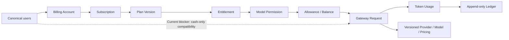

# Ink Memory Admin PRD v3 — 平台总纲

> 版本：3.1  
> 更新：2026-08-09  
> 状态：Current 实现基线 + Target 产品合同；只有通过 Release Gate 的能力可宣称发布  
> 详细需求：[`docs/prd/modules/`](modules/)  
> 全局交互规范：[`docs/design/refine-admin-ui-v3-interaction-design.md`](../design/refine-admin-ui-v3-interaction-design.md)

## 0. 状态与本轮范围

| 分层 | 本文定义 |
|---|---|
| **Current** | Admin 已有 Plan/Version/Entitlement/Subscription/Allowance、Gateway、Usage/Ledger 基线，但仍有 canonical 用户反查、前 50/100 条 selector、cash-only 放行、402 单位与终态不可变等缺口；Dream 仍运行 SQLite、静态订阅页和直连 Provider 链路。 |
| **Target** | 单一 PostgreSQL `ink-memory`、唯一 canonical `users`、自动计费身份、版本化套餐/权益/定价、完整订阅状态机、Dream 产品 API、严格 Gateway 资格与结算、PaymentAdapter/Webhook 幂等边界。 |
| **Release Gate** | 43+5 迁移演练、产品 API/页面、Gateway canary、财务守恒/不可变、Secret 治理、隔离 PostgreSQL 及 1440×1000/390×844 自动化验证全部通过；未过不得把 Target 写成 Implemented。 |
| **Deferred** | 真实 Stripe/支付宝/微信支付/银行等渠道，以及尚无 streaming-audio capability/计量合同的 ASR Gateway 接入。PaymentAdapter 接口、Webhook event store 和 test-only Fake Adapter **不属于 Deferred**。 |

## 1. 产品定位

Ink Memory Admin 是剧本业务运营控制台、AI 模型控制面、订阅计费后台和安全治理入口。主要操作者是内容运营、模型运营、财务运营、客服支持、安全审计与 Super Admin；它不是 Dream 创作前台，不恢复已移除的 PWA。

平台的 Target 主链必须完成以下闭环：

## 2. 不可变产品决策

1. PostgreSQL `users` 是唯一平台用户全集；所有平台用户天然可订阅、持有计费账户、获得 Gateway Key 并产生 Usage/Ledger。不存在独立“计费用户”。
2. `platform_users` 仅是现有 Gateway/Billing 文本外键的内部一对一兼容键，由迁移与 trigger 自动维护，不作为产品主数据或手工开户入口。
3. Dream 权威业务表使用真实原名；Admin 不读取错误平行 Story 表，不修改 Dream 仓库。缺表时 503 fail-closed，不回退 SQLite、JSON 或内存数据。
4. 只有一个 PostgreSQL 数据库 `ink-memory`，但 Dream 与 Admin 使用独立 Repository、连接池、数据库角色和迁移日志；不共享超权限运行角色。Admin Route Handler 只做 Session/RBAC、Origin、解析、Zod 和 service 调用；SQL、事务与状态机位于 `app/lib/**`。
5. 金额事实为整数 micro-USD；Plan Version、Entitlement 和 Pricing 版本不可覆盖；Usage、Ledger、Subscription Event 与 Audit 只追加或终态不可变，纠错只能新增 refund/reversal。
6. Provider/System/Payment Secret 永不由读取接口返回；Gateway Key 明文仅在创建响应返回一次，之后永不重读。这些 Secret 均不得明文落库、写日志、遥测或自动化截图；人工视觉验收只使用明确的脱敏测试值。
7. Dream 浏览器只调 Dream 同源 BFF；Dream 服务端使用最小权限服务身份调用 Admin 产品 API 和 Gateway。浏览器不持有 Gateway Key、Provider Secret 或服务间凭据。
8. 真实支付渠道延期；Target 仅实现渠道中立 PaymentAdapter、Webhook 签名/事件幂等边界和测试环境 Fake Adapter。生产启用 Fake Adapter 必须启动失败，UI 不得展示虚假“支付成功”。
9. 不使用假数据、虚构 KPI 或没有真实 API/领域行为的 CRUD 外壳。

Current 存在一项明确的迁移兼容缺口：**从未拥有任何订阅记录**的平台用户会继续沿用既有 cash balance-only Gateway 策略；一旦用户存在订阅记录，即按订阅状态与权益强制校验。该路径无开关、无退出日期，不是 Target 产品规则；必须先建默认订阅/人工授权数据策略和用户级 canary，再删除放行。

## 3. 模块地图

| 模块 | PRD | 主要路由 | Current / Target（2026-08-09） |
|---|---|---|---|
| 平台基础与总览 | [00-platform-foundation](modules/00-platform-foundation.md) | `/admin`、登录与 Shell | Shell/登录/真实 Story 快照已实现；Gateway/计费摘要和页面级 permission guard 未完成 |
| 平台用户 | [01-platform-users](modules/01-platform-users.md) | `/admin/resources/users` | Current 有 canonical 投影基线；Target 是所有 selector 服务端搜索/分页和所有命令反查 canonical 用户 |
| Dream 创作运营 | [02-story-operations](modules/02-story-operations.md) | `/admin/story/**` | Current 只有 canonical 三表基线；Target 是 Dream-owned 43+5 PG 后的批准读/白名单命令 |
| 订阅与权益 | [03-subscriptions](modules/03-subscriptions.md) | `/admin/subscriptions/**` | Current 是部分状态机；Target 包含自动周期推进、真正撤销取消、Dream 产品 API 与 Payment 协作 |
| 模型供应链 | [04-model-catalog](modules/04-model-catalog.md) | `/admin/models/**` | Current 有 Provider/Model/Pricing；Target 保持不可覆盖快照并为 Dream 发布可用 alias |
| Gateway | [05-gateway](modules/05-gateway.md) | `/admin/gateway/**`、`/v1/**` | Current 是可复用基线；Target 移除 cash-only 默认放行、修正 canonical/402/终态并接管 Dream 推理 |
| Usage、账务与支付协作 | [06-billing](modules/06-billing.md) | `/admin/billing/**` | Current 有 Usage/账户/Ledger/报表/credit；Target 补 refund/reversal、终态不可变和 PaymentAdapter/Webhook |
| Storage | [07-storage](modules/07-storage.md) | `/admin/resources/storage`、`/api/storage/**` | 已实现 |
| 权限与系统治理 | [08-governance](modules/08-governance.md) | `/admin/access/**`、`/admin/system/**` | 已实现；Settings 当前不在主导航 |

专项历史文档继续作为证据，不是平台入口：旧版 [AI 平台控制面设计](../design/ai-platform-admin-billing-gateway-design.md) 已标记 superseded，Gateway 完整报文条款已收敛到 [Gateway PRD](modules/05-gateway.md) 与 [Gateway 交互规范](../design/modules/05-gateway.md)；v2 保留为历史基线，不再新增跨模块需求。

## 4. 角色与权限原则

| 角色 | 默认职责 | 禁止越界 |
|---|---|---|
| Super Admin | 全模块、RBAC、Secret、财务高风险命令 | 不能改写 Ledger/Audit/历史版本 |
| Operator | Story、模型、订阅、Gateway 日常运营 | 默认无 `billing.adjust`、`access.write`、`gateway.payloads.read` |
| Auditor | 读取运营事实、RBAC、Audit、受保护 Payload | 不执行写操作 |

服务端权限码按模块使用：`dashboard.*`、`story.*`、`users.*`、`subscriptions.*`、`providers.*`、`models.*`、`pricing.*`、`gateway.*`、`billing.*`、`storage.*`、`access.*`、`system.*`、`audit.*`。客户端隐藏按钮只是可用性优化，不是授权边界。

## 5. 全局状态契约

| 状态 | 产品表现 | 恢复路径 |
|---|---|---|
| Loading | 保留页头、筛选和表头的等高骨架 | 不跳焦；超时说明仍在加载 |
| Empty | 区分系统无数据与筛选无结果 | 创建（仅允许域）、清筛或返回上层 |
| 400 | 错误摘要与字段错误，保留草稿 | 聚焦首错 |
| 401 | 清除保护内容并进入登录 | 登录后安全返回原 URL |
| 402 | 订阅额度或账户余额不足 | 展示下次重置、升级或账户处理入口 |
| 403 | 显示所需 permission，不泄露记录 | 返回可访问模块或申请权限 |
| 404 | 资源不存在或不可见 | 返回模块列表 |
| 409 | 展示最新状态、冲突对象和 request ID | 刷新/载入最新值后重试，不盲写 |
| 429 | Gateway 请求/Token 限额 | 显示 Retry-After/窗口与实际可用配置入口；实时计数只读 |
| 502 | 上游 Provider/支付 Adapter 调用失败 | 区分 retryable 与终态失败；保留 request/event ID，不显示虚假成功 |
| 500 | 安全错误摘要和 request ID，不展示 SQL/stack/Secret | 重试或复制 request ID 联系支持 |
| 503 | 数据源或依赖不可用 | 明确依赖与重试；禁止假数据回退 |
| Success | 显示资源 ID、实际结果、审计/幂等回执 | 刷新受影响查询并合理归焦 |

## 6. 跨模块数据与调用边界

| 数据域 | 权威表/服务 | 写入者 | 消费模块 |
|---|---|---|---|
| 平台用户 | `users` | Dream/迁移；Admin 业务字段只读 | 用户、订阅、Gateway、账务 |
| Story | `story_workspace_*` | Dream；Admin 仅受控字段/确认命令 | Story、总览 |
| 订阅 | `subscription_*` | Subscription service | Gateway、账务、用户详情 |
| 模型供应链 | `ai_providers/models/pricing_rules` | Model services | Gateway、订阅权益、Usage |
| Gateway 事实 | `gateway_*`、payload tables | Gateway lifecycle | Usage、审计、支持排障 |
| 财务事实 | `billing_accounts`、`billing_ledger_entries` | Billing transaction services | Billing、订阅、Gateway |
| 支付协作 | Target Payment intent/reference、Webhook event store | Payment orchestration + Adapter | 订阅、账务、Audit；Dream 只读真实状态 |
| 治理 | `admin_*`、`system_settings` | Admin security services | 全模块 |

## 7. 发布与回滚

### 7.1 当前已知发布缺口

| 级别 | 缺口 | 发布要求 |
|---|---|---|
| P0 | Gateway Key 认证当前只关联 `platform_users`，未反向 JOIN canonical `users`；`0015` 会补齐 canonical 行但不清理历史 orphan。旧 orphan 若仍有 active Key/余额，可能同时绕过 canonical 用户和订阅主路径 | Gateway auth 强制验证 canonical `users` 存在；在隔离库先审计、停用或映射 orphan，禁止直接删除有财务历史的行 |
| P0 | Token allowance 耗尽时，当前 402 可能把 Token 数写入 `available_microusd/required_microusd` | 错误载荷必须增加明确 `metric/unit`，Token 与 micro-USD 使用不同字段；协议与 Dream 错误处理同步回归 |
| P1 | 无订阅历史用户仍走 cash-only 兼容路径，且无开关/退出日期 | 明确迁移策略后以 cohort 灰度移除，不得当作独立计费用户模型 |
| P1 | 生命周期没有周期推进任务；`cancel_at_period_end` 不能通过 resume 恢复，只能 renew/upgrade 且会收费/重开周期 | 补状态推进 worker 与真正的取消恢复命令，或在 UI 明确当前限制 |
| P1 | 订阅开通与人工 credit 的用户选择器各只加载前 100 条 | 改为 canonical 用户服务端搜索/分页 |
| P1 | Dashboard UI 未呈现 API 已返回的模型、请求、Token、费用和结算失败；页面 Shell 仅做登录/启用检查，模块权限主要由 API 403 保证 | 补真实摘要和页面级 permission guard；完成前不得宣称页面直接访问返回 403 |
| P0 | Dream 仍使用 43+5 SQLite、静态订阅和直连 Provider，且存在已提交 credential 与未鉴权 ASR WebSocket | 完成 48 表 Alembic/Repository/演练并移除运行时 fallback；密钥所有者吊销/轮换、secret scan 通过；ASR 发布前禁用或补 canonical 鉴权/Origin/限流/审计 |
| P0 | Dream 产品 API、真实订阅页、PaymentAdapter/Webhook event store 均不存在 | 完成服务间身份、幂等命令、签名边界、重放和生产 Fake Adapter 禁用测试；页面不留静态 fallback |
| P0 | 已 settle Request/Usage 的数据库终态不可变 guard 与 refund/reversal 守恒未齐 | 增加数据库约束/事务命令、并发与属性测试；禁止通用 UPDATE/DELETE 历史事实 |

- Schema 只做增量、非破坏迁移；旧平行表停止使用但不在本轮删除。
- Plan Version、Pricing snapshot、Usage、Ledger、Audit 和 Subscription Event 不回滚为旧内容；问题使用向前修复或 reversal。
- 新模块按“隔离库演练 → 只读 shadow comparison → 小范围运营写入 → Gateway 用户级 canary → 全量”灰度。先 shadow eligibility 不扣费，再受控 reserve/capture/release。
- 数据库测试只允许明确一次性 PostgreSQL 或 `TEST_DATABASE_URL`；不得迁移、清空或删除未知共享数据库。
- Dream 43+5 PostgreSQL、真实订阅体验、计费协作与 Gateway 接入已进入 Target 实施范围，遵循 [`ink-dream-memory/README.md`](../architecture/ink-dream-memory/README.md)。本文不授权把逻辑 owner 当作 `ALTER OWNER`/GRANT/REVOKE 授权；迁移前必须只读盘点真实 owner/ACL/约束/已有数据。
- PG cutover 后产生新业务写时默认向前修复；只有预先演练的旧功能+PG Repository build 或受验证 PG→SQLite delta exporter 才允许回切，不得丢弃 PG 新写。

## 8. 平台级验收

- 每个平台用户自动拥有唯一内部兼容键和唯一计费账户；任何用户选择器不依赖手工开户，并以至少 205 用户验证服务端搜索、跨页选中和稳定 total。Current 前 50/100 条缺口未修前不通过。
- 所有列表具备真实总数、服务端分页/排序、白名单筛选和明确错误映射。
- 401/402/403/404/409/429/502/503 均有单一 HTTP/code/unit 映射、幂等恢复和 Dream UI 合同；上游失败、cancel、流中断、usage 缺失不按 0 成功结算。
- Target 主路径按 `User → Billing Account → Subscription → Plan Version → Entitlement → Model Permission → Allowance/Balance → Request → Usage → Ledger` 执行并冻结快照；发布前 cash-only 默认放行必须经 canary 退出，不能变成长期分支。
- Provider/System/Payment Secret 不出现在详情、API 重读、日志、DOM、遥测或自动化截图；Gateway Key 明文只存在于一次性创建回执。Usage/Ledger/Audit/Subscription Event/Webhook Event 无通用更新/删除。
- 重复订阅命令、重复 Webhook、并发升级和 reserve/capture/release/refund/reversal 均有竞态/属性测试；生产 Fake Adapter 启动失败，不发起真实支付网络请求。
- 1440×1000 与 390×844 无页面级横向溢出，键盘、焦点、label、状态文字和读屏通知可用。
- `pnpm env:check`、TypeScript、lint、unit、build、隔离 PostgreSQL与 focused Playwright 通过；Storage、PWA 404 和 Dream 真实表回归不退化。

## 9. 文档维护规则

- 新需求先进入对应模块；只有跨三个以上模块的决策才修改本总纲。
- PRD 描述“为什么、范围、规则与验收”；交互规范描述“页面如何工作”；实现细节只保留足以建立可测试契约的映射。
- 模块 PRD 与对应交互文档必须双向链接，状态、路由、权限、表名、金额单位和验收编号一致；`00-platform-foundation` 对应 `00-admin-shell`，其余模块使用同名文件。
- 变更不得覆盖历史文档；过时内容标记 superseded，并从本索引移除主入口。
