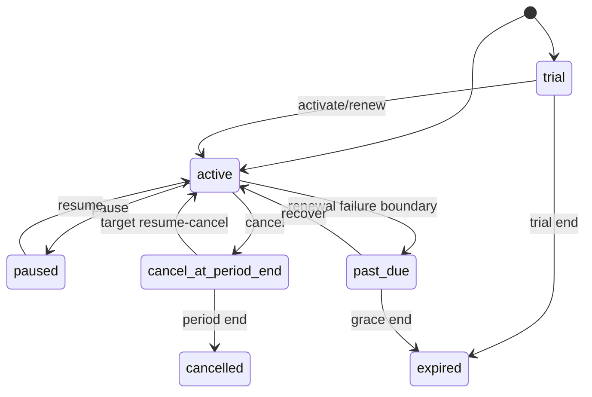

# 模块 PRD：订阅、套餐版本与权益

> 返回：[平台 PRD 总纲](../ink-memory-admin-prd-v3.md) · 交互：[订阅中心](../../design/modules/03-subscriptions.md)

> 实现状态：Schema、API、基础运营 UI、开通/续费/升级/降级/暂停/有限恢复/期末取消、Allowance 与 Gateway 资格/结算已实现；自动周期推进、真正撤销期末取消、聚合详情、账务影响预览和外部支付未实现。

## 0. Current / Target / Release Gate

| 分层 | 范围 |
|---|---|
| Current | Admin 有版本/权益 Schema 与部分生命周期命令；无自动周期推进、真正撤销期末取消、Dream 产品 API、PaymentAdapter/Webhook。cash-only 默认放行仍存在。 |
| Target | 完整 trial/active/past_due/paused/cancel_at_period_end/cancelled/expired 状态机，不可覆盖 Version/Entitlement，自动周期任务，Dream 只读/命令 API，渠道中立 Payment 协作。 |
| Release Gate | 全生命周期、并发升降级、重复命令/Webhook、Allowance 守恒、审计和 Dream UI 两视口通过；计费真值不在 Dream 复制，cash-only 兼容已经 canary 退出。 |

## 1. 目标

为所有平台用户提供可版本化、可审计、可驱动 Gateway 资格判断的订阅体系。当前由运营 Admin 执行生命周期命令；第三方支付未接入，只保留 PaymentAdapter/Webhook 幂等边界。

## 2. 产品对象

| 对象 | 核心规则 |
|---|---|
| Plan | code/name/status/currency；code 稳定，停用不删除历史 |
| Plan Version | 周期、基础价、trial、allowance、overage 的不可覆盖快照；发布后不可修改/删除 |
| Entitlement | 版本允许的 model/scope、RPM、Token/Storage 配额；发布后不可变 |
| Subscription | 用户、当前版本、状态、周期、续费与 pending change；事务状态机 |
| Allowance | 周期 granted/reserved/consumed 金额或 Token 守恒 |
| Event | 生命周期命令的 append-only 幂等事实 |

## 3. 页面与权限

| 页面 | 路由 | 权限 |
|---|---|---|
| 套餐 | `/admin/subscriptions/plans` | `subscriptions.read`、`subscriptions.write` |
| 版本 | `/admin/subscriptions/versions` | `subscriptions.read`、`subscriptions.write` |
| 权益 | `/admin/subscriptions/entitlements` | `subscriptions.read`、`subscriptions.write` |
| 用户订阅 | `/admin/subscriptions/users` | `subscriptions.read`、`subscriptions.write` |

对应 Resources 为 `subscription-plans`、`subscription-plan-versions`、`subscription-entitlements`、`subscriptions`、`subscription-allowances`、`subscription-events`；领域逻辑位于 `app/lib/subscriptions/**`。

## 4. 生命周期

上图是完整目标状态机。当前实现不会自动产生 `past_due`，也没有调度任务推进 `cancel_at_period_end → cancelled`、`trial/past_due → expired`。当前 `resume` 只接受 `paused/past_due`；`cancel_at_period_end` 只能通过 `renew/upgrade` 回到 active，并会按规则收费/重开周期，因此不是“无账务影响的撤销取消”。

升级立即以目标版本全额基础价扣费，不按剩余周期 prorate、不退旧周期费用；升级时从当前时间建立新的目标周期并发放目标版本完整 Allowance。降级仅写入 pending version，在下一次续费时生效；续费从当前周期末（尚未结束）或当前时间（已结束）建立新周期并全额扣费/发放 Allowance。暂停阻止 Gateway；真正的期末取消恢复和自动状态推进属于待实现能力。

所有生命周期命令要求 reason 与 idempotency key。当前并发语义为数据库事务 + `FOR UPDATE` 悲观行锁 + 状态再次校验；请求合同没有 `expectedVersion` 字段。相同幂等键返回原事件结果，合法但已变化的状态返回 409。

Target 增加乐观 `version`/ETag 作为产品 API 并发预期，但不改变数据库行锁和事务内重校验。同一 idempotency key + 同 digest 返回原结果；同 key 异 payload 返回 409，不视为新命令。

## 5. Gateway 资格

`User → active/trial/cancel_at_period_end Subscription → published Version → Entitlement → User Model Override → Allowance/Overage → Gateway Request`。

当前实现保留一项迁移兼容缺口：若用户**从未拥有任何订阅记录**，Gateway 返回空订阅资格并继续使用既有 cash balance-only 策略；一旦存在任意订阅记录，`paused/cancelled/expired`、宽限期外的 `past_due` 或其他无资格状态均不得静默放行。宽限期内的 `past_due` 按当前实现仍可调用。当前无 feature flag 或结束日期；Target 必须以显式 cohort flag + 默认订阅/人工授权数据策略分阶段关闭，最终删除默认放行。

## 6. Dream 产品 API（Target，尚未实现）

Dream 浏览器只调 Dream 同源 BFF，由 Dream 服务端以最小权限服务身份调用以下 Admin 产品 API。canonical user 由已鉴权会话/服务主体绑定，不信任浏览器提交的用户 ID。

| Target API | 语义 |
|---|---|
| `GET /api/product/v1/plans` | 只返回已发布、当前可售的 Plan Version/Entitlement 投影与 integer micro-USD；不返回静态 fallback。 |
| `GET /api/product/v1/me/subscription-context` | 当前 Subscription/周期/续费/pending change、Allowance、cash balance 及可执行 actions；带 `version`/ETag。 |
| `GET /api/product/v1/me/usage` | 分页 Usage 与聚合、时区/时间窗、预计超额所需的真实输入。 |
| `GET /api/product/v1/me/ledger` | 分页、只读、可追溯 Ledger 投影；不包含管理员内部安全字段。 |
| `GET /api/product/v1/me/model-catalog` | 只返回当前订阅+用户例外实际可用的 stable alias/label/capability/limit 投影。 |
| `POST /api/product/v1/me/subscription-commands` | `open/renew/upgrade/downgrade/pause/resume/cancel/revoke_cancel`；要求 Idempotency-Key、reason、expected version 和影响确认摄取值。 |

API 使用 401 表示服务/用户身份缺失，402 表示额度/余额不足且显式带 `metric/unit`，403 表示权益/状态不允许，404 表示套餐/订阅资源不存在，409 表示幂等/版本/并发冲突，429 表示限流，502 表示上游 Adapter/Provider，503 表示配置、数据库或维护不可用。

## 7. Payment 协作（Target，真实渠道 Deferred）

- `PaymentAdapter` 只暴露渠道中立 capability、intent/reference、authorize/capture/cancel/refund/reversal 与 webhook signature verification 合同，不把 Stripe/支付宝字段变成核心模型。
- Webhook event 先按 adapter + external event ID 唯一持久化，验签后才处理；同 ID + 同 digest 幂等返回原结果，异 digest 409/安全事件。重放不得重复开通、扣费或退款。
- 没有真实支付渠道时，订阅只能经 Admin 人工授权或隔离 test/dev 的 Fake Adapter 验证；production 配置 Fake Adapter 必须启动失败。
- Dream 只显示平台已持久的 `pending/authorized/captured/failed/cancelled/refunded/reversed` 等真实状态；网络结果未知不显示“支付成功”。Payment Secret 不明文落库、回显或进日志。

## 8. 验收

- SUB-01：发布后的 Version/Entitlement 在 service 和数据库层拒绝 UPDATE/DELETE。
- SUB-02（当前 release gate）：开通、续费、升级、降级、暂停、从 paused/past_due 恢复、设置期末取消均有成功与冲突测试；UI 不得把 cancel_at_period_end 的 renew/upgrade 表述成免费撤销。
- SUB-02B（目标）：调度器幂等推进 period-end cancellation、trial expiry、past-due grace expiry，并提供真正撤销期末取消命令及并发测试。
- SUB-03：重复 idempotency key 返回原结果，不重复扣费或发放 Allowance。
- SUB-04：Allowance 满足 `granted >= reserved + consumed`；Token 与金额额度不混写。
- SUB-05：暂停/过期/模型不允许/额度耗尽在调用 Provider 前按 [Gateway 拒绝与错误契约](05-gateway.md#6-gateway-拒绝与错误契约) 返回唯一 HTTP/code 映射并留下规定证据。
- SUB-06（Current regression）：在 canary 移除前，只有从未订阅用户可走 cash-only，已有记录者不得绕过状态/权益；该测试不把兼容路径固化为 Target。
- SUB-07（Target release gate）：上述六个 Dream 产品 API 通过 service identity、canonical user、ETag/幂等、401/402/403/404/409/429/502/503 contract 测试；浏览器提交他人 user ID 无效。
- SUB-08（Target release gate）：Webhook 重复/异 digest/乱序投递不重复开通或扣费；Fake Adapter 仅 test/dev 可用，真实网络请求为 0。
- SUB-09（Target release gate）：自动周期推进、真正 `revoke_cancel`、past_due 宽限期、同时升级/续费与重复 Webhook 竞态有确定单一结果。

交互验收映射：SUB-01 → UI-SUB-02；SUB-02/03/09 → UI-SUB-01/04 + API/数据库断言；SUB-04/05 → UI-SUB-03 + Gateway 集成测试；SUB-07/08 → UI-SUB-05/06 + 产品 API/Payment contract。SUB-02B 目前是 Target，完成前不得把完整生命周期标为 Implemented。
